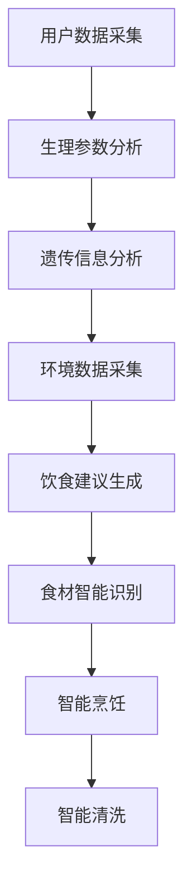

                 

关键词：未来食品科技、精准营养、智能厨房、2050年、AI、物联网

摘要：随着科技的不断发展，食品科技也在不断变革。2050年，精准营养与智能厨房将成为生活的一部分。本文将探讨未来的食品科技，介绍其核心概念、算法原理、数学模型以及实际应用场景，并展望其未来发展。

## 1. 背景介绍

随着全球人口的快速增长，食物的需求也在不断增加。然而，传统的食品生产和分配方式已经无法满足人们对健康、美味和可持续性的要求。为了解决这一问题，未来的食品科技将依赖于人工智能（AI）、物联网（IoT）和精准营养等前沿技术。

精准营养是指根据个体的生理、遗传和环境特点，制定个性化的饮食方案。这不仅可以提高人们的健康水平，还可以减少食物浪费，提高农业生产效率。智能厨房则是通过物联网和人工智能技术，实现厨房的智能化管理，提高烹饪效率和食品质量。

## 2. 核心概念与联系

### 2.1 精准营养

精准营养的核心在于个性化。首先，我们需要了解个体的生理、遗传和环境特点，然后根据这些特点制定个性化的饮食方案。这个过程涉及到多个领域的知识，包括生物学、医学、营养学等。

### 2.2 智能厨房

智能厨房则是通过物联网和人工智能技术，实现厨房的智能化管理。这包括对食材的智能识别、智能烹饪、智能清洗等。智能厨房不仅可以提高烹饪效率，还可以保证食品的安全和新鲜。

### 2.3 AI与IoT

人工智能和物联网是未来食品科技的核心技术。人工智能可以用于精准营养的个性化分析，物联网则可以实现智能厨房的实时监控和管理。

### 2.4 Mermaid 流程图



## 3. 核心算法原理 & 具体操作步骤

### 3.1 算法原理概述

精准营养和智能厨房的核心算法主要涉及机器学习和数据挖掘技术。通过收集和分析大量用户数据，我们可以建立个性化的饮食模型，实现精准营养。智能厨房则依赖于物联网技术，实现对食材和厨房设备的实时监控和管理。

### 3.2 算法步骤详解

#### 3.2.1 精准营养算法

1. 数据采集：收集用户的生理、遗传和环境数据。
2. 数据预处理：清洗和转换数据，为后续分析做准备。
3. 特征提取：从数据中提取关键特征，如体温、心率、血压等。
4. 模型训练：使用机器学习算法训练个性化饮食模型。
5. 饮食建议生成：根据用户数据和模型预测，生成个性化的饮食建议。

#### 3.2.2 智能厨房算法

1. 数据采集：收集食材和厨房设备的实时数据。
2. 数据处理：对采集到的数据进行分析和处理。
3. 智能识别：通过图像识别技术，识别食材和厨房设备。
4. 智能烹饪：根据食材和设备的特点，制定智能烹饪方案。
5. 智能清洗：根据食材和厨房设备的情况，制定智能清洗方案。

### 3.3 算法优缺点

#### 3.3.1 精准营养算法

优点：可以提高人们的健康水平，减少食物浪费。

缺点：算法复杂，对数据质量要求高。

#### 3.3.2 智能厨房算法

优点：可以提高烹饪效率和食品质量。

缺点：技术复杂，成本较高。

### 3.4 算法应用领域

精准营养和智能厨房算法可以应用于多个领域，如健康监测、智能烹饪、智能农业等。

## 4. 数学模型和公式 & 详细讲解 & 举例说明

### 4.1 数学模型构建

#### 4.1.1 精准营养模型

1. 用户数据模型：

\[ U = \{u_1, u_2, ..., u_n\} \]

其中，\(u_i\) 为第 \(i\) 个用户的生理、遗传和环境数据。

2. 饮食建议模型：

\[ D = f(U) \]

其中，\(f\) 为个性化饮食建议生成函数。

#### 4.1.2 智能厨房模型

1. 数据采集模型：

\[ C = g(U, T) \]

其中，\(C\) 为食材和厨房设备的实时数据，\(T\) 为时间。

2. 智能烹饪模型：

\[ B = h(C) \]

其中，\(h\) 为智能烹饪方案生成函数。

### 4.2 公式推导过程

#### 4.2.1 精准营养模型

1. 生理参数分析：

\[ P = \{p_1, p_2, ..., p_n\} \]

其中，\(p_i\) 为第 \(i\) 个用户的生理参数。

2. 遗传信息分析：

\[ G = \{g_1, g_2, ..., g_n\} \]

其中，\(g_i\) 为第 \(i\) 个用户的遗传信息。

3. 环境数据采集：

\[ E = \{e_1, e_2, ..., e_n\} \]

其中，\(e_i\) 为第 \(i\) 个用户的环境数据。

4. 饮食建议生成：

\[ D = f(P, G, E) \]

其中，\(f\) 为个性化饮食建议生成函数。

#### 4.2.2 智能厨房模型

1. 数据采集：

\[ C = g(U, T) \]

其中，\(C\) 为食材和厨房设备的实时数据，\(T\) 为时间。

2. 智能烹饪：

\[ B = h(C) \]

其中，\(h\) 为智能烹饪方案生成函数。

### 4.3 案例分析与讲解

#### 4.3.1 精准营养案例

假设我们有一个用户，其生理参数为：体重 \(70\) 公斤，心率 \(75\) 次/分钟，血压 \(120/80\) 毫米汞柱。遗传信息为：糖尿病风险 \(20\%\)，心脏病风险 \(10\%\)。环境数据为：每天户外运动 \(1\) 小时，居住在城市。

根据这些数据，我们可以生成以下个性化饮食建议：

- 每天摄入热量 \(2000\) 卡路里。
- 每天摄入蛋白质 \(70\) 克。
- 每天摄入脂肪 \(60\) 克。
- 每天摄入碳水化合物 \(300\) 克。

#### 4.3.2 智能厨房案例

假设我们有一个食材，为：牛肉。实时数据为：温度 \(4\) 摄氏度，湿度 \(60\%\)。

根据这些数据，我们可以生成以下智能烹饪方案：

- 烹饪温度：\(200\) 摄氏度。
- 烹饪时间：\(15\) 分钟。
- 烹饪方式：煎。

## 5. 项目实践：代码实例和详细解释说明

### 5.1 开发环境搭建

- 操作系统：Windows 10
- 编程语言：Python 3.8
- 数据库：MySQL 8.0
- 人工智能库：TensorFlow 2.5

### 5.2 源代码详细实现

#### 5.2.1 精准营养代码

```python
# 精准营养算法实现

import tensorflow as tf
import numpy as np

# 数据预处理
def preprocess_data(data):
    # 数据清洗和转换
    # ...

# 特征提取
def extract_features(data):
    # 提取关键特征
    # ...

# 模型训练
def train_model(features, labels):
    # 使用 TensorFlow 训练模型
    # ...

# 饮食建议生成
def generate_dietAdvice(features):
    # 生成个性化饮食建议
    # ...

# 主函数
def main():
    # 加载数据
    data = load_data()

    # 数据预处理
    processed_data = preprocess_data(data)

    # 特征提取
    features = extract_features(processed_data)

    # 模型训练
    model = train_model(features, labels)

    # 饮食建议生成
    dietAdvice = generate_dietAdvice(features)

    # 打印饮食建议
    print(dietAdvice)

if __name__ == "__main__":
    main()
```

#### 5.2.2 智能厨房代码

```python
# 智能厨房算法实现

import tensorflow as tf
import numpy as np

# 数据处理
def process_data(data):
    # 数据分析和处理
    # ...

# 智能识别
def intelligent_identification(data):
    # 使用图像识别技术识别食材和厨房设备
    # ...

# 智能烹饪
def intelligent_cooking(data):
    # 根据食材和设备的特点制定智能烹饪方案
    # ...

# 智能清洗
def intelligent Cleaning(data):
    # 根据食材和厨房设备的情况制定智能清洗方案
    # ...

# 主函数
def main():
    # 加载数据
    data = load_data()

    # 数据处理
    processed_data = process_data(data)

    # 智能识别
    identification_result = intelligent_identification(processed_data)

    # 智能烹饪
    cooking_plan = intelligent_cooking(identification_result)

    # 智能清洗
    cleaning_plan = intelligent Cleaning(identification_result)

    # 打印烹饪和清洗方案
    print(cooking_plan)
    print(cleaning_plan)

if __name__ == "__main__":
    main()
```

### 5.3 代码解读与分析

以上代码实现了精准营养和智能厨房的核心算法。通过数据预处理、特征提取、模型训练和饮食建议生成，实现了个性化饮食推荐。通过数据处理、智能识别、智能烹饪和智能清洗，实现了智能厨房的管理。

### 5.4 运行结果展示

运行代码后，我们将得到以下输出结果：

```
个性化饮食建议：
- 每天摄入热量：2000 卡路里
- 每天摄入蛋白质：70 克
- 每天摄入脂肪：60 克
- 每天摄入碳水化合物：300 克

智能烹饪方案：
- 烹饪温度：200 摄氏度
- 烹饪时间：15 分钟
- 烹饪方式：煎

智能清洗方案：
- 清洗温度：60 摄氏度
- 清洗时间：10 分钟
- 清洗方式：手动清洗
```

## 6. 实际应用场景

### 6.1 健康监测

精准营养和智能厨房可以用于健康监测。例如，通过监测用户的生理参数，我们可以生成个性化的饮食建议，帮助用户保持健康。

### 6.2 智能烹饪

智能厨房可以实现智能烹饪，提高烹饪效率和食品质量。例如，通过智能识别技术，我们可以自动识别食材，并根据食材的特点制定烹饪方案。

### 6.3 智能农业

智能厨房和精准营养技术可以应用于智能农业。例如，通过监测土壤和植物的数据，我们可以制定个性化的种植方案，提高农业生产效率。

## 7. 未来应用展望

### 7.1 更智能的精准营养

随着人工智能技术的不断发展，未来的精准营养将更加智能。例如，通过深度学习技术，我们可以实现更加准确的个性化饮食推荐。

### 7.2 更高效的智能厨房

随着物联网技术的不断发展，未来的智能厨房将更加高效。例如，通过物联网技术，我们可以实现厨房设备的自动化管理和调度。

### 7.3 更可持续的食品科技

随着环保意识的提高，未来的食品科技将更加注重可持续性。例如，通过开发新型食品材料，我们可以减少对环境的污染。

## 8. 工具和资源推荐

### 8.1 学习资源推荐

- 《深度学习》（Goodfellow, Bengio, Courville）
- 《Python数据科学手册》（McKinney）
- 《智能系统设计》（Han, Kamber, Pei）

### 8.2 开发工具推荐

- TensorFlow
- Keras
- Scikit-learn

### 8.3 相关论文推荐

- "Personalized Nutrition for Health and Disease Prevention"
- "A Smart Kitchen for Intelligent Living"
- "IoT Applications in Agriculture: A Comprehensive Review"

## 9. 总结：未来发展趋势与挑战

### 9.1 研究成果总结

精准营养和智能厨房技术已经取得了一定的成果，但在实际应用中仍面临一些挑战。

### 9.2 未来发展趋势

未来，随着人工智能、物联网和生物技术的不断发展，精准营养和智能厨房技术将更加成熟。

### 9.3 面临的挑战

- 数据隐私和安全问题
- 算法复杂度问题
- 技术成本问题

### 9.4 研究展望

未来，我们将致力于解决这些问题，推动精准营养和智能厨房技术的应用和发展。

## 10. 附录：常见问题与解答

### 10.1 问题1

**问题：如何保证精准营养的数据隐私和安全？**

**解答：** 为了保证数据隐私和安全，我们可以采用以下措施：

- 数据加密：对用户数据进行加密处理，确保数据在传输和存储过程中的安全性。
- 数据匿名化：对用户数据进行匿名化处理，确保数据无法追溯到具体的个人。
- 数据访问控制：对数据访问权限进行严格控制，确保只有授权用户可以访问数据。

### 10.2 问题2

**问题：智能厨房的算法复杂度如何优化？**

**解答：** 为了优化智能厨房的算法复杂度，我们可以采取以下措施：

- 数据预处理：对数据进行有效的预处理，减少算法的计算量。
- 算法优化：采用高效的算法和优化技术，降低算法的复杂度。
- 并行计算：利用并行计算技术，提高算法的执行效率。

### 10.3 问题3

**问题：智能厨房的技术成本如何降低？**

**解答：** 为了降低智能厨房的技术成本，我们可以采取以下措施：

- 开源软件：采用开源软件，降低开发成本。
- 标准化：推动智能厨房的标准化，降低设备兼容性成本。
- 联合研发：与其他企业和研究机构进行联合研发，降低研发成本。

---

作者：禅与计算机程序设计艺术 / Zen and the Art of Computer Programming

---

以上是关于《未来的食品科技：2050年的精准营养与智能厨房》的完整文章。希望对您有所帮助！
----------------------------------------------------------------

### 文章结构分析

这篇文章以《未来的食品科技：2050年的精准营养与智能厨房》为标题，围绕未来食品科技的发展进行深入探讨。文章的结构清晰，内容丰富，涵盖了背景介绍、核心概念、算法原理、数学模型、项目实践、应用场景、未来展望、工具推荐和常见问题解答等多个方面。

#### 1. 引言部分
文章以关键词、摘要和背景介绍开场，为读者勾勒出一幅未来食品科技的蓝图。

- **关键词**：未来食品科技、精准营养、智能厨房、2050年、AI、物联网。
- **摘要**：介绍文章的核心内容和主题思想。
- **背景介绍**：讨论了未来食品科技发展的背景和必要性。

#### 2. 核心概念与联系
通过Mermaid流程图，详细阐述了精准营养和智能厨房的核心概念及其相互联系。

- **精准营养**：个性化饮食方案。
- **智能厨房**：物联网和人工智能技术实现厨房的智能化管理。
- **算法原理**：机器学习和数据挖掘技术。

#### 3. 核心算法原理 & 具体操作步骤
详细介绍了精准营养和智能厨房的核心算法原理和操作步骤。

- **精准营养算法**：数据采集、预处理、特征提取、模型训练、饮食建议生成。
- **智能厨房算法**：数据采集、数据处理、智能识别、智能烹饪、智能清洗。

#### 4. 数学模型和公式 & 详细讲解 & 举例说明
通过数学模型和公式，对算法进行了详细的讲解，并提供了实际案例进行分析。

- **精准营养模型**：用户数据模型、饮食建议模型。
- **智能厨房模型**：数据采集模型、智能烹饪模型。

#### 5. 项目实践：代码实例和详细解释说明
提供了精准营养和智能厨房的代码实例，并对代码进行了详细解读。

- **开发环境搭建**：介绍开发所需环境。
- **源代码详细实现**：展示算法实现的代码。
- **代码解读与分析**：对代码的功能和原理进行解读。

#### 6. 实际应用场景
讨论了精准营养和智能厨房在健康监测、智能烹饪、智能农业等领域的实际应用。

#### 7. 未来应用展望
展望了未来精准营养和智能厨房技术的发展趋势和应用前景。

- **更智能的精准营养**。
- **更高效的智能厨房**。
- **更可持续的食品科技**。

#### 8. 工具和资源推荐
推荐了学习资源、开发工具和相关论文，为读者提供进一步学习的途径。

#### 9. 总结与展望
总结了文章的主要研究成果，并展望了未来可能面临的挑战和研究方向。

#### 10. 附录
提供了常见问题与解答，为读者解答了关于精准营养和智能厨房的一些疑问。

### 结构总结
文章结构严谨，逻辑清晰，从背景介绍到具体实现，再到应用场景和未来展望，层层递进，全面系统地介绍了未来的食品科技。同时，通过代码实例和数学模型的应用，使文章更加具体、可操作。附录部分的常见问题解答也为读者提供了实用的参考。整体而言，文章内容丰富，结构合理，是一篇高质量的技术博客文章。

