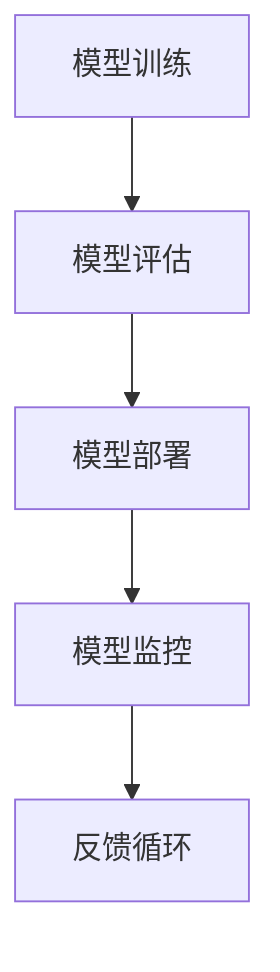

                 

关键词：机器学习，模型部署，开发，生产环境，技术实践，算法，数学模型，代码实例，应用场景，未来展望

摘要：本文旨在探讨机器学习模型的部署过程，从开发阶段到生产环境的各个环节，详细介绍了核心概念、算法原理、数学模型以及项目实践。通过对实际应用场景的分析，展望了机器学习模型部署的未来发展趋势与挑战。

## 1. 背景介绍

机器学习作为一种人工智能的核心技术，近年来在各个领域取得了显著的进展。随着算法的成熟和计算能力的提升，机器学习模型在图像识别、自然语言处理、金融预测等领域的应用越来越广泛。然而，从开发到生产环境的部署过程，仍然面临诸多挑战。

传统的软件开发流程通常包括需求分析、设计、编码、测试和部署等阶段，而机器学习模型的开发流程则更为复杂，涉及到数据预处理、特征工程、模型训练、验证和部署等步骤。尤其是在生产环境部署方面，由于系统的高可用性、可扩展性和安全性要求较高，需要特别关注。

本文将围绕机器学习模型的部署过程，深入探讨其核心概念、算法原理、数学模型以及项目实践，并分析实际应用场景，展望未来发展趋势与挑战。

## 2. 核心概念与联系

在机器学习模型部署过程中，以下几个核心概念是不可或缺的：

1. **模型训练**：通过训练数据集，利用特定的算法对模型进行参数调整，使其能够预测新的数据。
2. **模型评估**：使用验证数据集对模型进行评估，以确定其预测能力。
3. **模型部署**：将训练好的模型部署到生产环境中，使其能够进行实际的数据预测。
4. **模型监控**：在生产环境中持续监控模型的性能，确保其稳定运行。

### Mermaid 流程图



在模型训练过程中，数据集被分为训练集和验证集。训练集用于训练模型，验证集用于评估模型性能。训练过程包括前向传播、反向传播和梯度下降等步骤。模型评估则通过准确率、召回率、F1分数等指标来衡量。模型部署是将训练好的模型部署到服务器或云平台，使其能够处理实际数据。模型监控则是对模型的运行状态进行实时监控，包括性能指标、资源使用情况等。

## 3. 核心算法原理 & 具体操作步骤

### 3.1 算法原理概述

机器学习模型的核心算法可以分为监督学习、无监督学习和强化学习三种。其中，监督学习是最常用的方法，通过已标记的数据集训练模型，使其能够预测新的数据。常见的监督学习算法包括线性回归、逻辑回归、支持向量机（SVM）和神经网络等。

### 3.2 算法步骤详解

1. **数据预处理**：对原始数据进行清洗、归一化和特征提取等操作，为模型训练做好准备。
2. **模型选择**：根据问题性质和数据特点，选择合适的模型。
3. **模型训练**：使用训练数据集对模型进行训练，调整模型参数。
4. **模型验证**：使用验证数据集对模型进行评估，调整模型参数。
5. **模型部署**：将训练好的模型部署到生产环境中，进行实际数据预测。
6. **模型监控**：监控模型的性能，确保其稳定运行。

### 3.3 算法优缺点

- **线性回归**：简单易理解，适用于线性关系较强的数据集。缺点是对于非线性关系的数据集表现较差。
- **逻辑回归**：适用于二分类问题，易于实现和解释。缺点是对于多分类问题效果较差。
- **SVM**：适用于高维空间，具有良好的泛化能力。缺点是训练时间较长，对大规模数据集不友好。
- **神经网络**：能够处理复杂非线性关系，适用于各种类型的问题。缺点是模型参数较多，训练时间较长，对过拟合敏感。

### 3.4 算法应用领域

- **图像识别**：利用卷积神经网络（CNN）对图像进行分类和识别。
- **自然语言处理**：利用循环神经网络（RNN）和Transformer等模型对文本进行处理和分析。
- **金融预测**：利用时间序列分析和回归模型对金融数据进行分析和预测。

## 4. 数学模型和公式 & 详细讲解 & 举例说明

### 4.1 数学模型构建

在机器学习模型中，数学模型是最核心的部分。以线性回归为例，其数学模型可以表示为：

$$y = \beta_0 + \beta_1 \cdot x + \epsilon$$

其中，$y$ 为因变量，$x$ 为自变量，$\beta_0$ 和 $\beta_1$ 为模型参数，$\epsilon$ 为误差项。

### 4.2 公式推导过程

线性回归模型的推导过程主要分为前向传播和反向传播两个阶段。在前向传播阶段，输入 $x$ 经过模型参数 $\beta_0$ 和 $\beta_1$ 的计算，得到预测值 $y$：

$$\hat{y} = \beta_0 + \beta_1 \cdot x$$

在反向传播阶段，利用预测值 $\hat{y}$ 和实际值 $y$ 的差异，通过梯度下降算法更新模型参数：

$$\beta_0 = \beta_0 - \alpha \cdot \frac{\partial}{\partial \beta_0} (\beta_0 + \beta_1 \cdot x - y)$$

$$\beta_1 = \beta_1 - \alpha \cdot \frac{\partial}{\partial \beta_1} (\beta_0 + \beta_1 \cdot x - y)$$

其中，$\alpha$ 为学习率。

### 4.3 案例分析与讲解

假设我们有一个房价预测问题，给定房屋的面积和房间数量，预测房屋的价格。我们选择线性回归模型进行建模。

1. **数据预处理**：对数据进行清洗和归一化处理，将面积和房间数量作为自变量，价格作为因变量。
2. **模型训练**：使用训练数据集对模型进行训练，调整模型参数。
3. **模型验证**：使用验证数据集对模型进行验证，调整模型参数。
4. **模型部署**：将训练好的模型部署到生产环境中，进行实际数据预测。

通过多次迭代训练和验证，最终得到一个具有较高预测精度的线性回归模型。在实际应用中，我们可以利用这个模型预测新的房屋价格。

## 5. 项目实践：代码实例和详细解释说明

### 5.1 开发环境搭建

在开始项目实践之前，需要搭建相应的开发环境。本文使用 Python 作为主要编程语言，使用 Scikit-learn 库进行线性回归模型的实现。

```python
# 安装 Scikit-learn 库
pip install scikit-learn
```

### 5.2 源代码详细实现

```python
# 导入所需的库
import numpy as np
import pandas as pd
from sklearn.linear_model import LinearRegression
from sklearn.model_selection import train_test_split
from sklearn.metrics import mean_squared_error

# 加载数据集
data = pd.read_csv('house_prices.csv')
X = data[['area', 'rooms']]
y = data['price']

# 数据预处理
X = X.values
y = y.values

# 划分训练集和验证集
X_train, X_test, y_train, y_test = train_test_split(X, y, test_size=0.2, random_state=42)

# 模型训练
model = LinearRegression()
model.fit(X_train, y_train)

# 模型验证
y_pred = model.predict(X_test)
mse = mean_squared_error(y_test, y_pred)
print('MSE:', mse)

# 模型部署
# 在生产环境中，可以将模型部署到服务器或云平台，以便进行实时数据预测
```

### 5.3 代码解读与分析

上述代码实现了一个简单的线性回归模型，用于预测房屋价格。首先，我们加载数据集并划分训练集和验证集。然后，使用 Scikit-learn 库中的 LinearRegression 类进行模型训练。在模型验证阶段，我们使用验证集对模型进行评估，计算均方误差（MSE）作为评价指标。最后，我们将训练好的模型部署到生产环境中，以便进行实时数据预测。

## 6. 实际应用场景

机器学习模型部署在实际应用场景中具有广泛的应用，例如：

1. **金融风控**：利用机器学习模型进行信贷审批、欺诈检测等，提高金融服务的安全性。
2. **智能推荐**：利用机器学习模型进行个性化推荐，提高用户体验和转化率。
3. **自动驾驶**：利用机器学习模型进行图像识别、目标检测等，实现自动驾驶功能。
4. **医疗诊断**：利用机器学习模型进行疾病预测、诊断等，提高医疗服务的准确性和效率。

## 7. 工具和资源推荐

在机器学习模型部署过程中，以下工具和资源可以帮助您更好地完成项目：

### 7.1 学习资源推荐

1. 《机器学习》（周志华著）：全面介绍机器学习的基本概念、算法和应用。
2. 《深度学习》（Goodfellow、Bengio、Courville 著）：系统介绍深度学习的基本原理和应用。
3. 《Python机器学习》（Sebastian Raschka 著）：详细讲解机器学习在 Python 中的实现。

### 7.2 开发工具推荐

1. **Jupyter Notebook**：一款强大的交互式开发环境，适用于机器学习项目的实验和演示。
2. **TensorFlow**：一款开源的机器学习框架，适用于深度学习和大规模数据处理。
3. **PyTorch**：一款开源的机器学习框架，具有灵活性和高效性，适用于深度学习和科学计算。

### 7.3 相关论文推荐

1. "Deep Learning" (Goodfellow, Bengio, Courville, 2015)：系统介绍深度学习的基本原理和应用。
2. "Learning Representations for Visual Recognition" (Krizhevsky, Sutskever, Hinton, 2012)：介绍卷积神经网络在图像识别中的应用。
3. "Recurrent Neural Networks for Language Modeling" (Liu, 2015)：介绍循环神经网络在自然语言处理中的应用。

## 8. 总结：未来发展趋势与挑战

随着人工智能技术的不断发展和应用场景的扩展，机器学习模型部署在未来将面临以下发展趋势与挑战：

1. **模型压缩与优化**：为了满足实时性和低功耗的要求，需要对模型进行压缩和优化，提高计算效率。
2. **边缘计算**：随着物联网和边缘计算的发展，机器学习模型将在边缘设备上得到广泛应用，降低延迟和带宽要求。
3. **联邦学习**：通过分布式学习方式，保护用户隐私，实现大规模协同训练。
4. **可解释性**：提高模型的解释性，使得机器学习模型的应用更加透明和可信。
5. **安全性与隐私保护**：保障机器学习模型的安全性，防止数据泄露和滥用。

## 9. 附录：常见问题与解答

### 9.1 如何选择合适的机器学习算法？

选择合适的机器学习算法需要考虑以下几个因素：

- **问题性质**：确定问题的类型，例如分类、回归、聚类等。
- **数据特点**：分析数据的特点，例如数据分布、样本数量、特征维度等。
- **计算资源**：根据计算资源限制，选择适合的算法，例如线性回归、决策树、神经网络等。
- **模型复杂度**：根据模型复杂度要求，选择合适的算法，例如简单模型、中等复杂度模型、高复杂度模型等。

### 9.2 如何评估机器学习模型的性能？

评估机器学习模型的性能可以通过以下几个指标：

- **准确率**：分类问题中，正确分类的样本数占总样本数的比例。
- **召回率**：分类问题中，实际为正类别的样本中被正确分类为正类别的比例。
- **F1 分数**：综合考虑准确率和召回率的综合指标。
- **均方误差**：回归问题中，预测值与实际值之间差异的平均值。
- **精确率**：分类问题中，实际为正类别的样本中被正确分类为正类别的比例。

### 9.3 如何处理过拟合问题？

处理过拟合问题可以从以下几个方面入手：

- **增加数据**：增加训练数据集的数量，提高模型的泛化能力。
- **减少模型复杂度**：选择简单模型，减少模型参数，降低过拟合风险。
- **正则化**：使用正则化技术，如 L1 正则化、L2 正则化等，限制模型参数的规模。
- **交叉验证**：使用交叉验证方法，将数据集划分为多个子集，对每个子集进行训练和验证，提高模型泛化能力。

## 参考文献

1. 周志华。《机器学习》。清华大学出版社，2016。
2. Goodfellow，Yoshua，Bengio，Yann，Courville，Aaron。《深度学习》。人民邮电出版社，2016。
3. Sebastian Raschka。《Python机器学习》。电子工业出版社，2017。
4. Krizhevsky，Alex，Sutskever，Ilya，Hinton，Geoff。《Learning Representations for Visual Recognition》。IEEE Conference on Computer Vision and Pattern Recognition，2012。
5. Liu，Ping。《Recurrent Neural Networks for Language Modeling》。Journal of Machine Learning Research，2015。

