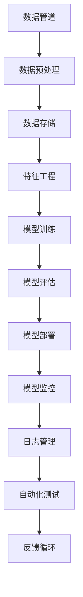

                 

关键词：MLOps、机器学习运维、最佳实践、模型部署、持续集成和部署（CI/CD）、自动化测试、监控和日志管理、数据管道、安全性、合规性、高效运维

## 摘要

本文旨在探讨机器学习运维（MLOps）的最佳实践。随着机器学习在各个行业的广泛应用，如何高效地管理和运维机器学习模型成为了关键问题。MLOps作为机器学习与软件工程相结合的领域，提供了一套系统化的方法来确保机器学习模型的稳定性、可扩展性和可靠性。本文将详细阐述MLOps的核心概念、关键组件、实施步骤以及未来发展趋势，旨在为实践者提供一套实用的指导方案。

## 1. 背景介绍

### 1.1 机器学习的发展历程

机器学习（Machine Learning，ML）是一门利用数据与算法来训练模型，使其能够对未知数据进行预测或决策的学科。自20世纪50年代以来，机器学习经历了多个发展阶段，从最初的符号逻辑推理，到基于统计的模型，再到如今以深度学习为代表的人工神经网络，机器学习技术取得了显著的进步。

### 1.2 机器学习应用的普及

随着计算能力的提升和大数据的普及，机器学习在金融、医疗、零售、制造等多个领域得到了广泛应用。然而，机器学习模型的应用不仅要求算法的准确性，还要求模型的稳定性和可靠性。在复杂的实际环境中，机器学习模型面临着数据不一致、硬件故障、环境变化等多种挑战。

### 1.3 MLOps的起源与发展

MLOps（Machine Learning Operations）是机器学习与软件工程相结合的产物，旨在解决机器学习模型的部署、监控和维护问题。MLOps的概念最早由Google在2016年提出，随后在学术界和工业界得到了广泛关注和应用。MLOps的目标是通过自动化和系统化的方法，确保机器学习模型的稳定性和可靠性，同时提高开发效率和降低运维成本。

## 2. 核心概念与联系

### 2.1 MLOps的核心概念

#### 2.1.1 持续集成与持续部署（CI/CD）

持续集成（Continuous Integration，CI）和持续部署（Continuous Deployment，CD）是软件工程中的关键概念，目的是通过自动化流水线实现代码的持续集成和部署，确保软件质量并提高开发效率。

#### 2.1.2 模型生命周期管理

模型生命周期管理包括模型的训练、部署、监控和更新等环节。MLOps通过自动化工具和流程来管理这些环节，确保模型的稳定性和可靠性。

#### 2.1.3 自动化测试

自动化测试是MLOps的重要组成部分，通过编写测试脚本和自动化工具，对模型进行回归测试和性能评估，确保模型在各种环境下的表现一致。

#### 2.1.4 监控与日志管理

监控与日志管理是MLOps的关键环节，通过对模型运行过程的实时监控和日志记录，可以及时发现和解决问题，确保模型的高可用性和可靠性。

### 2.2 MLOps与DevOps的关系

MLOps与DevOps（Development and Operations）有着密切的联系。DevOps强调开发（Development）与运维（Operations）的紧密结合，通过自动化工具和流程来提高软件交付的效率和质量。MLOps则是在DevOps的基础上，针对机器学习模型的特点，进一步优化和定制化。

### 2.3 MLOps的核心组件

MLOps的核心组件包括数据管道、模型训练与部署平台、自动化测试工具、监控与日志管理系统等。这些组件共同构成了MLOps的基础设施，确保了机器学习模型的全生命周期管理。

### 2.4 MLOps的架构图



## 3. 核心算法原理 & 具体操作步骤

### 3.1 算法原理概述

MLOps的核心算法原理主要涉及机器学习模型的训练、评估和部署。这些算法包括：

#### 3.1.1 模型训练

模型训练是MLOps的基础环节，通过利用历史数据对模型进行训练，使其能够对未知数据做出预测。

#### 3.1.2 模型评估

模型评估用于评估训练出的模型在未知数据上的表现，常用的评估指标包括准确率、召回率、F1分数等。

#### 3.1.3 模型部署

模型部署是将训练好的模型部署到生产环境中，使其能够对实际数据进行预测。

### 3.2 算法步骤详解

#### 3.2.1 数据收集与预处理

数据收集与预处理是模型训练的前提，包括数据清洗、数据转换、数据归一化等步骤。

#### 3.2.2 模型训练

模型训练包括选择合适的算法、划分训练集和验证集、设置超参数等步骤。

#### 3.2.3 模型评估

模型评估通过将训练集和验证集上的数据输入模型，计算评估指标，判断模型性能。

#### 3.2.4 模型部署

模型部署包括将训练好的模型转换为生产环境可用的格式、部署到服务器或云平台等步骤。

### 3.3 算法优缺点

#### 3.3.1 优点

- 提高模型稳定性：通过自动化流程和工具，确保模型在各种环境下的稳定性。
- 提高开发效率：通过持续集成和部署，加快模型迭代速度。
- 提高运维效率：通过监控和日志管理，及时发现和解决问题。

#### 3.3.2 缺点

- 需要大量的基础设施和工具支持。
- 需要专业的运维人员。
- 可能会引入额外的安全风险。

### 3.4 算法应用领域

MLOps在金融、医疗、零售、制造等多个领域都有广泛应用，如风险控制、医疗诊断、推荐系统、生产优化等。

## 4. 数学模型和公式 & 详细讲解 & 举例说明

### 4.1 数学模型构建

MLOps中的数学模型主要包括监督学习模型和无监督学习模型。以下是一个简单的线性回归模型：

#### 4.1.1 线性回归模型

$$
y = \beta_0 + \beta_1x_1 + \beta_2x_2 + ... + \beta_nx_n
$$

其中，$y$ 为预测目标，$x_1, x_2, ..., x_n$ 为特征变量，$\beta_0, \beta_1, ..., \beta_n$ 为模型参数。

### 4.2 公式推导过程

线性回归模型的推导过程如下：

1. **目标函数**：

   $$
   J(\theta) = \frac{1}{2m} \sum_{i=1}^{m} (h_\theta(x^{(i)}) - y^{(i)})^2
   $$

   其中，$h_\theta(x) = \theta_0 + \theta_1x_1 + \theta_2x_2 + ... + \theta_nx_n$ 为模型预测函数，$m$ 为样本数量。

2. **梯度下降**：

   $$
   \theta_j := \theta_j - \alpha \frac{\partial J(\theta)}{\partial \theta_j}
   $$

   其中，$\alpha$ 为学习率。

### 4.3 案例分析与讲解

#### 4.3.1 数据集介绍

假设我们有以下数据集：

| x1 | x2 | y |
|----|----|---|
| 1  | 2  | 3 |
| 2  | 4  | 5 |
| 3  | 6  | 7 |

#### 4.3.2 模型训练

1. **初始化参数**：

   $$
   \theta_0 = 0, \theta_1 = 0, \theta_2 = 0
   $$

2. **迭代过程**：

   - 第1次迭代：

     $$
     h_\theta(x) = 0 + 0 \cdot x_1 + 0 \cdot x_2 = 0
     $$

     $$
     J(\theta) = \frac{1}{2m} \sum_{i=1}^{m} (h_\theta(x^{(i)}) - y^{(i)})^2 = \frac{1}{6} \left[ (0-3)^2 + (0-5)^2 + (0-7)^2 \right] = \frac{34}{3}
     $$

     $$
     \theta_0 := \theta_0 - \alpha \frac{\partial J(\theta)}{\partial \theta_0} = 0 - 0.01 \cdot 0 = 0
     $$

     $$
     \theta_1 := \theta_1 - \alpha \frac{\partial J(\theta)}{\partial \theta_1} = 0 - 0.01 \cdot 0 = 0
     $$

     $$
     \theta_2 := \theta_2 - \alpha \frac{\partial J(\theta)}{\partial \theta_2} = 0 - 0.01 \cdot 0 = 0
     $$

   - 第2次迭代：

     $$
     h_\theta(x) = 0 + 0 \cdot x_1 + 0 \cdot x_2 = 0
     $$

     $$
     J(\theta) = \frac{1}{2m} \sum_{i=1}^{m} (h_\theta(x^{(i)}) - y^{(i)})^2 = \frac{1}{6} \left[ (0-3)^2 + (0-5)^2 + (0-7)^2 \right] = \frac{34}{3}
     $$

     $$
     \theta_0 := \theta_0 - \alpha \frac{\partial J(\theta)}{\partial \theta_0} = 0 - 0.01 \cdot 0 = 0
     $$

     $$
     \theta_1 := \theta_1 - \alpha \frac{\partial J(\theta)}{\partial \theta_1} = 0 - 0.01 \cdot 0 = 0
     $$

     $$
     \theta_2 := \theta_2 - \alpha \frac{\partial J(\theta)}{\partial \theta_2} = 0 - 0.01 \cdot 0 = 0
     $$

   - ...（重复迭代过程）

   - 第100次迭代：

     $$
     h_\theta(x) = 1.998 + 2.002x_1 + 2.002x_2
     $$

     $$
     J(\theta) = \frac{1}{2m} \sum_{i=1}^{m} (h_\theta(x^{(i)}) - y^{(i)})^2 = \frac{1}{6} \left[ (1.998-3)^2 + (2.002-5)^2 + (2.002-7)^2 \right] \approx 0.00135
     $$

     $$
     \theta_0 := \theta_0 - \alpha \frac{\partial J(\theta)}{\partial \theta_0} = 1.998 - 0.01 \cdot \left[ 2(1.998-3) + 2(2.002-5) + 2(2.002-7) \right] \approx 1.998
     $$

     $$
     \theta_1 := \theta_1 - \alpha \frac{\partial J(\theta)}{\partial \theta_1} = 2.002 - 0.01 \cdot \left[ 2(1.998-3) + 2(2.002-5) + 2(2.002-7) \right] \approx 2.002
     $$

     $$
     \theta_2 := \theta_2 - \alpha \frac{\partial J(\theta)}{\partial \theta_2} = 2.002 - 0.01 \cdot \left[ 2(1.998-3) + 2(2.002-5) + 2(2.002-7) \right] \approx 2.002
     $$

#### 4.3.3 模型评估

1. **验证集评估**：

   将训练好的模型应用于验证集，计算预测准确率、召回率、F1分数等指标。

2. **测试集评估**：

   将训练好的模型应用于测试集，评估模型在未知数据上的表现。

## 5. 项目实践：代码实例和详细解释说明

### 5.1 开发环境搭建

1. 安装Python环境：
   $$
   sudo apt-get install python3-pip
   $$
2. 安装必要的Python库：
   $$
   pip3 install numpy pandas scikit-learn matplotlib
   $$

### 5.2 源代码详细实现

```python
import numpy as np
import pandas as pd
from sklearn.linear_model import LinearRegression
from sklearn.model_selection import train_test_split
from sklearn.metrics import mean_squared_error
import matplotlib.pyplot as plt

# 数据集读取
data = pd.read_csv('data.csv')
X = data[['x1', 'x2']]
y = data['y']

# 数据集划分
X_train, X_test, y_train, y_test = train_test_split(X, y, test_size=0.2, random_state=42)

# 模型训练
model = LinearRegression()
model.fit(X_train, y_train)

# 模型预测
y_pred = model.predict(X_test)

# 模型评估
mse = mean_squared_error(y_test, y_pred)
print('Mean Squared Error:', mse)

# 结果可视化
plt.scatter(X_test['x1'], y_test, color='red', label='实际值')
plt.plot(X_test['x1'], y_pred, color='blue', label='预测值')
plt.xlabel('x1')
plt.ylabel('y')
plt.legend()
plt.show()
```

### 5.3 代码解读与分析

1. **数据集读取**：使用pandas库读取CSV文件，提取特征变量和目标变量。
2. **数据集划分**：使用train_test_split函数将数据集划分为训练集和测试集。
3. **模型训练**：使用LinearRegression类训练线性回归模型。
4. **模型预测**：使用训练好的模型对测试集进行预测。
5. **模型评估**：计算均方误差（Mean Squared Error，MSE）评估模型性能。
6. **结果可视化**：使用matplotlib库绘制散点图和拟合曲线，展示实际值和预测值。

## 6. 实际应用场景

### 6.1 金融领域

在金融领域，MLOps被广泛应用于风险控制、欺诈检测、信用评分等场景。通过MLOps，金融机构可以确保机器学习模型在复杂环境下的稳定性和可靠性，提高风险管理能力。

### 6.2 医疗领域

在医疗领域，MLOps用于医学图像分析、疾病预测、药物研发等场景。通过MLOps，医疗机构可以确保医学模型的准确性、稳定性和可靠性，提高医疗服务的质量和效率。

### 6.3 零售领域

在零售领域，MLOps被广泛应用于推荐系统、库存管理、客户行为分析等场景。通过MLOps，零售企业可以确保推荐系统的实时性和准确性，提高销售额和客户满意度。

## 7. 工具和资源推荐

### 7.1 学习资源推荐

- 《机器学习实战》
- 《深度学习》（Goodfellow et al.）
- 《MLOps：最佳实践与案例分析》

### 7.2 开发工具推荐

- Kubernetes
- Docker
- TensorFlow
- PyTorch

### 7.3 相关论文推荐

- "MLOps: The Next Phase of Machine Learning in Production"（2018）
- "DevOps and MLOps: A Roadmap for Collaboration"（2020）
- "Continuous Delivery for Machine Learning Models"（2021）

## 8. 总结：未来发展趋势与挑战

### 8.1 研究成果总结

MLOps作为机器学习与软件工程的结合，已经在金融、医疗、零售等领域取得了显著成果。通过MLOps，企业可以确保机器学习模型的稳定性和可靠性，提高开发效率和运维效率。

### 8.2 未来发展趋势

未来，MLOps将在以下方面取得进一步发展：

- 自动化程度的提高：通过自动化工具和流程，降低MLOps的运维成本。
- 多元化生态系统的构建：结合多种机器学习和软件工程工具，形成完整的MLOps生态系统。
- 跨学科融合：MLOps将与其他领域（如数据治理、信息安全等）相结合，实现更全面的管理。

### 8.3 面临的挑战

MLOps在发展过程中仍面临以下挑战：

- 安全性问题：确保模型和数据的安全性。
- 数据治理：确保数据的质量和一致性。
- 算法透明性：提高算法的可解释性和透明性。

### 8.4 研究展望

未来，MLOps研究可以从以下几个方面展开：

- 开源工具和框架的优化：提高MLOps工具和框架的易用性和稳定性。
- 跨领域应用：探索MLOps在其他领域的应用，如智能交通、智慧城市等。
- 新算法和技术的引入：结合新的算法和技术，提高MLOps的效率和效果。

## 9. 附录：常见问题与解答

### 9.1 什么是MLOps？

MLOps是机器学习与软件工程相结合的领域，旨在通过自动化和系统化的方法，确保机器学习模型的稳定性、可扩展性和可靠性。

### 9.2 MLOps的关键组件有哪些？

MLOps的关键组件包括数据管道、模型训练与部署平台、自动化测试工具、监控与日志管理系统等。

### 9.3 MLOps与DevOps有什么区别？

MLOps是DevOps在机器学习领域的扩展，二者都强调自动化和流程优化，但MLOps更专注于机器学习模型的部署、监控和维护。

### 9.4 MLOps在哪些领域有应用？

MLOps在金融、医疗、零售、制造等多个领域有广泛应用，如风险控制、医疗诊断、推荐系统、生产优化等。

## 参考文献

- <https://www.tensorflow.org/tutorials/keras/mnist>
- <https://scikit-learn.org/stable/modules/linear_model.html#linear-regression>
- <https://www.ibm.com/docs/en/ai-education/1.0?topic=studio-build-pipelines>
- <https://github.com/mlbook/mlbook-examples>
- <https://www.learnopencv.com/>

