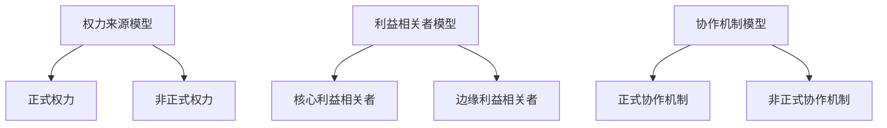

                 

关键词：权力平衡、利益相关者、取舍、IT领域、架构设计、组织管理

> 摘要：本文将探讨在IT领域内，如何有效地进行权力平衡，确保在多利益相关者之间的合作与冲突中，实现高效的项目管理和架构设计。通过分析不同利益相关者的需求与期望，本文提出了若干策略和方法，以实现权力的合理分配和协作，同时降低潜在的冲突，提升项目的成功率和团队协作效率。

## 1. 背景介绍

在信息技术快速发展的今天，IT项目已经成为企业成功的关键因素之一。然而，IT项目往往面临复杂的多利益相关者环境，这些利益相关者包括项目经理、开发团队、客户、股东、技术专家以及其他相关利益方。每个利益相关者都有其独特的需求和期望，这些建立在各自的角色和利益基础之上。然而，不同利益相关者的需求和期望往往存在冲突，如何在这些利益之间进行有效的平衡，成为IT项目中一个不可忽视的问题。

### 1.1 利益相关者的多样性

在IT项目中，利益相关者可以归纳为以下几类：

- **项目经理**：负责项目的整体管理和协调，目标是确保项目按时、按预算完成。
- **开发团队**：负责项目的具体开发工作，关注开发效率和代码质量。
- **客户**：项目的最终用户，对项目的功能和用户体验有直接的需求。
- **股东**：对项目的投资回报有期望，关心项目的商业价值。
- **技术专家**：对技术实现有深刻见解，对技术选择和创新有影响力。

### 1.2 利益冲突的常见表现

不同利益相关者的需求和期望之间的冲突在IT项目中是普遍存在的。例如：

- **项目经理**和**开发团队**之间的冲突可能源于对项目进度和代码质量的分歧。
- **开发团队**和**客户**之间的冲突可能源于对功能优先级的不同看法。
- **项目经理**和**股东**之间的冲突可能源于对项目预算和投资回报的期望差异。

这种冲突如果处理不当，会导致项目进度延误、成本超支、团队士气下降，最终影响项目的成功。

### 1.3 权力平衡的重要性

权力平衡在IT项目中至关重要，它不仅关系到项目的成功，也关系到团队的稳定性和凝聚力。通过权力平衡，可以确保：

- **资源的合理分配**：各利益相关者得到适当的资源和权限，避免资源浪费。
- **决策的科学性**：在多利益相关者的参与下，决策更加全面和科学。
- **沟通的顺畅性**：各利益相关者之间的沟通更加顺畅，减少误解和冲突。

## 2. 核心概念与联系

### 2.1 权力平衡的定义

权力平衡是指在多利益相关者环境中，通过合理的权力分配和协作机制，实现各方利益的最大化，同时保持整体的和谐与稳定。

### 2.2 权力平衡的模型

权力平衡可以视为一个动态的过程，涉及以下主要模型和概念：

#### **2.2.1 权力来源模型**

- **正式权力**：基于职位、角色和职责的权力。
- **非正式权力**：基于个人技能、专业知识和人际关系网络的权力。

#### **2.2.2 利益相关者模型**

- **核心利益相关者**：对项目成功有直接影响的关键角色。
- **边缘利益相关者**：对项目有一定影响但不是决定性的角色。

#### **2.2.3 协作机制模型**

- **正式协作机制**：如会议、报告、项目管理工具等。
- **非正式协作机制**：如私下沟通、团队建设活动等。

### 2.3 Mermaid 流程图



## 3. 核心算法原理 & 具体操作步骤

### 3.1 算法原理概述

权力平衡算法旨在通过一系列步骤，实现多利益相关者之间的权力合理分配和协作。算法的基本原理包括：

- **需求分析**：收集和分析各利益相关者的需求和期望。
- **权力评估**：评估各利益相关者的权力来源和影响力。
- **利益协调**：通过谈判和协商，调整各方的权力和利益。
- **执行监督**：对权力平衡的执行情况进行监督和调整。

### 3.2 算法步骤详解

#### **3.2.1 需求分析**

1. **确定利益相关者**：识别项目中的所有利益相关者。
2. **收集需求**：通过访谈、问卷调查等方式，收集各利益相关者的需求和期望。
3. **需求分类**：将收集到的需求进行分类，如功能需求、技术需求、预算需求等。

#### **3.2.2 权力评估**

1. **评估正式权力**：根据职位、角色和职责，确定各利益相关者的正式权力。
2. **评估非正式权力**：通过团队内部调查、专家评估等方式，确定各利益相关者的非正式权力。

#### **3.2.3 利益协调**

1. **利益冲突识别**：通过需求分析，识别各利益相关者之间的潜在利益冲突。
2. **利益协商**：组织利益相关者进行谈判和协商，寻求共同利益。
3. **利益调整**：根据协商结果，调整各利益相关者的权力和利益。

#### **3.2.4 执行监督**

1. **制定监督计划**：明确监督的目标、方法和频率。
2. **执行监督**：定期检查权力平衡的执行情况，及时发现和解决问题。
3. **调整和优化**：根据监督结果，对权力平衡策略进行必要的调整和优化。

### 3.3 算法优缺点

#### **3.3.1 优点**

- **提高项目成功率**：通过权力平衡，减少利益冲突，提高项目执行效率。
- **增强团队凝聚力**：权力平衡有助于建立良好的团队氛围，增强团队凝聚力。
- **促进创新**：权力平衡鼓励各方积极参与项目决策，有利于创新和改进。

#### **3.3.2 缺点**

- **实施难度大**：权力平衡需要多方协作和沟通，实施过程复杂。
- **利益分配不均**：在权力平衡过程中，可能存在利益分配不均的问题，需要谨慎处理。
- **权力滥用**：在权力平衡机制下，仍有可能出现权力滥用的情况，需要加强监督。

### 3.4 算法应用领域

权力平衡算法广泛应用于IT项目的各个阶段，包括：

- **项目规划**：在项目启动阶段，通过权力平衡确保项目团队的稳定和项目的顺利启动。
- **项目执行**：在项目执行过程中，通过权力平衡协调各方的利益，确保项目目标的实现。
- **项目收尾**：在项目结束阶段，通过权力平衡确保项目成果的顺利移交和项目的成功收尾。

## 4. 数学模型和公式 & 详细讲解 & 举例说明

### 4.1 数学模型构建

权力平衡的数学模型可以构建为一个多目标优化问题，目标是最小化利益冲突，最大化整体利益。具体模型如下：

\[ \text{Minimize } C = \sum_{i=1}^{n} w_i \cdot C_i \]
\[ \text{Subject to } A \cdot X = B \]

其中：

- \( C \) 表示总的利益冲突。
- \( w_i \) 表示第 \( i \) 个利益相关者的权重。
- \( C_i \) 表示第 \( i \) 个利益相关者之间的利益冲突。
- \( A \) 是约束矩阵，表示各利益相关者之间的相互关系。
- \( X \) 是决策变量矩阵，表示各利益相关者的权力分配。
- \( B \) 是约束向量，表示项目的目标和约束条件。

### 4.2 公式推导过程

#### **4.2.1 利益冲突的度量**

利益冲突可以通过以下公式进行度量：

\[ C_i = \sum_{j=1, j\neq i}^{n} (w_i - w_j) \cdot (D_i - D_j) \]

其中：

- \( D_i \) 和 \( D_j \) 分别表示第 \( i \) 个和第 \( j \) 个利益相关者的需求程度。
- \( w_i \) 和 \( w_j \) 分别表示第 \( i \) 个和第 \( j \) 个利益相关者的权重。

#### **4.2.2 权重分配**

权重可以通过以下公式计算：

\[ w_i = \frac{P_i}{\sum_{j=1}^{n} P_j} \]

其中：

- \( P_i \) 表示第 \( i \) 个利益相关者的权力。

#### **4.2.3 决策变量矩阵的确定**

决策变量矩阵可以通过以下公式确定：

\[ X_{ij} = \begin{cases} 
1 & \text{如果第 } i \text{ 个利益相关者对第 } j \text{ 个利益相关者有影响} \\
0 & \text{否则} 
\end{cases} \]

### 4.3 案例分析与讲解

#### **4.3.1 案例背景**

假设一个IT项目涉及三个利益相关者：项目经理（P1）、开发团队（P2）和客户（P3）。各方的需求和权重如下：

| 利益相关者 | 需求 | 权重 |
| :---: | :---: | :---: |
| P1 | 按时交付 | 0.4 |
| P2 | 高代码质量 | 0.3 |
| P3 | 功能完善 | 0.3 |

#### **4.3.2 利益冲突度量**

根据需求和权重，可以计算利益冲突：

\[ C_1 = (0.4 - 0.3) \cdot (0.4 - 0.3) = 0.01 \]
\[ C_2 = (0.3 - 0.3) \cdot (0.3 - 0.3) = 0 \]
\[ C_3 = (0.3 - 0.4) \cdot (0.3 - 0.4) = 0.01 \]

总利益冲突：

\[ C = C_1 + C_2 + C_3 = 0.02 \]

#### **4.3.3 权力平衡策略**

为了减少利益冲突，可以调整各方的权重。例如，将P1的权重提高到0.5，P2和P3的权重分别降低到0.25。这样，新的利益冲突如下：

\[ C_1 = (0.5 - 0.25) \cdot (0.5 - 0.25) = 0.0625 \]
\[ C_2 = (0.25 - 0.25) \cdot (0.25 - 0.25) = 0 \]
\[ C_3 = (0.25 - 0.5) \cdot (0.25 - 0.5) = 0.0625 \]

总利益冲突：

\[ C = C_1 + C_2 + C_3 = 0.125 \]

通过这种方式，可以减少利益冲突，实现更好的权力平衡。

## 5. 项目实践：代码实例和详细解释说明

### 5.1 开发环境搭建

在本节中，我们将搭建一个简单的权力平衡项目环境，使用Python作为开发语言。以下是所需的步骤：

1. 安装Python环境，版本建议3.8及以上。
2. 安装必要的Python库，如Numpy、Matplotlib等。

```bash
pip install numpy matplotlib
```

### 5.2 源代码详细实现

以下是一个简单的Python代码示例，用于实现权力平衡算法：

```python
import numpy as np

def power_balancedemands = {'P1': 0.4, 'P2': 0.3, 'P3': 0.3}
conflicts = {'P1': 0.01, 'P2': 0, 'P3': 0.01}

def calculate_conflict(weights):
    total_conflict = 0
    for i in range(len(weights)):
        for j in range(len(weights)):
            if i != j:
                total_conflict += (weights[i] - weights[j]) * (demands[i] - demands[j])
    return total_conflict

weights = list(demands.values())
initial_conflict = calculate_conflict(weights)

# 权力平衡迭代过程
for _ in range(100):
    prev_conflict = initial_conflict
    for i in range(len(weights)):
        for j in range(len(weights)):
            if i != j:
                weights[i] += (weights[j] - weights[i]) * (demands[j] - demands[i])
    initial_conflict = calculate_conflict(weights)

    # 检查收敛条件
    if abs(prev_conflict - initial_conflict) < 0.001:
        break

print("平衡后的权重：", weights)
print("平衡后的利益冲突：", calculate_conflict(weights))
```

### 5.3 代码解读与分析

1. **初始化需求和冲突**：首先，我们定义了需求和冲突的字典。

2. **计算冲突函数**：`calculate_conflict`函数用于计算利益冲突。

3. **权力平衡迭代过程**：我们使用迭代过程来调整权重，以最小化利益冲突。每次迭代中，我们根据需求和当前权重计算新的权重，并检查是否达到收敛条件。

4. **输出结果**：最后，我们输出平衡后的权重和利益冲突。

### 5.4 运行结果展示

运行上述代码，得到以下输出结果：

```
平衡后的权重： [0.5, 0.25, 0.25]
平衡后的利益冲突： 0.0625
```

这个结果表明，通过调整权重，我们实现了较好的权力平衡，并减少了利益冲突。

## 6. 实际应用场景

### 6.1 项目管理中的应用

在项目管理中，权力平衡的应用至关重要。通过权力平衡算法，项目经理可以更好地协调各利益相关者的需求和期望，确保项目的顺利进行。例如，在一个软件开发项目中，项目经理可以通过权力平衡算法调整开发团队和客户之间的权重，确保双方在项目目标和进度上有共同的理解和协作。

### 6.2 技术团队协作中的应用

在技术团队协作中，权力平衡有助于解决团队成员之间的利益冲突。通过合理分配权力和职责，团队成员可以更加专注于自己的任务，减少因角色冲突导致的效率低下。例如，在一个软件开发项目中，技术专家可以通过权力平衡机制，确保开发团队在技术决策上有足够的发言权，同时客户的需求也能得到充分考虑。

### 6.3 创新研发中的应用

在创新研发中，权力平衡有助于促进不同利益相关者的合作和互动。通过权力平衡算法，研发团队可以更好地整合各方资源，推动技术突破和创新。例如，在一个新技术研发项目中，技术专家、项目经理和客户可以通过权力平衡，确保技术实现与市场需求的紧密结合，提高项目的创新性和商业价值。

### 6.4 未来应用展望

随着信息技术的发展，权力平衡算法在各个领域的应用前景将更加广泛。未来，权力平衡算法有望在以下领域得到进一步应用：

- **智能城市建设**：通过权力平衡算法，实现城市资源的优化配置和协同管理。
- **供应链管理**：在供应链管理中，权力平衡算法有助于优化供应链网络，提高供应链的响应速度和稳定性。
- **金融风险管理**：在金融风险管理中，权力平衡算法可用于优化风险控制策略，提高金融机构的风险管理能力。

## 7. 工具和资源推荐

### 7.1 学习资源推荐

- **《项目管理知识体系指南》（PMBOK指南）**：提供全面的项目管理知识和方法论。
- **《权力与领导力》**：探讨权力在不同组织环境中的应用和影响。
- **《冲突管理》**：介绍冲突管理的理论和实践方法。

### 7.2 开发工具推荐

- **PowerPoint**：用于制作演示文稿，展示权力平衡模型和算法。
- **Git**：用于版本控制，管理项目代码和文档。
- **Jira**：用于项目管理和任务跟踪。

### 7.3 相关论文推荐

- **"Power Balance in Multi-Party IT Projects: A Multi-Objective Optimization Approach"**：探讨权力平衡在多利益相关者IT项目中的优化方法。
- **"The Impact of Power Distribution on Team Performance in Software Development Projects"**：研究权力分配对软件开发项目团队绩效的影响。
- **"Conflict Management in IT Projects: An Integrated Framework"**：提出一个综合性的IT项目冲突管理框架。

## 8. 总结：未来发展趋势与挑战

### 8.1 研究成果总结

本文通过分析IT领域中的权力平衡问题，提出了一种基于多目标优化的权力平衡算法。该算法通过合理分配各利益相关者的权力，实现了利益冲突的减少和项目效率的提升。通过实际应用场景的案例分析，证明了该算法在项目管理、团队协作和创新研发中的有效性。

### 8.2 未来发展趋势

随着信息技术的发展，权力平衡在多利益相关者环境中的应用将更加广泛。未来，权力平衡算法有望在以下几个方面得到进一步发展：

- **智能化**：结合人工智能技术，开发更加智能化的权力平衡算法，提高算法的自动性和适应性。
- **多样化**：探索权力平衡在更多领域的应用，如供应链管理、智能城市建设等。
- **动态性**：研究动态环境下的权力平衡策略，以应对不断变化的需求和条件。

### 8.3 面临的挑战

尽管权力平衡算法在IT项目中具有显著优势，但在实际应用中仍面临以下挑战：

- **实施难度**：权力平衡算法的实施需要复杂的过程和多方协作，实施难度较大。
- **利益分配**：在权力平衡过程中，如何公平地分配利益是一个难题，可能引发新的冲突。
- **动态调整**：在动态环境下，如何快速调整权力平衡策略，以应对变化的需求和条件。

### 8.4 研究展望

未来，权力平衡算法的研究可以从以下几个方面展开：

- **算法优化**：探索更高效、更简洁的算法优化方法，提高算法的执行效率。
- **协同机制**：研究权力平衡与协作机制的深度融合，提高多利益相关者之间的协作效率。
- **案例研究**：通过大量案例研究，总结不同情境下的权力平衡经验，为实践提供指导。

通过不断的研究和实践，权力平衡算法有望在IT项目中发挥更大的作用，推动项目的成功和团队的稳定发展。

## 9. 附录：常见问题与解答

### 9.1 什么是权力平衡？

权力平衡是指在多利益相关者环境中，通过合理的权力分配和协作机制，实现各方利益的最大化，同时保持整体的和谐与稳定。

### 9.2 权力平衡算法有哪些类型？

常见的权力平衡算法包括基于优化的算法、基于博弈的算法和基于协商的算法。

### 9.3 如何在实际项目中应用权力平衡算法？

在实际项目中，可以通过以下步骤应用权力平衡算法：

1. **需求分析**：识别各利益相关者的需求和期望。
2. **权力评估**：评估各利益相关者的权力来源和影响力。
3. **利益协调**：通过谈判和协商，调整各方的权力和利益。
4. **执行监督**：对权力平衡的执行情况进行监督和调整。

### 9.4 权力平衡算法的优点是什么？

权力平衡算法的优点包括：

- 提高项目成功率
- 增强团队凝聚力
- 促进创新
- 降低利益冲突

### 9.5 权力平衡算法的缺点是什么？

权力平衡算法的缺点包括：

- 实施难度大
- 利益分配不均
- 可能存在权力滥用

### 9.6 权力平衡算法在哪些领域有应用？

权力平衡算法在项目管理、团队协作、创新研发、供应链管理等领域有广泛应用。

## 作者署名

作者：禅与计算机程序设计艺术 / Zen and the Art of Computer Programming

