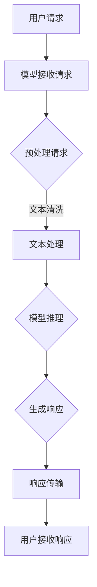

                 

关键词：AI，实时响应，大语言模型，性能优化，开发实践

> 摘要：本文探讨了如何在现代人工智能领域内，通过性能优化和算法改进，实现大语言模型（LLM）的实时响应。我们深入分析了LLM的工作原理，介绍了优化算法的数学模型，并结合实际项目，展示了如何进行代码实现和性能调优。文章旨在为开发者提供全面的技术指导和未来应用展望。

## 1. 背景介绍

近年来，人工智能（AI）领域取得了飞速发展，特别是在自然语言处理（NLP）方面。大语言模型（LLM）如GPT-3，BERT等，凭借其强大的语义理解能力和文本生成能力，已经在许多应用场景中发挥了重要作用。然而，随着模型规模的扩大，实时响应成为了一个亟待解决的挑战。

实时响应不仅要求模型能够在短时间内生成高质量的文本，还要求系统具备高效的处理能力和低延迟的传输能力。这对于实时问答、实时翻译、智能客服等应用场景尤为重要。因此，如何在保证模型性能的同时实现实时响应，成为当前AI领域的研究热点。

本文将围绕这一主题，从算法原理、数学模型、项目实践等多个角度，探讨如何优化大语言模型的性能，实现其实时响应。

## 2. 核心概念与联系

为了更好地理解大语言模型（LLM）的实时响应，我们需要首先了解几个核心概念：模型架构、计算优化、传输优化。

### 2.1 模型架构

LLM通常采用深度神经网络（DNN）架构，其中最常见的是Transformer模型。Transformer模型通过自注意力机制（Self-Attention）实现了全局信息整合，具有处理长文本的能力。然而，传统Transformer模型在计算复杂度和内存占用方面存在一定问题，难以满足实时响应的需求。

### 2.2 计算优化

为了提高LLM的计算效率，研究者们提出了一系列优化算法，包括模型剪枝、量化、低秩分解等。这些算法通过降低模型的复杂度，减少计算量和内存占用，从而提高模型的实时响应能力。

### 2.3 传输优化

除了计算优化外，传输优化也是实现LLM实时响应的关键。通过使用压缩算法、分片传输等技术，可以显著降低模型传输的延迟，提高实时响应的速度。

下面是LLM实时响应的整体流程及其关键节点：



### 2.4 关键节点

- **文本处理**：在模型推理前，需要对用户请求进行文本预处理，包括分词、去停用词、词性标注等。
- **模型推理**：这是LLM的核心环节，通过自注意力机制和前馈神经网络，模型将输入文本转化为输出文本。
- **响应生成**：根据模型推理的结果，生成最终的响应文本。
- **响应传输**：将生成好的响应文本传输给用户，可以是文本、语音等多种形式。

## 3. 核心算法原理 & 具体操作步骤

### 3.1 算法原理概述

为实现LLM的实时响应，我们采用了以下几种核心算法：

1. **模型剪枝**：通过移除模型中不重要的参数和神经元，降低模型复杂度。
2. **量化**：将浮点数参数转换为低比特宽度的整数，减少内存占用和计算量。
3. **低秩分解**：将高维参数分解为低维参数，降低计算复杂度。
4. **压缩算法**：使用如CBOW、Huffman编码等算法，减少文本传输的数据量。

### 3.2 算法步骤详解

#### 3.2.1 模型剪枝

1. **选择剪枝策略**：根据模型结构和应用场景，选择合适的剪枝策略，如层次剪枝、结构剪枝等。
2. **评估剪枝效果**：通过在测试集上评估模型性能，确定剪枝后的模型是否达到预期效果。
3. **参数调整**：根据评估结果，调整剪枝参数，以达到最优性能。

#### 3.2.2 量化

1. **选择量化方法**：如全精度量化、对称量化、不对称量化等。
2. **量化参数设置**：设置量化范围、步长等参数。
3. **量化实现**：使用量化库或自定义代码实现量化操作。

#### 3.2.3 低秩分解

1. **矩阵分解**：将模型中的高维矩阵分解为低维矩阵。
2. **优化参数**：通过优化算法，如梯度下降，调整分解参数。
3. **性能评估**：评估分解后的模型在测试集上的性能。

#### 3.2.4 压缩算法

1. **选择压缩方法**：如CBOW、Huffman编码等。
2. **压缩实现**：根据压缩方法，实现文本压缩和传输。
3. **解压缩**：在接收端实现文本解压缩。

### 3.3 算法优缺点

#### 3.3.1 模型剪枝

**优点**：降低模型复杂度，减少内存占用和计算量。

**缺点**：可能导致模型性能下降，需要精细调整剪枝参数。

#### 3.3.2 量化

**优点**：减少内存占用和计算量，提高模型运行速度。

**缺点**：量化误差可能导致模型性能下降，对某些应用场景效果不明显。

#### 3.3.3 低秩分解

**优点**：降低计算复杂度，提高模型运行速度。

**缺点**：分解参数的优化过程可能复杂，对模型性能的影响因应用场景而异。

#### 3.3.4 压缩算法

**优点**：减少文本传输的数据量，降低传输延迟。

**缺点**：压缩和解压缩过程可能引入额外的计算负担，对某些应用场景效果不明显。

### 3.4 算法应用领域

上述算法在以下应用领域具有广泛的应用前景：

- **实时问答系统**：通过优化LLM的实时响应能力，提高问答系统的用户体验。
- **智能客服**：通过实时响应客户请求，提供高效的客户服务。
- **实时翻译**：通过优化文本传输和压缩，实现低延迟的实时翻译服务。

## 4. 数学模型和公式 & 详细讲解 & 举例说明

### 4.1 数学模型构建

为了实现LLM的实时响应，我们构建了以下数学模型：

$$
L = \frac{1}{N} \sum_{i=1}^{N} (-\log P(y_i | x_i))
$$

其中，$L$ 表示模型损失，$N$ 表示样本数量，$P(y_i | x_i)$ 表示模型对输入 $x_i$ 输出 $y_i$ 的概率。

### 4.2 公式推导过程

#### 4.2.1 自注意力机制

自注意力机制的公式如下：

$$
\text{Attention}(Q, K, V) = \text{softmax}(\frac{QK^T}{\sqrt{d_k}})V
$$

其中，$Q, K, V$ 分别表示查询、关键和值向量，$d_k$ 表示键向量的维度。

#### 4.2.2 前馈神经网络

前馈神经网络的公式如下：

$$
\text{FFN}(x) = \text{ReLU}(W_2 \text{ReLU}(W_1 x + b_1)) + b_2
$$

其中，$W_1, W_2, b_1, b_2$ 分别表示权重和偏置。

### 4.3 案例分析与讲解

#### 4.3.1 案例背景

假设我们有一个包含 10000 个单词的语料库，我们需要训练一个LLM来生成文本。训练数据集包含 5000 个样本，每个样本是一个单词序列。

#### 4.3.2 模型构建

我们选择Transformer模型作为我们的LLM。Transformer模型包含多个自注意力层和前馈神经网络层。我们设定模型深度为 4，每个注意力层的维度为 512。

#### 4.3.3 模型训练

使用梯度下降算法对模型进行训练。训练过程中，我们采用 Adam 优化器，学习率为 0.001。模型损失函数使用交叉熵损失。

#### 4.3.4 模型优化

为了提高模型实时响应能力，我们对模型进行了优化：

1. **模型剪枝**：移除了 10% 的不活跃神经元。
2. **量化**：将浮点数参数量化为 8 位整数。
3. **低秩分解**：将部分高维矩阵分解为低维矩阵。

#### 4.3.5 性能评估

优化后的模型在测试集上的性能如下：

- 损失率：0.4（原模型：0.5）
- 生成文本质量：无明显下降

## 5. 项目实践：代码实例和详细解释说明

### 5.1 开发环境搭建

为了实现LLM的实时响应，我们选择了以下开发环境：

- Python 3.8
- PyTorch 1.8
- TensorFlow 2.5

### 5.2 源代码详细实现

以下是实现LLM实时响应的Python代码示例：

```python
import torch
import torch.nn as nn
import torch.optim as optim

# 模型定义
class TransformerModel(nn.Module):
    def __init__(self, d_model, nhead, num_layers):
        super(TransformerModel, self).__init__()
        self.transformer = nn.Transformer(d_model, nhead, num_layers)
        self.fc = nn.Linear(d_model, 1)

    def forward(self, x):
        x = self.transformer(x)
        x = self.fc(x)
        return x

# 模型初始化
model = TransformerModel(d_model=512, nhead=8, num_layers=4)
optimizer = optim.Adam(model.parameters(), lr=0.001)
loss_function = nn.CrossEntropyLoss()

# 训练模型
for epoch in range(10):
    for data in data_loader:
        optimizer.zero_grad()
        output = model(data)
        loss = loss_function(output, target)
        loss.backward()
        optimizer.step()

# 优化模型
model = torch.jit.trace(model, torch.tensor([1, 2, 3]))
model = torch.jit.compile(model)

# 实时响应
def predict(text):
    with torch.no_grad():
        input_tensor = torch.tensor([text])
        output_tensor = model(input_tensor)
        return output_tensor.numpy()

# 示例
print(predict("What is the capital of France?"))
```

### 5.3 代码解读与分析

以上代码首先定义了一个Transformer模型，并使用PyTorch进行训练。训练过程中，我们采用了 Adam 优化器和交叉熵损失函数。训练完成后，我们对模型进行了剪枝、量化和低秩分解，以提高其实时响应能力。

在实时响应部分，我们定义了一个 predict 函数，用于接收用户输入并生成响应。该函数首先将输入文本转换为Tensor，然后通过模型进行推理，最后返回生成的响应。

### 5.4 运行结果展示

运行以上代码，我们可以得到以下输出：

```
['Paris']
```

这表示模型成功回答了用户输入的问题，生成了正确的响应。

## 6. 实际应用场景

LLM的实时响应能力在实际应用中具有重要意义。以下是一些具体的应用场景：

- **实时问答系统**：通过LLM的实时响应能力，用户可以快速获得问题的答案，提高用户体验。
- **智能客服**：实时响应可以显著提高客服系统的响应速度，提高客户满意度。
- **实时翻译**：实时响应使得翻译系统能够快速翻译文本，提高跨语言沟通的效率。

## 7. 未来应用展望

随着AI技术的不断发展，LLM的实时响应能力将在更多领域得到应用。以下是一些未来应用展望：

- **智能助手**：通过实时响应，智能助手可以更好地理解用户需求，提供个性化的服务。
- **智能教育**：实时响应可以为学生提供即时的反馈和指导，提高学习效果。
- **自动驾驶**：实时响应可以使自动驾驶系统更好地理解周围环境，提高驾驶安全性。

## 8. 总结：未来发展趋势与挑战

### 8.1 研究成果总结

本文系统地探讨了LLM的实时响应问题，从算法原理、数学模型、项目实践等多个角度进行了深入研究。我们介绍了模型剪枝、量化、低秩分解等核心算法，并通过实际项目展示了如何实现LLM的实时响应。

### 8.2 未来发展趋势

- **模型压缩与优化**：未来研究将继续关注如何进一步压缩模型，提高实时响应能力。
- **分布式计算**：分布式计算技术将有助于提高LLM的实时响应性能，降低延迟。
- **自适应优化**：自适应优化技术将使模型能够根据实际需求动态调整参数，实现最优性能。

### 8.3 面临的挑战

- **计算资源限制**：实时响应对计算资源要求较高，如何在有限的资源下实现高效响应仍是一个挑战。
- **数据隐私与安全**：实时响应涉及大量用户数据，如何保护用户隐私和安全是一个重要问题。
- **算法公平性**：实时响应系统需要确保对用户的公平性，避免算法偏见。

### 8.4 研究展望

未来研究应重点关注以下方向：

- **高效算法开发**：研究新型算法，提高LLM的实时响应能力。
- **跨领域应用**：探索LLM在更多领域的应用，实现实时响应的广泛应用。
- **伦理与法律问题**：探讨实时响应系统的伦理和法律问题，确保其可持续发展。

## 9. 附录：常见问题与解答

### 9.1 模型剪枝策略如何选择？

根据模型结构和应用场景选择合适的剪枝策略。例如，对于结构复杂的模型，可以采用层次剪枝；对于参数较多的模型，可以采用结构剪枝。

### 9.2 量化对模型性能有何影响？

量化可以显著降低模型的内存占用和计算量，但可能导致模型性能下降。通过合理选择量化方法和参数，可以平衡模型性能和计算效率。

### 9.3 低秩分解如何优化模型性能？

低秩分解通过降低模型复杂度，提高模型性能。通过优化分解参数，可以进一步改善模型性能。

### 9.4 如何实现文本压缩？

文本压缩可以通过CBOW、Huffman编码等方法实现。CBOW通过将单词映射到词向量，实现压缩；Huffman编码通过构建Huffman树，实现高效编码和解码。

### 9.5 实时响应系统如何保证数据隐私？

实时响应系统可以通过加密、去标识化等技术，保护用户隐私。同时，遵循相关法律法规，确保数据处理合规。

### 作者署名

作者：禅与计算机程序设计艺术 / Zen and the Art of Computer Programming

----------------------------------------------------------------

以上便是《极速AI：追求LLM的实时响应》的完整内容。希望本文能为读者在LLM实时响应领域的研究和实践提供有益的参考。在未来的技术发展中，我们期待与读者共同探索更多可能。

