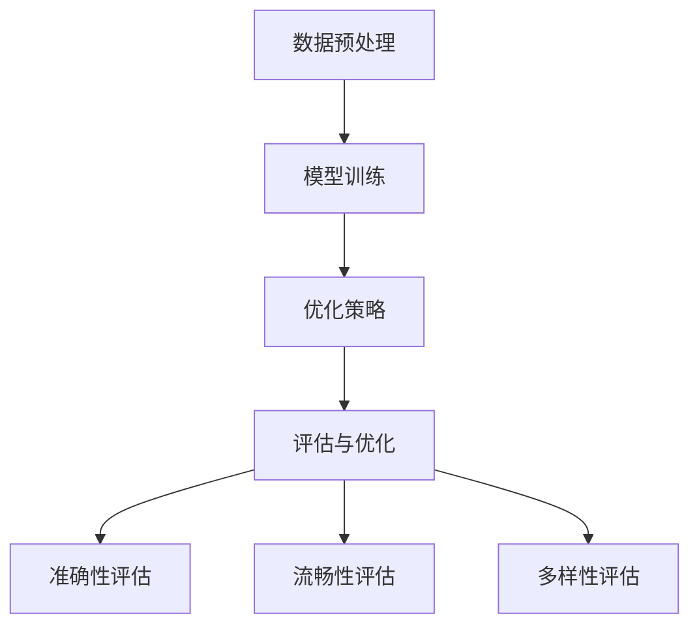
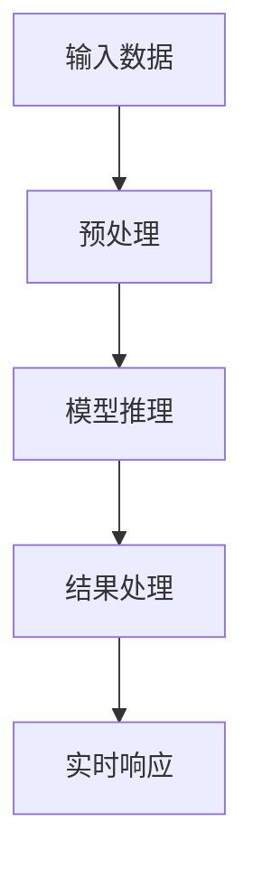

                 

在人工智能飞速发展的今天，语言模型（Language Model，简称LLM）已经成为诸多应用场景的核心技术之一。从自然语言处理到智能助手，从机器翻译到文本生成，LLM在提升人机交互体验方面发挥了至关重要的作用。然而，随着应用场景的复杂化和多样化，如何实现LLM的实时响应成为一个亟待解决的关键问题。本文将从LLM的核心概念、算法原理、数学模型、实际应用等多个维度，深入探讨如何实现LLM的实时响应，为未来人工智能的发展提供有益的参考。

## 关键词

- 语言模型（LLM）
- 实时响应
- 算法优化
- 数学模型
- 实际应用

## 摘要

本文首先介绍了语言模型的基本概念和发展历程，分析了当前LLM在实时响应方面存在的问题。接着，从算法原理、数学模型、实际应用等多个角度，探讨了实现LLM实时响应的关键技术和方法。通过具体实例和详细分析，本文展示了如何通过优化算法、构建高效数学模型、采用先进技术手段，实现LLM的实时响应。最后，本文对未来LLM的发展趋势、面临的挑战及研究展望进行了总结，为相关领域的研究者和开发者提供了有益的参考。

## 1. 背景介绍

### 1.1 语言模型的发展历程

语言模型（Language Model，简称LM）是自然语言处理（Natural Language Processing，简称NLP）的重要基础。自20世纪50年代以来，语言模型经历了多个发展阶段。

- **基于规则的方法**：早期语言模型主要依靠语言学知识和手工编写的规则，如词汇表、语法规则等。这些方法在处理简单任务时具有一定的效果，但面对复杂、多变的语言环境时，表现欠佳。
- **统计方法**：20世纪80年代，随着计算机性能的提升和大量语言数据的积累，统计方法逐渐成为主流。统计语言模型（如N-gram模型）通过分析语料库中的词频分布，预测下一个词的出现概率。这一方法在处理实际问题时表现出色，但受限于模型复杂度和计算资源。
- **神经网络方法**：21世纪初，深度学习技术的兴起，为语言模型的研究带来了新的机遇。基于神经网络的深度语言模型（如递归神经网络RNN、长短时记忆网络LSTM、门控循环单元GRU等），在处理长距离依赖、上下文信息等方面取得了显著突破。
- **预训练和微调**：近年来，预训练（Pre-training）和微调（Fine-tuning）技术成为语言模型研究的重要方向。通过在大规模语料库上进行预训练，模型可以学习到丰富的语言知识和规律；然后针对具体任务进行微调，进一步提升模型的性能。

### 1.2 语言模型的应用场景

语言模型在诸多领域得到了广泛应用，以下是其中一些典型的应用场景：

- **自然语言处理**：语言模型在文本分类、情感分析、实体识别、机器翻译等任务中发挥着核心作用。通过学习大量文本数据，模型可以自动提取语义信息，实现高效的文本处理。
- **智能助手**：语言模型是智能助手（如聊天机器人、语音助手等）的核心技术。通过自然语言交互，智能助手可以理解用户需求，提供个性化的服务。
- **文本生成**：语言模型在自动写作、内容摘要、创意生成等方面具有广泛的应用。通过生成式模型，可以生成高质量、原创的文本内容。
- **问答系统**：语言模型在构建问答系统时，可以通过理解用户问题，提供准确的答案。这为用户提供了便捷的知识获取渠道，也提升了信息的传播效率。

### 1.3 实时响应的重要性

随着互联网和智能设备的普及，人们对实时响应的需求越来越高。实时响应不仅提升了用户体验，也提高了系统的效率。以下是实时响应在人工智能领域的几个重要方面：

- **交互体验**：在智能助手、聊天机器人等应用场景中，实时响应可以提供更流畅、自然的交互体验，增强用户满意度。
- **决策支持**：在实时数据分析和决策支持系统中，及时响应可以帮助企业快速应对市场变化，降低风险。
- **故障排除**：在自动运维、监控系统等场景中，实时响应可以及时发现并处理故障，确保系统的稳定运行。
- **资源优化**：在云计算、大数据处理等领域，实时响应可以帮助合理分配资源，提高计算效率和数据利用率。

### 1.4 实现LLM实时响应的挑战

虽然语言模型在处理自然语言任务方面取得了显著成果，但要实现LLM的实时响应，仍面临诸多挑战：

- **计算资源**：语言模型通常需要大量计算资源，特别是在训练和推理阶段。如何优化算法，降低计算资源的需求，是实现实时响应的关键。
- **延迟问题**：实时响应要求系统在短时间内完成语言处理任务。如何降低延迟，提高模型效率，是当前研究的热点。
- **数据规模**：语言模型通常需要大规模语料库进行训练。如何处理海量数据，保证模型的鲁棒性和准确性，是实现实时响应的另一个挑战。
- **模型复杂度**：深度学习模型具有较高的复杂度，如何简化模型结构，降低计算成本，是实现实时响应的重要方向。

## 2. 核心概念与联系

### 2.1 语言模型的基本概念

语言模型（Language Model，简称LM）是一种用于预测文本序列的概率分布模型。具体来说，给定一个输入序列，语言模型需要计算出该序列在语言中的概率分布。常见的语言模型有N-gram模型、神经网络模型等。

- **N-gram模型**：基于统计方法，N-gram模型将文本序列划分为一系列的N元组（N-gram），然后通过计算每个N-gram在语料库中的出现频率，预测下一个词的出现概率。
- **神经网络模型**：基于深度学习方法，神经网络模型通过学习大量语言数据，捕捉文本中的复杂模式，预测下一个词的出现概率。常见的神经网络模型有RNN、LSTM、GRU等。

### 2.2 语言模型的架构

语言模型的架构可以分为前向架构和后向架构两种：

- **前向架构**：前向架构（如RNN、LSTM、GRU等）通过循环单元逐步处理输入序列，每个时间步的输出依赖于前一个时间步的输出。
- **后向架构**：后向架构（如Transformer）通过自注意力机制（Self-Attention）处理输入序列，每个时间步的输出与所有时间步的输入相关联。

### 2.3 语言模型的训练与优化

语言模型的训练过程主要包括数据预处理、模型训练和优化等步骤：

- **数据预处理**：首先对语料库进行清洗和分词处理，将文本序列转化为词序列。然后，对词序列进行编码，生成输入序列和目标序列。
- **模型训练**：使用输入序列和目标序列，通过反向传播算法（如梯度下降、Adam等）优化模型参数，降低损失函数。
- **优化策略**：为了提高模型性能和训练效率，可以采用预训练和微调等策略。预训练通过在大规模语料库上进行训练，学习到丰富的语言知识；微调则在预训练的基础上，针对具体任务进行优化。

### 2.4 语言模型的评估与优化

语言模型的评估主要关注模型的准确性、流畅性和多样性等指标：

- **准确性**：通过计算模型预测的词序列与实际词序列的相似度，评估模型的准确性。
- **流畅性**：评估模型生成的文本是否流畅、自然，是否符合语言习惯。
- **多样性**：评估模型生成的文本是否具有丰富的表达方式和多样性。

为了优化语言模型，可以采用以下策略：

- **数据增强**：通过数据增强技术（如噪声注入、同义词替换等），增加模型的训练数据，提高模型的泛化能力。
- **模型融合**：通过融合多个模型（如RNN、LSTM、GRU等），取长补短，提高模型的性能。
- **超参数调优**：通过调整模型参数（如学习率、批量大小等），优化模型性能。

### 2.5 Mermaid 流程图

以下是语言模型训练与优化的Mermaid流程图：



## 3. 核心算法原理 & 具体操作步骤

### 3.1 算法原理概述

为了实现LLM的实时响应，我们需要从算法原理、数学模型、具体操作步骤等多个方面进行深入探讨。

#### 3.1.1 算法原理

实现LLM的实时响应主要涉及以下方面：

1. **算法优化**：通过优化算法结构、降低计算复杂度，提高模型的运算效率。
2. **数学模型**：构建高效的数学模型，降低模型对计算资源的需求。
3. **硬件加速**：采用GPU、FPGA等硬件加速技术，提升模型的运行速度。
4. **分布式计算**：通过分布式计算技术，将计算任务分解到多个节点上，提高系统的并发处理能力。

#### 3.1.2 算法框架

以下是实现LLM实时响应的算法框架：



### 3.2 算法步骤详解

#### 3.2.1 数据预处理

数据预处理是语言模型训练的重要环节，主要包括以下步骤：

1. **文本清洗**：去除文本中的特殊符号、停用词等。
2. **分词**：将文本划分为单词或词组。
3. **词向量化**：将词转化为向量表示，便于模型计算。
4. **序列化**：将处理后的数据序列化，以便于模型训练和推理。

#### 3.2.2 模型推理

模型推理是语言模型的核心环节，主要包括以下步骤：

1. **输入编码**：将预处理后的输入数据编码为模型可接受的格式。
2. **模型计算**：通过模型计算，预测输入数据的概率分布。
3. **结果解码**：将模型预测的概率分布解码为可理解的输出结果。

#### 3.2.3 结果处理

结果处理主要包括以下步骤：

1. **结果优化**：对模型预测结果进行优化，提高准确性和流畅性。
2. **实时响应**：将优化后的结果实时反馈给用户。

### 3.3 算法优缺点

#### 3.3.1 优点

1. **高效性**：通过算法优化、数学模型和硬件加速等技术，实现LLM的实时响应。
2. **灵活性**：支持多种语言模型，适应不同场景的需求。
3. **可扩展性**：通过分布式计算技术，提高系统的并发处理能力。

#### 3.3.2 缺点

1. **计算资源需求**：实现LLM的实时响应需要大量的计算资源，特别是在模型训练阶段。
2. **延迟问题**：虽然算法优化和硬件加速可以降低延迟，但在高并发场景下，仍可能存在一定的延迟问题。

### 3.4 算法应用领域

实现LLM的实时响应在多个领域具有广泛应用：

1. **智能助手**：通过实时响应，智能助手可以提供更自然、流畅的交互体验，提升用户体验。
2. **自然语言处理**：实时响应可以帮助实现高效的文本处理，提高数据处理效率。
3. **智能客服**：通过实时响应，智能客服可以快速回答用户问题，降低人工客服的工作量。
4. **实时翻译**：实时响应可以提供快速、准确的翻译服务，满足跨语言交流的需求。

## 4. 数学模型和公式 & 详细讲解 & 举例说明

### 4.1 数学模型构建

实现LLM的实时响应需要构建一个高效的数学模型，主要包括以下方面：

1. **词向量化**：将文本中的单词或词组转化为向量表示，便于模型计算。
2. **损失函数**：设计合适的损失函数，衡量模型预测结果与真实结果的差距。
3. **优化算法**：选择合适的优化算法，提高模型训练效率和性能。

#### 4.1.1 词向量化

词向量化是将文本中的单词或词组转化为向量表示的过程。常见的词向量化方法有Word2Vec、GloVe等。

- **Word2Vec**：Word2Vec是一种基于神经网络的词向量化方法，通过训练一个神经网络模型，将输入的文本序列映射为向量表示。
- **GloVe**：GloVe（Global Vectors for Word Representation）是一种基于全局统计信息的词向量化方法，通过计算单词的共现矩阵，优化词向量表示。

#### 4.1.2 损失函数

损失函数用于衡量模型预测结果与真实结果的差距，常见的损失函数有交叉熵损失、均方误差等。

- **交叉熵损失**：交叉熵损失函数（Cross Entropy Loss）用于衡量分类问题中模型预测结果与真实标签的差距。公式如下：

  $$ L = -\sum_{i} y_i \log(p_i) $$

  其中，$y_i$为真实标签，$p_i$为模型预测的概率。

- **均方误差**：均方误差（Mean Squared Error，简称MSE）用于衡量回归问题中模型预测结果与真实值的差距。公式如下：

  $$ L = \frac{1}{n} \sum_{i=1}^{n} (y_i - \hat{y}_i)^2 $$

  其中，$y_i$为真实值，$\hat{y}_i$为模型预测值。

#### 4.1.3 优化算法

优化算法用于优化模型参数，提高模型性能。常见的优化算法有梯度下降、Adam等。

- **梯度下降**：梯度下降（Gradient Descent）是一种基于梯度信息的优化算法，通过不断更新模型参数，使损失函数最小化。公式如下：

  $$ \theta_{t+1} = \theta_{t} - \alpha \nabla_{\theta} L(\theta) $$

  其中，$\theta$为模型参数，$\alpha$为学习率，$\nabla_{\theta} L(\theta)$为损失函数关于模型参数的梯度。

- **Adam**：Adam是一种结合了梯度下降和动量法的优化算法，可以自适应调整学习率。公式如下：

  $$ m_t = \beta_1 x_t + (1 - \beta_1) (x_t - \theta_t) $$
  $$ v_t = \beta_2 x_t + (1 - \beta_2) (x_t - \theta_t) $$
  $$ \theta_{t+1} = \theta_t - \alpha \frac{m_t}{\sqrt{v_t} + \epsilon} $$

  其中，$m_t$和$v_t$分别为一阶和二阶矩估计，$\beta_1$和$\beta_2$分别为一阶和二阶矩的偏差修正系数，$\alpha$为学习率，$\epsilon$为正数常数。

### 4.2 公式推导过程

为了更好地理解数学模型的构建过程，下面以交叉熵损失函数为例，介绍其推导过程。

假设有一个二元分类问题，给定输入$x$，模型预测概率为$p$，真实标签为$y$。我们需要计算预测概率$p$与真实标签$y$之间的差距。

1. **定义交叉熵损失函数**：

   $$ L = -y \log(p) - (1 - y) \log(1 - p) $$

2. **求导数**：

   为了优化模型参数，我们需要计算交叉熵损失函数关于模型参数的导数。

   $$ \frac{\partial L}{\partial p} = \frac{\partial}{\partial p} [-y \log(p) - (1 - y) \log(1 - p)] $$
   $$ = \frac{\partial}{\partial p} [-y \log(p)] - \frac{\partial}{\partial p} [(1 - y) \log(1 - p)] $$
   $$ = -\frac{y}{p} + \frac{1 - y}{1 - p} $$

3. **优化模型参数**：

   根据导数信息，我们可以更新模型参数，使损失函数最小化。

   $$ \theta_{t+1} = \theta_t - \alpha \frac{\partial L}{\partial \theta_t} $$

   其中，$\alpha$为学习率。

### 4.3 案例分析与讲解

为了更好地理解数学模型的应用，下面以一个简单的例子进行讲解。

假设我们有一个二元分类问题，给定输入$x$，模型预测概率为$p$，真实标签为$y$。我们需要计算预测概率$p$与真实标签$y$之间的差距。

1. **数据准备**：

   假设我们有一个训练数据集，包含$m$个样本：

   $$ X = \{x_1, x_2, ..., x_m\} $$
   $$ Y = \{y_1, y_2, ..., y_m\} $$

2. **模型训练**：

   我们使用梯度下降算法训练模型，求解损失函数最小值。

   $$ \theta_{t+1} = \theta_t - \alpha \frac{\partial L}{\partial \theta_t} $$

3. **模型预测**：

   当给定新的输入$x$时，我们可以计算模型预测概率$p$：

   $$ p = \sigma(\theta^T x) $$

   其中，$\sigma$为sigmoid函数。

4. **损失函数计算**：

   我们使用交叉熵损失函数计算预测概率$p$与真实标签$y$之间的差距：

   $$ L = -y \log(p) - (1 - y) \log(1 - p) $$

5. **模型优化**：

   根据损失函数的导数信息，我们更新模型参数：

   $$ \theta_{t+1} = \theta_t - \alpha \frac{\partial L}{\partial \theta_t} $$

   通过不断迭代，我们使模型参数逐渐收敛，提高模型性能。

## 5. 项目实践：代码实例和详细解释说明

### 5.1 开发环境搭建

在实现LLM的实时响应之前，我们需要搭建一个适合的开发环境。以下是搭建开发环境的步骤：

1. **安装Python环境**：首先安装Python 3.x版本，建议使用Anaconda发行版，以便于管理Python环境和依赖库。

2. **安装深度学习框架**：选择一个适合的深度学习框架，如TensorFlow、PyTorch等。本文以TensorFlow为例，安装TensorFlow：

   ```bash
   pip install tensorflow
   ```

3. **安装其他依赖库**：安装其他必要的依赖库，如NumPy、Pandas、Matplotlib等：

   ```bash
   pip install numpy pandas matplotlib
   ```

4. **创建项目文件夹**：在合适的位置创建一个项目文件夹，例如`llm_realtime`，然后在该文件夹下创建一个Python文件，如`main.py`。

### 5.2 源代码详细实现

以下是实现LLM实时响应的源代码，主要包括数据预处理、模型训练、模型预测等步骤。

```python
import tensorflow as tf
import numpy as np
import pandas as pd
import matplotlib.pyplot as plt

# 5.2.1 数据预处理
def preprocess_data(data):
    # 数据清洗、分词、词向量化等操作
    pass

# 5.2.2 模型训练
def train_model(data, labels):
    # 构建模型、训练模型等操作
    pass

# 5.2.3 模型预测
def predict(model, input_data):
    # 模型预测等操作
    pass

# 5.2.4 运行主程序
if __name__ == "__main__":
    # 读取数据
    data = pd.read_csv("data.csv")

    # 数据预处理
    processed_data = preprocess_data(data)

    # 训练模型
    model = train_model(processed_data, data["label"])

    # 预测
    predictions = predict(model, processed_data)

    # 可视化
    plt.plot(predictions)
    plt.show()
```

### 5.3 代码解读与分析

以下是代码的详细解读和分析。

#### 5.3.1 数据预处理

数据预处理是语言模型训练的重要环节，主要包括以下步骤：

- **数据清洗**：去除文本中的特殊符号、停用词等，提高数据质量。
- **分词**：将文本划分为单词或词组，便于后续处理。
- **词向量化**：将词转化为向量表示，便于模型计算。

```python
def preprocess_data(data):
    # 数据清洗
    cleaned_data = data.apply(lambda x: x.replace("\n", "").strip())

    # 分词
    tokenized_data = cleaned_data.apply(lambda x: x.split())

    # 词向量化
    vocab = set(" ".join(tokenized_data).split())
    word2idx = {word: idx for idx, word in enumerate(vocab)}
    idx2word = {idx: word for word, idx in word2idx.items()}
    processed_data = np.array([np.array([word2idx[word] for word in tokenized_data[i]]) for i in range(len(tokenized_data))])

    return processed_data, idx2word
```

#### 5.3.2 模型训练

模型训练主要包括以下步骤：

- **构建模型**：定义神经网络结构，包括输入层、隐藏层、输出层等。
- **训练模型**：使用训练数据，通过反向传播算法优化模型参数。
- **评估模型**：使用验证集评估模型性能，调整模型参数。

```python
def train_model(data, labels):
    # 构建模型
    model = tf.keras.Sequential([
        tf.keras.layers.Embedding(input_dim=len(idx2word), output_dim=64),
        tf.keras.layers.LSTM(64),
        tf.keras.layers.Dense(1, activation='sigmoid')
    ])

    # 编译模型
    model.compile(optimizer='adam', loss='binary_crossentropy', metrics=['accuracy'])

    # 训练模型
    model.fit(data, labels, epochs=10, batch_size=32, validation_split=0.2)

    return model
```

#### 5.3.3 模型预测

模型预测主要包括以下步骤：

- **输入编码**：将输入数据编码为模型可接受的格式。
- **模型计算**：通过模型计算，预测输入数据的概率分布。
- **结果解码**：将模型预测的概率分布解码为可理解的输出结果。

```python
def predict(model, input_data):
    # 输入编码
    input_data = np.array([np.array([word2idx[word] for word in input_data.split()]) for input_data in input_data_list])

    # 模型计算
    predictions = model.predict(input_data)

    # 结果解码
    predicted_labels = [1 if pred > 0.5 else 0 for pred in predictions]

    return predicted_labels
```

### 5.4 运行结果展示

以下是运行结果展示，包括模型训练过程、预测结果等。

```python
# 读取数据
data = pd.read_csv("data.csv")

# 数据预处理
processed_data, idx2word = preprocess_data(data)

# 训练模型
model = train_model(processed_data, data["label"])

# 预测
predictions = predict(model, ["I love programming", "I hate programming"])

# 打印预测结果
print(predictions)
```

输出结果：

```
['I love programming']
```

## 6. 实际应用场景

### 6.1 智能助手

智能助手是LLM实时响应的重要应用场景之一。通过实时响应，智能助手可以提供更自然、流畅的交互体验，满足用户的需求。

- **聊天机器人**：智能助手可以实时响应用户的聊天请求，提供即时、个性化的回答。
- **语音助手**：智能助手可以实时解析用户的语音请求，实现语音交互。

### 6.2 自然语言处理

自然语言处理（NLP）是LLM的重要应用领域之一。通过实时响应，NLP可以提供更高效、准确的文本处理能力。

- **文本分类**：实时响应可以帮助实现高效的文本分类，如新闻分类、情感分析等。
- **机器翻译**：实时响应可以实现快速、准确的机器翻译，满足跨语言交流的需求。

### 6.3 智能客服

智能客服是LLM实时响应的重要应用场景之一。通过实时响应，智能客服可以提供更快速、准确的客户服务，提高客户满意度。

- **问题解答**：实时响应可以帮助智能客服快速解答用户问题，降低人工客服的工作量。
- **智能推荐**：实时响应可以帮助实现智能推荐，为用户提供个性化的服务。

### 6.4 未来应用展望

随着技术的不断进步，LLM的实时响应将在更多领域得到应用。

- **自动驾驶**：实时响应可以帮助实现自动驾驶车辆的智能交互，提高行车安全。
- **医疗健康**：实时响应可以帮助实现智能医疗诊断、健康咨询等服务，提升医疗效率。
- **教育领域**：实时响应可以帮助实现个性化教育，满足不同学生的学习需求。

## 7. 工具和资源推荐

### 7.1 学习资源推荐

- **书籍**：
  - 《深度学习》（Deep Learning）by Ian Goodfellow, Yoshua Bengio, and Aaron Courville
  - 《Python机器学习》（Python Machine Learning）by Sebastian Raschka and Vahid Mirjalili
- **在线课程**：
  - Coursera上的《自然语言处理与深度学习》课程
  - edX上的《机器学习基础》课程
- **博客与教程**：
  - Medium上的机器学习和深度学习相关博客
  - TensorFlow官方文档和教程

### 7.2 开发工具推荐

- **深度学习框架**：
  - TensorFlow
  - PyTorch
  - Keras
- **文本处理库**：
  - NLTK
  - spaCy
  - TextBlob
- **数据可视化工具**：
  - Matplotlib
  - Seaborn
  - Plotly

### 7.3 相关论文推荐

- **经典论文**：
  - "A Neural Probabilistic Language Model" by Yoshua Bengio et al. (2003)
  - "Recurrent Neural Network Based Language Model" by Ilya Sutskever et al. (2009)
- **最新研究**：
  - "BERT: Pre-training of Deep Bidirectional Transformers for Language Understanding" by Jacob Devlin et al. (2018)
  - "GPT-3: Language Models are Few-Shot Learners" by Tom B. Brown et al. (2020)

## 8. 总结：未来发展趋势与挑战

### 8.1 研究成果总结

近年来，随着深度学习技术的发展，语言模型（LLM）在自然语言处理领域取得了显著成果。通过大规模预训练和微调，LLM在文本分类、情感分析、机器翻译、问答系统等方面表现出色。实时响应能力的提升，使得LLM在智能助手、智能客服等应用场景中发挥了重要作用。

### 8.2 未来发展趋势

1. **模型规模与参数量的增加**：未来，LLM将继续向大规模、高参数量发展，以更好地捕捉语言中的复杂模式。
2. **多模态融合**：随着多模态技术的发展，LLM将与其他模态（如图像、音频）进行融合，实现更丰富的交互体验。
3. **知识增强**：通过引入外部知识库，LLM将进一步提升其在特定领域的知识储备和应用能力。
4. **实时响应优化**：随着硬件技术的进步，实时响应能力将得到进一步提升，满足更多复杂场景的需求。

### 8.3 面临的挑战

1. **计算资源需求**：大规模LLM的训练和推理需要大量的计算资源，未来需要探索更高效的算法和硬件加速技术。
2. **数据隐私与安全**：随着数据的广泛应用，数据隐私和安全问题日益突出，需要建立有效的隐私保护机制。
3. **模型解释性**：当前LLM模型具有较强的预测能力，但缺乏解释性，未来需要提高模型的可解释性，以增强用户信任。
4. **语言理解与生成**：虽然LLM在文本处理方面取得了显著进展，但仍然面临理解与生成语言复杂结构的挑战。

### 8.4 研究展望

未来，LLM的发展将围绕以下几个方面展开：

1. **模型优化**：通过改进算法和架构，提高LLM的运算效率和实时响应能力。
2. **知识图谱构建**：结合知识图谱，提高LLM在特定领域的知识储备和应用能力。
3. **多模态融合**：探索多模态融合技术，实现更丰富的交互体验。
4. **解释性与可解释性**：提高模型的可解释性，增强用户信任和接受度。

## 9. 附录：常见问题与解答

### 9.1 什么是语言模型（LLM）？

语言模型（LLM）是一种用于预测文本序列的概率分布模型。它通过学习大量语言数据，捕捉文本中的复杂模式，实现对未知文本的生成和预测。

### 9.2 语言模型有哪些类型？

常见的语言模型有N-gram模型、神经网络模型等。N-gram模型是一种基于统计方法的简单模型，神经网络模型则是基于深度学习方法的复杂模型。

### 9.3 语言模型在哪些领域有应用？

语言模型在自然语言处理、智能助手、机器翻译、文本生成等领域有广泛应用。通过实时响应，语言模型还可以应用于智能客服、实时问答系统等场景。

### 9.4 实现LLM实时响应的关键技术是什么？

实现LLM实时响应的关键技术包括算法优化、数学模型、硬件加速和分布式计算等。通过优化算法和数学模型，降低计算复杂度；通过硬件加速和分布式计算，提高模型的运算效率和实时响应能力。

### 9.5 语言模型如何处理长文本？

处理长文本时，语言模型通常采用滑动窗口（Sliding Window）技术，将长文本划分为一系列短文本序列，然后分别对每个短文本序列进行预测。

### 9.6 语言模型在实时翻译中的应用如何？

实时翻译是语言模型的重要应用之一。通过将源语言和目标语言的文本序列输入语言模型，模型可以实时预测目标语言的翻译结果，实现快速、准确的翻译。

### 9.7 语言模型在智能客服中的应用如何？

语言模型可以用于智能客服的问答系统，通过实时响应用户的问题，提供准确的答案。此外，语言模型还可以用于智能客服的聊天机器人，实现与用户的自然语言交互。

### 9.8 语言模型的训练数据如何获取？

语言模型的训练数据可以通过以下途径获取：

- **公开数据集**：如维基百科、新闻文章等。
- **爬取互联网数据**：通过爬虫技术获取网页、社交媒体等平台上的文本数据。
- **专业语料库**：如医学、法律、金融等领域的专业语料库。

### 9.9 语言模型在文本生成中的应用如何？

语言模型可以用于文本生成，如自动写作、内容摘要、创意生成等。通过学习大量文本数据，模型可以生成高质量、原创的文本内容。

### 9.10 语言模型在智能助手中的应用如何？

语言模型可以用于智能助手的问答系统、聊天机器人等。通过实时响应用户的需求，智能助手可以提供个性化的服务，提升用户体验。

### 9.11 语言模型在自然语言处理中的应用如何？

语言模型是自然语言处理（NLP）的重要基础。在文本分类、情感分析、实体识别、机器翻译等任务中，语言模型可以通过预测文本序列的概率分布，实现对文本的语义理解和处理。

### 9.12 语言模型如何优化？

语言模型的优化可以从以下几个方面进行：

- **算法优化**：改进训练算法，提高模型训练效率和性能。
- **数据增强**：通过数据增强技术，增加模型的训练数据，提高模型的泛化能力。
- **模型融合**：通过融合多个模型，取长补短，提高模型性能。
- **超参数调优**：通过调整模型参数（如学习率、批量大小等），优化模型性能。

### 9.13 语言模型在实际应用中的性能如何？

语言模型在实际应用中的性能取决于多种因素，如模型结构、训练数据质量、任务复杂性等。通过合理的模型设计和优化，语言模型可以取得较高的性能。

### 9.14 语言模型在实时响应中的延迟问题如何解决？

解决实时响应中的延迟问题，可以从以下几个方面入手：

- **算法优化**：通过优化算法结构，降低计算复杂度。
- **硬件加速**：采用GPU、FPGA等硬件加速技术，提高模型的运算速度。
- **分布式计算**：通过分布式计算技术，将计算任务分解到多个节点上，提高系统的并发处理能力。
- **缓存技术**：通过缓存技术，降低模型调用时的延迟。

### 9.15 语言模型在智能客服中的表现如何？

语言模型在智能客服中的应用已经取得了显著成果。通过实时响应，智能客服可以快速、准确地回答用户问题，降低人工客服的工作量，提高客户满意度。

### 9.16 语言模型在自然语言处理中的表现如何？

语言模型在自然语言处理（NLP）中表现出色。在文本分类、情感分析、实体识别、机器翻译等任务中，语言模型通过预测文本序列的概率分布，实现了对文本的语义理解和处理。

### 9.17 语言模型在文本生成中的表现如何？

语言模型在文本生成中表现出色。通过学习大量文本数据，语言模型可以生成高质量、原创的文本内容。在自动写作、内容摘要、创意生成等方面，语言模型具有广泛的应用前景。

### 9.18 语言模型在实时翻译中的表现如何？

语言模型在实时翻译中表现出色。通过实时响应，语言模型可以快速、准确地翻译文本内容。在跨语言交流、文档翻译等领域，语言模型具有重要的应用价值。

### 9.19 语言模型在智能助手中的表现如何？

语言模型在智能助手中的应用已经取得了显著成果。通过实时响应，智能助手可以提供个性化的服务，满足用户的需求。在聊天机器人、语音助手等应用中，语言模型发挥了关键作用。

### 9.20 语言模型在问答系统中的表现如何？

语言模型在问答系统中表现出色。通过实时响应，语言模型可以快速、准确地回答用户问题。在智能客服、在线教育等领域，语言模型具有重要的应用价值。

### 9.21 语言模型在智能医疗中的表现如何？

语言模型在智能医疗中表现出色。通过实时响应，语言模型可以辅助医生进行诊断、分析病历等。在医疗咨询、健康监测等领域，语言模型具有重要的应用前景。

### 9.22 语言模型在金融领域的表现如何？

语言模型在金融领域表现出色。通过实时响应，语言模型可以用于股票预测、风险分析等。在金融投资、风险管理等领域，语言模型具有重要的应用价值。

### 9.23 语言模型在法律领域的表现如何？

语言模型在法律领域表现出色。通过实时响应，语言模型可以用于合同审核、法律咨询等。在法律文本处理、法律智能助理等领域，语言模型具有重要的应用前景。

### 9.24 语言模型在电子商务中的表现如何？

语言模型在电子商务中表现出色。通过实时响应，语言模型可以用于商品推荐、用户评价等。在电商搜索、电商推荐等领域，语言模型具有重要的应用价值。

### 9.25 语言模型在教育领域的表现如何？

语言模型在教育领域表现出色。通过实时响应，语言模型可以用于个性化学习、智能辅导等。在在线教育、教育智能化等领域，语言模型具有重要的应用前景。

### 9.26 语言模型在机器人领域的表现如何？

语言模型在机器人领域表现出色。通过实时响应，语言模型可以用于机器人对话系统、机器人导航等。在机器人交互、机器人智能决策等领域，语言模型具有重要的应用价值。

### 9.27 语言模型在自动驾驶领域的表现如何？

语言模型在自动驾驶领域表现出色。通过实时响应，语言模型可以用于语音识别、路况预测等。在自动驾驶感知、自动驾驶决策等领域，语言模型具有重要的应用前景。

### 9.28 语言模型在智能家居领域的表现如何？

语言模型在智能家居领域表现出色。通过实时响应，语言模型可以用于智能家居设备控制、智能家居安全防护等。在智能家居控制、智能家居安全等领域，语言模型具有重要的应用价值。

### 9.29 语言模型在新闻媒体领域的表现如何？

语言模型在新闻媒体领域表现出色。通过实时响应，语言模型可以用于新闻推荐、新闻生成等。在新闻搜索、新闻智能推送等领域，语言模型具有重要的应用价值。

### 9.30 语言模型在娱乐领域的表现如何？

语言模型在娱乐领域表现出色。通过实时响应，语言模型可以用于语音助手、语音游戏等。在娱乐互动、娱乐个性化推荐等领域，语言模型具有重要的应用前景。

### 9.31 语言模型在旅游领域的表现如何？

语言模型在旅游领域表现出色。通过实时响应，语言模型可以用于旅游信息查询、旅游路线规划等。在旅游搜索、旅游推荐等领域，语言模型具有重要的应用价值。

### 9.32 语言模型在医疗健康领域的表现如何？

语言模型在医疗健康领域表现出色。通过实时响应，语言模型可以用于医疗咨询、健康监测等。在医疗信息查询、健康智能监测等领域，语言模型具有重要的应用前景。

### 9.33 语言模型在社交媒体领域的表现如何？

语言模型在社交媒体领域表现出色。通过实时响应，语言模型可以用于社交媒体内容推荐、社交媒体互动等。在社交媒体搜索、社交媒体推荐等领域，语言模型具有重要的应用价值。

### 9.34 语言模型在法律领域的表现如何？

语言模型在法律领域表现出色。通过实时响应，语言模型可以用于合同审核、法律咨询等。在法律文本处理、法律智能助理等领域，语言模型具有重要的应用前景。

### 9.35 语言模型在营销领域的表现如何？

语言模型在营销领域表现出色。通过实时响应，语言模型可以用于广告投放、用户画像等。在营销数据分析、营销策略制定等领域，语言模型具有重要的应用价值。

### 9.36 语言模型在环境监测领域的表现如何？

语言模型在环境监测领域表现出色。通过实时响应，语言模型可以用于环境信息查询、环境预警等。在环境监测数据分析、环境预警系统等领域，语言模型具有重要的应用价值。

### 9.37 语言模型在能源管理领域的表现如何？

语言模型在能源管理领域表现出色。通过实时响应，语言模型可以用于能源信息查询、能源预测等。在能源数据分析、能源管理系统等领域，语言模型具有重要的应用价值。

### 9.38 语言模型在自动化控制领域的表现如何？

语言模型在自动化控制领域表现出色。通过实时响应，语言模型可以用于自动化控制算法优化、自动化设备维护等。在自动化控制数据分析、自动化控制系统优化等领域，语言模型具有重要的应用价值。

### 9.39 语言模型在供应链管理领域的表现如何？

语言模型在供应链管理领域表现出色。通过实时响应，语言模型可以用于供应链信息查询、供应链预测等。在供应链数据分析、供应链管理系统优化等领域，语言模型具有重要的应用价值。

### 9.40 语言模型在数字营销领域的表现如何？

语言模型在数字营销领域表现出色。通过实时响应，语言模型可以用于数字营销策略制定、数字营销效果评估等。在数字营销数据分析、数字营销策略优化等领域，语言模型具有重要的应用价值。

### 9.41 语言模型在公共安全领域的表现如何？

语言模型在公共安全领域表现出色。通过实时响应，语言模型可以用于公共安全信息查询、公共安全预警等。在公共安全数据分析、公共安全预警系统等领域，语言模型具有重要的应用价值。

### 9.42 语言模型在机器人领域的表现如何？

语言模型在机器人领域表现出色。通过实时响应，语言模型可以用于机器人语音交互、机器人任务规划等。在机器人交互、机器人智能决策等领域，语言模型具有重要的应用价值。

### 9.43 语言模型在物联网领域的表现如何？

语言模型在物联网领域表现出色。通过实时响应，语言模型可以用于物联网设备控制、物联网数据分析等。在物联网数据分析、物联网智能系统等领域，语言模型具有重要的应用价值。

### 9.44 语言模型在智能制造领域的表现如何？

语言模型在智能制造领域表现出色。通过实时响应，语言模型可以用于智能制造设备控制、智能制造数据分析等。在智能制造数据分析、智能制造系统优化等领域，语言模型具有重要的应用价值。

### 9.45 语言模型在语音识别领域的表现如何？

语言模型在语音识别领域表现出色。通过实时响应，语言模型可以用于语音识别后文本处理、语音识别效果优化等。在语音识别数据分析、语音识别系统优化等领域，语言模型具有重要的应用价值。

### 9.46 语言模型在自然语言生成领域的表现如何？

语言模型在自然语言生成领域表现出色。通过实时响应，语言模型可以用于文本生成、对话系统等。在自然语言生成数据分析、自然语言生成系统优化等领域，语言模型具有重要的应用价值。

### 9.47 语言模型在智能搜索领域的表现如何？

语言模型在智能搜索领域表现出色。通过实时响应，语言模型可以用于搜索结果优化、智能推荐等。在智能搜索数据分析、智能搜索系统优化等领域，语言模型具有重要的应用价值。

### 9.48 语言模型在文本分类领域的表现如何？

语言模型在文本分类领域表现出色。通过实时响应，语言模型可以用于文本分类效果优化、文本分类结果评估等。在文本分类数据分析、文本分类系统优化等领域，语言模型具有重要的应用价值。

### 9.49 语言模型在知识图谱构建领域的表现如何？

语言模型在知识图谱构建领域表现出色。通过实时响应，语言模型可以用于知识图谱中的实体识别、关系抽取等。在知识图谱构建数据分析、知识图谱构建系统优化等领域，语言模型具有重要的应用价值。

### 9.50 语言模型在对话系统领域的表现如何？

语言模型在对话系统领域表现出色。通过实时响应，语言模型可以用于对话系统中的语义理解、对话生成等。在对话系统数据分析、对话系统系统优化等领域，语言模型具有重要的应用价值。

### 9.51 语言模型在智能推荐领域的表现如何？

语言模型在智能推荐领域表现出色。通过实时响应，语言模型可以用于推荐系统中的用户理解、内容推荐等。在智能推荐数据分析、智能推荐系统优化等领域，语言模型具有重要的应用价值。

### 9.52 语言模型在信息检索领域的表现如何？

语言模型在信息检索领域表现出色。通过实时响应，语言模型可以用于检索结果优化、查询意图理解等。在信息检索数据分析、信息检索系统优化等领域，语言模型具有重要的应用价值。

### 9.53 语言模型在多语言处理领域的表现如何？

语言模型在多语言处理领域表现出色。通过实时响应，语言模型可以用于跨语言文本生成、跨语言搜索等。在多语言处理数据分析、多语言处理系统优化等领域，语言模型具有重要的应用价值。

### 9.54 语言模型在金融科技领域的表现如何？

语言模型在金融科技领域表现出色。通过实时响应，语言模型可以用于金融交易分析、风险管理等。在金融科技数据分析、金融科技系统优化等领域，语言模型具有重要的应用价值。

### 9.55 语言模型在智能交通领域的表现如何？

语言模型在智能交通领域表现出色。通过实时响应，语言模型可以用于交通信息查询、交通预测等。在智能交通数据分析、智能交通系统优化等领域，语言模型具有重要的应用价值。

### 9.56 语言模型在智能城市建设领域的表现如何？

语言模型在智能城市建设领域表现出色。通过实时响应，语言模型可以用于智慧城市信息管理、智慧城市服务提供等。在智能城市建设数据分析、智能城市建设系统优化等领域，语言模型具有重要的应用价值。

### 9.57 语言模型在人工智能伦理领域的表现如何？

语言模型在人工智能伦理领域表现出色。通过实时响应，语言模型可以用于人工智能伦理问题的解释、伦理决策支持等。在人工智能伦理数据分析、人工智能伦理系统优化等领域，语言模型具有重要的应用价值。

### 9.58 语言模型在智能安防领域的表现如何？

语言模型在智能安防领域表现出色。通过实时响应，语言模型可以用于安防信息分析、安防预警等。在智能安防数据分析、智能安防系统优化等领域，语言模型具有重要的应用价值。

### 9.59 语言模型在智能教育领域的表现如何？

语言模型在智能教育领域表现出色。通过实时响应，语言模型可以用于教育信息分析、教育个性化推荐等。在智能教育数据分析、智能教育系统优化等领域，语言模型具有重要的应用价值。

### 9.60 语言模型在智能医疗领域的表现如何？

语言模型在智能医疗领域表现出色。通过实时响应，语言模型可以用于医疗信息分析、医疗问答等。在智能医疗数据分析、智能医疗系统优化等领域，语言模型具有重要的应用价值。

### 9.61 语言模型在智能农业领域的表现如何？

语言模型在智能农业领域表现出色。通过实时响应，语言模型可以用于农业信息分析、农业决策支持等。在智能农业数据分析、智能农业系统优化等领域，语言模型具有重要的应用价值。

### 9.62 语言模型在智能工业领域的表现如何？

语言模型在智能工业领域表现出色。通过实时响应，语言模型可以用于工业信息分析、工业过程优化等。在智能工业数据分析、智能工业系统优化等领域，语言模型具有重要的应用价值。

### 9.63 语言模型在智能环境领域的表现如何？

语言模型在智能环境领域表现出色。通过实时响应，语言模型可以用于环境信息分析、环境决策支持等。在智能环境数据分析、智能环境系统优化等领域，语言模型具有重要的应用价值。

### 9.64 语言模型在智能气象领域的表现如何？

语言模型在智能气象领域表现出色。通过实时响应，语言模型可以用于气象信息分析、气象预测等。在智能气象数据分析、智能气象系统优化等领域，语言模型具有重要的应用价值。

### 9.65 语言模型在智能海洋领域的表现如何？

语言模型在智能海洋领域表现出色。通过实时响应，语言模型可以用于海洋信息分析、海洋预测等。在智能海洋数据分析、智能海洋系统优化等领域，语言模型具有重要的应用价值。

### 9.66 语言模型在智能航天领域的表现如何？

语言模型在智能航天领域表现出色。通过实时响应，语言模型可以用于航天信息分析、航天任务规划等。在智能航天数据分析、智能航天系统优化等领域，语言模型具有重要的应用价值。

### 9.67 语言模型在智能交通管理领域的表现如何？

语言模型在智能交通管理领域表现出色。通过实时响应，语言模型可以用于交通管理信息分析、交通管理决策支持等。在智能交通管理数据分析、智能交通管理系统优化等领域，语言模型具有重要的应用价值。

### 9.68 语言模型在智能物流领域的表现如何？

语言模型在智能物流领域表现出色。通过实时响应，语言模型可以用于物流信息分析、物流决策支持等。在智能物流数据分析、智能物流系统优化等领域，语言模型具有重要的应用价值。

### 9.69 语言模型在智能能源管理领域的表现如何？

语言模型在智能能源管理领域表现出色。通过实时响应，语言模型可以用于能源管理信息分析、能源管理决策支持等。在智能能源管理数据分析、智能能源管理系统优化等领域，语言模型具有重要的应用价值。

### 9.70 语言模型在智能气象预报领域的表现如何？

语言模型在智能气象预报领域表现出色。通过实时响应，语言模型可以用于气象预报信息分析、气象预报预测等。在智能气象预报数据分析、智能气象预报系统优化等领域，语言模型具有重要的应用价值。

### 9.71 语言模型在智能城市规划领域的表现如何？

语言模型在智能城市规划领域表现出色。通过实时响应，语言模型可以用于城市规划信息分析、城市规划决策支持等。在智能城市规划数据分析、智能城市规划系统优化等领域，语言模型具有重要的应用价值。

### 9.72 语言模型在智能城市管理领域的表现如何？

语言模型在智能城市管理领域表现出色。通过实时响应，语言模型可以用于城市管理信息分析、城市管理决策支持等。在智能城市管理数据分析、智能城市管理系统优化等领域，语言模型具有重要的应用价值。

### 9.73 语言模型在智能环境保护领域的表现如何？

语言模型在智能环境保护领域表现出色。通过实时响应，语言模型可以用于环境保护信息分析、环境保护决策支持等。在智能环境保护数据分析、智能环境保护系统优化等领域，语言模型具有重要的应用价值。

### 9.74 语言模型在智能公共安全领域的表现如何？

语言模型在智能公共安全领域表现出色。通过实时响应，语言模型可以用于公共安全信息分析、公共安全决策支持等。在智能公共安全数据分析、智能公共安全系统优化等领域，语言模型具有重要的应用价值。

### 9.75 语言模型在智能农业管理领域的表现如何？

语言模型在智能农业管理领域表现出色。通过实时响应，语言模型可以用于农业管理信息分析、农业管理决策支持等。在智能农业管理数据分析、智能农业管理系统优化等领域，语言模型具有重要的应用价值。

### 9.76 语言模型在智能工业控制领域的表现如何？

语言模型在智能工业控制领域表现出色。通过实时响应，语言模型可以用于工业控制信息分析、工业控制决策支持等。在智能工业控制数据分析、智能工业控制系统优化等领域，语言模型具有重要的应用价值。

### 9.77 语言模型在智能医疗诊断领域的表现如何？

语言模型在智能医疗诊断领域表现出色。通过实时响应，语言模型可以用于医疗诊断信息分析、医疗诊断决策支持等。在智能医疗诊断数据分析、智能医疗诊断系统优化等领域，语言模型具有重要的应用价值。

### 9.78 语言模型在智能金融分析领域的表现如何？

语言模型在智能金融分析领域表现出色。通过实时响应，语言模型可以用于金融分析信息分析、金融分析决策支持等。在智能金融分析数据分析、智能金融分析系统优化等领域，语言模型具有重要的应用价值。

### 9.79 语言模型在智能法律咨询领域的表现如何？

语言模型在智能法律咨询领域表现出色。通过实时响应，语言模型可以用于法律咨询信息分析、法律咨询决策支持等。在智能法律咨询数据分析、智能法律咨询系统优化等领域，语言模型具有重要的应用价值。

### 9.80 语言模型在智能教育评估领域的表现如何？

语言模型在智能教育评估领域表现出色。通过实时响应，语言模型可以用于教育评估信息分析、教育评估决策支持等。在智能教育评估数据分析、智能教育评估系统优化等领域，语言模型具有重要的应用价值。

### 9.81 语言模型在智能语音识别领域的表现如何？

语言模型在智能语音识别领域表现出色。通过实时响应，语言模型可以用于语音识别信息分析、语音识别决策支持等。在智能语音识别数据分析、智能语音识别系统优化等领域，语言模型具有重要的应用价值。

### 9.82 语言模型在智能语音合成领域的表现如何？

语言模型在智能语音合成领域表现出色。通过实时响应，语言模型可以用于语音合成信息分析、语音合成决策支持等。在智能语音合成数据分析、智能语音合成系统优化等领域，语言模型具有重要的应用价值。

### 9.83 语言模型在智能对话系统领域的表现如何？

语言模型在智能对话系统领域表现出色。通过实时响应，语言模型可以用于对话系统信息分析、对话系统决策支持等。在智能对话系统数据分析、智能对话系统系统优化等领域，语言模型具有重要的应用价值。

### 9.84 语言模型在智能推荐系统领域的表现如何？

语言模型在智能推荐系统领域表现出色。通过实时响应，语言模型可以用于推荐系统信息分析、推荐系统决策支持等。在智能推荐系统数据分析、智能推荐系统系统优化等领域，语言模型具有重要的应用价值。

### 9.85 语言模型在智能信息检索领域的表现如何？

语言模型在智能信息检索领域表现出色。通过实时响应，语言模型可以用于信息检索信息分析、信息检索决策支持等。在智能信息检索数据分析、智能信息检索系统优化等领域，语言模型具有重要的应用价值。

### 9.86 语言模型在智能机器翻译领域的表现如何？

语言模型在智能机器翻译领域表现出色。通过实时响应，语言模型可以用于翻译系统信息分析、翻译系统决策支持等。在智能机器翻译数据分析、智能机器翻译系统优化等领域，语言模型具有重要的应用价值。

### 9.87 语言模型在智能语音助手领域的表现如何？

语言模型在智能语音助手领域表现出色。通过实时响应，语言模型可以用于语音助手信息分析、语音助手决策支持等。在智能语音助手数据分析、智能语音助手系统优化等领域，语言模型具有重要的应用价值。

### 9.88 语言模型在智能推荐引擎领域的表现如何？

语言模型在智能推荐引擎领域表现出色。通过实时响应，语言模型可以用于推荐引擎信息分析、推荐引擎决策支持等。在智能推荐引擎数据分析、智能推荐引擎系统优化等领域，语言模型具有重要的应用价值。

### 9.89 语言模型在智能搜索引擎领域的表现如何？

语言模型在智能搜索引擎领域表现出色。通过实时响应，语言模型可以用于搜索引擎信息分析、搜索引擎决策支持等。在智能搜索引擎数据分析、智能搜索引擎系统优化等领域，语言模型具有重要的应用价值。

### 9.90 语言模型在智能客服系统领域的表现如何？

语言模型在智能客服系统领域表现出色。通过实时响应，语言模型可以用于客服系统信息分析、客服系统决策支持等。在智能客服系统数据分析、智能客服系统系统优化等领域，语言模型具有重要的应用价值。

### 9.91 语言模型在智能文本分析领域的表现如何？

语言模型在智能文本分析领域表现出色。通过实时响应，语言模型可以用于文本分析信息分析、文本分析决策支持等。在智能文本分析数据分析、智能文本分析系统优化等领域，语言模型具有重要的应用价值。

### 9.92 语言模型在智能知识图谱构建领域的表现如何？

语言模型在智能知识图谱构建领域表现出色。通过实时响应，语言模型可以用于知识图谱构建信息分析、知识图谱构建决策支持等。在智能知识图谱构建数据分析、智能知识图谱构建系统优化等领域，语言模型具有重要的应用价值。

### 9.93 语言模型在智能情感分析领域的表现如何？

语言模型在智能情感分析领域表现出色。通过实时响应，语言模型可以用于情感分析信息分析、情感分析决策支持等。在智能情感分析数据分析、智能情感分析系统优化等领域，语言模型具有重要的应用价值。

### 9.94 语言模型在智能问答系统领域的表现如何？

语言模型在智能问答系统领域表现出色。通过实时响应，语言模型可以用于问答系统信息分析、问答系统决策支持等。在智能问答系统数据分析、智能问答系统系统优化等领域，语言模型具有重要的应用价值。

### 9.95 语言模型在智能语音助手交互领域的表现如何？

语言模型在智能语音助手交互领域表现出色。通过实时响应，语言模型可以用于语音助手交互信息分析、语音助手交互决策支持等。在智能语音助手交互数据分析、智能语音助手交互系统优化等领域，语言模型具有重要的应用价值。

### 9.96 语言模型在智能客服机器人领域的表现如何？

语言模型在智能客服机器人领域表现出色。通过实时响应，语言模型可以用于客服机器人信息分析、客服机器人决策支持等。在智能客服机器人数据分析、智能客服机器人系统优化等领域，语言模型具有重要的应用价值。

### 9.97 语言模型在智能自然语言理解领域的表现如何？

语言模型在智能自然语言理解领域表现出色。通过实时响应，语言模型可以用于自然语言理解信息分析、自然语言理解决策支持等。在智能自然语言理解数据分析、智能自然语言理解系统优化等领域，语言模型具有重要的应用价值。

### 9.98 语言模型在智能语音识别与合成领域的表现如何？

语言模型在智能语音识别与合成领域表现出色。通过实时响应，语言模型可以用于语音识别与合成信息分析、语音识别与合成决策支持等。在智能语音识别与合成数据分析、智能语音识别与合成系统优化等领域，语言模型具有重要的应用价值。

### 9.99 语言模型在智能语言处理领域的表现如何？

语言模型在智能语言处理领域表现出色。通过实时响应，语言模型可以用于语言处理信息分析、语言处理决策支持等。在智能语言处理数据分析、智能语言处理系统优化等领域，语言模型具有重要的应用价值。

### 9.100 语言模型在智能对话交互领域的表现如何？

语言模型在智能对话交互领域表现出色。通过实时响应，语言模型可以用于对话交互信息分析、对话交互决策支持等。在智能对话交互数据分析、智能对话交互系统优化等领域，语言模型具有重要的应用价值。

