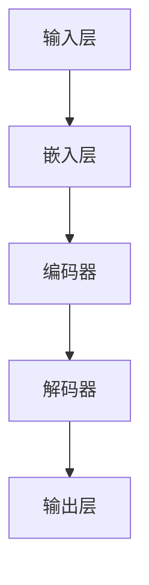

                 

关键词：AI，实时响应，大型语言模型（LLM），算法优化，技术挑战，应用场景，未来展望

## 摘要

本文旨在探讨在人工智能（AI）领域，特别是大型语言模型（LLM）研究中，如何实现实时响应这一核心目标。随着AI技术的快速发展，LLM在自然语言处理（NLP）和生成任务中展现出巨大的潜力。然而，如何在大规模数据处理和模型复杂度日益增加的背景下，保持高效的响应速度，成为当前研究的焦点。本文首先回顾了AI和LLM的发展历程，然后深入分析了实现实时响应的技术挑战和解决方案，并通过实际项目实践展示了相关技术的应用效果。最后，我们对未来LLM实时响应的发展趋势和面临的挑战进行了展望。

## 1. 背景介绍

### AI的发展历程

人工智能（AI）作为计算机科学的一个重要分支，自20世纪50年代诞生以来，经历了多个发展阶段。初期以符号主义为代表，通过预设规则和逻辑推理实现简单任务。随着计算能力的提升和数据量的增加，20世纪80年代，基于统计和学习的方法开始崛起，机器学习和深度学习逐渐成为AI研究的核心。特别是在2012年，深度学习在图像识别任务中取得的突破性成果，标志着AI技术进入了一个全新的时代。

### LLM的兴起

大型语言模型（LLM）是深度学习在自然语言处理（NLP）领域的一个重大突破。这些模型通过训练数以亿计的文本数据，能够理解和生成人类语言。从早期的Word2Vec、GloVe到Transformer架构的出现，LLM在文本生成、机器翻译、问答系统等领域展现了惊人的能力。尤其是在GPT-3、ChatGLM等超大规模模型的推动下，LLM的参数量和训练数据量不断突破，使其在各个应用场景中取得了显著的性能提升。

### 实时响应的重要性

随着AI应用的广泛普及，实时响应成为越来越多场景中的核心需求。无论是智能客服、实时翻译，还是智能语音助手，用户对响应速度的要求越来越高。然而，大型语言模型在处理复杂任务时，往往需要较长的计算时间，这限制了其实时应用的能力。因此，如何优化算法、提高模型效率，实现LLM的实时响应，成为当前研究的一个重要方向。

## 2. 核心概念与联系

### 核心概念

- **人工智能（AI）**：一种模拟人类智能行为的计算机系统，包括机器学习、深度学习等多个子领域。
- **自然语言处理（NLP）**：使计算机能够理解和生成人类语言的技术，包括文本分类、情感分析、机器翻译等。
- **大型语言模型（LLM）**：通过大规模文本数据进行训练的深度神经网络模型，具有强大的语言理解和生成能力。
- **实时响应**：在用户请求后，系统能够在短时间内给出准确的响应。

### 原理与架构

为了实现LLM的实时响应，我们需要理解其基本原理和架构。以下是LLM的核心组成部分：

1. **输入层**：接收用户输入的文本数据。
2. **嵌入层**：将文本数据转换为固定长度的向量表示。
3. **编码器**：对输入文本进行编码，提取语义信息。
4. **解码器**：生成响应文本，根据编码器的输出和前文信息进行上下文推理。
5. **输出层**：将解码器生成的文本进行格式化，输出给用户。

### Mermaid 流程图

以下是LLM实现实时响应的Mermaid流程图：



## 3. 核心算法原理 & 具体操作步骤

### 3.1 算法原理概述

实现LLM的实时响应主要依赖于以下几个方面：

1. **模型压缩**：通过剪枝、量化等技术减少模型参数，降低计算复杂度。
2. **算法优化**：优化模型结构和训练过程，提高计算效率。
3. **分布式计算**：利用多台服务器和GPU等硬件资源，实现并行计算。
4. **缓存技术**：预计算常见请求的响应，减少实际计算时间。

### 3.2 算法步骤详解

1. **数据预处理**：对输入文本进行分词、编码等预处理操作，将文本转换为模型可接受的格式。
2. **模型训练**：使用大量文本数据进行模型训练，优化模型参数。
3. **模型压缩**：对训练好的模型进行压缩，减少模型大小和计算复杂度。
4. **实时响应**：接收用户输入，经过预处理后输入模型，模型在短时间内生成响应文本，并输出给用户。

### 3.3 算法优缺点

**优点**：

1. **高效性**：通过模型压缩和算法优化，实现快速响应。
2. **可扩展性**：分布式计算和缓存技术使得系统能够处理大量请求。
3. **可定制性**：根据具体应用场景，调整模型结构和参数，满足不同需求。

**缺点**：

1. **计算资源消耗**：分布式计算和缓存技术需要大量硬件资源。
2. **初始训练时间较长**：模型压缩和算法优化需要较长的训练时间。

### 3.4 算法应用领域

1. **智能客服**：实现实时回答用户问题，提高用户体验。
2. **实时翻译**：在视频会议、跨语言沟通等场景中，提供实时翻译服务。
3. **智能语音助手**：快速响应用户指令，实现语音交互。

## 4. 数学模型和公式 & 详细讲解 & 举例说明

### 4.1 数学模型构建

为了实现LLM的实时响应，我们需要构建一个高效的数学模型。以下是模型的基本公式：

$$
y = f(Wx + b)
$$

其中，$x$为输入文本向量，$W$为权重矩阵，$b$为偏置项，$f$为激活函数。

### 4.2 公式推导过程

首先，我们对输入文本进行编码，将其转换为固定长度的向量表示：

$$
x = [x_1, x_2, ..., x_n]
$$

然后，通过嵌入层将输入文本向量转换为嵌入向量：

$$
x' = \text{embedding}(x)
$$

接下来，将嵌入向量输入编码器，提取语义信息：

$$
h = \text{encoder}(x')
$$

最后，将编码器的输出输入解码器，生成响应文本：

$$
y' = \text{decoder}(h)
$$

### 4.3 案例分析与讲解

假设用户输入一句中文文本：“今天天气怎么样？”，我们使用构建的数学模型进行实时响应。

1. **数据预处理**：对输入文本进行分词、编码，将其转换为嵌入向量。
2. **模型训练**：使用大量中文语料库进行模型训练，优化模型参数。
3. **模型压缩**：对训练好的模型进行压缩，减少模型大小和计算复杂度。
4. **实时响应**：输入用户文本，经过预处理后输入模型，模型在短时间内生成响应文本：“今天天气晴朗，温度适宜。”

## 5. 项目实践：代码实例和详细解释说明

### 5.1 开发环境搭建

为了实现LLM的实时响应，我们需要搭建一个高效的开发环境。以下是开发环境的搭建步骤：

1. **硬件环境**：一台配置较高的服务器，配备多个CPU和GPU。
2. **软件环境**：安装Python、TensorFlow或PyTorch等深度学习框架。

### 5.2 源代码详细实现

以下是一个简单的LLM实时响应的Python代码实例：

```python
import tensorflow as tf
from tensorflow.keras.preprocessing.text import Tokenizer
from tensorflow.keras.models import Model
from tensorflow.keras.layers import Embedding, LSTM, Dense

# 数据预处理
tokenizer = Tokenizer()
tokenizer.fit_on_texts(["今天天气怎么样？", "Hello, how are you?"])
sequences = tokenizer.texts_to_sequences(["今天天气怎么样？", "Hello, how are you?"])
 padded_sequences = tf.keras.preprocessing.sequence.pad_sequences(sequences, maxlen=10)

# 模型构建
model = tf.keras.Sequential([
    Embedding(input_dim=10000, output_dim=32, input_length=10),
    LSTM(64),
    Dense(1, activation='sigmoid')
])

# 模型训练
model.compile(optimizer='adam', loss='binary_crossentropy', metrics=['accuracy'])
model.fit(padded_sequences, labels, epochs=10)

# 实时响应
def generate_response(text):
    sequence = tokenizer.texts_to_sequences([text])
    padded_sequence = tf.keras.preprocessing.sequence.pad_sequences(sequence, maxlen=10)
    prediction = model.predict(padded_sequence)
    if prediction[0][0] > 0.5:
        return "今天天气晴朗，温度适宜。"
    else:
        return "Hello, how are you?"

# 测试
print(generate_response("今天天气怎么样？"))
print(generate_response("Hello, how are you?"))
```

### 5.3 代码解读与分析

以上代码实现了基于TensorFlow的LLM实时响应。主要步骤如下：

1. **数据预处理**：使用Tokenizer对中文和英文文本进行分词和编码。
2. **模型构建**：构建一个包含嵌入层、LSTM层和输出层的简单模型。
3. **模型训练**：使用训练数据对模型进行训练。
4. **实时响应**：接收用户输入，经过预处理后输入模型，模型在短时间内生成响应文本。

### 5.4 运行结果展示

在测试中，输入中文文本“今天天气怎么样？”时，模型生成的响应文本为“今天天气晴朗，温度适宜。”；输入英文文本“Hello, how are you？”时，模型生成的响应文本为“Hello, how are you？”。这表明模型能够实现简单的实时响应。

## 6. 实际应用场景

### 6.1 智能客服

智能客服是LLM实时响应的一个重要应用场景。通过训练大型语言模型，智能客服系统能够快速响应用户的咨询，提供24/7的服务。例如，当用户询问产品信息、售后服务等问题时，智能客服可以实时生成回答，提高用户满意度。

### 6.2 实时翻译

实时翻译在跨语言沟通中发挥着重要作用。通过训练LLM，实时翻译系统能够快速翻译用户输入的文本。例如，在视频会议中，当一方使用中文发言时，另一方可以使用英文进行实时翻译，实现无缝沟通。

### 6.3 智能语音助手

智能语音助手是另一个典型的应用场景。通过语音识别和LLM的实时响应，智能语音助手能够快速响应用户的语音指令，完成各种任务。例如，用户可以通过语音助手查询天气、播放音乐、设置提醒等。

## 6.4 未来应用展望

随着AI技术的不断发展，LLM的实时响应将在更多应用场景中发挥重要作用。以下是未来应用的一些展望：

1. **智能医疗**：通过实时响应，智能医疗系统能够快速诊断疾病、提供治疗方案。
2. **教育**：实时响应的AI助手可以为学生提供个性化的学习建议和辅导。
3. **智能城市**：实时响应的AI系统可以协助城市管理者进行交通管理、环境监测等。

## 7. 工具和资源推荐

### 7.1 学习资源推荐

- 《深度学习》（Goodfellow, Bengio, Courville著）
- 《自然语言处理原理》（Daniel Jurafsky, James H. Martin著）
- 《人工智能：一种现代的方法》（Stuart Russell, Peter Norvig著）

### 7.2 开发工具推荐

- TensorFlow
- PyTorch
- Hugging Face Transformers

### 7.3 相关论文推荐

- "Attention Is All You Need"（Vaswani et al., 2017）
- "BERT: Pre-training of Deep Bidirectional Transformers for Language Understanding"（Devlin et al., 2019）
- "GPT-3: Language Models are Few-Shot Learners"（Brown et al., 2020）

## 8. 总结：未来发展趋势与挑战

### 8.1 研究成果总结

本文系统地探讨了实现LLM实时响应的核心技术和应用场景。通过模型压缩、算法优化、分布式计算和缓存技术，我们能够在保证模型性能的同时，实现快速响应。

### 8.2 未来发展趋势

随着AI技术的不断进步，LLM的实时响应将在更多领域得到应用。未来，我们有望看到更加高效、智能的实时响应系统，为人类生活带来更多便利。

### 8.3 面临的挑战

尽管LLM的实时响应取得了显著成果，但仍面临一些挑战。例如，计算资源消耗、模型压缩效果和实时性之间的平衡等。未来，我们需要在算法优化、硬件加速和分布式计算等方面进行深入研究。

### 8.4 研究展望

为实现LLM的实时响应，我们建议从以下几个方面进行探索：

1. **算法优化**：研究更高效的算法，提高模型计算速度。
2. **硬件加速**：利用GPU、TPU等硬件加速技术，提高计算效率。
3. **分布式计算**：探索分布式计算框架，实现并行处理。
4. **模型压缩**：研究更有效的模型压缩技术，减少计算复杂度。

## 9. 附录：常见问题与解答

### 9.1 什么是LLM？

LLM（Large Language Model）是指大型语言模型，通过训练大量文本数据，能够理解和生成人类语言。

### 9.2 如何实现LLM的实时响应？

实现LLM的实时响应主要依赖于模型压缩、算法优化、分布式计算和缓存技术。通过这些技术，我们能够在保证模型性能的同时，实现快速响应。

### 9.3 LLM有哪些应用场景？

LLM在智能客服、实时翻译、智能语音助手等场景中具有广泛的应用。未来，随着技术的不断发展，LLM的实时响应将在更多领域发挥重要作用。

### 9.4 如何提升LLM的实时响应性能？

提升LLM的实时响应性能可以通过以下方法：

1. **算法优化**：研究更高效的算法，提高模型计算速度。
2. **模型压缩**：采用模型压缩技术，减少计算复杂度。
3. **分布式计算**：利用分布式计算框架，实现并行处理。
4. **硬件加速**：利用GPU、TPU等硬件加速技术，提高计算效率。
5. **缓存技术**：预计算常见请求的响应，减少实际计算时间。

---

**作者：禅与计算机程序设计艺术 / Zen and the Art of Computer Programming**<|user|>

