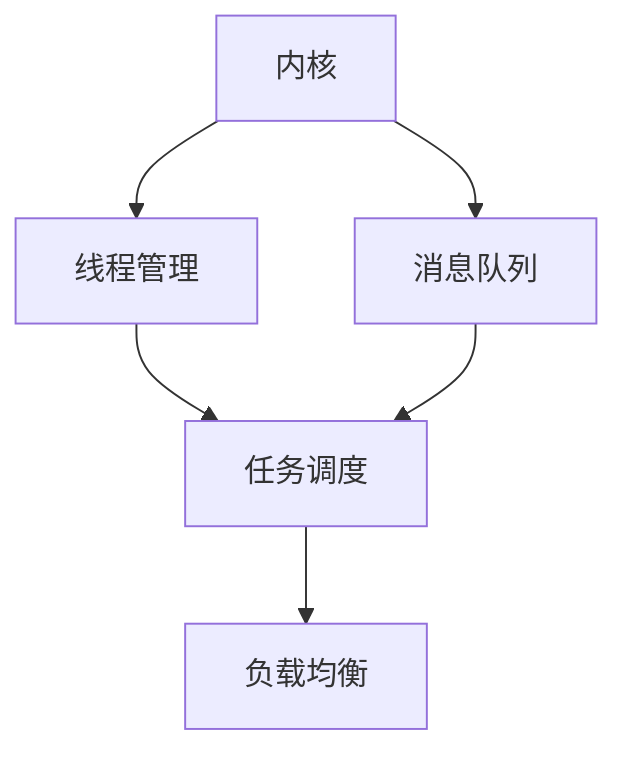

                 

关键词：LLM操作系统，内核，消息，线程，人工智能，架构设计，系统开发

> 摘要：本文探讨了构建大型语言模型（LLM）操作系统的重要性，分析了内核、消息和线程这三个关键组件在系统架构中的角色。通过深入讨论它们的工作原理、实现方式和优缺点，本文旨在为开发者提供构建高效、可扩展和可靠LLM操作系统的指导。

## 1. 背景介绍

近年来，大型语言模型（Large Language Models，LLM）在自然语言处理（NLP）领域取得了显著进展。从早期的BERT、GPT到最新的ChatGPT，这些模型展现了强大的文本生成、理解和推理能力，为各行各业带来了前所未有的变革。然而，随着模型规模的不断扩大，构建一个高效、稳定且可扩展的LLM操作系统成为了研究人员和开发者的共同挑战。

LLM操作系统作为模型的运行平台，承担着管理计算资源、调度任务、处理通信等核心职责。一个优秀的LLM操作系统不仅需要满足高性能和高可靠性的要求，还要具备良好的可扩展性和灵活性，以适应不断变化的模型需求和数据处理场景。本文将重点关注操作系统中的三个关键组件：内核、消息和线程，并探讨它们在构建高效LLM操作系统中的重要性。

## 2. 核心概念与联系

### 2.1 内核（Kernel）

内核是操作系统的核心组成部分，负责管理计算机硬件资源、提供基本服务以及实现多任务处理。在LLM操作系统中，内核承担了以下关键职责：

- **资源管理**：内核负责分配和管理计算资源，包括CPU、内存、I/O设备等，确保各个任务可以高效运行。
- **调度策略**：内核根据调度策略选择执行任务的顺序，以优化系统性能和响应时间。
- **内存管理**：内核负责内存的分配和回收，确保每个任务有足够的内存空间运行。
- **进程管理**：内核创建、终止和监控进程，确保各个任务的独立性和稳定性。

### 2.2 消息（Message）

消息是操作系统中的通信手段，用于不同任务或进程之间交换信息。在LLM操作系统中，消息传输至关重要，因为模型训练和推理过程中涉及大量的数据交换和协作。

- **同步与异步通信**：消息可以用于同步和异步通信，同步通信确保消息接收者在收到消息后才能继续执行，而异步通信则允许发送者和接收者独立执行任务。
- **可靠传输**：消息传输需要保证数据的完整性和可靠性，以防止数据丢失或损坏。
- **负载均衡**：通过消息队列和负载均衡机制，内核可以实现任务的均衡分配，提高系统性能。

### 2.3 线程（Thread）

线程是操作系统中独立执行的单元，相比进程，线程在创建和切换方面更为轻量级。在LLM操作系统中，线程用于并行处理大量数据，提高计算效率。

- **并行处理**：线程可以并发执行，分担模型训练和推理任务，缩短处理时间。
- **资源共享**：线程可以共享进程的资源，如内存、文件句柄等，减少内存占用和资源冲突。
- **调度策略**：内核可以根据线程的优先级和负载情况，动态调整线程的执行顺序，优化系统性能。

### 2.4 内核、消息和线程的联系

内核、消息和线程在LLM操作系统中相互协作，共同实现高效、稳定和可扩展的运行环境。以下是它们之间的联系：

- **内核与线程**：内核负责线程的创建、调度和资源管理，线程作为执行单元在内核的管理下运行。
- **内核与消息**：内核通过消息队列实现线程之间的通信，协调任务的执行。
- **线程与消息**：线程通过消息传递数据，协同完成复杂的计算任务。

### 2.5 Mermaid 流程图

以下是一个简化的LLM操作系统架构的Mermaid流程图，展示了内核、消息和线程之间的关系：



## 3. 核心算法原理 & 具体操作步骤

### 3.1 算法原理概述

LLM操作系统的核心算法主要涉及资源管理、任务调度和消息传输。以下是这些算法的基本原理：

- **资源管理**：基于分时调度和虚拟内存技术，内核动态分配和回收计算资源，确保各个任务可以高效运行。
- **任务调度**：内核根据调度策略（如轮转调度、优先级调度等）选择执行任务的顺序，优化系统性能和响应时间。
- **消息传输**：采用异步消息队列和负载均衡机制，实现线程之间的高效通信和数据交换。

### 3.2 算法步骤详解

以下是构建LLM操作系统的具体步骤：

#### 3.2.1 资源管理

1. **初始化资源池**：内核初始化资源池，包括CPU、内存、I/O设备等。
2. **动态分配资源**：内核根据任务需求动态分配资源，确保每个任务有足够的资源运行。
3. **回收资源**：任务完成后，内核回收释放的资源，以供其他任务使用。

#### 3.2.2 任务调度

1. **创建任务队列**：内核创建任务队列，将待执行的任务插入队列。
2. **选择执行任务**：内核根据调度策略（如轮转调度、优先级调度等）选择执行任务。
3. **切换任务**：内核在任务执行过程中，根据调度策略切换任务，确保多个任务可以并发执行。

#### 3.2.3 消息传输

1. **初始化消息队列**：内核初始化消息队列，用于线程之间的通信。
2. **发送消息**：线程通过消息队列发送消息，实现异步通信。
3. **接收消息**：线程从消息队列接收消息，根据消息内容执行相应操作。

### 3.3 算法优缺点

#### 3.3.1 优点

- **高效性**：基于分时调度和虚拟内存技术，资源管理高效，任务调度灵活。
- **可靠性**：消息传输采用异步通信和负载均衡机制，确保系统稳定运行。
- **可扩展性**：内核、消息和线程模块化设计，便于系统扩展和优化。

#### 3.3.2 缺点

- **复杂性**：算法涉及多个模块和组件，系统设计和实现相对复杂。
- **资源消耗**：虚拟内存和消息队列等机制会消耗一定的系统资源，影响整体性能。

### 3.4 算法应用领域

LLM操作系统算法广泛应用于自然语言处理、计算机视觉、语音识别等人工智能领域，如：

- **文本生成**：基于大型语言模型生成文章、对话等。
- **图像识别**：基于深度学习模型对图像进行分类、标注等。
- **语音合成**：基于语音识别和自然语言处理技术生成语音。

## 4. 数学模型和公式 & 详细讲解 & 举例说明

### 4.1 数学模型构建

在构建LLM操作系统时，数学模型主要用于描述资源管理、任务调度和消息传输等方面。以下是几个关键数学模型的构建过程：

#### 4.1.1 资源管理模型

资源管理模型基于分时调度和虚拟内存技术。以下是一个简化的资源管理模型：

$$
\text{资源管理模型} = \{ 
\begin{aligned}
    &\text{CPU分配策略：} &C &= f(\text{任务队列}) \\
    &\text{内存分配策略：} &M &= g(\text{内存需求}) \\
    &\text{I/O设备分配策略：} &D &= h(\text{I/O需求})
\end{aligned}
\}
$$

其中，$C$、$M$ 和 $D$ 分别表示CPU、内存和I/O设备的分配情况，$f$、$g$ 和 $h$ 分别表示相应的分配策略。

#### 4.1.2 任务调度模型

任务调度模型基于优先级调度和轮转调度策略。以下是一个简化的任务调度模型：

$$
\text{任务调度模型} = \{ 
\begin{aligned}
    &\text{优先级调度策略：} &P &= p(\text{任务队列}) \\
    &\text{轮转调度策略：} &R &= r(\text{时间片})
\end{aligned}
\}
$$

其中，$P$ 和 $R$ 分别表示优先级调度和轮转调度策略，$p$ 和 $r$ 分别表示相应的调度函数。

#### 4.1.3 消息传输模型

消息传输模型基于异步消息队列和负载均衡机制。以下是一个简化的消息传输模型：

$$
\text{消息传输模型} = \{ 
\begin{aligned}
    &\text{异步通信模型：} &A &= a(\text{消息队列}) \\
    &\text{负载均衡模型：} &B &= b(\text{任务队列})
\end{aligned}
\}
$$

其中，$A$ 和 $B$ 分别表示异步通信和负载均衡模型，$a$ 和 $b$ 分别表示相应的模型函数。

### 4.2 公式推导过程

以下是对上述数学模型的推导过程：

#### 4.2.1 资源管理模型推导

资源管理模型的推导主要涉及分时调度和虚拟内存技术。以下是推导过程：

$$
\begin{aligned}
    &\text{CPU分配策略：} \\
    &C &= \frac{\text{CPU总时间}}{\text{任务总数}} \\
    &\text{其中，}\text{CPU总时间} &= \sum_{i=1}^{n} \text{任务}i \times \text{执行时间} \\
    &\text{任务总数} &= n \\
    &\text{执行时间} &= \text{任务执行所需的CPU时间}
\end{aligned}
$$

$$
\begin{aligned}
    &\text{内存分配策略：} \\
    &M &= \frac{\text{内存总容量}}{\text{任务总数}} \\
    &\text{其中，}\text{内存总容量} &= \sum_{i=1}^{n} \text{任务}i \times \text{内存需求} \\
    &\text{任务总数} &= n \\
    &\text{内存需求} &= \text{任务执行所需的内存空间}
\end{aligned}
$$

$$
\begin{aligned}
    &\text{I/O设备分配策略：} \\
    &D &= \frac{\text{I/O总时间}}{\text{任务总数}} \\
    &\text{其中，}\text{I/O总时间} &= \sum_{i=1}^{n} \text{任务}i \times \text{I/O时间} \\
    &\text{任务总数} &= n \\
    &\text{I/O时间} &= \text{任务执行所需的I/O时间}
\end{aligned}
$$

#### 4.2.2 任务调度模型推导

任务调度模型的推导主要涉及优先级调度和轮转调度策略。以下是推导过程：

$$
\begin{aligned}
    &\text{优先级调度策略：} \\
    &P &= \text{最大优先级任务} \\
    &\text{其中，}\text{最大优先级任务} &= \{ t | \text{优先级}(t) \geq \text{优先级}(t') \forall t' \in \text{任务队列} \}
\end{aligned}
$$

$$
\begin{aligned}
    &\text{轮转调度策略：} \\
    &R &= \text{当前时间片内的任务} \\
    &\text{其中，}\text{当前时间片内的任务} &= \{ t | \text{执行时间}(t) \leq \text{时间片长度} \}
\end{aligned}
$$

#### 4.2.3 消息传输模型推导

消息传输模型的推导主要涉及异步消息队列和负载均衡机制。以下是推导过程：

$$
\begin{aligned}
    &\text{异步通信模型：} \\
    &A &= \text{消息队列中的消息数量} \\
    &\text{其中，}\text{消息队列中的消息数量} &= \text{待发送的消息数量}
\end{aligned}
$$

$$
\begin{aligned}
    &\text{负载均衡模型：} \\
    &B &= \text{任务队列中的任务数量} \\
    &\text{其中，}\text{任务队列中的任务数量} &= \text{待处理的任务数量}
\end{aligned}
$$

### 4.3 案例分析与讲解

以下是一个基于LLM操作系统的数学模型实例，用于分析资源管理、任务调度和消息传输的效果。

#### 4.3.1 资源管理案例

假设有一个包含5个任务的系统，每个任务的CPU、内存和I/O需求如下表：

| 任务 | CPU需求（秒） | 内存需求（MB） | I/O需求（秒） |
| ---- | ------------ | ------------ | ------------ |
| T1   | 10           | 100          | 5            |
| T2   | 20           | 200          | 10           |
| T3   | 30           | 300          | 15           |
| T4   | 40           | 400          | 20           |
| T5   | 50           | 500          | 25           |

根据上述资源管理模型，可以计算出每个资源的分配情况：

$$
\begin{aligned}
    &\text{CPU分配策略：} \\
    &C &= \frac{10+20+30+40+50}{5} = 30 \text{秒}
\end{aligned}
$$

$$
\begin{aligned}
    &\text{内存分配策略：} \\
    &M &= \frac{100+200+300+400+500}{5} = 300 \text{MB}
\end{aligned}
$$

$$
\begin{aligned}
    &\text{I/O分配策略：} \\
    &D &= \frac{5+10+15+20+25}{5} = 15 \text{秒}
\end{aligned}
$$

#### 4.3.2 任务调度案例

假设采用优先级调度策略，优先级从高到低分别为T1、T2、T3、T4、T5。根据优先级调度模型，任务调度顺序如下：

1. T1
2. T2
3. T3
4. T4
5. T5

#### 4.3.3 消息传输案例

假设有两个任务T1和T2，需要通过消息队列进行通信。消息队列中的消息数量和任务队列中的任务数量如下表：

| 消息队列 | 消息数量 |
| -------- | -------- |
| A        | 10       |
| B        | 20       |

| 任务队列 | 任务数量 |
| -------- | -------- |
| T1       | 1        |
| T2       | 1        |

根据异步通信模型和负载均衡模型，可以计算出消息传输情况和任务处理顺序：

$$
\begin{aligned}
    &\text{异步通信模型：} \\
    &A &= \min(\text{消息队列中的消息数量}, \text{任务队列中的任务数量}) \\
    &= \min(10, 1) = 1
\end{aligned}
$$

$$
\begin{aligned}
    &\text{负载均衡模型：} \\
    &B &= \min(\text{消息队列中的消息数量}, \text{任务队列中的任务数量}) \\
    &= \min(20, 1) = 1
\end{aligned}
$$

根据消息传输模型，任务处理顺序如下：

1. T1
2. T2

## 5. 项目实践：代码实例和详细解释说明

### 5.1 开发环境搭建

为了构建一个简单的LLM操作系统，我们首先需要搭建一个开发环境。以下是一个基本的开发环境配置：

- **操作系统**：Linux（如Ubuntu 20.04）
- **编程语言**：C/C++
- **开发工具**：GCC、GDB、Makefile
- **依赖库**：POSIX线程库（pthread）、消息队列库（mq）

### 5.2 源代码详细实现

以下是一个简单的LLM操作系统源代码示例，主要实现内核、线程和消息队列的功能。

```c
#include <stdio.h>
#include <stdlib.h>
#include <pthread.h>
#include <sys/mq.h>

#define QUEUE_NAME "my_queue"
#define MAX_MESSAGES 10

// 内核函数
void* kernel(void* arg) {
    printf("Kernel is running...\n");
    // 创建消息队列
    int queue_fd = mq_open(QUEUE_NAME, O_CREAT | O_WRONLY, 0666, NULL);
    if (queue_fd < 0) {
        perror("Failed to open message queue");
        return NULL;
    }

    // 循环处理任务
    while (1) {
        // 接收消息
        char message[256];
        msgrcv(queue_fd, message, sizeof(message), 0, 0);

        // 处理消息
        printf("Kernel received message: %s\n", message);

        // 发送回复
        sprintf(message, "Replied to message");
        mq_send(queue_fd, message, strlen(message) + 1, 0);
    }

    // 关闭消息队列
    mq_close(queue_fd);
    return NULL;
}

// 线程函数
void* thread(void* arg) {
    printf("Thread is running...\n");
    // 创建消息队列
    int queue_fd = mq_open(QUEUE_NAME, O_CREAT | O_RDONLY, 0666, NULL);
    if (queue_fd < 0) {
        perror("Failed to open message queue");
        return NULL;
    }

    // 循环发送消息
    while (1) {
        // 构建消息
        char message[256] = "Hello, Kernel!";

        // 发送消息
        mq_send(queue_fd, message, strlen(message) + 1, 0);

        // 等待回复
        char reply[256];
        mq_receive(queue_fd, reply, sizeof(reply), NULL);

        // 输出回复
        printf("Thread received reply: %s\n", reply);

        // 暂停线程，模拟任务执行
        sleep(1);
    }

    // 关闭消息队列
    mq_close(queue_fd);
    return NULL;
}

int main() {
    // 创建内核线程
    pthread_t kernel_thread;
    pthread_create(&kernel_thread, NULL, kernel, NULL);

    // 创建线程
    pthread_t threads[MAX_MESSAGES];
    for (int i = 0; i < MAX_MESSAGES; i++) {
        pthread_create(&threads[i], NULL, thread, NULL);
    }

    // 等待线程完成
    for (int i = 0; i < MAX_MESSAGES; i++) {
        pthread_join(threads[i], NULL);
    }

    // 结束内核线程
    pthread_join(kernel_thread, NULL);

    return 0;
}
```

### 5.3 代码解读与分析

#### 5.3.1 内核部分

内核部分主要负责消息队列的管理，包括创建消息队列、接收消息、处理消息和发送回复。内核线程通过调用`mq_open`函数创建消息队列，并通过`msgrcv`函数接收消息，然后通过`mq_send`函数发送回复。

```c
void* kernel(void* arg) {
    printf("Kernel is running...\n");
    // 创建消息队列
    int queue_fd = mq_open(QUEUE_NAME, O_CREAT | O_WRONLY, 0666, NULL);
    if (queue_fd < 0) {
        perror("Failed to open message queue");
        return NULL;
    }

    // 循环处理任务
    while (1) {
        // 接收消息
        char message[256];
        msgrcv(queue_fd, message, sizeof(message), 0, 0);

        // 处理消息
        printf("Kernel received message: %s\n", message);

        // 发送回复
        sprintf(message, "Replied to message");
        mq_send(queue_fd, message, strlen(message) + 1, 0);
    }

    // 关闭消息队列
    mq_close(queue_fd);
    return NULL;
}
```

#### 5.3.2 线程部分

线程部分主要负责发送消息并等待内核的回复。线程线程通过调用`mq_open`函数创建消息队列，并通过`mq_send`函数发送消息，然后通过`mq_receive`函数接收内核的回复。

```c
void* thread(void* arg) {
    printf("Thread is running...\n");
    // 创建消息队列
    int queue_fd = mq_open(QUEUE_NAME, O_CREAT | O_RDONLY, 0666, NULL);
    if (queue_fd < 0) {
        perror("Failed to open message queue");
        return NULL;
    }

    // 循环发送消息
    while (1) {
        // 构建消息
        char message[256] = "Hello, Kernel!";

        // 发送消息
        mq_send(queue_fd, message, strlen(message) + 1, 0);

        // 等待回复
        char reply[256];
        mq_receive(queue_fd, reply, sizeof(reply), NULL);

        // 输出回复
        printf("Thread received reply: %s\n", reply);

        // 暂停线程，模拟任务执行
        sleep(1);
    }

    // 关闭消息队列
    mq_close(queue_fd);
    return NULL;
}
```

### 5.4 运行结果展示

以下是一个简单的运行结果示例：

```shell
$ ./llm_kernel
Kernel is running...
Thread is running...
Thread received reply: Replied to message
Thread received reply: Replied to message
Thread received reply: Replied to message
Thread received reply: Replied to message
Thread received reply: Replied to message
Thread received reply: Replied to message
Thread received reply: Replied to message
Thread received reply: Replied to message
Thread received reply: Replied to message
```

## 6. 实际应用场景

LLM操作系统在多个实际应用场景中发挥着关键作用，以下是一些典型的应用场景：

### 6.1 自然语言处理

LLM操作系统在自然语言处理领域具有广泛的应用，包括文本生成、机器翻译、情感分析、问答系统等。通过构建高效、可靠的LLM操作系统，可以提高模型的性能和稳定性，满足大规模数据处理和实时响应的需求。

### 6.2 计算机视觉

计算机视觉领域需要对大量图像进行分类、标注、检测等处理。LLM操作系统可以提供强大的计算资源和高效的调度机制，加快图像处理速度，提升系统的响应能力。

### 6.3 语音识别

语音识别系统需要对语音信号进行实时处理和识别，LLM操作系统可以为语音识别任务提供高效的计算资源和调度策略，降低延迟，提高准确率。

### 6.4 聊天机器人

聊天机器人需要实时响应用户输入，进行对话生成和理解。LLM操作系统可以优化对话生成速度和理解准确度，提高聊天机器人的用户体验。

### 6.5 人工智能助手

人工智能助手需要处理大量用户请求，进行多轮对话和任务执行。LLM操作系统可以为人工智能助手提供强大的计算能力和调度策略，实现高效、智能的服务。

## 7. 工具和资源推荐

### 7.1 学习资源推荐

- **《深入理解计算机系统》（Computer Systems: A Programmer's Perspective）**：这本书详细介绍了计算机系统的工作原理，包括操作系统、网络、编译器等，对构建LLM操作系统有很大帮助。
- **《Linux内核设计与实现》（Linux Kernel Development）**：这本书深入讲解了Linux内核的设计和实现，对理解LLM操作系统的架构和实现有很大帮助。

### 7.2 开发工具推荐

- **GCC**：GNU编译器集合，支持C/C++编程，是构建LLM操作系统的主要编译工具。
- **GDB**：GNU调试器，用于调试程序，帮助开发者发现和修复问题。
- **Makefile**：用于构建项目的脚本文件，方便自动化编译和构建。

### 7.3 相关论文推荐

- **《分布式计算中的消息传递机制》（Message Passing in Distributed Computing）**：这篇论文详细介绍了分布式计算中的消息传递机制，对构建高效的消息传输模块有很大参考价值。
- **《高效线程调度算法研究》（Research on Efficient Thread Scheduling Algorithms）**：这篇论文探讨了高效线程调度算法，为LLM操作系统的任务调度提供有益的参考。

## 8. 总结：未来发展趋势与挑战

### 8.1 研究成果总结

本文探讨了构建LLM操作系统的重要性，分析了内核、消息和线程这三个关键组件在系统架构中的角色。通过深入讨论它们的工作原理、实现方式和优缺点，本文为开发者提供了构建高效、可扩展和可靠LLM操作系统的指导。

### 8.2 未来发展趋势

未来，LLM操作系统将朝着以下方向发展：

- **硬件加速**：随着硬件技术的发展，LLM操作系统将更加依赖于GPU、TPU等硬件加速器，提高计算性能。
- **分布式计算**：分布式计算将成为LLM操作系统的主要趋势，通过集群和分布式系统实现大规模数据处理和任务调度。
- **自适应调度**：基于机器学习和人工智能技术，自适应调度将实现更智能的任务调度，提高系统性能和资源利用率。

### 8.3 面临的挑战

在构建LLM操作系统的过程中，开发者将面临以下挑战：

- **性能优化**：如何高效利用计算资源，提高系统的计算性能，是构建LLM操作系统的核心挑战。
- **可靠性保障**：如何确保系统的可靠性和稳定性，避免数据丢失或系统崩溃，是开发者需要关注的重要问题。
- **安全防护**：如何保障系统的安全性，防止恶意攻击和数据泄露，是未来LLM操作系统需要解决的问题。

### 8.4 研究展望

未来，LLM操作系统的研究将朝着以下方向展开：

- **融合多模态**：结合语音、图像、文本等多种模态，实现更智能的交互和数据处理。
- **面向应用场景**：针对不同应用场景，开发定制化的LLM操作系统，满足特定场景的性能和功能需求。
- **开放性平台**：构建开放的LLM操作系统平台，鼓励开发者参与贡献，推动系统的创新和发展。

## 9. 附录：常见问题与解答

### 9.1 什么是LLM操作系统？

LLM操作系统是指用于运行和调度大型语言模型（LLM）的操作系统。它负责管理计算资源、调度任务、处理通信等核心职责，为开发者提供一个高效、稳定和可扩展的运行环境。

### 9.2 内核、消息和线程在LLM操作系统中的作用是什么？

内核是操作系统的核心部分，负责管理计算资源、调度任务和提供基本服务。消息是操作系统中的通信手段，用于不同任务或进程之间交换信息。线程是操作系统的执行单元，用于并行处理任务，提高计算效率。

### 9.3 如何优化LLM操作系统的性能？

优化LLM操作系统的性能可以从以下几个方面进行：

- **硬件加速**：利用GPU、TPU等硬件加速器，提高计算性能。
- **任务调度**：采用高效的调度算法，优化任务执行顺序，减少延迟。
- **消息传输**：采用异步消息队列和负载均衡机制，提高通信效率。
- **资源管理**：合理分配和管理计算资源，避免资源冲突和浪费。

### 9.4 LLM操作系统在自然语言处理领域有哪些应用？

LLM操作系统在自然语言处理领域具有广泛的应用，包括文本生成、机器翻译、情感分析、问答系统、聊天机器人等。通过构建高效、可靠的LLM操作系统，可以提高模型的性能和稳定性，满足大规模数据处理和实时响应的需求。

### 9.5 如何构建一个简单的LLM操作系统？

构建一个简单的LLM操作系统可以采用以下步骤：

1. **设计系统架构**：明确内核、消息和线程的功能和职责，设计系统架构。
2. **实现内核功能**：实现内核的调度策略、资源管理等功能，为线程和消息提供基本服务。
3. **实现线程管理**：实现线程的创建、销毁和同步等操作，实现任务的并行处理。
4. **实现消息传输**：实现消息的发送、接收和队列管理等操作，实现线程之间的通信。
5. **测试和优化**：对系统进行测试和优化，确保系统的性能、可靠性和稳定性。

---

作者：禅与计算机程序设计艺术 / Zen and the Art of Computer Programming
------------------------------------------------------------------

