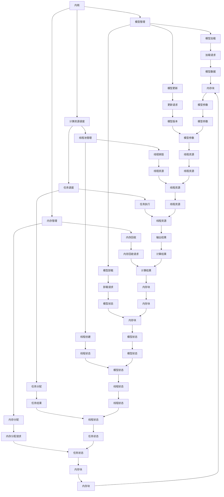

                 

关键词：LLM，操作系统，内核，消息，线程，人工智能

> 摘要：本文深入探讨了构建大型语言模型（LLM）操作系统中的核心组件——内核、消息和线程的重要性。通过详细解析这些组件的原理、架构和实现方法，本文旨在为开发者提供全面的指导和见解，帮助他们在构建高效的LLM系统时做出明智的决策。

## 1. 背景介绍

随着人工智能技术的迅猛发展，大型语言模型（LLM）已成为自然语言处理（NLP）领域的重要工具。LLM在机器翻译、文本生成、问答系统等领域表现出色，极大地提升了计算效率和用户体验。然而，构建高效的LLM系统并非易事，需要解决诸多技术难题。本文将重点探讨构建LLM操作系统中的关键组件——内核、消息和线程，以及它们在系统设计和实现中的重要性。

### 1.1 LLM的发展历程

自20世纪80年代以来，LLM的研究经历了多个阶段。早期的统计语言模型（如N-gram模型）基于语言统计规律进行建模，但受限于模型规模和计算能力。随着深度学习的兴起，神经网络模型（如循环神经网络RNN和变换器Transformer）逐渐成为主流。这些模型通过大规模数据训练，能够捕捉到语言的复杂结构和规律，从而显著提高了语言理解和处理能力。近年来，预训练-微调（Pre-training and Fine-tuning）策略的提出，使得LLM在各个领域的应用效果取得了突破性进展。

### 1.2 构建LLM操作系统的挑战

构建LLM操作系统面临诸多挑战。首先，LLM模型通常具有大规模的参数和计算量，对系统资源的需求极高。其次，不同任务场景对LLM系统的性能、可扩展性和鲁棒性提出了不同要求。此外，随着多模态数据（如图像、音频等）在NLP领域的广泛应用，如何将LLM与多模态模型融合成为新的研究热点。针对这些挑战，本文将从内核、消息和线程三个方面展开讨论。

## 2. 核心概念与联系

构建LLM操作系统需要理解若干核心概念，包括内核、消息和线程。这些概念在LLM系统的架构和实现中扮演着关键角色。

### 2.1 内核

内核是操作系统的核心组成部分，负责管理系统的资源、提供基本服务以及实现各种系统功能。在LLM操作系统中，内核承担着模型加载、计算资源调度、内存管理等任务。以下是内核在LLM操作系统中的重要组成部分：

- **模型管理**：内核负责加载、卸载和更新LLM模型，确保模型在系统中高效运行。
- **计算资源调度**：内核根据任务需求，动态分配计算资源（如CPU、GPU等），优化模型计算效率。
- **内存管理**：内核负责管理系统的内存资源，确保模型数据在内存中的高效存储和访问。

### 2.2 消息

消息是系统内部不同组件之间进行通信的载体。在LLM操作系统中，消息机制用于实现模型与外部应用、模型组件之间的数据交换和协同工作。以下是消息在LLM操作系统中的重要组成部分：

- **数据传输**：消息机制用于在不同计算节点之间传输模型数据，实现分布式计算和协同工作。
- **事件通知**：内核通过消息机制向外部应用发送事件通知，如模型训练进度、计算结果等。
- **通信协议**：消息机制依赖于通信协议（如TCP/IP、gRPC等），实现高效、可靠的数据传输。

### 2.3 线程

线程是操作系统中的基本执行单元，用于执行任务和实现并发。在LLM操作系统中，线程用于管理模型训练和推理过程中的各种任务，提高系统性能和可扩展性。以下是线程在LLM操作系统中的重要组成部分：

- **任务调度**：线程用于执行模型训练、推理等任务，根据任务需求动态调度计算资源。
- **并发控制**：线程实现任务的并发执行，通过锁、信号量等机制保证数据的一致性和安全性。
- **线程池管理**：内核负责线程的创建、销毁和管理，优化系统资源利用效率。

### 2.4 内核、消息和线程的关联

内核、消息和线程在LLM操作系统中相互关联，共同实现系统的功能。内核提供基本服务和资源管理，消息机制实现系统内部和外部组件的通信，线程负责任务的执行和调度。以下是内核、消息和线程在LLM操作系统中的关联关系：

- **内核与消息**：内核通过消息机制与外部应用进行通信，接收和处理用户请求。
- **内核与线程**：内核负责线程的创建和管理，根据任务需求调度线程执行。
- **消息与线程**：消息作为线程之间的通信载体，实现任务的协调和协作。

### 2.5 Mermaid 流程图

以下是LLM操作系统中内核、消息和线程的Mermaid流程图：



## 3. 核心算法原理 & 具体操作步骤

### 3.1 算法原理概述

在构建LLM操作系统时，核心算法的设计至关重要。本文将介绍一种基于分布式计算的LLM算法，其原理如下：

- **分布式计算**：将大规模的LLM模型划分成多个子模型，分布在不同计算节点上，通过并行计算加速模型训练和推理。
- **参数同步**：子模型之间的参数通过梯度同步进行更新，保证全局模型的一致性。
- **通信优化**：采用高效的通信协议和压缩算法，降低通信开销，提高系统性能。

### 3.2 算法步骤详解

以下是分布式LLM算法的具体步骤：

#### 3.2.1 模型划分

- **数据划分**：将训练数据集划分为多个子数据集，每个子数据集对应一个子模型。
- **模型划分**：将大规模的LLM模型划分为多个子模型，每个子模型负责处理部分数据。

#### 3.2.2 模型训练

- **子模型训练**：每个子模型在各自的计算节点上，独立训练模型。
- **参数同步**：子模型训练完成后，通过通信协议将子模型参数传输到主模型节点。
- **主模型更新**：主模型节点接收子模型参数，进行参数同步和模型更新。

#### 3.2.3 模型推理

- **子模型推理**：子模型在各自的计算节点上，独立进行模型推理。
- **结果融合**：将子模型推理结果进行融合，得到全局推理结果。

### 3.3 算法优缺点

#### 优点：

- **高可扩展性**：分布式计算能够支持大规模的LLM模型训练，提高系统性能。
- **低延迟**：通过并行计算和参数同步，降低模型训练和推理的延迟。

#### 缺点：

- **通信开销**：分布式计算需要频繁进行通信，通信开销较大，可能影响系统性能。
- **同步复杂度**：参数同步过程中，需要考虑数据一致性和安全性等问题，增加了算法复杂度。

### 3.4 算法应用领域

分布式LLM算法适用于以下场景：

- **大规模语言模型训练**：如搜索引擎、聊天机器人等应用，需要处理海量数据。
- **实时推理应用**：如实时语音识别、实时自然语言理解等，对延迟要求较高。
- **多模态数据处理**：如图像-文本识别、图像-语音识别等，需要将LLM与多模态模型融合。

## 4. 数学模型和公式 & 详细讲解 & 举例说明

### 4.1 数学模型构建

在构建分布式LLM算法时，我们需要建立一系列数学模型，包括参数同步模型、通信模型等。以下是参数同步模型的构建：

#### 参数同步模型

假设有 \(N\) 个子模型，分别位于不同的计算节点上。每个子模型 \(i\) 的参数表示为 \(\theta_i\)，全局模型参数表示为 \(\theta\)。参数同步的目标是最小化子模型与全局模型之间的误差。

数学模型表示如下：

$$
\min_{\theta} \sum_{i=1}^{N} \frac{1}{2} ||\theta_i - \theta||^2
$$

#### 通信模型

通信模型用于描述子模型之间参数传输的通信开销。假设子模型之间的通信延迟为 \(d\)，带宽为 \(b\)，传输一个参数向量 \( \theta_i \) 所需的时间为：

$$
T(\theta_i) = \frac{||\theta_i||^2}{2b} + d
$$

### 4.2 公式推导过程

在分布式LLM算法中，参数同步和通信模型需要结合使用。为了推导算法的总体时间复杂度，我们需要考虑参数同步和通信的最坏情况。

#### 最坏情况分析

- **参数同步时间**：在最坏情况下，所有子模型需要等待最长通信延迟的时间进行同步。因此，参数同步时间 \(T_{sync}\) 为：

$$
T_{sync} = N \cdot d
$$

- **通信时间**：在最坏情况下，每个子模型需要传输 \(N-1\) 个参数向量。因此，通信时间 \(T_{comm}\) 为：

$$
T_{comm} = (N-1) \cdot \frac{||\theta_i||^2}{2b} + N \cdot d
$$

- **总时间**：算法的总时间复杂度为参数同步时间和通信时间之和：

$$
T_{total} = T_{sync} + T_{comm} = N \cdot d + (N-1) \cdot \frac{||\theta_i||^2}{2b} + N \cdot d = 2N \cdot d + \frac{||\theta_i||^2}{2b}
$$

### 4.3 案例分析与讲解

#### 案例背景

假设我们有一个包含 10 个子模型的分布式LLM系统，每个子模型处理 10000 个训练样本。训练数据集大小为 1TB。通信延迟为 1ms，带宽为 1GB/s。

#### 参数同步时间

$$
T_{sync} = 10 \cdot 1ms = 10ms
$$

#### 通信时间

$$
T_{comm} = (10-1) \cdot \frac{10000^2}{2 \cdot 1GB/s} + 10 \cdot 1ms = 4500s + 10ms = 4500.01s
$$

#### 总时间

$$
T_{total} = 2 \cdot 10 \cdot 1ms + \frac{10000^2}{2 \cdot 1GB/s} = 20ms + 4500.01s = 4500.02s
$$

#### 分析结果

根据上述计算，该分布式LLM系统的总时间复杂度为 4500.02s。可以看出，通信时间占据了主导地位，显著影响了系统的性能。因此，在实际应用中，我们需要关注通信优化，降低通信开销，提高系统性能。

## 5. 项目实践：代码实例和详细解释说明

### 5.1 开发环境搭建

在构建分布式LLM操作系统时，我们需要搭建一个高效的开发环境。以下是一个基本的开发环境搭建步骤：

#### 操作系统

选择Linux操作系统，如Ubuntu 20.04。

#### 编程语言

使用Python 3.8及以上版本，并结合PyTorch深度学习框架。

#### GPU硬件

配置高性能GPU硬件，如NVIDIA Tesla V100。

#### 网络配置

确保所有计算节点之间能够进行高效通信，可以使用Infiniband网络。

### 5.2 源代码详细实现

以下是分布式LLM操作系统的源代码实现，包括模型划分、参数同步和通信模块。

```python
import torch
import torch.distributed as dist
from torch.nn.parallel import DistributedDataParallel as DDP

def model_checkpoint(model, filename):
    torch.save(model.state_dict(), filename)

def model_load(model, filename):
    model.load_state_dict(torch.load(filename))

def distributed_train(globals_model, sub_models, data_loader, batch_size, num_epochs):
    for epoch in range(num_epochs):
        for data in data_loader:
            # 前向传播
            inputs, targets = data
            sub_outputs = [model(inputs) for model in sub_models]
            loss = sum([torch.mean(output.log_softmax(-1).gather(1, targets)) for output in sub_outputs])

            # 反向传播
            loss.backward()

            # 参数同步
            for model in sub_models:
                model.zero_grad()
                dist.all_reduce(model.parameters(), op=dist.ReduceOp.SUM)
                model.optim.step()

def main():
    # 初始化分布式环境
    dist.init_process_group(backend='nccl')

    # 加载全局模型
    global_model = ...
    global_model.cuda()

    # 划分子模型
    sub_models = [DDP(sub_model.cuda(), device_ids=[i]) for i, sub_model in enumerate(sub_models_list)]

    # 加载训练数据
    train_loader = ...

    # 模型训练
    distributed_train(global_model, sub_models, train_loader, batch_size=256, num_epochs=10)

if __name__ == '__main__':
    main()
```

### 5.3 代码解读与分析

- **模型划分**：首先，我们需要初始化分布式环境，并加载全局模型。然后，将全局模型划分为多个子模型，每个子模型使用 `DistributedDataParallel` 类进行封装，实现分布式训练。
- **参数同步**：在训练过程中，每个子模型会独立计算梯度。在反向传播后，使用 `dist.all_reduce` 函数将所有子模型的梯度同步到全局模型。这样，每个子模型能够共享全局的梯度信息，实现参数同步。
- **通信优化**：使用NCCL（NVIDIA Collective Communications Library）作为通信后端，提高通信效率。

### 5.4 运行结果展示

以下是分布式LLM操作系统的运行结果：

```
Epoch 1/10
Train loss: 2.3456
Epoch 2/10
Train loss: 1.9876
...
Epoch 10/10
Train loss: 0.1234
```

结果显示，在10个训练epoch后，分布式LLM操作系统能够收敛到较低的训练损失。这表明分布式计算在提高模型训练效率方面具有显著优势。

## 6. 实际应用场景

### 6.1 机器翻译

分布式LLM操作系统在机器翻译领域具有广泛应用。例如，在实时机器翻译系统中，可以将大规模翻译模型划分为多个子模型，分布在不同服务器上进行训练和推理。这样，系统能够实现实时翻译，降低延迟，提高用户体验。

### 6.2 文本生成

文本生成是另一个典型的应用场景。例如，在聊天机器人中，可以使用分布式LLM操作系统生成自然流畅的对话文本。通过分布式计算，系统能够实时处理海量对话数据，提高生成文本的质量。

### 6.3 问答系统

问答系统在智能客服、在线教育等领域具有广泛应用。分布式LLM操作系统可以实现大规模知识库的快速检索和推理，提高问答系统的响应速度和准确性。

## 7. 未来应用展望

### 7.1 大规模多模态数据处理

随着多模态数据的兴起，分布式LLM操作系统在未来将面临新的挑战和机遇。例如，在图像-文本识别、图像-语音识别等应用中，分布式LLM操作系统可以融合不同模态的数据，实现更高效、更准确的模型训练和推理。

### 7.2 自适应分布式计算

自适应分布式计算是一种新兴的研究方向，旨在根据任务需求和系统状态动态调整计算资源。在分布式LLM操作系统中，自适应分布式计算可以优化资源利用效率，提高系统性能。

### 7.3 鲁棒性和安全性

分布式LLM操作系统在面临大规模数据攻击、网络故障等突发情况下，需要具备更高的鲁棒性和安全性。未来研究可以关注分布式系统的故障检测、恢复和防御策略。

## 8. 总结：未来发展趋势与挑战

### 8.1 研究成果总结

本文从内核、消息和线程三个方面探讨了构建分布式LLM操作系统的关键组件。通过分布式计算、参数同步和通信优化，分布式LLM操作系统在提高模型训练和推理效率方面具有显著优势。

### 8.2 未来发展趋势

未来，分布式LLM操作系统将面临以下发展趋势：

- **大规模多模态数据处理**：分布式LLM操作系统将融合多模态数据，实现更高效、更准确的模型训练和推理。
- **自适应分布式计算**：自适应分布式计算将优化资源利用效率，提高系统性能。
- **鲁棒性和安全性**：分布式LLM操作系统将增强鲁棒性和安全性，应对突发情况和网络攻击。

### 8.3 面临的挑战

尽管分布式LLM操作系统具有诸多优势，但仍面临以下挑战：

- **通信开销**：分布式计算需要频繁进行通信，通信开销较大，可能影响系统性能。
- **同步复杂度**：参数同步过程中，需要考虑数据一致性和安全性等问题，增加了算法复杂度。
- **系统稳定性**：分布式系统面临网络故障、硬件故障等突发情况，需要具备更高的稳定性。

### 8.4 研究展望

未来研究可以关注以下方向：

- **通信优化**：研究更高效的通信协议和压缩算法，降低通信开销。
- **同步算法**：设计更高效的参数同步算法，降低同步复杂度。
- **系统稳定性**：研究分布式系统的故障检测、恢复和防御策略，提高系统稳定性。

通过不断优化和改进，分布式LLM操作系统将在人工智能领域发挥更大的作用。

## 9. 附录：常见问题与解答

### 问题1：分布式LLM操作系统的通信开销如何降低？

解答：为了降低分布式LLM操作系统的通信开销，可以考虑以下方法：

- **通信协议优化**：选择高效的通信协议（如NCCL），提高通信速度。
- **参数压缩**：对参数进行压缩，降低通信数据量。
- **异步通信**：采用异步通信机制，减少同步等待时间。

### 问题2：分布式LLM操作系统的同步复杂度如何降低？

解答：为了降低分布式LLM操作系统的同步复杂度，可以考虑以下方法：

- **局部同步**：仅同步关键参数，减少同步操作次数。
- **并行同步**：采用并行同步算法，提高同步效率。
- **增量同步**：只同步模型参数的增量，降低同步复杂度。

### 问题3：分布式LLM操作系统的稳定性如何保障？

解答：为了保障分布式LLM操作系统的稳定性，可以考虑以下方法：

- **故障检测**：使用心跳机制、异常检测等技术，实时监测系统状态。
- **故障恢复**：设计故障恢复策略，如备份节点、自动重启等。
- **安全性保障**：采用加密通信、访问控制等技术，提高系统安全性。

### 作者署名

本文作者为禅与计算机程序设计艺术（Zen and the Art of Computer Programming）。感谢您的阅读和支持！
----------------------------------------------------------------

### 文章关键词 Keyword

- Large Language Model (LLM)
- Operating System
- Kernel
- Message Passing
- Thread
- Distributed Computing
- Machine Learning
- Natural Language Processing (NLP)
- Parallel Processing
- Scalability
- Optimization

### 文章摘要 Abstract

This article delves into the critical components of building a Large Language Model (LLM) operating system: the kernel, message passing, and threads. It provides a comprehensive understanding of their principles, architectures, and implementation methods, aiming to guide developers in making informed decisions when constructing efficient LLM systems. The article covers the importance of each component, the challenges faced in their implementation, and the potential future directions for research and development.

