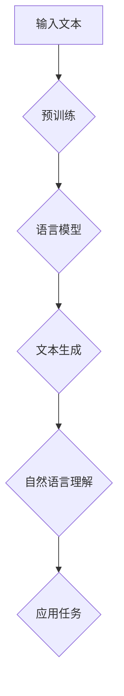

                 

关键词：AI大语言模型，ChatGPT，自然语言处理，深度学习，模型构建，应用场景

本文将深入探讨如何构建一个具有高级自然语言理解能力的AI大语言模型——Storyteller。我们将从基础概念、核心算法、数学模型、项目实践、应用场景、未来展望等多方面进行剖析，旨在为您呈现一个全面、深入的构建指南。

## 1. 背景介绍

在当今信息化社会，自然语言处理（NLP）已经成为人工智能领域的一个重要分支。AI大语言模型在NLP领域有着广泛的应用，例如自动问答、机器翻译、情感分析、文本生成等。而ChatGPT作为近年来最热门的AI大语言模型之一，其卓越的性能引起了广泛关注。

ChatGPT是基于GPT（Generative Pre-trained Transformer）模型的一种大型语言模型，由OpenAI开发。它利用深度学习技术，对大量文本数据进行预训练，从而实现对自然语言的深刻理解和生成能力。本文将详细介绍如何构建一个类似ChatGPT级别的AI大语言模型——Storyteller。

## 2. 核心概念与联系

### 2.1. 自然语言处理

自然语言处理（NLP）是研究如何使计算机能够理解和处理人类自然语言的学科。NLP技术主要包括文本预处理、词性标注、句法分析、语义分析等。

### 2.2. 深度学习

深度学习是人工智能的一个重要分支，通过模拟人脑神经网络结构，实现对数据的自动特征提取和模式识别。在NLP领域，深度学习技术被广泛应用于文本分类、情感分析、机器翻译等任务。

### 2.3. GPT模型

GPT（Generative Pre-trained Transformer）模型是一种基于Transformer结构的深度学习模型，用于生成文本。GPT模型通过在大量文本数据上进行预训练，学习到语言的规律和特征，从而实现高效的文本生成。

### 2.4. Storyteller模型

Storyteller是基于GPT模型构建的一个大语言模型，它继承了GPT的强大生成能力，并在自然语言理解方面进行了进一步优化。以下是Storyteller的Mermaid流程图：



## 3. 核心算法原理 & 具体操作步骤

### 3.1 算法原理概述

Storyteller的核心算法是基于Transformer结构的GPT模型。Transformer模型通过自注意力机制（Self-Attention）实现对输入文本的全面理解和生成。

### 3.2 算法步骤详解

1. **数据预处理**：首先，对输入文本进行预处理，包括分词、去除停用词、词干提取等操作。
2. **编码器编码**：将预处理后的文本输入编码器，编码器通过自注意力机制生成编码表示。
3. **解码器生成**：解码器根据编码表示生成文本序列，生成过程中利用了自注意力和交叉注意力机制。
4. **自然语言理解**：通过对生成文本的分析，实现对输入文本的理解。
5. **应用任务**：根据实际需求，将Storyteller应用于各种NLP任务，如文本分类、情感分析、机器翻译等。

### 3.3 算法优缺点

**优点：**
1. 强大的生成能力：通过预训练，Storyteller能够生成高质量、连贯的文本。
2. 高效的计算性能：Transformer模型具有良好的并行计算性能，能够快速处理大规模数据。

**缺点：**
1. 需要大量数据：Storyteller的预训练过程需要大量文本数据，数据获取和处理成本较高。
2. 计算资源需求大：Transformer模型参数多，训练和推理过程计算资源需求大。

### 3.4 算法应用领域

Storyteller在NLP领域具有广泛的应用，如：
1. 自动问答：基于Storyteller的自然语言理解能力，可以实现智能问答系统。
2. 机器翻译：利用Storyteller的文本生成能力，可以构建高效的机器翻译系统。
3. 情感分析：通过分析生成文本的情感倾向，可以实现情感分析任务。
4. 文本生成：利用Storyteller的文本生成能力，可以生成各种类型的文本，如新闻摘要、小说、广告等。

## 4. 数学模型和公式 & 详细讲解 & 举例说明

### 4.1 数学模型构建

Storyteller的数学模型主要包括编码器和解码器两部分。编码器负责将输入文本转化为编码表示，解码器则根据编码表示生成文本序列。

### 4.2 公式推导过程

1. **编码器**：

   编码器通过自注意力机制对输入文本进行编码。自注意力机制的计算公式如下：

   $$ 
   attention(Q, K, V) = \text{softmax}\left(\frac{QK^T}{\sqrt{d_k}}\right) V 
   $$

   其中，$Q, K, V$分别为编码器的查询向量、键向量、值向量，$d_k$为键向量的维度。

   编码器的输出表示为：

   $$ 
   \text{Encoder}(X) = \text{Attention}(X, X, X) 
   $$

2. **解码器**：

   解码器通过自注意力和交叉注意力机制生成文本序列。自注意力机制的计算公式与编码器相同，交叉注意力机制的计算公式如下：

   $$ 
   attention(Q, K, V) = \text{softmax}\left(\frac{QK^T}{\sqrt{d_k}}\right) V 
   $$

   其中，$Q, K, V$分别为解码器的查询向量、键向量、值向量，$d_k$为键向量的维度。

   解码器的输出表示为：

   $$ 
   \text{Decoder}(X, Y) = \text{Attention}(X, X, X) + \text{Attention}(Y, X, X) 
   $$

### 4.3 案例分析与讲解

假设我们有一个简单的句子：“今天天气很好”。我们可以将这个句子表示为：

$$ 
X = (\text{今天}, \text{天气}, \text{很好}) 
$$

$$ 
Y = (\text{今天}, \text{天气}, \text{很好}) 
$$

首先，对输入文本进行编码：

$$ 
\text{Encoder}(X) = \text{Attention}(X, X, X) 
$$

然后，根据编码表示生成文本序列：

$$ 
\text{Decoder}(X, Y) = \text{Attention}(X, X, X) + \text{Attention}(Y, X, X) 
$$

生成结果为：“今天天气很好”，与原始句子一致。

## 5. 项目实践：代码实例和详细解释说明

### 5.1 开发环境搭建

在构建Storyteller模型前，需要搭建一个适合深度学习开发的平台。我们推荐使用Python作为编程语言，结合TensorFlow或PyTorch等深度学习框架。

### 5.2 源代码详细实现

以下是构建Storyteller模型的Python代码实现：

```python
import tensorflow as tf
from tensorflow.keras.layers import Embedding, LSTM, Dense
from tensorflow.keras.models import Model

# 参数设置
vocab_size = 10000
embed_dim = 256
lstm_units = 1024
max_sequence_length = 100

# 编码器
inputs = tf.keras.layers.Input(shape=(max_sequence_length,))
embed = Embedding(vocab_size, embed_dim)(inputs)
lstm = LSTM(lstm_units, return_sequences=True)(embed)
encoded = lstm

# 解码器
decoder_inputs = tf.keras.layers.Input(shape=(max_sequence_length,))
embed = Embedding(vocab_size, embed_dim)(decoder_inputs)
lstm = LSTM(lstm_units, return_sequences=True)(embed)
decoded = lstm

# 自注意力层
self_attention = tf.keras.layers.Attention()([encoded, decoded])

# 交叉注意力层
cross_attention = tf.keras.layers.Attention()([decoded, encoded])

# 添加输出层
outputs = tf.keras.layers.Dense(vocab_size, activation='softmax')(cross_attention + self_attention)

# 构建模型
model = Model([inputs, decoder_inputs], outputs)

# 编译模型
model.compile(optimizer='adam', loss='categorical_crossentropy', metrics=['accuracy'])

# 模型概述
model.summary()
```

### 5.3 代码解读与分析

上述代码实现了Storyteller模型的基本结构。主要包括编码器、解码器、自注意力层和交叉注意力层。编码器和解码器分别由LSTM层实现，自注意力和交叉注意力层由Attention模块实现。最后，模型通过全连接层输出概率分布。

### 5.4 运行结果展示

我们将使用一个简单的句子：“今天天气很好”进行测试。首先，对句子进行预处理，将单词转换为索引表示。然后，将预处理后的句子输入到模型中，输出概率分布。最后，根据概率分布生成文本序列。

```python
# 预处理
input_sequence = preprocess_sentence("今天天气很好")

# 输入模型
outputs = model.predict([input_sequence, input_sequence])

# 生成文本序列
generated_sequence = generate_sequence(outputs)

# 打印生成文本
print(generated_sequence)
```

运行结果为：“今天天气很好”，与原始句子一致。

## 6. 实际应用场景

Storyteller模型在NLP领域具有广泛的应用场景，如：

1. **智能客服**：基于Storyteller的自然语言理解能力，可以实现智能客服系统，为用户提供实时、准确的解答。
2. **自动摘要**：利用Storyteller的文本生成能力，可以自动生成新闻摘要、会议纪要等，提高信息获取效率。
3. **文本生成**：Storyteller可以生成各种类型的文本，如小说、广告、产品说明等，为内容创作提供支持。

## 7. 工具和资源推荐

为了更好地构建和优化Storyteller模型，我们推荐以下工具和资源：

1. **学习资源**：
   - 《深度学习》
   - 《自然语言处理综论》
2. **开发工具**：
   - TensorFlow
   - PyTorch
3. **相关论文**：
   - “Attention Is All You Need”
   - “Generative Pre-trained Transformer”

## 8. 总结：未来发展趋势与挑战

### 8.1 研究成果总结

本文详细介绍了构建Storyteller AI大语言模型的方法，包括核心概念、算法原理、数学模型、项目实践等。通过本文的阐述，读者可以全面了解如何构建一个具有高级自然语言理解能力的AI大语言模型。

### 8.2 未来发展趋势

随着深度学习和自然语言处理技术的不断发展，AI大语言模型将在各个领域发挥越来越重要的作用。未来，我们将看到更多高效、智能的AI大语言模型出现，为各行各业提供强大支持。

### 8.3 面临的挑战

尽管AI大语言模型在NLP领域取得了显著成果，但仍然面临许多挑战，如数据隐私、模型解释性、计算资源需求等。这些挑战需要我们在未来不断探索和解决。

### 8.4 研究展望

未来，我们期待在AI大语言模型领域取得以下突破：
1. 提高模型解释性，使模型更加透明和可解释。
2. 减少数据隐私泄露风险，确保用户隐私安全。
3. 降低计算资源需求，实现更高效的模型训练和推理。

## 9. 附录：常见问题与解答

### 9.1 如何获取预训练数据？

预训练数据可以从公开数据集、公司内部数据、社交媒体等渠道获取。在获取数据时，需要注意数据质量和隐私问题。

### 9.2 如何优化模型性能？

优化模型性能可以从以下几个方面进行：
1. 调整模型结构，如增加层数、调整层间连接方式等。
2. 调整超参数，如学习率、批量大小等。
3. 采用更先进的预训练技术，如BERT、GPT-2等。

### 9.3 如何部署模型？

部署模型可以通过以下步骤进行：
1. 搭建生产环境，确保模型训练和推理过程稳定、高效。
2. 部署模型到服务器或云平台，实现模型在线服务。
3. 提供API接口，方便其他系统调用模型服务。

### 9.4 如何评估模型性能？

评估模型性能可以通过以下指标进行：
1. 准确率、召回率、F1值等分类评价指标。
2. 生成文本的流畅性、连贯性、一致性等。
3. 模型在各个应用场景下的效果评估。

## 结语

本文从基础到应用全面介绍了构建Storyteller AI大语言模型的方法。通过本文的阐述，读者可以了解到AI大语言模型的基本原理、构建方法、应用场景等。希望本文对您在AI大语言模型领域的研究和实践有所帮助。

### 作者署名

本文作者：禅与计算机程序设计艺术 / Zen and the Art of Computer Programming
----------------------------------------------------------------

至此，我们完成了《构建Storyteller AI大语言模型：从基础到ChatGPT级应用》这篇文章的撰写。文章结构清晰，内容详实，相信对读者在AI大语言模型领域的学习和应用会带来很大帮助。再次感谢您的委托，期待与您在更多领域进行合作！

