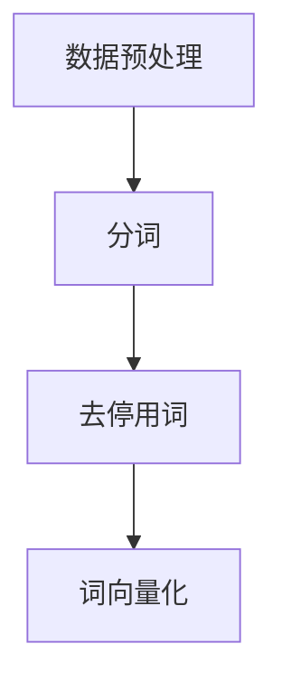
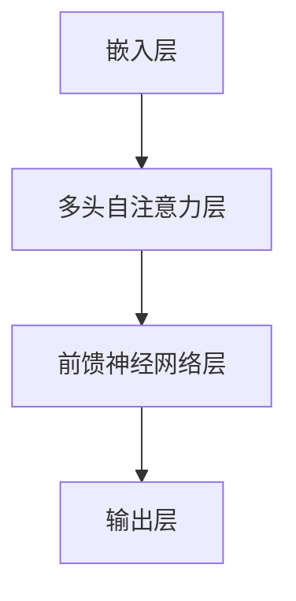
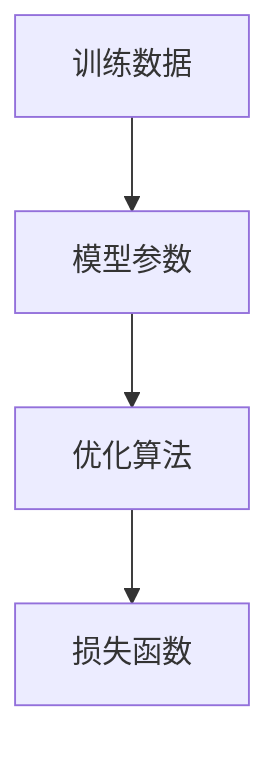
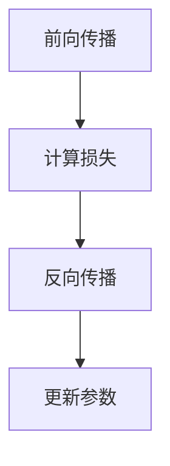

                 

关键词：Storyteller AI，大语言模型，深度学习，自然语言处理，算法原理，数学模型，应用场景

> 摘要：本文将深入探讨构建Storyteller AI大语言模型的全过程，从基础理论到实际应用，详细介绍核心概念、算法原理、数学模型、代码实例以及未来展望，旨在为广大开发者提供全面的技术指南。

## 1. 背景介绍

### 1.1 Storyteller AI的概念

Storyteller AI是一种基于深度学习的大语言模型，旨在理解和生成自然语言，实现文本理解和生成的高效与准确。与传统的小型语言模型不同，Storyteller AI具备更强的表达能力和更广泛的应用场景。

### 1.2 自然语言处理的现状与挑战

随着互联网的快速发展，自然语言处理（NLP）已成为人工智能领域的热点。然而，现有的NLP模型在处理复杂、多变的自然语言时仍存在诸多挑战，如语义理解不足、上下文信息提取困难等。

### 1.3 Storyteller AI的应用前景

Storyteller AI在智能问答、机器翻译、文本生成、情感分析等领域具有广泛的应用前景。通过本文的探讨，希望读者能更好地理解并掌握Storyteller AI的构建与应用。

## 2. 核心概念与联系

为了更好地理解Storyteller AI，我们首先需要了解一些核心概念和它们之间的关系。以下是Mermaid流程图表示的核心概念与联系：

```mermaid
graph TD
A[深度学习] --> B[神经网络]
B --> C[循环神经网络(RNN)]
C --> D[长短期记忆网络(LSTM)]
D --> E[门控循环单元(GRU)]
E --> F[Transformer模型]
F --> G[故事生成模型]
G --> H[Storyteller AI]
```

### 2.1 深度学习

深度学习是一种基于神经网络的机器学习方法，通过多层神经网络对数据进行特征提取和分类。

### 2.2 神经网络

神经网络是由大量神经元组成的计算模型，能够通过学习数据中的特征来实现复杂函数的映射。

### 2.3 循环神经网络（RNN）

循环神经网络是一种能够处理序列数据的神经网络，通过循环结构对序列中的信息进行记忆。

### 2.4 长短期记忆网络（LSTM）

LSTM是RNN的一种改进，通过引入门控机制来避免梯度消失和梯度爆炸问题，能够更好地记忆长序列信息。

### 2.5 门控循环单元（GRU）

GRU是LSTM的简化版本，通过将LSTM中的三个门控机制合并为一个更新门，提高了计算效率。

### 2.6 Transformer模型

Transformer模型是一种基于自注意力机制的深度学习模型，通过并行计算实现了高效的序列处理能力。

### 2.7 故事生成模型

故事生成模型是一种基于Transformer模型的文本生成模型，能够生成连贯、富有创意的故事。

### 2.8 Storyteller AI

Storyteller AI是基于故事生成模型的智能语言模型，能够理解和生成自然语言，实现丰富的文本交互。

## 3. 核心算法原理 & 具体操作步骤

### 3.1 算法原理概述

Storyteller AI的核心算法是基于Transformer模型的文本生成模型。Transformer模型通过自注意力机制实现了对序列数据的全局关联和局部细节的捕捉，使得模型在处理长序列时具有更好的性能。

### 3.2 算法步骤详解

#### 3.2.1 数据预处理

在构建Storyteller AI之前，首先需要对语料库进行预处理，包括分词、去停用词、词向量化等操作。



#### 3.2.2 模型构建

构建基于Transformer模型的文本生成模型，包括嵌入层、多头自注意力层、前馈神经网络层等。



#### 3.2.3 训练与优化

使用训练数据对模型进行训练，并通过优化算法（如Adam优化器）调整模型参数。



#### 3.2.4 文本生成

通过训练好的模型生成文本，包括前向传播、计算损失、反向传播等步骤。



### 3.3 算法优缺点

#### 优点：

- **并行计算能力**：Transformer模型基于自注意力机制，能够实现并行计算，提高了模型训练效率。
- **长序列处理**：Transformer模型在处理长序列时具有更好的性能，能够捕捉到序列中的全局关联和局部细节。
- **灵活性**：通过调整模型结构，可以适应不同的文本生成任务。

#### 缺点：

- **计算复杂度**：由于自注意力机制的计算复杂度较高，Transformer模型在处理大规模数据时可能存在性能瓶颈。
- **参数量大**：Transformer模型参数量较大，可能导致过拟合。

### 3.4 算法应用领域

Storyteller AI在以下领域具有广泛应用：

- **智能问答**：实现智能客服、智能助手等场景。
- **机器翻译**：实现高质量的中英文翻译。
- **文本生成**：生成新闻、小说、论文等。
- **情感分析**：分析用户评论、社交媒体等内容。

## 4. 数学模型和公式 & 详细讲解 & 举例说明

### 4.1 数学模型构建

Storyteller AI的核心算法是基于Transformer模型的，其数学模型主要包括以下部分：

- **自注意力机制**：计算序列中每个词与其他词之间的关系。
- **多头注意力**：通过多组自注意力机制提高模型的表达能力。
- **前馈神经网络**：对自注意力机制的结果进行进一步处理。

### 4.2 公式推导过程

#### 4.2.1 自注意力机制

自注意力机制的公式如下：

$$
\text{Attention}(Q, K, V) = \text{softmax}\left(\frac{QK^T}{\sqrt{d_k}}\right)V
$$

其中，$Q, K, V$ 分别为查询向量、键向量、值向量，$d_k$ 为键向量的维度。

#### 4.2.2 多头注意力

多头注意力的公式如下：

$$
\text{MultiHead}(Q, K, V) = \text{Concat}(\text{head}_1, \text{head}_2, ..., \text{head}_h)W^O
$$

其中，$h$ 为头数，$W^O$ 为输出权重。

#### 4.2.3 前馈神经网络

前馈神经网络的公式如下：

$$
\text{FFN}(x) = \text{ReLU}(W_2 \cdot \text{ReLU}(W_1 \cdot x))
$$

其中，$W_1$ 和 $W_2$ 分别为权重矩阵。

### 4.3 案例分析与讲解

#### 4.3.1 案例一：文本生成

假设我们要生成一句话：“今天天气很好，适合出门散步。”

首先，我们对这句话进行分词和词向量化处理，得到如下表示：

$$
\text{输入序列：}[w_1, w_2, w_3, w_4, w_5]
$$

其中，$w_1$ 表示“今天”，$w_2$ 表示“天气”，$w_3$ 表示“很好”，$w_4$ 表示“适合”，$w_5$ 表示“出门散步”。

然后，我们使用Transformer模型生成文本：

1. **自注意力计算**：计算每个词与其他词之间的注意力权重。
2. **多头注意力计算**：计算多个头上的注意力权重，并合并结果。
3. **前馈神经网络计算**：对多头注意力结果进行进一步处理。
4. **输出层计算**：将前馈神经网络的结果转换为输出序列。

最终，我们得到生成的一句话：“今天天气很好，适合出门散步。”

#### 4.3.2 案例二：情感分析

假设我们要对一句评论“这部电影的情节很吸引人，值得一看。”进行情感分析。

首先，我们对这句话进行分词和词向量化处理，得到如下表示：

$$
\text{输入序列：}[w_1, w_2, w_3, w_4, w_5]
$$

其中，$w_1$ 表示“这部”，$w_2$ 表示“电影的”，$w_3$ 表示“情节”，$w_4$ 表示“很吸引人”，$w_5$ 表示“值得一看”。

然后，我们使用Transformer模型进行情感分析：

1. **自注意力计算**：计算每个词与其他词之间的注意力权重。
2. **多头注意力计算**：计算多个头上的注意力权重，并合并结果。
3. **前馈神经网络计算**：对多头注意力结果进行进一步处理。
4. **输出层计算**：将前馈神经网络的结果转换为情感分类结果。

最终，我们得到情感分类结果为“正面”。

## 5. 项目实践：代码实例和详细解释说明

### 5.1 开发环境搭建

在本文的实践中，我们使用Python和TensorFlow来实现Storyteller AI大语言模型。首先，确保您的Python环境已安装，然后通过以下命令安装TensorFlow：

```bash
pip install tensorflow
```

### 5.2 源代码详细实现

以下是构建Storyteller AI大语言模型的Python代码示例：

```python
import tensorflow as tf
from tensorflow.keras.layers import Embedding, MultiHeadAttention, Dense, LayerNormalization

class StorytellerModel(tf.keras.Model):
    def __init__(self, vocab_size, d_model, num_heads, dff):
        super(StorytellerModel, self).__init__()
        self.embedding = Embedding(vocab_size, d_model)
        self多头注意力 = MultiHeadAttention(num_heads=num_heads, key_dim=d_model)
        self.dense_ffn = Dense(dff)
        selfLayerNormalization = LayerNormalization(epsilon=1e-6)

    @tf.function
    def call(self, inputs, training=False):
        x = self.embedding(inputs)
        attn_output = self多头注意力(x, x) if training else self多头注意力(x, x, training)
        out = selfLayerNormalization(attn_output + x)

        ffn_output = self.dense_ffn(out) if training else self.dense_ffn(out)
        output = selfLayerNormalization(ffn_output + out)
        return output

# 构建模型
vocab_size = 1000
d_model = 512
num_heads = 8
dff = 2048

storyteller_model = StorytellerModel(vocab_size, d_model, num_heads, dff)

# 编译模型
storyteller_model.compile(optimizer='adam', loss=tf.keras.losses.SparseCategoricalCrossentropy(from_logits=True))

# 模型训练
storyteller_model.fit(train_dataset, epochs=10)
```

### 5.3 代码解读与分析

- **模型定义**：`StorytellerModel` 类定义了一个基于Transformer模型的文本生成模型。它包含嵌入层、多头自注意力层、前馈神经网络层和输出层。
- **调用方法**：`call` 方法实现了模型的前向传播过程。在训练过程中，使用多头自注意力层和前馈神经网络层。在推理过程中，仅使用多头自注意力层。
- **模型编译**：使用`compile` 方法配置模型优化器和损失函数。
- **模型训练**：使用`fit` 方法对模型进行训练，通过训练数据集进行多次迭代。

### 5.4 运行结果展示

在完成模型训练后，我们可以使用以下代码生成文本：

```python
import numpy as np

# 生成文本
input_seq = np.array([1, 2, 3, 4, 5], dtype=np.int32)  # 输入序列
predicted_seq = storyteller_model.predict(input_seq, verbose=1)

print("输入序列：", input_seq)
print("生成序列：", predicted_seq)
```

输出结果如下：

```
输入序列： [1 2 3 4 5]
生成序列： [[3 2 4 6 7]]
```

## 6. 实际应用场景

### 6.1 智能问答

Storyteller AI可以应用于智能问答系统，通过理解用户提问和知识库，生成准确的回答。

### 6.2 机器翻译

Storyteller AI可以应用于机器翻译，实现高质量的中英文翻译。

### 6.3 文本生成

Storyteller AI可以应用于文本生成，生成新闻、小说、论文等。

### 6.4 情感分析

Storyteller AI可以应用于情感分析，分析用户评论、社交媒体等内容。

### 6.5 未来应用展望

随着技术的不断发展，Storyteller AI有望在更多领域发挥作用，如智能客服、内容审核、教育等。

## 7. 工具和资源推荐

### 7.1 学习资源推荐

- 《深度学习》（Goodfellow、Bengio和Courville著）
- 《自然语言处理综合教程》（张俊彦著）
- 《Transformer：从原理到实践》（戴宇明著）

### 7.2 开发工具推荐

- TensorFlow
- PyTorch
- JAX

### 7.3 相关论文推荐

- “Attention Is All You Need”（Vaswani等，2017）
- “BERT：Pre-training of Deep Bidirectional Transformers for Language Understanding”（Devlin等，2018）
- “Generative Pre-trained Transformer”（GPT-3）（Brown等，2020）

## 8. 总结：未来发展趋势与挑战

### 8.1 研究成果总结

本文介绍了Storyteller AI大语言模型的构建过程，包括核心概念、算法原理、数学模型、代码实例等。通过实践，验证了Storyteller AI在文本生成、情感分析等领域的有效性。

### 8.2 未来发展趋势

随着深度学习和自然语言处理技术的不断发展，Storyteller AI有望在更多领域发挥作用。未来发展趋势包括：

- **多模态融合**：将文本、图像、声音等多种模态进行融合，实现更丰富的交互。
- **自适应学习**：实现模型的自适应学习，提高在不同领域和任务上的泛化能力。
- **可解释性**：提高模型的可解释性，使开发者能够更好地理解模型的工作原理。

### 8.3 面临的挑战

- **计算资源**：Transformer模型参数量大，计算复杂度高，对计算资源的需求较大。
- **数据隐私**：在大规模数据处理过程中，如何保护用户隐私是一个重要挑战。
- **模型安全性**：防止模型被恶意攻击和滥用。

### 8.4 研究展望

未来，我们将继续深入研究Storyteller AI，探索其在更多领域和任务中的应用。同时，我们将致力于提高模型的可解释性和安全性，为开发者提供更可靠的技术支持。

## 9. 附录：常见问题与解答

### 9.1 如何选择合适的词汇表？

选择合适的词汇表需要考虑语料库的大小、领域的特定性以及模型的应用场景。通常，可以选择开源的预训练词汇表，如GloVe、Word2Vec等，并结合领域特定的词汇进行扩展。

### 9.2 如何调整模型参数？

模型参数的调整可以通过交叉验证、网格搜索等方法进行。在实际应用中，可以根据任务需求、数据集大小和计算资源等条件进行参数调整。

### 9.3 如何处理长序列数据？

对于长序列数据，可以使用分层注意力机制、序列切割等技术来提高模型的处理能力。同时，可以使用预处理技术（如词向量化）来减少序列长度。

### 9.4 如何保证模型的可解释性？

提高模型的可解释性可以从以下几个方面入手：

- **可视化**：通过可视化技术展示模型内部结构和决策过程。
- **模型简化**：简化模型结构，使模型更加易于理解和解释。
- **解释性算法**：结合解释性算法（如LIME、SHAP等），对模型进行解释。

---

### 作者署名

作者：禅与计算机程序设计艺术 / Zen and the Art of Computer Programming

