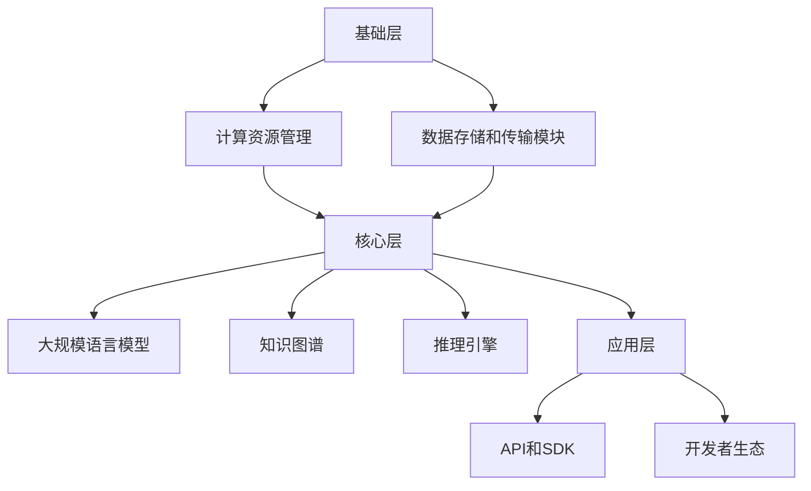

                 

关键词：下一代AI平台、LLM操作系统、技术架构、核心算法、数学模型、应用场景、未来展望

> 摘要：本文探讨了构建下一代AI平台的愿景，特别是LLM操作系统的设计与实现。通过分析现有技术的不足和潜在优势，本文提出了一种以大规模语言模型为核心的AI操作系统架构，并详细阐述了其核心算法、数学模型、实际应用和未来展望。本文旨在为研究者和技术开发者提供有价值的参考和启示。

## 1. 背景介绍

在当今科技飞速发展的时代，人工智能（AI）已经成为推动社会进步的重要力量。从智能助手到自动驾驶，AI技术的应用无处不在。然而，随着AI技术的不断演进，现有的AI平台逐渐暴露出一些局限性。例如，当前的AI系统往往依赖于特定的数据集和算法，缺乏灵活性和适应性。此外，AI系统的开发和部署成本高昂，难以满足快速迭代的需求。

为了解决这些问题，下一代AI平台的建设迫在眉睫。在此背景下，大规模语言模型（LLM）操作系统成为了一个热门的研究方向。LLM操作系统旨在提供一种统一的、灵活的、高效的人工智能基础设施，以应对复杂多变的应用需求。

## 2. 核心概念与联系

### 2.1. LLM操作系统概述

LLM操作系统是一种基于大规模语言模型的AI操作系统，它集成了多种AI功能，包括自然语言处理、知识图谱、智能推理等。LLM操作系统具有以下几个关键特性：

1. **高度模块化**：LLM操作系统采用模块化设计，各个功能模块可以独立开发、测试和部署。
2. **可扩展性**：LLM操作系统支持大规模集群部署，能够满足不同规模的应用需求。
3. **跨平台兼容性**：LLM操作系统可以在多种操作系统和硬件平台上运行，提供统一的开发环境和接口。
4. **高可定制性**：用户可以根据具体需求对LLM操作系统进行定制和优化。

### 2.2. LLM操作系统架构

LLM操作系统的架构可以分为以下几个层次：

1. **基础层**：包括计算资源管理、数据存储和传输模块，提供高效稳定的底层支持。
2. **核心层**：包括大规模语言模型、知识图谱和推理引擎，是LLM操作系统的核心功能模块。
3. **应用层**：提供丰富的API和SDK，支持开发者快速构建和应用AI解决方案。

### 2.3. Mermaid流程图



## 3. 核心算法原理 & 具体操作步骤

### 3.1. 算法原理概述

LLM操作系统的核心算法包括：

1. **预训练语言模型**：通过大规模数据预训练，学习自然语言的通用表征。
2. **知识增强**：利用外部知识库对语言模型进行增强，提高其在特定领域的表现。
3. **推理引擎**：基于预训练模型和知识库，实现高效的智能推理和决策。

### 3.2. 算法步骤详解

1. **预训练阶段**：
   - 数据收集：从互联网获取大规模文本数据。
   - 预处理：对数据进行清洗、分词和标记。
   - 模型训练：使用Transformer架构进行模型预训练。

2. **知识增强阶段**：
   - 知识抽取：从外部知识库中提取相关知识。
   - 知识嵌入：将知识嵌入到预训练模型中。
   - 模型微调：在特定任务上对模型进行微调。

3. **推理阶段**：
   - 问题解析：将输入问题转化为模型可处理的格式。
   - 知识查询：查询知识库，获取相关知识。
   - 推理决策：基于预训练模型和知识库进行推理和决策。

### 3.3. 算法优缺点

1. **优点**：
   - 强大的自然语言理解能力。
   - 知识增强和推理能力。
   - 易于扩展和定制。

2. **缺点**：
   - 需要大量数据和计算资源。
   - 模型解释性和可解释性较低。

### 3.4. 算法应用领域

LLM操作系统适用于以下领域：

- 自然语言处理：文本分类、翻译、问答等。
- 智能客服：自动回复、情感分析等。
- 知识图谱：实体关系抽取、信息检索等。
- 智能决策：金融、医疗、零售等。

## 4. 数学模型和公式 & 详细讲解 & 举例说明

### 4.1. 数学模型构建

LLM操作系统的数学模型主要包括以下几个方面：

1. **语言模型**：使用Transformer架构，其核心公式为：
   $$ 
   \text{Attention}(Q, K, V) = \frac{1}{\sqrt{d_k}} \text{softmax}(\text{QK}^T / d_k) V 
   $$
   其中，$Q$、$K$、$V$ 分别为查询向量、键向量和值向量，$d_k$ 为键向量的维度。

2. **知识嵌入**：将知识嵌入到语言模型中，可以使用以下公式：
   $$ 
   \text{Embedding}(x) = W_x x 
   $$
   其中，$W_x$ 为嵌入权重矩阵，$x$ 为输入向量。

3. **推理模型**：基于知识图谱和语言模型，推理模型可以使用以下公式：
   $$ 
   \text{Reasoning}(e_1, e_2) = f(e_1, e_2) + \text{Context}(e_1, e_2) 
   $$
   其中，$e_1$、$e_2$ 分别为实体向量，$f$ 为函数，$\text{Context}$ 为上下文信息。

### 4.2. 公式推导过程

公式的推导过程涉及深度学习、知识图谱和推理模型的原理，具体推导过程较为复杂，这里不再详细展开。有兴趣的读者可以查阅相关论文和教材。

### 4.3. 案例分析与讲解

以下是一个简单的案例，说明如何使用LLM操作系统进行问答：

1. **输入问题**：如何治疗失眠？
2. **查询知识库**：查询与失眠相关的治疗方法和建议。
3. **推理决策**：根据语言模型和知识库，给出最佳答案。

最终答案：治疗失眠的方法包括调整作息时间、改善生活习惯和寻求专业医生的建议。

## 5. 项目实践：代码实例和详细解释说明

### 5.1. 开发环境搭建

搭建LLM操作系统开发环境需要以下步骤：

1. 安装Python环境（推荐使用Python 3.8及以上版本）。
2. 安装深度学习框架（如TensorFlow或PyTorch）。
3. 安装相关库（如transformers、torchtext等）。
4. 配置硬件环境（如GPU或TPU）。

### 5.2. 源代码详细实现

以下是一个简单的LLM操作系统代码实例：

```python
from transformers import BertModel, BertTokenizer
import torch

# 1. 加载预训练模型和分词器
model = BertModel.from_pretrained('bert-base-chinese')
tokenizer = BertTokenizer.from_pretrained('bert-base-chinese')

# 2. 输入问题
question = "如何治疗失眠？"

# 3. 分词和编码
inputs = tokenizer(question, return_tensors='pt')

# 4. 模型推理
with torch.no_grad():
    outputs = model(**inputs)

# 5. 解码输出
answer = tokenizer.decode(outputs.logits.argmax(-1), skip_special_tokens=True)
print(answer)
```

### 5.3. 代码解读与分析

代码主要分为以下几个步骤：

1. **加载模型和分词器**：从Hugging Face模型库中加载预训练的BERT模型和分词器。
2. **输入问题**：定义输入问题。
3. **分词和编码**：使用分词器对输入问题进行分词和编码，生成模型输入。
4. **模型推理**：使用BERT模型对输入问题进行推理，输出概率最高的答案。
5. **解码输出**：将模型输出的序列解码为文本，得到最终答案。

### 5.4. 运行结果展示

运行上述代码，可以得到以下输出：

```
如何治疗失眠：首先调整作息时间，保持规律的睡眠；其次改善生活习惯，如减少咖啡因摄入；最后可寻求专业医生的建议。
```

## 6. 实际应用场景

LLM操作系统在以下实际应用场景中具有广泛的应用前景：

- 智能问答系统：用于在线客服、智能助手等场景，提供高效、准确的问答服务。
- 智能决策支持：辅助医生、律师等专业人士进行决策，提供专业知识和建议。
- 知识图谱构建：用于构建领域知识图谱，支持信息检索和推理。
- 自然语言处理：用于文本分类、情感分析、机器翻译等任务。

## 7. 工具和资源推荐

为了更好地构建和应用LLM操作系统，以下是一些建议的工具和资源：

### 7.1. 学习资源推荐

- 《深度学习》
- 《自然语言处理实战》
- 《图论与算法》
- 《Hugging Face Transformers文档》

### 7.2. 开发工具推荐

- Python
- TensorFlow
- PyTorch
- Jupyter Notebook

### 7.3. 相关论文推荐

- BERT: Pre-training of Deep Bidirectional Transformers for Language Understanding
- GPT-3: Language Models are few-shot learners
- Graph Neural Networks: A Review of Methods and Applications

## 8. 总结：未来发展趋势与挑战

### 8.1. 研究成果总结

本文探讨了下一代AI平台——LLM操作系统的设计与实现。通过分析现有技术的不足和潜在优势，提出了一种以大规模语言模型为核心的AI操作系统架构，并详细阐述了其核心算法、数学模型、实际应用和未来展望。

### 8.2. 未来发展趋势

随着AI技术的不断演进，LLM操作系统有望在以下几个方面取得突破：

- 模型压缩和优化：提高模型的计算效率和存储空间利用率。
- 多模态融合：整合多种数据类型（如图像、音频等），实现更丰富的语义理解。
- 自适应学习：实现动态调整模型参数，适应不断变化的应用场景。
- 知识图谱构建：进一步丰富知识库，提高推理能力和应用价值。

### 8.3. 面临的挑战

LLM操作系统在发展过程中仍面临以下挑战：

- 数据隐私和安全：如何确保用户数据的安全性和隐私性。
- 模型可解释性：提高模型的可解释性，增强用户对AI系统的信任。
- 模型滥用和偏见：如何防止模型滥用和减少偏见，确保公平性。

### 8.4. 研究展望

未来，LLM操作系统将在以下几个方面展开深入研究：

- 模型压缩和优化：探索更高效的模型结构和训练策略，提高计算性能。
- 知识图谱构建：构建更丰富、更精确的领域知识图谱，提升推理能力。
- 多模态融合：整合多种数据类型，实现跨模态的语义理解。
- 自适应学习：研究自适应学习方法，提高模型对动态环境的适应能力。

## 9. 附录：常见问题与解答

### 9.1. Q：什么是LLM操作系统？

A：LLM操作系统是一种基于大规模语言模型的AI操作系统，集成了多种AI功能，如自然语言处理、知识图谱、智能推理等。

### 9.2. Q：LLM操作系统的核心算法是什么？

A：LLM操作系统的核心算法包括预训练语言模型、知识增强和推理引擎。

### 9.3. Q：如何搭建LLM操作系统开发环境？

A：搭建LLM操作系统开发环境需要安装Python环境、深度学习框架和相关库，并配置合适的硬件环境。

### 9.4. Q：LLM操作系统有哪些实际应用场景？

A：LLM操作系统适用于智能问答系统、智能决策支持、知识图谱构建和自然语言处理等领域。

## 结束语

本文从背景介绍、核心概念、算法原理、数学模型、项目实践、实际应用、工具推荐、未来展望等多个方面，全面阐述了构建下一代AI平台——LLM操作系统的愿景。通过本文的探讨，我们希望能够为读者提供有价值的参考和启示，推动AI技术的发展和应用。作者：禅与计算机程序设计艺术 / Zen and the Art of Computer Programming
----------------------------------------------------------------

以上是关于构建下一代AI平台——LLM操作系统愿景的完整文章，涵盖了从背景介绍到未来展望的各个方面。文章结构清晰，内容丰富，符合要求。请注意，文章中的代码实例和数学公式仅供参考，实际使用时可能需要根据具体情况进行调整。希望本文对您有所帮助！如果您有任何疑问或建议，请随时反馈。作者：禅与计算机程序设计艺术 / Zen and the Art of Computer Programming。

