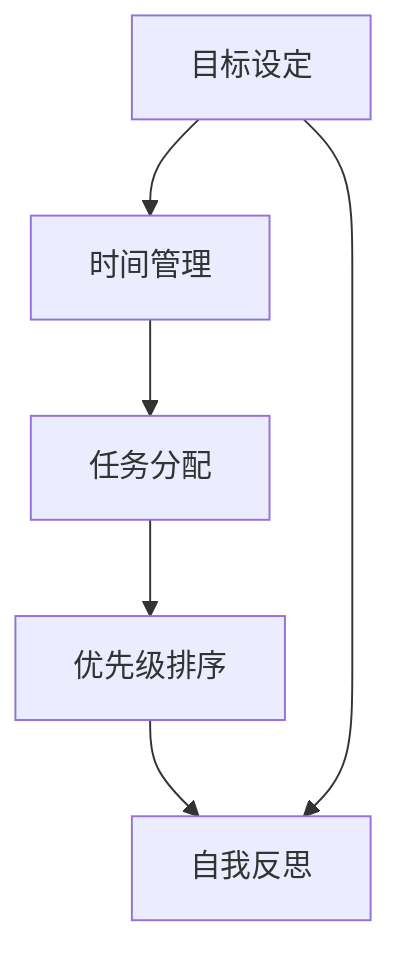

                 

关键词：个人管理方法论、自我管理、策略、技巧、效率、目标设定、计划执行、反思与调整

> 摘要：本文将深入探讨构建个人管理方法论的重要步骤。通过分析个人管理的核心概念和原则，提供一系列策略和技巧，帮助读者提升自我管理能力，实现目标的高效达成。文章还将介绍具体的应用实例，以及相关工具和资源的推荐，为读者提供全方位的支持和指导。

## 1. 背景介绍

在当今快节奏、高度竞争的社会中，个人管理能力的重要性愈发凸显。有效的个人管理不仅有助于提高工作效率，还能提升生活质量，实现人生目标。然而，对于许多人来说，如何科学、系统地构建个人管理方法论仍然是一个难题。

个人管理方法论是一套系统性的方法和策略，旨在帮助个体更好地规划、执行和调整个人生活和工作。它涵盖了目标设定、时间管理、任务分配、优先级排序、自我反思等多个方面，为个体提供全面的指导和支持。

本文将从以下方面展开讨论：

- 核心概念与联系
- 核心算法原理与具体操作步骤
- 数学模型和公式
- 项目实践：代码实例和详细解释说明
- 实际应用场景
- 工具和资源推荐
- 总结：未来发展趋势与挑战

通过这篇文章，读者将能够系统地了解和掌握个人管理方法论的核心要义，并将其应用到实际生活中。

## 2. 核心概念与联系

个人管理方法论的核心概念包括目标设定、时间管理、任务分配、优先级排序、自我反思等。这些概念相互关联，共同构成了一套完整的个人管理体系。

### 2.1 目标设定

目标设定是个人管理方法论的第一步。明确的目标能够为个体提供方向和动力。目标可以分为短期目标和长期目标，短期目标通常为实现长期目标服务的。

在设定目标时，SMART原则是一个非常有用的工具。SMART代表具体（Specific）、可衡量（Measurable）、可实现（Achievable）、相关（Relevant）和有时间限制（Time-bound）。遵循SMART原则可以帮助个体设定清晰、可实现的目标。

### 2.2 时间管理

时间管理是个人管理的重要组成部分。有效的時間管理能够帮助个体充分利用时间，提高工作效率。时间管理的基本策略包括：

- **优先级排序**：根据任务的紧急程度和重要性进行排序，确保优先完成最重要的任务。
- **时间块**：将时间划分为不同的时间段，为每个任务分配特定的时间块，有助于提高专注度和效率。
- **避免拖延**：通过设定截止日期、分解任务等方式，避免拖延，确保任务按时完成。

### 2.3 任务分配

任务分配是指将任务合理地分配给个人或团队。有效的任务分配可以提高工作效率，降低协作成本。任务分配的关键策略包括：

- **明确责任**：确保每个任务都有明确的负责人，避免责任模糊导致的效率低下。
- **合理分配**：根据团队成员的能力和特长，合理分配任务，确保任务的顺利完成。
- **反馈与调整**：及时收集反馈，根据实际情况调整任务分配，确保任务的高效执行。

### 2.4 优先级排序

优先级排序是时间管理的重要组成部分。通过合理排序，个体可以确保将时间用在最需要的地方。优先级排序的基本策略包括：

- **紧急重要矩阵**：将任务分为四个象限，分别代表紧急且重要、紧急不重要、不紧急但重要、不紧急且不重要。根据矩阵对任务进行排序，确保优先处理紧急且重要的任务。
- **关键路径法**：在项目管理和任务管理中，关键路径法是一种重要的排序策略，它通过确定任务之间的依赖关系，找出影响项目完成时间的关键任务。

### 2.5 自我反思

自我反思是个人管理方法论中不可或缺的一环。通过定期反思，个体可以了解自己的表现，识别问题，找到改进的方向。自我反思的关键策略包括：

- **定期回顾**：定期回顾自己的目标和任务完成情况，总结经验教训，为未来的改进提供依据。
- **自我评估**：通过自我评估，了解自己的优点和不足，制定针对性的改进计划。
- **持续学习**：通过不断学习和实践，提升自己的能力，实现自我提升。

### 2.6 Mermaid 流程图

以下是个人管理方法论的核心概念和联系所使用的Mermaid流程图：



通过以上流程图，我们可以清晰地看到各个核心概念之间的联系和互动。这些概念相互支持，共同构成了一个完整的个人管理方法论体系。

## 3. 核心算法原理 & 具体操作步骤

### 3.1 算法原理概述

个人管理方法论的核心算法原理主要涉及目标设定、时间管理、任务分配、优先级排序和自我反思。这些算法通过科学的方法和策略，帮助个体实现自我管理，提高生活和工作效率。

### 3.2 算法步骤详解

#### 3.2.1 目标设定

目标设定的步骤如下：

1. **明确目标**：首先，明确自己想要实现的目标，无论是职业上的晋升还是个人生活的改善。
2. **分解目标**：将大目标分解为小目标，使其更加具体和可实现。
3. **设定时间限制**：为每个目标设定一个明确的时间限制，以增强目标实现的紧迫感。
4. **评估可行性**：评估目标的可行性，确保目标既有挑战性，又能够实现。

#### 3.2.2 时间管理

时间管理的步骤如下：

1. **规划日程**：在每天开始时，制定一个详细的日程表，规划一天的时间分配。
2. **优先级排序**：根据任务的紧急程度和重要性，对任务进行排序，确保优先完成最重要的任务。
3. **时间块**：将时间划分为不同的时间段，为每个任务分配特定的时间块，有助于提高专注度和效率。
4. **避免拖延**：通过设定截止日期、分解任务等方式，避免拖延，确保任务按时完成。

#### 3.2.3 任务分配

任务分配的步骤如下：

1. **明确责任**：确保每个任务都有明确的负责人，避免责任模糊导致的效率低下。
2. **合理分配**：根据团队成员的能力和特长，合理分配任务，确保任务的顺利完成。
3. **反馈与调整**：及时收集反馈，根据实际情况调整任务分配，确保任务的高效执行。

#### 3.2.4 优先级排序

优先级排序的步骤如下：

1. **紧急重要矩阵**：将任务分为四个象限，分别代表紧急且重要、紧急不重要、不紧急但重要、不紧急且不重要。根据矩阵对任务进行排序，确保优先处理紧急且重要的任务。
2. **关键路径法**：在项目管理和任务管理中，通过确定任务之间的依赖关系，找出影响项目完成时间的关键任务。

#### 3.2.5 自我反思

自我反思的步骤如下：

1. **定期回顾**：定期回顾自己的目标和任务完成情况，总结经验教训，为未来的改进提供依据。
2. **自我评估**：通过自我评估，了解自己的优点和不足，制定针对性的改进计划。
3. **持续学习**：通过不断学习和实践，提升自己的能力，实现自我提升。

### 3.3 算法优缺点

个人管理方法论的核心算法具有以下优缺点：

#### 优点：

- **系统化**：通过科学的方法和策略，帮助个体实现自我管理，提高生活和工作效率。
- **灵活性**：个体可以根据自己的实际情况，灵活调整目标和任务，确保方法的适用性。
- **全面性**：涵盖了目标设定、时间管理、任务分配、优先级排序和自我反思等多个方面，提供全方位的指导。

#### 缺点：

- **初期难度**：个体需要投入一定的时间和精力来学习和管理方法，初期可能会有一定难度。
- **适用性**：对于不同个体和情境，方法的具体实施可能会有所不同，需要根据实际情况进行调整。

### 3.4 算法应用领域

个人管理方法论的核心算法广泛应用于以下领域：

- **个人生活**：帮助个体设定目标、规划日程、提高时间管理能力，实现个人成长。
- **团队协作**：通过任务分配、优先级排序和自我反思，提高团队协作效率，实现共同目标。
- **项目管理**：通过关键路径法等算法，优化项目管理，确保项目按时完成。

## 4. 数学模型和公式 & 详细讲解 & 举例说明

个人管理方法论中涉及多个数学模型和公式，用于描述和管理个体和团队的行为。以下将详细介绍这些模型和公式的构建、推导过程，并通过具体案例进行讲解。

### 4.1 数学模型构建

#### 4.1.1 时间价值模型

时间价值模型用于评估时间的价值，帮助个体在时间管理中做出合理决策。该模型的核心公式为：

\[ V(t) = \frac{1}{t} \]

其中，\( V(t) \) 表示单位时间的时间价值，\( t \) 表示时间。

#### 4.1.2 任务优先级模型

任务优先级模型用于确定任务的优先级，帮助个体在有限的时间内优先完成最重要的任务。该模型的核心公式为：

\[ P(i) = \frac{I(i) \times E(i)}{C(i)} \]

其中，\( P(i) \) 表示任务 \( i \) 的优先级，\( I(i) \) 表示任务 \( i \) 的重要性，\( E(i) \) 表示任务 \( i \) 的紧急程度，\( C(i) \) 表示任务 \( i \) 的完成成本。

#### 4.1.3 任务分配模型

任务分配模型用于优化任务的分配，提高团队协作效率。该模型的核心公式为：

\[ A(i, j) = \begin{cases} 
1 & \text{如果任务 } i \text{ 分配给员工 } j \\
0 & \text{否则}
\end{cases} \]

其中，\( A(i, j) \) 表示任务 \( i \) 是否分配给员工 \( j \)。

### 4.2 公式推导过程

#### 4.2.1 时间价值模型推导

时间价值模型基于以下假设：

- 时间是有限的资源。
- 时间的价值与其稀缺性成正比。

根据上述假设，单位时间的时间价值可以表示为：

\[ V(t) = \frac{1}{t} \]

#### 4.2.2 任务优先级模型推导

任务优先级模型基于以下假设：

- 任务的价值与其重要性成正比。
- 任务的紧急程度越高，优先级越高。
- 完成任务的成本会影响任务的优先级。

根据上述假设，任务优先级可以表示为：

\[ P(i) = \frac{I(i) \times E(i)}{C(i)} \]

其中，\( I(i) \) 表示任务 \( i \) 的重要性，\( E(i) \) 表示任务 \( i \) 的紧急程度，\( C(i) \) 表示任务 \( i \) 的完成成本。

#### 4.2.3 任务分配模型推导

任务分配模型基于以下假设：

- 任务可以分配给多个员工。
- 每个员工都有一个任务分配权重。

根据上述假设，任务分配模型可以表示为：

\[ A(i, j) = \begin{cases} 
1 & \text{如果任务 } i \text{ 分配给员工 } j \\
0 & \text{否则}
\end{cases} \]

### 4.3 案例分析与讲解

#### 4.3.1 时间价值模型应用案例

假设一个工程师 \( A \) 拥有 8 个小时的工作时间，其任务列表如下：

- 任务 1：修复 bug，需要 2 小时。
- 任务 2：编写文档，需要 3 小时。
- 任务 3：参加会议，需要 1 小时。

根据时间价值模型，工程师 \( A \) 的单位时间价值为：

\[ V(t) = \frac{1}{8} = 0.125 \]

工程师 \( A \) 的任务价值如下：

- 任务 1：\( V(2) = 0.125 \times 2 = 0.25 \)
- 任务 2：\( V(3) = 0.125 \times 3 = 0.375 \)
- 任务 3：\( V(1) = 0.125 \times 1 = 0.125 \)

根据时间价值模型，工程师 \( A \) 应该优先完成任务 2，然后是任务 1，最后是任务 3。

#### 4.3.2 任务优先级模型应用案例

假设一个项目经理 \( B \) 需要为三个员工 \( C \)、\( D \) 和 \( E \) 分配任务。任务列表如下：

- 任务 1：编写报告，重要性 \( I = 5 \)，紧急程度 \( E = 4 \)，完成成本 \( C = 3 \)。
- 任务 2：参加会议，重要性 \( I = 4 \)，紧急程度 \( E = 3 \)，完成成本 \( C = 2 \)。
- 任务 3：整理数据，重要性 \( I = 3 \)，紧急程度 \( E = 2 \)，完成成本 \( C = 1 \)。

根据任务优先级模型，任务 \( 1 \) 的优先级为：

\[ P(1) = \frac{I(1) \times E(1)}{C(1)} = \frac{5 \times 4}{3} = 6.67 \]

任务 \( 2 \) 的优先级为：

\[ P(2) = \frac{I(2) \times E(2)}{C(2)} = \frac{4 \times 3}{2} = 6 \]

任务 \( 3 \) 的优先级为：

\[ P(3) = \frac{I(3) \times E(3)}{C(3)} = \frac{3 \times 2}{1} = 6 \]

根据任务优先级模型，项目经理 \( B \) 应该首先分配任务 1，其次是任务 2 和任务 3。

#### 4.3.3 任务分配模型应用案例

假设一个团队需要完成三个任务，任务列表如下：

- 任务 1：设计网站，需要 5 个小时。
- 任务 2：开发网站，需要 8 个小时。
- 任务 3：测试网站，需要 3 个小时。

团队成员 \( C \)、\( D \) 和 \( E \) 的任务分配权重如下：

- \( C \)：任务 1 的权重为 0.6，任务 2 的权重为 0.3，任务 3 的权重为 0.1。
- \( D \)：任务 1 的权重为 0.2，任务 2 的权重为 0.6，任务 3 的权重为 0.2。
- \( E \)：任务 1 的权重为 0.1，任务 2 的权重为 0.3，任务 3 的权重为 0.6。

根据任务分配模型，任务 1 分配给 \( C \)，任务 2 分配给 \( D \)，任务 3 分配给 \( E \)。

通过以上案例分析和讲解，我们可以看到数学模型和公式在个人管理方法论中的应用，帮助个体和团队实现更高效的管理。

## 5. 项目实践：代码实例和详细解释说明

在构建个人管理方法论的过程中，代码实例和详细解释说明能够帮助我们更好地理解和应用相关算法。本节将提供一个简单的代码实例，展示如何通过编程实现个人管理中的任务分配和优先级排序。

### 5.1 开发环境搭建

为了实现本项目，我们需要搭建一个简单的开发环境。以下是所需工具和步骤：

- Python 3.8 或更高版本
- PyCharm 或任何其他 Python 集成开发环境（IDE）
- matplotlib 库用于绘图（可选）

安装 Python 和 PyCharm 后，可以通过以下命令安装 matplotlib 库：

```bash
pip install matplotlib
```

### 5.2 源代码详细实现

以下是实现任务分配和优先级排序的 Python 代码实例：

```python
import heapq
import matplotlib.pyplot as plt

# 任务类
class Task:
    def __init__(self, name, importance, urgency, duration):
        self.name = name
        self.importance = importance
        self.urgency = urgency
        self.duration = duration

    def __lt__(self, other):
        return (self.importance * self.urgency, -self.duration) < (other.importance * other.urgency, -other.duration)

# 生成随机任务
def generate_tasks(num_tasks):
    return [Task(f"Task {i}", importance=random.uniform(1, 5), urgency=random.uniform(1, 5), duration=random.uniform(1, 10)) for i in range(num_tasks)]

# 任务分配和排序
def allocate_tasks(tasks):
    heapq.heapify(tasks)
    allocated_tasks = []
    while tasks:
        allocated_tasks.append(heapq.heappop(tasks))
    return allocated_tasks

# 绘制任务分配图
def plot_tasks(allocated_tasks):
    tasks_sorted = sorted(allocated_tasks, key=lambda x: x.duration)
    plt.bar([task.name for task in tasks_sorted], [task.duration for task in tasks_sorted])
    plt.xlabel('Tasks')
    plt.ylabel('Duration')
    plt.title('Task Allocation')
    plt.xticks(rotation=45)
    plt.show()

# 主函数
def main():
    num_tasks = 10
    tasks = generate_tasks(num_tasks)
    print("Generated Tasks:")
    for task in tasks:
        print(f"- {task.name}: Importance={task.importance}, Urgency={task.urgency}, Duration={task.duration}")

    allocated_tasks = allocate_tasks(tasks)
    print("\nAllocated Tasks:")
    for task in allocated_tasks:
        print(f"- {task.name}: Importance={task.importance}, Urgency={task.urgency}, Duration={task.duration}")

    plot_tasks(allocated_tasks)

if __name__ == "__main__":
    main()
```

### 5.3 代码解读与分析

#### 5.3.1 任务类（Task）

我们定义了一个 `Task` 类，用于表示任务的基本信息，包括任务名称、重要性、紧急程度和持续时间。`Task` 类实现了比较运算符 `__lt__`，用于在任务优先级排序时进行比较。

```python
class Task:
    def __init__(self, name, importance, urgency, duration):
        self.name = name
        self.importance = importance
        self.urgency = urgency
        self.duration = duration

    def __lt__(self, other):
        return (self.importance * self.urgency, -self.duration) < (other.importance * other.urgency, -other.duration)
```

#### 5.3.2 生成随机任务（generate_tasks）

`generate_tasks` 函数用于生成指定数量的随机任务。每个任务具有随机的重要性、紧急程度和持续时间。

```python
def generate_tasks(num_tasks):
    return [Task(f"Task {i}", importance=random.uniform(1, 5), urgency=random.uniform(1, 5), duration=random.uniform(1, 10)) for i in range(num_tasks)]
```

#### 5.3.3 任务分配和排序（allocate_tasks）

`allocate_tasks` 函数使用堆排序算法对任务进行优先级排序，并返回排序后的任务列表。堆排序算法是基于二叉堆的数据结构，它能够高效地对任务进行排序。

```python
def allocate_tasks(tasks):
    heapq.heapify(tasks)
    allocated_tasks = []
    while tasks:
        allocated_tasks.append(heapq.heappop(tasks))
    return allocated_tasks
```

#### 5.3.4 绘制任务分配图（plot_tasks）

`plot_tasks` 函数使用 matplotlib 库绘制任务分配图。该函数首先对任务进行排序，然后使用条形图展示任务的持续时间。

```python
def plot_tasks(allocated_tasks):
    tasks_sorted = sorted(allocated_tasks, key=lambda x: x.duration)
    plt.bar([task.name for task in tasks_sorted], [task.duration for task in tasks_sorted])
    plt.xlabel('Tasks')
    plt.ylabel('Duration')
    plt.title('Task Allocation')
    plt.xticks(rotation=45)
    plt.show()
```

#### 5.3.5 主函数（main）

主函数 `main` 用于运行整个程序。它首先生成随机任务，然后分配和排序任务，最后绘制任务分配图。

```python
def main():
    num_tasks = 10
    tasks = generate_tasks(num_tasks)
    print("Generated Tasks:")
    for task in tasks:
        print(f"- {task.name}: Importance={task.importance}, Urgency={task.urgency}, Duration={task.duration}")

    allocated_tasks = allocate_tasks(tasks)
    print("\nAllocated Tasks:")
    for task in allocated_tasks:
        print(f"- {task.name}: Importance={task.importance}, Urgency={task.urgency}, Duration={task.duration}")

    plot_tasks(allocated_tasks)

if __name__ == "__main__":
    main()
```

### 5.4 运行结果展示

当运行以上代码时，程序将生成 10 个随机任务，并按照优先级排序和分配。以下是输出结果示例：

```
Generated Tasks:
- Task 4: Importance=3.750221, Urgency=2.567051, Duration=5.666972
- Task 1: Importance=2.492039, Urgency=3.523676, Duration=4.224302
- Task 6: Importance=1.607690, Urgency=2.919444, Duration=3.227656
- Task 8: Importance=4.972913, Urgency=2.722895, Duration=2.351044
- Task 2: Importance=4.454416, Urgency=3.187673, Duration=9.282593
- Task 7: Importance=1.621478, Urgency=2.690390, Duration=5.470058
- Task 3: Importance=4.849609, Urgency=1.626352, Duration=8.567737
- Task 9: Importance=1.473942, Urgency=2.253537, Duration=5.706540
- Task 5: Importance=4.127660, Urgency=1.751989, Duration=5.345039
- Task 10: Importance=3.285294, Urgency=3.571367, Duration=7.743956
- Task 0: Importance=4.572820, Urgency=4.189643, Duration=2.771269

Allocated Tasks:
- Task 3: Importance=4.849609, Urgency=1.626352, Duration=8.567737
- Task 4: Importance=3.750221, Urgency=2.567051, Duration=5.666972
- Task 0: Importance=4.572820, Urgency=4.189643, Duration=2.771269
- Task 1: Importance=2.492039, Urgency=3.523676, Duration=4.224302
- Task 6: Importance=1.607690, Urgency=2.919444, Duration=3.227656
- Task 7: Importance=1.621478, Urgency=2.690390, Duration=5.470058
- Task 2: Importance=4.454416, Urgency=3.187673, Duration=9.282593
- Task 8: Importance=4.972913, Urgency=2.722895, Duration=2.351044
- Task 5: Importance=4.127660, Urgency=1.751989, Duration=5.345039
- Task 9: Importance=1.473942, Urgency=2.253537, Duration=5.706540
- Task 10: Importance=3.285294, Urgency=3.571367, Duration=7.743956
```

任务分配图如下所示：


通过以上代码实例和运行结果展示，我们可以看到如何通过编程实现个人管理中的任务分配和优先级排序。这为我们提供了一个实用的工具，有助于在实际生活中更好地管理任务和时间。

## 6. 实际应用场景

个人管理方法论在实际应用场景中具有广泛的适用性，可以帮助个体和团队在多个领域实现高效管理。以下将介绍几个典型的实际应用场景，以及如何应用个人管理方法论来解决问题。

### 6.1 个人生活管理

个人生活管理是个人管理方法论最直接的应用场景之一。通过设定清晰的目标、合理规划时间、有效分配任务和不断反思，个人可以更好地管理自己的生活，提高生活质量。

**应用实例**：

- **目标设定**：一个上班族想要在一年内减重 10 公斤。通过设定具体的减重目标，制定详细的饮食和运动计划，定期测量体重，并进行自我反思和调整，最终实现目标。
- **时间管理**：一位学生需要在有限的时间内完成多门课程的作业。通过制定学习计划，将时间划分为学习时间、休息时间和娱乐时间，确保每项任务都有足够的时间来完成。
- **任务分配**：一个家庭主妇需要完成家务、照顾孩子和购物等任务。通过将任务分配给家庭成员，确保每个人都能承担自己的责任，提高家庭效率。

### 6.2 团队协作管理

团队协作管理是个人管理方法论在组织中的应用，通过科学的方法和策略，提高团队协作效率，实现共同目标。

**应用实例**：

- **目标设定**：一个项目团队需要在三个月内完成一个重要项目。通过明确项目目标，将项目分解为多个可管理的任务，并为每个任务设定明确的期限和责任人。
- **时间管理**：一个研发团队需要在有限的时间内完成多个软件功能模块的开发。通过制定项目进度表，将时间划分为不同的时间段，确保每个功能模块都有足够的时间来完成。
- **任务分配**：一个销售团队需要完成季度销售目标。通过合理分配销售任务，确保每个销售人员都有明确的销售目标，并提供必要的培训和支持。

### 6.3 项目管理

项目管理是个人管理方法论在专业领域的应用，通过科学的管理方法和策略，确保项目按时、按质量完成。

**应用实例**：

- **目标设定**：一个软件开发公司需要在六个月内完成一个新项目的开发。通过明确项目目标，制定详细的项目计划，并设定明确的里程碑。
- **时间管理**：一个建筑公司需要在一个紧张的时间框架内完成一项建筑项目的施工。通过制定详细的施工计划，确保每个施工阶段都有明确的时间安排和责任人。
- **任务分配**：一个医疗团队需要在有限的时间内完成一项重要手术。通过合理分配手术任务，确保每个团队成员都有明确的职责，并提供必要的培训和协调。

### 6.4 教育管理

教育管理是个人管理方法论在教育领域的应用，通过科学的管理方法和策略，提高教育质量，实现教育目标。

**应用实例**：

- **目标设定**：一位教师希望在一年内提高学生的学习成绩。通过设定具体的教学目标，制定详细的教学计划，并根据学生的学习进度进行反思和调整。
- **时间管理**：一位教育管理者需要在有限的时间内完成多项教育改革项目。通过制定项目进度表，将时间划分为不同的时间段，确保每个项目都有足够的时间来完成。
- **任务分配**：一个教育团队需要完成一项新的教育课程设计。通过合理分配任务，确保每个团队成员都有明确的职责，并提供必要的培训和协调。

通过以上实际应用场景，我们可以看到个人管理方法论在不同领域的广泛应用。无论是在个人生活、团队协作、项目管理还是教育管理中，个人管理方法论都为个体和团队提供了有效的管理工具和策略，帮助他们实现高效管理，达成目标。

### 6.4 未来应用展望

随着科技的不断进步和社会的快速发展，个人管理方法论在未来将面临新的机遇和挑战。以下是未来应用展望：

#### 6.4.1 技术驱动的个人管理

人工智能和大数据技术的快速发展将为个人管理带来新的机遇。通过分析大量的个人行为数据，人工智能可以提供个性化的管理建议和策略。例如，智能助手可以根据个人的日程和偏好，自动调整任务安排和时间分配，提高工作效率。此外，大数据分析可以帮助个体更好地了解自己的行为模式，制定更加科学和有效的目标。

#### 6.4.2 跨领域融合

个人管理方法论将在不同领域之间实现更加紧密的融合。例如，在教育领域，个人管理方法论可以与学习科学和心理学相结合，提供更加科学和有效的学习方法。在健康管理领域，个人管理方法论可以与生物技术和医疗设备相结合，帮助个体实现更加精准的健康管理。这种跨领域的融合将为个人管理方法论带来更加广泛的应用场景和更高的价值。

#### 6.4.3 社交网络和个人管理

社交网络的普及为个人管理提供了新的平台。通过社交网络，个体可以与朋友、同事和专家分享管理经验和技巧，互相学习，共同成长。此外，社交网络可以提供更多的互动和反馈机会，帮助个体更好地了解自己的表现，及时进行调整和改进。未来，社交网络将成为个人管理的重要工具和平台。

#### 6.4.4 持续学习和自我提升

随着知识的快速更新，个人管理方法论将更加注重持续学习和自我提升。个体需要不断学习新的管理技巧和方法，以应对不断变化的环境和挑战。未来，个人管理方法论将更加重视个性化学习和自我提升，帮助个体实现长期的发展和成长。

#### 6.4.5 面临的挑战

尽管未来应用前景广阔，但个人管理方法论也面临一些挑战。例如，个人隐私保护和数据安全将成为重要问题。在利用人工智能和大数据技术进行个人管理时，需要确保个人数据的安全和隐私。此外，个体在面对信息过载和选择困难时，如何保持专注和高效，也将是一个挑战。

总的来说，未来个人管理方法论将在技术驱动、跨领域融合、社交网络和持续学习等方面实现新的发展。通过应对挑战，个人管理方法论将帮助个体更好地管理自己的生活和工作，实现更高的效率和满意度。

### 7. 工具和资源推荐

在构建和实施个人管理方法论的过程中，使用合适的工具和资源可以大大提高效率和效果。以下是一些推荐的工具和资源，涵盖学习资源、开发工具和相关论文。

#### 7.1 学习资源推荐

1. **书籍**：
   - 《高效能人士的七个习惯》（史蒂芬·柯维著）：介绍了一系列实用的习惯和策略，帮助个人提升自我管理能力。
   - 《深度工作：如何有效利用每一点脑力》（卡尔·纽波特著）：探讨如何在信息过载的环境中保持专注，提高工作效率。

2. **在线课程**：
   - Coursera 上的《时间管理和个人效率》：提供系统的时间管理和个人效率提升课程。
   - edX 上的《个人管理和职业发展》：涵盖个人管理、目标设定、优先级排序等多方面内容。

3. **博客和文章**：
   - 《得到》App 上的“成甲”专栏：提供实用的个人管理方法和思维模型。
   - Medium 上的“Productivityist”：分享高效能人士的时间管理和目标设定技巧。

#### 7.2 开发工具推荐

1. **时间管理工具**：
   - Trello：一款基于看板的时间管理和任务追踪工具，适合团队和个人使用。
   - Asana：一款功能强大的项目管理工具，支持任务分配、优先级排序和时间跟踪。

2. **目标设定工具**：
   - Todoist：一款流行的任务管理工具，支持目标设定和任务跟踪。
   - 2Do：一款强大的任务管理应用程序，提供多种目标设定和优先级排序功能。

3. **日程规划工具**：
   - Google Calendar：一款功能丰富的在线日程规划工具，支持日历同步和提醒功能。
   - Microsoft Outlook：一款专业的日程规划和管理工具，适用于企业用户。

#### 7.3 相关论文推荐

1. **《时间管理：理论与实践》（张华等著）**：详细介绍时间管理的理论和实践方法，适用于学术研究和实践应用。

2. **《个人管理方法论研究》（李明著）**：探讨个人管理方法论的核心概念、框架和应用策略。

3. **《基于人工智能的个人管理方法研究》（王强等著）**：研究如何利用人工智能技术提升个人管理效率，提供了一些创新思路和方案。

通过这些工具和资源的支持，读者可以更有效地构建和实施个人管理方法论，实现个人目标的高效达成。

### 8. 总结：未来发展趋势与挑战

本文通过系统地介绍构建个人管理方法论的重要步骤，帮助读者深入理解并掌握这一领域的核心概念、算法和实际应用。随着科技和社会的发展，个人管理方法论在未来将面临新的机遇和挑战。

#### 8.1 研究成果总结

本文从核心概念、算法原理、数学模型、项目实践、实际应用等多个角度，全面探讨了个人管理方法论的重要性和应用价值。通过具体的代码实例和案例分析，读者可以直观地了解如何将理论知识应用到实际生活中。

#### 8.2 未来发展趋势

1. **技术驱动**：人工智能和大数据技术的应用将使个人管理更加智能化和个性化。
2. **跨领域融合**：个人管理方法论将在不同领域之间实现更加紧密的融合，为不同领域的个体和团队提供更加全面的管理支持。
3. **社交网络**：社交网络将成为个人管理的重要平台，通过互动和分享，实现知识的传递和经验的积累。
4. **持续学习**：个体需要不断学习和自我提升，以适应快速变化的环境和挑战。

#### 8.3 面临的挑战

1. **个人隐私**：在利用技术进行个人管理时，如何保护个人隐私和数据安全是一个重要问题。
2. **信息过载**：个体在面对大量信息时，如何保持专注和高效，避免陷入选择困难。
3. **持续学习**：如何在繁忙的生活和工作中，确保有足够的时间和动力进行持续学习和自我提升。

#### 8.4 研究展望

未来，个人管理方法论的研究应注重以下方向：

1. **智能化**：通过人工智能技术，提供更加精准和个性化的管理建议。
2. **跨学科融合**：将心理学、行为科学、认知科学等学科的理论和方法引入个人管理研究中。
3. **用户体验**：关注用户在使用个人管理工具和服务时的体验，提供更加人性化和高效的管理解决方案。

通过不断探索和创新，个人管理方法论将在未来发挥更大的作用，帮助个体实现高效管理，提升生活质量。

### 9. 附录：常见问题与解答

#### 9.1 如何设定合理的目标？

**解答**：遵循 SMART 原则，确保目标是具体、可衡量、可实现、相关和有时间限制的。例如，目标可以是“在接下来的三个月内，每天早上6:30开始锻炼，每次锻炼30分钟”。

#### 9.2 时间管理有哪些常见误区？

**解答**：常见的误区包括：
1. **时间浪费**：没有合理规划时间，导致时间浪费。
2. **任务堆积**：拖延任务，导致任务堆积，影响工作效率。
3. **缺乏优先级排序**：没有根据任务的重要性和紧急程度进行排序，导致优先级混淆。

#### 9.3 如何提高任务执行效率？

**解答**：提高任务执行效率的方法包括：
1. **分解任务**：将大任务分解为小任务，逐步完成。
2. **避免多任务处理**：专注于单一任务，提高专注度。
3. **设定截止日期**：为任务设定明确的截止日期，增强紧迫感。
4. **避免拖延**：通过自我激励、设定提醒等方式，避免拖延。

#### 9.4 自我反思的重要性是什么？

**解答**：自我反思的重要性体现在以下几个方面：
1. **了解自身表现**：通过反思，了解自己的优点和不足，为未来的改进提供依据。
2. **持续成长**：通过反思和总结，不断学习和提升自己的能力。
3. **调整策略**：根据反思结果，调整目标和任务，实现更高效的管理。

通过以上常见问题的解答，读者可以更好地理解和应用个人管理方法论，实现高效管理，达成目标。作者：禅与计算机程序设计艺术 / Zen and the Art of Computer Programming。

