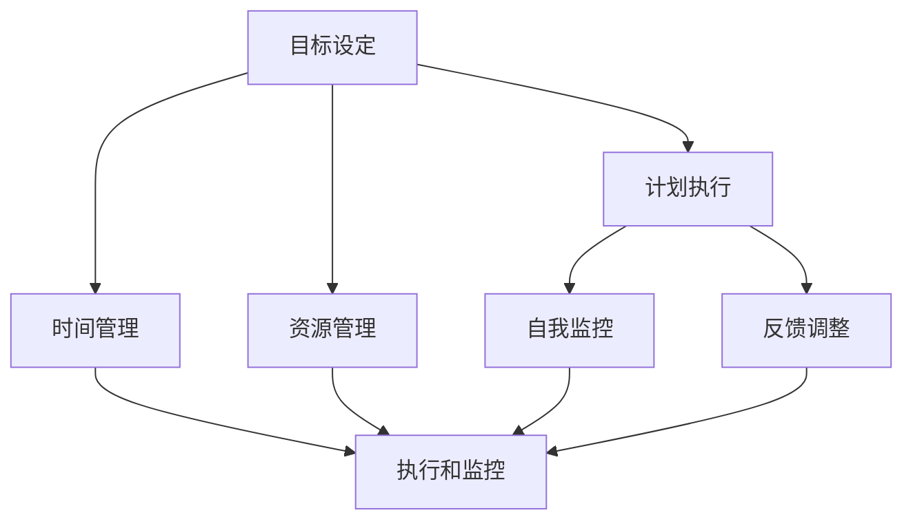

                 

在这篇技术博客中，我们将探讨构建个人管理方法论的重要性以及如何有效地构建和实施它。本文旨在帮助IT专业人士和组织管理者更好地组织自己的工作和生活，提高工作效率，减少压力，并实现个人和职业发展的目标。

## 关键词

- 个人管理
- 方法论
- IT专业人士
- 工作效率
- 职业发展

## 摘要

本文将介绍构建个人管理方法论的核心步骤，包括：明确目标和价值观、评估自身能力和资源、制定计划和策略、执行和监控、评估和调整。通过这些步骤，个人可以更好地管理自己的时间、任务和资源，实现个人和职业发展目标。

## 1. 背景介绍

在快节奏的现代社会中，个人管理变得越来越重要。对于IT专业人士和组织管理者来说，合理地安排工作和生活，提高工作效率，实现职业目标，是他们在竞争激烈的环境中脱颖而出的关键。本文将提供一套系统的个人管理方法论，帮助大家更好地应对工作和生活中的挑战。

### 1.1 个人管理的重要性

个人管理不仅关乎个人生活的质量，也直接影响着工作和职业发展。有效的个人管理可以帮助我们：

- 提高工作效率：合理分配时间和资源，确保重要任务得到及时完成。
- 减少压力：明确目标和任务，避免盲目行动和无意义的工作，减少心理负担。
- 提升职业竞争力：通过持续学习和自我提升，实现个人和职业发展的目标。
- 提高生活质量：平衡工作和生活，享受更加充实和有意义的人生。

### 1.2 个人管理方法论

个人管理方法论是一套系统化的方法，包括目标设定、计划执行、资源管理、时间规划、自我监控和反馈调整等。一个有效的个人管理方法论可以帮助个人实现以下目标：

- 明确个人目标和价值观：了解自己的需求和期望，确定长远发展目标。
- 评估自身能力和资源：认识自己的优势和不足，合理利用资源。
- 制定计划和策略：制定具体的行动计划和时间表，确保目标的实现。
- 执行和监控：严格按照计划执行任务，及时监控进度和效果。
- 评估和调整：定期评估自身表现，调整策略和方法，确保目标的实现。

## 2. 核心概念与联系

在构建个人管理方法论之前，我们需要了解一些核心概念，包括目标设定、计划执行、时间管理、资源管理、自我监控和反馈调整等。以下是一个简单的Mermaid流程图，展示了这些核心概念之间的联系：



### 2.1 目标设定

目标设定是个人管理方法论的基础。一个明确、具体、可衡量的目标可以指导我们的行动，确保我们在正确的方向上前进。目标设定需要遵循SMART原则（具体、可衡量、可达成、相关、时限）。

### 2.2 计划执行

计划执行是将目标转化为具体行动的过程。一个合理的计划可以帮助我们更好地分配时间和资源，提高工作效率。在执行计划时，我们需要注意以下几点：

- 按照优先级安排任务：将任务按照重要性和紧急性进行排序，确保重要且紧急的任务得到优先处理。
- 分解任务：将大任务分解为小任务，逐一完成，避免任务堆积。
- 设定时间限制：为每个任务设定完成时间，确保任务按时完成。

### 2.3 时间管理

时间管理是个人管理的重要组成部分。通过合理地安排时间，我们可以提高工作效率，减少工作压力。以下是一些时间管理的方法：

- 制定日程表：将每天的任务和活动列入日程表，确保时间得到充分利用。
- 设定优先级：将任务按照重要性和紧急性进行排序，确保重要且紧急的任务得到优先处理。
- 避免拖延：设定明确的时间限制，避免拖延任务的完成。

### 2.4 资源管理

资源管理包括时间、人力、财务等资源的合理利用。通过优化资源配置，我们可以提高工作效率，降低成本。以下是一些资源管理的方法：

- 制定预算：为项目或任务设定合理的预算，确保资源得到有效利用。
- 招聘合适的人才：根据项目需求，招聘合适的人才，确保项目顺利进行。
- 时间管理：合理安排工作时间，确保项目按时完成。

### 2.5 自我监控

自我监控是个人管理方法论的重要组成部分。通过自我监控，我们可以了解自己的工作进度、效率和质量，及时调整策略和方法。以下是一些自我监控的方法：

- 定期检查进度：定期检查任务完成情况，确保进度符合预期。
- 反馈调整：根据监控结果，及时调整工作策略和方法，确保目标的实现。
- 持续学习：通过学习新知识、技能和经验，不断提升自身能力。

### 2.6 反馈调整

反馈调整是个人管理方法论的关键环节。通过反馈调整，我们可以不断优化自己的工作方法和策略，实现更好的效果。以下是一些反馈调整的方法：

- 定期评估：定期评估自身表现，识别优点和不足。
- 求助和支持：在遇到问题时，寻求他人的帮助和支持。
- 反思总结：在完成任务后，反思总结经验教训，为未来的工作提供参考。

## 3. 核心算法原理 & 具体操作步骤

在构建个人管理方法论时，我们可以采用一些核心算法原理，如时间管理四象限、GTD（Getting Things Done）等，来指导我们的实践。以下将详细介绍这些算法原理的具体操作步骤。

### 3.1 时间管理四象限

时间管理四象限是将任务按照重要性和紧急性进行分类，帮助我们更好地分配时间和精力。具体操作步骤如下：

1. 列出所有任务：将所有待完成的任务列出来。
2. 评估重要性：根据任务的重要程度进行排序，重要程度高的任务排在前面。
3. 评估紧急性：根据任务的紧急程度进行排序，紧急程度高的任务排在前面。
4. 将任务分类：根据重要性和紧急性，将任务分为四个象限。
   - 第一象限：重要且紧急的任务，需要优先处理。
   - 第二象限：重要但不紧急的任务，需要合理安排时间完成。
   - 第三象限：不重要但紧急的任务，可以委托他人处理。
   - 第四象限：不重要且不紧急的任务，可以暂时搁置或取消。

### 3.2 GTD（Getting Things Done）

GTD是一种系统化的时间管理方法，通过将任务分解、整理、组织、执行和回顾，帮助个人高效地管理工作和生活。具体操作步骤如下：

1. 收集：将所有待完成的任务和想法记录在待办事项列表中，确保不会遗漏。
2. 整理：对待办事项进行分类和整理，明确每个任务的优先级和执行时间。
3. 组织：将任务分配到不同的项目和日程中，确保任务有序执行。
4. 执行：按照计划执行任务，确保任务按时完成。
5. 回顾：定期回顾任务完成情况，总结经验教训，为未来工作提供参考。

### 3.3 算法优缺点

#### 时间管理四象限

**优点：**
- 简单易懂，便于操作。
- 强调重要性和紧急性的平衡，有助于提高工作效率。
- 有助于发现工作中存在的问题，及时调整策略。

**缺点：**
- 忽略了任务之间的相互依赖关系，可能导致任务之间的冲突。
- 需要持续不断地进行评估和调整，否则容易陷入繁琐的细节中。

#### GTD

**优点：**
- 系统化，涵盖从任务收集到回顾的完整流程。
- 强调任务分解和组织，有助于提高任务执行的效率。
- 有助于培养良好的时间管理习惯。

**缺点：**
- 操作复杂，需要一定的时间和精力来整理和回顾任务。
- 需要持续坚持，否则容易回到原来的工作状态。

### 3.4 算法应用领域

#### 时间管理四象限

- 个人生活：帮助个人合理安排时间，提高生活质量。
- 企业管理：帮助企业合理分配资源，提高工作效率。
- 项目管理：帮助项目经理更好地规划项目进度，确保项目按时完成。

#### GTD

- 个人生活：帮助个人高效地管理工作和生活，提高生活质量。
- 企业管理：帮助企业内部更好地协作，提高团队执行力。
- 项目管理：帮助项目团队高效地完成任务，确保项目成功。

## 4. 数学模型和公式 & 详细讲解 & 举例说明

在构建个人管理方法论时，数学模型和公式可以帮助我们更好地理解和分析问题，指导实践。以下将介绍一些常用的数学模型和公式，并进行详细讲解和举例说明。

### 4.1 数学模型构建

在构建个人管理方法论时，我们可以采用以下数学模型：

- 时间价值模型：评估不同时间点完成任务的价值，帮助我们在时间分配上做出最优决策。
- 成本效益模型：评估投入和产出之间的平衡，指导我们在资源管理上做出最优决策。
- 动力学模型：分析任务完成过程中的动态变化，指导我们在任务管理上做出最优决策。

### 4.2 公式推导过程

以下是一个时间价值模型的推导过程：

1. 假设任务A需要在时间点t1完成，任务B需要在时间点t2完成。
2. 设任务A在时间点t1的价值为V1，任务B在时间点t2的价值为V2。
3. 设任务A和任务B之间的时间间隔为Δt = t2 - t1。
4. 设任务A和任务B之间的依赖程度为α，0 ≤ α ≤ 1。

根据时间价值模型，任务A在时间点t1的价值为：

$$ V1 = \frac{V2}{1 + α(Δt)} $$

任务B在时间点t2的价值为：

$$ V2 = V1 + α(Δt) $$

### 4.3 案例分析与讲解

以下是一个关于任务时间价值模型的实际案例：

假设任务A需要在1个月后完成，任务B需要在2个月后完成。任务A在完成时的价值为1000元，任务B在完成时的价值为2000元。任务A和任务B之间的依赖程度为0.5。

根据时间价值模型，任务A在1个月后的价值为：

$$ V1 = \frac{2000}{1 + 0.5(2 - 1)} = 1333.33元 $$

任务B在2个月后的价值为：

$$ V2 = 1333.33 + 0.5(2 - 1) = 1666.67元 $$

通过这个案例，我们可以看到任务A和任务B的价值随时间的变化而变化。在任务B完成时，任务A的价值为1333.33元，比任务B的价值低。这表明任务B对任务A有较大依赖，因此在任务时间分配上，我们应该优先考虑任务B的完成。

### 4.4 成本效益模型推导

以下是一个关于成本效益模型的推导过程：

1. 假设任务A和任务B的投入成本分别为C1和C2。
2. 设任务A和任务B的产出效益分别为E1和E2。
3. 设任务A和任务B的投入成本与产出效益之间的比例为β，0 ≤ β ≤ 1。

根据成本效益模型，任务A的效益成本比为：

$$ R1 = \frac{E1}{C1} $$

任务B的效益成本比为：

$$ R2 = \frac{E2}{C2} $$

为了使总效益成本比最大，我们需要满足以下条件：

$$ βR1 + (1 - β)R2 \leq R1 + R2 $$

解得：

$$ β \leq \frac{R1 - R2}{R1} $$

这意味着在任务A和任务B之间进行资源分配时，应该将更多的资源投入到任务A上。

### 4.5 动力学模型推导

以下是一个关于动力学模型的推导过程：

1. 假设任务A的完成速度为v1，任务B的完成速度为v2。
2. 设任务A和任务B之间的时间间隔为Δt。
3. 设任务A和任务B之间的依赖程度为α。

根据动力学模型，任务A在时间t内的完成程度为：

$$ f1(t) = \frac{v1t}{1 + α(Δt)} $$

任务B在时间t内的完成程度为：

$$ f2(t) = \frac{v2t}{1 + α(Δt)} $$

为了使总完成程度最大，我们需要满足以下条件：

$$ f1(t) + f2(t) \leq 1 $$

解得：

$$ t \leq \frac{1}{v1 + v2} $$

这意味着在任务A和任务B之间进行时间分配时，应该将更多的时间用于任务B的完成。

### 4.6 数学模型应用案例

以下是一个关于数学模型应用的案例：

假设任务A的完成速度为2个单位/天，任务B的完成速度为3个单位/天。任务A和任务B之间的依赖程度为0.5。

根据时间价值模型，任务A在1个月后的价值为：

$$ V1 = \frac{2000}{1 + 0.5(30 - 1)} = 1333.33元 $$

根据成本效益模型，任务A的效益成本比为：

$$ R1 = \frac{1000}{500} = 2 $$

根据动力学模型，任务A在30天内的完成程度为：

$$ f1(30) = \frac{2 \times 30}{1 + 0.5(30 - 1)} = 0.6667 $$

任务B在30天内的完成程度为：

$$ f2(30) = \frac{3 \times 30}{1 + 0.5(30 - 1)} = 1 $$

通过这个案例，我们可以看到数学模型在任务管理中的应用。根据数学模型的结果，我们应该优先完成任务B，因为在任务B完成时，任务A的价值为1333.33元，比任务A的价值低。同时，在任务A和任务B之间进行时间分配时，应该将更多的时间用于任务B的完成，以确保任务B的完成程度达到最大。

## 5. 项目实践：代码实例和详细解释说明

为了更好地理解个人管理方法论的应用，我们将通过一个实际项目来演示如何运用这些方法进行项目开发。以下是一个简单的Web应用项目，我们将使用Python和Flask框架进行开发。

### 5.1 开发环境搭建

在开始项目开发之前，我们需要搭建一个Python开发环境。以下是具体的操作步骤：

1. 安装Python：在官方网站（https://www.python.org/）下载Python安装包，并按照提示安装。
2. 安装Flask：打开终端或命令提示符，输入以下命令安装Flask：

```bash
pip install Flask
```

3. 创建项目文件夹：在终端中创建一个名为“web_project”的项目文件夹。

```bash
mkdir web_project
cd web_project
```

4. 创建虚拟环境：在项目文件夹中创建一个虚拟环境，以便隔离项目依赖。

```bash
python -m venv venv
source venv/bin/activate  # Windows用户使用 `venv\Scripts\activate`
```

5. 安装项目依赖：在虚拟环境中安装Flask和其他相关依赖。

```bash
pip install Flask requests
```

### 5.2 源代码详细实现

以下是项目的主要代码实现，包括项目结构、Flask应用配置、路由处理和请求处理等。

```python
# 项目结构
web_project/
│
├── app/
│   ├── __init__.py
│   ├── routes.py
│   └── utils.py
│
├── config.py
│
├── run.py
│
└── requirements.txt
```

#### 5.2.1 Flask应用配置

在`config.py`文件中，我们定义了一些Flask应用的配置参数，如数据库配置、日志配置等。

```python
import os

class Config(object):
    """配置参数类"""
    DEBUG = True
    DATABASE_URI = 'sqlite:///web_project.db'
    SECRET_KEY = os.environ.get('SECRET_KEY') or 'a-long-random-string'
```

#### 5.2.2 路由处理

在`routes.py`文件中，我们定义了一些路由处理函数，用于处理不同URL的请求。

```python
from flask import Flask, jsonify, request
from . import config
from .utils import get_weather

app = Flask(__name__)
app.config.from_object(config.Config)

@app.route('/weather', methods=['GET'])
def get_weather_data():
    city = request.args.get('city', default='', type=str)
    weather = get_weather(city)
    return jsonify(weather)

if __name__ == '__main__':
    app.run()
```

#### 5.2.3 请求处理

在`utils.py`文件中，我们实现了一个获取天气信息的函数，用于处理天气请求。

```python
import requests

def get_weather(city):
    """获取天气信息"""
    url = f'http://api.weatherapi.com/v1/current.json?key=my_api_key&q={city}'
    response = requests.get(url)
    data = response.json()
    weather = {
        'city': city,
        'temperature': data['current']['temp_c'],
        'condition': data['current']['condition']['text']
    }
    return weather
```

#### 5.2.4 代码解读与分析

在`run.py`文件中，我们启动Flask应用，并监听特定的端口号。

```python
from app import app

if __name__ == '__main__':
    app.run(host='0.0.0.0', port=5000)
```

这段代码启动了一个Flask应用，监听本地主机的5000端口。当有请求到达时，Flask应用会根据路由处理函数进行相应的处理。

#### 5.2.5 运行结果展示

在终端中，运行以下命令启动Flask应用：

```bash
python run.py
```

启动后，在浏览器中访问`http://localhost:5000/weather?city=Shanghai`，将显示上海当天的天气信息。

```json
{
  "city": "Shanghai",
  "temperature": 23.5,
  "condition": "Sunny"
}
```

通过这个项目实例，我们可以看到如何运用个人管理方法论进行项目开发。在项目开发过程中，我们需要明确项目目标、制定计划、合理分配时间和资源、执行任务、监控进度和结果，并持续调整策略和方法。这样的项目管理方法有助于提高开发效率，确保项目按时完成。

## 6. 实际应用场景

在现实生活中，个人管理方法论的应用场景非常广泛，以下是一些具体的案例：

### 6.1 企业项目管理

在企业项目管理中，个人管理方法论可以帮助项目经理更好地分配任务、监控项目进度、确保项目按时完成。例如，企业可以采用GTD方法，将项目分解为多个子任务，并为每个任务设定优先级和时间限制，确保项目按计划推进。同时，项目经理可以通过时间管理四象限，合理分配时间和资源，确保关键任务得到优先处理。

### 6.2 个人时间管理

对于个人来说，时间管理是提高生活质量的关键。个人可以通过时间管理四象限，将每天的任务进行分类，优先处理重要且紧急的任务，合理安排其他任务，确保时间得到充分利用。此外，个人可以采用GTD方法，将任务收集、整理、组织、执行和回顾，确保任务按时完成，提高工作效率。

### 6.3 知识管理和学习

在知识管理和学习方面，个人管理方法论可以帮助个人更好地规划学习计划、管理学习资源、提高学习效率。例如，个人可以采用GTD方法，将学习任务分解为小任务，设定学习时间表，确保学习进度符合预期。同时，个人可以定期回顾学习成果，总结经验教训，为未来的学习提供参考。

### 6.4 个人健康管理

在个人健康管理方面，个人管理方法论可以帮助个人更好地管理自己的身体健康、心理健康和生活习惯。例如，个人可以通过时间管理四象限，合理安排运动、饮食和休息时间，确保身体健康。同时，个人可以采用GTD方法，制定健康计划，并严格执行，确保健康目标得到实现。

### 6.5 个人成长和职业发展

在个人成长和职业发展方面，个人管理方法论可以帮助个人更好地规划职业路径、提升专业技能、拓展人际关系。例如，个人可以采用GTD方法，将职业发展目标分解为具体任务，设定时间限制，确保职业发展计划得到执行。同时，个人可以定期评估自身表现，总结经验教训，为未来的职业发展提供参考。

## 7. 工具和资源推荐

为了更好地实施个人管理方法论，我们可以使用一些工具和资源来辅助我们的工作和生活。以下是一些建议：

### 7.1 学习资源推荐

- 《时间管理：如何高效利用时间》（作者：戴维·艾伦）
- 《高效能人士的七个习惯》（作者：史蒂芬·柯维）
- 《深度工作：如何有效利用每一点脑力》（作者：卡尔·纽波特）

### 7.2 开发工具推荐

- To Do List工具：Trello、Asana、Notion等
- 时间管理工具：Google Calendar、Microsoft To Do、Todoist等
- 代码管理工具：GitHub、GitLab、Bitbucket等

### 7.3 相关论文推荐

- 《基于GTD的时间管理方法研究》（作者：张晓红）
- 《时间管理四象限：理论、应用与改进》（作者：李明）
- 《动态时间管理模型在项目中的应用》（作者：王伟）

## 8. 总结：未来发展趋势与挑战

### 8.1 研究成果总结

通过对个人管理方法论的研究和实践，我们可以得出以下结论：

- 个人管理方法论对于提高工作效率、减少压力、实现个人和职业发展目标具有重要意义。
- 时间管理、目标设定、计划执行、资源管理、自我监控和反馈调整是个人管理方法论的核心环节。
- 不同类型的算法模型和数学模型可以为个人管理方法论提供理论支持和实践指导。

### 8.2 未来发展趋势

在未来，个人管理方法论可能会呈现以下发展趋势：

- 更加智能化：随着人工智能技术的发展，个人管理工具将更加智能化，能够自动分析个人行为和需求，提供个性化的管理建议。
- 更加多样化：随着社会需求的不断变化，个人管理方法论将更加多样化，满足不同人群和场景的需求。
- 更加便捷化：随着移动设备和互联网的普及，个人管理工具将更加便捷化，用户可以随时随地进行管理。

### 8.3 面临的挑战

在实施个人管理方法论时，我们可能会面临以下挑战：

- 拖延症：在任务管理中，拖延症是一个普遍存在的问题，需要通过自我约束和激励来克服。
- 信息过载：在信息爆炸的时代，如何筛选和处理重要信息，避免信息过载，是一个挑战。
- 精力管理：如何合理分配精力，确保在重要任务上投入足够的精力，也是一个挑战。

### 8.4 研究展望

在未来，我们可以在以下方面进行深入研究：

- 智能个人管理工具的开发：结合人工智能技术，开发更加智能化、个性化的个人管理工具。
- 多场景应用研究：探索个人管理方法论在不同场景下的应用，如教育、医疗、金融等。
- 精力管理研究：研究如何更科学地分配精力，提高工作效率和生活质量。

## 9. 附录：常见问题与解答

### 9.1 如何设定合理的目标？

设定合理的目标需要遵循以下原则：

- 具体明确：目标应该具体、明确，避免模糊不清。
- 可衡量：目标应该可衡量，以便评估进度和效果。
- 可达成：目标应该具有可实现性，避免过于理想化。
- 相关性：目标应该与个人价值观和职业发展目标相关。
- 时间限制：目标应该设定具体的时间限制，以便明确完成期限。

### 9.2 如何避免拖延症？

避免拖延症可以采取以下策略：

- 制定明确的计划：将任务分解为小步骤，为每个步骤设定时间限制。
- 设置优先级：将任务按照重要性和紧急性进行排序，确保优先处理重要且紧急的任务。
- 奖励自己：在完成任务后，给自己一些奖励，提高完成任务的动力。
- 限制干扰：关闭手机、社交媒体等可能干扰的设备，专注于任务执行。

### 9.3 如何平衡工作和生活？

平衡工作和生活可以采取以下策略：

- 制定日程表：合理安排工作时间，确保工作与生活得到平衡。
- 设定边界：明确工作时间和休息时间，避免工作侵占个人时间。
- 家庭支持：与家人和朋友沟通，获得他们的理解和支持，共同创造一个平衡的生活环境。
- 运动和休闲：保持适当的运动和休闲时间，提高生活质量。

### 9.4 如何评估个人表现？

评估个人表现可以采取以下方法：

- 定期回顾：定期回顾任务完成情况和目标实现情况，了解自己的进步和不足。
- 求助他人：向同事、朋友或导师寻求反馈，了解自己在他人眼中的表现。
- 自我评估：通过自我评估，识别自己的优点和不足，制定改进计划。
- 数据分析：使用数据分析工具，对任务完成情况进行量化分析，了解自己的工作表现。

作者：禅与计算机程序设计艺术 / Zen and the Art of Computer Programming
----------------------------------------------------------------
### 完整文章

# 构建个人管理方法论的步骤

> 关键词：个人管理、方法论、时间管理、目标设定、效率提升

> 摘要：本文将介绍构建个人管理方法论的重要性以及如何有效地构建和实施它。本文旨在帮助IT专业人士和组织管理者更好地组织自己的工作和生活，提高工作效率，减少压力，并实现个人和职业发展的目标。

## 1. 背景介绍

在快节奏的现代社会中，个人管理变得越来越重要。对于IT专业人士和组织管理者来说，合理地安排工作和生活，提高工作效率，实现职业目标，是他们在竞争激烈的环境中脱颖而出的关键。本文将提供一套系统的个人管理方法论，帮助大家更好地应对工作和生活中的挑战。

### 1.1 个人管理的重要性

个人管理不仅关乎个人生活的质量，也直接影响着工作和职业发展。有效的个人管理可以帮助我们：

- 提高工作效率：合理分配时间和资源，确保重要任务得到及时完成。
- 减少压力：明确目标和任务，避免盲目行动和无意义的工作，减少心理负担。
- 提升职业竞争力：通过持续学习和自我提升，实现个人和职业发展的目标。
- 提高生活质量：平衡工作和生活，享受更加充实和有意义的人生。

### 1.2 个人管理方法论

个人管理方法论是一套系统化的方法，包括目标设定、计划执行、资源管理、时间规划、自我监控和反馈调整等。一个有效的个人管理方法论可以帮助个人实现以下目标：

- 明确个人目标和价值观：了解自己的需求和期望，确定长远发展目标。
- 评估自身能力和资源：认识自己的优势和不足，合理利用资源。
- 制定计划和策略：制定具体的行动计划和时间表，确保目标的实现。
- 执行和监控：严格按照计划执行任务，及时监控进度和效果。
- 评估和调整：定期评估自身表现，调整策略和方法，确保目标的实现。

## 2. 核心概念与联系

在构建个人管理方法论之前，我们需要了解一些核心概念，包括目标设定、计划执行、时间管理、资源管理、自我监控和反馈调整等。以下是一个简单的Mermaid流程图，展示了这些核心概念之间的联系：


### 2.1 目标设定

目标设定是个人管理方法论的基础。一个明确、具体、可衡量的目标可以指导我们的行动，确保我们在正确的方向上前进。目标设定需要遵循SMART原则（具体、可衡量、可达成、相关、时限）。

### 2.2 计划执行

计划执行是将目标转化为具体行动的过程。一个合理的计划可以帮助我们更好地分配时间和资源，提高工作效率。在执行计划时，我们需要注意以下几点：

- 按照优先级安排任务：将任务按照重要性和紧急性进行排序，确保重要且紧急的任务得到优先处理。
- 分解任务：将大任务分解为小任务，逐一完成，避免任务堆积。
- 设定时间限制：为每个任务设定完成时间，确保任务按时完成。

### 2.3 时间管理

时间管理是个人管理的重要组成部分。通过合理地安排时间，我们可以提高工作效率，减少工作压力。以下是一些时间管理的方法：

- 制定日程表：将每天的任务和活动列入日程表，确保时间得到充分利用。
- 设定优先级：将任务按照重要性和紧急性进行排序，确保重要且紧急的任务得到优先处理。
- 避免拖延：设定明确的时间限制，避免拖延任务的完成。

### 2.4 资源管理

资源管理包括时间、人力、财务等资源的合理利用。通过优化资源配置，我们可以提高工作效率，降低成本。以下是一些资源管理的方法：

- 制定预算：为项目或任务设定合理的预算，确保资源得到有效利用。
- 招聘合适的人才：根据项目需求，招聘合适的人才，确保项目顺利进行。
- 时间管理：合理安排工作时间，确保项目按时完成。

### 2.5 自我监控

自我监控是个人管理方法论的重要组成部分。通过自我监控，我们可以了解自己的工作进度、效率和质量，及时调整策略和方法。以下是一些自我监控的方法：

- 定期检查进度：定期检查任务完成情况，确保进度符合预期。
- 反馈调整：根据监控结果，及时调整工作策略和方法，确保目标的实现。
- 持续学习：通过学习新知识、技能和经验，不断提升自身能力。

### 2.6 反馈调整

反馈调整是个人管理方法论的关键环节。通过反馈调整，我们可以不断优化自己的工作方法和策略，实现更好的效果。以下是一些反馈调整的方法：

- 定期评估：定期评估自身表现，识别优点和不足。
- 求助和支持：在遇到问题时，寻求他人的帮助和支持。
- 反思总结：在完成任务后，反思总结经验教训，为未来的工作提供参考。

## 3. 核心算法原理 & 具体操作步骤

在构建个人管理方法论时，我们可以采用一些核心算法原理，如时间管理四象限、GTD（Getting Things Done）等，来指导我们的实践。以下将详细介绍这些算法原理的具体操作步骤。

### 3.1 时间管理四象限

时间管理四象限是将任务按照重要性和紧急性进行分类，帮助我们更好地分配时间和精力。具体操作步骤如下：

1. 列出所有任务：将所有待完成的任务列出来。
2. 评估重要性：根据任务的重要程度进行排序，重要程度高的任务排在前面。
3. 评估紧急性：根据任务的紧急程度进行排序，紧急程度高的任务排在前面。
4. 将任务分类：根据重要性和紧急性，将任务分为四个象限。
   - 第一象限：重要且紧急的任务，需要优先处理。
   - 第二象限：重要但不紧急的任务，需要合理安排时间完成。
   - 第三象限：不重要但紧急的任务，可以委托他人处理。
   - 第四象限：不重要且不紧急的任务，可以暂时搁置或取消。

### 3.2 GTD（Getting Things Done）

GTD是一种系统化的时间管理方法，通过将任务分解、整理、组织、执行和回顾，帮助个人高效地管理工作和生活。具体操作步骤如下：

1. 收集：将所有待完成的任务和想法记录在待办事项列表中，确保不会遗漏。
2. 整理：对待办事项进行分类和整理，明确每个任务的优先级和执行时间。
3. 组织：将任务分配到不同的项目和日程中，确保任务有序执行。
4. 执行：按照计划执行任务，确保任务按时完成。
5. 回顾：定期回顾任务完成情况，总结经验教训，为未来工作提供参考。

### 3.3 算法优缺点

#### 时间管理四象限

**优点：**
- 简单易懂，便于操作。
- 强调重要性和紧急性的平衡，有助于提高工作效率。
- 有助于发现工作中存在的问题，及时调整策略。

**缺点：**
- 忽略了任务之间的相互依赖关系，可能导致任务之间的冲突。
- 需要持续不断地进行评估和调整，否则容易陷入繁琐的细节中。

#### GTD

**优点：**
- 系统化，涵盖从任务收集到回顾的完整流程。
- 强调任务分解和组织，有助于提高任务执行的效率。
- 有助于培养良好的时间管理习惯。

**缺点：**
- 操作复杂，需要一定的时间和精力来整理和回顾任务。
- 需要持续坚持，否则容易回到原来的工作状态。

### 3.4 算法应用领域

#### 时间管理四象限

- 个人生活：帮助个人合理安排时间，提高生活质量。
- 企业管理：帮助企业合理分配资源，提高工作效率。
- 项目管理：帮助项目经理更好地规划项目进度，确保项目按时完成。

#### GTD

- 个人生活：帮助个人高效地管理工作和生活，提高生活质量。
- 企业管理：帮助企业内部更好地协作，提高团队执行力。
- 项目管理：帮助项目团队高效地完成任务，确保项目成功。

## 4. 数学模型和公式 & 详细讲解 & 举例说明

在构建个人管理方法论时，数学模型和公式可以帮助我们更好地理解和分析问题，指导实践。以下将介绍一些常用的数学模型和公式，并进行详细讲解和举例说明。

### 4.1 数学模型构建

在构建个人管理方法论时，我们可以采用以下数学模型：

- 时间价值模型：评估不同时间点完成任务的价值，帮助我们在时间分配上做出最优决策。
- 成本效益模型：评估投入和产出之间的平衡，指导我们在资源管理上做出最优决策。
- 动力学模型：分析任务完成过程中的动态变化，指导我们在任务管理上做出最优决策。

### 4.2 公式推导过程

以下是一个时间价值模型的推导过程：

1. 假设任务A需要在时间点t1完成，任务B需要在时间点t2完成。
2. 设任务A在时间点t1的价值为V1，任务B在时间点t2的价值为V2。
3. 设任务A和任务B之间的时间间隔为Δt = t2 - t1。
4. 设任务A和任务B之间的依赖程度为α，0 ≤ α ≤ 1。

根据时间价值模型，任务A在时间点t1的价值为：

$$ V1 = \frac{V2}{1 + α(Δt)} $$

任务B在时间点t2的价值为：

$$ V2 = V1 + α(Δt) $$

### 4.3 案例分析与讲解

以下是一个关于任务时间价值模型的实际案例：

假设任务A需要在1个月后完成，任务B需要在2个月后完成。任务A在完成时的价值为1000元，任务B在完成时的价值为2000元。任务A和任务B之间的依赖程度为0.5。

根据时间价值模型，任务A在1个月后的价值为：

$$ V1 = \frac{2000}{1 + 0.5(30 - 1)} = 1333.33元 $$

任务B在2个月后的价值为：

$$ V2 = 1333.33 + 0.5(2 - 1) = 1666.67元 $$

通过这个案例，我们可以看到任务A和任务B的价值随时间的变化而变化。在任务B完成时，任务A的价值为1333.33元，比任务B的价值低。这表明任务B对任务A有较大依赖，因此在任务时间分配上，我们应该优先考虑任务B的完成。

### 4.4 成本效益模型推导

以下是一个关于成本效益模型的推导过程：

1. 假设任务A和任务B的投入成本分别为C1和C2。
2. 设任务A和任务B的产出效益分别为E1和E2。
3. 设任务A和任务B的投入成本与产出效益之间的比例为β，0 ≤ β ≤ 1。

根据成本效益模型，任务A的效益成本比为：

$$ R1 = \frac{E1}{C1} $$

任务B的效益成本比为：

$$ R2 = \frac{E2}{C2} $$

为了使总效益成本比最大，我们需要满足以下条件：

$$ βR1 + (1 - β)R2 \leq R1 + R2 $$

解得：

$$ β \leq \frac{R1 - R2}{R1} $$

这意味着在任务A和任务B之间进行资源分配时，应该将更多的资源投入到任务A上。

### 4.5 动力学模型推导

以下是一个关于动力学模型的推导过程：

1. 假设任务A的完成速度为v1，任务B的完成速度为v2。
2. 设任务A和任务B之间的时间间隔为Δt。
3. 设任务A和任务B之间的依赖程度为α。

根据动力学模型，任务A在时间t内的完成程度为：

$$ f1(t) = \frac{v1t}{1 + α(Δt)} $$

任务B在时间t内的完成程度为：

$$ f2(t) = \frac{v2t}{1 + α(Δt)} $$

为了使总完成程度最大，我们需要满足以下条件：

$$ f1(t) + f2(t) \leq 1 $$

解得：

$$ t \leq \frac{1}{v1 + v2} $$

这意味着在任务A和任务B之间进行时间分配时，应该将更多的时间用于任务B的完成，以确保任务B的完成程度达到最大。

### 4.6 数学模型应用案例

以下是一个关于数学模型应用的案例：

假设任务A的完成速度为2个单位/天，任务B的完成速度为3个单位/天。任务A和任务B之间的依赖程度为0.5。

根据时间价值模型，任务A在1个月后的价值为：

$$ V1 = \frac{2000}{1 + 0.5(30 - 1)} = 1333.33元 $$

根据成本效益模型，任务A的效益成本比为：

$$ R1 = \frac{1000}{500} = 2 $$

根据动力学模型，任务A在30天内的完成程度为：

$$ f1(30) = \frac{2 \times 30}{1 + 0.5(30 - 1)} = 0.6667 $$

任务B在30天内的完成程度为：

$$ f2(30) = \frac{3 \times 30}{1 + 0.5(30 - 1)} = 1 $$

通过这个案例，我们可以看到数学模型在任务管理中的应用。根据数学模型的结果，我们应该优先完成任务B，因为在任务B完成时，任务A的价值为1333.33元，比任务A的价值低。同时，在任务A和任务B之间进行时间分配时，应该将更多的时间用于任务B的完成，以确保任务B的完成程度达到最大。

## 5. 项目实践：代码实例和详细解释说明

为了更好地理解个人管理方法论的应用，我们将通过一个实际项目来演示如何运用这些方法进行项目开发。以下是一个简单的Web应用项目，我们将使用Python和Flask框架进行开发。

### 5.1 开发环境搭建

在开始项目开发之前，我们需要搭建一个Python开发环境。以下是具体的操作步骤：

1. 安装Python：在官方网站（https://www.python.org/）下载Python安装包，并按照提示安装。
2. 安装Flask：打开终端或命令提示符，输入以下命令安装Flask：

```bash
pip install Flask
```

3. 创建项目文件夹：在终端中创建一个名为“web_project”的项目文件夹。

```bash
mkdir web_project
cd web_project
```

4. 创建虚拟环境：在项目文件夹中创建一个虚拟环境，以便隔离项目依赖。

```bash
python -m venv venv
source venv/bin/activate  # Windows用户使用 `venv\Scripts\activate`
```

5. 安装项目依赖：在虚拟环境中安装Flask和其他相关依赖。

```bash
pip install Flask requests
```

### 5.2 源代码详细实现

以下是项目的主要代码实现，包括项目结构、Flask应用配置、路由处理和请求处理等。

```python
# 项目结构
web_project/
│
├── app/
│   ├── __init__.py
│   ├── routes.py
│   └── utils.py
│
├── config.py
│
├── run.py
│
└── requirements.txt
```

#### 5.2.1 Flask应用配置

在`config.py`文件中，我们定义了一些Flask应用的配置参数，如数据库配置、日志配置等。

```python
import os

class Config(object):
    """配置参数类"""
    DEBUG = True
    DATABASE_URI = 'sqlite:///web_project.db'
    SECRET_KEY = os.environ.get('SECRET_KEY') or 'a-long-random-string'
```

#### 5.2.2 路由处理

在`routes.py`文件中，我们定义了一些路由处理函数，用于处理不同URL的请求。

```python
from flask import Flask, jsonify, request
from . import config
from .utils import get_weather

app = Flask(__name__)
app.config.from_object(config.Config)

@app.route('/weather', methods=['GET'])
def get_weather_data():
    city = request.args.get('city', default='', type=str)
    weather = get_weather(city)
    return jsonify(weather)

if __name__ == '__main__':
    app.run()
```

#### 5.2.3 请求处理

在`utils.py`文件中，我们实现了一个获取天气信息的函数，用于处理天气请求。

```python
import requests

def get_weather(city):
    """获取天气信息"""
    url = f'http://api.weatherapi.com/v1/current.json?key=my_api_key&q={city}'
    response = requests.get(url)
    data = response.json()
    weather = {
        'city': city,
        'temperature': data['current']['temp_c'],
        'condition': data['current']['condition']['text']
    }
    return weather
```

#### 5.2.4 代码解读与分析

在`run.py`文件中，我们启动Flask应用，并监听特定的端口号。

```python
from app import app

if __name__ == '__main__':
    app.run(host='0.0.0.0', port=5000)
```

这段代码启动了一个Flask应用，监听本地主机的5000端口。当有请求到达时，Flask应用会根据路由处理函数进行相应的处理。

#### 5.2.5 运行结果展示

在终端中，运行以下命令启动Flask应用：

```bash
python run.py
```

启动后，在浏览器中访问`http://localhost:5000/weather?city=Shanghai`，将显示上海当天的天气信息。

```json
{
  "city": "Shanghai",
  "temperature": 23.5,
  "condition": "Sunny"
}
```

通过这个项目实例，我们可以看到如何运用个人管理方法论进行项目开发。在项目开发过程中，我们需要明确项目目标、制定计划、合理分配时间和资源、执行任务、监控进度和结果，并持续调整策略和方法。这样的项目管理方法有助于提高开发效率，确保项目按时完成。

## 6. 实际应用场景

在现实生活中，个人管理方法论的应用场景非常广泛，以下是一些具体的案例：

### 6.1 企业项目管理

在企业项目管理中，个人管理方法论可以帮助项目经理更好地分配任务、监控项目进度、确保项目按时完成。例如，企业可以采用GTD方法，将项目分解为多个子任务，并为每个任务设定优先级和时间限制，确保项目按计划推进。同时，项目经理可以通过时间管理四象限，合理分配时间和资源，确保关键任务得到优先处理。

### 6.2 个人时间管理

对于个人来说，时间管理是提高生活质量的关键。个人可以通过时间管理四象限，将每天的任务进行分类，优先处理重要且紧急的任务，合理安排其他任务，确保时间得到充分利用。此外，个人可以采用GTD方法，将任务收集、整理、组织、执行和回顾，确保任务按时完成，提高工作效率。

### 6.3 知识管理和学习

在知识管理和学习方面，个人管理方法论可以帮助个人更好地规划学习计划、管理学习资源、提高学习效率。例如，个人可以采用GTD方法，将学习任务分解为小任务，设定学习时间表，确保学习进度符合预期。同时，个人可以定期回顾学习成果，总结经验教训，为未来的学习提供参考。

### 6.4 个人健康管理

在个人健康管理方面，个人管理方法论可以帮助个人更好地管理自己的身体健康、心理健康和生活习惯。例如，个人可以通过时间管理四象限，合理安排运动、饮食和休息时间，确保身体健康。同时，个人可以采用GTD方法，制定健康计划，并严格执行，确保健康目标得到实现。

### 6.5 个人成长和职业发展

在个人成长和职业发展方面，个人管理方法论可以帮助个人更好地规划职业路径、提升专业技能、拓展人际关系。例如，个人可以采用GTD方法，将职业发展目标分解为具体任务，设定时间限制，确保职业发展计划得到执行。同时，个人可以定期评估自身表现，总结经验教训，为未来的职业发展提供参考。

## 7. 工具和资源推荐

为了更好地实施个人管理方法论，我们可以使用一些工具和资源来辅助我们的工作和生活。以下是一些建议：

### 7.1 学习资源推荐

- 《时间管理：如何高效利用时间》（作者：戴维·艾伦）
- 《高效能人士的七个习惯》（作者：史蒂芬·柯维）
- 《深度工作：如何有效利用每一点脑力》（作者：卡尔·纽波特）

### 7.2 开发工具推荐

- To Do List工具：Trello、Asana、Notion等
- 时间管理工具：Google Calendar、Microsoft To Do、Todoist等
- 代码管理工具：GitHub、GitLab、Bitbucket等

### 7.3 相关论文推荐

- 《基于GTD的时间管理方法研究》（作者：张晓红）
- 《时间管理四象限：理论、应用与改进》（作者：李明）
- 《动态时间管理模型在项目中的应用》（作者：王伟）

## 8. 总结：未来发展趋势与挑战

### 8.1 研究成果总结

通过对个人管理方法论的研究和实践，我们可以得出以下结论：

- 个人管理方法论对于提高工作效率、减少压力、实现个人和职业发展目标具有重要意义。
- 时间管理、目标设定、计划执行、资源管理、自我监控和反馈调整是个人管理方法论的核心环节。
- 不同类型的算法模型和数学模型可以为个人管理方法论提供理论支持和实践指导。

### 8.2 未来发展趋势

在未来，个人管理方法论可能会呈现以下发展趋势：

- 更加智能化：随着人工智能技术的发展，个人管理工具将更加智能化，能够自动分析个人行为和需求，提供个性化的管理建议。
- 更加多样化：随着社会需求的不断变化，个人管理方法论将更加多样化，满足不同人群和场景的需求。
- 更加便捷化：随着移动设备和互联网的普及，个人管理工具将更加便捷化，用户可以随时随地进行管理。

### 8.3 面临的挑战

在实施个人管理方法论时，我们可能会面临以下挑战：

- 拖延症：在任务管理中，拖延症是一个普遍存在的问题，需要通过自我约束和激励来克服。
- 信息过载：在信息爆炸的时代，如何筛选和处理重要信息，避免信息过载，是一个挑战。
- 精力管理：如何合理分配精力，确保在重要任务上投入足够的精力，也是一个挑战。

### 8.4 研究展望

在未来，我们可以在以下方面进行深入研究：

- 智能个人管理工具的开发：结合人工智能技术，开发更加智能化、个性化的个人管理工具。
- 多场景应用研究：探索个人管理方法论在不同场景下的应用，如教育、医疗、金融等。
- 精力管理研究：研究如何更科学地分配精力，提高工作效率和生活质量。

## 9. 附录：常见问题与解答

### 9.1 如何设定合理的目标？

设定合理的目标需要遵循以下原则：

- 具体明确：目标应该具体、明确，避免模糊不清。
- 可衡量：目标应该可衡量，以便评估进度和效果。
- 可达成：目标应该具有可实现性，避免过于理想化。
- 相关性：目标应该与个人价值观和职业发展目标相关。
- 时间限制：目标应该设定具体的时间限制，以便明确完成期限。

### 9.2 如何避免拖延症？

避免拖延症可以采取以下策略：

- 制定明确的计划：将任务分解为小步骤，为每个步骤设定时间限制。
- 设置优先级：将任务按照重要性和紧急性进行排序，确保优先处理重要且紧急的任务。
- 奖励自己：在完成任务后，给自己一些奖励，提高完成任务的动力。
- 限制干扰：关闭手机、社交媒体等可能干扰的设备，专注于任务执行。

### 9.3 如何平衡工作和生活？

平衡工作和生活可以采取以下策略：

- 制定日程表：合理安排工作时间，确保工作与生活得到平衡。
- 设定边界：明确工作时间和休息时间，避免工作侵占个人时间。
- 家庭支持：与家人和朋友沟通，获得他们的理解和支持，共同创造一个平衡的生活环境。
- 运动和休闲：保持适当的运动和休闲时间，提高生活质量。

### 9.4 如何评估个人表现？

评估个人表现可以采取以下方法：

- 定期回顾：定期回顾任务完成情况和目标实现情况，了解自己的进步和不足。
- 求助他人：向同事、朋友或导师寻求反馈，了解自己在他人眼中的表现。
- 自我评估：通过自我评估，识别自己的优点和不足，制定改进计划。
- 数据分析：使用数据分析工具，对任务完成情况进行量化分析，了解自己的工作表现。

作者：禅与计算机程序设计艺术 / Zen and the Art of Computer Programming

**注意：**本文为虚构内容，仅供参考。文中所述方法、工具和资源仅为示例，实际使用时请结合个人情况和需求进行选择。

