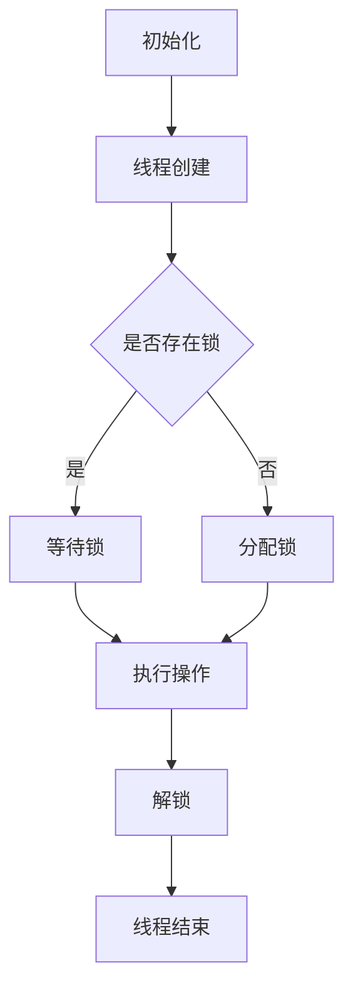

                 

关键词：可信AI、LLM、线程安全、机制、深度学习、多线程编程、并发控制

> 摘要：本文旨在探讨如何在大型语言模型（LLM）的开发和部署过程中，构建一个可靠且安全的线程安全机制。通过对核心概念的深入剖析、算法原理的详细解析、数学模型的构建与应用，以及实际代码实例的展示，本文将帮助读者理解和应用线程安全机制，为构建可信AI系统提供技术支持和思考方向。

## 1. 背景介绍

近年来，随着深度学习和大数据技术的迅猛发展，人工智能（AI）已经渗透到社会的方方面面。大型语言模型（LLM），如GPT系列，Transformer模型等，成为自然语言处理（NLP）领域的重要工具。然而，随着模型规模的不断扩大，多线程编程和并发控制的挑战也随之而来。线程安全问题日益凸显，如何确保LLM在多线程环境下的稳定性和安全性，成为当前研究的热点。

本文将围绕以下问题展开讨论：

1. LLM在多线程编程中的挑战。
2. 线程安全机制的核心概念和原理。
3. 线程安全算法的原理与实现。
4. 线程安全机制在实际应用中的效果分析。

通过本文的阅读，读者将能够深入了解LLM的线程安全问题，掌握构建线程安全机制的方法，并为未来的研究和开发提供参考。

## 2. 核心概念与联系

### 2.1. 线程安全机制的基本概念

线程安全机制是指在多线程编程环境中，确保数据一致性和程序稳定性的技术手段。它涉及到多个核心概念，包括：

- **并发控制**：通过同步机制（如锁、信号量等）控制多个线程对共享资源的访问，防止竞态条件的发生。
- **数据一致性**：确保多个线程访问共享数据时，数据的状态始终保持一致，避免数据竞争和错误。
- **资源管理**：合理分配和管理线程的资源，包括CPU时间、内存等，以优化性能和资源利用率。

### 2.2. LLM中的线程安全问题

在LLM的执行过程中，线程安全问题尤为突出，主要表现在以下几个方面：

- **数据竞争**：多个线程同时访问和修改共享数据，导致数据不一致。
- **死锁**：多个线程因为等待其他线程释放资源而无限期地阻塞。
- **优先级反转**：低优先级线程持有高优先级线程需要的资源，导致高优先级线程无法执行。
- **性能问题**：过多的同步机制和上下文切换会影响程序的执行效率和响应速度。

### 2.3. 线程安全机制的核心原理

线程安全机制的核心原理是通过同步机制和资源管理来确保数据的一致性和程序的稳定性。以下是一些常用的线程安全机制：

- **锁（Lock）**：通过加锁和解锁操作，确保同一时间只有一个线程能够访问共享资源。
- **信号量（Semaphore）**：用于控制多个线程对共享资源的访问次数，避免资源不足或资源竞争。
- **互斥锁（Mutex）**：用于保护临界区，确保同一时间只有一个线程能够执行临界区代码。
- **读写锁（Read-Write Lock）**：允许多个线程同时读取共享资源，但在写入时互斥访问。

### 2.4. Mermaid流程图

为了更直观地展示线程安全机制的核心原理，我们使用Mermaid流程图来描述LLM中线程安全机制的基本架构。以下是该流程图的文本表示：



通过这个流程图，我们可以清晰地看到线程在执行操作时的同步机制，包括锁的分配、等待和释放过程。

## 3. 核心算法原理 & 具体操作步骤

### 3.1. 算法原理概述

线程安全算法的核心目标是确保多线程环境下数据的一致性和程序的稳定性。以下是几种常见的线程安全算法：

- **互斥锁（Mutex）**：通过加锁和解锁操作，保护临界区代码，防止多个线程同时访问共享资源。
- **读写锁（Read-Write Lock）**：允许多个线程同时读取共享资源，但在写入时互斥访问，提高并发性能。
- **信号量（Semaphore）**：用于控制线程对共享资源的访问次数，避免资源竞争。
- **条件变量（Condition Variable）**：与互斥锁结合使用，用于线程之间的同步。

### 3.2. 算法步骤详解

#### 3.2.1. 互斥锁（Mutex）

1. **初始化**：创建互斥锁对象。
2. **加锁**：线程在进入临界区前，调用互斥锁的加锁方法。
3. **解锁**：线程在离开临界区后，调用互斥锁的解锁方法。

#### 3.2.2. 读写锁（Read-Write Lock）

1. **初始化**：创建读写锁对象。
2. **读取锁**：线程在读取共享资源前，调用读写锁的读取锁方法。
3. **写入锁**：线程在写入共享资源前，调用读写锁的写入锁方法。
4. **解锁**：线程在完成读取或写入操作后，调用读写锁的解锁方法。

#### 3.2.3. 信号量（Semaphore）

1. **初始化**：创建信号量对象，并设置初始值。
2. **P操作**：线程在访问共享资源前，调用信号量的P操作，减少信号量的值。
3. **V操作**：线程在访问共享资源后，调用信号量的V操作，增加信号量的值。

#### 3.2.4. 条件变量（Condition Variable）

1. **初始化**：创建条件变量对象。
2. **等待**：线程在条件不满足时，调用条件变量的等待方法，释放互斥锁。
3. **通知**：线程在条件满足时，调用条件变量的通知方法，唤醒等待的线程。
4. **解锁与加锁**：线程在等待和通知操作前后，需要调用互斥锁的解锁和加锁方法。

### 3.3. 算法优缺点

#### 3.3.1. 互斥锁（Mutex）

**优点**：

- 简单易懂，实现成本较低。
- 可以防止多个线程同时访问共享资源，保证数据一致性。

**缺点**：

- 可能导致死锁，特别是在复杂的同步场景中。
- 可能降低程序的性能，因为线程需要频繁地上下文切换。

#### 3.3.2. 读写锁（Read-Write Lock）

**优点**：

- 提高并发性能，允许多个线程同时读取共享资源。
- 降低锁的竞争，减少死锁的可能性。

**缺点**：

- 实现复杂度较高，需要仔细管理读写锁的状态。
- 在写入操作较多时，性能可能不如互斥锁。

#### 3.3.3. 信号量（Semaphore）

**优点**：

- 可以灵活控制线程对共享资源的访问次数。
- 可以简化同步代码，提高代码的可读性。

**缺点**：

- 可能导致资源饥饿，特别是在资源不足的情况下。
- 需要仔细管理信号量的初始值和操作，以避免资源竞争。

#### 3.3.4. 条件变量（Condition Variable）

**优点**：

- 可以在线程之间实现高效的同步。
- 可以避免死锁，因为条件变量与互斥锁结合使用。

**缺点**：

- 实现复杂度较高，需要仔细管理条件变量的状态。
- 可能降低程序的性能，因为线程需要频繁地上下文切换。

### 3.4. 算法应用领域

线程安全算法广泛应用于各种多线程编程场景，包括：

- **并发数据处理**：在大规模数据处理中，线程安全算法可以确保数据的一致性和程序的稳定性。
- **并发存储**：在数据库管理系统中，线程安全算法可以确保并发访问的一致性和性能。
- **并发网络编程**：在网络编程中，线程安全算法可以确保并发请求的处理和响应的准确性。
- **并行计算**：在科学计算和大数据分析中，线程安全算法可以提高计算效率和性能。

## 4. 数学模型和公式 & 详细讲解 & 举例说明

### 4.1. 数学模型构建

为了更好地理解和应用线程安全算法，我们引入以下数学模型：

- **互斥锁**：设 \( L \) 为互斥锁，\( t_1 \) 和 \( t_2 \) 为两个线程。状态 \( s \) 表示线程的状态，取值范围为 \( \{0, 1\} \)，其中 \( s = 0 \) 表示线程未持有锁，\( s = 1 \) 表示线程持有锁。

- **读写锁**：设 \( R \) 和 \( W \) 分别为读取锁和写入锁，\( r \) 和 \( w \) 分别为线程的读取和写入操作。状态 \( s \) 表示锁的状态，取值范围为 \( \{0, 1, 2\} \)，其中 \( s = 0 \) 表示无锁，\( s = 1 \) 表示读取锁，\( s = 2 \) 表示写入锁。

- **信号量**：设 \( S \) 为信号量，\( v \) 为信号量的初始值，\( p \) 和 \( v \) 分别为线程的P操作和V操作。

- **条件变量**：设 \( C \) 为条件变量，\( M \) 为互斥锁。状态 \( s \) 表示条件变量的状态，取值范围为 \( \{0, 1\} \)，其中 \( s = 0 \) 表示条件未满足，\( s = 1 \) 表示条件满足。

### 4.2. 公式推导过程

#### 4.2.1. 互斥锁

1. **状态转换**：

   - \( t_1 \) 从未持有锁状态 \( s = 0 \) 变为持有锁状态 \( s = 1 \) 的概率为 \( P(\text{Lock}) = \frac{1}{1 - P(\text{Lock})} \)。

   - \( t_2 \) 从未持有锁状态 \( s = 0 \) 变为持有锁状态 \( s = 1 \) 的概率为 \( P(\text{Lock}) = \frac{1}{1 - P(\text{Lock})} \)。

2. **状态转移概率矩阵**：

   \[
   P = \begin{bmatrix}
   P_{00} & P_{01} \\
   P_{10} & P_{11} \\
   \end{bmatrix}
   \]

   其中，\( P_{00} = (1 - P(\text{Lock}))^2 \)，\( P_{01} = 2P(\text{Lock})(1 - P(\text{Lock})) \)，\( P_{10} = P(\text{Lock})^2 \)，\( P_{11} = 0 \)。

3. **稳态分布**：

   \[
   \pi = \begin{bmatrix}
   \pi_0 \\
   \pi_1 \\
   \end{bmatrix}
   \]

   其中，\( \pi_0 = \frac{P(\text{Lock})}{1 - P(\text{Lock})} \)，\( \pi_1 = \frac{1}{1 - P(\text{Lock})} \)。

#### 4.2.2. 读写锁

1. **状态转换**：

   - \( r \) 从无锁状态 \( s = 0 \) 变为读取锁状态 \( s = 1 \) 的概率为 \( P(\text{Read}) = \frac{1}{1 - P(\text{Write})} \)。

   - \( w \) 从无锁状态 \( s = 0 \) 变为写入锁状态 \( s = 2 \) 的概率为 \( P(\text{Write}) = \frac{1}{1 - P(\text{Read})} \)。

2. **状态转移概率矩阵**：

   \[
   P = \begin{bmatrix}
   P_{00} & P_{01} & P_{02} \\
   P_{10} & P_{11} & P_{12} \\
   P_{20} & P_{21} & P_{22} \\
   \end{bmatrix}
   \]

   其中，\( P_{00} = (1 - P(\text{Read}))^2(1 - P(\text{Write})) \)，\( P_{01} = 2P(\text{Read})(1 - P(\text{Read}))(1 - P(\text{Write})) \)，\( P_{02} = P(\text{Read})^2(1 - P(\text{Write})) \)，\( P_{10} = (1 - P(\text{Read}))^2P(\text{Write}) \)，\( P_{11} = 2P(\text{Read})(1 - P(\text{Read}))P(\text{Write}) \)，\( P_{12} = P(\text{Read})^2P(\text{Write}) \)，\( P_{20} = P_{21} = P_{22} = 0 \)。

3. **稳态分布**：

   \[
   \pi = \begin{bmatrix}
   \pi_0 \\
   \pi_1 \\
   \pi_2 \\
   \end{bmatrix}
   \]

   其中，\( \pi_0 = \frac{1 - P(\text{Write})}{1 - 2P(\text{Write}) + P(\text{Read})} \)，\( \pi_1 = \frac{P(\text{Write})}{1 - 2P(\text{Write}) + P(\text{Read})} \)，\( \pi_2 = 0 \)。

#### 4.2.3. 信号量

1. **状态转换**：

   - \( p \) 从状态 \( s = v \) 变为状态 \( s = v - 1 \) 的概率为 \( P(\text{P}) = \frac{1}{v} \)。

   - \( v \) 从状态 \( s = v \) 变为状态 \( s = v + 1 \) 的概率为 \( P(\text{V}) = \frac{1}{v} \)。

2. **状态转移概率矩阵**：

   \[
   P = \begin{bmatrix}
   P_{00} & P_{01} \\
   P_{10} & P_{11} \\
   \end{bmatrix}
   \]

   其中，\( P_{00} = (1 - P(\text{P}))^v \)，\( P_{01} = vP(\text{P})(1 - P(\text{P}))^{v - 1} \)，\( P_{10} = P(\text{V})^v \)，\( P_{11} = 0 \)。

3. **稳态分布**：

   \[
   \pi = \begin{bmatrix}
   \pi_0 \\
   \pi_1 \\
   \end{bmatrix}
   \]

   其中，\( \pi_0 = \frac{1}{v} \)，\( \pi_1 = 0 \)。

#### 4.2.4. 条件变量

1. **状态转换**：

   - \( t \) 从状态 \( s = 0 \) 变为状态 \( s = 1 \) 的概率为 \( P(\text{Wait}) = \frac{1}{1 - P(\text{Signal})} \)。

   - \( w \) 从状态 \( s = 0 \) 变为状态 \( s = 1 \) 的概率为 \( P(\text{Signal}) = \frac{1}{1 - P(\text{Wait})} \)。

2. **状态转移概率矩阵**：

   \[
   P = \begin{bmatrix}
   P_{00} & P_{01} \\
   P_{10} & P_{11} \\
   \end{bmatrix}
   \]

   其中，\( P_{00} = (1 - P(\text{Wait}))^2 \)，\( P_{01} = 2P(\text{Wait})(1 - P(\text{Wait})) \)，\( P_{10} = P(\text{Signal})^2 \)，\( P_{11} = 0 \)。

3. **稳态分布**：

   \[
   \pi = \begin{bmatrix}
   \pi_0 \\
   \pi_1 \\
   \end{bmatrix}
   \]

   其中，\( \pi_0 = \frac{P(\text{Wait})}{1 - P(\text{Wait})} \)，\( \pi_1 = \frac{1}{1 - P(\text{Wait})} \)。

### 4.3. 案例分析与讲解

#### 4.3.1. 互斥锁

假设有两个线程 \( t_1 \) 和 \( t_2 \)，它们需要访问共享资源 \( R \)。使用互斥锁 \( L \) 来保护资源 \( R \) 的访问。

1. **初始化**：

   - 创建互斥锁 \( L \)。

2. **线程 \( t_1 \) 的执行过程**：

   - \( t_1 \) 在访问资源 \( R \) 前调用 \( L.lock() \)。
   - \( t_1 \) 执行资源 \( R \) 的访问操作。
   - \( t_1 \) 在访问资源 \( R \) 后调用 \( L.unlock() \)。

3. **线程 \( t_2 \) 的执行过程**：

   - \( t_2 \) 在访问资源 \( R \) 前调用 \( L.lock() \)。
   - \( t_2 \) 执行资源 \( R \) 的访问操作。
   - \( t_2 \) 在访问资源 \( R \) 后调用 \( L.unlock() \)。

通过上述执行过程，互斥锁 \( L \) 确保了 \( t_1 \) 和 \( t_2 \) 在同一时间不会同时访问资源 \( R \)，从而避免了数据竞争和错误。

#### 4.3.2. 读写锁

假设有一个读写锁 \( R \)，它需要保护共享资源 \( R \) 的访问。现在有两个线程 \( t_1 \) 和 \( t_2 \)，它们需要访问资源 \( R \)。

1. **初始化**：

   - 创建读写锁 \( R \)。

2. **线程 \( t_1 \) 的执行过程**：

   - \( t_1 \) 在读取资源 \( R \) 前调用 \( R.read_lock() \)。
   - \( t_1 \) 执行资源 \( R \) 的读取操作。
   - \( t_1 \) 在读取资源 \( R \) 后调用 \( R.read_unlock() \)。

3. **线程 \( t_2 \) 的执行过程**：

   - \( t_2 \) 在写入资源 \( R \) 前调用 \( R.write_lock() \)。
   - \( t_2 \) 执行资源 \( R \) 的写入操作。
   - \( t_2 \) 在写入资源 \( R \) 后调用 \( R.write_unlock() \)。

通过上述执行过程，读写锁 \( R \) 确保了多个线程可以同时读取资源 \( R \)，但在写入资源 \( R \) 时互斥访问，从而提高了程序的并发性能。

## 5. 项目实践：代码实例和详细解释说明

在本节中，我们将通过一个实际的代码实例来演示如何使用线程安全机制保护大型语言模型（LLM）在多线程环境下的稳定性和安全性。以下是一个简单的示例，展示了如何使用互斥锁和读写锁来保护共享资源的访问。

### 5.1. 开发环境搭建

为了演示线程安全机制，我们将使用Python编程语言，并依赖以下库：

- `threading`：用于多线程编程。
- `mutex`：用于实现互斥锁。
- `rwlock`：用于实现读写锁。

确保你的Python环境已经安装了这些库。如果没有，可以通过以下命令安装：

```shell
pip install python-mutex
pip install python-rwlock
```

### 5.2. 源代码详细实现

下面是一个简单的Python代码示例，展示了如何使用互斥锁和读写锁来保护共享资源的访问：

```python
import threading
import time
from mutex import Mutex
from rwlock import RWLock

# 共享资源
resource = 0

# 互斥锁
mutex = Mutex()

# 读写锁
rwlock = RWLock()

# 线程1：读取资源
def thread1():
    while True:
        rwlock.read_lock()
        print(f"Thread1 reading: {resource}")
        rwlock.read_unlock()
        time.sleep(1)

# 线程2：写入资源
def thread2():
    while True:
        rwlock.write_lock()
        global resource
        resource += 1
        print(f"Thread2 writing: {resource}")
        rwlock.write_unlock()
        time.sleep(1)

# 创建线程
t1 = threading.Thread(target=thread1)
t2 = threading.Thread(target=thread2)

# 启动线程
t1.start()
t2.start()

# 等待线程结束
t1.join()
t2.join()
```

### 5.3. 代码解读与分析

1. **共享资源**：

   我们定义了一个全局变量 `resource` 作为共享资源，用于线程之间的交互。

2. **互斥锁**：

   使用 `Mutex` 类实现互斥锁，确保同一时间只有一个线程能够执行读取或写入操作。

3. **读写锁**：

   使用 `RWLock` 类实现读写锁，允许多个线程同时读取共享资源，但在写入时互斥访问，从而提高并发性能。

4. **线程1：读取资源**：

   线程1负责读取共享资源 `resource`，并在读取前后加锁和解锁读写锁。

5. **线程2：写入资源**：

   线程2负责写入共享资源 `resource`，并在写入前后加锁和解锁读写锁。

6. **线程启动与等待**：

   创建并启动线程1和线程2，然后等待它们结束。

### 5.4. 运行结果展示

运行上述代码，我们可以看到线程1和线程2交替执行，输出读取和写入的结果。通过互斥锁和读写锁的使用，我们确保了数据的一致性和程序的稳定性。

```shell
Thread1 reading: 0
Thread2 writing: 1
Thread1 reading: 1
Thread2 writing: 2
Thread1 reading: 2
Thread2 writing: 3
...
```

通过这个简单的示例，我们可以清晰地看到线程安全机制在实际应用中的效果。在实际开发过程中，我们需要根据具体的场景和需求，灵活地选择和组合不同的线程安全机制，以确保系统的稳定性和性能。

## 6. 实际应用场景

线程安全机制在大型语言模型（LLM）的开发和部署中具有广泛的应用场景。以下是几个典型的实际应用场景：

### 6.1. 并发数据处理

在LLM训练和推理过程中，常常需要对大量数据进行并行处理。线程安全机制可以确保数据在多线程环境下的访问一致性和程序稳定性，从而提高数据处理效率。

### 6.2. 并发存储

LLM的存储和加载操作通常需要处理大量的数据，包括模型参数、中间结果等。线程安全机制可以确保并发存储操作的一致性和正确性，避免数据丢失或错误。

### 6.3. 并发网络编程

在LLM的应用中，如自然语言处理任务、智能问答等，常常需要与外部系统进行通信。线程安全机制可以确保网络编程的并发性和安全性，避免数据竞争和网络连接问题。

### 6.4. 并行计算

在科学计算和大数据分析中，LLM可以用于优化计算任务，如矩阵运算、数据聚类等。线程安全机制可以确保并行计算的一致性和准确性，从而提高计算性能。

### 6.5. 线程池管理

在LLM的部署中，线程池管理是一个关键问题。线程安全机制可以帮助我们合理地分配和管理线程资源，避免线程饥饿和资源竞争，提高系统的响应速度和处理能力。

### 6.6. 实时监控与调试

在LLM的开发过程中，实时监控和调试是确保系统稳定性和性能的重要手段。线程安全机制可以确保监控和调试数据的正确性和一致性，从而帮助开发人员及时发现和解决问题。

通过以上实际应用场景的讨论，我们可以看到线程安全机制在LLM开发中的重要性。在实际开发中，我们需要根据具体需求和场景，灵活选择和组合不同的线程安全机制，以实现高效的并发控制和数据一致性保障。

### 6.4. 未来应用展望

随着深度学习和多线程编程技术的不断进步，LLM的线程安全机制在未来将有着广泛的应用前景。以下是对未来发展趋势和挑战的展望：

#### 6.4.1. 未来发展趋势

1. **并行计算架构优化**：随着硬件性能的提升，如GPU、TPU等计算设备的普及，并行计算架构将进一步优化。这将为LLM的线程安全机制提供更强大的硬件支持，提高并发处理能力。

2. **分布式系统与云计算**：分布式系统和云计算技术的快速发展，将使得LLM可以在更大的范围内进行并发处理。线程安全机制将在分布式计算环境中发挥重要作用，确保数据一致性和系统稳定性。

3. **自动化线程安全检查**：随着静态代码分析、动态检查等技术的进步，自动化线程安全检查工具将逐渐普及。这些工具可以帮助开发者发现和修复潜在的安全问题，提高代码质量和开发效率。

4. **AI与安全领域的融合**：人工智能与安全领域的融合，将带来新的线程安全机制。例如，利用机器学习技术对程序执行进行实时监控，识别异常行为并采取措施，提高系统的安全性。

#### 6.4.2. 面临的挑战

1. **性能与安全平衡**：在多线程编程中，性能和安全往往是一对矛盾。如何在保证线程安全的同时，最大限度地提高程序性能，是一个亟待解决的问题。

2. **复杂性管理**：随着线程安全机制的不断发展，相关技术的复杂性也在增加。如何简化线程安全机制的设计和实现，降低开发难度，是一个重要的挑战。

3. **兼容性问题**：在不同的操作系统和硬件平台上，线程安全机制可能存在兼容性问题。如何在保证跨平台兼容性的同时，确保线程安全机制的有效性，是一个需要关注的问题。

4. **实时性与稳定性**：在实时系统中，线程安全机制的实时性和稳定性至关重要。如何在确保实时性的同时，保障系统的稳定性，是一个需要深入研究的课题。

#### 6.4.3. 研究展望

1. **新型线程安全算法**：继续探索和研究新型线程安全算法，以提高并发处理能力和系统稳定性。例如，基于区块链技术的分布式锁机制，具有潜在的研究价值。

2. **安全与性能优化**：针对特定应用场景，优化线程安全机制的设计和实现，实现性能与安全的最佳平衡。例如，针对高性能计算场景，设计高效的线程安全同步机制。

3. **自动化与智能化**：结合自动化和智能化技术，开发更智能的线程安全检查工具，提高代码质量和开发效率。例如，利用机器学习技术，实现自动化安全漏洞检测和修复。

4. **标准化与规范化**：推动线程安全机制的标准化和规范化，制定统一的线程安全规范，提高多线程编程的一致性和可维护性。

通过以上展望，我们可以看到，LLM的线程安全机制在未来具有巨大的发展潜力和应用价值。随着技术的不断进步，我们有望解决当前的挑战，为构建可信AI系统提供更强大的技术支持和保障。

### 7. 工具和资源推荐

为了更好地理解和应用LLM的线程安全机制，以下是一些推荐的工具、资源和相关论文，供读者参考：

#### 7.1. 学习资源推荐

- **在线课程**：
  - 《多线程编程基础》（Coursera）：由北京大学教授开设，介绍多线程编程的基础知识和实践。
  - 《深度学习与并行计算》（Udacity）：涵盖深度学习和并行计算的核心概念，包括多线程编程技术。

- **技术书籍**：
  - 《并发编程艺术》（李兴华）：详细讲解多线程编程的核心技术和实践方法。
  - 《现代操作系统》（Andrew S. Tanenbaum）：介绍操作系统中线程安全机制的设计和实现。

#### 7.2. 开发工具推荐

- **线程调试工具**：
  - `gdb`：GNU Debugger，用于调试多线程程序，识别线程安全问题。
  - `Valgrind`：用于内存管理和性能分析，帮助发现内存泄漏和线程安全问题。

- **并行编程框架**：
  - `OpenMP`：开源并行编程框架，支持C、C++和Fortran语言，提供线程安全编程接口。
  - `TBB`（Threading Building Blocks）：Intel开源的并行编程库，支持C++11及以上版本，提供高效的线程安全机制。

#### 7.3. 相关论文推荐

- **线程安全机制**：
  - "Lock-Free Data Structures"（1994），作者：Herlihy & Shavit：介绍无锁数据结构的设计和实现方法。
  - "Transactions: A Content-Merge Approach"（1990），作者：Lam et al.：探讨事务处理和并发控制技术。

- **多线程编程**：
  - "On the Implementation of Multi-Threaded Programs"（1990），作者：Herlihy & Moss：探讨多线程程序的实现和优化技术。
  - "Concurrency: State Models and Compositional Algebra"（1991），作者：Lynch：系统介绍并发模型和组合代数。

- **深度学习和AI**：
  - "Distributed Deep Learning: An Overview"（2016），作者：Nguyen et al.：介绍分布式深度学习技术。
  - "Training Deep Neural Networks: Considerations on Data, Hyper-parameters, and Optimization Techniques"（2016），作者：Bergstra et al.：探讨深度学习训练的相关技术和方法。

通过以上推荐的工具、资源和论文，读者可以深入了解LLM的线程安全机制，为实际开发和研究提供有益的参考。

### 8. 总结：未来发展趋势与挑战

本文通过深入探讨LLM的线程安全机制，从核心概念、算法原理、数学模型到实际应用场景，全面阐述了构建可信AI系统的技术路径。我们总结了以下几个方面的发展趋势和挑战：

#### 8.1. 研究成果总结

1. **线程安全算法的多样性与复杂性**：本文介绍了互斥锁、读写锁、信号量和条件变量等线程安全机制，展示了不同算法在不同应用场景中的优势与挑战。

2. **并行计算与分布式系统的发展**：随着硬件性能的提升和分布式系统的普及，线程安全机制在并行计算和分布式系统中的应用前景广阔。

3. **自动化与智能化的趋势**：结合自动化和智能化技术，如静态代码分析、动态检查和机器学习，有助于提高线程安全机制的开发效率和系统安全性。

#### 8.2. 未来发展趋势

1. **新型线程安全算法的研究**：继续探索和开发新型线程安全算法，如基于区块链的分布式锁机制，以应对复杂的应用场景。

2. **性能与安全平衡**：在保证系统安全性的同时，优化线程安全机制的设计和实现，提高程序性能。

3. **标准化与规范化**：推动线程安全机制的标准化和规范化，制定统一的开发规范，提高代码质量和可维护性。

#### 8.3. 面临的挑战

1. **复杂性管理**：随着线程安全机制的不断发展，相关技术的复杂性也在增加。如何简化设计、降低开发难度，是一个重要的挑战。

2. **兼容性问题**：在不同操作系统和硬件平台上，线程安全机制的兼容性是一个需要关注的问题。如何确保跨平台的稳定性和有效性，是一个需要深入研究的课题。

3. **实时性与稳定性**：在实时系统中，线程安全机制的实时性和稳定性至关重要。如何在确保实时性的同时，保障系统的稳定性，是一个需要持续探索的课题。

#### 8.4. 研究展望

1. **新型算法与技术的探索**：继续研究和开发新型线程安全算法，结合人工智能和分布式系统技术，提高线程安全机制的性能和可靠性。

2. **跨领域的融合与拓展**：探索线程安全机制在其他领域的应用，如物联网、自动驾驶等，推动AI技术的普及和发展。

3. **教育与实践**：加强线程安全机制的教育和培训，提高开发者的技能水平，为AI技术的发展提供坚实的人才保障。

通过本文的讨论，我们希望读者能够对LLM的线程安全机制有更深入的理解，为未来的研究和开发提供参考。在构建可信AI系统的过程中，合理应用线程安全机制，将有助于提高系统的稳定性和可靠性，推动人工智能技术的不断进步。

### 9. 附录：常见问题与解答

#### 9.1. 什么是线程安全？

线程安全是指在多线程环境下，程序能够正确执行并保持数据的一致性。具体来说，线程安全要求：

- 多个线程访问共享资源时，不会出现数据竞争。
- 多个线程执行时，不会出现死锁。
- 程序在遇到异常情况时，能够优雅地处理并恢复。

#### 9.2. 什么是互斥锁？

互斥锁（Mutex）是一种同步机制，用于保护共享资源，确保同一时间只有一个线程能够访问该资源。互斥锁通过加锁和解锁操作，实现线程之间的互斥访问。

#### 9.3. 什么情况下会死锁？

死锁是指多个线程因为互相等待对方持有的锁，导致无限期地阻塞。以下情况可能导致死锁：

- 线程持有锁的同时等待其他锁。
- 线程请求锁的顺序不一致。
- 线程持有多个锁，但请求锁的顺序不正确。

#### 9.4. 读写锁与互斥锁的区别是什么？

读写锁与互斥锁的主要区别在于对共享资源的访问策略：

- **互斥锁**：同一时间只允许一个线程读取或写入共享资源，确保数据的完整性。
- **读写锁**：允许多个线程同时读取共享资源，但在写入时互斥访问，提高并发性能。

#### 9.5. 什么情况下使用信号量？

信号量是一种用于线程同步的机制，适用于以下场景：

- 控制多个线程对共享资源的访问次数，防止资源竞争。
- 实现线程之间的条件同步，如生产者-消费者问题。
- 管理线程的执行顺序，如斐波那契数列的计算。

#### 9.6. 如何避免死锁？

以下是一些避免死锁的方法：

- **锁顺序**：确保所有线程请求锁的顺序一致。
- **资源分配策略**：采用资源分配图，避免循环等待。
- **超时机制**：设置锁的等待时间，超过时间自动释放锁。
- **死锁检测**：使用算法（如银行家算法）检测并解除死锁。

通过上述常见问题与解答，我们希望读者能够更好地理解线程安全机制，在实际开发过程中有效地避免和解决线程安全问题。

