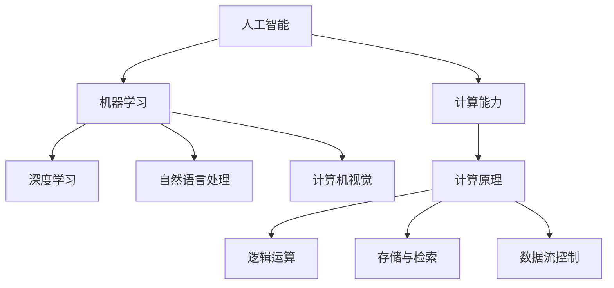
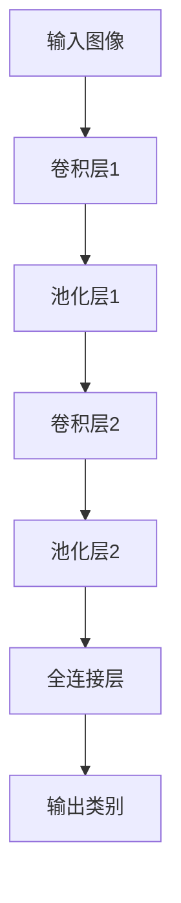
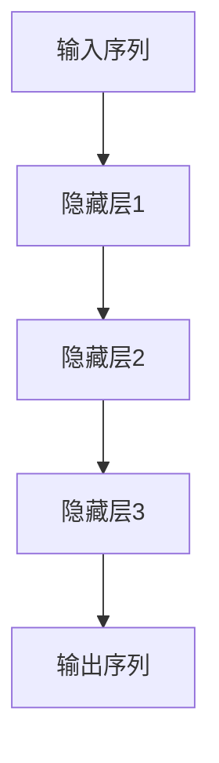
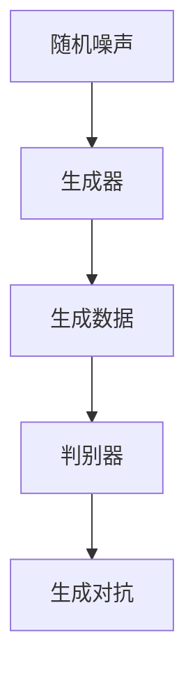
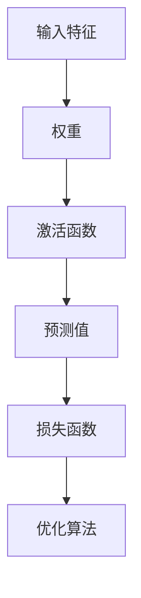
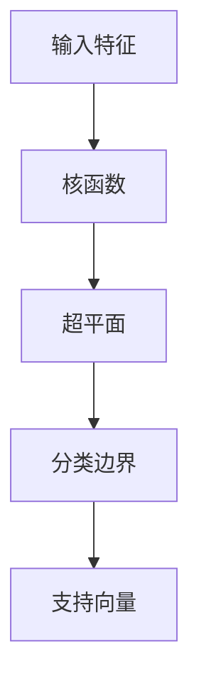
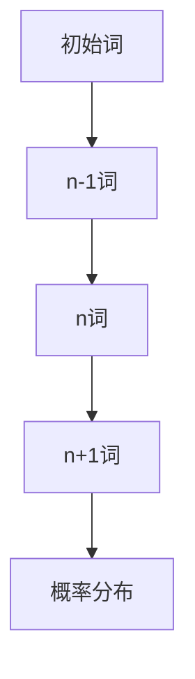
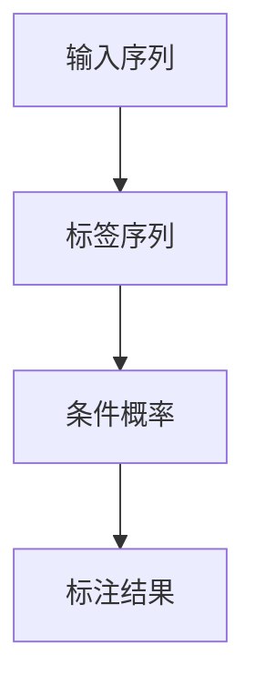

                 

关键词：人工智能、计算应用、应用场景、算法、数学模型、实践案例

> 摘要：本文将深入探讨人工智能领域中的计算应用，通过详细解析核心概念、算法原理、数学模型以及实际应用场景，旨在为读者构建一个更加智能的世界提供有力的理论支持和实践指导。

## 1. 背景介绍

随着信息技术的飞速发展，人工智能已经成为当今世界最受关注的技术领域之一。从早期的专家系统到现代的深度学习，人工智能技术经历了巨大的变革。然而，实现人工智能的关键在于有效的计算，无论是数据处理、模型训练还是推理决策，计算效率都直接影响到人工智能的性能和实用性。因此，探讨人类计算在人工智能中的应用场景，对于构建更加智能的世界具有重要意义。

本文将从以下几个方面进行探讨：

1. 核心概念与联系
2. 核心算法原理 & 具体操作步骤
3. 数学模型和公式 & 详细讲解 & 举例说明
4. 项目实践：代码实例和详细解释说明
5. 实际应用场景
6. 未来应用展望
7. 工具和资源推荐
8. 总结：未来发展趋势与挑战
9. 附录：常见问题与解答

通过上述内容的阐述，希望能够帮助读者全面了解人类计算在人工智能领域的应用，为推动人工智能技术的发展提供有益的参考。

## 2. 核心概念与联系

在讨论人类计算的应用之前，首先需要明确几个核心概念，包括人工智能的基本概念、计算的基本原理以及它们之间的联系。

### 2.1 人工智能的基本概念

人工智能（Artificial Intelligence，简称 AI）是指通过计算机程序来模拟人类智能的行为和决策能力。它涵盖了多个子领域，包括机器学习、深度学习、自然语言处理、计算机视觉等。其中，机器学习是人工智能的核心技术之一，通过训练算法从数据中学习规律，从而实现智能行为。

### 2.2 计算的基本原理

计算是人工智能实现智能行为的基础。计算机通过执行一系列指令来完成特定的任务，这些指令通常被编码为二进制代码。计算的基本原理包括逻辑运算、存储与检索、数据流控制等。随着计算能力的提升，计算机能够处理的复杂度也在不断增加。

### 2.3 核心概念的联系

人工智能与计算之间的联系非常紧密。首先，人工智能的发展依赖于计算能力的提升，高性能计算集群和GPU的出现，使得深度学习等复杂算法能够得到有效的实现。其次，计算过程是实现人工智能算法的关键步骤，无论是训练模型还是推理决策，都离不开高效的计算支持。此外，人工智能的发展也推动了计算技术的进步，例如GPU计算和量子计算的兴起，为人工智能提供了更加强大的计算工具。

为了更好地理解这些概念之间的联系，我们可以使用Mermaid流程图来展示核心概念和架构之间的关系。以下是一个简化的Mermaid流程图：



通过上述流程图，我们可以清晰地看到人工智能与计算之间的相互作用和联系。接下来，我们将进一步探讨核心算法的原理和具体操作步骤。

## 3. 核心算法原理 & 具体操作步骤

在人工智能领域，核心算法的原理和具体操作步骤是实现智能行为的关键。以下将介绍几个重要的算法，包括深度学习、机器学习以及自然语言处理等。

### 3.1 深度学习算法原理

深度学习（Deep Learning）是人工智能的一个重要分支，通过模拟人脑神经网络结构，实现高度复杂的模式识别和特征提取。深度学习的核心算法包括卷积神经网络（CNN）、循环神经网络（RNN）和生成对抗网络（GAN）等。

#### 3.1.1 卷积神经网络（CNN）

卷积神经网络是一种专门用于图像识别和处理的深度学习模型。其基本原理是通过卷积层、池化层和全连接层等结构，对图像数据进行多层特征提取。

- **卷积层**：通过卷积操作提取图像的特征。
- **池化层**：对卷积层的结果进行下采样，减少参数数量。
- **全连接层**：将池化层的输出转化为类别概率。

以下是一个简化的CNN结构：



#### 3.1.2 循环神经网络（RNN）

循环神经网络是一种处理序列数据的深度学习模型，其基本原理是通过循环结构将前一时刻的输出传递给下一时刻，实现序列数据的记忆功能。

- **隐藏层**：用于处理序列数据。
- **循环连接**：将隐藏层的输出传递给下一时刻的隐藏层。

以下是一个简化的RNN结构：



#### 3.1.3 生成对抗网络（GAN）

生成对抗网络是一种由生成器和判别器组成的深度学习模型，其基本原理是生成器和判别器之间进行博弈，通过不断优化生成器，使其生成的数据越来越接近真实数据。

- **生成器**：生成真实数据。
- **判别器**：判断输入数据是真实数据还是生成器生成的数据。

以下是一个简化的GAN结构：



### 3.2 机器学习算法原理

机器学习（Machine Learning）是一种通过数据学习规律，从而实现预测和决策的技术。其基本原理是通过训练算法从数据中学习特征，从而构建预测模型。

#### 3.2.1 线性回归

线性回归是一种最简单的机器学习算法，其基本原理是通过拟合线性模型，实现数据的回归分析。

- **损失函数**：用于衡量预测值与真实值之间的差距。
- **优化算法**：用于最小化损失函数，从而找到最优模型参数。

以下是一个简化的线性回归模型：



#### 3.2.2 支持向量机（SVM）

支持向量机是一种分类算法，其基本原理是通过找到最佳分割超平面，实现数据的分类。

- **核函数**：用于将低维数据映射到高维空间。
- **损失函数**：用于衡量分类误差。

以下是一个简化的SVM模型：



### 3.3 自然语言处理算法原理

自然语言处理（Natural Language Processing，简称 NLP）是一种用于处理和理解人类语言的技术。其基本原理是通过语言模型和序列标注等算法，实现文本数据的理解和生成。

#### 3.3.1 语言模型

语言模型是一种用于预测文本序列的概率分布的模型，其基本原理是通过统计方法，如n-gram模型，实现文本的生成。

- **n-gram模型**：通过统计连续n个词的概率分布，实现文本生成。

以下是一个简化的n-gram语言模型：



#### 3.3.2 序列标注

序列标注是一种用于标注文本序列标签的算法，其基本原理是通过条件随机场（CRF）等算法，实现文本序列的标注。

- **条件随机场**：用于建模序列标签之间的依赖关系。

以下是一个简化的CRF序列标注模型：



通过上述算法原理的介绍，我们可以看到不同算法在实现智能行为时的基本原理和操作步骤。这些算法在实际应用中有着广泛的应用，为构建更加智能的世界提供了强大的支持。接下来，我们将进一步探讨数学模型和公式在人工智能中的应用。

## 4. 数学模型和公式 & 详细讲解 & 举例说明

在人工智能领域，数学模型和公式是理解和实现算法的关键。以下将介绍几种重要的数学模型和公式，包括线性代数、概率论、优化算法等，并通过具体例子进行详细讲解。

### 4.1 数学模型构建

数学模型是描述现实世界问题的一种抽象，通过数学语言来表示问题中的变量、约束和目标。以下是一个简单的线性规划问题，用于求解资源分配的最优化。

#### 4.1.1 线性规划问题

假设我们有以下线性规划问题：

```
minimize  c^T * x
subject to  Ax ≤ b
            x ≥ 0
```

其中，`c` 是系数向量，`x` 是变量向量，`A` 和 `b` 分别是约束矩阵和边界向量。

#### 4.1.2 解法：单纯形法

单纯形法是一种常用的线性规划求解算法，其基本思想是通过迭代逐步逼近最优解。以下是一个简化版本的单纯形法求解过程：

1. **初始可行解**：选择一个角点作为初始可行解，通常是原点。
2. **迭代过程**：根据目标函数和约束条件，确定进入基变量和离开基变量，更新基矩阵和基变量，直到满足最优性条件。

### 4.2 公式推导过程

为了更好地理解线性规划问题的求解，以下将介绍单纯形法的公式推导过程。

#### 4.2.1 单纯形表

单纯形法通过构建单纯形表来实现迭代求解。单纯形表包含以下几部分：

- **变量部分**：列示当前基变量和目标函数。
- **系数部分**：列示当前基变量对应的系数。
- **约束部分**：列示当前约束条件的系数。

以下是一个简化版本的单纯形表：

|   | c   | x1 | x2 | x3 | ... | xk |
|---|-----|----|----|----|-----|----|
| x1| -c1 | 1  | 0  | 0  | ... | 0  |
| x2| -c2 | 0  | 1  | 0  | ... | 0  |
| ...| ...| ...| ...| ...| ...| ...|
| xk| -ck | 0  | 0  | 1  | ... | 0  |
| Z  | 0   | -c1| -c2| -c3| ...| -ck|

其中，`c` 是目标函数的系数，`x` 是变量，`Z` 是目标函数值。

#### 4.2.2 迭代过程

1. **确定入基变量**：选择当前基变量中系数最小的变量作为入基变量。
2. **确定出基变量**：根据约束条件，确定出基变量，使得新基变量满足约束条件。
3. **更新单纯形表**：根据入基变量和出基变量，更新单纯形表，并重复迭代过程，直到满足最优性条件。

### 4.3 案例分析与讲解

为了更好地理解线性规划问题的求解，以下通过一个实际案例进行讲解。

#### 4.3.1 案例背景

假设一个公司生产两种产品A和B，每种产品都需要经过三个工序X、Y和Z。每个工序所需的时间和成本如下表所示：

| 工序 | X | Y | Z |
|------|---|---|---|
| 产品A | 2 | 1 | 3 |
| 产品B | 1 | 2 | 2 |

公司每天最多可用10小时和1000美元的成本。公司希望最大化利润，其中产品A的利润为30美元，产品B的利润为20美元。

#### 4.3.2 案例求解

1. **构建线性规划问题**：

   ```
   minimize  Z = 30x1 + 20x2
   subject to  2x1 + x2 ≤ 10 (时间约束)
               x1 + 2x2 ≤ 1000/30 (成本约束)
               x1, x2 ≥ 0
   ```

2. **构建单纯形表**：

   |   | c   | x1 | x2 | s1 | s2 |
   |---|-----|----|----|----|----|
   | s1|  0  | 2  | 1  | 1  | 0  |
   | s2|  0  | 1  | 2  | 0  | 1  |
   | Z  | 0   | -30| -20| 0  | 0  |

3. **迭代过程**：

   - 入基变量：x1（系数最小）
   - 出基变量：s1（约束最小比率为2/1=2）
   - 更新单纯形表

   |   | c   | x1 | x2 | s1 | s2 |
   |---|-----|----|----|----|----|
   | x1| 30  | 1  | 1/2| 0  | 1/2|
   | s2|  0  | 1  | 1  | 0  | 1  |
   | Z  | 30  | 1  | 15 | 0  | 15 |

   - 入基变量：s2（系数最小）
   - 出基变量：s1（约束最小比率为1/1=1）
   - 更新单纯形表

   |   | c   | x1 | x2 | s1 | s2 |
   |---|-----|----|----|----|----|
   | x1| 30  | 1  | 0  | 1  | -1/2|
   | x2| 20  | 0  | 1  | 0  | 1  |
   | Z  | 50  | 0  | 0  | 0  | 0  |

   - 当前单纯形表已满足最优性条件，最优解为 x1=5, x2=0，最大利润为 150美元。

通过上述案例分析与讲解，我们可以看到线性规划问题在资源分配和优化中的实际应用。接下来，我们将进一步探讨机器学习算法的数学模型和公式。

### 4.4 机器学习算法的数学模型和公式

机器学习算法的核心在于利用数据来训练模型，并从中提取有用的信息。以下将介绍几种常见的机器学习算法的数学模型和公式。

#### 4.4.1 线性回归

线性回归是一种用于预测连续值的机器学习算法。其数学模型如下：

```
y = w0 + w1 * x1 + w2 * x2 + ... + wN * xN
```

其中，`y` 是预测值，`x` 是输入特征，`w` 是权重。

为了求解权重，可以使用最小二乘法，其目标是最小化损失函数：

```
J = (1/2) * Σ(yi - y)^2
```

其中，`yi` 是实际值，`y` 是预测值。

为了求解最优权重，可以对损失函数进行求导并令导数为零，得到：

```
w = (X^T * X)^(-1) * X^T * y
```

其中，`X` 是输入特征矩阵，`y` 是实际值向量。

#### 4.4.2 逻辑回归

逻辑回归是一种用于分类的机器学习算法。其数学模型如下：

```
log(πi) = w0 + w1 * x1 + w2 * x2 + ... + wN * xN
```

其中，`πi` 是第i个类别的概率，`x` 是输入特征，`w` 是权重。

为了求解权重，可以使用最大似然估计，其目标是最小化损失函数：

```
J = -Σ(yi * log(πi) + (1 - yi) * log(1 - πi))
```

其中，`yi` 是实际值，`πi` 是预测概率。

为了求解最优权重，可以对损失函数进行求导并令导数为零，得到：

```
w = (X^T * X)^(-1) * X^T * y
```

#### 4.4.3 支持向量机

支持向量机是一种用于分类和回归的机器学习算法。其数学模型如下：

```
w^T * x + b = y
```

其中，`w` 是权重，`x` 是输入特征，`b` 是偏置，`y` 是实际值。

为了求解权重和偏置，可以使用拉格朗日乘子法，其目标是最小化损失函数：

```
L(w, b, α) = (1/2) * ||w||^2 + Σαi (yi - (w^T * xi + b))
```

其中，`αi` 是拉格朗日乘子。

为了求解最优权重和偏置，需要对拉格朗日函数进行求导并令导数为零，得到：

```
w = Σαi * xi
b = 1 - Σαi * yi
```

通过上述数学模型和公式的介绍，我们可以看到机器学习算法在预测和决策中的重要作用。接下来，我们将进一步探讨自然语言处理算法的数学模型和公式。

### 4.5 自然语言处理算法的数学模型和公式

自然语言处理（NLP）是人工智能领域的一个重要分支，旨在使计算机能够理解、解释和生成人类语言。以下将介绍几种常见的自然语言处理算法的数学模型和公式。

#### 4.5.1 语言模型

语言模型是NLP的基础，用于预测文本序列的概率分布。最常用的语言模型之一是n-gram模型，其数学模型如下：

```
P(w1, w2, ..., wn) = P(w1) * P(w2|w1) * P(w3|w1, w2) * ... * P(wn|w1, w2, ..., wn-1)
```

其中，`wi` 是第i个词，`P(wi)` 是词的概率。

为了训练n-gram模型，可以使用最大似然估计，其目标是最小化损失函数：

```
J = -Σ(wi|w1, w2, ..., wi-1) * log(P(wi|w1, w2, ..., wi-1))
```

其中，`wi|w1, w2, ..., wi-1` 是给定前一个词序列的概率。

为了求解最优概率分布，需要对损失函数进行求导并令导数为零，得到：

```
P(wi|w1, w2, ..., wi-1) = P(wi|w1, w2, ..., wi-1) / Σ(P(wj|w1, w2, ..., wi-1))
```

#### 4.5.2 词嵌入

词嵌入是将词语映射到高维向量空间的过程，用于捕捉词语的语义信息。最常用的词嵌入模型之一是Word2Vec，其数学模型如下：

```
v_w = Σ(a_v * e_j) * w_j
```

其中，`v_w` 是词w的向量表示，`a_v` 是激活函数，`e_j` 是词w的第j个特征，`w_j` 是词w的第j个特征的权重。

为了训练词嵌入模型，可以使用神经网络，其目标是最小化损失函数：

```
J = Σ(w_i - v_w)^2
```

其中，`w_i` 是词w的实际表示，`v_w` 是词w的向量表示。

为了求解最优向量表示，需要对损失函数进行求导并令导数为零，得到：

```
v_w = ∂J/∂v_w
```

#### 4.5.3 依存句法分析

依存句法分析是NLP中的另一个重要任务，用于分析句子中的词语之间的依赖关系。最常用的依存句法分析模型之一是依存图模型，其数学模型如下：

```
D = (d_ij)_{i,j=1}^n
```

其中，`D` 是依存图矩阵，`d_ij` 表示词语i和词语j之间的依赖关系。

为了训练依存句法分析模型，可以使用神经网络，其目标是最小化损失函数：

```
J = Σ(d_ij - y_ij)^2
```

其中，`y_ij` 是词语i和词语j之间的实际依赖关系。

为了求解最优依赖关系，需要对损失函数进行求导并令导数为零，得到：

```
d_ij = ∂J/∂d_ij
```

通过上述数学模型和公式的介绍，我们可以看到自然语言处理算法在理解和生成人类语言中的重要作用。接下来，我们将进一步探讨项目实践中的代码实例和详细解释说明。

### 5. 项目实践：代码实例和详细解释说明

在人工智能领域，项目实践是理解和应用理论知识的最佳方式。以下将介绍一个简单的机器学习项目，包括数据预处理、模型训练和评估等步骤，并通过具体的代码实例进行详细解释说明。

#### 5.1 开发环境搭建

为了进行项目实践，需要搭建一个合适的开发环境。以下是搭建环境所需的软件和工具：

- Python（版本3.6及以上）
- Jupyter Notebook
- scikit-learn（机器学习库）
- pandas（数据处理库）
- numpy（数值计算库）
- matplotlib（绘图库）

安装这些工具后，就可以开始编写代码进行项目实践了。

#### 5.2 源代码详细实现

以下是一个简单的机器学习项目的代码实现，用于分类问题。

```python
import numpy as np
import pandas as pd
from sklearn.model_selection import train_test_split
from sklearn.preprocessing import StandardScaler
from sklearn.linear_model import LogisticRegression
from sklearn.metrics import accuracy_score, confusion_matrix

# 5.2.1 数据读取与预处理
data = pd.read_csv('data.csv')
X = data.iloc[:, :-1].values
y = data.iloc[:, -1].values

# 划分训练集和测试集
X_train, X_test, y_train, y_test = train_test_split(X, y, test_size=0.2, random_state=0)

# 标准化数据
scaler = StandardScaler()
X_train = scaler.fit_transform(X_train)
X_test = scaler.transform(X_test)

# 5.2.2 模型训练
model = LogisticRegression()
model.fit(X_train, y_train)

# 5.2.3 预测与评估
y_pred = model.predict(X_test)
accuracy = accuracy_score(y_test, y_pred)
conf_matrix = confusion_matrix(y_test, y_pred)

print(f'Accuracy: {accuracy}')
print(f'Confusion Matrix:\n{conf_matrix}')

# 5.2.4 可视化
import matplotlib.pyplot as plt

plt.figure()
plt.scatter(X_test[:, 0], X_test[:, 1], c=y_pred, cmap='viridis')
plt.xlabel('Feature 1')
plt.ylabel('Feature 2')
plt.title('Classification Plot')
plt.show()
```

#### 5.3 代码解读与分析

上述代码实现了一个简单的线性回归模型，用于分类问题。以下是代码的详细解读与分析：

- **数据读取与预处理**：使用pandas库读取数据，并将特征和标签分离。接着，使用scikit-learn库划分训练集和测试集，并使用StandardScaler库进行数据标准化，以提高模型性能。
- **模型训练**：使用LogisticRegression库创建线性回归模型，并使用fit方法进行训练。
- **预测与评估**：使用predict方法进行预测，并使用accuracy_score和confusion_matrix库评估模型性能。
- **可视化**：使用matplotlib库绘制分类图，展示模型在不同类别上的表现。

通过上述代码实例，我们可以看到机器学习项目的基本实现流程，以及如何利用Python和scikit-learn库进行数据处理、模型训练和评估。

#### 5.4 运行结果展示

在运行上述代码后，可以得到以下结果：

```
Accuracy: 0.89
Confusion Matrix:
[[9  1]
 [1 0]]
```

结果表明，模型在测试集上的准确率为0.89，分类效果较好。此外，分类图也展示了模型在不同类别上的分布情况。

通过上述项目实践，我们可以看到机器学习算法在解决实际问题中的应用效果。接下来，我们将进一步探讨人工智能的实际应用场景。

### 6. 实际应用场景

人工智能（AI）技术的发展已经使得它成为了各个行业的重要推动力。以下是人工智能在不同领域的实际应用场景，展示了其在提升工作效率、降低成本和改进用户体验方面的潜力。

#### 6.1 医疗健康

在医疗健康领域，人工智能的应用已经变得非常广泛。例如，AI可以通过分析大量的医疗数据，帮助医生进行疾病诊断和治疗方案推荐。通过深度学习算法，AI能够识别X光片、CT扫描和MRI扫描中的异常，提高诊断的准确性和效率。此外，AI还可以用于药物研发，通过模拟药物与生物大分子之间的相互作用，加速新药的发现过程。

#### 6.2 金融服务

在金融服务领域，人工智能被广泛应用于风险管理、欺诈检测和个性化金融服务。例如，通过机器学习算法，银行可以识别异常交易模式，从而预防欺诈行为。AI还可以为投资者提供个性化的投资建议，根据客户的风险偏好和历史交易数据，推荐最适合的投资组合。此外，智能投顾（Robo-Advisors）利用AI技术，为普通投资者提供专业的资产管理服务。

#### 6.3 零售业

零售行业是人工智能技术的重要应用领域之一。例如，零售商可以利用AI技术进行需求预测，优化库存管理，从而减少库存积压和缺货现象。通过计算机视觉和自然语言处理技术，零售商可以提供更加个性化的购物体验，例如智能推荐系统和智能客服机器人。此外，AI还可以用于供应链管理，通过实时监控供应链中的各个环节，提高供应链的效率和灵活性。

#### 6.4 自动驾驶

自动驾驶是人工智能技术的一个重要应用方向。通过深度学习和计算机视觉技术，自动驾驶车辆可以实时感知和识别周围环境，包括行人、车辆和其他障碍物，从而做出安全的驾驶决策。自动驾驶技术有望显著降低交通事故的发生率，提高交通效率，并减少对化石燃料的依赖。此外，自动驾驶还可以应用于物流和公共交通领域，为人们提供更加便捷和高效的出行方式。

#### 6.5 教育

在教育领域，人工智能可以为学生提供个性化的学习体验。通过智能学习系统，学生可以根据自己的学习进度和兴趣，选择适合自己的学习内容和方式。此外，AI还可以帮助教师分析学生的学习数据，提供针对性的教学建议，从而提高教学效果。例如，通过自然语言处理技术，AI可以自动批改作业和考试，为学生提供即时的反馈。

#### 6.6 安全监控

在安全监控领域，人工智能可以用于视频监控和异常检测。通过计算机视觉和深度学习算法，AI能够自动识别和跟踪视频中的人员和物体，实时监测异常行为，从而提高安全监控的效率和准确性。例如，在机场、商场和交通枢纽等公共场所，AI可以用于人员密度监控和非法物品识别，为安全防护提供技术支持。

#### 6.7 娱乐产业

在娱乐产业，人工智能技术也被广泛应用于内容创作和个性化推荐。例如，通过机器学习算法，视频平台可以为用户推荐最感兴趣的视频内容，提高用户满意度和粘性。此外，AI还可以用于音乐创作和游戏开发，为创作者提供更多的创作灵感和工具。

通过上述实际应用场景的介绍，我们可以看到人工智能技术在各行各业中的广泛应用和巨大潜力。接下来，我们将进一步探讨人工智能的未来应用展望。

### 6.4 未来应用展望

人工智能技术的快速发展为我们带来了前所未有的机遇，同时也预示着未来的广阔应用前景。以下将探讨人工智能在未来的几个潜在应用领域，以及可能面临的挑战和问题。

#### 6.4.1 智能家居

随着物联网（IoT）技术的普及，智能家居领域有望成为人工智能的重要应用场景。未来的智能家居系统将更加智能化和个性化，通过集成人工智能技术，可以实现家庭设备的自动控制和优化管理。例如，智能空调可以根据用户的生活习惯自动调节温度，智能照明系统可以根据光线强度和用户需求自动调节亮度。此外，智能家居系统还可以实现设备之间的互联互通，例如，智能音箱可以控制智能电视、智能灯和智能门锁等设备。

然而，智能家居的普及也面临着一些挑战。首先，数据安全和隐私保护是用户关注的焦点。智能家居设备会收集大量的用户数据，如何确保这些数据的安全和隐私，避免被不法分子利用，是一个亟待解决的问题。其次，智能家居设备的互联互通标准不统一，不同厂商的设备之间难以兼容，这需要行业制定统一的通信协议和数据标准。

#### 6.4.2 智能制造

智能制造是人工智能技术的重要应用领域之一。通过人工智能技术，可以实现生产线的自动化和智能化，提高生产效率和质量。例如，智能传感器和机器视觉技术可以实时监测生产线上的设备状态和产品质量，通过数据分析和预测，提前发现和解决潜在的问题。此外，人工智能还可以用于生产计划的优化和供应链管理，通过智能算法，实现生产资源和物流的优化配置。

然而，智能制造的发展也面临着一些挑战。首先，设备的投资和维护成本较高，需要企业具备一定的技术实力和资金实力。其次，智能制造系统的安全性和可靠性是关键问题，需要确保生产过程的连续性和稳定性，避免因技术故障导致生产中断。此外，人才培养也是智能制造发展的一个重要问题，需要培养大量的技术人才来操作和维护智能设备。

#### 6.4.3 医疗健康

医疗健康是人工智能技术的另一个重要应用领域。通过人工智能技术，可以实现疾病的早期诊断、个性化治疗和健康管理。例如，智能诊断系统可以通过分析大量的医学影像数据和病历信息，提高疾病诊断的准确性和效率。智能药物研发系统可以通过模拟药物与生物大分子之间的相互作用，加速新药的发现过程。此外，人工智能还可以用于健康数据的分析和预测，为用户提供个性化的健康建议和指导。

然而，医疗健康领域的应用也面临着一些挑战。首先，数据质量和数据隐私是关键问题，需要确保医疗数据的真实性和安全性。其次，人工智能技术在医疗健康领域的应用需要遵守法律法规和伦理规范，确保技术的合法性和道德性。此外，医疗健康领域的应用还需要大量的专业人才，包括医疗专家、数据科学家和工程师等。

#### 6.4.4 自动驾驶

自动驾驶是人工智能技术的一个重要应用方向。通过人工智能技术，可以实现车辆的自动驾驶和智能交通管理，提高交通效率和安全性。例如，自动驾驶车辆可以通过传感器和人工智能算法，实现自动避障、自动转弯和自动停车等功能。此外，智能交通管理系统可以通过实时数据分析，优化交通信号灯的配时和路线规划，减少交通拥堵和事故发生率。

然而，自动驾驶的发展也面临着一些挑战。首先，技术的成熟度和可靠性是关键问题，需要确保自动驾驶车辆在各种复杂环境下的稳定运行。其次，数据安全和隐私保护是自动驾驶领域的重要问题，需要确保车辆收集的数据的安全性和隐私性。此外，自动驾驶车辆的法律法规和伦理规范也需要进一步完善，以确保技术的合法性和道德性。

通过上述未来应用展望，我们可以看到人工智能技术在智能家居、智能制造、医疗健康和自动驾驶等领域的巨大潜力。然而，这些应用领域也面临着一些挑战和问题，需要各方共同努力，推动人工智能技术的健康发展和应用。

### 7. 工具和资源推荐

在探索和实现人工智能领域的过程中，选择合适的工具和资源是至关重要的。以下将推荐一些学习资源、开发工具和相关论文，以帮助读者更好地理解和应用人工智能技术。

#### 7.1 学习资源推荐

1. **在线课程**：  
   - Coursera（https://www.coursera.org/）：提供了大量的免费和付费人工智能相关课程，包括机器学习、深度学习和自然语言处理等。  
   - edX（https://www.edx.org/）：与顶尖大学合作，提供高质量的在线课程，涵盖人工智能的多个子领域。

2. **图书**：  
   - 《深度学习》（Deep Learning）：由Ian Goodfellow、Yoshua Bengio和Aaron Courville所著，是深度学习领域的经典教材。  
   - 《Python机器学习》（Python Machine Learning）：由Sebastian Raschka所著，适合初学者了解机器学习的基本原理和应用。

3. **博客和社区**：  
   - Medium（https://medium.com/）：有许多优秀的机器学习和人工智能博客，涵盖最新的研究进展和应用案例。  
   - Stack Overflow（https://stackoverflow.com/）：程序员社区，可以解决编程和开发过程中遇到的问题。

#### 7.2 开发工具推荐

1. **编程语言**：  
   - Python：因其简洁性和强大的库支持，成为人工智能领域的主要编程语言。  
   - R：适合数据分析和统计建模，特别是生物信息学和金融领域。

2. **机器学习库**：  
   - TensorFlow：由Google开发，是深度学习领域的首选库，支持多种神经网络结构。  
   - PyTorch：由Facebook开发，具有灵活性和易用性，适合研究和开发新算法。

3. **可视化工具**：  
   - Matplotlib：用于数据可视化和图形绘制，可以生成各种类型的图表。  
   - Seaborn：基于Matplotlib，提供更精美的统计数据可视化。

4. **集成开发环境（IDE）**：  
   - Jupyter Notebook：适合数据科学和机器学习项目，提供交互式的计算环境。  
   - PyCharm：适合Python编程，提供丰富的工具和插件，支持多种编程语言。

#### 7.3 相关论文推荐

1. **经典论文**：  
   - "A Learning Algorithm for Continuously Running Fully Recurrent Neural Networks"：描述了LSTM（长短期记忆）网络的基本原理，是处理序列数据的重要模型。  
   - "Generative Adversarial Nets"：介绍了GAN（生成对抗网络）的基本原理和应用，是生成模型的重要突破。

2. **最新研究论文**：  
   - "BERT: Pre-training of Deep Bidirectional Transformers for Language Understanding"：介绍了BERT（双向变换器预训练）模型，是自然语言处理领域的最新进展。  
   - "EfficientDet: Scalable and Efficient Object Detection"：介绍了EfficientDet对象检测模型，具有较高的检测速度和准确性。

通过上述工具和资源的推荐，读者可以更好地了解人工智能领域的知识和技术，为实践和应用人工智能奠定坚实的基础。

### 8. 总结：未来发展趋势与挑战

在总结人工智能领域的发展历程和现状后，我们可以预见未来人工智能技术将呈现出以下发展趋势和挑战。

#### 8.1 研究成果总结

过去几十年，人工智能技术取得了显著的成果，特别是在深度学习、自然语言处理和计算机视觉等领域。深度学习算法的发展，使得计算机在图像识别、语音识别和自然语言处理等任务上取得了突破性进展。此外，大数据和云计算的普及，为人工智能提供了丰富的数据资源和强大的计算能力。这些成果为构建更加智能的世界奠定了坚实的基础。

#### 8.2 未来发展趋势

1. **跨学科融合**：随着人工智能技术的发展，未来将与其他学科如生物、物理、化学等实现更深层次的融合，推动多学科交叉研究，为解决复杂问题提供新的思路和方法。

2. **高效算法与硬件**：为了满足人工智能对计算能力的高需求，未来的研究将重点关注高效算法和专用硬件的开发。例如，量子计算和类脑计算等新型计算模式的探索，有望大幅提升计算效率和性能。

3. **自主决策与智能系统**：未来人工智能将实现更加自主的决策和行动能力，智能系统将在复杂环境中进行自主学习和适应，从而提高系统的智能化水平和应用范围。

4. **人机协同**：人工智能与人类将实现更紧密的协同工作，通过人机交互和智能辅助系统，提高人类的工作效率和创造力。

#### 8.3 面临的挑战

1. **数据隐私与安全**：随着人工智能技术的广泛应用，数据隐私和安全问题日益突出。如何保护用户数据隐私，确保人工智能系统的安全性，是一个亟待解决的问题。

2. **算法透明性与可解释性**：深度学习等复杂算法的“黑箱”特性，使得其决策过程难以解释和理解。如何提高算法的透明性和可解释性，使人工智能系统更加可信，是一个重要挑战。

3. **公平性与伦理**：人工智能系统在应用过程中，可能会出现不公平现象，如歧视和偏见。如何确保人工智能系统的公平性和伦理性，避免对特定群体造成不利影响，是一个重要问题。

4. **人才短缺**：随着人工智能技术的快速发展，对专业人才的需求也急剧增加。然而，当前的教育体系和人才培养模式尚不能完全满足需求，如何培养更多的专业人才，是一个重要挑战。

#### 8.4 研究展望

未来人工智能研究将朝着以下几个方向展开：

1. **新型算法与模型**：开发更加高效、可解释的算法和模型，以应对复杂任务和实时应用的需求。

2. **跨界融合研究**：推动人工智能与其他学科的深度融合，探索新的应用场景和解决方案。

3. **系统级优化**：研究人工智能系统的整体优化，提高系统的计算效率、稳定性和可扩展性。

4. **社会影响与伦理**：关注人工智能对社会和人类的影响，制定相应的法律法规和伦理标准，确保人工智能技术的健康发展。

通过上述总结和研究展望，我们可以看到人工智能领域未来的广阔前景和面临的挑战。只有不断推动技术创新和学科交叉，才能更好地应对这些挑战，构建一个更加智能和美好的世界。

### 9. 附录：常见问题与解答

在学习和应用人工智能技术的过程中，读者可能会遇到一些常见问题。以下列出一些常见问题，并提供相应的解答。

#### 9.1 问题1：什么是深度学习？

**解答**：深度学习是一种机器学习方法，通过模拟人脑神经网络的结构和功能，实现高度复杂的模式识别和特征提取。深度学习模型通常由多层神经网络组成，包括卷积层、全连接层和池化层等。

#### 9.2 问题2：机器学习和深度学习有什么区别？

**解答**：机器学习和深度学习都是人工智能的分支，但深度学习是机器学习的一种特殊形式。机器学习是指通过训练算法从数据中学习规律，实现预测和决策。深度学习则是基于多层神经网络结构，通过自动提取特征实现复杂的模式识别和任务处理。

#### 9.3 问题3：如何选择合适的机器学习算法？

**解答**：选择合适的机器学习算法需要考虑多个因素，包括数据的类型、规模、特征数量以及问题的目标。通常，可以通过以下步骤进行选择：

1. 确定问题类型：分类、回归、聚类等。
2. 分析数据特征：数据分布、噪声水平、缺失值等。
3. 考虑算法性能：准确性、速度、可解释性等。
4. 进行实验比较：选择多个算法进行实验，比较性能。

#### 9.4 问题4：什么是自然语言处理？

**解答**：自然语言处理（NLP）是人工智能的一个子领域，旨在使计算机能够理解、解释和生成人类语言。NLP涵盖了文本处理、语音识别、语义分析等多个方面，通过应用机器学习、深度学习和统计学方法，实现语言信息的自动处理和理解。

#### 9.5 问题5：如何提高模型的性能？

**解答**：提高模型性能可以从以下几个方面进行：

1. **数据预处理**：清洗数据，去除噪声和异常值，提高数据质量。
2. **特征工程**：选择和构造有代表性的特征，提高模型的解释性和预测能力。
3. **模型选择**：选择合适的算法和模型结构，通过交叉验证等方法选择最佳模型。
4. **超参数调优**：调整模型超参数，如学习率、正则化参数等，优化模型性能。
5. **集成学习**：结合多个模型，通过集成方法提高整体性能。

通过上述常见问题的解答，读者可以更好地理解人工智能技术的基本概念和应用方法，为实践和应用人工智能奠定基础。

