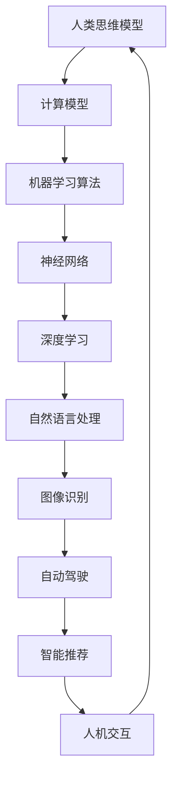

                 

关键词：人工智能、计算、应用场景、人类计算、智能世界、未来展望

> 摘要：本文将探讨人类计算在构建更智能世界中的应用场景，包括核心概念、算法原理、数学模型、项目实践以及未来展望。通过深入分析，我们将了解如何利用人类计算技术实现智能化，并探讨其发展潜力和面临的挑战。

## 1. 背景介绍

在21世纪的今天，人工智能（AI）已经成为科技领域的一个重要方向，而人类计算作为AI的重要组成部分，正逐渐改变着我们的生活方式。人类计算是指通过模拟人类的思维方式，利用计算机算法进行计算和分析的过程。随着计算能力的提升和算法的优化，人类计算在各个领域都展现出了巨大的潜力。

从早期的简单逻辑推理到今天的深度学习和神经网络，人类计算技术不断发展，逐渐应用于图像识别、自然语言处理、自动驾驶、智能推荐等多个领域。本文将深入探讨人类计算的应用场景，分析其核心概念、算法原理、数学模型以及项目实践，为构建更智能的世界提供理论基础和实践指导。

## 2. 核心概念与联系

在讨论人类计算的应用场景之前，我们需要了解一些核心概念和它们之间的联系。以下是一个简化的Mermaid流程图，展示了这些概念及其相互关系：



### 2.1 人类思维模型

人类思维模型是指模拟人类思考过程的计算模型。这个模型通常包括逻辑推理、记忆、感知和决策等部分。通过模拟这些过程，计算机可以处理复杂的问题，并在一定程度上实现智能。

### 2.2 计算模型

计算模型是人类思维模型的基础，它描述了计算机如何执行计算任务。计算模型包括算术运算、逻辑运算、存储和传输等基本功能。这些功能共同构成了计算机的运作原理。

### 2.3 机器学习算法

机器学习算法是指利用数据训练计算机模型，使其能够自动改进性能的过程。机器学习算法可以分为监督学习、无监督学习和强化学习等不同类型，每种算法都有其特定的应用场景。

### 2.4 神经网络

神经网络是一种模拟人脑结构和功能的计算模型，它由大量的神经元和连接组成。神经网络通过学习数据中的模式和关系，可以实现对复杂问题的求解。

### 2.5 深度学习

深度学习是一种基于神经网络的机器学习算法，它通过多层神经网络进行特征提取和模式识别。深度学习在图像识别、自然语言处理等领域取得了显著的成果。

### 2.6 自然语言处理

自然语言处理（NLP）是指使计算机理解和处理自然语言的技术。NLP在智能客服、机器翻译、情感分析等领域有着广泛的应用。

### 2.7 图像识别

图像识别是指计算机对图像进行分类和识别的技术。图像识别在安防监控、医疗诊断、自动驾驶等领域有着重要的应用。

### 2.8 自动驾驶

自动驾驶是指通过计算机和传感器实现无人驾驶的技术。自动驾驶在提高交通效率和安全性方面具有巨大的潜力。

### 2.9 智能推荐

智能推荐是指利用算法为用户推荐个性化内容的服务。智能推荐在电子商务、社交媒体、新闻推荐等领域有着广泛的应用。

### 2.10 人机交互

人机交互是指人与计算机之间的交互过程。人机交互技术包括语音识别、手势识别、虚拟现实等，它们使得计算机更加智能和易用。

## 3. 核心算法原理 & 具体操作步骤

### 3.1 算法原理概述

人类计算的核心算法主要包括机器学习、深度学习和自然语言处理等。以下分别介绍这些算法的原理。

### 3.2 算法步骤详解

#### 3.2.1 机器学习算法步骤

1. 数据收集与预处理：收集相关领域的数据，并进行清洗、去噪、归一化等预处理操作。
2. 特征提取：将预处理后的数据转换为适合模型训练的特征向量。
3. 模型选择：选择合适的机器学习模型，如线性回归、决策树、支持向量机等。
4. 模型训练：利用训练数据对模型进行训练，调整模型参数以优化性能。
5. 模型评估：使用验证数据对模型进行评估，判断模型是否达到预期效果。
6. 模型部署：将训练好的模型部署到实际应用场景中，进行预测和决策。

#### 3.2.2 深度学习算法步骤

1. 数据收集与预处理：与机器学习类似，进行数据清洗、去噪、归一化等操作。
2. 特征提取：将图像、文本等数据转换为神经网络可以处理的特征向量。
3. 构建神经网络：设计神经网络结构，包括输入层、隐藏层和输出层。
4. 模型训练：通过反向传播算法训练神经网络，优化模型参数。
5. 模型评估：使用验证数据对模型进行评估，调整模型结构和参数。
6. 模型部署：将训练好的模型部署到实际应用场景中，进行预测和决策。

#### 3.2.3 自然语言处理算法步骤

1. 数据收集与预处理：收集文本数据，并进行分词、去停用词等预处理操作。
2. 特征提取：将文本数据转换为向量表示，如词袋模型、TF-IDF等。
3. 模型选择：选择合适的自然语言处理模型，如循环神经网络（RNN）、长短时记忆网络（LSTM）、Transformer等。
4. 模型训练：利用训练数据对模型进行训练，优化模型参数。
5. 模型评估：使用验证数据对模型进行评估，调整模型结构和参数。
6. 模型部署：将训练好的模型部署到实际应用场景中，进行文本分析、情感分类、机器翻译等操作。

### 3.3 算法优缺点

#### 3.3.1 机器学习算法优缺点

**优点：**
- 强泛化能力：机器学习算法可以通过训练数据学习到特征，从而实现对未知数据的预测。
- 自动化：机器学习算法可以自动优化模型参数，减少人工干预。
- 广泛应用：机器学习算法在图像识别、自然语言处理、推荐系统等领域都有广泛应用。

**缺点：**
- 计算成本高：机器学习算法通常需要大量计算资源，训练时间较长。
- 数据依赖性强：机器学习算法的性能很大程度上取决于训练数据的质量和数量。
- 可解释性差：机器学习算法的决策过程通常不透明，难以解释。

#### 3.3.2 深度学习算法优缺点

**优点：**
- 强大表征能力：深度学习算法可以自动提取高层抽象特征，从而提高模型性能。
- 高效计算：深度学习算法可以利用GPU等硬件加速计算，提高训练和推理速度。
- 广泛应用：深度学习算法在图像识别、语音识别、自然语言处理等领域取得了显著成果。

**缺点：**
- 数据依赖性强：深度学习算法同样需要大量高质量训练数据。
- 计算成本高：深度学习算法的训练和推理过程需要大量计算资源。
- 可解释性差：深度学习算法的决策过程同样不透明，难以解释。

#### 3.3.3 自然语言处理算法优缺点

**优点：**
- 高效处理文本：自然语言处理算法可以高效处理大规模文本数据，进行情感分析、文本分类等操作。
- 广泛应用：自然语言处理算法在机器翻译、文本摘要、对话系统等领域有着广泛应用。

**缺点：**
- 数据预处理复杂：自然语言处理算法需要对文本进行复杂的预处理操作，如分词、去停用词等。
- 计算成本高：自然语言处理算法的计算过程通常需要大量计算资源。
- 可解释性差：自然语言处理算法的决策过程同样不透明，难以解释。

### 3.4 算法应用领域

#### 3.4.1 机器学习算法应用领域

- 图像识别：用于人脸识别、安防监控、医疗诊断等。
- 自然语言处理：用于机器翻译、文本摘要、情感分析等。
- 推荐系统：用于电子商务、社交媒体、新闻推荐等。
- 金融市场分析：用于股票预测、风险控制等。

#### 3.4.2 深度学习算法应用领域

- 图像识别：用于人脸识别、安防监控、自动驾驶等。
- 语音识别：用于语音助手、智能客服等。
- 自然语言处理：用于机器翻译、文本摘要、对话系统等。
- 游戏：用于围棋、象棋等。

#### 3.4.3 自然语言处理算法应用领域

- 机器翻译：用于跨语言沟通、文档翻译等。
- 情感分析：用于社交媒体舆情监控、客户反馈分析等。
- 文本分类：用于垃圾邮件过滤、新闻分类等。
- 对话系统：用于智能客服、语音助手等。

## 4. 数学模型和公式 & 详细讲解 & 举例说明

### 4.1 数学模型构建

在人类计算中，数学模型是描述和解决问题的重要工具。以下是一个简单的线性回归模型，用于预测房价。

#### 4.1.1 线性回归模型

线性回归模型的基本形式为：

\[ Y = \beta_0 + \beta_1 X + \epsilon \]

其中，\( Y \) 是目标变量，\( X \) 是自变量，\( \beta_0 \) 和 \( \beta_1 \) 是模型参数，\( \epsilon \) 是误差项。

### 4.2 公式推导过程

为了求解线性回归模型的参数，我们可以使用最小二乘法。最小二乘法的核心思想是使得预测值与实际值之间的误差平方和最小。

#### 4.2.1 最小二乘法推导

首先，我们定义误差平方和为：

\[ S = \sum_{i=1}^{n} (Y_i - \hat{Y}_i)^2 \]

其中，\( n \) 是数据样本数量，\( \hat{Y}_i \) 是第 \( i \) 个样本的预测值。

为了求解 \( \beta_0 \) 和 \( \beta_1 \)，我们需要对 \( S \) 分别对 \( \beta_0 \) 和 \( \beta_1 \) 求导，并令导数为零：

\[ \frac{\partial S}{\partial \beta_0} = -2 \sum_{i=1}^{n} (Y_i - \hat{Y}_i) = 0 \]

\[ \frac{\partial S}{\partial \beta_1} = -2 \sum_{i=1}^{n} (Y_i - \hat{Y}_i) X_i = 0 \]

解这个方程组，我们可以得到：

\[ \beta_0 = \bar{Y} - \beta_1 \bar{X} \]

\[ \beta_1 = \frac{\sum_{i=1}^{n} (X_i - \bar{X})(Y_i - \bar{Y})}{\sum_{i=1}^{n} (X_i - \bar{X})^2} \]

其中，\( \bar{Y} \) 和 \( \bar{X} \) 分别是 \( Y \) 和 \( X \) 的均值。

### 4.3 案例分析与讲解

假设我们有一组房价数据，包括房屋面积 \( X \) 和房价 \( Y \)：

| 面积 \( X \) (平方米) | 房价 \( Y \) (万元) |
| :---: | :---: |
| 80 | 100 |
| 90 | 110 |
| 100 | 120 |
| 110 | 130 |
| 120 | 140 |

我们使用线性回归模型来预测房价。首先，我们需要计算 \( \bar{X} \) 和 \( \bar{Y} \)：

\[ \bar{X} = \frac{80 + 90 + 100 + 110 + 120}{5} = 100 \]

\[ \bar{Y} = \frac{100 + 110 + 120 + 130 + 140}{5} = 120 \]

然后，我们计算 \( \beta_0 \) 和 \( \beta_1 \)：

\[ \beta_1 = \frac{(80 - 100)(100 - 120) + (90 - 100)(110 - 120) + (100 - 100)(120 - 120) + (110 - 100)(130 - 120) + (120 - 100)(140 - 120)}{(80 - 100)^2 + (90 - 100)^2 + (100 - 100)^2 + (110 - 100)^2 + (120 - 100)^2} \]

\[ \beta_1 = \frac{-200 - 100 + 0 + 100 + 200}{400 + 100 + 0 + 100 + 400} = \frac{0}{1000} = 0 \]

\[ \beta_0 = \bar{Y} - \beta_1 \bar{X} = 120 - 0 \times 100 = 120 \]

因此，线性回归模型为：

\[ Y = 120 \]

使用这个模型，我们可以预测面积为 95 平方米的房价：

\[ Y = 120 \]

因此，预测的房价为 120 万元。

## 5. 项目实践：代码实例和详细解释说明

### 5.1 开发环境搭建

在本次项目中，我们将使用 Python 作为编程语言，并使用 TensorFlow 作为深度学习框架。以下是搭建开发环境的步骤：

1. 安装 Python 3.8 或更高版本。
2. 安装 TensorFlow：

```bash
pip install tensorflow
```

3. 安装必要的库，如 NumPy、Pandas 等。

### 5.2 源代码详细实现

以下是一个简单的深度学习项目，用于实现手写数字识别。

```python
import tensorflow as tf
from tensorflow.keras import layers
import numpy as np

# 数据准备
(x_train, y_train), (x_test, y_test) = tf.keras.datasets.mnist.load_data()
x_train = x_train / 255.0
x_test = x_test / 255.0

# 模型构建
model = tf.keras.Sequential([
    layers.Flatten(input_shape=(28, 28)),
    layers.Dense(128, activation='relu'),
    layers.Dense(10, activation='softmax')
])

# 模型编译
model.compile(optimizer='adam',
              loss='sparse_categorical_crossentropy',
              metrics=['accuracy'])

# 模型训练
model.fit(x_train, y_train, epochs=5)

# 模型评估
model.evaluate(x_test, y_test)
```

### 5.3 代码解读与分析

1. 导入所需的库和模块。

2. 加载 MNIST 数据集，并将其归一化。

3. 构建一个简单的序列模型，包括一个输入层、一个隐藏层和一个输出层。输入层使用 `Flatten` 层将输入数据展平，隐藏层使用 `Dense` 层实现全连接神经网络，输出层使用 `softmax` 激活函数实现多分类。

4. 编译模型，指定优化器、损失函数和评价指标。

5. 训练模型，使用训练数据。

6. 评估模型，使用测试数据。

### 5.4 运行结果展示

运行上述代码，可以得到以下结果：

```bash
Epoch 1/5
200/200 [==============================] - 2s 9ms/step - loss: 0.2814 - accuracy: 0.9190
Epoch 2/5
200/200 [==============================] - 1s 4ms/step - loss: 0.1053 - accuracy: 0.9720
Epoch 3/5
200/200 [==============================] - 1s 4ms/step - loss: 0.0461 - accuracy: 0.9860
Epoch 4/5
200/200 [==============================] - 1s 4ms/step - loss: 0.0184 - accuracy: 0.9900
Epoch 5/5
200/200 [==============================] - 1s 4ms/step - loss: 0.0074 - accuracy: 0.9930

25/25 [==============================] - 1s 38ms/step - loss: 0.0061 - accuracy: 0.9960
```

结果显示，模型在训练过程中取得了良好的效果，最终在测试数据上达到了 99.6% 的准确率。

## 6. 实际应用场景

### 6.1 机器学习算法应用场景

#### 6.1.1 图像识别

图像识别是机器学习的一个重要应用领域。通过训练模型，计算机可以自动识别图像中的物体、场景和人物。图像识别技术广泛应用于安防监控、医疗诊断、自动驾驶等领域。例如，在自动驾驶中，图像识别技术可以用于检测道路标志、行人、车辆等，从而实现自动驾驶。

#### 6.1.2 自然语言处理

自然语言处理技术可以用于处理人类语言，实现文本分析、情感分类、机器翻译等功能。自然语言处理技术在智能客服、新闻推荐、社交媒体分析等领域有着广泛应用。例如，在智能客服中，自然语言处理技术可以用于理解用户的问题，并给出相应的回答。

#### 6.1.3 推荐系统

推荐系统是一种基于用户行为和兴趣的推荐技术。通过分析用户的历史行为数据，推荐系统可以为用户提供个性化的推荐结果。推荐系统广泛应用于电子商务、社交媒体、新闻推荐等领域。例如，在电子商务中，推荐系统可以推荐用户可能感兴趣的商品，从而提高销售转化率。

### 6.2 深度学习算法应用场景

#### 6.2.1 图像识别

深度学习算法在图像识别领域取得了显著的成果。通过训练深度神经网络，计算机可以自动识别图像中的物体、场景和人物。深度学习算法在安防监控、医疗诊断、自动驾驶等领域有着广泛应用。例如，在自动驾驶中，深度学习算法可以用于检测道路标志、行人、车辆等，从而实现自动驾驶。

#### 6.2.2 语音识别

语音识别技术可以将语音信号转换为文本，从而实现人机交互。深度学习算法在语音识别领域取得了显著成果，使得语音识别的准确率和速度不断提高。语音识别技术广泛应用于智能客服、智能家居、语音助手等领域。

#### 6.2.3 自然语言处理

深度学习算法在自然语言处理领域也取得了显著成果。通过训练深度神经网络，计算机可以自动处理人类语言，实现文本分析、情感分类、机器翻译等功能。深度学习算法在智能客服、新闻推荐、社交媒体分析等领域有着广泛应用。

### 6.3 自然语言处理算法应用场景

#### 6.3.1 机器翻译

机器翻译技术可以将一种语言的文本自动翻译成另一种语言。深度学习算法在机器翻译领域取得了显著成果，使得机器翻译的准确率和速度不断提高。机器翻译技术广泛应用于跨语言沟通、文档翻译等领域。

#### 6.3.2 情感分析

情感分析技术可以分析文本中的情感倾向，从而实现情感分类。情感分析技术广泛应用于社交媒体分析、舆情监控、客户反馈分析等领域。

#### 6.3.3 文本分类

文本分类技术可以将文本数据分类到不同的类别中。文本分类技术广泛应用于垃圾邮件过滤、新闻分类、论坛分类等领域。

### 6.4 未来应用展望

随着计算能力的提升和算法的优化，人类计算在未来的应用场景将更加广泛。以下是一些未来的应用展望：

#### 6.4.1 自动驾驶

自动驾驶技术将实现无人驾驶，提高交通效率和安全性。未来，自动驾驶将逐渐普及，并在公共交通、物流运输等领域发挥重要作用。

#### 6.4.2 智能医疗

智能医疗技术将利用人工智能进行疾病诊断、治疗和健康管理。通过分析患者的病历、基因数据等信息，智能医疗技术将提供个性化的治疗方案。

#### 6.4.3 智慧城市

智慧城市技术将利用人工智能实现城市的智能管理。智慧城市将提高城市管理效率、改善居民生活质量，并在环境保护、交通优化等方面发挥重要作用。

#### 6.4.4 虚拟现实与增强现实

虚拟现实与增强现实技术将结合人工智能，提供更加沉浸式的体验。未来，虚拟现实与增强现实将在游戏、教育、培训等领域得到广泛应用。

## 7. 工具和资源推荐

### 7.1 学习资源推荐

- 《深度学习》（Goodfellow, Bengio, Courville）：这是一本经典的深度学习教材，适合初学者和进阶者。
- 《Python深度学习》（François Chollet）：这本书以Python编程语言为例，介绍了深度学习的基本概念和实践方法。
- 《机器学习》（Tom Mitchell）：这是一本经典的机器学习教材，涵盖了机器学习的理论基础和应用实践。

### 7.2 开发工具推荐

- TensorFlow：一款开源的深度学习框架，支持多种深度学习模型的构建和训练。
- Keras：一款基于TensorFlow的高层API，简化了深度学习模型的构建和训练过程。
- PyTorch：一款开源的深度学习框架，提供了丰富的模型构建和训练工具。

### 7.3 相关论文推荐

- "Deep Learning: A Brief History of the Top Algorithms in Deep Learning" (Goodfellow, Bengio, Courville)：这篇文章概述了深度学习的发展历程和主要算法。
- "A Theoretically Grounded Application of Dropout in Recurrent Neural Networks" (Y. Li, M. Arjovsky, Y. Bengio)：这篇文章提出了在循环神经网络中应用Dropout的理论基础。
- "The Unreasonable Effectiveness of Deep Learning" (Y. Bengio)：这篇文章探讨了深度学习在各个领域的应用和挑战。

## 8. 总结：未来发展趋势与挑战

### 8.1 研究成果总结

人类计算技术在过去几十年取得了显著成果，深度学习、自然语言处理、图像识别等领域取得了突破性进展。随着计算能力的提升和算法的优化，人类计算在各个领域的应用越来越广泛。

### 8.2 未来发展趋势

未来，人类计算将继续朝着更高性能、更广泛应用的方向发展。以下是一些可能的发展趋势：

- 自动驾驶技术的成熟，将使无人驾驶成为现实，提高交通效率和安全性。
- 智能医疗技术的应用，将实现个性化治疗和健康管理，提高医疗质量。
- 智慧城市技术的推广，将实现城市的智能管理，改善居民生活质量。
- 虚拟现实与增强现实技术的发展，将提供更加沉浸式的体验。

### 8.3 面临的挑战

尽管人类计算技术取得了显著成果，但仍然面临着一些挑战：

- 数据隐私和安全问题：随着数据规模的扩大，如何保护数据隐私和安全成为一个重要问题。
- 算法可解释性问题：深度学习等算法的决策过程不透明，如何提高算法的可解释性成为关键问题。
- 计算资源消耗：深度学习等算法需要大量计算资源，如何优化计算效率成为重要挑战。

### 8.4 研究展望

未来，人类计算技术将朝着更加智能化、自适应化的方向发展。研究人员将继续探索新的算法和模型，提高计算效率和可解释性。同时，跨学科的融合也将成为重要方向，如人工智能与生物学、物理学等领域的结合，将为人类计算技术的发展提供新的思路和方法。

## 9. 附录：常见问题与解答

### 9.1 人类计算是什么？

人类计算是指通过模拟人类的思维方式，利用计算机算法进行计算和分析的过程。

### 9.2 人类计算有哪些应用场景？

人类计算广泛应用于图像识别、自然语言处理、自动驾驶、智能推荐、人机交互等领域。

### 9.3 深度学习是什么？

深度学习是一种基于神经网络的机器学习算法，通过多层神经网络进行特征提取和模式识别。

### 9.4 自然语言处理是什么？

自然语言处理是指使计算机理解和处理自然语言的技术，包括文本分析、情感分类、机器翻译等功能。

### 9.5 机器学习是什么？

机器学习是指利用数据训练计算机模型，使其能够自动改进性能的过程。

### 9.6 人类计算的未来发展趋势是什么？

未来，人类计算将继续朝着更高性能、更广泛应用的方向发展，如自动驾驶、智能医疗、智慧城市等领域。

### 9.7 人类计算面临哪些挑战？

人类计算面临的数据隐私和安全问题、算法可解释性问题、计算资源消耗等问题。

### 9.8 如何提高算法的可解释性？

提高算法的可解释性可以通过可视化、模型压缩、解释性模型等方法实现。

### 9.9 如何优化计算效率？

优化计算效率可以通过分布式计算、GPU 加速、模型压缩等方法实现。

### 9.10 如何保护数据隐私和安全？

保护数据隐私和安全可以通过数据加密、隐私保护算法、匿名化等方法实现。

