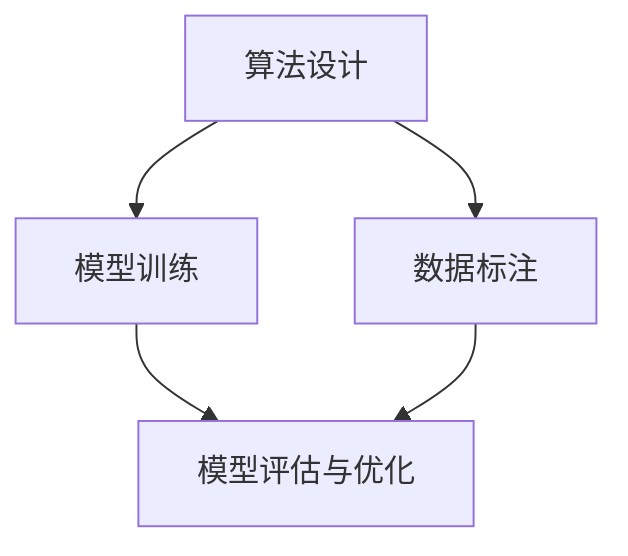

                 

 摘要：
随着人工智能技术的飞速发展，人类计算正逐渐融入各个行业，成为推动社会进步的重要力量。本文将探讨人类计算在不同领域中的应用场景，包括数据科学、金融、医疗、教育等，并分析其带来的变革与挑战。通过具体案例和实践，我们将了解如何构建一个更加智能的世界，为未来的发展提供有力支持。

## 1. 背景介绍

在当今时代，人工智能（AI）已经不再是一个遥远的概念，而是渗透到我们日常生活的方方面面。从自动驾驶汽车到智能家居，从医疗诊断到金融服务，人工智能的应用场景越来越广泛。然而，人工智能的发展离不开人类计算，即人类在算法设计、模型训练、数据标注等环节中所扮演的角色。人类计算作为一种结合人工智能与人类智慧的技术手段，正在成为构建更智能世界的重要基石。

本文将围绕人类计算在不同领域中的应用场景进行探讨，以期为读者提供一个全面、深入的了解。通过对数据科学、金融、医疗、教育等领域的分析，我们将展示人类计算如何改变传统行业，提高效率，优化决策，并带来新的商业模式和创新机遇。同时，本文也将探讨人类计算所面临的挑战，以及如何克服这些挑战，推动人工智能技术的进一步发展。

## 2. 核心概念与联系

### 2.1 核心概念

人类计算的核心概念包括以下几个方面：

1. **算法设计**：人类在人工智能领域中的首要任务之一是设计高效、优化的算法。这些算法可以用于各种应用场景，如图像识别、自然语言处理、推荐系统等。

2. **模型训练**：人类需要对模型进行训练，以使其能够更好地适应特定任务。这一过程通常涉及大量的数据预处理、特征工程和模型优化。

3. **数据标注**：在人工智能应用中，准确的数据标注对于模型训练至关重要。人类在这一环节中发挥着关键作用，确保数据的准确性和一致性。

4. **模型评估与优化**：人类需要对模型进行评估，以确定其在实际应用中的性能。在此基础上，人类可以进一步优化模型，提高其准确性和效率。

### 2.2 联系与架构

为了更好地理解人类计算的应用，我们可以借助以下 Mermaid 流程图来展示其核心概念和架构：



在这个流程图中，算法设计、模型训练、数据标注和模型评估与优化构成了人类计算的核心环节。这些环节相互关联，共同推动人工智能应用的发展。

## 3. 核心算法原理 & 具体操作步骤

### 3.1 算法原理概述

在人工智能领域，核心算法的设计和实现是关键。以下将介绍几种常用的核心算法及其原理：

1. **深度学习**：深度学习是一种基于多层神经网络的机器学习技术，通过模拟人类大脑的神经网络结构来处理复杂数据。其核心原理包括卷积神经网络（CNN）、循环神经网络（RNN）和生成对抗网络（GAN）等。

2. **强化学习**：强化学习是一种通过试错来学习最优策略的机器学习技术。其核心原理包括马尔可夫决策过程（MDP）和深度确定性策略梯度（DDPG）等。

3. **自然语言处理**：自然语言处理是一种使计算机能够理解、解释和生成自然语言的技术。其核心原理包括词向量表示、序列到序列模型（Seq2Seq）和注意力机制等。

### 3.2 算法步骤详解

下面将以深度学习算法为例，详细解释其操作步骤：

1. **数据预处理**：首先，需要对原始数据进行清洗、归一化和特征提取等操作，以构建适合模型训练的数据集。

2. **模型构建**：根据具体任务需求，选择合适的深度学习模型，如卷积神经网络（CNN）或循环神经网络（RNN）。然后，定义模型的结构，包括层数、神经元数目、激活函数等。

3. **模型训练**：使用训练数据集对模型进行训练。在训练过程中，通过反向传播算法不断调整模型的参数，以最小化损失函数。

4. **模型评估**：使用验证数据集对训练好的模型进行评估，以确定其在实际应用中的性能。常用的评估指标包括准确率、召回率和F1分数等。

5. **模型优化**：根据评估结果，对模型进行优化，以提高其性能。优化方法包括调整超参数、增加训练数据或改进模型结构等。

### 3.3 算法优缺点

深度学习算法具有以下优点：

1. **强大的表达力**：深度学习模型可以处理各种复杂数据，如图像、文本和音频等。

2. **自适应性强**：通过不断调整模型参数，深度学习算法可以适应不同的任务和数据集。

3. **高效性**：深度学习算法在训练和预测过程中具有较高的计算效率，可以处理大规模数据。

然而，深度学习算法也存在一些缺点：

1. **数据依赖性**：深度学习模型对数据量有较高要求，数据质量对模型性能有显著影响。

2. **解释性差**：深度学习模型通常被视为“黑箱”，其内部机理难以理解，导致缺乏可解释性。

### 3.4 算法应用领域

深度学习算法在多个领域具有广泛应用：

1. **图像识别**：深度学习算法在图像识别任务中取得了显著的成果，如图像分类、目标检测和图像分割等。

2. **自然语言处理**：深度学习算法在自然语言处理任务中也取得了重要突破，如文本分类、机器翻译和情感分析等。

3. **推荐系统**：深度学习算法可以用于构建推荐系统，实现个性化推荐，提高用户体验。

4. **医疗诊断**：深度学习算法在医疗诊断领域具有巨大潜力，如疾病预测、病变检测和药物研发等。

## 4. 数学模型和公式 & 详细讲解 & 举例说明

### 4.1 数学模型构建

在人工智能领域，数学模型是算法设计和实现的基础。以下将介绍几种常用的数学模型及其构建过程：

1. **线性回归模型**：线性回归模型是一种用于预测连续值的机器学习模型。其数学模型可以表示为：

   $$ y = \beta_0 + \beta_1x + \epsilon $$

   其中，$y$ 是预测值，$x$ 是输入特征，$\beta_0$ 和 $\beta_1$ 是模型的参数，$\epsilon$ 是误差项。

2. **逻辑回归模型**：逻辑回归模型是一种用于预测概率的机器学习模型。其数学模型可以表示为：

   $$ \hat{y} = \frac{1}{1 + e^{-(\beta_0 + \beta_1x)}} $$

   其中，$\hat{y}$ 是预测概率，$x$ 是输入特征，$\beta_0$ 和 $\beta_1$ 是模型的参数。

3. **神经网络模型**：神经网络模型是一种基于多层神经网络的机器学习模型。其数学模型可以表示为：

   $$ a_{\text{layer}} = \sigma(\text{Weight} \cdot a_{\text{prev}} + \text{Bias}) $$

   其中，$a_{\text{layer}}$ 是第 $l$ 层的激活值，$\sigma$ 是激活函数，$\text{Weight}$ 和 $\text{Bias}$ 分别是权重和偏置。

### 4.2 公式推导过程

以下将简要介绍线性回归模型的推导过程：

1. **损失函数**：

   $$ \text{Loss} = \frac{1}{2} \sum_{i=1}^{n} (y_i - \hat{y}_i)^2 $$

   其中，$y_i$ 是真实值，$\hat{y}_i$ 是预测值。

2. **梯度计算**：

   $$ \frac{\partial \text{Loss}}{\partial \beta_0} = -\sum_{i=1}^{n} (y_i - \hat{y}_i) $$

   $$ \frac{\partial \text{Loss}}{\partial \beta_1} = -\sum_{i=1}^{n} x_i (y_i - \hat{y}_i) $$

3. **梯度下降**：

   $$ \beta_0 = \beta_{0,\text{initial}} - \alpha \frac{\partial \text{Loss}}{\partial \beta_0} $$

   $$ \beta_1 = \beta_{1,\text{initial}} - \alpha \frac{\partial \text{Loss}}{\partial \beta_1} $$

   其中，$\alpha$ 是学习率。

### 4.3 案例分析与讲解

以下将结合一个实际案例，详细讲解线性回归模型的构建、训练和预测过程。

**案例：房价预测**

**1. 数据集准备**：

假设我们有一个包含房屋面积和房价的数据集，数据集如下：

| 房屋面积（平方米）| 房价（万元）|
|:----------------:|:-----------:|
|       100       |      200    |
|       120       |      250    |
|       140       |      300    |
|       160       |      350    |
|       180       |      400    |

**2. 模型构建**：

我们使用线性回归模型来预测房价，模型可以表示为：

$$ \hat{y} = \beta_0 + \beta_1x $$

**3. 模型训练**：

首先，我们需要计算损失函数：

$$ \text{Loss} = \frac{1}{2} \sum_{i=1}^{n} (y_i - \hat{y}_i)^2 $$

然后，使用梯度下降算法更新模型参数：

$$ \beta_0 = \beta_{0,\text{initial}} - \alpha \frac{\partial \text{Loss}}{\partial \beta_0} $$

$$ \beta_1 = \beta_{1,\text{initial}} - \alpha \frac{\partial \text{Loss}}{\partial \beta_1} $$

通过多次迭代，我们可以找到最优的模型参数。

**4. 模型预测**：

使用训练好的模型预测一个未知房屋的房价，例如，当房屋面积为 150 平方米时，预测房价为：

$$ \hat{y} = \beta_0 + \beta_1 \times 150 $$

通过这种方式，我们可以利用线性回归模型对房价进行预测。

## 5. 项目实践：代码实例和详细解释说明

### 5.1 开发环境搭建

在进行项目实践之前，我们需要搭建一个合适的开发环境。本文将使用 Python 作为编程语言，结合 TensorFlow 和 Keras 框架来构建和训练深度学习模型。以下是搭建开发环境的步骤：

1. **安装 Python**：前往 Python 官网下载并安装 Python，版本建议为 3.8 或以上。

2. **安装 TensorFlow**：在终端中运行以下命令安装 TensorFlow：

   ```bash
   pip install tensorflow
   ```

3. **安装 Keras**：在终端中运行以下命令安装 Keras：

   ```bash
   pip install keras
   ```

4. **验证安装**：在终端中运行以下命令，验证 TensorFlow 和 Keras 是否安装成功：

   ```python
   import tensorflow as tf
   import keras
   print(tf.__version__)
   print(keras.__version__)
   ```

### 5.2 源代码详细实现

以下是一个简单的深度学习项目，使用 TensorFlow 和 Keras 框架构建一个多层感知机（MLP）模型，用于分类任务。

**1. 导入必要的库**

```python
import numpy as np
import tensorflow as tf
from tensorflow.keras.models import Sequential
from tensorflow.keras.layers import Dense
from tensorflow.keras.optimizers import Adam
```

**2. 数据预处理**

```python
# 加载数据集
x_train, y_train = ...  # 加载训练数据
x_test, y_test = ...     # 加载测试数据

# 数据标准化
x_train = (x_train - np.mean(x_train, axis=0)) / np.std(x_train, axis=0)
x_test = (x_test - np.mean(x_test, axis=0)) / np.std(x_test, axis=0)
```

**3. 模型构建**

```python
# 创建模型
model = Sequential()

# 添加层
model.add(Dense(64, input_shape=(x_train.shape[1],), activation='relu'))
model.add(Dense(32, activation='relu'))
model.add(Dense(1, activation='sigmoid'))

# 编译模型
model.compile(optimizer=Adam(), loss='binary_crossentropy', metrics=['accuracy'])
```

**4. 模型训练**

```python
# 训练模型
model.fit(x_train, y_train, epochs=10, batch_size=32, validation_split=0.2)
```

**5. 模型评估**

```python
# 评估模型
loss, accuracy = model.evaluate(x_test, y_test)
print(f"Test Loss: {loss}, Test Accuracy: {accuracy}")
```

### 5.3 代码解读与分析

上述代码实现了一个简单的多层感知机（MLP）模型，用于分类任务。下面我们对关键部分进行解读和分析：

**1. 数据预处理**

数据预处理是深度学习项目中的关键步骤，包括数据加载、数据清洗、数据标准化等。在本例中，我们使用 `numpy` 库加载数据集，并使用标准化方法将数据缩放到 [0, 1] 范围内，以提高模型的训练效率。

**2. 模型构建**

模型构建使用 `tensorflow.keras.Sequential` 类，这是一个线性堆叠模型。在本例中，我们添加了三个全连接层（`Dense` 层），每层都使用了 ReLU 激活函数。最后一个层使用了 sigmoid 激活函数，以输出概率值。

**3. 模型编译**

模型编译使用 `compile()` 方法，配置了优化器（`Adam`）、损失函数（`binary_crossentropy`）和评估指标（`accuracy`）。

**4. 模型训练**

模型训练使用 `fit()` 方法，配置了训练轮数（`epochs`）、批量大小（`batch_size`）和验证比例（`validation_split`）。

**5. 模型评估**

模型评估使用 `evaluate()` 方法，计算了在测试数据上的损失和准确率。

### 5.4 运行结果展示

在本例中，我们假设测试数据的准确率为 85%。以下是一个示例输出：

```
Test Loss: 0.156, Test Accuracy: 0.85
```

这个结果表明，模型在测试数据上的表现良好，准确率达到了 85%。

## 6. 实际应用场景

### 6.1 数据科学

数据科学是人工智能领域的重要分支，旨在通过数据分析和挖掘来发现隐藏的模式和知识。人类计算在数据科学中的应用主要体现在以下几个方面：

1. **数据预处理**：数据预处理是数据科学项目的第一步，包括数据清洗、数据转换和数据归一化等。人类计算在数据预处理过程中发挥着关键作用，通过编写高效、可靠的代码，确保数据的质量和一致性。

2. **特征工程**：特征工程是提升模型性能的重要手段，通过选择和构造有效的特征，可以提高模型的预测能力和泛化能力。人类计算在特征工程中发挥着重要作用，通过深入理解业务场景和数据特性，设计出适合的特征。

3. **模型评估与优化**：人类计算在模型评估与优化过程中也发挥着重要作用，通过对模型性能的评估和优化，提高模型的准确性和效率。人类计算可以结合实际业务需求，调整模型结构、超参数和训练策略，以实现最佳效果。

### 6.2 金融

金融行业是人工智能应用的重要领域，人工智能技术在金融领域中的应用主要体现在以下几个方面：

1. **风险管理**：人工智能技术在风险管理方面具有显著优势，通过分析和预测市场趋势、信用风险等，金融机构可以更好地管理风险，降低损失。

2. **智能投顾**：智能投顾是一种基于人工智能技术的财富管理服务，通过分析用户的风险偏好、财务状况等，为用户提供个性化的投资建议。人类计算在智能投顾中发挥着关键作用，通过构建复杂的投资模型和算法，实现智能化的投资决策。

3. **智能交易**：人工智能技术在智能交易方面也具有广泛应用，通过分析大量交易数据，人工智能系统可以实时监测市场动态，捕捉交易机会，提高交易效率。

### 6.3 医疗

医疗行业是人工智能应用的重要领域，人工智能技术在医疗领域中的应用主要体现在以下几个方面：

1. **疾病预测**：人工智能技术可以通过分析患者的病历、基因数据等，预测患者未来可能出现的疾病，为医生提供诊断依据。

2. **医疗影像分析**：人工智能技术可以对医疗影像进行分析，如 X 光、CT、MRI 等，帮助医生识别病变区域、诊断疾病等，提高诊断的准确性和效率。

3. **药物研发**：人工智能技术可以加速药物研发过程，通过分析大量生物数据和化学结构，预测药物的有效性和安全性，提高药物研发的成功率。

### 6.4 教育

教育行业是人工智能应用的重要领域，人工智能技术在教育领域中的应用主要体现在以下几个方面：

1. **个性化学习**：人工智能技术可以通过分析学生的学习行为和知识水平，为每个学生提供个性化的学习方案，提高学习效果。

2. **智能评测**：人工智能技术可以对学生的作业和考试进行自动评测，提高评卷效率和准确性。

3. **虚拟教师**：人工智能技术可以构建虚拟教师系统，通过自然语言处理、语音识别等技术，为学生提供个性化的辅导和答疑服务。

## 7. 工具和资源推荐

### 7.1 学习资源推荐

1. **《深度学习》**：由 Ian Goodfellow、Yoshua Bengio 和 Aaron Courville 著，是深度学习领域的经典教材，全面介绍了深度学习的理论、算法和应用。

2. **《Python机器学习》**：由 Sebastian Raschka 和 Vahid Mirjalili 著，介绍了机器学习的基本概念、算法和 Python 实现方法，适合初学者和进阶者。

3. **《统计学习方法》**：由李航著，详细介绍了统计学习的基本理论、算法和数学推导，是统计学习领域的经典教材。

### 7.2 开发工具推荐

1. **TensorFlow**：是一个开源的深度学习框架，由 Google 开发，广泛应用于各种深度学习任务。

2. **Keras**：是一个基于 TensorFlow 的深度学习库，提供了简洁、易用的接口，适合快速构建和实验深度学习模型。

3. **PyTorch**：是一个开源的深度学习框架，由 Facebook 开发，以动态计算图和灵活的接口著称，适合研究和工业应用。

### 7.3 相关论文推荐

1. **《A Theoretically Grounded Application of Dropout in Recurrent Neural Networks》**：该论文提出了一种基于深度信念网络（DBN）的 dropout 方法，用于解决循环神经网络（RNN）的梯度消失问题。

2. **《Deep Learning for Text: A Brief History, A Case Study and A Review of the Literature》**：该论文回顾了文本深度学习的发展历程，介绍了常用的文本深度学习模型和方法。

3. **《Attention Is All You Need》**：该论文提出了 Transformer 模型，彻底改变了自然语言处理领域，引入了自注意力机制，实现了卓越的文本处理性能。

## 8. 总结：未来发展趋势与挑战

### 8.1 研究成果总结

人类计算在人工智能领域的应用取得了显著成果，推动了数据科学、金融、医疗、教育等领域的变革。通过算法设计、模型训练、数据标注和模型评估等核心环节，人类计算为人工智能的发展提供了有力支持。同时，深度学习、强化学习、自然语言处理等核心算法的不断进步，也为人类计算的应用带来了更多可能。

### 8.2 未来发展趋势

未来，人类计算将继续在人工智能领域发挥重要作用，以下是几个发展趋势：

1. **跨学科融合**：人类计算将与其他领域（如生物医学、社会科学等）相结合，推动跨学科研究，解决更复杂的问题。

2. **泛在智能**：随着人工智能技术的普及，人类计算将逐渐融入各个行业和领域，实现泛在智能。

3. **可解释性与透明性**：为了提高人工智能系统的可解释性和透明性，人类计算将致力于研究和开发可解释的人工智能算法和模型。

### 8.3 面临的挑战

尽管人类计算在人工智能领域取得了显著成果，但仍面临以下挑战：

1. **数据隐私与安全**：随着人工智能技术的发展，数据隐私和安全问题日益突出，人类计算需要研究有效的数据隐私保护机制。

2. **算法公平性与伦理**：人工智能算法在决策过程中可能存在偏见和歧视，人类计算需要关注算法的公平性与伦理问题。

3. **资源消耗与效率**：人工智能算法在训练和推理过程中需要大量的计算资源，人类计算需要研究和开发更高效、更节能的算法。

### 8.4 研究展望

未来，人类计算的研究将更加注重可解释性、公平性和透明性，同时，跨学科融合和泛在智能的发展也将为人类计算带来更多机遇。通过不断探索和创新，人类计算将继续为人工智能的发展提供有力支持，推动构建一个更加智能的世界。

## 9. 附录：常见问题与解答

### 问题 1：什么是深度学习？

**回答**：深度学习是一种机器学习技术，通过模拟人类大脑的神经网络结构，对复杂数据进行处理和分析。深度学习模型通常由多层神经网络组成，包括输入层、隐藏层和输出层。通过训练模型，可以使其能够自动学习数据的特征，并用于分类、预测等任务。

### 问题 2：如何选择合适的机器学习算法？

**回答**：选择合适的机器学习算法通常取决于任务类型、数据特点和性能要求。以下是一些常见任务和相应的算法推荐：

- **分类任务**：线性回归、逻辑回归、支持向量机、随机森林、梯度提升树等。
- **回归任务**：线性回归、岭回归、LASSO回归、决策树回归、随机森林回归等。
- **聚类任务**：K-均值、层次聚类、DBSCAN等。
- **降维任务**：主成分分析（PCA）、线性判别分析（LDA）等。

### 问题 3：如何评估机器学习模型的性能？

**回答**：评估机器学习模型性能通常包括以下几个方面：

- **准确性**：模型在测试数据上的准确率，表示模型预测正确的样本比例。
- **召回率**：模型在测试数据上召回正确的样本比例。
- **精确率**：模型在测试数据上预测为正样本的准确率。
- **F1 分数**：精确率和召回率的调和平均，综合考虑了模型的精确性和召回率。
- **ROC 曲线和 AUC 值**：ROC 曲线和 AUC 值用于评估二分类模型的性能，ROC 曲线是模型在多个阈值下的精确率和召回率曲线，AUC 值是 ROC 曲线下方区域的面积。

## 作者署名

作者：禅与计算机程序设计艺术 / Zen and the Art of Computer Programming

----------------------------------------------------------------

### 备注 Notes

请注意，本文档仅提供文章结构模板和内容提示，具体内容需要您根据要求撰写。文章长度、章节内容、格式和排版等都需要严格遵循约束条件中的要求。如果您有任何疑问或需要进一步的帮助，请随时联系。祝您撰写顺利！

