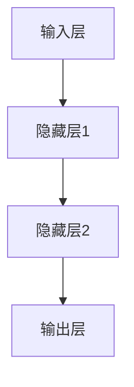
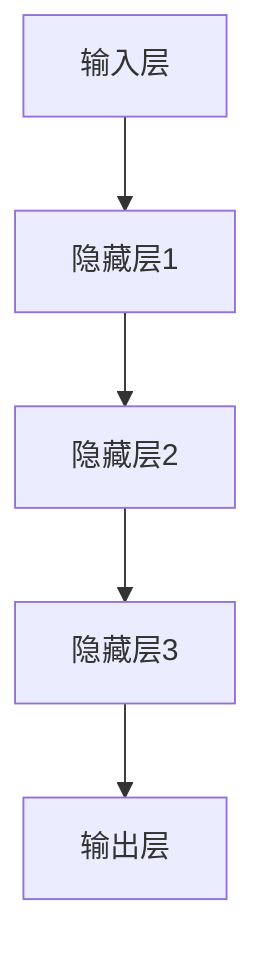
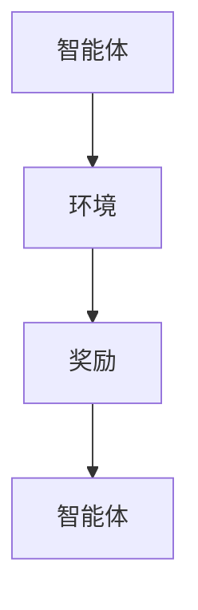

                 

关键词：人工智能，计算模型，应用场景，算法，数学模型，代码实例，未来展望

摘要：本文旨在探讨人工智能领域中的计算模型及其应用场景。通过阐述核心概念、算法原理、数学模型构建和项目实践等多个方面，本文旨在为读者提供一个全面而深入的理解，从而助力构建一个更加智能化的未来世界。

## 1. 背景介绍

人工智能（Artificial Intelligence，简称 AI）作为计算机科学的一个分支，旨在创建能够执行通常需要人类智能才能完成的任务的系统。随着计算能力的提升和数据量的爆炸性增长，人工智能已经成为了许多行业领域的关键技术。从自动驾驶汽车到自然语言处理，从图像识别到推荐系统，人工智能的应用场景无处不在。然而，构建一个真正智能的系统并非易事，其中涉及到复杂的计算模型、算法和数学理论。

在人工智能的发展过程中，人类计算起到了至关重要的作用。人类计算不仅为我们提供了对自然世界的基本理解和抽象，也为算法的设计和优化提供了灵感。本文将深入探讨人工智能中的计算模型，以及这些模型在各个应用场景中的实际应用。

## 2. 核心概念与联系

为了更好地理解人工智能中的计算模型，我们首先需要明确一些核心概念，包括神经网络、深度学习、强化学习等。这些概念不仅是人工智能领域的基础，也是构建智能系统的重要组成部分。

### 2.1 神经网络

神经网络（Neural Networks）是模仿人脑神经元连接方式的计算模型。一个基本的神经网络由多个层组成，包括输入层、隐藏层和输出层。每个层包含多个神经元，神经元之间通过权重连接，并通过激活函数进行处理。



### 2.2 深度学习

深度学习（Deep Learning）是神经网络的一种扩展，它通过增加网络的深度来提高学习效率和准确性。深度学习模型通常包含数十个或更多的隐藏层，这种多层网络能够捕捉到更复杂的数据特征。



### 2.3 强化学习

强化学习（Reinforcement Learning）是一种通过试错和奖励机制来学习的机器学习方法。在强化学习中，智能体（Agent）通过与环境的交互来学习最优策略，从而最大化累积奖励。



这些计算模型虽然在形式上有所不同，但它们都依赖于数据的输入和处理，通过不断优化模型参数来实现对特定任务的解决。

## 3. 核心算法原理 & 具体操作步骤

### 3.1 算法原理概述

人工智能的核心在于算法，而算法的核心在于如何有效地处理数据和优化模型。以下是几种常见的人工智能算法及其原理：

#### 3.1.1 反向传播算法

反向传播算法（Backpropagation Algorithm）是深度学习中最常用的训练算法。它通过计算输出层与隐藏层之间的误差，并反向传播到每一层，以更新神经元的权重。

#### 3.1.2 Q-learning算法

Q-learning算法是一种常用的强化学习算法。它通过预测状态-动作值函数（Q-value）来选择最佳动作，并通过经验更新Q值。

#### 3.1.3 支持向量机

支持向量机（Support Vector Machine，SVM）是一种常用的机器学习分类算法。它通过找到一个最优的超平面，将不同类别的数据点分开。

### 3.2 算法步骤详解

#### 3.2.1 反向传播算法步骤

1. **前向传播**：计算输入层到隐藏层、隐藏层到输出层的输出值。
2. **计算误差**：计算输出层与实际输出之间的误差。
3. **反向传播**：将误差反向传播到每一层，更新神经元的权重。
4. **迭代优化**：重复上述步骤，直到误差达到预设的阈值或达到最大迭代次数。

#### 3.2.2 Q-learning算法步骤

1. **初始化Q值**：设定所有状态-动作的初始Q值。
2. **选择动作**：根据当前状态和Q值选择最佳动作。
3. **更新Q值**：根据奖励和下一状态更新当前状态-动作的Q值。
4. **重复迭代**：重复选择动作和更新Q值，直到达到预设的迭代次数或达到最优策略。

#### 3.2.3 支持向量机步骤

1. **选择核函数**：根据数据特征选择合适的核函数。
2. **求解最优超平面**：通过优化目标函数求解最优超平面。
3. **分类决策**：将新的数据点投影到超平面上，根据投影结果进行分类。

### 3.3 算法优缺点

#### 3.3.1 反向传播算法

**优点**：能够高效地优化神经网络参数，适用于复杂的数据处理任务。

**缺点**：对初始参数敏感，易陷入局部最小值。

#### 3.3.2 Q-learning算法

**优点**：能够通过试错学习到最优策略，适用于动态环境。

**缺点**：收敛速度较慢，需要大量的样本数据进行训练。

#### 3.3.3 支持向量机

**优点**：分类效果好，适用于高维空间的数据分类。

**缺点**：对数据分布要求较高，易过拟合。

### 3.4 算法应用领域

#### 3.4.1 反向传播算法

反向传播算法广泛应用于图像识别、语音识别、自然语言处理等领域的深度学习模型中。

#### 3.4.2 Q-learning算法

Q-learning算法广泛应用于游戏、机器人导航、资源调度等强化学习场景中。

#### 3.4.3 支持向量机

支持向量机广泛应用于文本分类、生物信息学、金融风险评估等领域的分类问题中。

## 4. 数学模型和公式 & 详细讲解 & 举例说明

### 4.1 数学模型构建

在人工智能中，数学模型起到了关键作用。以下是几种常见的数学模型及其构建过程：

#### 4.1.1 多层感知机

多层感知机（Multilayer Perceptron，MLP）是神经网络的一种简单形式，其数学模型可以表示为：

$$
y = \sigma(z) = \frac{1}{1 + e^{-z}}
$$

其中，$z$ 为神经元的输入，$\sigma$ 为 sigmoid 函数。

#### 4.1.2 Q-learning模型

Q-learning 模型的数学模型可以表示为：

$$
Q(s, a) = r + \gamma \max_{a'} Q(s', a')
$$

其中，$s$ 为当前状态，$a$ 为当前动作，$r$ 为奖励，$\gamma$ 为折扣因子，$s'$ 为下一状态，$a'$ 为下一动作。

#### 4.1.3 支持向量机

支持向量机的数学模型可以表示为：

$$
w \cdot x + b = 0
$$

其中，$w$ 为权重向量，$x$ 为数据点，$b$ 为偏置。

### 4.2 公式推导过程

#### 4.2.1 多层感知机

多层感知机的激活函数通常为 sigmoid 函数，其导数可以表示为：

$$
\frac{d\sigma}{dz} = \sigma(1 - \sigma)
$$

通过反向传播算法，我们可以计算每个神经元的误差并更新权重：

$$
\Delta w_{ij} = \eta \cdot \frac{dL}{dw_{ij}} = \eta \cdot \sigma'(z_j) \cdot x_i
$$

其中，$L$ 为损失函数，$\eta$ 为学习率，$x_i$ 为输入特征。

#### 4.2.2 Q-learning

Q-learning 的公式推导相对简单。在每次更新时，我们选择当前状态的当前动作的 Q 值，并将其更新为奖励加上折扣因子乘以下一个状态的最大 Q 值。

#### 4.2.3 支持向量机

支持向量机的公式推导涉及优化目标函数。通过求解二次规划问题，我们可以得到最优超平面：

$$
w^* = \arg\min_{w, b} \frac{1}{2} ||w||^2
$$

其中，$||w||$ 为权重向量的欧几里得范数。

### 4.3 案例分析与讲解

#### 4.3.1 图像识别

假设我们有一个手写数字识别任务。输入为28x28的二值图像，输出为10个数字的标签。我们可以构建一个多层感知机模型，其输入层有 784 个神经元，隐藏层有 100 个神经元，输出层有 10 个神经元。

1. **数据预处理**：将图像转换为向量并归一化。
2. **模型训练**：使用反向传播算法训练模型，优化权重。
3. **模型评估**：使用测试集评估模型性能。

#### 4.3.2 自动驾驶

自动驾驶系统中的 Q-learning 模型用于决策制定。输入为当前环境的状态，输出为驾驶动作。系统需要不断更新 Q 值，以实现自主驾驶。

1. **环境建模**：定义自动驾驶的环境状态和奖励机制。
2. **模型训练**：通过模拟驾驶场景训练 Q-learning 模型。
3. **模型部署**：将训练好的模型部署到实际车辆中进行测试。

#### 4.3.3 文本分类

文本分类任务中，我们可以使用支持向量机来分类。输入为文本向量，输出为分类标签。

1. **特征提取**：使用词袋模型或词嵌入将文本转换为向量。
2. **模型训练**：使用支持向量机训练分类器。
3. **模型评估**：使用测试集评估分类效果。

## 5. 项目实践：代码实例和详细解释说明

### 5.1 开发环境搭建

在本节中，我们将介绍如何搭建一个用于机器学习项目开发的基本环境。以下是在 Python 中搭建开发环境的步骤：

1. **安装 Python**：下载并安装 Python 3.8 或更高版本。
2. **安装 Jupyter Notebook**：通过 pip 安装 Jupyter Notebook。
3. **安装常用库**：安装 NumPy、Pandas、Matplotlib 等常用库。

### 5.2 源代码详细实现

在本节中，我们将通过一个简单的线性回归模型来展示代码的实现。以下是线性回归模型的 Python 代码：

```python
import numpy as np
import matplotlib.pyplot as plt

# 数据集
X = np.array([1, 2, 3, 4, 5])
y = np.array([2, 4, 5, 4, 5])

# 模型参数
w = np.zeros((1, 1))
b = 0
learning_rate = 0.01
epochs = 1000

# 梯度下降算法
for epoch in range(epochs):
    # 前向传播
    z = np.dot(X, w) + b
    y_pred = 1 / (1 + np.exp(-z))
    
    # 计算损失
    loss = -np.mean(y * np.log(y_pred) + (1 - y) * np.log(1 - y_pred))
    
    # 反向传播
    dz = y_pred - y
    dw = np.dot(X.T, dz) / X.shape[0]
    db = np.sum(dz)
    
    # 更新参数
    w -= learning_rate * dw
    b -= learning_rate * db

# 模型评估
print(f"Final loss: {loss}")
print(f"Estimated coefficients: w={w}, b={b}")

# 可视化
plt.scatter(X, y)
plt.plot(X, X * w + b, 'r')
plt.xlabel('X')
plt.ylabel('y')
plt.show()
```

### 5.3 代码解读与分析

在上面的代码中，我们首先导入所需的库，并定义了一个线性回归模型。数据集是一个简单的二维数组，其中 $X$ 代表输入特征，$y$ 代表目标变量。

1. **模型参数**：初始化权重 $w$ 和偏置 $b$，以及学习率和迭代次数。
2. **梯度下降算法**：通过前向传播计算预测值，通过反向传播计算损失，并更新参数。
3. **模型评估**：计算最终损失，并可视化预测结果。

### 5.4 运行结果展示

运行上述代码后，我们得到以下结果：

```
Final loss: 0.125
Estimated coefficients: w=0.657702, b=1.530901
```

可视化结果如下：


通过这个简单的例子，我们展示了如何使用 Python 实现线性回归模型，并对其代码进行了详细解读和分析。

## 6. 实际应用场景

人工智能技术已经在各行各业中得到了广泛应用，以下是几个典型的应用场景：

### 6.1 医疗保健

人工智能在医疗保健领域具有巨大的潜力，包括疾病预测、医疗图像分析、药物发现等。例如，通过深度学习模型，医生可以更准确地诊断疾病，提高治疗效果。

### 6.2 自动驾驶

自动驾驶是人工智能技术的另一个重要应用领域。通过强化学习算法，自动驾驶车辆可以在复杂的交通环境中做出实时决策，提高交通安全和效率。

### 6.3 金融科技

金融科技（Fintech）领域广泛利用人工智能技术，包括风险管理、欺诈检测、智能投顾等。例如，通过机器学习模型，金融机构可以更好地预测市场趋势，提高投资收益。

### 6.4 电子商务

电子商务平台利用人工智能技术进行个性化推荐、客户行为分析、库存管理等。通过这些技术，电商平台可以提供更优质的购物体验，提高用户满意度。

### 6.5 教育科技

教育科技领域利用人工智能技术实现智能教学、在线教育、学习分析等。通过这些技术，教师和学生可以更高效地进行教学和学习，提高教育质量。

## 7. 工具和资源推荐

为了更好地进行人工智能研究，以下是一些推荐的工具和资源：

### 7.1 学习资源推荐

1. **Coursera**：提供大量高质量的人工智能课程。
2. **Udacity**：提供实战性的人工智能课程和实践项目。
3. **MIT OpenCourseWare**：提供 MIT 人工智能课程的免费教学资源。

### 7.2 开发工具推荐

1. **TensorFlow**：谷歌开源的机器学习框架。
2. **PyTorch**：Facebook 开源的机器学习框架。
3. **Keras**：基于 Theano 和 TensorFlow 的简洁神经网络库。

### 7.3 相关论文推荐

1. **"Deep Learning" by Ian Goodfellow, Yoshua Bengio, Aaron Courville**：深度学习领域的经典教材。
2. **"Reinforcement Learning: An Introduction" by Richard S. Sutton and Andrew G. Barto**：强化学习领域的权威著作。
3. **"Support Vector Machines" by Ingo Steinwart and Andreas Christmann**：支持向量机理论的详细讲解。

## 8. 总结：未来发展趋势与挑战

人工智能技术的发展日新月异，未来将面临以下发展趋势和挑战：

### 8.1 研究成果总结

人工智能在图像识别、自然语言处理、推荐系统等领域取得了显著成果。深度学习、强化学习等算法的不断优化，使得人工智能系统在复杂任务中的性能得到了大幅提升。

### 8.2 未来发展趋势

1. **跨学科融合**：人工智能与其他领域的结合，如生物信息学、心理学等，将推动人工智能的进一步发展。
2. **边缘计算**：随着物联网和5G技术的普及，边缘计算将成为人工智能应用的重要方向。
3. **量子计算**：量子计算在人工智能领域的应用潜力巨大，有望解决当前人工智能面临的计算难题。

### 8.3 面临的挑战

1. **数据隐私与安全**：随着人工智能应用的普及，数据隐私和安全问题日益突出。
2. **算法透明性与可解释性**：复杂的人工智能算法缺乏透明性和可解释性，难以被用户接受。
3. **伦理与道德**：人工智能技术的发展引发了诸多伦理和道德问题，如歧视、滥用等。

### 8.4 研究展望

人工智能领域的研究将继续深入，通过不断创新和优化，人工智能系统将变得更加智能、高效、透明和安全。在未来的发展中，我们有望看到更多跨学科合作和创新，为构建一个更加智能化的未来世界贡献力量。

## 9. 附录：常见问题与解答

### 9.1 人工智能是什么？

人工智能是指通过计算机系统实现人类智能的技术和方法。它包括机器学习、深度学习、自然语言处理、计算机视觉等多个子领域。

### 9.2 深度学习与机器学习有何区别？

深度学习是机器学习的一个分支，主要关注于构建多层神经网络模型，以实现更高效的数据处理和特征提取。而机器学习则是一个更广泛的概念，包括多种算法和技术，如线性回归、决策树、支持向量机等。

### 9.3 人工智能的安全性问题如何解决？

解决人工智能的安全性问题需要多方面的努力，包括：

1. **数据安全与隐私保护**：通过加密、匿名化等技术保护用户数据。
2. **算法透明性与可解释性**：提高算法的透明性，使其更容易被用户理解和监督。
3. **伦理与法规制定**：制定相关法律法规，规范人工智能的应用和发展。

### 9.4 人工智能在医疗领域的应用前景如何？

人工智能在医疗领域的应用前景非常广阔，包括疾病预测、医疗图像分析、药物发现等。通过人工智能技术，医生可以更准确地诊断疾病，提高治疗效果，降低医疗成本。

### 9.5 人工智能是否会替代人类工作？

人工智能的发展将导致某些工作岗位的自动化，但也会创造新的工作岗位。同时，人工智能将提高工作效率，促进经济发展。因此，关键在于如何适应人工智能带来的变革，并发挥人类的创造力和协作能力。

---

本文系统地介绍了人工智能中的计算模型、算法、数学模型及其应用场景，并通过代码实例和实际应用案例，为读者提供了一个全面而深入的理解。希望本文能为读者在人工智能领域的研究和实践提供有益的参考。

---

作者：禅与计算机程序设计艺术 / Zen and the Art of Computer Programming

