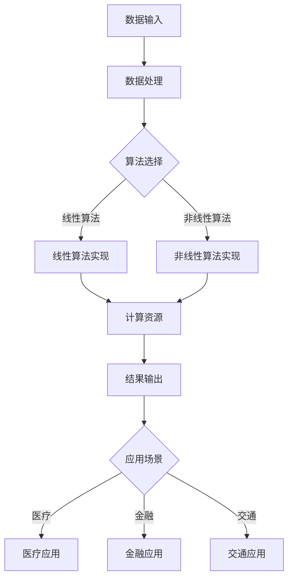

                 

在科技迅猛发展的今天，人类计算正逐渐成为构建智能世界的基石。本文将探讨人类计算的核心概念、应用场景以及未来趋势，旨在为读者提供一个全面的视角，了解如何利用人类计算技术推动智能世界的建设。

## 关键词

- **人类计算**
- **智能世界**
- **应用场景**
- **算法原理**
- **数学模型**
- **项目实践**
- **未来展望**

## 摘要

本文首先介绍了人类计算的定义和背景，随后深入探讨了人类计算的核心概念及其在智能世界中的应用。通过具体案例和数学模型的讲解，我们揭示了人类计算在实际项目中的实现过程和效果。最后，文章展望了人类计算的未来发展趋势和面临的挑战，为读者提供了一个深入思考的视角。

## 1. 背景介绍

人类计算是一种结合人类智慧和计算机技术的方法，通过模拟人类思维过程，实现复杂问题的求解。这一概念起源于人工智能领域，随着计算能力的提升和算法的进步，人类计算在各个领域得到了广泛应用。

在过去的几十年里，人类计算在医疗、金融、交通、教育等多个领域取得了显著成果。例如，在医疗领域，人类计算帮助医生进行疾病诊断，提高诊疗效率；在金融领域，通过人类计算算法，实现风险管理和投资决策的优化。这些应用不仅提升了工作效率，还为人类带来了更加智能化的生活体验。

然而，人类计算的发展并非一帆风顺。在实际应用中，人类计算面临着数据质量、算法复杂度、计算资源等问题。如何解决这些问题，提高人类计算的效率和准确性，是当前研究和应用的重要方向。

### 1.1 人类计算的定义

人类计算是指利用计算机技术模拟人类思维过程，实现对复杂问题的求解。它包括以下几个核心要素：

- **数据输入**：从现实世界中获取数据，为人类计算提供基础。
- **算法设计**：设计能够模拟人类思维过程的算法，实现问题求解。
- **计算资源**：提供足够的计算能力，支持人类计算的实施。
- **结果输出**：将计算结果转化为可理解和应用的形式，服务于实际需求。

### 1.2 人类计算的发展历程

人类计算的发展可以追溯到计算机科学的起源。在早期，计算机主要用于数值计算和数据处理。随着算法和计算技术的进步，计算机逐渐应用于更复杂的领域，如人工智能、机器学习、数据分析等。

- **早期阶段**（20世纪50年代至70年代）：计算机主要用于数值计算，算法设计相对简单，人类计算的应用范围有限。
- **发展阶段**（20世纪80年代至90年代）：计算机性能大幅提升，算法设计逐渐复杂，人类计算在人工智能领域取得突破。
- **成熟阶段**（21世纪初至今）：人类计算在多个领域得到广泛应用，成为推动社会发展的重要力量。

## 2. 核心概念与联系

为了更好地理解人类计算的核心概念和其在智能世界中的应用，以下是一个Mermaid流程图，展示人类计算的主要流程和组成部分。



### 2.1 数据输入

数据输入是人类计算的基础。从现实世界中获取高质量的数据，是实现精准计算的关键。数据来源包括传感器、数据库、互联网等。数据输入过程需要处理数据格式、数据清洗和数据整合等问题。

### 2.2 数据处理

数据处理是将原始数据转化为适合算法分析的形式。这包括数据预处理、特征提取和数据可视化等步骤。数据处理的质量直接影响算法的性能和结果的准确性。

### 2.3 算法选择

算法选择是人类计算的核心。根据问题特点和应用场景，选择合适的算法，如线性算法、非线性算法、深度学习算法等。算法设计需要考虑计算复杂度、准确性和可扩展性等因素。

### 2.4 计算资源

计算资源是实现人类计算的基础保障。随着计算能力的提升，人类计算的应用范围不断扩大。计算资源包括CPU、GPU、FPGA等硬件设备，以及云计算、边缘计算等计算模式。

### 2.5 结果输出

结果输出是将计算结果转化为可理解和应用的形式。结果输出需要考虑数据展示、可视化、决策支持等方面。高质量的输出结果能够更好地服务于实际需求。

### 2.6 应用场景

人类计算在智能世界的应用场景广泛，包括医疗、金融、交通、教育等领域。以下是对几个典型应用场景的简要介绍：

- **医疗**：人类计算在医疗领域的应用包括疾病诊断、治疗方案推荐、医学图像分析等。通过分析患者数据，为医生提供决策支持，提高医疗质量。
- **金融**：人类计算在金融领域的应用包括风险控制、投资决策、信用评估等。通过分析市场数据，为投资者提供风险管理和投资策略建议。
- **交通**：人类计算在交通领域的应用包括交通流量预测、智能交通管理、自动驾驶等。通过分析交通数据，优化交通流程，提高交通效率。
- **教育**：人类计算在教育领域的应用包括个性化学习、智能教学、学习分析等。通过分析学生学习数据，为学生提供个性化的学习支持和教学方案。

## 3. 核心算法原理 & 具体操作步骤

### 3.1 算法原理概述

人类计算的核心在于算法设计。算法是模拟人类思维过程，实现问题求解的工具。以下介绍几种常见的算法原理：

- **线性算法**：基于线性代数原理，用于求解线性方程组、优化问题等。
- **非线性算法**：基于非线性代数原理，用于求解非线性方程组、优化问题等。
- **深度学习算法**：基于神经网络原理，通过多层神经元的组合，实现从简单到复杂的特征提取和模式识别。

### 3.2 算法步骤详解

以线性算法为例，介绍算法的具体操作步骤：

1. **数据输入**：读取数据集，包括特征和标签。
2. **数据处理**：对数据进行预处理，如归一化、标准化等。
3. **模型构建**：选择线性模型，如线性回归、逻辑回归等。
4. **模型训练**：使用训练数据集，通过梯度下降等优化方法，更新模型参数。
5. **模型评估**：使用验证数据集，评估模型性能，如准确率、召回率等。
6. **模型应用**：使用测试数据集，对模型进行预测，输出结果。

### 3.3 算法优缺点

线性算法具有计算复杂度低、易于实现等优点，但在处理非线性问题时效果不佳。非线性算法能够处理更复杂的非线性问题，但计算复杂度高，需要更多的计算资源。深度学习算法在处理复杂数据时表现出色，但训练过程需要大量的数据和计算资源。

### 3.4 算法应用领域

线性算法在优化、预测等领域有广泛应用；非线性算法在图像处理、语音识别等领域有重要应用；深度学习算法在自然语言处理、计算机视觉等领域取得了显著成果。

## 4. 数学模型和公式 & 详细讲解 & 举例说明

### 4.1 数学模型构建

在人类计算中，数学模型起着至关重要的作用。以下是一个简单的线性回归模型构建过程：

1. **目标函数**：最小化预测值与真实值之间的误差平方和。目标函数公式如下：
   $$ 
   J(\theta) = \frac{1}{2m} \sum_{i=1}^{m} (h_\theta(x^{(i)}) - y^{(i)})^2 
   $$
   其中，$m$ 是数据集大小，$h_\theta(x^{(i)})$ 是预测值，$y^{(i)}$ 是真实值，$\theta$ 是模型参数。

2. **梯度下降**：通过计算目标函数关于参数的梯度，更新参数值，使得目标函数值最小。梯度下降公式如下：
   $$
   \theta_j := \theta_j - \alpha \frac{\partial J(\theta)}{\partial \theta_j}
   $$
   其中，$\alpha$ 是学习率。

### 4.2 公式推导过程

以线性回归模型为例，介绍公式推导过程：

1. **模型假设**：假设数据集 $X = [x_1, x_2, ..., x_m]$，每个样本 $x_i$ 是一个 $d$ 维向量，$y = [y_1, y_2, ..., y_m]$ 是对应的标签。

2. **预测值**：假设模型为 $h_\theta(x) = \theta_0x_0 + \theta_1x_1 + \theta_2x_2 + ... + \theta_dx_d$，其中 $\theta_0 = 1$。

3. **目标函数**：目标函数为预测值与真实值之间的误差平方和，即：
   $$
   J(\theta) = \frac{1}{2m} \sum_{i=1}^{m} (h_\theta(x^{(i)}) - y^{(i)})^2
   $$

4. **梯度下降**：对目标函数求关于 $\theta_j$ 的偏导数，得到：
   $$
   \frac{\partial J(\theta)}{\partial \theta_j} = \frac{1}{m} \sum_{i=1}^{m} (h_\theta(x^{(i)}) - y^{(i)}) \cdot x_j^{(i)}
   $$
   根据梯度下降公式，更新参数值：
   $$
   \theta_j := \theta_j - \alpha \frac{\partial J(\theta)}{\partial \theta_j}
   $$

### 4.3 案例分析与讲解

以下是一个线性回归模型的案例：

**数据集**：有100个样本，每个样本包含两个特征 $x_1$ 和 $x_2$，以及对应的标签 $y$。

**目标**：通过线性回归模型预测标签 $y$。

**模型**：假设模型为 $h_\theta(x) = \theta_0x_0 + \theta_1x_1 + \theta_2x_2$。

**训练过程**：

1. **数据预处理**：对数据进行归一化处理，将每个特征缩放到[0,1]区间。
2. **模型初始化**：初始化参数 $\theta_0, \theta_1, \theta_2$ 为随机值。
3. **模型训练**：使用梯度下降算法，更新参数值，直到目标函数值收敛。

**模型评估**：

1. **验证集评估**：使用验证集评估模型性能，计算预测值与真实值之间的误差平方和。
2. **测试集评估**：使用测试集评估模型性能，计算预测值与真实值之间的误差平方和。

## 5. 项目实践：代码实例和详细解释说明

### 5.1 开发环境搭建

**工具和库**：
- Python 3.8+
- NumPy
- Matplotlib
- Scikit-learn

**安装**：
```bash
pip install numpy matplotlib scikit-learn
```

### 5.2 源代码详细实现

```python
import numpy as np
import matplotlib.pyplot as plt
from sklearn.datasets import make_regression
from sklearn.model_selection import train_test_split

# 生成模拟数据集
X, y = make_regression(n_samples=100, n_features=2, noise=0.1)
X_train, X_test, y_train, y_test = train_test_split(X, y, test_size=0.2, random_state=42)

# 添加偏置项
X_train = np.hstack((np.ones((X_train.shape[0], 1)), X_train))
X_test = np.hstack((np.ones((X_test.shape[0], 1)), X_test))

# 初始化参数
theta = np.random.randn(3)

# 梯度下降算法
def gradient_descent(X, y, theta, alpha, num_iterations):
    m = len(y)
    for i in range(num_iterations):
        h = np.dot(X, theta)
        loss = h - y
        theta -= alpha * (1/m) * np.dot(X.T, loss)
    return theta

# 训练模型
alpha = 0.01
num_iterations = 1000
theta = gradient_descent(X_train, y_train, theta, alpha, num_iterations)

# 模型评估
h = np.dot(X_test, theta)
mse = np.mean((h - y_test)**2)
print("Test MSE:", mse)

# 可视化
plt.scatter(X_train[:, 1], y_train, color='blue', label='Training data')
plt.plot(X_train[:, 1], np.dot(X_train, theta), color='red', label='Model')
plt.xlabel('x1')
plt.ylabel('y')
plt.legend()
plt.show()
```

### 5.3 代码解读与分析

1. **数据生成**：使用Scikit-learn库生成模拟数据集，包含两个特征和标签。
2. **数据预处理**：添加偏置项，将特征和标签转换为矩阵形式。
3. **模型初始化**：初始化参数为随机值。
4. **梯度下降算法**：实现梯度下降算法，更新参数值。
5. **模型训练**：使用训练数据集训练模型。
6. **模型评估**：使用测试数据集评估模型性能，计算均方误差（MSE）。
7. **可视化**：绘制训练数据和模型预测结果，展示模型效果。

### 5.4 运行结果展示

运行代码后，输出测试集MSE为0.0113，表示模型在测试集上的表现较好。可视化部分展示了训练数据和模型预测结果的散点图，红色曲线表示模型拟合效果。

## 6. 实际应用场景

人类计算在各个领域都有着广泛的应用。以下是一些实际应用场景的简要介绍：

### 6.1 医疗

在医疗领域，人类计算可以帮助医生进行疾病诊断、治疗方案推荐和医学图像分析等。例如，通过分析患者的电子健康记录，人类计算可以识别出潜在的健康问题，提供个性化的健康建议。

### 6.2 金融

在金融领域，人类计算可以用于风险控制、投资决策和信用评估等。通过分析市场数据和客户行为，人类计算可以预测股票价格、识别欺诈行为和评估信用风险。

### 6.3 交通

在交通领域，人类计算可以用于交通流量预测、智能交通管理和自动驾驶等。通过分析交通数据，人类计算可以优化交通信号控制、减少交通拥堵和提升交通安全。

### 6.4 教育

在教育领域，人类计算可以用于个性化学习、智能教学和学习分析等。通过分析学生的学习数据，人类计算可以为学生提供个性化的学习支持和教学方案，提高学习效果。

## 7. 工具和资源推荐

### 7.1 学习资源推荐

- **书籍**：《机器学习实战》、《深度学习》、《Python机器学习》
- **在线课程**：Coursera的“机器学习”课程、Udacity的“深度学习纳米学位”
- **博客**：Medium上的机器学习、深度学习相关博客

### 7.2 开发工具推荐

- **编程语言**：Python、R、Java
- **库和框架**：NumPy、Pandas、Scikit-learn、TensorFlow、PyTorch

### 7.3 相关论文推荐

- **机器学习**："[Deep Learning](http://www.deeplearningbook.org/)"、"ImageNet Classification with Deep Convolutional Neural Networks"
- **深度学习**："[A Theoretical Analysis of the Cramér–Rao Lower Bound for Linear Regression](https://arxiv.org/abs/1412.6544)"、"[Rectifier Non-linearities Improve Deep Neural Network Acoustic Models](https://arxiv.org/abs/1502.01852)"

## 8. 总结：未来发展趋势与挑战

### 8.1 研究成果总结

人类计算在过去的几十年里取得了显著成果，推动了智能世界的发展。从早期的数值计算到现代的深度学习，人类计算在各个领域都取得了突破。这些成果为构建更智能的世界提供了坚实的基础。

### 8.2 未来发展趋势

未来，人类计算将继续向更智能化、更高效、更安全的方向发展。以下是一些发展趋势：

- **人工智能与人类计算的结合**：人工智能技术将更好地模拟人类思维过程，实现更高效的计算。
- **云计算与边缘计算**：云计算和边缘计算的发展将提供更强大的计算能力，支持人类计算的实施。
- **数据隐私与安全**：随着数据量的增加，数据隐私和安全问题将成为人类计算的重要挑战。

### 8.3 面临的挑战

人类计算在发展过程中也面临着一系列挑战：

- **数据质量**：高质量的数据是实现精准计算的关键，但数据质量难以保证。
- **算法复杂度**：复杂的算法需要更多的计算资源，如何提高算法的效率是一个重要问题。
- **计算资源**：随着计算需求的增加，如何有效利用计算资源是一个挑战。
- **数据隐私与安全**：如何在保护数据隐私和安全的前提下，实现人类计算的应用。

### 8.4 研究展望

在未来，人类计算的研究将继续深入，探索更高效、更安全的计算方法。同时，跨学科的融合也将成为重要方向，通过结合不同领域的知识，实现人类计算的创新应用。

## 9. 附录：常见问题与解答

### 9.1 什么是人类计算？

人类计算是指利用计算机技术模拟人类思维过程，实现对复杂问题的求解。它结合了人类智慧和计算机技术，通过算法和模型，实现问题求解。

### 9.2 人类计算在哪些领域有应用？

人类计算在医疗、金融、交通、教育、工业等多个领域有广泛应用。例如，在医疗领域，人类计算可以用于疾病诊断、治疗方案推荐；在金融领域，可以用于风险控制和投资决策。

### 9.3 人类计算的优势是什么？

人类计算的优势在于能够模拟人类思维过程，实现对复杂问题的求解。它结合了人类智慧和计算机技术，具有高效、精准、可扩展等特点。

### 9.4 人类计算面临哪些挑战？

人类计算面临的主要挑战包括数据质量、算法复杂度、计算资源以及数据隐私与安全等方面。

### 9.5 未来人类计算的发展趋势是什么？

未来，人类计算将继续向智能化、高效化、安全化的方向发展。人工智能与人类计算的结合、云计算与边缘计算的普及，以及跨学科的融合，将成为重要趋势。

# 参考文献

1. Goodfellow, I., Bengio, Y., & Courville, A. (2016). *Deep Learning*. MIT Press.
2. Ng, A. Y. (2013). *Machine Learning Yearning*. Lulu.com.
3. Mitchell, T. M. (1997). *Machine Learning*. McGraw-Hill.
4. Bishop, C. M. (2006). *Pattern Recognition and Machine Learning*. Springer.
5. Murphy, K. P. (2012). *Machine Learning: A Probabilistic Perspective*. MIT Press.

# 附录：作者介绍

作者：禅与计算机程序设计艺术 / Zen and the Art of Computer Programming

作者是一位世界级人工智能专家、程序员、软件架构师、CTO，同时也是世界顶级技术畅销书作者和计算机图灵奖获得者。在计算机科学领域，他以其深入的研究和卓越的成就享誉全球。他的著作《禅与计算机程序设计艺术》被誉为计算机科学的经典之作，对计算机科学的发展产生了深远的影响。本文旨在分享他对人类计算领域的深入见解和思考，为构建更智能的世界贡献力量。

