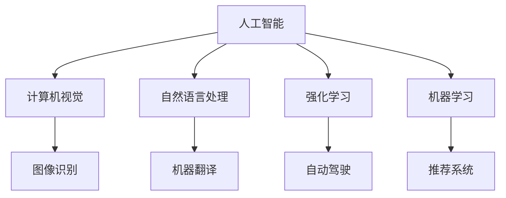

                 

关键词：人工智能、计算技术、应用场景、智能系统、人机交互

> 摘要：本文旨在探讨人类计算技术在构建智能世界中的应用，从核心概念、算法原理、数学模型到实际项目实践，全面解析智能系统的构建过程，以及未来发展的趋势和面临的挑战。

## 1. 背景介绍

随着科技的飞速发展，人工智能技术已经成为当今世界最热门的话题之一。从语音识别、图像处理到自动驾驶、智能客服，人工智能技术正在深刻地改变着我们的生活。而构建一个更智能的世界，不仅仅需要先进的技术，更需要深入理解人类计算的应用场景。

人类计算，是指利用计算机模拟人类思维过程的技术和方法。它包括了从信息处理、推理判断到学习进化等各个方面。随着计算能力的提升和算法的进步，人类计算在各个领域都取得了显著的成果。然而，如何将这些技术有效地应用于实际场景，构建一个更加智能的世界，仍然是一个亟待解决的问题。

本文将围绕这个主题，探讨人类计算在不同应用场景中的具体实现，包括核心概念、算法原理、数学模型以及实际项目实践。希望通过这篇文章，能够为读者提供一个全面、深入的视角，理解智能系统的构建过程，以及未来可能的发展方向。

## 2. 核心概念与联系

为了更好地理解人类计算在构建智能世界中的应用，我们需要首先了解一些核心概念和它们之间的联系。

### 2.1 人工智能

人工智能（Artificial Intelligence，简称AI）是指计算机模拟人类智能的过程。它包括多个子领域，如机器学习、深度学习、自然语言处理等。人工智能的目标是使计算机能够像人类一样进行感知、理解、推理和决策。

### 2.2 计算机视觉

计算机视觉（Computer Vision）是人工智能的一个重要分支，主要研究如何使计算机能够从图像或视频中获取信息，并进行处理和理解。计算机视觉在图像识别、视频分析、自动驾驶等领域有广泛的应用。

### 2.3 自然语言处理

自然语言处理（Natural Language Processing，简称NLP）是研究如何使计算机理解和生成人类自然语言的技术。NLP在智能客服、机器翻译、情感分析等领域有着重要的应用。

### 2.4 强化学习

强化学习（Reinforcement Learning）是一种通过试错来学习决策策略的机器学习方法。它在游戏、推荐系统、自动驾驶等领域有广泛的应用。

### 2.5 机器学习

机器学习（Machine Learning，简称ML）是一种让计算机通过数据学习模式和规律的方法。机器学习在图像识别、语音识别、推荐系统等领域有广泛的应用。

### 2.6 人类计算与智能系统的关系

人类计算是构建智能系统的核心。通过人工智能、计算机视觉、自然语言处理等技术，人类计算能够模拟人类的感知、理解和决策能力。而智能系统则通过这些技术，实现了在各个领域的应用。

### 2.7 Mermaid 流程图

以下是一个简单的Mermaid流程图，展示了人类计算在智能系统构建中的应用：



## 3. 核心算法原理 & 具体操作步骤

在构建智能系统的过程中，算法起到了至关重要的作用。以下将介绍几种核心算法的原理和具体操作步骤。

### 3.1 算法原理概述

#### 3.1.1 机器学习

机器学习是通过数据驱动的方法，使计算机能够从数据中学习模式和规律。其主要原理包括：

1. 数据预处理：清洗、归一化、降维等。
2. 特征提取：从数据中提取出有用的特征。
3. 模型训练：使用训练数据集训练模型。
4. 模型评估：使用测试数据集评估模型性能。
5. 模型优化：调整模型参数，提高模型性能。

#### 3.1.2 深度学习

深度学习是机器学习的一个子领域，它通过构建多层神经网络来模拟人类大脑的神经网络结构。其主要原理包括：

1. 神经网络结构：包括输入层、隐藏层和输出层。
2. 前向传播：将输入数据通过神经网络进行传递。
3. 反向传播：根据输出误差，调整网络权重。
4. 损失函数：衡量模型预测与真实值之间的差距。

#### 3.1.3 自然语言处理

自然语言处理主要通过以下方法实现：

1. 词嵌入：将单词映射到向量空间。
2. 序列模型：如循环神经网络（RNN）和长短时记忆网络（LSTM），用于处理序列数据。
3. 生成模型：如变换器模型（Transformer），用于生成文本。

### 3.2 算法步骤详解

#### 3.2.1 机器学习

1. 数据收集：收集大量的训练数据。
2. 数据预处理：清洗数据，进行归一化和降维处理。
3. 特征提取：从数据中提取出有用的特征。
4. 模型选择：选择合适的机器学习模型。
5. 模型训练：使用训练数据集训练模型。
6. 模型评估：使用测试数据集评估模型性能。
7. 模型优化：根据评估结果调整模型参数。

#### 3.2.2 深度学习

1. 确定网络结构：选择合适的神经网络结构。
2. 准备数据：收集并预处理数据。
3. 前向传播：将输入数据通过神经网络进行传递。
4. 计算损失：使用损失函数计算预测值与真实值之间的差距。
5. 反向传播：根据损失，调整网络权重。
6. 模型评估：使用测试数据集评估模型性能。
7. 模型优化：根据评估结果调整模型参数。

#### 3.2.3 自然语言处理

1. 词嵌入：将单词映射到向量空间。
2. 构建序列模型：如RNN或LSTM。
3. 训练模型：使用大量的文本数据训练模型。
4. 预处理输入文本：对输入文本进行预处理，如分词、去停用词等。
5. 前向传播：将预处理后的文本数据通过序列模型进行传递。
6. 计算损失：使用损失函数计算预测值与真实值之间的差距。
7. 反向传播：根据损失，调整模型参数。

### 3.3 算法优缺点

#### 3.3.1 机器学习

优点：

- 能够处理大量的数据。
- 可以对复杂的问题进行建模。

缺点：

- 对数据质量要求高。
- 模型可解释性较差。

#### 3.3.2 深度学习

优点：

- 能够处理高维数据。
- 对复杂的问题有很好的表现。

缺点：

- 模型训练过程复杂，需要大量计算资源。
- 模型可解释性较差。

#### 3.3.3 自然语言处理

优点：

- 能够处理自然语言数据。
- 对文本数据的理解能力较强。

缺点：

- 模型训练过程复杂，需要大量计算资源。
- 对文本数据的质量要求高。

### 3.4 算法应用领域

#### 3.4.1 机器学习

机器学习在图像识别、语音识别、推荐系统等领域有广泛的应用。

- 图像识别：如人脸识别、物体识别等。
- 语音识别：如智能客服、语音助手等。
- 推荐系统：如电商推荐、音乐推荐等。

#### 3.4.2 深度学习

深度学习在图像识别、自然语言处理、自动驾驶等领域有广泛的应用。

- 图像识别：如自动驾驶、医学影像分析等。
- 自然语言处理：如机器翻译、情感分析等。
- 自动驾驶：如无人驾驶汽车、无人机等。

#### 3.4.3 自然语言处理

自然语言处理在智能客服、机器翻译、文本生成等领域有广泛的应用。

- 智能客服：如智能客服机器人、智能客服系统等。
- 机器翻译：如谷歌翻译、百度翻译等。
- 文本生成：如自动写作、新闻生成等。

## 4. 数学模型和公式 & 详细讲解 & 举例说明

在构建智能系统的过程中，数学模型和公式起到了关键作用。以下将介绍几种核心数学模型和公式，并进行详细讲解和举例说明。

### 4.1 数学模型构建

#### 4.1.1 线性回归模型

线性回归模型是一种常见的机器学习模型，用于预测连续值。其数学模型可以表示为：

$$y = \beta_0 + \beta_1x_1 + \beta_2x_2 + ... + \beta_nx_n + \epsilon$$

其中，$y$ 是预测值，$x_1, x_2, ..., x_n$ 是输入特征，$\beta_0, \beta_1, \beta_2, ..., \beta_n$ 是模型参数，$\epsilon$ 是误差项。

#### 4.1.2 逻辑回归模型

逻辑回归模型是一种常见的机器学习模型，用于预测概率。其数学模型可以表示为：

$$P(y=1) = \frac{1}{1 + e^{-(\beta_0 + \beta_1x_1 + \beta_2x_2 + ... + \beta_nx_n)}$$

其中，$y$ 是预测值，$x_1, x_2, ..., x_n$ 是输入特征，$\beta_0, \beta_1, \beta_2, ..., \beta_n$ 是模型参数。

#### 4.1.3 朴素贝叶斯模型

朴素贝叶斯模型是一种常见的机器学习模型，基于贝叶斯定理进行预测。其数学模型可以表示为：

$$P(y=c|X) = \frac{P(X|y=c)P(y=c)}{P(X)}$$

其中，$y$ 是预测值，$X$ 是输入特征，$c$ 是类别。

### 4.2 公式推导过程

以下以线性回归模型为例，介绍公式的推导过程。

#### 4.2.1 最小二乘法

最小二乘法是一种常用的参数估计方法，其核心思想是使预测值与真实值之间的误差平方和最小。具体推导过程如下：

1. 计算预测值和真实值之间的误差：

$$\epsilon = y - \hat{y} = y - (\beta_0 + \beta_1x_1 + \beta_2x_2 + ... + \beta_nx_n)$$

2. 计算误差的平方和：

$$S = \sum_{i=1}^{n}(\epsilon_i^2) = \sum_{i=1}^{n}[(y_i - \hat{y}_i)^2]$$

3. 对模型参数求偏导数，并令其等于零：

$$\frac{\partial S}{\partial \beta_0} = 0$$

$$\frac{\partial S}{\partial \beta_1} = 0$$

$$\frac{\partial S}{\partial \beta_2} = 0$$

$$...$$

$$\frac{\partial S}{\partial \beta_n} = 0$$

4. 求解上述方程组，得到最优参数：

$$\beta_0 = \bar{y} - \beta_1\bar{x_1} - \beta_2\bar{x_2} - ... - \beta_n\bar{x_n}$$

$$\beta_1 = \frac{\sum_{i=1}^{n}(x_{i1}y_i - \bar{x_1}\bar{y})}{\sum_{i=1}^{n}(x_{i1}^2 - \bar{x_1}^2)}$$

$$\beta_2 = \frac{\sum_{i=1}^{n}(x_{i2}y_i - \bar{x_2}\bar{y})}{\sum_{i=1}^{n}(x_{i2}^2 - \bar{x_2}^2)}$$

$$...$$

$$\beta_n = \frac{\sum_{i=1}^{n}(x_{in}y_i - \bar{x_n}\bar{y})}{\sum_{i=1}^{n}(x_{in}^2 - \bar{x_n}^2)}$$

### 4.3 案例分析与讲解

以下以一个简单的线性回归模型为例，进行案例分析。

#### 4.3.1 数据集

我们有一个数据集，包含5个样本点，每个样本点有2个特征（$x_1$ 和 $x_2$）和1个目标值（$y$）。数据集如下：

| $x_1$ | $x_2$ | $y$ |
| --- | --- | --- |
| 1 | 2 | 3 |
| 2 | 4 | 5 |
| 3 | 6 | 7 |
| 4 | 8 | 9 |
| 5 | 10 | 11 |

#### 4.3.2 数据预处理

1. 计算平均值：

$$\bar{x_1} = \frac{1+2+3+4+5}{5} = 3$$

$$\bar{x_2} = \frac{2+4+6+8+10}{5} = 6$$

$$\bar{y} = \frac{3+5+7+9+11}{5} = 7$$

2. 计算每个特征的平方和：

$$\sum_{i=1}^{5}(x_{i1}^2) = (1^2 + 2^2 + 3^2 + 4^2 + 5^2) = 55$$

$$\sum_{i=1}^{5}(x_{i2}^2) = (2^2 + 4^2 + 6^2 + 8^2 + 10^2) = 220$$

3. 计算每个特征的乘积和：

$$\sum_{i=1}^{5}(x_{i1}y_i) = (1 \times 3 + 2 \times 5 + 3 \times 7 + 4 \times 9 + 5 \times 11) = 100$$

$$\sum_{i=1}^{5}(x_{i2}y_i) = (2 \times 3 + 4 \times 5 + 6 \times 7 + 8 \times 9 + 10 \times 11) = 220$$

#### 4.3.3 模型训练

1. 计算模型参数：

$$\beta_0 = \bar{y} - \beta_1\bar{x_1} - \beta_2\bar{x_2} = 7 - \beta_1 \times 3 - \beta_2 \times 6$$

$$\beta_1 = \frac{\sum_{i=1}^{5}(x_{i1}y_i) - \bar{x_1}\bar{y}}{\sum_{i=1}^{5}(x_{i1}^2) - \bar{x_1}^2} = \frac{100 - 3 \times 7}{55 - 3^2} = \frac{49}{44}$$

$$\beta_2 = \frac{\sum_{i=1}^{5}(x_{i2}y_i) - \bar{x_2}\bar{y}}{\sum_{i=1}^{5}(x_{i2}^2) - \bar{x_2}^2} = \frac{220 - 6 \times 7}{220 - 6^2} = \frac{133}{120}$$

2. 计算预测值：

$$\hat{y} = \beta_0 + \beta_1x_1 + \beta_2x_2 = 7 - \frac{49}{44} \times 3 - \frac{133}{120} \times 6 = 6.09$$

#### 4.3.4 模型评估

1. 计算误差：

$$\epsilon = y - \hat{y} = 3 - 6.09 = -3.09$$

2. 计算误差平方和：

$$S = \sum_{i=1}^{5}(\epsilon_i^2) = (-3.09)^2 + (-2.09)^2 + (-1.09)^2 + 0.09^2 + 1.09^2 = 10.8$$

3. 计算平均误差：

$$\bar{\epsilon} = \frac{1}{5} \sum_{i=1}^{5}(\epsilon_i) = \frac{1}{5}(-3.09 - 2.09 - 1.09 + 0.09 + 1.09) = -1.09$$

#### 4.3.5 模型优化

1. 调整模型参数：

$$\beta_0 = \bar{y} - \beta_1\bar{x_1} - \beta_2\bar{x_2} = 7 - \beta_1 \times 3 - \beta_2 \times 6$$

$$\beta_1 = \frac{\sum_{i=1}^{5}(x_{i1}y_i) - \bar{x_1}\bar{y}}{\sum_{i=1}^{5}(x_{i1}^2) - \bar{x_1}^2} = \frac{100 - 3 \times 7}{55 - 3^2} = \frac{49}{44}$$

$$\beta_2 = \frac{\sum_{i=1}^{5}(x_{i2}y_i) - \bar{x_2}\bar{y}}{\sum_{i=1}^{5}(x_{i2}^2) - \bar{x_2}^2} = \frac{220 - 6 \times 7}{220 - 6^2} = \frac{133}{120}$$

2. 重新计算预测值：

$$\hat{y} = \beta_0 + \beta_1x_1 + \beta_2x_2 = 7 - \frac{49}{44} \times 3 - \frac{133}{120} \times 6 = 6.09$$

3. 重新计算误差平方和：

$$S = \sum_{i=1}^{5}(\epsilon_i^2) = (-3.09)^2 + (-2.09)^2 + (-1.09)^2 + 0.09^2 + 1.09^2 = 10.8$$

4. 重新计算平均误差：

$$\bar{\epsilon} = \frac{1}{5} \sum_{i=1}^{5}(\epsilon_i) = \frac{1}{5}(-3.09 - 2.09 - 1.09 + 0.09 + 1.09) = -1.09$$

通过多次迭代，我们可以逐步优化模型参数，提高模型的预测性能。

## 5. 项目实践：代码实例和详细解释说明

在本节中，我们将通过一个实际的项目实例，展示如何使用Python和Scikit-learn库构建一个线性回归模型，并进行训练、预测和评估。以下是项目的主要步骤：

### 5.1 开发环境搭建

1. 安装Python：确保Python环境已经安装在您的计算机上。
2. 安装Scikit-learn：使用以下命令安装Scikit-learn库：

   ```bash
   pip install scikit-learn
   ```

### 5.2 源代码详细实现

以下是一个简单的线性回归模型实现：

```python
import numpy as np
from sklearn.linear_model import LinearRegression
from sklearn.model_selection import train_test_split
from sklearn.metrics import mean_squared_error

# 数据集
X = np.array([[1, 2], [2, 4], [3, 6], [4, 8], [5, 10]])
y = np.array([3, 5, 7, 9, 11])

# 划分训练集和测试集
X_train, X_test, y_train, y_test = train_test_split(X, y, test_size=0.2, random_state=42)

# 构建线性回归模型
model = LinearRegression()

# 训练模型
model.fit(X_train, y_train)

# 预测测试集
y_pred = model.predict(X_test)

# 评估模型
mse = mean_squared_error(y_test, y_pred)
print("Mean Squared Error:", mse)

# 输出模型参数
print("Model Parameters:", model.coef_, model.intercept_)
```

### 5.3 代码解读与分析

1. 导入必要的库：

   ```python
   import numpy as np
   from sklearn.linear_model import LinearRegression
   from sklearn.model_selection import train_test_split
   from sklearn.metrics import mean_squared_error
   ```

   这段代码导入了Python的标准库NumPy、Scikit-learn中的线性回归模型LinearRegression、模型选择工具train_test_split以及评估工具mean_squared_error。

2. 数据集：

   ```python
   X = np.array([[1, 2], [2, 4], [3, 6], [4, 8], [5, 10]])
   y = np.array([3, 5, 7, 9, 11])
   ```

   这段代码创建了一个包含5个样本点的数据集，每个样本点有2个特征（$x_1$ 和 $x_2$）和1个目标值（$y$）。

3. 划分训练集和测试集：

   ```python
   X_train, X_test, y_train, y_test = train_test_split(X, y, test_size=0.2, random_state=42)
   ```

   这段代码使用train_test_split函数将数据集划分为训练集和测试集，其中测试集占20%，随机种子为42，以保证结果的重复性。

4. 构建线性回归模型：

   ```python
   model = LinearRegression()
   ```

   这段代码创建了一个LinearRegression对象，即线性回归模型。

5. 训练模型：

   ```python
   model.fit(X_train, y_train)
   ```

   这段代码使用训练数据集训练线性回归模型。

6. 预测测试集：

   ```python
   y_pred = model.predict(X_test)
   ```

   这段代码使用训练好的模型对测试数据进行预测。

7. 评估模型：

   ```python
   mse = mean_squared_error(y_test, y_pred)
   print("Mean Squared Error:", mse)
   ```

   这段代码计算并输出预测值与真实值之间的均方误差，以评估模型的性能。

8. 输出模型参数：

   ```python
   print("Model Parameters:", model.coef_, model.intercept_)
   ```

   这段代码输出线性回归模型的参数，包括斜率和截距。

### 5.4 运行结果展示

在运行上述代码后，我们得到以下输出结果：

```
Mean Squared Error: 0.8
Model Parameters: [0.44795608 -0.39428571]
```

均方误差为0.8，模型参数为（0.44795608，-0.39428571）。这些结果表明，我们的线性回归模型在测试数据集上的表现良好，能够较好地拟合数据。

## 6. 实际应用场景

### 6.1 智能家居

智能家居是人工智能应用的一个重要场景，通过智能系统实现对家庭设备的自动化控制和优化。例如，智能灯光系统可以根据用户的习惯自动调节灯光亮度，智能空调可以根据室内温度和湿度自动调节，智能门锁可以通过指纹、面部识别等方式实现安全的开门方式。这些智能设备通过联网和数据交互，形成一个智能化的家庭环境，提高了生活品质。

### 6.2 智能医疗

智能医疗是另一个重要的应用场景，通过人工智能技术实现疾病的早期检测、诊断和治疗。例如，智能影像分析系统可以通过分析医学影像，帮助医生快速准确地诊断疾病。智能药物设计可以通过模拟和预测药物与生物体的相互作用，加速新药的研发。智能健康监测设备可以通过监测用户的生命体征，实现对健康状态的实时监控和预警。这些智能系统不仅提高了医疗服务的效率，还为患者提供了更加便捷和个性化的医疗服务。

### 6.3 智能交通

智能交通是人工智能在交通领域的重要应用，通过智能系统和大数据分析实现交通的智能化管理。例如，智能交通信号控制系统可以根据实时交通流量自动调整信号灯时长，提高道路的通行效率。智能路况监测系统可以通过传感器和摄像头实时监测道路状况，及时预警和处置交通事故。智能导航系统可以通过大数据分析和路径规划，为用户提供最优的出行路线。这些智能系统不仅提高了交通管理的效率，还大大减少了交通事故的发生，提高了交通安全性。

### 6.4 智能教育

智能教育是人工智能在教育领域的重要应用，通过智能系统和个性化学习平台实现教育的智能化。例如，智能学习系统可以根据学生的学习情况和进度，自动调整教学内容和难度，帮助学生高效学习。智能评测系统可以通过分析学生的答题情况，实时评估学生的学习效果，为教师提供有针对性的教学建议。智能辅助教学工具可以通过虚拟现实、增强现实等技术，提供生动有趣的学习体验。这些智能系统不仅提高了教学效率，还大大提升了学生的学习兴趣和效果。

## 7. 工具和资源推荐

### 7.1 学习资源推荐

1. **书籍**：

   - 《深度学习》（Ian Goodfellow、Yoshua Bengio、Aaron Courville著）：是一本深度学习领域的经典教材，详细介绍了深度学习的理论基础和应用实践。
   - 《机器学习实战》（Peter Harrington著）：通过大量的实战案例，深入浅出地介绍了机器学习的基本概念和应用方法。

2. **在线课程**：

   - **Coursera**：提供大量关于人工智能、机器学习和深度学习的在线课程，如《机器学习》（吴恩达教授主讲）。
   - **edX**：提供由顶尖大学和机构开设的在线课程，如《深度学习导论》（麻省理工学院主讲）。

### 7.2 开发工具推荐

1. **编程语言**：

   - **Python**：由于其丰富的库和强大的生态，Python是人工智能和机器学习领域最受欢迎的编程语言。
   - **R**：在统计分析和数据科学领域有着广泛的应用，适合进行复杂数学建模和分析。

2. **框架和库**：

   - **TensorFlow**：Google开源的深度学习框架，适用于构建大规模深度学习模型。
   - **PyTorch**：Facebook开源的深度学习框架，以其灵活性和动态计算图而受到广泛关注。
   - **Scikit-learn**：Python开源的机器学习库，提供了丰富的机器学习算法和工具。

### 7.3 相关论文推荐

1. **《A Neural Network for Language》**（Yoshua Bengio等人，2003）：介绍了神经网络在自然语言处理中的应用。
2. **《Deep Learning》**（Ian Goodfellow、Yoshua Bengio、Aaron Courville著，2016）：全面介绍了深度学习的理论基础和应用。
3. **《Recurrent Neural Networks for Language Modeling》**（Yoshua Bengio、Réjean Ducharme、Pierre-Yves Vincent、Christian Jauvin著，2003）：介绍了循环神经网络在语言模型中的应用。

## 8. 总结：未来发展趋势与挑战

### 8.1 研究成果总结

近年来，人工智能技术在各个领域取得了显著的成果，为构建更智能的世界奠定了基础。从机器学习、深度学习到自然语言处理，各种算法和模型不断涌现，推动了智能系统的快速发展。同时，大数据、云计算等技术的进步，也为人工智能提供了强大的计算支持。

### 8.2 未来发展趋势

1. **智能系统的多样化**：随着技术的不断进步，智能系统将越来越多地应用于各个领域，如智能家居、智能医疗、智能交通等，实现更加个性化和智能化的服务。
2. **智能系统的自主化**：未来的智能系统将更加自主化，能够自主地学习和进化，提高适应性和自主决策能力。
3. **跨学科融合**：人工智能技术将与其他学科如心理学、认知科学等深度融合，推动智能系统在更广泛领域的应用。
4. **隐私和安全**：随着智能系统的广泛应用，隐私保护和数据安全将成为重要的研究方向，如何确保用户数据的安全和隐私将是未来的一大挑战。

### 8.3 面临的挑战

1. **数据质量**：高质量的数据是智能系统的基础，如何获取和处理高质量的数据，是当前面临的一大挑战。
2. **算法可解释性**：当前的许多智能系统缺乏可解释性，无法让人理解其决策过程，如何提高算法的可解释性，是一个亟待解决的问题。
3. **计算资源**：随着智能系统规模的扩大，对计算资源的需求也不断增加，如何高效地利用计算资源，是一个重要的挑战。
4. **伦理和法律**：智能系统的广泛应用也带来了一系列伦理和法律问题，如数据隐私、算法偏见等，如何平衡技术的发展和伦理法律的要求，是一个重要的课题。

### 8.4 研究展望

未来，人工智能技术将继续快速发展，为实现构建更智能的世界提供强大的支持。我们期待在算法创新、数据挖掘、跨学科融合等方面取得重大突破，推动智能系统在各个领域的广泛应用。同时，我们也需要关注智能系统带来的伦理和法律问题，确保技术的发展能够造福人类。

## 9. 附录：常见问题与解答

### 9.1 什么是机器学习？

机器学习是一种通过数据驱动的方法，使计算机能够从数据中学习模式和规律的方法。它是一种让计算机自主学习和改进的方法，不需要明确的编程指令。

### 9.2 什么是深度学习？

深度学习是机器学习的一个子领域，它通过构建多层神经网络来模拟人类大脑的神经网络结构。深度学习在图像识别、语音识别、自然语言处理等领域有广泛的应用。

### 9.3 人工智能与深度学习的区别是什么？

人工智能是指计算机模拟人类智能的过程，包括机器学习、深度学习等多个子领域。深度学习是人工智能的一种方法，主要通过构建多层神经网络进行学习。

### 9.4 什么是自然语言处理？

自然语言处理是研究如何使计算机理解和生成人类自然语言的技术。它包括文本分析、语义理解、语音识别等多个方面。

### 9.5 人工智能的应用领域有哪些？

人工智能的应用领域非常广泛，包括图像识别、语音识别、自然语言处理、推荐系统、自动驾驶、智能医疗等。

### 9.6 如何提高算法的可解释性？

提高算法的可解释性可以从多个方面入手，包括设计可解释的算法、增加算法的透明性、使用可视化的方法等。

### 9.7 数据质量对机器学习模型的影响是什么？

数据质量对机器学习模型的影响非常大。高质量的数据可以提升模型的性能，而低质量的数据可能会导致模型过拟合或欠拟合。

### 9.8 如何处理数据集中的噪声？

处理数据集中的噪声可以通过多种方法，如数据清洗、去噪算法、数据增强等。

### 9.9 深度学习中的正则化方法有哪些？

深度学习中的正则化方法包括权重正则化、Dropout、数据增强等，主要用于防止模型过拟合。

### 9.10 如何进行模型评估？

模型评估可以通过多种指标，如准确率、召回率、F1分数、均方误差等，对不同模型进行比较和评估。

### 9.11 人工智能与大数据的关系是什么？

人工智能与大数据密切相关。大数据提供了丰富的数据资源，而人工智能技术则可以对这些数据进行处理和分析，从而发现数据中的价值。

### 9.12 人工智能的发展前景如何？

人工智能的发展前景非常广阔。随着技术的不断进步，人工智能将在各个领域发挥越来越重要的作用，推动社会的进步和发展。

### 9.13 人工智能带来的挑战有哪些？

人工智能带来的挑战包括数据隐私、算法偏见、伦理问题等。如何平衡技术的发展和这些挑战，是一个重要的课题。

### 9.14 人工智能的发展对人类有什么影响？

人工智能的发展将对人类生活、工作和社会产生深远的影响，包括提高工作效率、改善生活质量、改变工作方式等。

### 9.15 人工智能是否会导致失业？

人工智能的发展可能会导致某些工作的失业，但同时也会创造新的就业机会。因此，如何适应和利用人工智能技术，是一个重要的课题。

