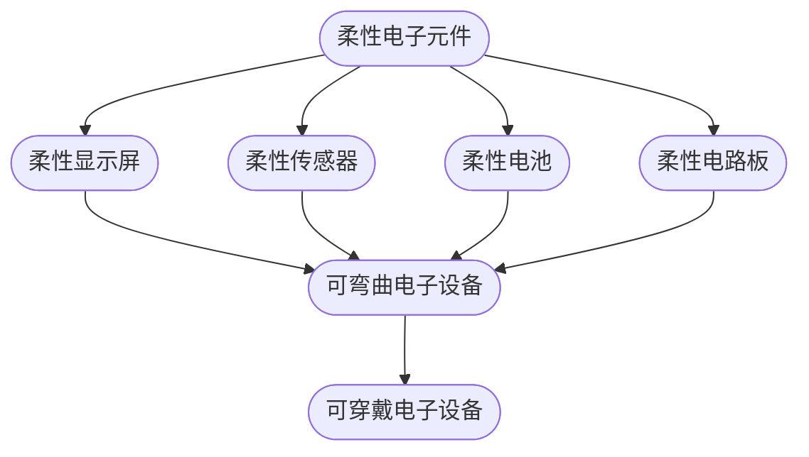

                 

关键词：柔性电子，可弯曲电子，可穿戴电子，触控技术，传感器，导电聚合物，半导体，微电子，人工智能，物联网

> 摘要：本文将深入探讨柔性电子技术及其在可弯曲和可穿戴电子设备中的应用。通过梳理其核心概念、算法原理、数学模型、实践案例，我们将全面了解这一前沿科技领域的现状与发展潜力。

## 1. 背景介绍

柔性电子技术是一种创新性的电子科技，它将传统的硬质电子元件转化为柔性或可变形的形态。这一技术的发展源于对便携式设备、可穿戴设备以及新兴应用场景的日益增长的需求。传统的电子设备通常具有固定的形状和尺寸，而柔性电子技术则赋予这些设备新的可能性，使得它们可以更加轻薄、便携，甚至可以直接嵌入衣物或皮肤。

### 柔性电子技术的兴起

柔性电子技术的兴起可以追溯到20世纪末，当时研究人员开始探索如何将电子元件制作在柔性基材上。随着导电聚合物、纳米材料等新型材料的发现，柔性电子技术的可行性得到了极大提升。近年来，随着物联网（IoT）和人工智能（AI）技术的快速发展，柔性电子技术在智能穿戴设备、医疗监测、交互式电子皮肤等领域展现出巨大的应用潜力。

### 可弯曲和可穿戴电子设备的定义

可弯曲电子设备是指那些能够根据需要弯曲、折叠或卷曲的电子设备，如柔性显示屏、可弯曲传感器等。这些设备具有更高的灵活性和适应性，能够更好地满足人们多样化的需求。

可穿戴电子设备则是指直接附着在人体表面，如衣物、手表、眼镜等，能够提供实时健康监测、环境感知等功能。随着人们对健康和生活质量要求的提高，可穿戴电子设备已经成为现代生活中不可或缺的一部分。

## 2. 核心概念与联系

### 柔性电子元件

柔性电子元件包括柔性显示屏、柔性传感器、柔性电池和柔性电路板等。这些元件的制作通常采用导电聚合物、导电纳米纤维、石墨烯等新材料。

#### 柔性显示屏

柔性显示屏通过特殊的制造技术，使得显示屏可以弯曲而不影响其显示效果。这种显示屏广泛应用于可穿戴设备、智能手表、智能眼镜等。

#### 柔性传感器

柔性传感器可以贴合在人体表面，实时监测心率、体温、运动轨迹等生理数据，为健康监测提供支持。

#### 柔性电池

柔性电池具有高能量密度和良好的柔韧性，可以适应不同形状的设备，延长设备的使用寿命。

#### 柔性电路板

柔性电路板（Flex-PCB）是将电子元件和线路印刷在柔性基材上，可以弯曲和折叠，适用于制造柔性设备。

### 可弯曲和可穿戴电子设备的架构

#### 柔性显示屏


#### 柔性传感器


#### 柔性电池


#### 柔性电路板


### Mermaid 流程图



## 3. 核心算法原理 & 具体操作步骤

### 3.1 算法原理概述

柔性电子技术的核心在于材料的导电性和柔韧性。导电聚合物和纳米材料是制造柔性电子元件的主要材料。这些材料具有良好的导电性能和柔性，能够适应不同形状的设备。

### 3.2 算法步骤详解

#### 3.2.1 柔性显示屏制作

1. 选择合适的导电聚合物材料。
2. 将导电聚合物溶解在适当的溶剂中。
3. 使用涂覆技术将导电聚合物涂覆在透明基材上。
4. 通过热处理工艺使导电聚合物固化。

#### 3.2.2 柔性传感器制作

1. 选择导电纳米纤维材料。
2. 将导电纳米纤维溶解在适当的溶剂中。
3. 通过静电纺丝技术制备柔性纳米纤维膜。
4. 将纳米纤维膜贴合在传感器基材上。

#### 3.2.3 柔性电池制作

1. 选择合适的电解质材料。
2. 制备电极材料。
3. 将电极材料与电解质材料组装在一起。
4. 通过卷对卷技术制备柔性电池。

#### 3.2.4 柔性电路板制作

1. 设计电路图。
2. 制备柔性电路板基材。
3. 通过光刻和蚀刻工艺制作电路图案。
4. 涂覆导电涂层并固化。

### 3.3 算法优缺点

#### 优点

- **灵活性高**：柔性电子元件可以适应不同形状和尺寸的设备，提高设备的便携性和美观度。
- **耐用性强**：柔性电子元件具有更好的抗摔性和耐弯折性，延长设备的使用寿命。
- **多功能性**：柔性电子元件可以集成多种功能，如显示、传感、充电等。

#### 缺点

- **成本较高**：柔性电子元件的制作过程复杂，成本较高，限制了大规模应用的推广。
- **性能限制**：柔性电子元件的性能相比传统硬质元件仍有待提升。

### 3.4 算法应用领域

柔性电子技术已经广泛应用于可弯曲电子设备和可穿戴设备。例如，柔性显示屏用于智能手表、智能眼镜等设备，柔性传感器用于健康监测、环境感知等应用，柔性电池用于便携式电子设备的续航提升。

## 4. 数学模型和公式 & 详细讲解 & 举例说明

### 4.1 数学模型构建

柔性电子元件的性能可以通过以下数学模型进行描述：

\[ \text{性能} = f(\text{材料属性}, \text{结构设计}, \text{加工工艺}) \]

其中，材料属性包括导电性、柔韧性、机械强度等；结构设计包括尺寸、形状、层数等；加工工艺包括涂覆、编织、卷对卷等技术。

### 4.2 公式推导过程

柔性电子元件的导电性可以通过以下公式进行推导：

\[ \rho = \frac{L}{S} \]

其中，\( \rho \) 表示导电性，\( L \) 表示材料长度，\( S \) 表示材料横截面积。

柔性电子元件的柔韧性可以通过以下公式进行推导：

\[ \alpha = \frac{E \cdot L}{A} \]

其中，\( \alpha \) 表示柔韧性，\( E \) 表示材料弹性模量，\( A \) 表示材料截面积。

### 4.3 案例分析与讲解

#### 4.3.1 柔性显示屏

假设一种柔性显示屏的导电聚合物材料长度为10厘米，横截面积为0.1平方厘米。根据公式推导：

\[ \rho = \frac{10}{0.1} = 100 \]

该柔性显示屏的导电性为100单位。

#### 4.3.2 柔性传感器

假设一种柔性传感器的导电纳米纤维长度为5厘米，横截面积为0.05平方厘米。根据公式推导：

\[ \alpha = \frac{E \cdot 5}{0.05} \]

由于弹性模量 \( E \) 取决于材料类型，我们可以假设一种常见导电纳米纤维的弹性模量为 \( 10^9 \) 单位，则：

\[ \alpha = \frac{10^9 \cdot 5}{0.05} = 10^10 \]

该柔性传感器的柔韧性为 \( 10^10 \) 单位。

## 5. 项目实践：代码实例和详细解释说明

### 5.1 开发环境搭建

为了实现柔性电子设备的编程与调试，我们需要搭建一个适合的开发环境。以下是基本的开发环境搭建步骤：

1. 安装操作系统（如Ubuntu或Windows 10）。
2. 安装集成开发环境（如Eclipse或Visual Studio Code）。
3. 安装必要的硬件开发工具（如Arduino IDE、Keil等）。
4. 连接柔性电子元件至开发板（如Arduino Mega或Raspberry Pi）。

### 5.2 源代码详细实现

以下是一个简单的代码实例，用于控制一个柔性显示屏显示文字：

```cpp
#include <Wire.h>
#include <Adafruit_GFX.h>
#include <Adafruit_SSD1306.h>

#define SCREEN_WIDTH 128 // 柔性显示屏宽度
#define SCREEN_HEIGHT 64 // 柔性显示屏高度

// 定义显示屏对象
Adafruit_SSD1306 display(SCREEN_WIDTH, SCREEN_HEIGHT, &Wire, -1);

void setup() {
  // 初始化显示屏
  display.begin();
  display.clearDisplay();
  display.setTextSize(1);
  display.setTextColor(SSD1306_WHITE);
  display.setCursor(0, 0);
  display.println("Hello FlexiDisplay!");
  display.display();
}

void loop() {
  // 保持显示内容
  display.display();
  delay(2000);
}
```

### 5.3 代码解读与分析

该代码首先包含了相关的库文件，用于控制柔性显示屏。在 `setup()` 函数中，初始化显示屏，并清空显示内容。通过设置文本大小和颜色，在显示屏上打印文字。`loop()` 函数则用于持续显示文本内容。

### 5.4 运行结果展示

运行该代码后，柔性显示屏将显示 "Hello FlexiDisplay!" 字样。可以通过调节文本大小和颜色来改变显示效果。

## 6. 实际应用场景

### 6.1 智能穿戴设备

柔性电子技术在智能穿戴设备中有着广泛的应用。例如，智能手表和智能手环可以通过柔性显示屏和柔性传感器实时监测用户的心率、运动轨迹和睡眠质量。柔性电池则可以提供更长的续航时间。

### 6.2 健康监测

柔性传感器可以贴合在皮肤上，实时监测体温、心率、血压等生理参数。这些数据可以通过无线传输至智能手机或医疗设备进行分析和处理。

### 6.3 环境监测

柔性传感器还可以用于环境监测，如空气质量、温度和湿度等。这些传感器可以集成在柔性设备中，实时监测环境参数，为智能家居和物联网提供支持。

### 6.4 未来应用展望

随着柔性电子技术的不断发展，未来有望在更多领域得到应用。例如，柔性电子设备可以用于医疗植入、艺术创作、智能包装等。柔性显示屏和传感器将变得更加轻薄、便携，为人们的生活带来更多便利。

## 7. 工具和资源推荐

### 7.1 学习资源推荐

- 《柔性电子技术导论》：这是一本系统的入门书籍，适合初学者了解柔性电子技术的基本概念和应用。
- 《柔性电子器件设计与制备》：详细介绍了柔性电子器件的设计和制备过程，适合有一定基础的读者。

### 7.2 开发工具推荐

- Arduino IDE：适用于控制柔性电子元件的集成开发环境。
- Visual Studio Code：适合编写和调试柔性电子设备的源代码。

### 7.3 相关论文推荐

- "Flexible and Stretchable Electronics: From Materials to Applications"：综述了柔性电子技术的研究现状和应用前景。
- "Advances in Flexible Display Technologies"：详细介绍了柔性显示屏的最新进展。

## 8. 总结：未来发展趋势与挑战

### 8.1 研究成果总结

柔性电子技术取得了显著的成果，在可弯曲和可穿戴电子设备领域有着广泛的应用。随着新材料和制造技术的不断发展，柔性电子设备的性能和可靠性将得到进一步提升。

### 8.2 未来发展趋势

- **高性能柔性电子元件**：未来将开发出更高性能、更轻薄的柔性电子元件，满足更多应用需求。
- **智能化柔性电子设备**：结合人工智能技术，柔性电子设备将具备更强的感知和交互能力。

### 8.3 面临的挑战

- **成本控制**：目前柔性电子设备的成本较高，需要进一步降低成本以实现大规模应用。
- **性能优化**：柔性电子元件的性能需要进一步提升，以满足不同应用场景的需求。

### 8.4 研究展望

未来，柔性电子技术将在医疗健康、智能穿戴、环境监测等领域发挥重要作用。通过不断创新和突破，柔性电子技术将为人们的生活带来更多便利和可能性。

## 9. 附录：常见问题与解答

### 9.1 柔性电子技术的核心材料有哪些？

答：柔性电子技术的核心材料包括导电聚合物、导电纳米纤维、石墨烯等。这些材料具有良好的导电性能和柔韧性，适用于制造柔性电子元件。

### 9.2 柔性电子设备有哪些应用领域？

答：柔性电子设备广泛应用于可弯曲电子设备和可穿戴设备。例如，智能穿戴设备、健康监测设备、环境监测设备等。

### 9.3 如何降低柔性电子设备的成本？

答：降低柔性电子设备的成本可以从以下几个方面入手：
- **材料选择**：选用成本较低的导电材料。
- **工艺改进**：优化制造工艺，提高生产效率。
- **规模经济**：扩大生产规模，降低单位成本。

### 9.4 柔性电子设备的性能如何提升？

答：提升柔性电子设备的性能可以从以下几个方面入手：
- **材料创新**：开发新型高导电性、高柔韧性的材料。
- **结构设计**：优化电子元件的结构设计，提高稳定性。
- **工艺改进**：采用先进的加工工艺，提高生产效率和产品质量。

