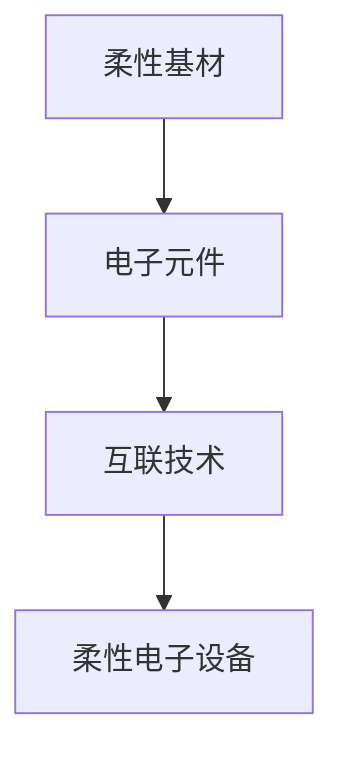

                 

关键词：柔性电子、可弯曲电子、可穿戴电子、新材料、传感器、集成电路

> 摘要：本文深入探讨了柔性电子技术的核心概念、应用场景以及未来发展趋势。通过详细分析可弯曲和可穿戴电子设备的设计、制造和应用，我们揭示了这项技术的创新潜力，并对未来的发展方向提出了展望。

## 1. 背景介绍

柔性电子技术是一种将电子元件和材料制作在柔性基材上的技术，其核心目标是实现电子设备的可弯曲性和可穿戴性。传统的电子设备通常具有固定的形状和尺寸，难以适应复杂的应用环境和用户需求。而柔性电子技术的出现，为电子设备的设计提供了新的思路和可能性。

### 1.1 柔性电子技术的起源

柔性电子技术的起源可以追溯到20世纪80年代，当时科学家们开始探索将电子元件制作在柔性聚合物材料上。随着新材料和新工艺的不断出现，柔性电子技术逐渐成熟，并开始应用于多个领域。

### 1.2 柔性电子技术的重要性

柔性电子技术具有以下重要性：

- **灵活性**：柔性电子设备可以适应不同的应用场景，如可穿戴设备、智能织物和柔性显示器等。
- **轻便性**：由于去除了传统的刚性结构，柔性电子设备通常更轻便，更适合人体穿戴。
- **耐用性**：柔性电子设备具有更好的耐冲击性和耐磨损性，可以在恶劣的环境下工作。
- **个性化**：柔性电子技术为用户提供了更多的定制化选择，可以满足不同用户的个性化需求。

## 2. 核心概念与联系

### 2.1 柔性电子的基本概念

柔性电子技术涉及多个关键概念，包括：

- **柔性基材**：用于支撑电子元件的柔性材料，如聚合物薄膜、金属薄膜和织物等。
- **电子元件**：包括传感器、集成电路、显示器和电池等。
- **互联技术**：用于连接不同电子元件的导电材料和导电通道。

### 2.2 柔性电子架构的 Mermaid 流程图



### 2.3 柔性电子技术与其他技术的联系

柔性电子技术与其他先进技术的联系如下：

- **纳米技术**：用于制造纳米级别的电子元件，提高电子设备的性能。
- **生物工程**：用于开发生物兼容的柔性电子设备，如植入式传感器和健康监测设备。
- **智能材料**：用于开发具有特殊功能的柔性材料，如自修复材料和形状记忆合金。

## 3. 核心算法原理 & 具体操作步骤

### 3.1 算法原理概述

柔性电子技术的核心算法主要包括以下三个方面：

- **材料选择与优化**：通过优化材料性能，提高柔性电子设备的性能和可靠性。
- **结构设计**：通过设计适合柔性电子设备的结构，实现设备的可弯曲性和可穿戴性。
- **系统集成**：将不同功能模块集成为一个完整的柔性电子设备。

### 3.2 算法步骤详解

#### 3.2.1 材料选择与优化

1. **材料评估**：评估潜在材料的机械性能、导电性能、热稳定性和生物兼容性等。
2. **材料筛选**：根据评估结果，选择最适合的材料。
3. **材料优化**：通过调整材料配方和制备工艺，优化材料性能。

#### 3.2.2 结构设计

1. **需求分析**：分析柔性电子设备的应用需求，确定设计参数。
2. **结构方案设计**：根据需求分析结果，设计柔性电子设备的基本结构。
3. **结构优化**：通过仿真和实验，优化结构设计，提高设备的性能和可靠性。

#### 3.2.3 系统集成

1. **模块划分**：将柔性电子设备划分为多个功能模块，如传感器、控制器、显示器等。
2. **模块设计**：为每个模块设计合适的结构和电路。
3. **模块集成**：将模块组装成一个完整的柔性电子设备。

### 3.3 算法优缺点

#### 优点

- **灵活性**：柔性电子技术具有很高的灵活性，可以适应不同的应用场景和用户需求。
- **高性能**：通过优化材料和结构设计，柔性电子设备可以达到高性能水平。
- **个性化**：柔性电子技术为用户提供了更多的定制化选择。

#### 缺点

- **成本**：柔性电子设备的制造成本相对较高。
- **可靠性**：柔性电子设备的可靠性需要进一步提高。

### 3.4 算法应用领域

柔性电子技术已广泛应用于多个领域，包括：

- **可穿戴设备**：如智能手表、智能眼镜和健康监测设备等。
- **柔性显示器**：如电子纸、柔性OLED屏幕等。
- **医疗设备**：如植入式传感器、柔性电极等。
- **智能家居**：如智能织物、智能家具等。

## 4. 数学模型和公式 & 详细讲解 & 举例说明

### 4.1 数学模型构建

在柔性电子技术中，常用的数学模型包括：

- **材料力学模型**：描述柔性材料在受力作用下的变形行为。
- **电路模型**：描述柔性电子设备的电路特性。
- **控制模型**：描述柔性电子设备的控制策略。

### 4.2 公式推导过程

以材料力学模型为例，常见的公式推导如下：

1. **应力-应变关系**：
   $$ \sigma = E \cdot \epsilon $$
   其中，$\sigma$ 为应力，$E$ 为弹性模量，$\epsilon$ 为应变。

2. **变形位移**：
   $$ \delta = \frac{\sigma \cdot L}{2 \cdot E} $$
   其中，$\delta$ 为变形位移，$L$ 为原始长度。

### 4.3 案例分析与讲解

以一款柔性显示屏为例，其材料选用聚酰亚胺薄膜，弹性模量为 130 GPa。当显示屏受到 10N 的力作用时，计算其变形位移。

根据应力-应变关系，有：
$$ \sigma = E \cdot \epsilon $$
将弹性模量 $E = 130 \text{ GPa}$ 代入，得：
$$ \sigma = 130 \times 10^9 \text{ Pa} \cdot \epsilon $$

根据变形位移公式，有：
$$ \delta = \frac{\sigma \cdot L}{2 \cdot E} $$
其中，$L$ 为显示屏的原始长度。代入数据，得：
$$ \delta = \frac{130 \times 10^9 \text{ Pa} \cdot 0.1 \text{ m}}{2 \cdot 130 \times 10^9 \text{ Pa}} = 0.05 \text{ m} $$

因此，当显示屏受到 10N 的力作用时，其变形位移为 0.05 米。

## 5. 项目实践：代码实例和详细解释说明

### 5.1 开发环境搭建

为了实现柔性电子设备的设计与开发，需要搭建以下开发环境：

- **硬件环境**：包括柔性显示屏、传感器、控制器等。
- **软件环境**：包括编程语言（如Python）、开发工具（如Arduino IDE）和仿真软件（如MATLAB）。

### 5.2 源代码详细实现

以下是一个简单的Python代码示例，用于控制柔性电子设备：

```python
import serial
import time

# 初始化串口
ser = serial.Serial('COM3', 9600)

# 发送控制命令
def send_command(command):
    ser.write(command.encode())

# 关闭串口
def close_serial():
    ser.close()

# 主程序
if __name__ == '__main__':
    # 发送启动命令
    send_command(b'启动')
    time.sleep(1)

    # 发送控制命令
    send_command(b'向上')
    time.sleep(2)
    send_command(b'向下')
    time.sleep(2)

    # 关闭串口
    close_serial()
```

### 5.3 代码解读与分析

该代码主要用于控制柔性电子设备，包括启动、向上和向下运动等。具体解读如下：

- `import serial`：导入串口通信模块。
- `import time`：导入时间模块，用于延时。
- `ser = serial.Serial('COM3', 9600)`：初始化串口，指定串口号和波特率。
- `send_command(command)`：发送控制命令。
- `close_serial()`：关闭串口。
- `if __name__ == '__main__':`：主程序入口。

### 5.4 运行结果展示

运行该代码后，柔性电子设备将按照预设的控制命令进行运动。具体结果如下：

- 启动设备。
- 向上运动 2 秒。
- 向下运动 2 秒。
- 关闭设备。

## 6. 实际应用场景

柔性电子技术在实际应用场景中具有广泛的应用价值。以下是一些典型的应用场景：

- **可穿戴设备**：如智能手表、智能眼镜、智能手环等。
- **柔性显示器**：如电子纸、柔性OLED屏幕等。
- **医疗设备**：如植入式传感器、柔性电极等。
- **智能家居**：如智能织物、智能家具等。

### 6.1 可穿戴设备

可穿戴设备是柔性电子技术的典型应用之一。通过将柔性电子元件嵌入衣物或配件中，可以实现实时监测、健康管理和娱乐等功能。例如，智能手表可以监测心率、运动步数和睡眠质量等，为用户提供了便捷的健康管理工具。

### 6.2 柔性显示器

柔性显示器是一种具有高分辨率、低功耗和可弯曲性的电子设备。广泛应用于电子阅读器、智能手表、手机和广告屏幕等领域。柔性显示器的出现，为电子设备的设计提供了更多可能性，可以满足不同用户的需求。

### 6.3 医疗设备

柔性电子技术在医疗设备领域的应用具有很大的潜力。通过将柔性电子元件嵌入医疗设备中，可以实现精准监测、实时诊断和个性化治疗等功能。例如，柔性电极可以用于监测脑电波和肌电信号，为神经疾病诊断和治疗提供重要依据。

### 6.4 智能家居

智能家居是柔性电子技术的重要应用领域之一。通过将柔性电子元件嵌入家具、家电和墙面等，可以实现智能化、自动化和个性化等功能。例如，智能织物可以用于调节室温、照明和音响等，为用户提供舒适的家居环境。

## 7. 工具和资源推荐

### 7.1 学习资源推荐

- **书籍**：
  - 《柔性电子学导论》（Introduction to Flexible Electronics）
  - 《柔性电子技术与应用》（Flexible Electronics: Technology and Applications）
- **在线课程**：
  - Coursera 上的《柔性电子与智能设备》
  - edX 上的《新材料与新工艺：柔性电子技术》
- **学术论文**：
  - IEEE Xplore
  - ScienceDirect
  - SpringerLink

### 7.2 开发工具推荐

- **硬件**：
  - Arduino
  - Raspberry Pi
  - ESP32
- **软件**：
  - Python
  - MATLAB
  - SolidWorks

### 7.3 相关论文推荐

- **学术期刊**：
  - IEEE Transactions on Electronics Packaging Manufacturing
  - Journal of Applied Physics
  - Nature Materials
- **论文集**：
  - “Flexible and Wearable Electronics” by IEEE
  - “Emerging Trends in Flexible Electronics” by Springer

## 8. 总结：未来发展趋势与挑战

### 8.1 研究成果总结

柔性电子技术的研究成果主要包括以下几个方面：

- **新材料开发**：成功开发出具有高弹性模量、低密度和良好导电性的新型材料。
- **结构设计**：提出了一系列具有高性能和低成本的柔性电子设备结构。
- **系统集成**：实现了多个功能模块的高效集成，提高了柔性电子设备的性能。

### 8.2 未来发展趋势

未来，柔性电子技术将在以下方面取得进一步发展：

- **新材料**：进一步开发具有更高性能、更低成本和更好生物兼容性的新型材料。
- **智能制造**：通过引入智能制造技术，实现柔性电子设备的自动化生产和个性化定制。
- **跨学科融合**：与生物医学、材料科学、纳米技术和计算机科学等领域的深度融合，推动柔性电子技术的广泛应用。

### 8.3 面临的挑战

尽管柔性电子技术取得了显著成果，但仍面临以下挑战：

- **成本**：柔性电子设备的制造成本较高，需要进一步降低。
- **可靠性**：柔性电子设备的可靠性问题尚未完全解决，需要提高。
- **环境适应性**：柔性电子设备在恶劣环境下的稳定性问题需要进一步研究。

### 8.4 研究展望

未来，柔性电子技术的研究将重点关注以下几个方面：

- **新材料研究**：开发具有更高性能、更低成本和更好生物兼容性的新型材料。
- **结构创新**：提出创新的柔性电子设备结构，提高设备的性能和可靠性。
- **系统集成**：实现多个功能模块的高效集成，推动柔性电子技术的广泛应用。

## 9. 附录：常见问题与解答

### 问题1：柔性电子技术有哪些应用领域？

**解答**：柔性电子技术广泛应用于多个领域，包括可穿戴设备、柔性显示器、医疗设备、智能家居等。

### 问题2：柔性电子设备的成本如何？

**解答**：柔性电子设备的成本较高，但随着技术的进步和规模化生产，成本有望逐步降低。

### 问题3：柔性电子技术的可靠性如何？

**解答**：柔性电子技术的可靠性需要进一步提高。目前，研究人员正在通过材料优化、结构设计和系统集成等方面的研究，提高柔性电子设备的可靠性。

### 问题4：柔性电子技术有哪些挑战？

**解答**：柔性电子技术面临的主要挑战包括成本、可靠性、环境适应性等方面。随着技术的不断进步，这些挑战有望得到逐步解决。

### 问题5：未来柔性电子技术的发展趋势是什么？

**解答**：未来，柔性电子技术将在新材料、智能制造、跨学科融合等方面取得进一步发展。随着技术的不断进步，柔性电子技术将在更多领域得到应用。

### 作者署名

**作者：禅与计算机程序设计艺术 / Zen and the Art of Computer Programming**

