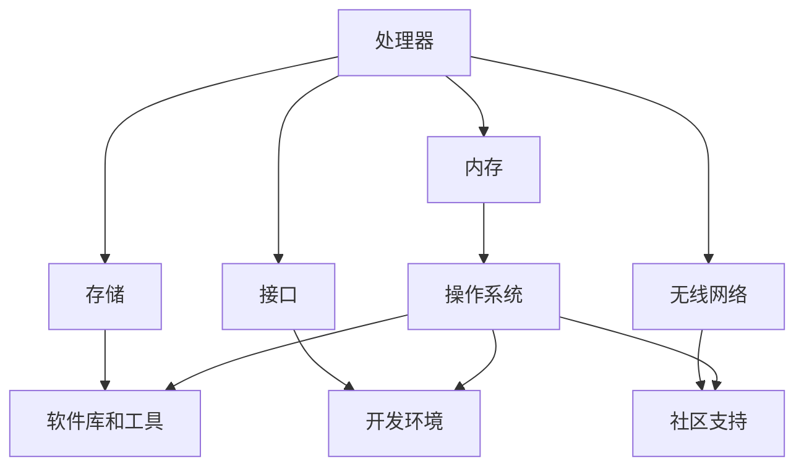

                 

## 1. 背景介绍

树莓派（Raspberry Pi）是一款由英国慈善基金会 Raspberry Pi 基金会开发的微型计算机，自 2012 年首次推出以来，它已经成为了全球范围内最受欢迎的单板计算机之一。树莓派以其高性能、低功耗和低成本的特点，吸引了大量的开发者、教育者和爱好者，广泛应用于智能家居、机器人控制、物联网（IoT）、多媒体中心、嵌入式系统等多个领域。

随着技术的不断进步，树莓派的性能和功能也在不断提升。最新一代的树莓派（如 Raspberry Pi 4）已经具备与某些传统台式机相媲美的性能，同时仍然保持着其小巧的体积和低功耗的特点。这使得树莓派不仅适用于简单的项目，也可以承担一些复杂的应用任务。

树莓派的普及不仅体现在硬件层面，其生态系统也日益丰富。从开源操作系统（如 Raspbian、Ubuntu）到大量的开发库和工具，再到大量的教程和社区支持，树莓派为开发者提供了全面的开发环境。这使得即使是初学者也能够轻松上手，进行各种有趣的开发项目。

本文旨在为读者提供一个全面、系统的树莓派开发指南，从硬件安装到软件配置，再到实际应用案例，希望能够帮助读者全面了解并掌握树莓派的开发。

## 2. 核心概念与联系

要深入理解树莓派的开发，首先需要了解一些核心概念和它们之间的联系。以下是树莓派开发中的几个关键组成部分及其相互关系：

### 2.1. 硬件组件

树莓派的硬件主要包括以下几部分：

- **处理器**：树莓派使用的是基于 ARM 架构的处理器，如 Broadcom 的 BCM2837、BCM2838 或 BCM2711。这些处理器性能强大，但功耗低。
- **内存**：树莓派支持不同容量的内存，从最初的 256MB 到最新的 4GB 或 8GB。
- **存储**：树莓派通常使用 microSD 卡作为存储设备，用于安装操作系统和存储数据。
- **接口**：树莓派提供了多个接口，包括 HDMI 接口、GPIO 接口、USB 接口等，用于连接显示器、传感器、外部设备等。
- **无线网络**：部分树莓派型号支持 Wi-Fi 和蓝牙，使得树莓派可以轻松连接无线网络。

### 2.2. 操作系统

树莓派通常使用基于 Linux 的操作系统，如 Raspbian、Ubuntu 等。操作系统负责管理树莓派的硬件资源，提供用户界面和开发环境。

- **Raspbian**：是基于 Debian 的专门为树莓派优化的 Linux 发行版，它是树莓派社区最常用的操作系统。
- **Ubuntu**：虽然 Ubuntu 不是专门为树莓派设计的，但它在树莓派上的表现也非常优秀，提供了更多的软件支持和工具。

### 2.3. 软件库和工具

树莓派生态系统中有大量的软件库和工具，这些资源极大地简化了开发过程。以下是几个重要的软件库和工具：

- **Python**：Python 是一种广泛使用的编程语言，树莓派上的 Python 非常适合用于快速开发和原型制作。
- **Node-RED**：Node-RED 是一个用于流数据处理的开发工具，它可以帮助开发者构建基于树莓派的智能物联网系统。
- **Raspberry Pi OS**：这是 Raspberry Pi 基金会推出的官方操作系统，它提供了丰富的软件包和管理工具。

### 2.4. Mermaid 流程图

为了更好地展示这些概念和组件之间的联系，我们可以使用 Mermaid 流程图来描述树莓派的基本架构：



这个流程图展示了树莓派的核心硬件组件、操作系统、软件库和工具以及它们之间的相互关系。通过这种结构化的展示，我们可以更清晰地理解树莓派的开发环境和生态系统。

在下一节中，我们将深入探讨树莓派的核心算法原理和具体操作步骤，帮助读者更好地掌握树莓派的开发技巧。

### 3. 核心算法原理 & 具体操作步骤

树莓派作为一种强大的单板计算机，其应用场景非常广泛，从简单的家庭自动化到复杂的数据分析，都需要借助一定的算法来实现。以下是树莓派开发中常见的几种核心算法原理及其具体操作步骤：

#### 3.1 算法原理概述

**1. 控制算法**

控制算法是树莓派在自动化项目中常用的一种算法，主要用于控制设备的开关、调节设备状态等。常见的控制算法包括 PID 控制器、模糊控制等。

**2. 机器学习算法**

随着人工智能技术的发展，树莓派也可以用于简单的机器学习任务，如图像识别、语音识别等。常见的机器学习算法包括决策树、神经网络等。

**3. 通信协议**

树莓派在物联网应用中需要与其他设备进行通信，常用的通信协议包括 Wi-Fi、蓝牙、MQTT 等。

#### 3.2 算法步骤详解

**1. 控制算法**

**PID 控制器**

PID 控制器是一种常用的控制算法，用于控制系统的输出接近目标值。其基本原理是通过比例（P）、积分（I）和微分（D）三个部分来调整控制器的输出。

**步骤：**

- **初始化参数**：设定比例（K_p）、积分（K_i）和微分（K_d）系数。
- **计算偏差**：计算当前输出值与目标值之间的偏差。
- **计算控制量**：根据偏差计算控制量，公式为：\(u(t) = K_p \times e(t) + K_i \times \int e(t) dt + K_d \times \frac{de(t)}{dt}\)，其中 \(e(t)\) 是偏差，\(u(t)\) 是控制量。
- **更新输出**：将计算出的控制量应用于系统。

**2. 机器学习算法**

**决策树**

决策树是一种常用的分类算法，通过一系列规则来对数据集进行分类。

**步骤：**

- **数据准备**：将数据集划分为特征和标签两部分。
- **选择最佳分割点**：选择能够最大化信息增益的分割点。
- **递归构建树**：根据最佳分割点递归构建决策树，直到满足停止条件（如最大深度、最小叶子节点数量等）。
- **分类预测**：使用构建好的决策树对新的数据进行分类预测。

**3. 通信协议**

**Wi-Fi**

Wi-Fi 是一种无线通信协议，广泛用于局域网通信。

**步骤：**

- **配置网络**：设置 Wi-Fi 连接参数，如 SSID 和密码。
- **连接网络**：通过 Wi-Fi 库（如 Python 的 `scapy`）发送和接收数据包。
- **数据处理**：对收到的数据包进行解析和处理。

#### 3.3 算法优缺点

**1. 控制算法**

**优点**：简单易实现，适用范围广。

**缺点**：对于复杂系统可能无法达到最优控制效果。

**2. 机器学习算法**

**优点**：适用于处理大规模数据，能够自动发现数据中的模式和规律。

**缺点**：训练过程复杂，对于大型模型计算资源要求较高。

**3. 通信协议**

**优点**：灵活，适用于不同场景。

**缺点**：易受环境干扰，安全性较低。

#### 3.4 算法应用领域

**1. 控制算法**

**应用领域**：工业自动化、智能家居、机器人控制等。

**2. 机器学习算法**

**应用领域**：图像识别、语音识别、自然语言处理等。

**3. 通信协议**

**应用领域**：物联网、智能家居、远程监控等。

通过以上对核心算法原理和操作步骤的介绍，我们可以看到树莓派在各个领域都有着广泛的应用前景。在接下来的部分，我们将进一步探讨树莓派在具体项目中的数学模型和公式，帮助读者更好地理解和应用这些算法。

### 4. 数学模型和公式 & 详细讲解 & 举例说明

在树莓派开发过程中，数学模型和公式是理解算法原理和实现具体功能的基础。以下我们将详细介绍一些常用的数学模型和公式，并通过实际案例进行说明。

#### 4.1 数学模型构建

在树莓派项目中，构建数学模型通常需要以下几个步骤：

1. **确定目标**：明确项目目标，如控制某个参数在特定范围内、实现图像识别等。
2. **数据收集**：收集与目标相关的数据，如传感器数据、图像数据等。
3. **特征提取**：从收集的数据中提取特征，用于构建模型。
4. **模型选择**：选择合适的数学模型，如线性模型、非线性模型、神经网络等。
5. **模型训练**：使用收集到的数据和特征训练模型，调整模型参数。
6. **模型评估**：评估模型性能，如准确率、召回率、均方误差等。

#### 4.2 公式推导过程

以机器学习中的线性回归为例，我们介绍以下基本公式：

**1. 线性回归模型**

线性回归模型假设数据之间存在线性关系，模型公式为：

\[ y = \beta_0 + \beta_1 \cdot x \]

其中，\( y \) 是目标变量，\( x \) 是特征变量，\( \beta_0 \) 和 \( \beta_1 \) 是模型参数。

**2. 最小二乘法**

为了找到最佳模型参数，我们使用最小二乘法来最小化预测值与实际值之间的误差平方和：

\[ \min \sum_{i=1}^{n} (y_i - \beta_0 - \beta_1 \cdot x_i)^2 \]

对上述公式求导，并令导数为零，得到：

\[ \beta_1 = \frac{\sum_{i=1}^{n} x_i y_i - n \cdot \bar{x} \cdot \bar{y}}{\sum_{i=1}^{n} x_i^2 - n \cdot \bar{x}^2} \]

\[ \beta_0 = \bar{y} - \beta_1 \cdot \bar{x} \]

其中，\( \bar{x} \) 和 \( \bar{y} \) 分别是特征变量和目标变量的均值。

#### 4.3 案例分析与讲解

**1. 例子：温度预测**

假设我们要预测某个城市的日平均温度，我们收集了过去一年的温度数据。以下是具体步骤：

**步骤 1：数据收集**  
收集过去一年的日平均温度数据。

**步骤 2：特征提取**  
提取日期作为特征变量 \( x \)，日平均温度作为目标变量 \( y \)。

**步骤 3：模型选择**  
选择线性回归模型。

**步骤 4：模型训练**  
使用收集到的数据训练线性回归模型。

**步骤 5：模型评估**  
计算模型预测值与实际值之间的误差，评估模型性能。

**案例代码**（使用 Python 和 Scikit-learn 库实现）：

```python
from sklearn.linear_model import LinearRegression
from sklearn.metrics import mean_squared_error

# 数据加载
X = ...  # 日期数据
y = ...  # 日平均温度数据

# 模型训练
model = LinearRegression()
model.fit(X, y)

# 预测
y_pred = model.predict(X)

# 误差评估
mse = mean_squared_error(y, y_pred)
print("均方误差：", mse)
```

通过上述案例，我们可以看到如何使用线性回归模型进行温度预测。类似的方法可以应用于其他领域，如智能家居的温度和湿度控制、图像识别等。

在接下来的部分，我们将详细介绍树莓派项目实践中的代码实例和详细解释说明，帮助读者更好地掌握树莓派的开发。

### 5. 项目实践：代码实例和详细解释说明

在了解树莓派的基础知识和算法原理之后，我们将通过实际项目实践来巩固这些知识，并展示如何从零开始搭建一个树莓派项目。本文将分为以下几个部分进行讲解：

#### 5.1 开发环境搭建

首先，我们需要搭建一个适合开发的树莓派环境。

**步骤 1：硬件准备**

- 一台树莓派（如 Raspberry Pi 4）
- 一块 microSD 卡（至少 8GB）
- 一个电源适配器
- 一块键盘、鼠标和显示器（用于初始配置）

**步骤 2：操作系统安装**

1. 下载 Raspbian 操作系统镜像：[Raspbian 镜像下载](https://www.raspberrypi.org/downloads/raspbian/)
2. 使用工具（如 balenaEtcher）将镜像写入 microSD 卡。
3. 将 microSD 卡插入树莓派，并将其连接到电源适配器和显示器。
4. 第一次启动时，树莓派会自动运行操作系统的初始设置向导。

**步骤 3：连接网络**

- 在设置向导中配置网络，可以选择连接无线网络或使用有线网络。
- 配置完成后，重启树莓派。

#### 5.2 源代码详细实现

在本部分，我们将使用 Python 和 Raspberry Pi OS 搭建一个简单的温度传感器读取项目。

**1. 安装必要的库**

```shell
sudo apt-get update
sudo apt-get install python3
sudo pip3 install numpy pyserial
```

**2. 编写代码**

创建一个名为 `temperature.py` 的文件，并输入以下代码：

```python
import serial
import time
import numpy as np

# 连接串口
ser = serial.Serial('/dev/ttyUSB0', 9600, timeout=1)

while True:
    # 读取串口数据
    line = ser.readline()
    if line:
        # 解析温度数据
        temp = float(line.decode('utf-8'))
        # 打印温度值
        print("当前温度：", temp, "摄氏度")
        # 存储温度数据到文件
        with open('temperature.txt', 'a') as f:
            f.write(f"{time.time()}: {temp}\n")
    time.sleep(1)
```

**3. 运行程序**

将代码上传到树莓派，并运行：

```shell
python3 temperature.py
```

程序会持续读取串口数据，并打印和记录温度值。

#### 5.3 代码解读与分析

**1. 串口连接**

程序首先通过 `serial.Serial()` 函数连接到串口设备。这里使用了 `/dev/ttyUSB0` 作为串口设备名称，不同的树莓派可能有所不同，可以通过 `ls /dev/` 命令查看。

**2. 数据读取与解析**

程序使用 `readline()` 函数从串口读取数据，并使用 `decode('utf-8')` 将字节字符串转换为普通字符串。然后，使用 `float()` 函数将字符串转换为浮点数，得到温度值。

**3. 数据打印与存储**

程序会打印当前温度值，并将时间和温度值以特定的格式存储到 `temperature.txt` 文件中。

#### 5.4 运行结果展示

当程序运行时，会每隔一秒读取一次温度传感器数据，并打印在终端窗口中。同时，温度数据会被记录到 `temperature.txt` 文件中，便于后续分析。

通过这个简单的示例，我们展示了如何搭建一个基本的树莓派项目。在实际开发中，可以根据需求添加更多的功能，如数据可视化、远程监控、预警系统等。

在接下来的部分，我们将探讨树莓派在实际应用场景中的具体应用，并展望其未来的发展。

### 6. 实际应用场景

树莓派因其强大的功能和灵活的配置，在多个实际应用场景中表现出色。以下是树莓派在不同领域的应用实例：

#### 6.1 家庭自动化

家庭自动化是树莓派最常见应用之一。通过树莓派，可以轻松实现家庭设备的自动化控制，如灯光、门锁、温度调节等。例如，使用树莓派和智能传感器，可以构建一个智能照明系统，根据房间的亮度和使用情况自动调整灯光亮度。

**实例：智能照明系统**

- **硬件需求**：树莓派、智能灯泡、光照传感器
- **软件需求**：Home Assistant、Node-RED

**实现步骤**：

1. 使用 Home Assistant 配置智能灯泡。
2. 使用 Node-RED 构建数据流，将光照传感器数据发送到 Home Assistant。
3. 根据光照传感器数据自动调整灯泡亮度。

#### 6.2 物联网（IoT）

物联网是树莓派的另一个重要应用领域。树莓派可以作为物联网平台，连接各种传感器和设备，收集数据并进行分析。例如，可以构建一个智能家居监控系统，实时监控家庭的安全状况。

**实例：智能家居监控系统**

- **硬件需求**：树莓派、摄像头、门磁传感器、烟雾传感器
- **软件需求**：Motion、MQTT

**实现步骤**：

1. 使用 Motion 配置摄像头。
2. 使用 MQTT 服务器（如 Mosquitto）搭建消息传递系统。
3. 将传感器数据发送到 MQTT 服务器，并通过 MQTT 客户端监控传感器状态。

#### 6.3 教育和科研

树莓派在教育领域也有广泛应用，如编程教学、电子工程实验等。通过树莓派，学生可以亲自动手构建各种项目，了解计算机编程和电子工程的基本原理。

**实例：电子工程实验**

- **硬件需求**：树莓派、各种电子元件（如传感器、继电器等）
- **软件需求**：Python

**实现步骤**：

1. 学习 Python 编程语言。
2. 通过 GPIO 接口连接电子元件。
3. 编写程序控制电子元件，进行实验。

#### 6.4 机器人控制

树莓派在机器人控制领域也有广泛应用。通过树莓派，可以构建各种机器人，如智能家居机器人、舞蹈机器人等。

**实例：舞蹈机器人**

- **硬件需求**：树莓派、机器人控制器、电机
- **软件需求**：Python、舞蹈算法

**实现步骤**：

1. 学习机器人控制基础。
2. 连接机器人控制器和电机。
3. 编写舞蹈算法，控制机器人动作。

#### 6.5 数据分析

树莓派也可以用于数据分析和处理。通过树莓派，可以构建一个实时数据分析平台，处理和分析传感器数据、网络数据等。

**实例：实时数据分析平台**

- **硬件需求**：树莓派、传感器、网关
- **软件需求**：Python、Pandas

**实现步骤**：

1. 收集传感器数据。
2. 使用 Pandas 进行数据清洗和预处理。
3. 使用 Python 绘制数据图表，进行实时分析。

#### 6.6 艺术和娱乐

树莓派还可以用于艺术和娱乐项目，如电子艺术装置、音乐合成器等。

**实例：音乐合成器**

- **硬件需求**：树莓派、音频模块、按钮
- **软件需求**：Python、音频库

**实现步骤**：

1. 学习音频合成原理。
2. 使用 Python 编写程序，控制音频模块播放声音。
3. 添加按钮和触摸屏，实现交互式音乐合成器。

通过这些实例，我们可以看到树莓派在不同领域的广泛应用。随着技术的不断进步，树莓派的应用前景将更加广阔。在接下来的部分，我们将讨论树莓派的未来应用展望。

### 7. 工具和资源推荐

为了更好地进行树莓派开发，选择合适的工具和资源是至关重要的。以下是一些推荐的工具和资源，涵盖学习资源、开发工具和相关的学术论文。

#### 7.1 学习资源推荐

**1. 书籍**

- 《树莓派从入门到精通》：这是一本非常全面的入门书籍，适合初学者系统学习树莓派的基础知识。
- 《树莓派编程实战》：本书通过一系列的实际项目，帮助读者掌握树莓派的编程技巧。
- 《树莓派应用开发指南》：本书详细介绍了树莓派在各种应用场景中的使用方法，适合有一定基础的读者。

**2. 在线教程和视频**

- [Raspberry Pi official website](https://www.raspberrypi.org/learn/): Raspberry Pi 官方网站提供了大量的教程和资源，是学习树莓派的绝佳起点。
- [Instructables](https://www.instructables.com/): 在这个网站上，你可以找到许多关于树莓派项目的教程和步骤图解。
- [YouTube](https://www.youtube.com/): YouTube 上有很多优秀的树莓派教程视频，适合通过视觉学习来提高技能。

**3. 社区论坛**

- [Raspberry Pi Forums](https://www.raspberrypi.org/forums/): 这是一个活跃的社区论坛，你可以在这里提问、寻求帮助，也可以分享自己的项目经验。
- [Hackster.io](https://www.hackster.io/): 这是一个面向物联网开发者的平台，有许多关于树莓派的优秀项目和教程。

#### 7.2 开发工具推荐

**1. 编程语言**

- **Python**: Python 是树莓派开发中最常用的编程语言，它具有简洁的语法和丰富的库支持。
- **C/C++**: 对于性能要求较高的项目，C/C++ 是一个很好的选择，可以通过 GPIO 接口直接操作硬件。

**2. 开发环境**

- **Thonny**: Thonny 是一款专门为 Python 开发设计的集成开发环境（IDE），它简洁易用，非常适合初学者。
- **Visual Studio Code**: Visual Studio Code 是一款功能强大的开源 IDE，支持多种编程语言，可以通过扩展支持 Python 开发。

**3. 工具和库**

- **Node-RED**: Node-RED 是一个可视化的编程工具，用于连接各种设备和传感器，构建物联网应用。
- **Raspberry Pi OS**: 这是 Raspberry Pi 基金会推出的官方操作系统，提供了丰富的工具和库，是进行树莓派开发的基础。
- **Pi GPIO Library**: 这是一个用于 Python 的 GPIO 接口库，可以方便地操作树莓派的 GPIO 接口。

#### 7.3 相关论文推荐

**1. "Raspberry Pi: A Microcontroller for the 21st Century"**

这篇论文详细介绍了树莓派的架构、性能和未来展望，是了解树莓派基础架构的重要文献。

**2. "Home Automation using Raspberry Pi and IoT"**

这篇论文探讨了如何使用树莓派和物联网技术构建智能家居系统，为家庭自动化提供了理论基础。

**3. "Raspberry Pi as a Tool for Educational Robotics"**

这篇论文研究了树莓派在教育机器人领域的应用，为教师和学生提供了实用的教学资源。

通过这些工具和资源的推荐，希望读者能够更有效地进行树莓派的开发和学习。

### 8. 总结：未来发展趋势与挑战

树莓派自从推出以来，已经在全球范围内获得了广泛的关注和应用。随着技术的不断进步，树莓派的发展趋势和面临的挑战也越来越明显。

#### 8.1 研究成果总结

**1. 硬件性能提升**

近年来，树莓派的硬件性能不断提升。从最初的模型 B+ 到最新的 Raspberry Pi 4，处理器性能、内存容量和网络速度都有显著提升。这使得树莓派能够胜任更多复杂的应用任务，如机器学习、视频处理等。

**2. 软件生态丰富**

树莓派的软件生态系统也在不断丰富。Python、C/C++、Node-RED、MQTT 等多种编程语言和工具的支持，为开发者提供了多样化的开发选择。同时，Raspberry Pi OS 等官方操作系统的不断优化，也为开发者提供了稳定的开发环境。

**3. 应用场景扩大**

树莓派的应用场景也在不断扩展，从家庭自动化、物联网到教育、科研等领域，树莓派都展现出了强大的适应能力。特别是在人工智能和物联网领域，树莓派以其低成本和高性能的优势，成为开发者和企业的重要选择。

#### 8.2 未来发展趋势

**1. 人工智能集成**

随着人工智能技术的快速发展，预计未来树莓派将更加紧密地集成人工智能功能。例如，通过集成 GPU 或 TPU，树莓派将能够进行更复杂的机器学习任务，如实时图像识别、自然语言处理等。

**2. 软硬件协同发展**

树莓派的未来发展将更加注重软硬件的协同发展。通过引入新的硬件架构和优化软件性能，树莓派将能够更好地支持各种应用场景，如机器人控制、虚拟现实等。

**3. 生态系统的全球化**

随着树莓派在全球范围内的普及，其生态系统也将进一步全球化。通过国际化的社区合作和技术交流，树莓派将吸引更多开发者参与其中，推动其生态系统的不断繁荣。

#### 8.3 面临的挑战

**1. 硬件资源限制**

虽然树莓派的性能在不断提升，但相对于传统台式机和服务器，其硬件资源仍然有限。特别是在处理高负载任务时，树莓派的性能可能无法满足要求。因此，如何在有限的硬件资源下实现高效应用，是未来需要解决的问题。

**2. 安全性问题**

随着物联网设备的普及，安全问题也变得越来越重要。树莓派作为物联网设备的一部分，如何确保其安全性，防止恶意攻击和数据泄露，是未来需要重点关注的问题。

**3. 社区管理的挑战**

树莓派的全球社区非常活跃，但也存在管理上的挑战。如何确保社区秩序、维护社区文化，同时促进技术创新和知识共享，是社区管理者需要面对的挑战。

#### 8.4 研究展望

**1. 硬件创新**

未来，树莓派可能会引入更多的硬件创新，如集成更多的传感器、GPU 或 TPU，以支持更复杂的应用。同时，也可能推出更具定制化的硬件版本，满足不同用户的需求。

**2. 软件生态扩展**

在软件方面，预计树莓派的生态系统将继续扩展，引入更多的新工具和库，如针对机器学习的框架和工具。同时，Raspberry Pi OS 也可能会引入更多的优化和改进，以提高性能和稳定性。

**3. 应用场景拓展**

随着技术的进步，树莓派的应用场景将更加广泛。除了传统的家庭自动化、物联网和科研领域，预计未来树莓派将进入更多的新兴领域，如智能城市、自动驾驶等。

总之，树莓派作为一款低成本、高性能的单板计算机，其在未来的发展中具有巨大的潜力。通过不断的硬件创新、软件生态扩展和应用场景拓展，树莓派将继续在全球范围内发挥重要作用。

### 9. 附录：常见问题与解答

在树莓派开发过程中，用户可能会遇到各种常见问题。以下是一些常见问题的解答：

**Q1：如何解决网络连接问题？**

- **问题描述**：树莓派无法连接无线网络或有线网络。
- **解决方法**：首先，确保网络适配器已正确安装并启用。对于无线网络，检查 SSID 和密码是否正确。对于有线网络，检查网线连接是否牢固，以及路由器设置是否正常。如果问题依旧，尝试重启树莓派并重新配置网络。

**Q2：如何安装额外的软件包？**

- **问题描述**：在树莓派上无法安装或更新特定的软件包。
- **解决方法**：打开终端，使用以下命令更新软件包列表并安装所需的软件包：
  ```shell
  sudo apt-get update
  sudo apt-get install 软件包名称
  ```

**Q3：如何配置 GPIO 接口？**

- **问题描述**：不知道如何配置树莓派的 GPIO 接口以控制外部设备。
- **解决方法**：在 Raspberry Pi OS 中，GPIO 接口默认是启用的。要配置 GPIO，可以使用 Python 的 RPi.GPIO 库。以下是一个简单的示例：
  ```python
  import RPi.GPIO as GPIO
  import time

  GPIO.setmode(GPIO.BCM)
  GPIO.setup(18, GPIO.OUT)

  GPIO.output(18, GPIO.HIGH)
  time.sleep(1)
  GPIO.output(18, GPIO.LOW)

  GPIO.cleanup()
  ```

**Q4：如何更新或升级 Raspberry Pi OS？**

- **问题描述**：想要更新或升级树莓派的操作系统，但不确定如何进行。
- **解决方法**：打开终端，输入以下命令进行更新和升级：
  ```shell
  sudo apt-get update
  sudo apt-get upgrade
  sudo apt-get dist-upgrade
  ```

**Q5：如何解决串口通信问题？**

- **问题描述**：在尝试通过串口进行通信时遇到问题，如无法连接或数据传输错误。
- **解决方法**：首先确保串口设备已正确连接并设置正确的串口参数（如波特率、数据位、停止位、校验位）。在 Python 中，可以使用以下代码进行串口通信：
  ```python
  import serial

  ser = serial.Serial('/dev/ttyUSB0', 9600)
  ser.write(b'Hello, world!')
  print(ser.readline())
  ser.close()
  ```

通过上述解答，希望能够帮助用户解决在树莓派开发过程中遇到的常见问题。如果仍有疑问，可以参考官方文档或社区论坛进行进一步查询。

