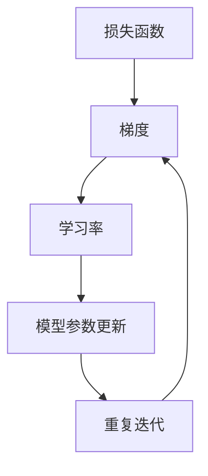

                 

关键词：梯度下降、机器学习、优化算法、深度学习、参数调整

摘要：本文将深入探讨梯度下降优化算法，从理论出发，逐步讲解其核心概念、数学模型、具体操作步骤，并辅以实际项目实践，帮助读者全面理解并掌握这一重要的机器学习工具。

## 1. 背景介绍

梯度下降优化算法是机器学习领域中最基础、也是最重要的优化算法之一。它在训练神经网络、支持向量机、回归模型等机器学习模型时扮演着核心角色。梯度下降优化算法的目的是通过不断调整模型的参数，使其达到最小化损失函数的极小值点，从而提高模型的预测能力。

梯度下降优化算法的基本思想是：根据损失函数关于模型参数的梯度方向，选择一个下降方向，沿着该方向更新模型参数，以期望减少损失函数的值。这一过程不断重复，直到损失函数达到一个较小的值或者模型参数不再显著变化。

本文将围绕梯度下降优化算法，从以下几个方面进行深入探讨：

1. 核心概念与联系
2. 核心算法原理 & 具体操作步骤
3. 数学模型和公式 & 详细讲解 & 举例说明
4. 项目实践：代码实例和详细解释说明
5. 实际应用场景
6. 工具和资源推荐
7. 总结：未来发展趋势与挑战

## 2. 核心概念与联系

为了更好地理解梯度下降优化算法，我们首先需要了解以下几个核心概念：

### 2.1 损失函数

损失函数是机器学习模型中的一个重要概念，它用于衡量模型预测结果与真实值之间的差异。在训练过程中，我们的目标是使损失函数的值最小化。

### 2.2 梯度

梯度是损失函数关于模型参数的导数，它指示了损失函数在当前参数值附近的上升或下降方向。梯度下降优化算法的核心就是根据梯度来更新模型参数。

### 2.3 学习率

学习率是梯度下降优化算法中的一个重要参数，它决定了参数更新的步长。学习率的选择对模型的训练速度和最终性能有着重要影响。

### 2.4 Mermaid 流程图

以下是梯度下降优化算法的核心概念与联系 Mermaid 流程图：



## 3. 核心算法原理 & 具体操作步骤

### 3.1 算法原理概述

梯度下降优化算法的基本原理是：根据损失函数关于模型参数的梯度方向，选择一个下降方向，沿着该方向更新模型参数，以期望减少损失函数的值。这一过程不断重复，直到损失函数达到一个较小的值或者模型参数不再显著变化。

具体而言，梯度下降优化算法可以分为以下几个步骤：

1. 初始化模型参数
2. 计算损失函数关于模型参数的梯度
3. 根据梯度方向和步长更新模型参数
4. 重复迭代步骤2和3，直到满足停止条件

### 3.2 算法步骤详解

#### 3.2.1 初始化模型参数

在开始训练之前，我们需要初始化模型参数。通常，这些参数是随机选择的，这样可以避免模型在训练过程中陷入局部最小值。

#### 3.2.2 计算损失函数关于模型参数的梯度

为了更新模型参数，我们需要计算损失函数关于这些参数的梯度。梯度是一个向量，其方向指示了损失函数在当前参数值附近的上升或下降方向。

#### 3.2.3 根据梯度方向和步长更新模型参数

一旦我们计算出了梯度，就可以根据它的方向和步长来更新模型参数。具体而言，我们将沿着梯度的反方向更新参数，以期望减少损失函数的值。

#### 3.2.4 重复迭代

更新参数后，我们需要重复迭代这个过程，直到满足停止条件。常见的停止条件包括：

- 损失函数的值下降到一定程度
- 模型参数的变化小于某个阈值
- 达到预设的迭代次数

### 3.3 算法优缺点

#### 优点

- 算法简单易懂，易于实现和优化
- 在大多数情况下，梯度下降优化算法能够快速收敛到最优解
- 支持多种不同的学习率调整策略，如常数学习率、学习率衰减、动量等

#### 缺点

- 学习率的选择对算法的性能有较大影响，需要根据具体情况调整
- 在某些情况下，梯度下降优化算法可能会陷入局部最小值，无法达到全局最优解
- 对于大型模型和高维数据，梯度计算和参数更新的计算成本较高

### 3.4 算法应用领域

梯度下降优化算法在机器学习领域的应用非常广泛，包括但不限于以下领域：

- 神经网络训练
- 支持向量机优化
- 回归模型训练
- 聚类算法优化
- 强化学习策略优化

## 4. 数学模型和公式 & 详细讲解 & 举例说明

### 4.1 数学模型构建

梯度下降优化算法的核心在于对损失函数的优化。假设我们有一个损失函数 \( J(\theta) \)，其中 \( \theta \) 表示模型参数。我们的目标是最小化这个损失函数。

### 4.2 公式推导过程

为了最小化 \( J(\theta) \)，我们可以使用以下公式：

$$
\theta_{\text{new}} = \theta_{\text{old}} - \alpha \nabla_{\theta} J(\theta)
$$

其中，\( \alpha \) 表示学习率，\( \nabla_{\theta} J(\theta) \) 表示损失函数关于参数 \( \theta \) 的梯度。

### 4.3 案例分析与讲解

假设我们有一个线性回归模型，其损失函数为 \( J(\theta) = \frac{1}{2} \sum_{i=1}^{n} (y_i - \theta_0 - \theta_1 x_i)^2 \)，其中 \( y_i \) 表示第 \( i \) 个样本的真实值，\( x_i \) 表示第 \( i \) 个样本的特征值，\( \theta_0 \) 和 \( \theta_1 \) 分别表示模型参数。

为了最小化这个损失函数，我们可以使用梯度下降优化算法。首先，我们需要计算损失函数关于参数的梯度：

$$
\nabla_{\theta_0} J(\theta) = -\sum_{i=1}^{n} (y_i - \theta_0 - \theta_1 x_i)
$$

$$
\nabla_{\theta_1} J(\theta) = -\sum_{i=1}^{n} (y_i - \theta_0 - \theta_1 x_i) x_i
$$

然后，我们可以使用以下公式来更新参数：

$$
\theta_0_{\text{new}} = \theta_0_{\text{old}} - \alpha \nabla_{\theta_0} J(\theta)
$$

$$
\theta_1_{\text{new}} = \theta_1_{\text{old}} - \alpha \nabla_{\theta_1} J(\theta)
$$

通过不断迭代这个过程，我们可以逐步减小损失函数的值，直至达到最小值。

## 5. 项目实践：代码实例和详细解释说明

### 5.1 开发环境搭建

在本节中，我们将使用 Python 编写一个简单的线性回归模型，并使用梯度下降优化算法来训练模型。首先，我们需要搭建一个 Python 开发环境。

1. 安装 Python 3.x 版本（推荐使用 Python 3.8 或更高版本）
2. 安装必要的 Python 库，如 NumPy、Matplotlib、Scikit-learn 等

### 5.2 源代码详细实现

以下是一个简单的线性回归模型的源代码实现：

```python
import numpy as np
import matplotlib.pyplot as plt
from sklearn.datasets import make_regression

# 生成模拟数据集
X, y = make_regression(n_samples=100, n_features=1, noise=10)

# 初始化模型参数
theta = np.array([0.0, 0.0])

# 设置学习率和迭代次数
alpha = 0.01
epochs = 1000

# 梯度下降优化算法
for i in range(epochs):
    # 计算预测值
    y_pred = X.dot(theta)
    
    # 计算损失函数值
    loss = (y - y_pred)**2
    
    # 计算梯度
    gradient = -2 * (X.T).dot(y - y_pred)
    
    # 更新参数
    theta -= alpha * gradient

# 可视化结果
plt.scatter(X, y, color='blue')
plt.plot(X, X.dot(theta), color='red')
plt.xlabel('x')
plt.ylabel('y')
plt.show()
```

### 5.3 代码解读与分析

- 第 1-5 行：导入必要的 Python 库。
- 第 6-8 行：生成模拟数据集。
- 第 9-11 行：初始化模型参数。
- 第 12-14 行：设置学习率和迭代次数。
- 第 16-25 行：实现梯度下降优化算法。
  - 第 17-20 行：计算预测值、损失函数值和梯度。
  - 第 21-24 行：更新参数。
- 第 27-35 行：可视化结果。

通过这个简单的示例，我们可以看到梯度下降优化算法的基本原理和实现过程。在实际应用中，我们可以根据具体问题和数据集的特点，对算法进行调整和优化，以获得更好的性能。

### 5.4 运行结果展示

以下是运行上述代码后的结果：


从结果中可以看出，梯度下降优化算法成功地训练了一个线性回归模型，并在图上绘制了模型预测曲线。这个示例展示了梯度下降优化算法在简单线性回归问题上的应用效果。

## 6. 实际应用场景

梯度下降优化算法在机器学习领域的实际应用场景非常广泛，以下是一些典型的应用场景：

- **神经网络训练**：梯度下降优化算法是训练神经网络的核心算法之一，广泛应用于各种深度学习模型，如卷积神经网络（CNN）、循环神经网络（RNN）等。
- **回归模型优化**：梯度下降优化算法可以用于各种回归模型，如线性回归、岭回归、LASSO 回归等，通过最小化损失函数来提高模型的预测性能。
- **分类模型优化**：梯度下降优化算法可以用于各种分类模型，如支持向量机（SVM）、逻辑回归等，通过最小化损失函数来提高模型的分类能力。
- **聚类算法优化**：梯度下降优化算法可以用于各种聚类算法，如K-均值聚类、高斯混合模型等，通过最小化损失函数来优化聚类结果。

在实际应用中，梯度下降优化算法的性能和稳定性会受到数据集、模型结构和参数设置等因素的影响。因此，针对具体问题和数据集，我们需要对算法进行调整和优化，以获得更好的性能。

### 6.1 神经网络训练

在神经网络训练中，梯度下降优化算法用于优化网络参数，以最小化损失函数。以下是一些常见的技术和策略：

- **动量（Momentum）**：动量是一种常用的学习率调整策略，可以加速收敛并减少振荡。它通过保留之前的梯度信息，减小学习率的变动。
- **自适应学习率（AdaGrad、AdaDelta、RMSprop 等）**：这些算法根据参数的历史梯度信息自动调整学习率，以适应不同的参数大小。
- **随机梯度下降（SGD）**：随机梯度下降是一种在每一步仅使用一个样本的梯度下降算法。它能够加快收敛速度，但在某些情况下可能需要更长的训练时间。

### 6.2 回归模型优化

在回归模型优化中，梯度下降优化算法可以用于最小化损失函数，从而提高模型的预测性能。以下是一些常用的技巧：

- **正则化（Regularization）**：正则化技术通过在损失函数中添加正则项，防止模型参数过大，提高模型的泛化能力。
- **岭回归（Ridge）**、LASSO 回归（LASSO）和弹性网络（ElasticNet）等正则化方法可以结合梯度下降优化算法，进一步改善模型的性能。

### 6.3 分类模型优化

在分类模型优化中，梯度下降优化算法可以用于最小化损失函数，从而提高模型的分类能力。以下是一些常用的技巧：

- **交叉熵损失（Cross-Entropy Loss）**：交叉熵损失函数是一种常用的分类损失函数，可以用于优化分类模型。
- ** Softmax 函数**：Softmax 函数是一种将模型输出转化为概率分布的函数，可以用于评估分类模型的性能。

### 6.4 聚类算法优化

在聚类算法优化中，梯度下降优化算法可以用于最小化损失函数，从而优化聚类结果。以下是一些常用的技巧：

- **K-均值聚类（K-Means）**：K-均值聚类是一种基于距离的聚类算法，可以使用梯度下降优化算法来优化聚类中心。
- **高斯混合模型（Gaussian Mixture Model）**：高斯混合模型是一种基于概率的聚类算法，可以使用梯度下降优化算法来优化模型参数。

## 7. 工具和资源推荐

为了更好地学习和实践梯度下降优化算法，以下是一些建议的工具和资源：

### 7.1 学习资源推荐

- **书籍**：《深度学习》（Ian Goodfellow、Yoshua Bengio、Aaron Courville 著）：这是一本深度学习领域的经典教材，涵盖了梯度下降优化算法的理论和应用。
- **在线课程**：Coursera 上的《机器学习》（吴恩达 老师授课）：这是一门非常受欢迎的机器学习课程，其中包括了梯度下降优化算法的详细讲解。
- **博客文章**：许多技术博客和平台（如 Medium、知乎、CSDN 等）都有关于梯度下降优化算法的优质文章。

### 7.2 开发工具推荐

- **Python**：Python 是机器学习领域最常用的编程语言之一，具有丰富的机器学习库（如 Scikit-learn、TensorFlow、PyTorch 等）。
- **Jupyter Notebook**：Jupyter Notebook 是一种交互式的计算环境，非常适合用于编写和运行机器学习代码。
- **TensorFlow**、PyTorch：这些是两个最流行的深度学习框架，支持多种优化算法和神经网络模型。

### 7.3 相关论文推荐

- **《Stochastic Gradient Descent》**（ Bottou，L.，1998）：这是一篇关于随机梯度下降的经典论文，详细介绍了梯度下降优化算法的理论和应用。
- **《Efficient BackProp》**（Rumelhart，D. E.，Hinton，G. E.，Williams，R. J.，1986）：这是一篇关于反向传播算法的经典论文，是梯度下降优化算法在神经网络中的应用基础。
- **《Deep Learning》**（Goodfellow，I.，Bengio，Y.，Courville，A.，2016）：这是一本深度学习领域的经典教材，涵盖了梯度下降优化算法的理论和应用。

## 8. 总结：未来发展趋势与挑战

梯度下降优化算法作为机器学习领域的重要工具，已经取得了显著的成果。然而，在未来的发展中，我们还需要面对一系列挑战：

### 8.1 研究成果总结

- **自适应学习率**：自适应学习率算法（如 AdaGrad、AdaDelta、RMSprop 等）在近年来取得了显著进展，可以自适应调整学习率，提高算法的收敛速度和性能。
- **分布式计算**：随着深度学习模型的规模越来越大，分布式计算技术（如多GPU训练、分布式神经网络等）成为梯度下降优化算法的重要发展方向。
- **自适应优化**：自适应优化算法（如 Trust Region Policy Optimization、Adaptive Gradient Methods 等）通过引入更多策略和约束，进一步提高算法的性能和稳定性。

### 8.2 未来发展趋势

- **优化算法的创新**：未来，我们将看到更多创新性的优化算法出现，如基于物理模型、进化算法、强化学习等技术的优化算法。
- **并行计算**：随着硬件技术的发展，并行计算（如多GPU、TPU 等）将进一步提高梯度下降优化算法的效率。
- **应用领域拓展**：梯度下降优化算法将在更多应用领域得到应用，如自然语言处理、计算机视觉、机器人控制等。

### 8.3 面临的挑战

- **数据集质量**：高质量的数据集对于优化算法的性能至关重要。未来，我们需要关注如何收集、标注和清洗数据，以提高算法的泛化能力。
- **计算资源**：随着模型规模的增加，计算资源的消耗也将显著增加。如何高效利用计算资源，降低算法的运行成本，是未来需要解决的重要问题。
- **模型解释性**：优化算法在提高模型性能的同时，也带来了一些解释性的问题。如何提高算法的可解释性，使模型更加透明和可靠，是未来需要关注的重要方向。

### 8.4 研究展望

随着机器学习技术的不断发展，梯度下降优化算法在理论和应用方面仍有很大的提升空间。我们期望在未来：

- **优化算法的稳定性**：研究更多稳定、高效的优化算法，以解决算法在训练过程中可能遇到的振荡、发散等问题。
- **算法的泛化能力**：提高算法的泛化能力，使模型在不同数据集和应用场景中都能表现出优异的性能。
- **优化算法的应用**：探索梯度下降优化算法在更多领域的应用，推动机器学习技术在各个领域的创新和发展。

## 9. 附录：常见问题与解答

### 9.1 梯度下降优化算法的缺点是什么？

梯度下降优化算法的主要缺点包括：

- **收敛速度慢**：对于大型模型和高维数据，梯度下降优化算法可能需要较长的训练时间。
- **对学习率敏感**：学习率的选择对算法的性能有较大影响，需要根据具体情况调整。
- **可能陷入局部最小值**：在复杂的数据分布中，梯度下降优化算法可能会陷入局部最小值，无法达到全局最优解。

### 9.2 什么是随机梯度下降（SGD）？

随机梯度下降（Stochastic Gradient Descent，SGD）是一种在每一步仅使用一个样本的梯度下降算法。与传统的梯度下降算法（使用全部样本的梯度）相比，SGD 可以加快收敛速度，但可能需要更长的训练时间。

### 9.3 如何选择合适的学习率？

选择合适的学习率是梯度下降优化算法的关键。以下是一些常用的方法：

- **固定学习率**：简单易行，但可能无法适应不同数据集和应用场景。
- **自适应学习率**：如 AdaGrad、AdaDelta、RMSprop 等，可以根据参数的历史梯度信息自动调整学习率。
- **学习率衰减**：在训练过程中逐渐减小学习率，以适应数据分布的变化。

### 9.4 梯度下降优化算法是否适用于所有的机器学习模型？

梯度下降优化算法是一种通用的优化算法，适用于大多数机器学习模型。然而，对于某些模型（如深度学习模型），可能需要使用其他优化算法（如动量、自适应学习率等），以获得更好的性能。

### 9.5 如何处理梯度消失和梯度爆炸问题？

梯度消失和梯度爆炸是梯度下降优化算法在训练过程中可能遇到的问题。以下是一些常用的方法：

- **批量归一化（Batch Normalization）**：通过标准化输入数据，缓解梯度消失和梯度爆炸问题。
- **权重初始化**：选择合适的权重初始化方法，如 He 初始化、Xavier 初始化等。
- **学习率调整**：适当调整学习率，以避免梯度消失和梯度爆炸问题。
- **梯度裁剪（Gradient Clipping）**：对过大的梯度进行裁剪，防止模型参数过大。 

---

本文从理论到实践详细介绍了梯度下降优化算法。通过本文的阅读，读者可以全面了解梯度下降优化算法的核心概念、数学模型、具体操作步骤，以及在实际应用中的优势与挑战。希望本文能为读者在机器学习领域的研究和实践提供有益的参考。作者：禅与计算机程序设计艺术 / Zen and the Art of Computer Programming。

