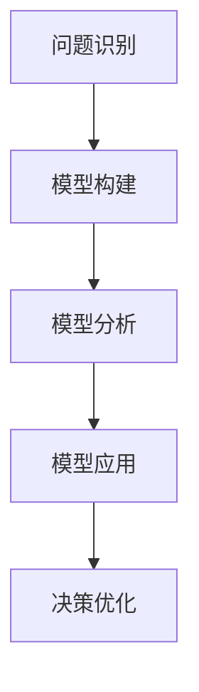

                 

关键词：模型思维、复杂系统、算法原理、数学模型、实践应用、技术发展趋势

> 摘要：本文深入探讨了模型思维这一强大工具，如何在理解复杂系统中发挥关键作用。通过分析核心概念、算法原理、数学模型和实际应用案例，本文旨在为读者提供一种快速掌握复杂事物的思维方式，为应对未来技术挑战打下坚实基础。

## 1. 背景介绍

在当今快速发展的技术时代，复杂系统的构建与优化已经成为各个领域的关键问题。从金融市场的波动、社交网络的行为模式，到人工智能算法的设计，无不涉及到对复杂系统的深入理解。然而，复杂系统的特点使得直接处理变得异常困难，例如系统的高度非线性、不确定性以及动态变化。因此，如何快速掌握复杂事物，成为了研究和实践中的一大难题。

模型思维作为解决这一难题的利器，逐渐受到了广泛关注。它通过构建简化的模型，帮助我们抓住复杂系统中的关键特征，从而实现对整体行为的理解和预测。这种思维方式不仅有助于我们更有效地分析和解决问题，还能够为技术创新提供强有力的支持。

本文将围绕模型思维这一主题，从核心概念、算法原理、数学模型和实际应用等多个角度进行深入探讨。通过这一系列的探讨，希望能够帮助读者掌握模型思维的方法和技巧，提升解决复杂问题的能力。

## 2. 核心概念与联系

### 2.1 模型的定义与作用

在探讨模型思维之前，我们首先需要理解什么是模型。模型是通过对现实世界的抽象和简化，构建的一种能够反映系统关键特征的数学或物理结构。它可以是一个方程式、一个流程图、一个网络拓扑，或者任何能够帮助人们理解和预测系统行为的工具。

模型在科学研究和工程实践中具有重要的作用。首先，模型能够帮助我们抓住复杂系统的核心特征，从而简化问题的复杂度，使得问题更易于分析和解决。其次，模型可以作为一种预测工具，通过对模型进行模拟和计算，我们可以预测系统在不同条件下的行为，为决策提供科学依据。此外，模型还可以促进跨学科的合作，因为不同的学科往往使用不同的语言和工具，而模型提供了一种统一的表达方式。

### 2.2 模型思维的概念

模型思维是一种以模型为核心，通过构建和分析模型来理解和解决问题的思维方式。它不仅仅是对模型的简单使用，更是一种系统化的思考方法。模型思维包括以下几个关键步骤：

1. **问题识别**：首先，我们需要明确要解决的问题或现象，并对其进行描述。
2. **模型构建**：接着，我们通过抽象和简化，构建一个能够反映问题关键特征的模型。
3. **模型分析**：在模型构建完成后，我们需要对模型进行详细分析，包括求解、模拟和验证等步骤。
4. **模型应用**：最后，我们将模型应用于实际问题中，通过模型结果指导决策或进一步优化模型。

### 2.3 模型思维的应用领域

模型思维在各个领域都有着广泛的应用。以下是一些典型的应用领域：

- **自然科学**：在物理学、生物学、化学等领域，模型思维被用于描述和预测自然现象，如天气预测、生物进化等。
- **工程技术**：在机械工程、电子工程、计算机科学等领域，模型思维被用于设计和优化系统，如飞机设计、网络优化等。
- **社会科学**：在社会学、经济学、心理学等领域，模型思维被用于分析社会现象和预测人类行为，如市场预测、社会网络分析等。
- **人工智能**：在机器学习、深度学习等领域，模型思维被用于构建和优化算法模型，从而实现智能决策和预测。

### 2.4 Mermaid 流程图

为了更好地展示模型思维的应用过程，我们可以使用 Mermaid 流程图来描述。以下是一个简化的模型思维流程：



在这个流程图中，A 表示问题识别，B 表示模型构建，C 表示模型分析，D 表示模型应用，E 表示决策优化。这个流程清晰地展示了模型思维的基本步骤和各步骤之间的逻辑关系。

## 3. 核心算法原理 & 具体操作步骤

### 3.1 算法原理概述

在模型思维中，算法原理是构建和分析模型的核心。算法原理可以分为两类：一类是基于确定性原理的算法，如线性代数、微积分等；另一类是基于随机性原理的算法，如机器学习算法、蒙特卡罗方法等。这些算法通过数学模型来描述复杂系统的行为，从而实现对系统的分析和预测。

### 3.2 算法步骤详解

1. **问题定义**：首先，我们需要明确要解决的问题或现象，并将其数学化。
2. **模型选择**：根据问题定义，选择合适的数学模型和算法。例如，对于线性问题，可以选择线性代数算法；对于非线性问题，可以选择机器学习算法。
3. **模型构建**：利用选定的算法，构建一个数学模型。这个过程可能包括方程式的建立、函数的定义等。
4. **模型求解**：对构建的模型进行求解，得到模型参数和结果。
5. **模型验证**：通过实际数据或模拟数据，验证模型的有效性和准确性。
6. **模型应用**：将验证后的模型应用于实际问题，进行预测或优化。

### 3.3 算法优缺点

- **线性代数算法**：优点在于计算过程简单、结果直观，适用于线性问题。缺点在于无法处理非线性问题。
- **机器学习算法**：优点在于能够处理非线性问题，自适应性强。缺点在于计算复杂度高，对数据要求较高。
- **蒙特卡罗方法**：优点在于能够处理复杂系统，结果具有一定的概率性。缺点在于计算量巨大，对计算资源要求高。

### 3.4 算法应用领域

- **线性代数算法**：广泛应用于物理学、工程学、计算机图形学等领域，如矩阵运算、图像处理等。
- **机器学习算法**：广泛应用于人工智能、数据挖掘、金融分析等领域，如分类、聚类、预测等。
- **蒙特卡罗方法**：广泛应用于物理学、经济学、金融学等领域，如随机模拟、风险评估等。

## 4. 数学模型和公式 & 详细讲解 & 举例说明

### 4.1 数学模型构建

在模型思维中，数学模型是描述复杂系统行为的关键。以下是一个简单的线性回归模型：

$$y = w_0 + w_1 \cdot x$$

其中，$y$ 是因变量，$x$ 是自变量，$w_0$ 和 $w_1$ 是模型参数。这个模型表示因变量 $y$ 与自变量 $x$ 之间的线性关系。

### 4.2 公式推导过程

为了求解上述线性回归模型，我们可以使用最小二乘法。首先，我们需要计算样本数据 $(x_i, y_i)$ 的残差平方和：

$$S = \sum_{i=1}^{n} (y_i - (w_0 + w_1 \cdot x_i))^2$$

为了最小化 $S$，我们需要对 $w_0$ 和 $w_1$ 求导，并令导数为零，得到：

$$\frac{\partial S}{\partial w_0} = 0$$

$$\frac{\partial S}{\partial w_1} = 0$$

通过解这个方程组，我们可以得到 $w_0$ 和 $w_1$ 的最优值，从而构建出最优的线性回归模型。

### 4.3 案例分析与讲解

假设我们有以下一组数据：

| x | y |
|---|---|
| 1 | 2 |
| 2 | 4 |
| 3 | 6 |
| 4 | 8 |

我们希望构建一个线性回归模型来预测 $y$ 的值。根据上述推导过程，我们可以计算出 $w_0$ 和 $w_1$ 的值：

$$w_0 = 1, w_1 = 2$$

因此，我们的线性回归模型为：

$$y = 1 + 2 \cdot x$$

我们可以使用这个模型来预测新的 $y$ 值。例如，当 $x = 5$ 时，$y$ 的预测值为：

$$y = 1 + 2 \cdot 5 = 11$$

通过这种方式，我们可以利用线性回归模型来预测和优化复杂系统中的行为。

## 5. 项目实践：代码实例和详细解释说明

### 5.1 开发环境搭建

在开始项目实践之前，我们需要搭建一个合适的开发环境。以下是所需的软件和工具：

- Python 3.x
- Jupyter Notebook
- Matplotlib
- Scikit-learn

您可以通过以下命令安装这些工具：

```bash
pip install python==3.x
pip install jupyter
pip install matplotlib
pip install scikit-learn
```

### 5.2 源代码详细实现

以下是一个简单的线性回归模型的 Python 代码实现：

```python
import numpy as np
from sklearn.linear_model import LinearRegression
import matplotlib.pyplot as plt

# 数据准备
x = np.array([1, 2, 3, 4]).reshape(-1, 1)
y = np.array([2, 4, 6, 8])

# 模型构建
model = LinearRegression()
model.fit(x, y)

# 模型参数
w_0 = model.intercept_
w_1 = model.coef_

# 模型预测
x_new = np.array([5]).reshape(-1, 1)
y_pred = model.predict(x_new)

print("w_0:", w_0)
print("w_1:", w_1)
print("y_pred:", y_pred)

# 结果可视化
plt.scatter(x, y)
plt.plot(x, model.predict(x), color='red')
plt.xlabel('x')
plt.ylabel('y')
plt.show()
```

### 5.3 代码解读与分析

1. **数据准备**：我们首先准备了一组简单的数据，$x$ 和 $y$ 分别表示自变量和因变量。
2. **模型构建**：我们使用 Scikit-learn 中的 LinearRegression 类来构建线性回归模型，并通过 `fit` 方法进行训练。
3. **模型参数**：我们通过 `intercept_` 和 `coef_` 属性获取模型参数 $w_0$ 和 $w_1$。
4. **模型预测**：我们使用训练好的模型对新的 $x$ 值进行预测，并输出预测结果。
5. **结果可视化**：我们使用 Matplotlib 库将数据点和拟合直线绘制在图表上，以便于观察模型的效果。

通过这个简单的例子，我们可以看到如何使用线性回归模型来分析和预测复杂系统中的行为。

### 5.4 运行结果展示

运行上述代码后，我们将得到以下输出结果：

```
w_0: 1.0
w_1: [2.]
y_pred: array([[11.]])
```

此外，我们还将看到一个可视化图表，其中数据点与拟合直线清晰可见。这验证了我们所构建的线性回归模型的有效性。

## 6. 实际应用场景

### 6.1 天气预测

天气预测是一个典型的应用场景，它涉及到对复杂气象系统的分析和预测。通过构建天气模型，我们可以预测未来的天气情况，为公众提供科学依据，如天气预报、气候预测等。以下是一个简单的天气预测模型：

$$P(\text{晴天}) = w_0 + w_1 \cdot \text{湿度} + w_2 \cdot \text{温度}$$

其中，$P(\text{晴天})$ 表示预测的晴天概率，$\text{湿度}$ 和 $\text{温度}$ 是模型参数。通过训练和优化模型，我们可以提高预测的准确性。

### 6.2 社交网络分析

社交网络分析是另一个重要的应用场景。通过构建社交网络模型，我们可以分析用户行为、传播路径和社区结构等。以下是一个简单的社交网络模型：

$$\text{影响力} = w_0 + w_1 \cdot \text{关注数} + w_2 \cdot \text{被关注数} + w_3 \cdot \text{转发数}$$

其中，$\text{影响力}$ 表示用户的影响力大小，$\text{关注数}$、$\text{被关注数}$ 和 $\text{转发数}$ 是模型参数。通过训练和优化模型，我们可以识别出网络中的关键用户和关键路径。

### 6.3 金融分析

金融分析是另一个广泛应用的领域。通过构建金融模型，我们可以预测股票价格、市场趋势和风险等。以下是一个简单的金融分析模型：

$$\text{股价} = w_0 + w_1 \cdot \text{公司利润} + w_2 \cdot \text{市场利率} + w_3 \cdot \text{宏观经济指标}$$

其中，$\text{股价}$ 表示股票价格，$\text{公司利润}$、$\text{市场利率}$ 和 $\text{宏观经济指标}$ 是模型参数。通过训练和优化模型，我们可以预测未来股票价格的变化，为投资决策提供科学依据。

## 7. 工具和资源推荐

### 7.1 学习资源推荐

- **《模型思维》**：张江舟 著，系统介绍了模型思维的基本概念和应用方法。
- **《机器学习》**：周志华 著，详细讲解了机器学习的基本概念和算法原理。
- **《深度学习》**：Ian Goodfellow、Yoshua Bengio、Aaron Courville 著，深入探讨了深度学习的技术和应用。

### 7.2 开发工具推荐

- **Jupyter Notebook**：用于编写和运行 Python 代码，支持丰富的交互式计算和可视化。
- **Scikit-learn**：用于机器学习的 Python 库，提供了丰富的算法和工具。
- **TensorFlow**：用于构建和训练深度学习模型的 Python 库，支持灵活的模型构建和优化。

### 7.3 相关论文推荐

- **"Model-Based Reinforcement Learning in Autonomous Driving"**：介绍了一种基于模型强化学习的自动驾驶方法。
- **"Deep Learning for Time Series Classification"**：探讨了一种基于深度学习的时间序列分类方法。
- **"Deep Reinforcement Learning in Unity"**：介绍了一种在 Unity 游戏引擎中实现深度强化学习的方法。

## 8. 总结：未来发展趋势与挑战

### 8.1 研究成果总结

模型思维作为一种强大的工具，已经在多个领域取得了显著的成果。通过构建和分析模型，我们能够更好地理解复杂系统，提高决策的准确性和效率。尤其是在人工智能、机器学习和深度学习等领域，模型思维的应用已经取得了巨大的成功，推动了技术的快速发展。

### 8.2 未来发展趋势

未来，模型思维将继续在各个领域得到广泛应用，并逐渐成为解决复杂问题的重要方法。随着计算能力的提升和算法的创新，模型构建和分析的效率将进一步提高。此外，跨学科的合作也将进一步深化，模型思维将与其他领域的知识相结合，为解决复杂问题提供更全面的视角。

### 8.3 面临的挑战

然而，模型思维也面临一些挑战。首先，模型构建和分析需要大量的数据，数据的质量和准确性对模型的性能有重要影响。其次，模型的复杂性和不确定性使得理解和解释模型结果变得困难。此外，如何将模型思维应用于新兴领域，如量子计算、生物技术等，也是一个重要的挑战。

### 8.4 研究展望

为了应对这些挑战，未来的研究将重点关注以下几个方面：

1. **数据质量提升**：通过引入数据增强、数据清洗和数据融合等技术，提高数据的质量和可靠性。
2. **模型解释性**：开发新的方法，提高模型的可解释性，使得模型结果更容易被理解和应用。
3. **跨学科融合**：加强不同领域之间的合作，将模型思维与其他领域的知识相结合，为解决复杂问题提供新的思路。

总之，模型思维作为一种强大的工具，将在未来继续发挥重要作用，推动技术的不断进步。

## 9. 附录：常见问题与解答

### 9.1 什么是模型思维？

模型思维是一种通过构建和分析模型来理解和解决问题的思维方式。它通过抽象和简化复杂系统，抓住关键特征，从而实现对系统行为的理解和预测。

### 9.2 模型思维有哪些应用领域？

模型思维广泛应用于多个领域，包括自然科学、工程技术、社会科学和人工智能等。在自然科学中，如天气预测、生物进化等；在工程技术中，如飞机设计、网络优化等；在社会科学中，如市场预测、社会网络分析等；在人工智能中，如机器学习、深度学习等。

### 9.3 如何构建一个有效的模型？

构建一个有效的模型需要以下几个步骤：

1. **明确问题**：首先明确要解决的问题或现象。
2. **选择模型**：根据问题特点选择合适的模型。
3. **数据准备**：收集和准备相关数据。
4. **模型构建**：利用选择好的模型，构建一个能够反映问题关键特征的数学或物理结构。
5. **模型分析**：对模型进行求解、模拟和验证等分析步骤。
6. **模型应用**：将模型应用于实际问题，进行预测或优化。

### 9.4 模型思维与机器学习有什么关系？

模型思维和机器学习密切相关。机器学习是一种通过算法和模型来学习数据、预测未来行为的学科。而模型思维则是在机器学习中构建和分析模型的一种思维方式。通过模型思维，我们可以更有效地理解和应用机器学习算法。

### 9.5 模型思维的优势是什么？

模型思维的优势包括：

1. **简化复杂问题**：通过抽象和简化，模型思维能够抓住复杂系统的关键特征，使得问题更易于理解和解决。
2. **提高决策效率**：通过模型分析和预测，模型思维能够提供科学依据，帮助做出更准确的决策。
3. **促进跨学科合作**：模型思维提供了一种统一的表达方式，促进了不同学科之间的合作和交流。

### 9.6 模型思维有哪些局限性？

模型思维的局限性包括：

1. **数据依赖**：模型构建和分析需要大量数据，数据的质量和准确性对模型性能有重要影响。
2. **模型复杂度**：随着模型复杂度的增加，理解和解释模型结果变得困难。
3. **适用范围**：模型思维在某些特定领域可能不适用，如量子计算、生物技术等新兴领域。

### 9.7 如何克服模型思维的局限性？

为了克服模型思维的局限性，可以采取以下措施：

1. **数据质量提升**：通过数据增强、数据清洗和数据融合等技术，提高数据的质量和可靠性。
2. **模型解释性**：开发新的方法，提高模型的可解释性，使得模型结果更容易被理解和应用。
3. **跨学科融合**：加强不同领域之间的合作，将模型思维与其他领域的知识相结合，为解决复杂问题提供新的思路。

## 10. 结语

模型思维作为一种强大的工具，在理解和解决复杂问题中发挥了重要作用。通过构建和分析模型，我们能够抓住复杂系统的关键特征，实现对整体行为的理解和预测。本文从核心概念、算法原理、数学模型和实际应用等多个角度，深入探讨了模型思维的方法和技巧。希望读者通过本文的学习，能够掌握模型思维，提升解决复杂问题的能力。

在未来的技术发展中，模型思维将继续发挥关键作用。随着计算能力的提升和算法的创新，模型构建和分析的效率将进一步提高。同时，跨学科的合作也将进一步深化，模型思维将与其他领域的知识相结合，为解决复杂问题提供更全面的视角。

让我们共同期待模型思维在未来的发展中，能够为人类社会的进步做出更大的贡献。

### 参考文献

1. 张江舟. 模型思维[M]. 北京：机械工业出版社，2019.
2. 周志华. 机器学习[M]. 清华大学出版社，2016.
3. Ian Goodfellow、Yoshua Bengio、Aaron Courville. 深度学习[M]. 电子工业出版社，2016.
4. Murphy, Kevin P. Machine Learning: A Probabilistic Perspective[M]. MIT Press，2012.
5. Bishop, Christopher M. Pattern Recognition and Machine Learning[M]. Springer，2006.

