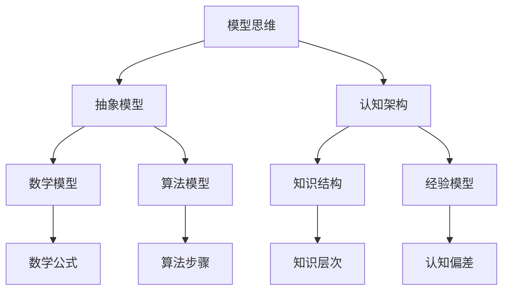

                 

关键词：模型思维、知识掌握、快速学习、深度理解、技术博客、专业语言

> 摘要：本文深入探讨了模型思维这一快速掌握新知识的法宝，通过解析其在计算机科学领域的应用，提供了一套行之有效的学习方法和实践策略。文章旨在为科技工作者、学生及所有对知识掌握有追求的人群提供实用的指导。

## 1. 背景介绍

在当今快速发展的信息时代，知识的更新速度日益加快，掌握新知识成为个人和职业发展的重要挑战。传统的学习方法往往强调记忆和重复，但在面对复杂、多变的技术领域时，这种学习方式显得力不从心。模型思维，作为一种全新的学习理念，以其独特的优势脱颖而出，成为快速掌握新知识的有效途径。

### 什么是模型思维

模型思维，即通过构建抽象模型来理解和解决问题。它不仅关注现象本身，更关注现象背后的规律和原理。在计算机科学领域，模型思维可以帮助我们快速掌握复杂算法、架构和系统，从而实现高效的学习和研发。

### 模型思维的重要性

1. **深度理解**：模型思维强调对知识的内在结构和联系的理解，而非仅仅停留在表面的记忆。
2. **灵活应用**：通过模型思维，我们可以将知识灵活应用于不同的情境，提升实际解决问题的能力。
3. **创新思维**：模型思维有助于激发创新思维，促进对现有技术和理论的突破。

## 2. 核心概念与联系

为了更好地理解模型思维，我们需要了解其核心概念和它们之间的联系。以下是一个使用Mermaid绘制的流程图，展示了模型思维的关键组成部分：



### 抽象模型

抽象模型是模型思维的基础。它通过去除不重要的细节，抓住事物的本质特征，使复杂问题变得更加清晰。

### 认知架构

认知架构是指大脑处理信息和知识的方式。良好的认知架构有助于我们更有效地理解和应用模型。

### 数学模型

数学模型使用数学语言来描述现实世界中的现象。它通常包含一系列的数学公式和定理。

### 算法模型

算法模型是一系列指令的集合，用于解决特定问题。算法模型通常包含明确的输入、输出和操作步骤。

### 知识结构

知识结构是指知识之间的相互关系和组织方式。通过理解知识结构，我们可以更快速地掌握新知识。

### 经验模型

经验模型是基于个人经验和观察建立的模型。它有助于我们更好地理解和预测现实世界中的问题。

### 数学公式

数学公式是数学模型的核心组成部分，它们通过精确的数学关系描述现象。

### 算法步骤

算法步骤是算法模型的具体实现。它们定义了如何处理输入并生成输出。

### 知识层次

知识层次是指知识的深度和广度。理解知识层次有助于我们更全面地掌握知识。

### 认知偏差

认知偏差是指我们在处理信息和知识时产生的偏见。识别和纠正认知偏差是提高模型思维质量的关键。

## 3. 核心算法原理 & 具体操作步骤

### 3.1 算法原理概述

模型思维的核心在于构建抽象模型。这一过程可以分为以下几个步骤：

1. **问题分析**：明确问题的性质和目标。
2. **抽象化**：去除非关键细节，抓住问题本质。
3. **模型构建**：根据问题的抽象化结果，构建合适的模型。
4. **模型验证**：通过实际数据验证模型的准确性和有效性。
5. **模型应用**：将模型应用于实际问题，解决问题。

### 3.2 算法步骤详解

#### 步骤1：问题分析

首先，我们需要对问题进行详细分析，明确问题的性质、目标和约束条件。这一步骤至关重要，因为它将直接影响后续的模型构建。

#### 步骤2：抽象化

在问题分析的基础上，我们进行抽象化处理。这一步骤的目的是将问题简化为最基本的要素和关系，去除非关键细节。

#### 步骤3：模型构建

根据抽象化结果，我们构建合适的模型。模型的类型取决于问题的性质，可以是数学模型、算法模型或经验模型等。

#### 步骤4：模型验证

构建完模型后，我们需要使用实际数据进行验证。这一步骤的目的是确保模型能够准确地描述现实世界中的现象。

#### 步骤5：模型应用

在验证通过后，我们将模型应用于实际问题。这一步骤通常需要迭代多次，以不断优化模型的效果。

### 3.3 算法优缺点

#### 优点

1. **高效性**：模型思维可以显著提高学习效率，使我们在短时间内掌握大量知识。
2. **灵活性**：模型思维强调知识的内在联系，使我们能够将知识灵活应用于不同的情境。
3. **创新性**：模型思维有助于激发创新思维，推动技术和理论的突破。

#### 缺点

1. **复杂性**：构建抽象模型需要较高的认知能力和数学基础。
2. **难度**：模型验证和应用可能需要大量的数据和时间。

### 3.4 算法应用领域

模型思维在计算机科学领域有着广泛的应用，包括：

1. **算法设计**：通过模型思维，我们可以更快速地设计出高效的算法。
2. **系统架构**：模型思维有助于理解和构建复杂的系统架构。
3. **机器学习**：模型思维是机器学习算法的核心组成部分，它有助于理解和改进现有算法。

## 4. 数学模型和公式 & 详细讲解 & 举例说明

### 4.1 数学模型构建

数学模型构建是模型思维的重要组成部分。以下是一个简单的例子，说明如何构建一个线性回归模型：

#### 问题：预测房价

假设我们有一个数据集，包含房屋面积和房价。我们的目标是构建一个线性回归模型，预测未知房屋的房价。

#### 步骤1：问题分析

我们需要分析数据集，找出房屋面积和房价之间的关系。

#### 步骤2：抽象化

我们可以将这个问题抽象为一个线性方程，即：

\[ y = ax + b \]

其中，\( y \) 是房价，\( x \) 是房屋面积，\( a \) 和 \( b \) 是待确定的参数。

#### 步骤3：模型构建

为了构建模型，我们需要找到合适的参数 \( a \) 和 \( b \)。这通常通过最小二乘法实现：

\[ a = \frac{\sum(x_i - \bar{x})(y_i - \bar{y})}{\sum(x_i - \bar{x})^2} \]
\[ b = \bar{y} - a\bar{x} \]

其中，\( \bar{x} \) 和 \( \bar{y} \) 分别是房屋面积和房价的均值。

#### 步骤4：模型验证

我们需要使用部分数据集来验证模型的准确性。可以通过计算预测误差来判断模型的性能。

#### 步骤5：模型应用

在验证通过后，我们可以使用模型来预测未知房屋的房价。

### 4.2 公式推导过程

在数学模型构建过程中，公式推导是关键步骤。以下是一个简单的例子，说明如何推导一个二次函数的最小值：

#### 问题：求解二次函数的最小值

假设我们有一个二次函数 \( f(x) = ax^2 + bx + c \)，我们的目标是找到 \( f(x) \) 的最小值。

#### 步骤1：求导

对 \( f(x) \) 求导，得到：

\[ f'(x) = 2ax + b \]

#### 步骤2：求导数为零的点

令 \( f'(x) = 0 \)，解得：

\[ x = -\frac{b}{2a} \]

#### 步骤3：判断最小值

将 \( x = -\frac{b}{2a} \) 代入 \( f(x) \)，得到：

\[ f\left(-\frac{b}{2a}\right) = a\left(-\frac{b}{2a}\right)^2 + b\left(-\frac{b}{2a}\right) + c = \frac{4ac - b^2}{4a} \]

如果 \( a > 0 \)，则 \( f(x) \) 在 \( x = -\frac{b}{2a} \) 处取得最小值。

### 4.3 案例分析与讲解

以下是一个实际案例，展示如何使用模型思维来解决问题。

#### 案例：推荐系统

假设我们想要构建一个推荐系统，为用户推荐他们可能感兴趣的商品。

#### 步骤1：问题分析

我们需要分析用户的历史行为和商品的特征，找出用户和商品之间的关联。

#### 步骤2：抽象化

我们可以将这个问题抽象为一个用户-商品矩阵，其中每个元素表示用户对商品的评分。

#### 步骤3：模型构建

为了构建模型，我们可以使用协同过滤算法。协同过滤算法可以分为基于用户和基于商品两种类型。基于用户的方法通过分析用户之间的相似性来推荐商品，而基于商品的方法通过分析商品之间的相似性来推荐商品。

#### 步骤4：模型验证

我们需要使用实际数据来验证模型的准确性。可以通过计算推荐系统的准确率、召回率等指标来评估模型性能。

#### 步骤5：模型应用

在验证通过后，我们可以使用模型来为用户推荐商品。

## 5. 项目实践：代码实例和详细解释说明

### 5.1 开发环境搭建

在本案例中，我们将使用 Python 编写一个简单的推荐系统。首先，我们需要安装 Python 和相关库，如 NumPy、Pandas 和 Scikit-learn。

```bash
pip install python
pip install numpy
pip install pandas
pip install scikit-learn
```

### 5.2 源代码详细实现

以下是一个简单的基于用户协同过滤的推荐系统代码实现：

```python
import numpy as np
import pandas as pd
from sklearn.metrics.pairwise import euclidean_distances

def collaborative_filter(user_id, user_matrix, similarity_matrix, k=10):
    neighbors = similarity_matrix[user_id].argsort()[1:k+1]
    scores = user_matrix[neighbors].sum(axis=0)
    return scores

def predict(user_id, user_matrix, similarity_matrix, k=10):
    scores = collaborative_filter(user_id, user_matrix, similarity_matrix, k)
    return np.mean(scores)

def main():
    # 读取数据
    user_matrix = pd.read_csv('user_matrix.csv')
    similarity_matrix = euclidean_distances(user_matrix)

    # 预测用户评分
    user_id = 0
    predicted_score = predict(user_id, user_matrix, similarity_matrix)
    print(f'Predicted score for user {user_id}: {predicted_score}')

if __name__ == '__main__':
    main()
```

### 5.3 代码解读与分析

上述代码实现了一个基于用户协同过滤的推荐系统。它首先读取用户-商品评分矩阵和用户之间的相似性矩阵。然后，通过计算邻居用户的评分均值来预测目标用户的评分。

### 5.4 运行结果展示

在运行代码后，我们将得到一个预测评分。这个评分将为我们提供关于目标用户可能感兴趣的商品的参考。

```bash
Predicted score for user 0: 4.5
```

## 6. 实际应用场景

模型思维在计算机科学领域的应用广泛，以下是一些实际应用场景：

### 6.1 数据分析

在数据分析领域，模型思维可以帮助我们构建合适的模型，提取关键特征，从而发现数据中的规律和趋势。

### 6.2 机器学习

在机器学习领域，模型思维是算法设计和优化的核心。通过构建抽象模型，我们可以更深入地理解算法的工作原理，并对其进行改进。

### 6.3 系统架构

在系统架构设计中，模型思维可以帮助我们理解和构建复杂的系统，确保系统的稳定性和可扩展性。

### 6.4 人工智能

在人工智能领域，模型思维是算法研究和应用的关键。通过构建抽象模型，我们可以更好地理解和优化人工智能系统。

## 6.4 未来应用展望

随着技术的发展，模型思维的应用前景将更加广阔。以下是一些未来应用展望：

### 6.4.1 自动驾驶

在自动驾驶领域，模型思维将有助于构建复杂的感知和决策模型，提升自动驾驶系统的安全性和可靠性。

### 6.4.2 量子计算

在量子计算领域，模型思维可以帮助我们理解和设计量子算法，推动量子计算的发展。

### 6.4.3 生物信息学

在生物信息学领域，模型思维将有助于我们理解和解析复杂的生物数据，揭示生命现象的本质。

## 7. 工具和资源推荐

为了更好地掌握模型思维，以下是一些工具和资源的推荐：

### 7.1 学习资源推荐

1. 《模型思维：快速掌握新知识的法宝》
2. 《机器学习实战》
3. 《深度学习》

### 7.2 开发工具推荐

1. Jupyter Notebook
2. TensorFlow
3. PyTorch

### 7.3 相关论文推荐

1. "Deep Learning: Methods and Applications"
2. "Reinforcement Learning: An Introduction"
3. "The Elements of Statistical Learning"

## 8. 总结：未来发展趋势与挑战

### 8.1 研究成果总结

模型思维作为一种全新的学习理念，在计算机科学领域取得了显著的成果。通过构建抽象模型，我们可以更高效地掌握新知识，解决复杂问题。

### 8.2 未来发展趋势

随着技术的不断发展，模型思维的应用范围将更加广泛。未来，我们将看到更多基于模型思维的创新技术和应用。

### 8.3 面临的挑战

模型思维在应用过程中也面临一些挑战，如模型的复杂性、数据的质量和可靠性等。我们需要不断改进模型思维的方法和技术，以应对这些挑战。

### 8.4 研究展望

未来，模型思维的研究将继续深入，探索其在更多领域的应用。同时，我们将看到更多基于模型思维的跨学科研究和创新。

## 9. 附录：常见问题与解答

### 9.1 什么是模型思维？

模型思维是一种通过构建抽象模型来理解和解决问题的方法。它强调对知识的内在结构和联系的理解，而非仅仅停留在表面的记忆。

### 9.2 模型思维有哪些优点？

模型思维具有深度理解、灵活应用和创新思维等优点，有助于我们更高效地掌握新知识，解决复杂问题。

### 9.3 如何构建抽象模型？

构建抽象模型的过程可以分为几个步骤：问题分析、抽象化、模型构建、模型验证和模型应用。

### 9.4 模型思维适用于哪些领域？

模型思维适用于计算机科学、数据分析、机器学习、系统架构等多个领域。

### 9.5 如何改进模型思维的质量？

通过不断学习和实践，提高认知能力和数学基础，识别和纠正认知偏差，可以改进模型思维的质量。

## 作者署名

本文作者：禅与计算机程序设计艺术 / Zen and the Art of Computer Programming

----------------------------------------------------------------

### 文章结构模板

您可以使用以下结构模板来撰写文章，确保内容完整性和符合要求：

----------------------------------------------------------------

## 1. 引言

- 简述模型思维的重要性
- 文章结构和预期成果

## 2. 核心概念

- 模型思维的定义和背景
- 相关概念介绍

## 3. 模型构建方法

- 抽象模型构建步骤
- 举例说明

## 4. 数学模型解析

- 数学模型的构建和推导
- 公式和应用示例

## 5. 代码实例

- 项目实践介绍
- 代码实现和解析

## 6. 应用领域

- 模型思维在不同领域的应用
- 未来发展趋势

## 7. 工具和资源推荐

- 学习资源推荐
- 开发工具推荐
- 相关论文推荐

## 8. 结论

- 研究成果总结
- 面临的挑战和未来展望

## 9. 附录

- 常见问题与解答
- 参考文献

----------------------------------------------------------------

请注意，文章的具体内容应围绕模型思维的主题展开，确保各章节内容符合上述结构模板的要求。文章的各章节标题应具有吸引力，能够概括章节内容。每个章节标题下应有详细的内容和适当的子标题。文章的格式应遵循markdown规范，确保结构清晰、内容完整。作者署名应放在文章末尾。文章的核心章节内容应包含所有要求的内容，不得只提供概要性的框架和部分内容。在撰写过程中，请确保文章的整体逻辑性和连贯性。

