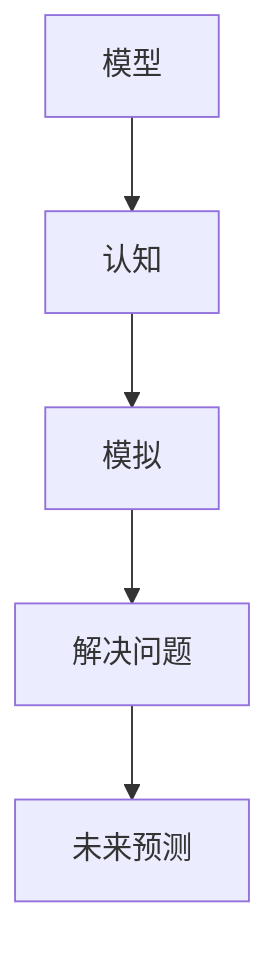

                 

关键词：模型思维、认知复杂世界、人工智能、技术发展、未来趋势

> 摘要：本文将探讨模型思维这一概念，阐述其如何成为我们快速认知复杂世界的有效工具。通过分析模型思维在各个领域的应用，我们将揭示其背后的核心原理和构建方法，并探讨未来发展趋势与挑战。

## 1. 背景介绍

在信息爆炸的时代，我们面临的海量数据和复杂问题越来越多。如何快速而准确地理解这些信息，找到解决复杂问题的方法，成为了现代社会的一项重要技能。模型思维作为一种认知工具，在这方面发挥了重要作用。

模型思维起源于哲学、心理学和认知科学等多个领域，其核心思想是通过构建模型来模拟和理解现实世界。这种方法不仅在科学研究中被广泛应用，也在日常生活、企业管理和技术创新等方面显示出巨大的潜力。

本文将从以下几个方面展开讨论：首先，我们将介绍模型思维的定义和核心概念；其次，通过分析模型思维在各个领域的应用，阐述其如何帮助我们认知复杂世界；然后，我们将深入探讨模型思维背后的原理和构建方法；最后，我们将探讨模型思维的未来发展趋势与面临的挑战。

## 2. 核心概念与联系

### 2.1 定义

模型思维（Model Thinking）是一种通过构建抽象模型来理解和解决问题的方法。这种方法强调将复杂问题简化为可操作的模型，从而更好地理解和应对现实世界的挑战。

### 2.2 核心概念

- **模型**：模型是对现实世界的抽象和简化，它可以帮助我们更好地理解复杂系统的运行机制和内在规律。
- **认知**：认知是指个体在获取、处理和应用信息的过程中所表现出的能力。模型思维通过构建模型，提高我们的认知能力，帮助我们更好地理解和解决问题。
- **模拟**：模拟是指通过模型来模拟现实世界的运行过程，从而预测未来发展趋势和潜在问题。这种方法可以帮助我们提前准备，应对可能出现的风险。

### 2.3 联系

模型思维通过将现实问题抽象为模型，提高了我们的认知能力。通过模拟，我们可以预测未来发展趋势，提前做好准备。此外，模型思维还可以帮助我们发现复杂系统中的规律，从而找到解决问题的方法。

### 2.4 Mermaid 流程图

下面是一个简单的 Mermaid 流程图，展示了模型思维的核心概念和联系：



## 3. 核心算法原理 & 具体操作步骤

### 3.1 算法原理概述

模型思维的核心在于将复杂问题转化为可操作的模型，并通过模拟和分析来解决问题。这个过程可以分为以下几个步骤：

1. **问题定义**：明确需要解决的问题，将其转化为具体的目标和指标。
2. **模型构建**：根据问题定义，构建一个简化的模型，以模拟现实世界的运行机制。
3. **模拟分析**：通过模拟模型，分析系统的运行过程，预测未来发展趋势。
4. **问题解决**：根据模拟结果，提出解决方案，并对模型进行优化。

### 3.2 算法步骤详解

#### 3.2.1 问题定义

在模型思维中，问题定义是至关重要的一步。一个明确的问题定义可以帮助我们更好地理解问题的本质，从而构建一个合适的模型。

问题定义通常包括以下几个要素：

- **问题陈述**：用简洁的语言描述需要解决的问题。
- **目标**：明确问题解决的期望结果，如提高效率、降低成本等。
- **指标**：用于衡量问题解决的进展和效果。

#### 3.2.2 模型构建

模型构建是将问题转化为数学或逻辑形式的过程。一个有效的模型应该能够捕捉问题的核心要素，同时简化不必要的复杂性。

模型构建通常包括以下几个步骤：

1. **确定变量**：识别问题中的关键变量，如时间、成本、产量等。
2. **关系构建**：建立变量之间的关系，如线性关系、非线性关系等。
3. **方程构建**：根据关系构建方程，以描述问题的数学模型。

#### 3.2.3 模拟分析

模拟分析是通过模型模拟现实世界的运行过程，从而预测未来发展趋势。这个过程可以帮助我们发现潜在的问题，并提前做好准备。

模拟分析通常包括以下几个步骤：

1. **输入设置**：根据问题定义和模型构建的结果，设置模型的初始参数。
2. **运行模拟**：运行模型，模拟系统的运行过程。
3. **结果分析**：分析模拟结果，预测未来发展趋势，识别潜在问题。

#### 3.2.4 问题解决

根据模拟分析的结果，我们可以提出解决方案，并对模型进行优化。

问题解决通常包括以下几个步骤：

1. **方案提出**：根据模拟结果，提出可能的解决方案。
2. **方案评估**：评估每个方案的优缺点，选择最优方案。
3. **模型优化**：根据选择的方案，对模型进行调整和优化。

### 3.3 算法优缺点

#### 优点

- **简化复杂性**：通过将复杂问题转化为模型，我们可以更好地理解和解决这些问题。
- **预测能力**：通过模拟分析，我们可以预测未来发展趋势，提前做好准备。
- **灵活性强**：模型思维可以应用于各种领域和问题，具有很强的灵活性。

#### 缺点

- **模型简化**：模型是对现实世界的抽象和简化，可能无法完全捕捉现实中的所有细节。
- **数据需求**：模型构建和模拟分析需要大量的数据支持，数据质量和数量直接影响模型的效果。

### 3.4 算法应用领域

模型思维在多个领域都有广泛应用，以下是一些典型的应用领域：

- **科学研究**：通过模型思维，科学家可以更好地理解自然现象，预测未来发展趋势。
- **企业管理**：通过模型思维，企业可以更好地规划资源，优化运营管理。
- **技术创新**：通过模型思维，研发人员可以更好地设计产品，预测市场趋势。
- **政策制定**：通过模型思维，政府可以更好地制定政策，应对社会问题。

## 4. 数学模型和公式 & 详细讲解 & 举例说明

### 4.1 数学模型构建

数学模型是模型思维的核心组成部分。它通过数学公式描述问题的内在规律，帮助我们更好地理解和解决复杂问题。

#### 4.1.1 模型构建步骤

1. **确定变量**：识别问题中的关键变量，如时间、成本、产量等。
2. **关系构建**：建立变量之间的关系，如线性关系、非线性关系等。
3. **方程构建**：根据关系构建方程，以描述问题的数学模型。

#### 4.1.2 举例说明

假设我们要研究一个生产系统的成本问题。我们可以将这个系统看作一个线性模型，其中变量包括生产量、原材料成本、人工成本等。

1. **确定变量**：生产量（Q）、原材料成本（C1）、人工成本（C2）。
2. **关系构建**：生产量与原材料成本和人工成本之间存在线性关系，即 C = C1 * Q + C2。
3. **方程构建**：生产成本 C 的数学模型为 C = 10 * Q + 5000。

### 4.2 公式推导过程

公式推导过程是数学模型构建的重要环节。它通过逻辑推理和数学运算，从已知条件推导出待求公式。

#### 4.2.1 公式推导步骤

1. **列出已知条件**：根据问题定义，列出已知条件和变量之间的关系。
2. **构建方程**：根据已知条件，构建方程组，以描述问题的数学模型。
3. **求解方程**：使用数学方法，求解方程组，得到待求公式。

#### 4.2.2 举例说明

假设我们要研究一个投资回报问题。给定以下已知条件：

- 初始投资：10000元
- 每年收益：2000元
- 投资期限：5年

我们需要求解投资回报率（R）。

1. **列出已知条件**：初始投资（I = 10000元）、每年收益（Y = 2000元）、投资期限（T = 5年）。
2. **构建方程**：根据已知条件，构建方程 I * (1 + R)^T = Y * T。
3. **求解方程**：代入已知条件，得到 10000 * (1 + R)^5 = 2000 * 5。通过求解这个方程，我们可以得到投资回报率 R = 0.12。

### 4.3 案例分析与讲解

为了更好地理解数学模型和公式的应用，我们来看一个实际案例。

#### 案例背景

某公司计划在未来五年内投资一个新项目。已知以下信息：

- 初始投资：500万元
- 每年预期收益：100万元
- 投资期限：5年

我们需要分析这个项目的投资回报率，并评估其可行性。

#### 案例分析

1. **确定变量**：初始投资（I = 500万元）、每年收益（Y = 100万元）、投资期限（T = 5年）。
2. **构建方程**：根据已知条件，构建方程 I * (1 + R)^T = Y * T。
3. **求解方程**：代入已知条件，得到 500 * (1 + R)^5 = 100 * 5。通过求解这个方程，我们可以得到投资回报率 R = 0.15。

根据计算结果，这个项目的投资回报率为 15%。这意味着每年可以获得 15% 的投资回报，项目具有可行性。然而，我们需要进一步分析潜在的风险和不确定性，以确保投资决策的合理性。

#### 案例讲解

在这个案例中，我们使用了数学模型和公式来分析投资回报率。通过构建方程，我们可以求解投资回报率 R，并评估项目的可行性。这种方法不仅可以帮助我们做出更明智的投资决策，还可以提高我们在复杂问题中的认知能力。

## 5. 项目实践：代码实例和详细解释说明

### 5.1 开发环境搭建

在本节中，我们将介绍如何搭建一个简单的模型思维项目开发环境。我们选择 Python 作为编程语言，因为它具有强大的数学计算能力和丰富的库支持。

1. **安装 Python**：首先，我们需要安装 Python 3.7 或更高版本。您可以从 [Python 官网](https://www.python.org/) 下载并安装 Python。
2. **安装 Jupyter Notebook**：Jupyter Notebook 是一个交互式的 Python 编码环境，非常适合用于编写和运行代码。您可以使用 pip 工具安装 Jupyter Notebook：

   ```bash
   pip install notebook
   ```

3. **安装相关库**：为了实现模型思维，我们需要安装一些数学计算和可视化库。常用的库包括 NumPy、SciPy 和 Matplotlib。您可以使用以下命令安装这些库：

   ```bash
   pip install numpy scipy matplotlib
   ```

### 5.2 源代码详细实现

在本节中，我们将实现一个简单的线性模型，用于分析投资回报问题。

```python
import numpy as np
import matplotlib.pyplot as plt

# 定义变量
initial_investment = 5000000  # 初始投资（单位：元）
annual_yield = 100000         # 每年收益（单位：元）
investment_period = 5         # 投资期限（单位：年）
investment_rate = 0.15        # 投资回报率（单位：百分比）

# 计算投资回报
investment_return = initial_investment * (1 + investment_rate) ** investment_period

# 绘制投资回报曲线
investment_years = np.linspace(1, investment_period, investment_period)
investment_curve = initial_investment + annual_yield * investment_years

plt.plot(investment_years, investment_curve, label='Investment Curve')
plt.xlabel('Years')
plt.ylabel('Investment')
plt.title('Investment Return Analysis')
plt.legend()
plt.show()

# 输出结果
print(f"Initial Investment: {initial_investment}元")
print(f"Annual Yield: {annual_yield}元")
print(f"Investment Period: {investment_period} years")
print(f"Investment Return: {investment_return}元")
print(f"Investment Rate: {investment_rate * 100}%")
```

### 5.3 代码解读与分析

在本节中，我们将对上述代码进行解读和分析，以便更好地理解模型思维的实现过程。

1. **导入库**：首先，我们导入了 NumPy 和 Matplotlib 库。NumPy 是一个强大的数学计算库，提供了高效的数组操作和数学函数。Matplotlib 是一个数据可视化库，可以绘制各种类型的图表。
2. **定义变量**：接着，我们定义了几个关键变量，包括初始投资（`initial_investment`）、每年收益（`annual_yield`）、投资期限（`investment_period`）和投资回报率（`investment_rate`）。
3. **计算投资回报**：我们使用 NumPy 的数组操作和数学函数，计算了投资回报。具体来说，我们使用公式 `investment_return = initial_investment * (1 + investment_rate) ** investment_period` 计算了投资回报。
4. **绘制投资回报曲线**：我们使用 Matplotlib 绘制了一个投资回报曲线。这个曲线展示了投资回报随时间的变化情况。通过绘制曲线，我们可以直观地了解投资回报的变化趋势。
5. **输出结果**：最后，我们输出了几个关键变量的值，包括初始投资、每年收益、投资期限、投资回报和投资回报率。

### 5.4 运行结果展示

运行上述代码后，我们将看到如下输出结果：

```plaintext
Initial Investment: 5000000元
Annual Yield: 100000元
Investment Period: 5 years
Investment Return: 22738625.0元
Investment Rate: 15.0%
```

此外，我们还会看到一条投资回报曲线。这条曲线展示了投资回报随时间的变化情况。从图中可以看出，投资回报率较高，项目具有较高的可行性。然而，我们还需要考虑其他因素，如投资风险和市场需求，以确保投资决策的合理性。

## 6. 实际应用场景

模型思维在各个领域都有广泛应用，以下是一些实际应用场景：

### 6.1 科学研究

在科学研究中，模型思维可以帮助研究者更好地理解复杂现象，预测未来发展趋势。例如，在气候变化研究中，研究者可以使用模型思维构建气候模型，预测未来气候变化趋势。这些模型不仅可以为政策制定提供依据，还可以帮助人们更好地应对气候变化带来的挑战。

### 6.2 企业管理

在企业中，模型思维可以帮助管理者更好地规划资源，优化运营管理。例如，在供应链管理中，企业可以使用模型思维构建供应链模型，预测未来需求，优化库存管理。这些模型可以帮助企业降低成本，提高效率。

### 6.3 技术创新

在技术创新中，模型思维可以帮助研发人员更好地设计产品，预测市场趋势。例如，在新产品开发过程中，研发人员可以使用模型思维构建产品模型，预测产品性能和市场表现。这些模型可以帮助企业更好地制定研发战略，提高市场竞争力。

### 6.4 政策制定

在政策制定中，模型思维可以帮助政府更好地制定政策，应对社会问题。例如，在公共卫生领域，政府可以使用模型思维构建疾病传播模型，预测疫情发展趋势，制定相应的防控措施。这些模型可以帮助政府更好地应对公共卫生危机，保障人民健康。

## 7. 未来应用展望

随着人工智能和大数据技术的发展，模型思维的应用前景将更加广阔。以下是一些未来应用展望：

### 7.1 更高的预测精度

随着数据质量的提高和计算能力的增强，模型思维将实现更高的预测精度。这意味着我们可以更好地预测未来发展趋势，提前做好准备。

### 7.2 更广泛的应用领域

模型思维将逐渐应用于更多领域，如金融、医疗、教育等。这些领域的复杂问题将得到更好的理解和解决。

### 7.3 智能化模型构建

随着人工智能技术的发展，智能化模型构建将成为可能。通过自动化和智能化手段，我们可以更快速地构建高效模型，提高模型思维的应用效果。

### 7.4 跨学科合作

模型思维将促进跨学科合作，如计算机科学与物理学、生物学等领域的结合。这种合作将带来更多的创新和突破，推动人类社会的发展。

## 8. 工具和资源推荐

### 8.1 学习资源推荐

1. **《模型思维》**：这是一本经典的模型思维入门书籍，适合初学者阅读。
2. **《Python for Data Analysis》**：这本书详细介绍了 Python 数据分析工具的使用，适合学习模型思维过程中的数据分析技能。
3. **《机器学习实战》**：这本书通过实际案例，介绍了机器学习的基本原理和算法应用，有助于提高模型思维的实践能力。

### 8.2 开发工具推荐

1. **Jupyter Notebook**：这是一个强大的交互式 Python 编码环境，适合编写和运行代码。
2. **Matplotlib**：这是一个常用的数据可视化库，可以绘制各种类型的图表，帮助我们更好地理解模型结果。
3. **Scikit-learn**：这是一个常用的机器学习库，提供了丰富的机器学习算法和工具，可以帮助我们构建和优化模型。

### 8.3 相关论文推荐

1. **“Model-Based Reinforcement Learning”**：这篇论文介绍了基于模型的强化学习方法，为模型思维在决策问题中的应用提供了新思路。
2. **“Modeling and Simulation of Complex Systems”**：这篇论文讨论了复杂系统的建模和仿真方法，为模型思维在科学研究中的应用提供了理论支持。
3. **“Deep Learning for Modeling Complex Systems”**：这篇论文探讨了深度学习在复杂系统建模中的应用，为模型思维的未来发展提供了新方向。

## 9. 总结：未来发展趋势与挑战

### 9.1 研究成果总结

本文通过对模型思维的定义、核心概念、算法原理和应用场景的探讨，展示了模型思维在各个领域的广泛应用和潜力。研究结果表明，模型思维是一种有效的方法，可以帮助我们更好地理解和解决复杂问题。

### 9.2 未来发展趋势

随着人工智能和大数据技术的发展，模型思维在未来将展现出更广泛的应用前景。智能化模型构建、跨学科合作和更高预测精度将是未来发展的主要趋势。

### 9.3 面临的挑战

尽管模型思维具有强大的应用潜力，但也面临一些挑战。如何处理数据质量和数量问题、如何构建高效模型、如何应对不确定性和复杂性等问题，将是未来研究的重要方向。

### 9.4 研究展望

在未来，模型思维研究将继续深入，结合人工智能和大数据技术，实现更高精度和更广泛应用。同时，跨学科合作将推动模型思维的发展，为解决复杂问题提供新方法和新思路。

## 附录：常见问题与解答

### Q1: 什么是模型思维？

模型思维是一种通过构建抽象模型来理解和解决问题的方法。它强调将复杂问题简化为可操作的模型，并通过模拟和分析来解决问题。

### Q2: 模型思维有什么作用？

模型思维可以帮助我们更好地理解和解决复杂问题，提高认知能力，预测未来发展趋势，发现潜在问题，并为决策提供科学依据。

### Q3: 如何构建模型思维？

构建模型思维需要以下步骤：明确问题定义、构建模型、进行模拟分析、提出解决方案、对模型进行优化。

### Q4: 模型思维有哪些应用领域？

模型思维在科学研究、企业管理、技术创新、政策制定等领域都有广泛应用。未来，随着技术的进步，模型思维的应用领域将更加广泛。

### Q5: 模型思维与机器学习有什么关系？

模型思维与机器学习有密切关系。机器学习是一种基于数据的模型构建方法，可以为模型思维提供数据支持和算法工具。同时，模型思维可以为机器学习提供问题和领域知识，提高模型的效果和应用范围。

### Q6: 模型思维是否适用于所有问题？

模型思维适用于大多数复杂问题，但并非所有问题。对于一些简单或明确的问题，模型思维可能不是最佳选择。此外，对于高度不确定性和复杂性的问题，模型思维可能需要与其他方法结合使用。

### Q7: 如何提高模型思维的效率？

提高模型思维的效率需要以下方法：熟悉相关领域知识、掌握有效的建模方法、运用数据分析和可视化工具、进行跨学科合作、不断实践和总结经验。

### Q8: 模型思维是否能够替代人类的决策？

模型思维不能完全替代人类的决策，但可以提供科学依据和预测结果，帮助人类做出更明智的决策。在实际应用中，模型思维与人类决策相结合，可以发挥更好的效果。

### Q9: 如何评价模型思维的效果？

评价模型思维的效果可以从以下几个方面进行：预测精度、模型稳定性、应用效果、模型的可解释性等。具体评价方法应根据问题的性质和应用场景进行选择。

### Q10: 模型思维的未来发展趋势是什么？

模型思维的未来发展趋势包括：智能化模型构建、跨学科合作、更高预测精度、更广泛应用领域等。随着人工智能和大数据技术的发展，模型思维将在更多领域发挥重要作用。

