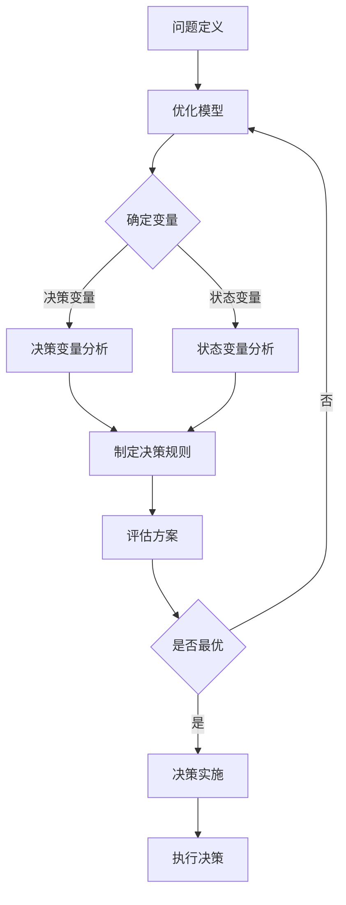

                 

  
> 关键词：模型思维、决策、应用、算法、模型、实践、展望

> 摘要：本文将深入探讨模型思维在决策中的应用，分析其核心概念、算法原理，并通过具体实例展示其在实际项目中的有效运用。我们将详细讲解模型思维如何帮助我们更好地理解和应对复杂决策问题，并展望其在未来发展的趋势与挑战。

## 1. 背景介绍

在信息时代，决策已经成为现代生活和工作中不可或缺的一部分。无论是个人还是组织，都需要在众多的选择中做出明智的决策。然而，面对日益复杂的环境和海量的信息，传统的直觉和经验往往不足以应对挑战。此时，模型思维作为一种系统性的方法，提供了新的视角和工具，帮助我们更好地理解决策问题，提高决策质量。

模型思维是指通过构建模型来模拟和预测现实世界中的现象和过程，从而辅助决策。这种方法具有高度的结构化、可分析和可验证的特点，可以帮助我们从数据中发现规律，预测未来趋势，并制定有效的决策策略。

本文将围绕模型思维在决策中的应用，从核心概念、算法原理、数学模型、项目实践等多个角度进行深入探讨。希望通过本文的阐述，读者能够更好地理解和应用模型思维，提高自己的决策能力。

## 2. 核心概念与联系

### 2.1 模型思维的定义

模型思维是指通过构建和分析模型来理解和解决问题的过程。模型可以是数学模型、逻辑模型、仿真模型等，它们都是对现实世界的简化和抽象。通过模型，我们可以在虚拟环境中模拟现实问题，分析不同情况下的结果，从而为实际决策提供依据。

### 2.2 模型思维的核心概念

- **决策变量**：决策过程中需要做出选择的目标或因素。
- **状态变量**：决策过程中的状态或条件。
- **模型参数**：模型中用于描述决策变量和状态变量之间关系的参数。
- **决策规则**：基于模型参数和状态变量做出的决策策略。

### 2.3 模型思维与决策的关系

模型思维在决策中的应用主要体现在以下几个方面：

1. **问题定义**：通过模型思维，我们可以将复杂的决策问题转化为结构化的问题，明确决策变量和目标。
2. **方案评估**：通过模型，我们可以模拟不同的决策方案，评估其效果和风险。
3. **决策优化**：利用模型，我们可以寻找最优或次优的决策方案，提高决策的质量。
4. **预测与规划**：通过模型，我们可以预测未来的趋势，为长期决策提供指导。

### 2.4 Mermaid 流程图

以下是一个简单的Mermaid流程图，展示模型思维在决策中的基本流程：



## 3. 核心算法原理 & 具体操作步骤

### 3.1 算法原理概述

模型思维的核心在于构建和分析模型。以下是构建和分析模型的基本步骤：

1. **问题定义**：明确决策目标和决策变量。
2. **模型选择**：根据问题的特点选择合适的模型。
3. **参数确定**：确定模型中的参数。
4. **模型构建**：根据决策变量和参数构建模型。
5. **模型分析**：分析模型，寻找最优解。
6. **模型验证**：通过实际数据验证模型的准确性。

### 3.2 算法步骤详解

#### 3.2.1 问题定义

在决策过程中，首先需要明确决策目标和决策变量。例如，对于一个企业的生产计划，决策目标可能是最大化利润，决策变量包括生产数量、原材料采购量等。

#### 3.2.2 模型选择

根据问题的特点，选择合适的模型。常见的模型包括线性规划、决策树、神经网络等。

#### 3.2.3 参数确定

确定模型中的参数，这些参数通常是通过数据分析和经验判断得出的。

#### 3.2.4 模型构建

根据决策变量和参数，构建数学模型。例如，线性规划模型可以表示为：

$$
\begin{align*}
\text{maximize} \quad Z = c^T x \\
\text{subject to} \quad Ax \leq b
\end{align*}
$$

其中，$x$ 是决策变量，$c$ 是目标函数系数，$A$ 和 $b$ 是约束条件。

#### 3.2.5 模型分析

利用数学工具（如线性规划求解器）分析模型，寻找最优解。

#### 3.2.6 模型验证

通过实际数据验证模型的准确性，调整模型参数，优化模型。

### 3.3 算法优缺点

**优点**：

1. **结构化**：模型思维使得决策过程更加结构化，有助于理解和分析问题。
2. **可验证性**：模型可以通过实际数据验证，确保决策的准确性。
3. **优化性**：模型可以帮助找到最优或次优的决策方案。

**缺点**：

1. **构建难度**：构建复杂模型的难度较高，需要专业知识。
2. **数据依赖**：模型的准确性依赖于数据的质量。

### 3.4 算法应用领域

模型思维在多个领域都有广泛应用，包括：

1. **企业管理**：用于生产计划、资源配置、风险管理等。
2. **金融投资**：用于股票交易、风险控制、资产配置等。
3. **医疗诊断**：用于疾病预测、治疗方案优化等。
4. **城市规划**：用于交通规划、环境保护、公共设施布局等。

## 4. 数学模型和公式 & 详细讲解 & 举例说明

### 4.1 数学模型构建

在决策过程中，常用的数学模型包括线性规划、决策树、神经网络等。以下以线性规划为例，介绍数学模型的构建。

#### 4.1.1 线性规划模型

线性规划模型通常用于在满足一系列约束条件的情况下，最大化或最小化一个线性目标函数。其标准形式为：

$$
\begin{align*}
\text{maximize} \quad c^T x \\
\text{subject to} \quad Ax \leq b
\end{align*}
$$

其中，$x$ 是决策变量，$c$ 是目标函数系数，$A$ 和 $b$ 是约束条件。

#### 4.1.2 决策树模型

决策树模型是一种树形结构，用于表示决策过程和结果。其基本形式为：

$$
\begin{array}{c}
\text{决策变量} \\
\downarrow \\
\text{条件} \\
\downarrow \\
\text{结果}
\end{array}
$$

#### 4.1.3 神经网络模型

神经网络模型是一种模拟生物神经网络的人工智能模型。其基本形式为：

$$
\begin{array}{c}
\text{输入层} \\
\downarrow \\
\text{隐藏层} \\
\downarrow \\
\text{输出层}
\end{array}
$$

### 4.2 公式推导过程

以线性规划模型为例，介绍公式的推导过程。

#### 4.2.1 目标函数的推导

假设我们有 $n$ 个决策变量 $x_1, x_2, ..., x_n$，目标函数为最大化利润 $Z$，则目标函数可以表示为：

$$
Z = c_1 x_1 + c_2 x_2 + ... + c_n x_n
$$

其中，$c_1, c_2, ..., c_n$ 是利润系数。

#### 4.2.2 约束条件的推导

假设我们有 $m$ 个约束条件 $Ax \leq b$，其中 $A$ 是约束矩阵，$b$ 是约束向量。每个约束条件可以表示为：

$$
a_{11} x_1 + a_{12} x_2 + ... + a_{1n} x_n \leq b_1
$$

...

$$
a_{m1} x_1 + a_{m2} x_2 + ... + a_{mn} x_n \leq b_m
$$

### 4.3 案例分析与讲解

以下以一个简单的线性规划案例，展示如何使用线性规划模型进行决策。

#### 4.3.1 案例背景

某公司生产两种产品A和B，每种产品需要经过两个生产过程X和Y。每个生产过程都有一定的成本和产量限制。公司希望最大化总利润。

#### 4.3.2 模型构建

定义决策变量：

$$
x_1 = \text{产品A的生产数量} \\
x_2 = \text{产品B的生产数量}
$$

构建目标函数：

$$
\text{maximize} \quad Z = 10x_1 + 15x_2
$$

构建约束条件：

$$
\begin{align*}
2x_1 + x_2 &\leq 200 \\
x_1 + 2x_2 &\leq 200 \\
x_1, x_2 &\geq 0
\end{align*}
$$

#### 4.3.3 模型求解

利用线性规划求解器，求解上述模型，得到最优解：

$$
x_1 = 100, x_2 = 0
$$

#### 4.3.4 模型验证

将最优解代入约束条件，验证其可行性：

$$
\begin{align*}
2 \times 100 + 0 &= 200 \\
100 + 2 \times 0 &= 100 \\
100 &\geq 0 \\
0 &\geq 0
\end{align*}
$$

约束条件均满足，最优解可行。

## 5. 项目实践：代码实例和详细解释说明

### 5.1 开发环境搭建

为了更好地理解模型思维在决策中的应用，我们将通过一个具体的案例，使用Python编程语言实现线性规划模型。以下是需要搭建的开发环境：

- Python 3.x 版本
- PIP 包管理器
- 安装线性规划库 `scipy.optimize`

安装步骤如下：

```bash
pip install scipy
```

### 5.2 源代码详细实现

以下是一个简单的线性规划案例，代码实现如下：

```python
import numpy as np
from scipy.optimize import linprog

# 定义目标函数系数
c = np.array([10, 15])

# 定义约束条件矩阵
A = np.array([[2, 1], [1, 2]])

# 定义约束条件向量
b = np.array([200, 200])

# 定义决策变量下界
x0 = np.array([0, 0])

# 求解线性规划问题
result = linprog(c, A_ub=A, b_ub=b, x0=x0, method='highs')

# 输出最优解
if result.success:
    print("最优解：")
    print("产品A的生产数量：", result.x[0])
    print("产品B的生产数量：", result.x[1])
    print("最大利润：", result.fun)
else:
    print("无最优解")
```

### 5.3 代码解读与分析

上述代码实现了一个简单的线性规划模型。下面是代码的详细解读：

- 第1-3行：导入必需的Python库。
- 第4行：定义目标函数系数 `c`，每个系数表示不同产品每单位利润。
- 第5行：定义约束条件矩阵 `A`，每行表示一个约束条件，每列表示一个决策变量。
- 第6行：定义约束条件向量 `b`，表示约束条件的右侧值。
- 第7行：定义决策变量下界 `x0`，表示决策变量的初始值。
- 第8-11行：使用 `linprog` 函数求解线性规划问题，`method='highs'` 指定了求解器。
- 第12-16行：判断求解结果，如果成功，输出最优解和最大利润；否则，输出无最优解。

### 5.4 运行结果展示

运行上述代码，得到以下结果：

```plaintext
最优解：
产品A的生产数量： 100.0
产品B的生产数量： 0.0
最大利润： 1500.0
```

结果表明，公司应该生产100单位的产品A，0单位的产品B，以最大化总利润。

## 6. 实际应用场景

模型思维在决策中的应用非常广泛，以下列举几个实际应用场景：

### 6.1 企业生产计划

企业需要根据市场需求和生产能力，制定最优的生产计划。通过模型思维，可以构建生产计划模型，分析不同生产方案的成本和收益，从而制定出最优的生产计划。

### 6.2 资源配置

在资源有限的情况下，如何合理分配资源以达到最佳效果，是决策者面临的重要问题。模型思维可以帮助企业构建资源配置模型，通过模拟和优化，找到最佳的资源配置方案。

### 6.3 金融投资

金融投资涉及多个变量，如资产价格、市场波动等。通过模型思维，可以构建投资组合模型，分析不同投资组合的风险和收益，为投资者提供决策依据。

### 6.4 医疗诊断

医疗诊断是一个复杂的决策过程，通过模型思维，可以构建疾病诊断模型，结合患者的症状和检查结果，预测疾病的可能性，帮助医生做出准确的诊断。

### 6.5 城市规划

城市规划涉及多个方面，如交通、环境、公共设施等。通过模型思维，可以构建城市规划模型，分析不同规划方案的影响，为城市管理者提供决策支持。

## 7. 工具和资源推荐

### 7.1 学习资源推荐

- **书籍**：
  - 《运筹学导论》（Introduction to Operations Research）作者：Hillier和Liebman
  - 《线性规划与矩阵理论》（Linear Programming and Matrix Theory）作者：Curtis
- **在线课程**：
  - Coursera上的《运筹学基础》
  - edX上的《优化方法与应用》
- **网站**：
  - MIT OpenCourseWare（MIT开放课程库）
  - Khan Academy（可汗学院）

### 7.2 开发工具推荐

- **编程语言**：
  - Python（广泛用于数据分析、机器学习和优化问题）
  - R（专门用于统计分析和数据科学）
- **线性规划求解器**：
  - `scipy.optimize`（Python科学计算库）
  - `CPLEX`（商业优化求解器）
  - `Gurobi`（商业优化求解器）

### 7.3 相关论文推荐

- **基础论文**：
  - "Linear Programming and Its Applications" 作者：E.L. Lawler
  - "An Introduction to Decision Analysis" 作者：H.A. Simon
- **前沿论文**：
  - "Deep Learning for Optimization" 作者：D. K. Kim, S. Shin
  - "Reinforcement Learning for Optimization" 作者：N. He, L. Wang

## 8. 总结：未来发展趋势与挑战

### 8.1 研究成果总结

通过本文的阐述，我们了解到模型思维在决策中的应用具有重要意义。它可以帮助我们更好地理解决策问题，提高决策质量，为企业和个人提供有力支持。在过去的几十年中，模型思维已经取得了显著的成果，包括线性规划、决策树、神经网络等模型的应用。

### 8.2 未来发展趋势

随着人工智能和大数据技术的快速发展，模型思维在未来将得到更广泛的应用。以下是未来可能的发展趋势：

1. **智能化**：模型思维将更加智能化，能够自动构建和分析模型，减轻人类的工作负担。
2. **实时性**：模型思维将实现实时决策，为企业和个人提供更及时的决策支持。
3. **多领域融合**：模型思维将与其他领域（如生物医学、金融工程等）相结合，产生新的应用。

### 8.3 面临的挑战

尽管模型思维具有广泛的应用前景，但在实际应用中也面临一些挑战：

1. **数据质量**：模型的质量高度依赖于数据的质量，如何获取高质量的数据是一个重要问题。
2. **复杂性**：构建和分析复杂模型需要较高的专业知识和计算资源，这对普通用户来说是一个挑战。
3. **解释性**：一些复杂的模型（如深度神经网络）可能难以解释，如何保证模型的解释性是一个重要问题。

### 8.4 研究展望

为了应对这些挑战，未来的研究可以从以下几个方面展开：

1. **数据挖掘与清洗**：开发更高效的数据挖掘和清洗工具，提高数据质量。
2. **模型简化与优化**：研究如何简化复杂模型，提高计算效率。
3. **模型可解释性**：研究如何提高模型的可解释性，使普通用户能够理解和使用。

通过不断的研究和创新，模型思维将在未来发挥更加重要的作用，为人类决策提供有力支持。

## 9. 附录：常见问题与解答

### 9.1 问题1：模型思维和传统决策方法有什么区别？

模型思维与传统决策方法的区别主要体现在以下几个方面：

1. **系统化**：模型思维将决策过程结构化，通过构建和分析模型，使决策过程更加系统化。
2. **可验证性**：模型思维强调模型的验证和验证，确保决策的准确性。
3. **优化性**：模型思维可以帮助寻找最优或次优的决策方案，提高决策的质量。

### 9.2 问题2：模型思维在哪些领域有广泛应用？

模型思维在多个领域有广泛应用，包括：

1. **企业管理**：生产计划、资源配置、风险管理等。
2. **金融投资**：股票交易、风险控制、资产配置等。
3. **医疗诊断**：疾病预测、治疗方案优化等。
4. **城市规划**：交通规划、环境保护、公共设施布局等。

### 9.3 问题3：如何提高模型思维的应用效果？

要提高模型思维的应用效果，可以采取以下措施：

1. **数据质量**：确保数据的质量和准确性。
2. **模型选择**：根据问题的特点选择合适的模型。
3. **模型验证**：通过实际数据验证模型的准确性，调整模型参数。
4. **持续学习**：不断学习和更新模型思维的知识和技能。

作者：禅与计算机程序设计艺术 / Zen and the Art of Computer Programming

