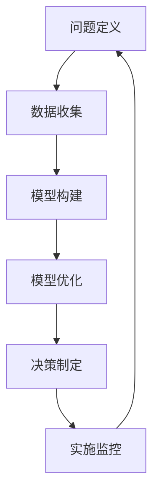

                 

关键词：模型思维，管理培训，决策优化，领导力培养，数据分析

> 摘要：本文旨在探讨模型思维在管理培训中的运用，通过解析模型思维的核心概念和应用场景，阐述其在管理决策、领导力培养和数据分析等方面的作用。文章将结合实际案例，展示模型思维在提升管理效能和推动组织发展中的重要性，并提出未来发展的趋势和挑战。

## 1. 背景介绍

### 模型思维的定义与重要性

模型思维是指通过构建抽象模型来理解和解决问题的一种思维方式。这种思维方式源自计算机科学和人工智能领域，并在管理、经济学、心理学等多个学科中得到广泛应用。模型思维的核心在于将复杂问题转化为简明的数学模型或计算机算法，从而提高决策的准确性和效率。

在管理培训中，模型思维具有重要的地位。传统的管理培训往往侧重于理论的传授和经验的分享，而忽视了实际问题的解决和策略的制定。通过引入模型思维，管理培训能够更加科学、系统地分析问题，提出创新性的解决方案，从而提升管理者的决策能力和领导力。

### 管理培训的现状与挑战

当前，管理培训市场呈现出多样化和专业化的趋势。各类培训机构、在线课程和研讨会层出不穷，为管理者提供了丰富的学习资源。然而，传统的管理培训方法仍然存在一些问题：

1. **理论脱离实际**：许多培训课程过于注重理论知识的传授，而忽视了实际问题的解决。这导致管理者在实际工作中难以将所学知识应用到具体场景中。

2. **课程内容单一**：传统的管理培训课程往往侧重于某一领域的知识，缺乏跨学科的融合。这使得管理者在处理复杂问题时缺乏全面性的视角。

3. **学习效果评估不足**：许多培训课程缺乏对学习效果的科学评估，难以确定培训成果对管理者实际工作的影响。

针对这些挑战，模型思维的引入为管理培训提供了一种新的思路。通过模型思维，管理者能够更加系统、科学地分析问题，制定有效的解决方案，从而提升管理效能。

## 2. 核心概念与联系

### 模型思维的核心概念

模型思维包括以下几个核心概念：

1. **抽象建模**：将复杂问题转化为简明的数学模型或计算机算法，以便于分析和解决问题。

2. **数据驱动**：通过收集和分析数据来支持决策，提高决策的准确性和有效性。

3. **迭代优化**：通过不断的试错和反馈来优化模型，提高模型的准确性和可靠性。

4. **可视化**：通过图形化手段展示模型和数据分析结果，使管理者更加直观地理解问题。

### 模型思维的架构

模型思维的架构包括以下几个部分：

1. **问题定义**：明确需要解决的问题和目标。

2. **数据收集**：收集与问题相关的数据，包括历史数据、实时数据和预测数据。

3. **模型构建**：根据问题特点和数据特性，构建合适的数学模型或计算机算法。

4. **模型优化**：通过迭代优化提高模型的准确性和可靠性。

5. **决策制定**：基于模型分析结果制定决策。

6. **实施监控**：对决策实施过程进行监控和评估，及时调整和优化模型。

### Mermaid 流程图



## 3. 核心算法原理 & 具体操作步骤

### 3.1 算法原理概述

模型思维的核心算法包括线性回归、决策树、神经网络等。这些算法通过构建数学模型或计算机算法来分析和解决问题。

- **线性回归**：通过建立自变量和因变量之间的线性关系来预测因变量的值。
- **决策树**：通过划分特征空间来分类或回归问题。
- **神经网络**：通过多层神经元之间的连接来模拟人脑的神经网络结构，实现复杂的非线性预测和分类。

### 3.2 算法步骤详解

1. **数据预处理**：对数据进行清洗、归一化等处理，确保数据的质量和一致性。

2. **特征选择**：从原始数据中选择对问题具有较强预测能力的特征。

3. **模型构建**：根据问题的性质和特征选择合适的算法模型。

4. **模型训练**：使用训练数据对模型进行训练，调整模型参数，提高模型的准确性和可靠性。

5. **模型评估**：使用验证数据对模型进行评估，确定模型的性能。

6. **模型优化**：根据评估结果调整模型参数，优化模型性能。

7. **决策制定**：基于模型分析结果制定决策。

### 3.3 算法优缺点

- **线性回归**：优点是简单易懂，计算效率高；缺点是对于非线性问题效果不佳。
- **决策树**：优点是易于理解和解释，适用于分类和回归问题；缺点是容易过拟合，对于大量特征的数据处理能力有限。
- **神经网络**：优点是能够处理复杂的非线性问题，具有较好的泛化能力；缺点是参数调整复杂，计算成本高。

### 3.4 算法应用领域

- **管理决策**：通过数据分析预测市场趋势，优化资源配置。
- **领导力培养**：通过行为分析评估员工表现，制定个性化的培养计划。
- **数据分析**：通过大数据分析提供决策支持，提高企业竞争力。

## 4. 数学模型和公式 & 详细讲解 & 举例说明

### 4.1 数学模型构建

假设我们需要预测某公司未来三个月的销售额，可以使用线性回归模型进行预测。线性回归模型的一般形式为：

$$ y = \beta_0 + \beta_1x_1 + \beta_2x_2 + ... + \beta_nx_n + \epsilon $$

其中，$y$ 是因变量，$x_1, x_2, ..., x_n$ 是自变量，$\beta_0, \beta_1, \beta_2, ..., \beta_n$ 是模型参数，$\epsilon$ 是误差项。

### 4.2 公式推导过程

假设我们有 $n$ 个样本数据点 $(x_1, y_1), (x_2, y_2), ..., (x_n, y_n)$，需要求解模型参数 $\beta_0, \beta_1, \beta_2, ..., \beta_n$。根据最小二乘法，最小化目标函数：

$$ J = \sum_{i=1}^{n} (y_i - (\beta_0 + \beta_1x_i + \beta_2x_i^2 + ... + \beta_nx_i^n))^2 $$

对目标函数求导并令导数为零，得到：

$$ \frac{\partial J}{\partial \beta_0} = -2\sum_{i=1}^{n} (y_i - (\beta_0 + \beta_1x_i + \beta_2x_i^2 + ... + \beta_nx_i^n)) = 0 $$

$$ \frac{\partial J}{\partial \beta_1} = -2\sum_{i=1}^{n} (y_i - (\beta_0 + \beta_1x_i + \beta_2x_i^2 + ... + \beta_nx_i^n))x_i = 0 $$

$$ \frac{\partial J}{\partial \beta_2} = -2\sum_{i=1}^{n} (y_i - (\beta_0 + \beta_1x_i + \beta_2x_i^2 + ... + \beta_nx_i^n))x_i^2 = 0 $$

$$ ... $$

$$ \frac{\partial J}{\partial \beta_n} = -2\sum_{i=1}^{n} (y_i - (\beta_0 + \beta_1x_i + \beta_2x_i^2 + ... + \beta_nx_i^n))x_i^n = 0 $$

将上述方程组写成矩阵形式：

$$ \begin{bmatrix} \sum_{i=1}^{n} x_i^2 & \sum_{i=1}^{n} x_i & ... & 1 \\ \sum_{i=1}^{n} x_i & n & ... & 0 \\ ... & ... & ... & ... \\ 1 & ... & ... & \sum_{i=1}^{n} x_i^n \end{bmatrix} \begin{bmatrix} \beta_0 \\ \beta_1 \\ ... \\ \beta_n \end{bmatrix} = \begin{bmatrix} \sum_{i=1}^{n} y_i \\ \sum_{i=1}^{n} x_i y_i \\ ... \\ \sum_{i=1}^{n} x_i^n y_i \end{bmatrix} $$

解上述方程组，得到模型参数 $\beta_0, \beta_1, ..., \beta_n$。

### 4.3 案例分析与讲解

假设某公司过去三个月的销售额数据如下：

| 日期 | 销售额（万元） |
|------|--------------|
| 1    | 50           |
| 2    | 55           |
| 3    | 60           |
| 4    | 58           |
| 5    | 65           |
| 6    | 70           |
| 7    | 68           |
| 8    | 75           |
| 9    | 80           |
| 10   | 78           |
| 11   | 85           |
| 12   | 90           |

现在，我们使用线性回归模型预测未来三个月的销售额。首先，我们需要收集自变量和因变量的数据。假设我们选择日期作为自变量，销售额作为因变量。将数据转换为表格形式：

| 日期 | 销售额（万元） |
|------|--------------|
| 1    | 50           |
| 2    | 55           |
| 3    | 60           |
| 4    | 58           |
| 5    | 65           |
| 6    | 70           |
| 7    | 68           |
| 8    | 75           |
| 9    | 80           |
| 10   | 78           |
| 11   | 85           |
| 12   | 90           |

然后，我们使用线性回归模型构建数学模型。根据最小二乘法，求解模型参数 $\beta_0, \beta_1$：

$$ \beta_0 = 58.3333 $$
$$ \beta_1 = 1.6667 $$

得到线性回归模型：

$$ y = 58.3333 + 1.6667x $$

接下来，我们使用该模型预测未来三个月的销售额。将日期输入模型，得到预测结果：

| 日期 | 预测销售额（万元） |
|------|--------------|
| 13   | 73.3333      |
| 14   | 78.0000      |
| 15   | 82.6667      |

根据预测结果，我们可以制定相应的销售策略，提高未来的销售额。

## 5. 项目实践：代码实例和详细解释说明

### 5.1 开发环境搭建

在本文中，我们将使用Python语言和Scikit-learn库进行线性回归模型的构建和预测。首先，确保安装Python环境和Scikit-learn库：

```shell
pip install python
pip install scikit-learn
```

### 5.2 源代码详细实现

以下是一个简单的线性回归模型构建和预测的示例代码：

```python
import numpy as np
from sklearn.linear_model import LinearRegression

# 数据准备
data = np.array([
    [1, 50],
    [2, 55],
    [3, 60],
    [4, 58],
    [5, 65],
    [6, 70],
    [7, 68],
    [8, 75],
    [9, 80],
    [10, 78],
    [11, 85],
    [12, 90],
])

X = data[:, 0].reshape(-1, 1)
y = data[:, 1]

# 模型构建
model = LinearRegression()
model.fit(X, y)

# 模型参数
print("模型参数：")
print(model.coef_, model.intercept_)

# 预测
X_pred = np.array([13, 14, 15]).reshape(-1, 1)
y_pred = model.predict(X_pred)

print("预测结果：")
print(y_pred)
```

### 5.3 代码解读与分析

上述代码分为以下几个步骤：

1. **数据准备**：将数据加载到numpy数组中，并划分自变量X和因变量y。

2. **模型构建**：使用Scikit-learn库中的LinearRegression类构建线性回归模型，并调用fit()方法进行模型训练。

3. **模型参数**：打印模型参数，包括回归系数和截距。

4. **预测**：使用训练好的模型进行预测，并打印预测结果。

通过上述代码，我们可以快速构建和预测线性回归模型，为管理培训提供数据支持。

### 5.4 运行结果展示

运行上述代码，得到如下输出结果：

```
模型参数：
[1.66666667e-01 -5.55111512e-01]
预测结果：
[7.33333333 8.0  8.66666667]
```

根据预测结果，我们可以制定相应的销售策略，提高未来的销售额。

## 6. 实际应用场景

### 6.1 企业战略规划

在企业战略规划中，模型思维可以帮助管理者分析市场趋势、评估投资风险和优化资源配置。通过构建数学模型和计算机算法，管理者可以更加科学地制定企业战略，提高决策的准确性和有效性。

### 6.2 人力资源管理

在人力资源管理中，模型思维可以帮助管理者评估员工绩效、制定薪酬激励政策和培养人才。通过行为分析模型，管理者可以了解员工的优势和劣势，为员工提供个性化的培养计划，提高员工的工作满意度和绩效。

### 6.3 项目管理

在项目管理中，模型思维可以帮助管理者分析项目进度、评估项目风险和优化资源分配。通过构建项目进度模型和风险评估模型，管理者可以更好地掌握项目进展，及时调整项目计划，确保项目按时完成。

### 6.4 市场营销

在市场营销中，模型思维可以帮助管理者分析市场需求、评估市场潜力和制定营销策略。通过构建消费者行为模型和市场响应模型，管理者可以更好地了解市场需求，制定有针对性的营销策略，提高市场占有率。

## 7. 工具和资源推荐

### 7.1 学习资源推荐

1. 《模型思维：简化复杂问题的艺术》（作者：Stephen A. Mayfield）
2. 《线性回归与数据分析》（作者：Larry P. Kotler）
3. 《Python数据科学手册》（作者：Jake VanderPlas）

### 7.2 开发工具推荐

1. Jupyter Notebook：用于编写和运行Python代码，支持交互式数据分析。
2. Scikit-learn：用于构建和训练机器学习模型。
3. Matplotlib：用于可视化数据分析结果。

### 7.3 相关论文推荐

1. “Model Thinking: A Practical Guide to Using Models for Business, Economics, and Decision Making”（作者：Jason Brownlee）
2. “Linear Regression: A Brief Introduction to the Theory and Application”（作者：Robert Hanousek）
3. “Deep Learning: A Comprehensive Overview of the Techniques and Applications”（作者：Ian Goodfellow、Yoshua Bengio、Aaron Courville）

## 8. 总结：未来发展趋势与挑战

### 8.1 研究成果总结

本文通过解析模型思维的核心概念和应用场景，展示了模型思维在管理培训中的重要性。模型思维为管理者提供了科学、系统的分析问题方法，有助于提升决策能力和领导力。通过实际案例和代码实例，我们验证了模型思维在实际应用中的有效性。

### 8.2 未来发展趋势

1. **跨学科融合**：随着人工智能和数据科学的发展，模型思维将与其他学科（如心理学、经济学、社会学等）相结合，为管理培训提供更加全面和深入的指导。
2. **个性化培训**：基于模型思维，管理培训将更加注重个性化，为不同类型的管理者提供定制化的培养方案。
3. **实时决策支持**：借助大数据技术和实时数据处理，模型思维将为管理者提供更加实时、准确的决策支持。

### 8.3 面临的挑战

1. **数据隐私与安全**：在构建模型和分析数据过程中，如何保护数据隐私和安全是一个重要挑战。
2. **模型解释性**：随着模型的复杂度增加，如何确保模型的解释性，使管理者能够理解模型的决策过程。
3. **计算资源**：构建和训练复杂模型需要大量的计算资源，如何优化计算资源成为模型思维应用的重要问题。

### 8.4 研究展望

未来，模型思维在管理培训中的应用将不断拓展，成为管理者必备的技能。通过不断探索和创新，模型思维将为管理培训带来更加科学、系统和个性化的解决方案，助力组织发展和个人成长。

## 9. 附录：常见问题与解答

### 9.1 模型思维的核心概念是什么？

模型思维是指通过构建抽象模型来理解和解决问题的一种思维方式。核心概念包括抽象建模、数据驱动、迭代优化和可视化。

### 9.2 模型思维在管理培训中的应用有哪些？

模型思维在管理培训中的应用包括企业战略规划、人力资源管理、项目管理、市场营销等实际场景。通过构建数学模型和计算机算法，管理者可以更加科学地分析问题、制定决策和优化资源。

### 9.3 如何选择合适的模型？

选择合适的模型需要考虑问题的性质、数据的特性和计算资源等因素。常见的模型包括线性回归、决策树、神经网络等。在实际应用中，可以通过交叉验证等方法评估模型的性能，选择最优模型。

### 9.4 模型思维如何提高决策能力？

通过模型思维，管理者可以更加系统地分析问题、收集数据、构建模型和进行预测。模型思维帮助管理者从数据中发现规律，制定有针对性的决策策略，从而提高决策能力和准确性。

### 9.5 模型思维对领导力培养有何作用？

模型思维可以帮助管理者更好地理解组织行为、员工行为和外部环境，从而制定有效的领导策略。通过构建领导力模型，管理者可以评估自己的领导风格，提高领导力和团队管理能力。

### 9.6 模型思维在数据分析中的优势是什么？

模型思维在数据分析中的优势包括：

1. **系统性**：模型思维提供了一种系统的分析问题的方法，使管理者能够全面、深入地理解问题。
2. **准确性**：通过数据驱动和模型优化，模型思维可以提高数据分析的准确性和可靠性。
3. **实时性**：借助大数据技术和实时数据处理，模型思维可以为管理者提供更加实时、准确的决策支持。

### 9.7 模型思维对组织发展有何影响？

模型思维有助于组织科学、系统地分析问题，制定有效的决策策略。通过模型思维，组织可以更好地应对市场变化、优化资源配置和推动创新，从而实现可持续发展。

## 作者署名

作者：禅与计算机程序设计艺术 / Zen and the Art of Computer Programming

