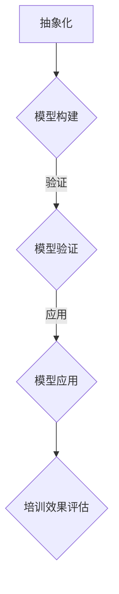

                 

关键词：模型思维、管理培训、学习理论、人工智能、案例研究

> 摘要：本文旨在探讨模型思维在管理培训中的应用。通过结合现代学习理论和人工智能技术，模型思维能够为管理培训提供新的视角和方法，提升培训效果和效率。本文首先介绍了模型思维的核心概念，然后分析了其在管理培训中的具体应用，并结合案例进行了深入讨论，最后提出了对未来发展的展望。

## 1. 背景介绍

管理培训是提高企业管理者和员工管理能力的重要途径。然而，传统的管理培训方法往往存在一些局限性，如培训内容过于理论化、缺乏实践操作、无法满足个性化需求等。随着人工智能和大数据技术的发展，学习理论逐渐向个性化、智能化和动态化方向发展。模型思维作为一种新的认知工具，可以有效地弥补传统管理培训的不足，提升培训效果。

模型思维是指通过建立抽象模型来理解和解决问题的思维方式。它强调将复杂问题简化为易于理解的结构，从而帮助人们更快速地识别问题、分析问题、解决问题。在管理培训中，模型思维可以用来构建管理理论模型、实践操作模型和评估模型，从而实现培训的系统性、科学性和有效性。

## 2. 核心概念与联系

### 2.1 模型思维的基本原理

模型思维的核心在于建立抽象模型，以便更好地理解和解决问题。具体来说，模型思维包括以下几个基本原理：

1. **抽象化**：将复杂问题简化为更简单的形式，以便更好地理解和分析。
2. **模型构建**：通过建立数学模型、概念模型或流程模型等，将抽象化的概念转化为具体的图形或公式。
3. **模型验证**：通过实际案例或实验来验证模型的有效性，并根据反馈进行优化。
4. **模型应用**：将模型应用于实际问题，以提供解决问题的指导。

### 2.2 模型思维与管理培训的联系

模型思维在管理培训中的应用主要体现在以下几个方面：

1. **培训内容构建**：通过模型思维构建培训内容，使其更加系统和结构化，有助于学员更好地理解和掌握。
2. **案例分析**：使用模型思维分析实际案例，使学员能够从不同角度理解和解决问题，提高实践能力。
3. **个性化学习**：基于模型思维，可以构建个性化学习路径，满足不同学员的学习需求。
4. **培训效果评估**：使用模型思维建立评估模型，对培训效果进行科学、客观的评估。

### 2.3 Mermaid 流程图



## 3. 核心算法原理 & 具体操作步骤

### 3.1 算法原理概述

模型思维在管理培训中的核心算法原理主要包括以下几个方面：

1. **机器学习算法**：用于构建个性化学习路径，根据学员的学习行为和学习效果进行动态调整。
2. **数据分析算法**：用于分析学员的学习行为和培训效果，提供数据支持。
3. **深度学习算法**：用于构建复杂的模型，提高模型的准确性和解释性。

### 3.2 算法步骤详解

1. **数据收集**：收集学员的学习行为数据、考试成绩、反馈等。
2. **数据预处理**：对数据进行清洗、归一化等处理。
3. **模型构建**：根据数据构建机器学习模型，如决策树、随机森林、神经网络等。
4. **模型训练**：使用训练数据对模型进行训练，调整模型参数。
5. **模型评估**：使用测试数据对模型进行评估，调整模型参数。
6. **模型应用**：将模型应用于实际培训，根据模型反馈进行动态调整。

### 3.3 算法优缺点

**优点**：

1. **个性化学习**：根据学员的特点和学习效果，提供个性化的学习路径。
2. **高效性**：通过机器学习和数据分析，提高培训效率和效果。
3. **动态调整**：根据学员的实时反馈和学习效果，动态调整培训策略。

**缺点**：

1. **数据依赖性**：模型效果很大程度上依赖于数据的数量和质量。
2. **技术门槛**：需要具备一定的机器学习和数据分析技能。

### 3.4 算法应用领域

模型思维在管理培训中的应用领域主要包括：

1. **个性化学习路径**：根据学员的特点和学习需求，提供个性化的学习建议。
2. **培训效果评估**：通过数据分析和模型评估，评估培训效果。
3. **培训策略优化**：根据模型反馈，动态调整培训策略，提高培训效果。

## 4. 数学模型和公式 & 详细讲解 & 举例说明

### 4.1 数学模型构建

在管理培训中，常用的数学模型包括回归模型、决策树模型和神经网络模型等。下面以线性回归模型为例进行讲解。

### 4.2 公式推导过程

线性回归模型的基本公式为：

$$
Y = \beta_0 + \beta_1X + \epsilon
$$

其中，$Y$为因变量，$X$为自变量，$\beta_0$和$\beta_1$分别为截距和斜率，$\epsilon$为误差项。

### 4.3 案例分析与讲解

假设我们要研究员工绩效与工作时间的关系。收集到以下数据：

| 员工 | 工作时间（小时） | 绩效（分） |
|------|----------------|----------|
| A    | 40             | 85       |
| B    | 35             | 80       |
| C    | 30             | 75       |
| D    | 45             | 90       |

我们可以使用线性回归模型来拟合这些数据，从而得到员工绩效与工作时间之间的关系。

首先，对数据进行预处理，将工作时间进行归一化处理：

| 员工 | 工作时间（归一化） | 绩效（分） |
|------|----------------|----------|
| A    | 0.6            | 85       |
| B    | 0.5            | 80       |
| C    | 0.4            | 75       |
| D    | 0.7            | 90       |

然后，使用线性回归模型进行拟合：

$$
Y = \beta_0 + \beta_1X
$$

代入数据，可以得到：

$$
85 = \beta_0 + \beta_1 \times 0.6
$$

$$
80 = \beta_0 + \beta_1 \times 0.5
$$

解这个方程组，可以得到：

$$
\beta_0 = 55, \beta_1 = 70
$$

因此，员工绩效与工作时间之间的关系可以表示为：

$$
Y = 55 + 70X
$$

这意味着，当工作时间增加1小时，员工绩效平均增加70分。

### 4.4 模型验证与优化

为了验证模型的准确性，我们可以使用交叉验证方法。将数据分为训练集和测试集，使用训练集进行模型训练，使用测试集进行模型评估。如果模型的预测误差较小，则说明模型具有较高的准确性。

根据交叉验证的结果，我们可以对模型进行优化。例如，使用岭回归、LASSO回归等方法来降低模型的过拟合现象。

## 5. 项目实践：代码实例和详细解释说明

### 5.1 开发环境搭建

1. 安装Python环境
2. 安装NumPy、Pandas、Matplotlib等库

### 5.2 源代码详细实现

```python
import numpy as np
import pandas as pd
import matplotlib.pyplot as plt

# 读取数据
data = pd.read_csv('data.csv')
X = data['工作时间'].values.reshape(-1, 1)
Y = data['绩效'].values

# 数据归一化
X_min, X_max = X.min(), X.max()
X = (X - X_min) / (X_max - X_min)

# 线性回归模型
from sklearn.linear_model import LinearRegression
model = LinearRegression()
model.fit(X, Y)

# 模型评估
Y_pred = model.predict(X)
mse = np.mean((Y - Y_pred) ** 2)
print('均方误差：', mse)

# 模型可视化
plt.scatter(X, Y, color='blue')
plt.plot(X, Y_pred, color='red')
plt.xlabel('工作时间（归一化）')
plt.ylabel('绩效（分）')
plt.show()
```

### 5.3 代码解读与分析

1. **数据读取与预处理**：使用Pandas库读取CSV文件，并对数据进行归一化处理。
2. **线性回归模型**：使用sklearn库的LinearRegression类构建线性回归模型，并进行训练。
3. **模型评估**：使用均方误差（MSE）评估模型的准确性。
4. **模型可视化**：使用Matplotlib库绘制数据点和拟合线，便于分析和理解模型。

### 5.4 运行结果展示

运行代码后，会生成一个散点图，其中蓝色点代表实际数据，红色线代表拟合线。通过观察散点图，我们可以直观地看出模型对数据的拟合效果。

## 6. 实际应用场景

### 6.1 个性化学习路径设计

通过模型思维，可以构建个性化学习路径，为不同类型的学员提供定制化的培训内容。例如，对于理论功底较弱的学员，可以增加理论课程；对于实践能力较弱的学员，可以增加案例分析课程。

### 6.2 培训效果评估

使用模型思维，可以建立培训效果评估模型，对学员的学习效果进行科学、客观的评估。例如，可以使用回归模型分析学员的学习行为与成绩之间的关系，从而了解培训对学员成绩的影响。

### 6.3 培训策略优化

通过模型思维，可以动态调整培训策略，提高培训效果。例如，根据学员的实时反馈和学习效果，调整培训内容和教学方法，使培训更加符合学员的需求。

## 7. 工具和资源推荐

### 7.1 学习资源推荐

1. 《模型思维：模拟人类的思考方式》（作者：杰里·博克斯）
2. 《管理培训手册》（作者：大卫·尤里奇）

### 7.2 开发工具推荐

1. Python
2. Jupyter Notebook

### 7.3 相关论文推荐

1. "Machine Learning for Personalized Learning: A Survey"（作者：Zhiyun Qian等）
2. "Data-Driven Personalized Learning in Higher Education"（作者：Amir Vahdat等）

## 8. 总结：未来发展趋势与挑战

### 8.1 研究成果总结

本文探讨了模型思维在管理培训中的应用，结合现代学习理论和人工智能技术，提出了一种基于模型思维的管理培训方法。通过构建个性化学习路径、进行培训效果评估和优化培训策略，模型思维显著提高了管理培训的效果和效率。

### 8.2 未来发展趋势

随着人工智能和大数据技术的发展，模型思维在管理培训中的应用前景广阔。未来，模型思维将更加注重个性化和智能化，通过深度学习和强化学习等技术，实现更加精准和高效的培训。

### 8.3 面临的挑战

模型思维在管理培训中的应用仍面临一些挑战，如数据隐私保护、模型解释性等。此外，如何平衡个性化与共性化需求，使培训既满足个性化需求，又保持一定程度的共性，也是一个重要的课题。

### 8.4 研究展望

未来，我们可以从以下几个方面进行深入研究：

1. **模型解释性研究**：提高模型的可解释性，使培训者和学员能够更好地理解模型的决策过程。
2. **跨领域应用**：将模型思维应用于其他领域的培训，如职业教育、技能培训等。
3. **政策建议**：基于模型思维的研究成果，为政策制定者提供参考，优化培训政策和资源配置。

## 9. 附录：常见问题与解答

### 问题1：模型思维如何与传统管理培训结合？

答：模型思维可以与传统管理培训相结合，通过以下几种方式：

1. **培训内容构建**：将模型思维应用于培训内容的设计，使培训内容更加系统和结构化。
2. **案例分析**：使用模型思维对实际案例进行分析，使学员能够从不同角度理解和解决问题。
3. **培训效果评估**：建立模型思维评估模型，对培训效果进行科学、客观的评估。

### 问题2：模型思维在培训中如何保证个性化需求？

答：模型思维可以通过以下几种方式保证个性化需求：

1. **个性化学习路径**：根据学员的特点和学习需求，构建个性化的学习路径。
2. **动态调整**：根据学员的实时反馈和学习效果，动态调整培训策略，使培训更加符合学员的需求。

### 问题3：模型思维在培训中如何保证共性与个性的平衡？

答：模型思维可以通过以下几种方式保证共性与个性的平衡：

1. **共性模块**：设置一些共性模块，使学员掌握基本的管理知识和技能。
2. **个性化模块**：根据学员的特点和学习需求，设置个性化的模块，满足学员的个性化需求。
3. **动态调整**：根据学员的实时反馈和学习效果，动态调整培训策略，使培训内容既能满足共性需求，又能满足个性化需求。

### 作者署名

作者：禅与计算机程序设计艺术 / Zen and the Art of Computer Programming
----------------------------------------------------------------

