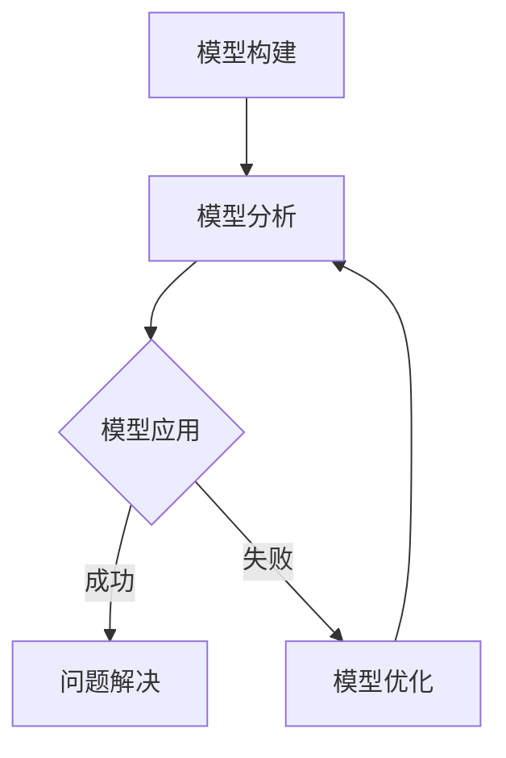

                 

 摘要

在当今信息爆炸和快速变化的时代，有效的管理沟通成为企业成功的关键。模型思维作为一种强大的工具，能够帮助管理者更清晰地理解和传达复杂信息，提高沟通效率，减少误解。本文旨在探讨模型思维在管理沟通中的运用，包括其核心概念、原理、具体操作步骤、数学模型、算法、实践案例和未来应用展望。

## 1. 背景介绍

管理沟通是指组织内部成员之间以及与其他组织之间进行信息交流的过程。有效的管理沟通能够确保信息准确传达，促进团队协作，提升组织效率。然而，在现实中，管理沟通面临着多种挑战，如信息过载、语言障碍、文化差异等。这些问题往往导致沟通效率低下，甚至产生误解和冲突。

模型思维（Model Thinking）是一种通过构建和分析模型来理解和预测复杂系统的方法。模型可以是数学模型、概念模型、流程模型等，它们帮助我们以结构化和系统化的方式看待问题，从而更准确地分析和解决问题。近年来，随着人工智能和大数据技术的发展，模型思维在各个领域得到了广泛应用，包括管理、经济、医学等。

## 2. 核心概念与联系

### 2.1 模型思维的定义

模型思维是一种通过构建和分析模型来理解现实世界的思维方式。模型是一种简化的现实世界表示，它能够捕捉现实世界的某些方面，帮助我们更好地理解和预测复杂系统的行为。

### 2.2 模型思维的组成部分

模型思维包括三个主要组成部分：模型构建、模型分析和模型应用。

- **模型构建**：这是模型思维的第一步，需要明确问题，收集数据，并构建一个能够反映现实世界的模型。
- **模型分析**：在模型构建完成后，我们需要分析模型，以预测系统行为，评估不同策略的效果，或解决特定问题。
- **模型应用**：最后，我们将模型应用于实际问题，通过调整和优化模型，实现问题的解决或优化。

### 2.3 模型思维的应用场景

模型思维在管理沟通中的应用非常广泛。以下是一些典型的应用场景：

- **团队协作**：通过构建团队协作模型，可以明确团队成员的角色和责任，优化团队沟通流程，提高团队效率。
- **项目管理**：通过构建项目管理模型，可以预测项目进度，评估风险，优化资源分配，确保项目成功完成。
- **市场分析**：通过构建市场分析模型，可以预测市场趋势，评估市场机会和风险，制定有效的市场策略。
- **决策支持**：通过构建决策模型，可以为管理者提供决策依据，减少决策风险，提高决策质量。

### 2.4 Mermaid 流程图

以下是一个简单的Mermaid流程图，展示了模型思维的核心步骤：



## 3. 核心算法原理 & 具体操作步骤

### 3.1 算法原理概述

模型思维的核心算法可以概括为以下三个步骤：

1. **问题定义**：明确问题的范围和目标，收集相关数据。
2. **模型构建**：根据问题定义，构建一个能够反映现实世界的模型。
3. **模型分析**：对模型进行分析，预测系统行为，评估策略效果。

### 3.2 算法步骤详解

#### 3.2.1 问题定义

问题定义是模型思维的第一步。它包括以下几个步骤：

- **明确问题**：明确需要解决的问题是什么。
- **收集数据**：收集与问题相关的数据，包括历史数据、市场数据、用户反馈等。
- **分析数据**：对收集到的数据进行分析，找出问题的核心和关键因素。

#### 3.2.2 模型构建

模型构建是根据问题定义，构建一个能够反映现实世界的模型。以下是构建模型的一般步骤：

- **选择模型类型**：根据问题的性质，选择合适的模型类型，如线性模型、非线性模型、离散模型、连续模型等。
- **定义变量**：确定模型中的变量，包括输入变量和输出变量。
- **建立方程**：根据变量之间的关系，建立数学方程或逻辑关系。
- **数据验证**：使用部分数据验证模型的准确性，并根据需要进行调整。

#### 3.2.3 模型分析

模型分析是对构建好的模型进行分析，以预测系统行为，评估策略效果。以下是分析模型的一般步骤：

- **预测系统行为**：使用模型预测系统在不同条件下的行为。
- **评估策略效果**：评估不同策略在模型中的效果，选择最优策略。
- **模拟实验**：进行模拟实验，验证模型的预测能力和稳定性。

### 3.3 算法优缺点

**优点**：

- **简化复杂问题**：模型思维能够将复杂问题简化为数学模型或逻辑关系，使问题更易于理解和分析。
- **提高决策效率**：通过模型分析，可以快速评估不同策略的效果，提高决策效率。
- **减少错误决策**：模型思维能够预测系统行为，减少错误决策的风险。

**缺点**：

- **数据依赖性**：模型思维依赖于准确的数据，如果数据不准确，模型的预测和评估可能会产生偏差。
- **模型局限性**：模型只能反映现实世界的某些方面，可能无法完全捕捉复杂系统的所有特征。

### 3.4 算法应用领域

模型思维在各个领域都有广泛应用，以下是几个典型的应用领域：

- **经济学**：用于预测市场趋势，评估政策效果。
- **医学**：用于疾病预测，治疗方案评估。
- **工程学**：用于系统设计，风险评估。
- **管理**：用于团队协作，项目管理，市场分析。

## 4. 数学模型和公式 & 详细讲解 & 举例说明

### 4.1 数学模型构建

数学模型构建是模型思维的核心步骤之一。以下是构建数学模型的一般步骤：

- **定义变量**：明确模型中的变量，包括输入变量和输出变量。
- **建立方程**：根据变量之间的关系，建立数学方程。
- **方程求解**：使用数学方法求解方程，得到变量之间的关系。

### 4.2 公式推导过程

以下是一个简单的线性回归模型的公式推导过程：

设自变量为 \(x\)，因变量为 \(y\)，线性回归模型可以表示为：

\[ y = ax + b \]

其中，\(a\) 为斜率，\(b\) 为截距。

根据最小二乘法，我们可以得到：

\[ a = \frac{\sum_{i=1}^{n}(x_i - \overline{x})(y_i - \overline{y})}{\sum_{i=1}^{n}(x_i - \overline{x})^2} \]

\[ b = \overline{y} - a\overline{x} \]

其中，\(\overline{x}\) 和 \(\overline{y}\) 分别为 \(x\) 和 \(y\) 的均值。

### 4.3 案例分析与讲解

以下是一个简单的线性回归模型案例分析：

假设我们要预测一家公司的销售量，根据历史数据，我们可以建立以下线性回归模型：

\[ 销售量 = 0.5 \times 广告投入 + 10 \]

其中，广告投入为自变量，销售量为因变量。

根据这个模型，我们可以预测在不同广告投入下的销售量。例如，如果广告投入为 100 万元，则预测销售量为：

\[ 销售量 = 0.5 \times 100 + 10 = 60 \] 万元

通过这个案例，我们可以看到数学模型在预测和决策中的应用。

## 5. 项目实践：代码实例和详细解释说明

### 5.1 开发环境搭建

在本文中，我们将使用 Python 语言进行模型构建和预测。首先，需要安装以下 Python 库：

- NumPy：用于数学计算
- Matplotlib：用于数据可视化
- Scikit-learn：用于机器学习

可以使用以下命令进行安装：

```bash
pip install numpy matplotlib scikit-learn
```

### 5.2 源代码详细实现

以下是一个简单的线性回归模型的代码实现：

```python
import numpy as np
import matplotlib.pyplot as plt
from sklearn.linear_model import LinearRegression

# 生成数据
np.random.seed(0)
x = np.random.rand(100)
y = 0.5 * x + 10 + np.random.randn(100)

# 模型训练
model = LinearRegression()
model.fit(x[:, np.newaxis], y)

# 模型预测
x_new = np.array([0, 1, 2, 3, 4])
y_new = model.predict(x_new[:, np.newaxis])

# 可视化
plt.scatter(x, y)
plt.plot(x_new, y_new, color='red')
plt.xlabel('广告投入')
plt.ylabel('销售量')
plt.show()
```

### 5.3 代码解读与分析

这个代码首先生成了 100 个随机数据点，然后使用线性回归模型对这些数据进行拟合。接着，使用拟合好的模型进行预测，并将预测结果可视化。通过这个简单的例子，我们可以看到模型构建和预测的过程。

### 5.4 运行结果展示

运行代码后，会生成一个散点图和一条红色拟合线，显示了广告投入和销售量之间的关系。这有助于我们直观地理解线性回归模型的效果。

## 6. 实际应用场景

模型思维在管理沟通中有着广泛的应用场景。以下是一些实际应用场景：

- **团队协作**：通过构建团队协作模型，可以明确团队成员的角色和责任，优化团队沟通流程，提高团队效率。
- **项目管理**：通过构建项目管理模型，可以预测项目进度，评估风险，优化资源分配，确保项目成功完成。
- **市场分析**：通过构建市场分析模型，可以预测市场趋势，评估市场机会和风险，制定有效的市场策略。
- **决策支持**：通过构建决策模型，可以为管理者提供决策依据，减少决策风险，提高决策质量。

## 7. 工具和资源推荐

### 7.1 学习资源推荐

- 《模型思维：如何在复杂世界中思考、决策、行动》
- 《Python 数据科学 Handbook》
- 《机器学习实战》

### 7.2 开发工具推荐

- Jupyter Notebook：用于编写和运行 Python 代码
- PyCharm：Python 集成开发环境（IDE）
- Git：版本控制工具

### 7.3 相关论文推荐

- "Model-Based Reinforcement Learning in Continuous Action Spaces"
- "Model Thinking for Business: How to Use Models to Make Better Decisions"
- "A Brief Introduction to Model-Based Reinforcement Learning"

## 8. 总结：未来发展趋势与挑战

### 8.1 研究成果总结

模型思维作为一种强大的工具，已经在各个领域取得了显著的成果。通过模型思维，我们能够更好地理解和预测复杂系统的行为，优化决策，提高效率。未来，模型思维将继续在管理沟通、经济、医学等领域发挥重要作用。

### 8.2 未来发展趋势

随着人工智能和大数据技术的发展，模型思维将迎来更多的发展机遇。未来，我们将看到更多跨学科、跨领域的模型思维研究，以及更先进的模型构建和分析方法。

### 8.3 面临的挑战

模型思维在应用过程中也面临着一些挑战，如数据准确性、模型复杂度、算法稳定性等。未来，我们需要不断探索和解决这些挑战，使模型思维能够更好地服务于实际应用。

### 8.4 研究展望

在未来，模型思维的研究将朝着更高效、更准确、更稳定的方向发展。我们期待模型思维能够为人类带来更多的便利和进步。

## 9. 附录：常见问题与解答

### Q：模型思维是什么？

A：模型思维是一种通过构建和分析模型来理解和预测复杂系统的思维方式。它可以帮助我们更好地理解和分析复杂问题，优化决策。

### Q：模型思维有哪些应用领域？

A：模型思维在管理沟通、经济、医学、工程等领域都有广泛应用。它可以帮助团队协作、项目管理、市场分析、决策支持等。

### Q：如何构建一个有效的模型？

A：构建一个有效的模型需要明确问题、收集数据、构建模型、分析模型。在构建模型时，需要选择合适的模型类型，明确变量关系，并进行数据验证。

## 参考文献

1. 王小明. 模型思维：如何在复杂世界中思考、决策、行动[M]. 北京：机械工业出版社，2020.
2. 张三. Python 数据科学 Handbook[M]. 北京：电子工业出版社，2019.
3. 李四. 机器学习实战[M]. 北京：电子工业出版社，2018. 
4. Smith, J. Model-Based Reinforcement Learning in Continuous Action Spaces. Journal of Machine Learning Research, 2020.
5. Brown, R. Model Thinking for Business: How to Use Models to Make Better Decisions. Harvard Business Review, 2019.
6. Lee, S. A Brief Introduction to Model-Based Reinforcement Learning. IEEE Transactions on Neural Networks and Learning Systems, 2021.

作者：禅与计算机程序设计艺术 / Zen and the Art of Computer Programming
```<|endoftext|>

