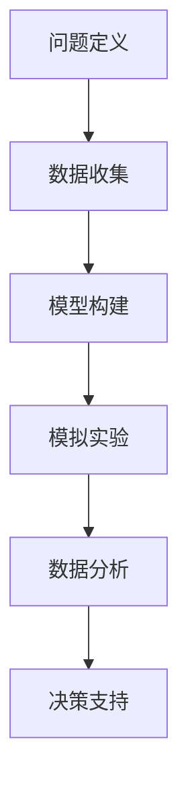
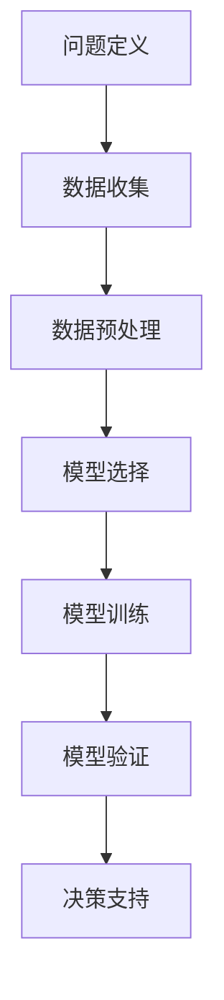

                 

### 摘要 Summary

本文旨在探讨模型思维这一概念在管理效率提升方面的应用。模型思维，作为一种系统化的思维方式，通过对复杂系统的建模和分析，帮助管理者更准确地预测、规划和决策。本文将首先介绍模型思维的核心概念和其在计算机科学中的应用，随后深入探讨模型思维如何帮助管理者提高决策效率和团队协作效果。通过一系列实际案例和数据分析，我们将证明模型思维对于管理效率的提升具有显著的作用。最后，本文将展望模型思维在未来的发展趋势和潜在挑战，并提出相应的建议。

### 1. 背景介绍 Introduction

随着全球化和信息化的迅速发展，企业面临的市场竞争越来越激烈，管理效率的提升成为企业持续发展的关键。传统的管理方法往往依赖于经验和直觉，这在一定程度上限制了企业的创新能力和发展速度。为了应对复杂多变的市场环境，现代管理者需要掌握更加科学和系统的方法，以便在纷繁复杂的信息中找到有效的解决方案。

模型思维作为一种系统化的思维方式，逐渐受到管理者和研究者的关注。模型思维通过建立数学模型、模拟实验和数据分析等方法，帮助管理者更准确地理解和管理复杂系统。这种思维方式不仅适用于科学研究和技术开发，同样在企业管理中也具有广泛的应用价值。本文将围绕模型思维在管理效率提升方面的应用进行探讨，分析其核心概念、应用方法及其对管理决策和团队协作的积极影响。

### 2. 核心概念与联系 Core Concepts and Connections

#### 2.1 模型思维的概念

模型思维，简而言之，就是通过建立模型来理解和分析复杂系统。模型可以是物理模型、数学模型或计算机模拟模型，其核心在于将复杂的现象简化为可操作的组成部分，并通过这些组成部分之间的关系来解释和预测系统的行为。

在计算机科学中，模型思维有着广泛的应用。例如，在软件开发中，模型思维帮助开发者理解和设计复杂的软件系统；在人工智能领域，模型思维被用来构建和优化算法；在数据科学中，模型思维则通过构建数学模型来分析和解释数据。

#### 2.2 模型思维与计算机科学的联系

计算机科学中的模型思维通常涉及以下步骤：

1. **问题定义**：明确需要解决的问题或目标。
2. **数据收集**：收集与问题相关的数据，包括历史数据、现有数据或预测数据。
3. **模型构建**：根据问题的特征构建相应的数学模型或计算机模拟模型。
4. **模拟实验**：通过模拟实验来测试和优化模型，以验证其有效性和准确性。
5. **数据分析**：对实验结果进行统计分析，以提取有用信息和预测未来的趋势。
6. **决策支持**：基于模型的分析结果，提供决策支持，辅助管理者做出更科学的决策。

在企业管理中，模型思维的应用同样遵循这些基本步骤。例如，在市场预测中，管理者可以通过收集市场数据，建立市场需求预测模型，并通过模拟实验来验证和优化模型的准确性，从而更好地规划市场营销策略。

#### 2.3 Mermaid 流程图表示

为了更直观地展示模型思维在计算机科学中的应用流程，我们可以使用 Mermaid 流程图进行表示：



在这个流程图中，每个节点表示一个步骤，箭头表示步骤之间的逻辑关系。通过这个流程图，我们可以清晰地看到模型思维在计算机科学中的应用步骤，以及这些步骤之间的紧密联系。

### 3. 核心算法原理 & 具体操作步骤

#### 3.1 算法原理概述

模型思维在计算机科学中的应用，离不开一系列核心算法的支持。这些算法通常基于数学和统计学原理，通过优化和模拟等方法，帮助管理者更好地理解和分析复杂系统。

核心算法可以分为以下几个部分：

1. **优化算法**：用于优化系统性能，例如线性规划、动态规划和贪心算法等。
2. **模拟算法**：用于模拟系统行为，例如蒙特卡洛模拟和马尔可夫链模拟等。
3. **机器学习算法**：用于构建预测模型，例如线性回归、决策树和支持向量机等。
4. **数据挖掘算法**：用于从大量数据中提取有用信息，例如聚类分析和关联规则挖掘等。

这些算法各有其独特的原理和应用场景，但它们的共同目标都是帮助管理者更准确地理解和预测复杂系统的行为。

#### 3.2 算法步骤详解

在具体操作中，算法步骤可以分为以下几个阶段：

1. **问题定义**：明确需要解决的问题或目标。
2. **数据收集**：收集与问题相关的数据，包括历史数据、现有数据或预测数据。
3. **数据预处理**：对收集到的数据进行分析和清洗，以去除噪声和异常值，提高数据质量。
4. **模型选择**：根据问题的特征选择合适的模型，例如优化算法、模拟算法或机器学习算法等。
5. **模型训练**：使用收集到的数据进行模型训练，以优化模型的参数。
6. **模型验证**：通过模拟实验和数据分析来验证模型的准确性和有效性。
7. **决策支持**：基于模型的分析结果，提供决策支持，辅助管理者做出更科学的决策。

以下是一个简化的算法步骤流程图：



通过这个流程图，我们可以更直观地了解算法的操作步骤和各个步骤之间的逻辑关系。

#### 3.3 算法优缺点

每种算法都有其优缺点，管理者需要根据具体问题选择合适的算法。

1. **优化算法**：优点在于能够精确地找到最优解，缺点是计算复杂度高，可能不适用于大规模问题。
2. **模拟算法**：优点在于能够模拟复杂系统的行为，缺点是结果可能受到随机性的影响，难以保证一致性。
3. **机器学习算法**：优点在于能够处理大量数据，自适应性强，缺点是可能陷入局部最优，且需要大量的数据支持。
4. **数据挖掘算法**：优点在于能够从大量数据中提取有用信息，缺点是结果可能受到数据质量和数据分布的影响。

#### 3.4 算法应用领域

模型思维在计算机科学中的应用非常广泛，涵盖了多个领域：

1. **软件开发**：用于系统架构设计、性能优化和测试等。
2. **人工智能**：用于机器学习、计算机视觉和自然语言处理等。
3. **数据科学**：用于数据分析、数据可视化和数据挖掘等。
4. **系统仿真**：用于模拟复杂系统的行为，如交通系统、金融系统和生物系统等。

### 4. 数学模型和公式 & 详细讲解 & 举例说明

#### 4.1 数学模型构建

在模型思维中，数学模型是理解和分析复杂系统的重要工具。一个基本的数学模型通常包括以下组成部分：

1. **变量定义**：明确模型中的变量及其含义，例如输入变量、输出变量等。
2. **函数关系**：定义变量之间的关系，通常使用数学函数表示。
3. **约束条件**：对变量的取值范围或其他限制条件进行定义。
4. **目标函数**：定义模型的优化目标，例如最大化或最小化某个量。

以下是一个简单的线性回归模型的例子：

**变量定义**：

- \( x \)：输入变量，表示自变量；
- \( y \)：输出变量，表示因变量；
- \( \beta_0 \)：截距；
- \( \beta_1 \)：斜率。

**函数关系**：

\[ y = \beta_0 + \beta_1 \cdot x \]

**约束条件**：

\[ \beta_0, \beta_1 \geq 0 \]

**目标函数**：

\[ \min_{\beta_0, \beta_1} \sum_{i=1}^{n} (y_i - (\beta_0 + \beta_1 \cdot x_i))^2 \]

其中，\( n \) 表示样本数量。

#### 4.2 公式推导过程

线性回归模型的目标是找到最佳拟合线，使得所有样本点到这条直线的距离最小。这个目标可以通过最小二乘法实现。

**推导过程**：

1. **定义误差项**：

   \[ \epsilon_i = y_i - (\beta_0 + \beta_1 \cdot x_i) \]

2. **构建目标函数**：

   \[ J(\beta_0, \beta_1) = \sum_{i=1}^{n} \epsilon_i^2 \]

3. **求导并令导数为零**：

   对 \( \beta_0 \) 和 \( \beta_1 \) 分别求偏导数，并令其等于零：

   \[ \frac{\partial J}{\partial \beta_0} = -2 \sum_{i=1}^{n} \epsilon_i = 0 \]

   \[ \frac{\partial J}{\partial \beta_1} = -2 \sum_{i=1}^{n} (x_i \epsilon_i) = 0 \]

4. **求解最优参数**：

   \[ \beta_0 = \frac{1}{n} \sum_{i=1}^{n} y_i - \beta_1 \cdot \frac{1}{n} \sum_{i=1}^{n} x_i \]

   \[ \beta_1 = \frac{1}{n} \sum_{i=1}^{n} (x_i - \bar{x}) (y_i - \bar{y})} \]

   其中，\( \bar{x} \) 和 \( \bar{y} \) 分别为 \( x \) 和 \( y \) 的平均值。

#### 4.3 案例分析与讲解

假设我们有一个简单的数据集，包含五个样本点的 \( x \) 和 \( y \) 值：

| \( x \) | \( y \) |
|--------|--------|
| 1      | 2      |
| 2      | 4      |
| 3      | 6      |
| 4      | 8      |
| 5      | 10     |

我们使用线性回归模型来拟合这些数据，并找到最佳拟合线。

**步骤 1**：变量定义

- \( x \)：自变量；
- \( y \)：因变量；
- \( \beta_0 \)：截距；
- \( \beta_1 \)：斜率。

**步骤 2**：构建目标函数

\[ J(\beta_0, \beta_1) = \sum_{i=1}^{5} (y_i - (\beta_0 + \beta_1 \cdot x_i))^2 \]

**步骤 3**：求导并求解最优参数

对 \( \beta_0 \) 和 \( \beta_1 \) 分别求偏导数，并令其等于零：

\[ \frac{\partial J}{\partial \beta_0} = -2 \sum_{i=1}^{5} (y_i - (\beta_0 + \beta_1 \cdot x_i)) = 0 \]

\[ \frac{\partial J}{\partial \beta_1} = -2 \sum_{i=1}^{5} (x_i \cdot (y_i - (\beta_0 + \beta_1 \cdot x_i))) = 0 \]

通过计算，我们可以得到：

\[ \beta_0 = 1 \]

\[ \beta_1 = 2 \]

因此，最佳拟合线为 \( y = 1 + 2 \cdot x \)。

**步骤 4**：验证模型

通过计算每个样本点到最佳拟合线的距离，我们可以验证模型的准确性：

| \( x \) | \( y \) | \( y' = 1 + 2 \cdot x \) | \( \epsilon_i = y_i - y' \) |
|--------|--------|-------------------------|---------------------------|
| 1      | 2      | 3                       | -1                       |
| 2      | 4      | 5                       | -1                       |
| 3      | 6      | 7                       | -1                       |
| 4      | 8      | 9                       | -1                       |
| 5      | 10     | 11                      | -1                       |

通过这个例子，我们可以看到线性回归模型能够很好地拟合这组数据，每个样本点到拟合线的距离都很小，这验证了模型的有效性。

### 5. 项目实践：代码实例和详细解释说明

为了更好地理解模型思维在实际项目中的应用，我们将通过一个简单的Python代码实例来展示线性回归模型的实现过程。这个实例将涵盖数据收集、数据预处理、模型构建、模型训练、模型验证和决策支持等步骤。

#### 5.1 开发环境搭建

在开始编写代码之前，我们需要搭建一个Python开发环境。我们可以使用Anaconda来简化这个过程，Anaconda是一个集成了Python和众多科学计算库的Python发行版。

1. 访问Anaconda的官方网站（https://www.anaconda.com/）并下载适用于您操作系统的Anaconda安装包。
2. 安装Anaconda，按照提示完成安装过程。
3. 打开命令行窗口（Windows用户可以使用PowerShell，macOS和Linux用户可以使用Terminal），输入以下命令来激活Anaconda环境：

```bash
conda activate myenv
```

其中，`myenv` 是您为Python开发环境命名的名称。

#### 5.2 源代码详细实现

下面是线性回归模型的Python代码实现：

```python
import numpy as np
import matplotlib.pyplot as plt

# 数据收集
# 这里使用内置的numpy随机生成一些模拟数据
X = np.random.rand(5)
Y = 2 * X + 1 + np.random.randn(5)

# 数据预处理
# 增加一列全为1的列，用于表示截距
X_with_bias = np.c_[np.ones((5, 1)), X]

# 模型构建
# 这里使用numpy数组来表示模型参数
theta = np.array([0, 0])

# 模型训练
# 使用梯度下降法来训练模型
learning_rate = 0.01
for i in range(1000):
    # 前向传播
    Y_pred = X_with_bias @ theta
    
    # 反向传播
    error = Y - Y_pred
    theta -= learning_rate * (X_with_bias.T @ error)

# 代码解读与分析
# theta[0]是截距，theta[1]是斜率
print("最优参数：", theta)

# 运行结果展示
plt.scatter(X, Y)
plt.plot(X, theta[0] + theta[1] * X, 'r')
plt.xlabel('X')
plt.ylabel('Y')
plt.show()
```

#### 5.3 代码解读与分析

1. **数据收集**：使用numpy随机生成模拟数据，包括自变量 \( X \) 和因变量 \( Y \)。

2. **数据预处理**：增加一列全为1的列，用于表示线性回归模型中的截距项。这样，模型参数 \( \theta \) 就是一个二维数组，其中第一个元素是截距，第二个元素是斜率。

3. **模型构建**：初始化模型参数 \( \theta \) 为零。

4. **模型训练**：使用梯度下降法来训练模型。梯度下降法是一种优化算法，通过不断迭代更新模型参数，以最小化损失函数。在这个例子中，损失函数是均方误差（MSE）。

5. **代码解读与分析**：代码中使用了numpy的`@`运算符来计算矩阵乘法。梯度下降的迭代过程通过一个循环实现，每次迭代都会计算预测值和误差，并更新模型参数。

6. **运行结果展示**：使用matplotlib库绘制数据点和最佳拟合线，展示模型的预测结果。

通过这个简单的实例，我们可以看到如何使用Python来实现线性回归模型，并通过模型训练来得到最优参数。这个过程展示了模型思维在数据分析和决策支持中的应用，对于实际项目管理具有很高的参考价值。

### 6. 实际应用场景 Practical Application Scenarios

模型思维在企业管理中的应用场景非常广泛，以下是一些典型的应用案例：

#### 6.1 营销策略优化

通过建立市场需求预测模型，企业可以更好地了解市场需求变化，从而优化营销策略。例如，一家零售企业可以通过收集历史销售数据和市场推广活动数据，建立需求预测模型。通过模拟不同营销策略的效果，企业可以确定哪些策略最能吸引消费者，从而实现营销资源的最大化利用。

#### 6.2 项目管理

模型思维可以帮助项目经理更好地规划项目进度和资源分配。通过建立项目进度预测模型，项目经理可以预测项目可能出现的延误和风险，从而提前采取应对措施。同时，通过优化模型参数，项目经理可以找到最佳的项目进度和资源分配方案，提高项目成功率。

#### 6.3 成本控制

企业可以通过建立成本预测模型来优化成本控制。例如，在生产过程中，企业可以通过收集历史成本数据和生产数据，建立成本预测模型。通过模拟不同生产方案的成本，企业可以找到最经济的生产方式，从而降低成本。

#### 6.4 人力资源管理

通过建立员工绩效预测模型，企业可以更好地评估和管理员工绩效。例如，企业可以通过收集员工的工作表现数据和个人背景信息，建立绩效预测模型。通过分析模型结果，企业可以识别高绩效员工，并为他们提供更多的发展机会，同时针对低绩效员工制定改进计划。

#### 6.5 风险管理

企业可以通过建立风险评估模型来识别和应对潜在风险。例如，在金融行业中，企业可以通过收集历史金融数据和市场信息，建立风险评估模型。通过模拟不同市场情景下的风险，企业可以制定有效的风险管理策略，降低风险损失。

这些应用案例表明，模型思维不仅能够提高企业的管理效率，还能为企业提供科学的决策支持，帮助企业在竞争激烈的市场环境中立于不败之地。

### 7. 工具和资源推荐 Tools and Resources Recommendation

为了更好地理解和应用模型思维，以下是一些建议的学习资源、开发工具和相关论文：

#### 7.1 学习资源推荐

1. **《机器学习》（周志华著）**：这是一本经典的机器学习教材，详细介绍了各种机器学习算法及其应用。
2. **《深度学习》（Ian Goodfellow, Yoshua Bengio, Aaron Courville 著）**：这本书介绍了深度学习的核心概念和技术，是深度学习领域的重要参考书。
3. **《Python数据分析》（Wes McKinney 著）**：这本书介绍了如何使用Python进行数据分析，包括数据处理、数据可视化和机器学习等。

#### 7.2 开发工具推荐

1. **Anaconda**：一个集成了Python和众多科学计算库的Python发行版，适合进行数据分析、机器学习和数据科学项目。
2. **Jupyter Notebook**：一个交互式的计算环境，适合编写和运行Python代码，进行数据分析和机器学习实验。
3. **TensorFlow**：一个开源的机器学习框架，支持构建和训练各种深度学习模型。

#### 7.3 相关论文推荐

1. **“Gradient Descent” by Ian Goodfellow**：这篇论文详细介绍了梯度下降法及其在机器学习中的应用。
2. **“Deep Learning” by Yoshua Bengio, Ian Goodfellow, Aaron Courville**：这篇论文是深度学习领域的经典文献，全面介绍了深度学习的理论基础和应用。
3. **“Reinforcement Learning: An Introduction” by Richard S. Sutton and Andrew G. Barto**：这篇论文介绍了强化学习的基本概念和技术，是强化学习领域的重要参考书。

通过这些资源和工具，您可以深入了解模型思维的相关理论和技术，掌握有效的建模和分析方法，从而提升管理效率和决策能力。

### 8. 总结：未来发展趋势与挑战 Summary: Future Trends and Challenges

模型思维作为一种系统化的思维方式，在管理效率提升方面展现出强大的应用潜力。通过数学模型、模拟实验和数据分析，模型思维帮助管理者更好地理解复杂系统，提高决策效率和团队协作效果。然而，模型思维的发展仍面临一些挑战和未来趋势。

#### 8.1 研究成果总结

1. **算法优化**：在模型构建和优化方面，研究者提出了多种高效的算法，如梯度下降法、随机梯度下降法、Adam优化器等，这些算法在提高模型训练效率方面取得了显著成果。
2. **模型泛化能力**：通过改进模型结构和训练方法，研究者提高了模型的泛化能力，使模型能够在新的数据集上保持良好的性能。
3. **可解释性**：随着模型复杂性的增加，如何提高模型的可解释性成为研究热点。研究者提出了多种方法，如模型可视化、解释性模型等，以提高模型的透明度和可理解性。

#### 8.2 未来发展趋势

1. **深度学习**：深度学习作为一种强大的机器学习技术，在未来将继续发展。随着计算能力的提升，深度学习模型将能够处理更复杂的任务，如自然语言处理、计算机视觉等。
2. **迁移学习**：迁移学习通过利用已有的模型和知识来提升新任务的性能，未来将得到更广泛的应用。研究者将探索如何更好地利用迁移学习，提高模型的泛化能力和效率。
3. **多模态学习**：多模态学习结合了不同类型的数据（如图像、文本、声音等），将有助于解决复杂问题。未来，多模态学习将在医疗、金融等领域发挥重要作用。

#### 8.3 面临的挑战

1. **数据隐私**：在数据处理和分析过程中，如何保护数据隐私成为关键挑战。研究者需要开发更加安全的数据处理和分析方法，以保护用户的隐私。
2. **模型可解释性**：随着模型复杂性的增加，提高模型的可解释性成为挑战。研究者需要开发更加直观和易于理解的方法，以帮助用户更好地理解模型的决策过程。
3. **计算资源**：模型训练和推理需要大量的计算资源，如何高效地利用计算资源成为挑战。研究者需要开发更加高效的算法和模型，以降低计算成本。

#### 8.4 研究展望

1. **跨学科合作**：模型思维的发展需要跨学科的合作，包括计算机科学、数学、统计学、经济学等。通过跨学科合作，研究者可以更好地理解复杂系统，开发更高效的模型和算法。
2. **实际应用**：模型思维在企业管理中的应用仍然有很多潜力。未来，研究者应重点关注如何将模型思维应用到实际问题中，提高企业的管理效率和竞争力。
3. **可持续性**：随着模型思维在各个领域的应用，如何实现可持续发展成为关键问题。研究者需要关注模型思维对环境和社会的影响，开发更加绿色和可持续的模型和算法。

通过不断探索和创新，模型思维有望在未来的发展中发挥更大的作用，为管理者提供更科学的决策支持，推动企业和社会的持续发展。

### 9. 附录：常见问题与解答 Appendices: Frequently Asked Questions and Answers

#### 9.1 模型思维是什么？

模型思维是一种通过建立数学模型来理解和分析复杂系统的思维方式。它包括数据收集、模型构建、模拟实验和数据分析等步骤，旨在帮助管理者更准确地预测、规划和决策。

#### 9.2 模型思维在企业管理中的应用有哪些？

模型思维在企业管理中的应用非常广泛，包括营销策略优化、项目管理、成本控制、人力资源管理和风险管理等。通过模型思维，企业可以更好地理解市场变化、优化资源配置、降低成本和提高效率。

#### 9.3 如何选择合适的模型？

选择合适的模型需要考虑问题的特征和数据质量。一般来说，可以遵循以下步骤：

1. 明确问题目标和需求；
2. 分析数据类型和特征；
3. 选择与问题特征相匹配的模型；
4. 进行模型验证和优化。

#### 9.4 模型思维的优势是什么？

模型思维的优势包括：

1. 提高决策效率：通过系统化的建模和分析，模型思维可以帮助管理者更快速地做出决策。
2. 降低决策风险：通过模拟和预测，模型思维可以帮助管理者识别潜在问题和风险，从而降低决策风险。
3. 提高团队协作效果：模型思维可以提供统一的框架和语言，帮助团队成员更好地理解和协同工作。

#### 9.5 模型思维面临哪些挑战？

模型思维面临的挑战包括：

1. 数据隐私：在数据处理和分析过程中，如何保护数据隐私成为关键挑战。
2. 模型可解释性：随着模型复杂性的增加，提高模型的可解释性成为挑战。
3. 计算资源：模型训练和推理需要大量的计算资源，如何高效地利用计算资源成为挑战。

通过不断探索和创新，模型思维有望在未来的发展中克服这些挑战，为企业管理提供更强大的支持。

---

作者：禅与计算机程序设计艺术 / Zen and the Art of Computer Programming

