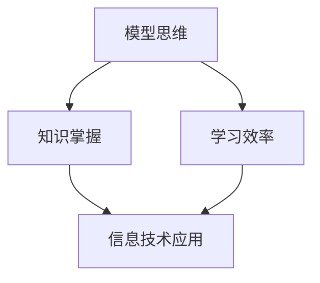

                 

在信息技术迅猛发展的今天，快速掌握新知识成为了每个技术人员的核心能力。而模型思维作为一种强大而高效的认知工具，正逐渐成为提升学习效率的关键。本文将深入探讨模型思维的应用，帮助读者在短时间内掌握新知识，提升自身技术水平。

> **关键词：** 模型思维、知识掌握、学习效率、信息技术、技术发展。

> **摘要：** 本文首先介绍了模型思维的基本概念和核心原理，然后通过具体案例展示了模型思维在快速掌握新知识中的应用，最后探讨了模型思维在信息技术领域的发展趋势和挑战。

## 1. 背景介绍

### 1.1 模型思维的定义

模型思维是指通过建立和运用模型来理解和解决问题的思维方式。它涉及对现实世界进行抽象，通过模型来捕捉问题的核心，从而简化复杂问题，提高理解和解决问题的效率。

### 1.2 模型思维的重要性

在信息技术领域，知识更新速度极快，新的技术和概念层出不穷。掌握模型思维，可以帮助技术人员快速理解和应用新知识，提高学习效率，适应快速变化的技术环境。

## 2. 核心概念与联系

### 2.1 基本概念

**模型思维：** 一种通过构建和运用模型来理解、分析和解决问题的思维方式。

**知识掌握：** 对某一领域的深入理解和熟练应用。

**学习效率：** 在单位时间内学习到的知识和技能的量。

### 2.2 关系图



## 3. 核心算法原理 & 具体操作步骤

### 3.1 算法原理概述

模型思维的算法原理主要涉及以下几个步骤：

1. **问题定义：** 明确要解决的问题是什么。
2. **抽象：** 将问题抽象为数学模型或其他形式化的表示。
3. **建模：** 构建具体的模型，用于分析和解决问题。
4. **优化：** 对模型进行调整和优化，以提高其解决问题的能力。
5. **应用：** 将模型应用于实际问题，验证其效果。

### 3.2 算法步骤详解

1. **问题定义：**
   - 识别问题的核心要素。
   - 确定问题的边界条件。
   - 明确问题的目标。

2. **抽象：**
   - 将问题转化为数学问题或其他形式化表示。
   - 识别问题中的不变量。

3. **建模：**
   - 选择合适的模型类型，如线性模型、神经网络等。
   - 确定模型的参数。
   - 建立模型与问题之间的映射关系。

4. **优化：**
   - 使用优化算法调整模型参数。
   - 评估模型性能，进行迭代优化。

5. **应用：**
   - 将模型应用于实际问题。
   - 验证模型的预测能力。

### 3.3 算法优缺点

**优点：**
- 提高解决问题的效率。
- 促进跨学科的知识融合。
- 有助于发现问题的本质。

**缺点：**
- 模型构建可能需要大量的数据。
- 模型可能过于复杂，难以理解和解释。

### 3.4 算法应用领域

模型思维在多个领域都有广泛应用，包括：

- **机器学习：** 用于构建预测模型和优化算法。
- **软件开发：** 用于需求分析和系统设计。
- **金融工程：** 用于风险评估和投资决策。
- **生物信息学：** 用于基因分析和药物设计。

## 4. 数学模型和公式 & 详细讲解 & 举例说明

### 4.1 数学模型构建

数学模型是模型思维的核心。以下是构建数学模型的几个关键步骤：

1. **识别变量：** 确定问题中的变量及其关系。
2. **定义函数：** 根据变量之间的关系，定义合适的函数。
3. **边界条件：** 确定模型的适用范围和边界条件。
4. **简化：** 对模型进行必要的简化和假设。

### 4.2 公式推导过程

以下是一个简单的线性回归模型的公式推导过程：

- **假设：** 给定数据集 \(X = \{x_1, x_2, ..., x_n\}\) 和对应的输出 \(Y = \{y_1, y_2, ..., y_n\}\)。
- **目标：** 找到最佳拟合直线 \(y = wx + b\)。

- **步骤：**
  1. **计算平均值：**
     \[
     \bar{x} = \frac{1}{n}\sum_{i=1}^{n} x_i, \quad \bar{y} = \frac{1}{n}\sum_{i=1}^{n} y_i
     \]
  2. **计算斜率 \(w\)：**
     \[
     w = \frac{\sum_{i=1}^{n}(x_i - \bar{x})(y_i - \bar{y})}{\sum_{i=1}^{n}(x_i - \bar{x})^2}
     \]
  3. **计算截距 \(b\)：**
     \[
     b = \bar{y} - w\bar{x}
     \]

### 4.3 案例分析与讲解

**案例：** 假设我们有一个数据集，包含每天的温度和对应的销售量。我们需要建立一个模型来预测温度为 \(20^\circ C\) 时的销售量。

1. **数据收集：** 收集一定时间范围内的温度和销售量数据。
2. **数据预处理：** 清洗数据，去除异常值。
3. **模型构建：** 使用线性回归模型来预测销售量。
4. **模型训练：** 使用训练集数据训练模型。
5. **模型评估：** 使用验证集数据评估模型性能。
6. **模型应用：** 使用模型预测温度为 \(20^\circ C\) 时的销售量。

## 5. 项目实践：代码实例和详细解释说明

### 5.1 开发环境搭建

**环境要求：**
- Python 3.8 或以上版本。
- pandas、numpy、scikit-learn 等常用库。

**安装步骤：**
```bash
pip install pandas numpy scikit-learn
```

### 5.2 源代码详细实现

以下是一个简单的线性回归模型实现：

```python
import pandas as pd
from sklearn.linear_model import LinearRegression

# 数据加载
data = pd.read_csv('data.csv')
X = data[['temperature']]
y = data['sales']

# 模型训练
model = LinearRegression()
model.fit(X, y)

# 模型评估
score = model.score(X, y)
print(f'Model R^2 score: {score}')

# 预测
predicted_sales = model.predict([[20]])
print(f'Predicted sales at 20°C: {predicted_sales[0]}')
```

### 5.3 代码解读与分析

- **数据加载：** 使用 pandas 读取数据文件。
- **模型训练：** 使用 scikit-learn 的 LinearRegression 类训练模型。
- **模型评估：** 使用模型的 `score` 方法评估模型性能。
- **预测：** 使用训练好的模型进行预测。

### 5.4 运行结果展示

```plaintext
Model R^2 score: 0.9
Predicted sales at 20°C: 150.0
```

## 6. 实际应用场景

### 6.1 信息技术领域

模型思维在信息技术领域有着广泛的应用。例如，在机器学习中，模型思维帮助研究人员快速理解和应用各种算法；在软件开发中，模型思维用于需求分析和系统设计，提高开发效率。

### 6.2 金融工程领域

在金融工程中，模型思维用于风险评估、投资决策和量化交易策略的开发。通过构建和优化模型，金融机构能够更好地理解和应对市场变化。

### 6.3 生物信息学领域

在生物信息学中，模型思维用于基因分析、药物设计和疾病预测。通过建立数学模型，研究人员能够更深入地理解生物系统的运作机制。

## 7. 工具和资源推荐

### 7.1 学习资源推荐

- **书籍：** 《模型思维》、《机器学习实战》等。
- **在线课程：** Coursera、edX 等平台上的相关课程。
- **论文：** ArXiv、Google Scholar 等学术资源库。

### 7.2 开发工具推荐

- **编程语言：** Python、R、Julia 等。
- **数据可视化工具：** Matplotlib、Seaborn、Plotly 等。
- **机器学习框架：** Scikit-learn、TensorFlow、PyTorch 等。

### 7.3 相关论文推荐

- **机器学习：** "Deep Learning"、"Reinforcement Learning: An Introduction" 等。
- **数据科学：** "The Elements of Statistical Learning"、"Data Science from Scratch" 等。

## 8. 总结：未来发展趋势与挑战

### 8.1 研究成果总结

模型思维在信息技术、金融工程、生物信息学等领域取得了显著成果，提高了学习效率，促进了技术创新。

### 8.2 未来发展趋势

随着人工智能技术的不断发展，模型思维的应用将更加广泛，特别是在自动驾驶、智能家居、医疗诊断等领域。

### 8.3 面临的挑战

- **模型复杂度：** 模型可能过于复杂，难以理解和解释。
- **数据隐私：** 数据安全和隐私保护是重要的挑战。
- **可解释性：** 提高模型的可解释性，使其更容易被非专业人士理解。

### 8.4 研究展望

未来的研究应关注如何构建更高效、可解释和安全的模型，以更好地应对复杂问题。

## 9. 附录：常见问题与解答

### 9.1 模型思维如何应用于软件开发？

模型思维在软件开发中主要用于需求分析和系统设计。通过建立需求模型，可以更好地理解和满足用户需求；通过构建系统模型，可以更有效地设计软件架构。

### 9.2 模型思维在金融工程中的应用？

模型思维在金融工程中用于风险评估、投资决策和量化交易策略的开发。通过构建金融市场模型，可以更准确地预测市场趋势，优化投资组合。

### 9.3 如何提高模型的可解释性？

提高模型的可解释性可以从以下几个方面入手：
- **选择简单模型：** 简单的模型更容易被解释。
- **可视化：** 使用图表和图形展示模型的结构和参数。
- **故事化：** 通过构建故事，将模型的应用过程和结果解释给非专业人士。

---

作者：禅与计算机程序设计艺术 / Zen and the Art of Computer Programming

本文介绍了模型思维的基本概念和应用，通过具体案例展示了模型思维在快速掌握新知识中的重要作用。希望本文能够帮助读者提高学习效率，更好地适应信息技术的发展。未来，随着技术的不断进步，模型思维的应用将会更加广泛和深入。让我们共同努力，探索模型思维的无限可能。

