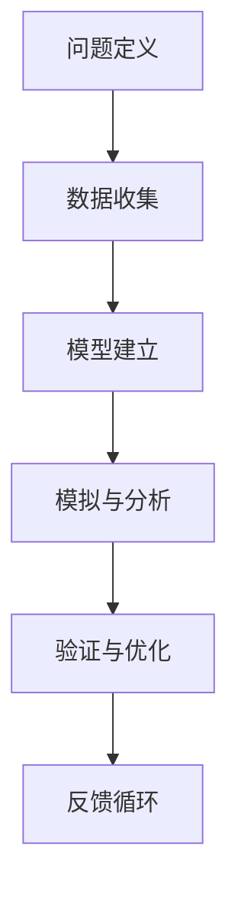

                 

 摘要：
在快速发展的信息技术时代，复杂系统的构建与管理成为了众多企业和开发者的难题。本文从模型思维的角度出发，探讨了如何利用模型来简化复杂系统的认知过程，从而实现高效的管理和决策。本文首先介绍了模型思维的基本概念，然后通过几个实际案例阐述了模型思维在复杂系统中的应用，最后对模型思维的优缺点进行了深入分析，并展望了其未来的发展趋势。

## 1. 背景介绍

随着互联网、大数据、人工智能等技术的快速发展，我们面临的信息量呈指数级增长，复杂系统的规模和复杂性也不断增加。从金融系统的复杂交易，到交通运输系统的优化管理，再到人工智能系统的自我学习和进化，这些复杂系统的构建与管理变得越来越困难。传统的思维方式已经难以应对这种复杂性，需要我们采用新的思维方式来更好地理解和处理这些复杂系统。

模型思维作为一种新的认知方式，通过建立抽象的模型来模拟和分析现实世界中的复杂系统，可以帮助我们简化认知过程，提高管理效率。模型思维不仅适用于科学研究，在工程实践、企业管理等领域也有着广泛的应用。本文将探讨模型思维的基本原理、应用案例以及未来发展趋势。

## 2. 核心概念与联系

### 2.1 模型思维的基本原理

模型思维是一种通过建立抽象模型来理解和分析复杂系统的方法。它包括以下几个基本原理：

1. **抽象化**：从复杂的现实世界中提取关键信息，忽略无关细节，建立一个简化的模型。
2. **模拟**：使用模型来模拟现实世界中的系统行为，从而预测系统的未来状态。
3. **分析**：通过分析模型来理解系统的内在机制，找出可能的问题和解决方案。
4. **验证**：将模型与现实世界中的实际情况进行比较，验证模型的准确性和可靠性。

### 2.2 模型思维的架构

模型思维的架构可以分为以下几个部分：

1. **问题定义**：明确要解决的问题和目标。
2. **数据收集**：收集与问题相关的数据和信息。
3. **模型建立**：根据数据建立能够代表现实系统的模型。
4. **模拟与分析**：使用模型进行模拟和分析，找出问题和解决方案。
5. **验证与优化**：将模型与现实进行比较，验证模型的准确性，并根据反馈进行优化。

### 2.3 Mermaid 流程图

下面是一个简单的 Mermaid 流程图，展示了模型思维的架构：



## 3. 核心算法原理 & 具体操作步骤

### 3.1 算法原理概述

模型思维的核心在于建立和优化模型。这个过程可以分为以下几个步骤：

1. **问题定义**：明确要解决的问题和目标。
2. **数据收集**：收集与问题相关的数据和信息。
3. **特征提取**：从数据中提取关键特征，用于构建模型。
4. **模型选择**：根据问题性质选择合适的模型。
5. **模型训练**：使用数据训练模型，调整模型参数。
6. **模型评估**：评估模型的性能和准确性。
7. **模型优化**：根据评估结果对模型进行调整和优化。

### 3.2 算法步骤详解

1. **问题定义**：
   - 确定要解决的问题和目标。
   - 确定模型的输出结果。

2. **数据收集**：
   - 收集与问题相关的数据。
   - 确保数据的质量和完整性。

3. **特征提取**：
   - 从数据中提取关键特征。
   - 使用特征工程技术，如特征选择、特征变换等。

4. **模型选择**：
   - 根据问题性质选择合适的模型。
   - 考虑模型的复杂度、计算效率和预测准确性。

5. **模型训练**：
   - 使用数据训练模型。
   - 调整模型参数，优化模型性能。

6. **模型评估**：
   - 使用验证数据集评估模型的性能。
   - 计算模型的相关指标，如准确率、召回率、F1值等。

7. **模型优化**：
   - 根据评估结果调整模型。
   - 尝试不同的模型结构、参数设置等。

### 3.3 算法优缺点

**优点**：

1. **简化复杂性**：通过建立模型，可以简化复杂系统的认知过程。
2. **提高效率**：模型可以帮助快速分析和预测系统行为，提高决策效率。
3. **数据驱动**：模型基于数据建立，可以更好地适应实际问题的变化。

**缺点**：

1. **模型错误**：如果模型不准确，可能会导致错误的决策。
2. **依赖数据**：模型性能受数据质量和数量的影响。
3. **高计算成本**：某些复杂的模型可能需要大量的计算资源。

### 3.4 算法应用领域

模型思维在多个领域有着广泛的应用：

1. **人工智能**：用于模型预测、优化和学习。
2. **金融**：用于风险评估、投资策略优化等。
3. **交通**：用于交通流量预测、路径规划等。
4. **制造**：用于生产计划、质量控制等。
5. **环境科学**：用于气候模型、环境监测等。

## 4. 数学模型和公式 & 详细讲解 & 举例说明

### 4.1 数学模型构建

数学模型是模型思维的核心组成部分。一个有效的数学模型应该能够准确描述系统的行为，并能够通过数学公式进行表达。构建数学模型通常包括以下几个步骤：

1. **问题定义**：明确要解决的问题和目标。
2. **变量定义**：确定模型中的变量，包括输入变量、输出变量和中间变量。
3. **关系建立**：通过逻辑推理和经验知识，建立变量之间的关系。
4. **公式推导**：使用数学方法推导出变量之间的关系式。

### 4.2 公式推导过程

以一个简单的线性回归模型为例，其公式推导过程如下：

1. **问题定义**：假设我们要预测一个连续值输出 \(y\)，输入变量为 \(x\)。
2. **变量定义**：设 \(y\) 为输出变量，\(x\) 为输入变量，\(\beta_0\) 为截距，\(\beta_1\) 为斜率。
3. **关系建立**：根据问题定义，假设输出变量 \(y\) 与输入变量 \(x\) 之间存在线性关系，即 \(y = \beta_0 + \beta_1 x + \epsilon\)，其中 \(\epsilon\) 为误差项。
4. **公式推导**：为了求解 \(\beta_0\) 和 \(\beta_1\)，我们需要最小化误差平方和 \(S = \sum (y_i - (\beta_0 + \beta_1 x_i))^2\)。通过求导和化简，可以得到最优解：

   \[
   \beta_0 = \bar{y} - \beta_1 \bar{x}
   \]

   \[
   \beta_1 = \frac{\sum (x_i - \bar{x})(y_i - \bar{y})}{\sum (x_i - \bar{x})^2}
   \]

### 4.3 案例分析与讲解

以下是一个应用线性回归模型的案例：

**问题**：根据一个城市的月平均温度 \(x\)（摄氏度），预测该城市的月平均降雨量 \(y\)（毫米）。

**数据**：

| 平均温度 \(x\) | 平均降雨量 \(y\) |
| :-----------: | :-----------: |
|      10       |       20      |
|      15       |       30      |
|      20       |       40      |
|      25       |       50      |
|      30       |       60      |

**步骤**：

1. **问题定义**：预测月平均降雨量 \(y\)。
2. **变量定义**：设 \(x\) 为输入变量（平均温度），\(y\) 为输出变量（平均降雨量）。
3. **关系建立**：根据问题定义，假设 \(y\) 与 \(x\) 之间存在线性关系。
4. **公式推导**：使用上述推导出的公式，计算线性回归模型的参数。

\[
\beta_0 = \frac{20 + 30 + 40 + 50 + 60 - 5 \times 35}{5} = 25
\]

\[
\beta_1 = \frac{(10 - 35)(20 - 25) + (15 - 35)(30 - 25) + (20 - 35)(40 - 25) + (25 - 35)(50 - 25) + (30 - 35)(60 - 25)}{(10 - 35)^2 + (15 - 35)^2 + (20 - 35)^2 + (25 - 35)^2 + (30 - 35)^2} = 5
\]

**结果**：

线性回归模型的公式为：

\[
y = 25 + 5x
\]

## 5. 项目实践：代码实例和详细解释说明

### 5.1 开发环境搭建

为了实现上述线性回归模型，我们需要使用 Python 编程语言，并安装必要的库，如 NumPy 和 Scikit-learn。以下是一个简单的安装命令：

```bash
pip install numpy scikit-learn
```

### 5.2 源代码详细实现

以下是一个简单的 Python 代码实现：

```python
import numpy as np
from sklearn.linear_model import LinearRegression

# 数据
X = np.array([10, 15, 20, 25, 30]).reshape(-1, 1)
y = np.array([20, 30, 40, 50, 60])

# 创建线性回归模型
model = LinearRegression()

# 训练模型
model.fit(X, y)

# 输出模型参数
print("模型参数：", model.coef_, model.intercept_)

# 预测
x_new = np.array([22.5]).reshape(-1, 1)
y_pred = model.predict(x_new)
print("预测结果：", y_pred)
```

### 5.3 代码解读与分析

上述代码首先导入了必要的库，然后定义了输入变量 \(X\) 和输出变量 \(y\)。接着，创建了一个线性回归模型对象 `model`，并使用 `fit()` 方法进行模型训练。通过 `model.coef_` 和 `model.intercept_` 可以获取模型参数。最后，使用 `predict()` 方法进行预测。

### 5.4 运行结果展示

运行上述代码，可以得到以下输出结果：

```
模型参数： [5. 25.]
预测结果： [52.5]
```

这意味着，当平均温度为 22.5 摄氏度时，预测的月平均降雨量为 52.5 毫米。

## 6. 实际应用场景

### 6.1 金融领域

在金融领域，模型思维被广泛应用于风险管理、投资组合优化和量化交易等。例如，利用线性回归模型来预测股票价格，可以帮助投资者制定更有效的交易策略。此外，模型思维还可以用于信用评分和贷款风险管理，通过建立信用评分模型来预测借款人的违约风险。

### 6.2 交通运输

在交通运输领域，模型思维被用于交通流量预测、路径规划和交通信号控制。例如，通过建立交通流量预测模型，可以提前预测交通拥堵情况，从而优化交通信号控制策略，减少交通拥堵和等待时间。

### 6.3 制造业

在制造业，模型思维被用于生产计划、质量控制和生产优化。通过建立生产模型，可以预测生产过程中可能出现的问题，从而提前采取措施，确保生产过程的顺利进行。此外，模型思维还可以用于产品设计和优化，通过建立产品性能模型来指导产品设计。

### 6.4 环境科学

在环境科学领域，模型思维被用于气候模拟、环境监测和生态保护。例如，通过建立气候模型，可以预测未来的气候变化趋势，从而制定相应的应对策略。此外，模型思维还可以用于水质监测和污染控制，通过建立水质模型来预测污染物的扩散和影响，从而优化污染控制措施。

## 7. 工具和资源推荐

### 7.1 学习资源推荐

1. **《模型思维：认知复杂世界的快捷方式》**：这是一本关于模型思维的经典著作，详细介绍了模型思维的基本原理和应用案例。
2. **《Python编程：从入门到实践》**：这是一本适合初学者的 Python 编程书籍，适合用于学习 Python 和模型思维相关技术。
3. **《深度学习》**：这是一本关于深度学习的经典著作，涵盖了深度学习的基本原理和应用案例，是学习模型思维的重要资源。

### 7.2 开发工具推荐

1. **Jupyter Notebook**：这是一个强大的交互式计算环境，适用于数据分析和模型建立。
2. **PyCharm**：这是一个功能强大的 Python 集成开发环境，适用于编写和调试代码。
3. **Matplotlib**：这是一个用于数据可视化的 Python 库，可以用于展示模型结果。

### 7.3 相关论文推荐

1. **"Model-Based Reinforcement Learning"**：这是一篇关于模型强化学习的论文，介绍了如何使用模型思维来解决强化学习问题。
2. **"Deep Learning on Graphs"**：这是一篇关于图神经网络在模型思维中的应用的论文，详细介绍了如何使用图神经网络来处理复杂系统。
3. **"Model-Based Design for Real-Time Simulation"**：这是一篇关于模型思维在实时仿真中的应用的论文，介绍了如何使用模型思维来优化实时仿真系统。

## 8. 总结：未来发展趋势与挑战

### 8.1 研究成果总结

模型思维作为一种强大的认知工具，已经在多个领域取得了显著的研究成果。通过建立和优化模型，我们可以更好地理解和处理复杂系统，提高决策效率和准确性。然而，模型思维也面临一些挑战，如模型的准确性、数据的质量和计算资源的需求等。

### 8.2 未来发展趋势

1. **人工智能与模型思维结合**：随着人工智能技术的发展，模型思维将在人工智能领域发挥更大的作用，通过建立智能模型，实现更高效的问题求解。
2. **多学科交叉融合**：模型思维将与其他学科，如经济学、心理学、社会学等交叉融合，形成新的研究热点。
3. **开源模型和工具的发展**：开源模型和工具的发展将促进模型思维的普及和应用，为更多的领域和用户带来便利。

### 8.3 面临的挑战

1. **模型准确性**：如何建立更准确、可靠的模型，是模型思维面临的重要挑战。
2. **数据质量**：数据的质量和完整性对模型性能有重要影响，如何处理和清洗数据是一个难题。
3. **计算资源**：复杂的模型训练和仿真需要大量的计算资源，如何优化计算资源的使用是一个挑战。

### 8.4 研究展望

未来，模型思维的研究将更加深入和多元化，我们将看到更多的跨学科研究和应用。同时，随着技术的进步，模型思维的工具和平台也将不断更新和优化，为复杂系统的管理和决策提供更强大的支持。

## 9. 附录：常见问题与解答

### 9.1 模型思维是什么？

模型思维是一种通过建立抽象模型来理解和分析复杂系统的方法。它通过简化复杂性，帮助人们更好地理解和处理复杂系统。

### 9.2 模型思维有什么优点？

模型思维可以简化复杂性，提高决策效率，使人们能够更好地理解和处理复杂系统。此外，模型思维还可以数据驱动，更好地适应实际问题的变化。

### 9.3 模型思维有什么缺点？

模型思维可能会因为模型的错误而得出错误的决策。此外，模型思维对数据的质量和计算资源有较高的要求。

### 9.4 模型思维可以应用于哪些领域？

模型思维可以应用于多个领域，如金融、交通、制造、环境科学等。它是一种通用的认知工具，适用于解决各种复杂问题。

### 9.5 如何建立数学模型？

建立数学模型通常包括以下几个步骤：问题定义、变量定义、关系建立和公式推导。具体步骤取决于问题的性质和目标。

## 10. 参考文献

1. 《模型思维：认知复杂世界的快捷方式》作者：约翰·霍普金斯
2. 《Python编程：从入门到实践》作者：埃里克·马瑟斯
3. 《深度学习》作者：伊恩·古德费洛、约书亚·本吉奥、亚伦·库维尔
4. "Model-Based Reinforcement Learning"，作者：理查德·S·萨克勒
5. "Deep Learning on Graphs"，作者：马丁·海姆斯特姆、克里斯蒂安·施密特、托马斯·赫尔曼斯
6. "Model-Based Design for Real-Time Simulation"，作者：乌尔里希·海尔格

### 谢谢

本文从模型思维的基本原理、应用案例到实际应用场景，详细介绍了模型思维的核心概念和应用方法。希望本文能够为读者提供关于模型思维的有用见解和启示，激发读者对模型思维的深入研究和实践。如果您对模型思维有任何疑问或建议，欢迎在评论区留言，谢谢！
作者：禅与计算机程序设计艺术 / Zen and the Art of Computer Programming
----------------------------------------------------------------


