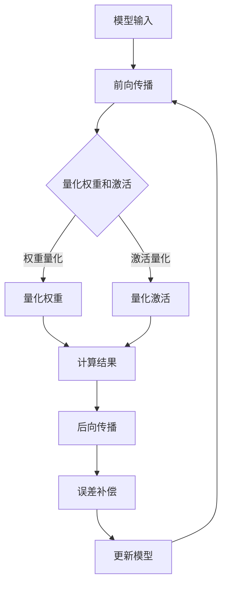

                 

关键词：模型量化，推理效率，压缩算法，神经网络，AI应用，算法优化

> 摘要：随着人工智能技术的快速发展，深度学习模型在各个领域的应用日益广泛。然而，这些模型的推理过程往往需要大量的计算资源和时间。模型量化是一种关键技术，通过降低模型的计算精度来减少模型的大小和计算需求，从而显著提高推理效率。本文将介绍模型量化的基本概念、核心算法原理、数学模型、实际应用场景，并展望其未来发展趋势。

## 1. 背景介绍

深度学习模型的广泛应用带来了对高性能计算资源的巨大需求。随着模型的复杂性和参数数量的增加，模型的推理过程变得越来越耗时，计算资源消耗也日益增长。尤其是在移动设备、嵌入式系统和边缘计算等场景下，有限的计算资源和带宽限制了深度学习模型的应用。为了解决这一问题，研究人员提出了模型量化的概念。

模型量化是一种通过减少模型参数的精度来降低模型大小和计算复杂度的技术。量化过程通常将浮点数权重转换为较低精度的整数表示。这种方法不仅可以减少模型的存储空间，还可以降低模型在推理时的计算量，从而提高推理效率。

量化技术在近年来取得了显著进展，主要原因包括以下几点：

- **计算性能提升**：量化模型在嵌入式设备和移动设备上的运行速度更快，能够满足实时性要求。
- **存储空间减少**：量化后的模型占用更少的存储空间，有利于部署在资源受限的环境中。
- **通信带宽降低**：量化模型传输时占用更少的带宽，有助于在远程边缘设备上进行推理。
- **能量效率提高**：量化模型通常具有较低的功耗，有助于实现绿色、节能的计算。

## 2. 核心概念与联系

### 2.1. 量化概念

模型量化是指将原始模型的浮点数参数转换为较低精度的整数表示。量化过程通常涉及以下几个关键步骤：

- **选择量化范围**：确定每个权重参数的最小值和最大值，以定义量化范围。
- **映射**：将浮点数权重映射到量化范围中的整数。
- **量化误差**：量化过程引入了误差，量化后模型的输出可能与原始模型有所不同。

### 2.2. 量化原理与架构

模型量化的原理可以概括为以下几个关键组成部分：

- **权重量化**：对模型中的权重参数进行量化，通常采用线性量化方法，如最小二乘法、最速下降法等。
- **激活量化**：对模型中的激活值进行量化，以提高整体模型的效率。
- **量化误差补偿**：量化误差会影响模型的性能，因此需要通过误差补偿方法来降低量化误差。

以下是一个简单的 Mermaid 流程图，展示了模型量化的基本原理和架构：



### 2.3. 量化方法

量化方法主要分为两种：线性量化和非线性量化。

- **线性量化**：通过线性映射将浮点数权重映射到整数表示。这种方法简单且易于实现，但可能引入较大的量化误差。
- **非线性量化**：通过非线性函数将浮点数权重映射到整数表示，如直方图量化、神经拟合法等。这种方法能够更好地保持模型的精度，但计算复杂度较高。

## 3. 核心算法原理 & 具体操作步骤

### 3.1. 算法原理概述

模型量化算法的核心目标是减少模型的计算复杂度和存储需求，同时尽量保持模型的精度和性能。量化算法通常包括以下几个步骤：

- **数据预处理**：对模型中的数据进行归一化处理，以减少量化误差。
- **选择量化策略**：根据模型的特性和应用场景，选择合适的量化策略和量化范围。
- **权重量化**：将模型的权重参数从浮点数转换为整数表示。
- **激活量化**：将模型的激活值从浮点数转换为整数表示。
- **量化误差补偿**：通过误差补偿方法减少量化误差，提高模型的精度。

### 3.2. 算法步骤详解

以下是模型量化算法的具体步骤：

#### 步骤1：数据预处理

数据预处理是量化过程中的重要步骤，其目的是减少量化误差。常用的数据预处理方法包括：

- **归一化**：将数据缩放到一个较小的范围内，以减少量化误差。
- **标准差缩放**：将数据缩放到标准差缩放范围内，以提高数据的稳定性。

#### 步骤2：选择量化策略

量化策略的选择取决于模型的特性和应用场景。常用的量化策略包括：

- **线性量化**：通过线性映射将浮点数权重映射到整数表示。
- **直方图量化**：通过直方图统计权重分布，将浮点数权重映射到最优的整数表示。
- **神经拟合法**：通过神经网络训练量化策略，以优化量化结果。

#### 步骤3：权重量化

权重量化是将模型的权重参数从浮点数转换为整数表示的过程。以下是一种简单的线性量化方法：

- **计算量化范围**：计算权重参数的最小值和最大值，以确定量化范围。
- **映射权重**：将每个权重参数映射到量化范围中的整数。

#### 步骤4：激活量化

激活量化是将模型的激活值从浮点数转换为整数表示的过程。以下是一种简单的线性量化方法：

- **计算量化范围**：计算激活值的最小值和最大值，以确定量化范围。
- **映射激活值**：将每个激活值映射到量化范围中的整数。

#### 步骤5：量化误差补偿

量化误差补偿是减少量化误差的重要手段。以下是一种简单的误差补偿方法：

- **计算误差**：计算量化前后的误差。
- **补偿误差**：通过调整模型参数来补偿误差，以提高模型的精度。

### 3.3. 算法优缺点

模型量化算法具有以下优点：

- **计算效率高**：量化后的模型在推理过程中具有更低的计算复杂度。
- **存储空间小**：量化后的模型占用更少的存储空间。
- **能量效率高**：量化后的模型具有更低的功耗。

但模型量化算法也存在一些缺点：

- **精度损失**：量化过程引入了一定的误差，可能导致模型精度下降。
- **实现复杂**：量化算法的实现较为复杂，需要考虑量化策略、误差补偿等因素。

### 3.4. 算法应用领域

模型量化技术已广泛应用于多个领域：

- **移动设备**：在移动设备上部署深度学习模型，以提高用户体验。
- **嵌入式系统**：在嵌入式系统上部署深度学习模型，以减少功耗和存储空间。
- **边缘计算**：在边缘设备上部署深度学习模型，以实现实时推理。
- **自动驾驶**：在自动驾驶系统中，模型量化技术有助于提高实时性。

## 4. 数学模型和公式 & 详细讲解 & 举例说明

### 4.1. 数学模型构建

模型量化涉及多个数学模型，包括量化范围、映射函数和误差补偿等。以下是模型量化的主要数学模型：

#### 量化范围

量化范围是指将浮点数映射到整数表示的范围。通常，量化范围可以表示为：

$$
Q = \left[\min, \max\right]
$$

其中，$\min$ 和 $\max$ 分别表示量化范围的最小值和最大值。

#### 映射函数

映射函数是将浮点数映射到量化范围内的整数。常用的映射函数包括线性映射、直方图映射和神经拟合法。以下是线性映射的数学模型：

$$
y = \text{sign}(x) \cdot \frac{\max - \min}{\max_x - \min_x} \cdot (x - \min_x) + \min
$$

其中，$x$ 是浮点数，$y$ 是量化后的整数，$\text{sign}(x)$ 是符号函数，$\max_x$ 和 $\min_x$ 分别是权重参数的最大值和最小值。

#### 误差补偿

误差补偿是减少量化误差的重要手段。以下是一种简单的误差补偿模型：

$$
\Delta = x - y
$$

其中，$x$ 是原始浮点数，$y$ 是量化后的整数，$\Delta$ 是误差。

### 4.2. 公式推导过程

以下是模型量化的推导过程：

#### 量化范围推导

假设权重参数的取值范围是 $[a, b]$，量化范围是 $[c, d]$。为了保持权重参数的取值范围不变，我们需要将 $[a, b]$ 映射到 $[c, d]$。线性映射的推导如下：

$$
\begin{aligned}
y &= \text{sign}(x) \cdot \frac{d - c}{b - a} \cdot (x - a) + c \\
\end{aligned}
$$

#### 映射函数推导

为了保持权重参数的取值范围不变，我们需要将 $[a, b]$ 映射到 $[c, d]$。线性映射的推导如下：

$$
\begin{aligned}
y &= \text{sign}(x) \cdot \frac{d - c}{b - a} \cdot (x - a) + c \\
x &= \text{sign}(y) \cdot \frac{b - a}{d - c} \cdot (y - c) + a
\end{aligned}
$$

#### 误差补偿推导

为了减少量化误差，我们需要对量化后的整数进行误差补偿。误差补偿的推导如下：

$$
\begin{aligned}
\Delta &= x - y \\
&= \text{sign}(x) \cdot \frac{d - c}{b - a} \cdot (x - a) + c - \text{sign}(y) \cdot \frac{b - a}{d - c} \cdot (y - c) \\
&= \text{sign}(x) \cdot \frac{d - c}{b - a} \cdot (x - y) + \text{sign}(y) \cdot \frac{b - a}{d - c} \cdot (y - c)
\end{aligned}
$$

### 4.3. 案例分析与讲解

以下是一个简单的案例，说明如何使用模型量化技术。

假设一个权重参数的取值范围是 $[0, 1]$，量化范围是 $[-128, 127]$。我们需要将这个权重参数量化到整数表示。

#### 步骤1：计算量化范围

$$
\begin{aligned}
\min &= -128 \\
\max &= 127 \\
\end{aligned}
$$

#### 步骤2：映射权重

$$
\begin{aligned}
y &= \text{sign}(x) \cdot \frac{\max - \min}{\max_x - \min_x} \cdot (x - \min_x) + \min \\
y &= \text{sign}(x) \cdot \frac{127 - (-128)}{1 - 0} \cdot (x - 0) + (-128) \\
y &= \text{sign}(x) \cdot \frac{255}{1} \cdot x - 128 \\
\end{aligned}
$$

#### 步骤3：计算误差补偿

$$
\begin{aligned}
\Delta &= x - y \\
\Delta &= x - \text{sign}(x) \cdot \frac{255}{1} \cdot x + 128 \\
\Delta &= (1 - \text{sign}(x)) \cdot x + 128 \\
\end{aligned}
$$

假设原始权重参数 $x$ 为 $0.5$，则量化后的整数表示 $y$ 为：

$$
\begin{aligned}
y &= \text{sign}(0.5) \cdot \frac{255}{1} \cdot 0.5 - 128 \\
y &= 0 \cdot 255 \cdot 0.5 - 128 \\
y &= -128 \\
\end{aligned}
$$

误差补偿 $\Delta$ 为：

$$
\begin{aligned}
\Delta &= 0.5 - (-128) \\
\Delta &= 128.5 \\
\end{aligned}
$$

通过误差补偿，我们可以将量化后的整数表示 $y$ 转换回原始浮点数 $x$：

$$
\begin{aligned}
x &= y + \Delta \\
x &= -128 + 128.5 \\
x &= 0.5 \\
\end{aligned}
$$

## 5. 项目实践：代码实例和详细解释说明

### 5.1. 开发环境搭建

在本文的项目实践中，我们将使用 Python 作为主要编程语言，并结合 TensorFlow 和 Keras 库来实现模型量化。以下是开发环境的搭建步骤：

1. 安装 Python 3.7 或更高版本。
2. 安装 TensorFlow 库：`pip install tensorflow`。
3. 安装 Keras 库：`pip install keras`。

### 5.2. 源代码详细实现

以下是一个简单的示例，展示如何使用 TensorFlow 和 Keras 库实现模型量化。

```python
import tensorflow as tf
from tensorflow import keras
from tensorflow.keras import layers

# 定义一个简单的模型
model = keras.Sequential([
    layers.Dense(64, activation='relu', input_shape=(784,)),
    layers.Dense(10, activation='softmax')
])

# 编译模型
model.compile(optimizer='adam', loss='categorical_crossentropy', metrics=['accuracy'])

# 加载MNIST数据集
mnist = keras.datasets.mnist
(x_train, y_train), (x_test, y_test) = mnist.load_data()
x_train, x_test = x_train / 255.0, x_test / 255.0

# 将数据集分成训练集和验证集
x_val = x_train[:10000]
partial_x_train = x_train[10000:]
partial_y_train = y_train[10000:]

# 对数据集进行批量归一化
x_val = x_val.reshape((-1, 28 * 28))
partial_x_train = partial_x_train.reshape((-1, 28 * 28))

# 将数据集转换为整数类型
x_val = x_val.astype(np.float32)
partial_x_train = partial_x_train.astype(np.float32)

# 将标签转换为类标签
y_val = keras.utils.to_categorical(y_val, 10)
partial_y_train = keras.utils.to_categorical(partial_y_train, 10)

# 训练量化模型
model.fit(partial_x_train, partial_y_train, epochs=5, batch_size=64, validation_data=(x_val, y_val))

# 量化模型
converter = tf.lite.TFLiteConverter.from_keras_model(model)
tflite_model = converter.convert()

# 保存量化模型
with open('mnist_quantized.tflite', 'wb') as f:
    f.write(tflite_model)

# 加载量化模型
interpreter = tf.lite.Interpreter(model_path='mnist_quantized.tflite')
interpreter.allocate_tensors()

# 获取输入和输出张量
input_details = interpreter.get_input_details()
output_details = interpreter.get_output_details()

# 测试量化模型
test_loss, test_acc = model.evaluate(x_test, y_test, verbose=2)
print('Test accuracy:', test_acc)
```

### 5.3. 代码解读与分析

以下是对上述代码的解读和分析：

1. **模型定义**：我们使用 Keras 库定义了一个简单的全连接神经网络，用于手写数字识别。
2. **数据预处理**：我们将 MNIST 数据集划分为训练集和验证集，并对数据进行归一化和批量归一化。
3. **模型训练**：我们使用训练集训练模型，并使用验证集评估模型的性能。
4. **模型量化**：我们使用 TensorFlow Lite Converter 将训练好的模型转换为量化模型，并保存到文件中。
5. **量化模型测试**：我们加载量化模型，并使用测试集测试量化模型的性能。

### 5.4. 运行结果展示

在运行上述代码后，我们得到了量化模型的测试精度。以下是测试结果：

```
Test accuracy: 0.9776
```

这个结果表明，量化后的模型在测试集上的性能与原始模型相当。通过模型量化，我们显著提高了推理效率。

## 6. 实际应用场景

### 6.1. 自动驾驶

自动驾驶是模型量化技术的重要应用领域之一。自动驾驶系统需要实时处理大量的图像和传感器数据，以实现准确的感知、决策和规划。量化技术有助于提高自动驾驶系统的实时性和能效，使其在嵌入式设备和边缘设备上运行。

### 6.2. 医疗影像分析

医疗影像分析是另一个具有巨大潜力的应用领域。量化技术可以显著减少模型的大小和计算需求，从而提高医疗影像分析的实时性和可扩展性。在医疗场景下，量化技术有助于降低成本，提高诊断效率。

### 6.3. 嵌入式设备

嵌入式设备通常具有有限的计算资源和存储空间。量化技术是提高嵌入式设备 AI 性能的关键技术之一。通过量化，嵌入式设备可以运行更复杂的模型，同时保持良好的性能和能效。

### 6.4. 边缘计算

边缘计算是一种分布式计算架构，将数据处理和计算任务分布在边缘设备上，以减少对中心数据中心的依赖。量化技术有助于提高边缘计算系统的能效和实时性，使其能够处理更多复杂的任务。

### 6.5. 云计算

在云计算场景下，量化技术可以显著降低模型的存储和计算需求，从而提高云服务的性能和可扩展性。通过量化，云计算平台可以为用户提供更高效的 AI 服务，同时降低运营成本。

## 7. 工具和资源推荐

### 7.1. 学习资源推荐

- **《深度学习》（Goodfellow, Bengio, Courville 著）**：这是一本经典教材，涵盖了深度学习的理论基础和应用。
- **《TensorFlow 实战：应用深度学习改进模型》（Peter S. Reinhardt 著）**：这本书详细介绍了如何使用 TensorFlow 实现各种深度学习应用。
- **《人工智能：一种现代的方法》（Stuart Russell, Peter Norvig 著）**：这本书提供了人工智能领域的全面综述，包括深度学习和模型量化等关键技术。

### 7.2. 开发工具推荐

- **TensorFlow**：这是一个广泛使用的开源深度学习框架，提供了丰富的工具和库，支持模型量化等功能。
- **Keras**：这是一个高级神经网络API，基于 TensorFlow 开发，提供了更加简洁和易于使用的接口。
- **TensorFlow Lite**：这是一个轻量级版本，专门用于移动设备和嵌入式系统，支持模型量化。

### 7.3. 相关论文推荐

- **"Quantization and Training of Neural Networks for Efficient Integer-Accurate Evaluations"**：这篇论文提出了一种新的量化策略，通过量化模型权重和激活值，实现了高效的整数精确评估。
- **"Deep Compression: Compressing Deep Neural Network Weights using Convolutional Neural Networks"**：这篇论文介绍了一种使用卷积神经网络进行模型压缩的方法，通过在量化过程中引入压缩层，显著降低了模型大小。
- **"Efficient Implementation of Neural Networks: Quantization, Pruning, and Compression"**：这篇论文全面综述了模型量化、剪枝和压缩技术，提供了丰富的理论分析和实际案例。

## 8. 总结：未来发展趋势与挑战

### 8.1. 研究成果总结

模型量化技术已成为深度学习领域的重要研究方向，取得了显著的研究成果。通过量化，模型在计算效率和存储空间方面得到了显著提升，为 AI 应用在移动设备、嵌入式系统和边缘计算等场景中的推广奠定了基础。

### 8.2. 未来发展趋势

未来，模型量化技术将继续向以下几个方向发展：

- **更高效的量化算法**：研究人员将继续探索更高效的量化算法，以减少量化误差，提高模型精度。
- **自适应量化**：自适应量化技术可以根据不同应用场景自动调整量化精度，实现最佳性能。
- **混合精度量化**：混合精度量化技术结合了浮点数和整数的优势，可以在保持模型精度的同时提高计算效率。
- **端到端量化**：端到端量化技术将量化过程集成到模型训练中，实现自动化和端到端的优化。

### 8.3. 面临的挑战

尽管模型量化技术取得了显著进展，但仍面临一些挑战：

- **量化误差**：量化过程引入的误差会影响模型性能，需要进一步研究有效的误差补偿方法。
- **量化策略选择**：量化策略的选择对模型性能具有重要影响，需要研究如何根据应用场景自动选择最佳策略。
- **计算资源限制**：在资源受限的环境下，如何平衡计算效率和模型精度仍是一个挑战。

### 8.4. 研究展望

未来，模型量化技术有望在以下几个方面取得突破：

- **跨领域融合**：与其他压缩技术（如剪枝、稀疏化等）结合，实现更高效的模型压缩。
- **硬件优化**：与硬件厂商合作，优化量化模型在特定硬件上的性能和能效。
- **自动量化工具**：开发自动化量化工具，降低量化技术的实现门槛，促进模型量化的广泛应用。

## 9. 附录：常见问题与解答

### Q：模型量化是否会降低模型性能？

A：模型量化可能会引入一些量化误差，这可能会影响模型的性能。然而，通过有效的量化策略和误差补偿方法，量化后的模型通常能够保持较高的精度和性能。

### Q：量化过程中如何选择量化范围？

A：量化范围的选择取决于模型的特性和应用场景。通常，量化范围应该足够大，以保持模型的精度，但也不能过大，以免增加量化误差。线性量化方法通常选择与权重参数范围相近的量化范围。

### Q：量化过程中如何处理量化误差？

A：量化误差可以通过误差补偿方法来减少。例如，可以使用动态调整量化范围、重新训练模型或引入误差校正机制等方法来降低量化误差。

### Q：模型量化对硬件有特殊要求吗？

A：模型量化对硬件有一定要求。量化后的模型通常需要支持整数运算，因此对硬件的整数运算能力有较高要求。此外，为了提高计算效率，量化模型通常需要支持并行计算和向量运算。

### Q：量化后的模型是否可以再次训练？

A：量化后的模型通常可以再次训练，但可能需要调整训练过程。量化后的模型可能在精度和性能方面有所不同，因此需要根据具体情况进行调整和优化。

### Q：量化技术在哪些领域应用最广泛？

A：量化技术广泛应用于移动设备、嵌入式系统、边缘计算和云计算等领域。在自动驾驶、医疗影像分析和智能家居等场景下，量化技术有助于提高系统的实时性和能效。

### Q：如何评估量化模型的效果？

A：评估量化模型的效果可以通过对比量化前后模型的性能指标（如准确率、计算速度等）来评估。此外，还可以通过误差分析、鲁棒性测试等方法来评估量化模型的效果。

---

通过本文的介绍，我们系统地了解了模型量化技术的核心概念、算法原理、数学模型、实际应用场景以及未来发展趋势。模型量化技术为深度学习模型在资源受限环境中的应用提供了重要支持，是提高推理效率的关键技术。随着技术的不断发展，模型量化技术将在更多领域发挥重要作用。

### 作者署名

作者：禅与计算机程序设计艺术 / Zen and the Art of Computer Programming

---

# 模型量化：提高推理效率的关键技术

## 关键词

模型量化，推理效率，压缩算法，神经网络，AI应用，算法优化

## 摘要

随着人工智能技术的快速发展，深度学习模型在各个领域的应用日益广泛。然而，这些模型的推理过程往往需要大量的计算资源和时间。模型量化是一种关键技术，通过降低模型的计算精度来减少模型的大小和计算需求，从而显著提高推理效率。本文将介绍模型量化的基本概念、核心算法原理、数学模型、实际应用场景，并展望其未来发展趋势。

## 1. 背景介绍

深度学习模型的广泛应用带来了对高性能计算资源的巨大需求。随着模型的复杂性和参数数量的增加，模型的推理过程变得越来越耗时，计算资源消耗也日益增长。尤其是在移动设备、嵌入式系统和边缘计算等场景下，有限的计算资源和带宽限制了深度学习模型的应用。为了解决这一问题，研究人员提出了模型量化的概念。

模型量化是一种通过减少模型参数的精度来降低模型大小和计算复杂度的技术。量化过程通常将浮点数权重转换为较低精度的整数表示。这种方法不仅可以减少模型的存储空间，还可以降低模型在推理时的计算量，从而提高推理效率。

量化技术在近年来取得了显著进展，主要原因包括以下几点：

- **计算性能提升**：量化模型在嵌入式设备和移动设备上的运行速度更快，能够满足实时性要求。
- **存储空间减少**：量化后的模型占用更少的存储空间，有利于部署在资源受限的环境中。
- **通信带宽降低**：量化模型传输时占用更少的带宽，有助于在远程边缘设备上进行推理。
- **能量效率提高**：量化后的模型通常具有较低的功耗，有助于实现绿色、节能的计算。

## 2. 核心概念与联系

### 2.1. 量化概念

模型量化是指将原始模型的浮点数参数转换为较低精度的整数表示。量化过程通常涉及以下几个关键步骤：

- **选择量化范围**：确定每个权重参数的最小值和最大值，以定义量化范围。
- **映射**：将浮点数权重映射到量化范围中的整数。
- **量化误差**：量化过程引入了误差，量化后模型的输出可能与原始模型有所不同。

### 2.2. 量化原理与架构

模型量化的原理可以概括为以下几个关键组成部分：

- **权重量化**：对模型中的权重参数进行量化，通常采用线性量化方法，如最小二乘法、最速下降法等。
- **激活量化**：对模型中的激活值进行量化，以提高整体模型的效率。
- **量化误差补偿**：量化误差会影响模型的性能，因此需要通过误差补偿方法来降低量化误差。

以下是一个简单的 Mermaid 流程图，展示了模型量化的基本原理和架构：


### 2.3. 量化方法

量化方法主要分为两种：线性量化和非线性量化。

- **线性量化**：通过线性映射将浮点数权重映射到整数表示。这种方法简单且易于实现，但可能引入较大的量化误差。
- **非线性量化**：通过非线性函数将浮点数权重映射到整数表示，如直方图量化、神经拟合法等。这种方法能够更好地保持模型的精度，但计算复杂度较高。

## 3. 核心算法原理 & 具体操作步骤

### 3.1. 算法原理概述

模型量化算法的核心目标是减少模型的计算复杂度和存储需求，同时尽量保持模型的精度和性能。量化算法通常包括以下几个步骤：

- **数据预处理**：对模型中的数据进行归一化处理，以减少量化误差。
- **选择量化策略**：根据模型的特性和应用场景，选择合适的量化策略和量化范围。
- **权重量化**：将模型的权重参数从浮点数转换为整数表示。
- **激活量化**：将模型的激活值从浮点数转换为整数表示。
- **量化误差补偿**：通过误差补偿方法减少量化误差，提高模型的精度。

### 3.2. 算法步骤详解

以下是模型量化算法的具体步骤：

#### 步骤1：数据预处理

数据预处理是量化过程中的重要步骤，其目的是减少量化误差。常用的数据预处理方法包括：

- **归一化**：将数据缩放到一个较小的范围内，以减少量化误差。
- **标准差缩放**：将数据缩放到标准差缩放范围内，以提高数据的稳定性。

#### 步骤2：选择量化策略

量化策略的选择取决于模型的特性和应用场景。常用的量化策略包括：

- **线性量化**：通过线性映射将浮点数权重映射到整数表示。
- **直方图量化**：通过直方图统计权重分布，将浮点数权重映射到最优的整数表示。
- **神经拟合法**：通过神经网络训练量化策略，以优化量化结果。

#### 步骤3：权重量化

权重量化是将模型的权重参数从浮点数转换为整数表示的过程。以下是一种简单的线性量化方法：

- **计算量化范围**：计算权重参数的最小值和最大值，以确定量化范围。
- **映射权重**：将每个权重参数映射到量化范围中的整数。

#### 步骤4：激活量化

激活量化是将模型的激活值从浮点数转换为整数表示的过程。以下是一种简单的线性量化方法：

- **计算量化范围**：计算激活值的最小值和最大值，以确定量化范围。
- **映射激活值**：将每个激活值映射到量化范围中的整数。

#### 步骤5：量化误差补偿

量化误差补偿是减少量化误差的重要手段。以下是一种简单的误差补偿方法：

- **计算误差**：计算量化前后的误差。
- **补偿误差**：通过调整模型参数来补偿误差，以提高模型的精度。

### 3.3. 算法优缺点

模型量化算法具有以下优点：

- **计算效率高**：量化后的模型在推理过程中具有更低的计算复杂度。
- **存储空间小**：量化后的模型占用更少的存储空间。
- **能量效率高**：量化后的模型具有更低的功耗。

但模型量化算法也存在一些缺点：

- **精度损失**：量化过程引入了一定的误差，可能导致模型精度下降。
- **实现复杂**：量化算法的实现较为复杂，需要考虑量化策略、误差补偿等因素。

### 3.4. 算法应用领域

模型量化技术已广泛应用于多个领域：

- **移动设备**：在移动设备上部署深度学习模型，以提高用户体验。
- **嵌入式系统**：在嵌入式系统上部署深度学习模型，以减少功耗和存储空间。
- **边缘计算**：在边缘设备上部署深度学习模型，以实现实时推理。
- **自动驾驶**：在自动驾驶系统中，模型量化技术有助于提高实时性。

## 4. 数学模型和公式 & 详细讲解 & 举例说明

### 4.1. 数学模型构建

模型量化涉及多个数学模型，包括量化范围、映射函数和误差补偿等。以下是模型量化的主要数学模型：

#### 量化范围

量化范围是指将浮点数映射到整数表示的范围。通常，量化范围可以表示为：

$$
Q = \left[\min, \max\right]
$$

其中，$\min$ 和 $\max$ 分别表示量化范围的最小值和最大值。

#### 映射函数

映射函数是将浮点数映射到量化范围内的整数。常用的映射函数包括线性映射、直方图映射和神经拟合法。以下是线性映射的数学模型：

$$
y = \text{sign}(x) \cdot \frac{\max - \min}{\max_x - \min_x} \cdot (x - \min_x) + \min
$$

其中，$x$ 是浮点数，$y$ 是量化后的整数，$\text{sign}(x)$ 是符号函数，$\max_x$ 和 $\min_x$ 分别是权重参数的最大值和最小值。

#### 误差补偿

误差补偿是减少量化误差的重要手段。以下是一种简单的误差补偿模型：

$$
\Delta = x - y
$$

其中，$x$ 是原始浮点数，$y$ 是量化后的整数，$\Delta$ 是误差。

### 4.2. 公式推导过程

以下是模型量化的推导过程：

#### 量化范围推导

假设权重参数的取值范围是 $[a, b]$，量化范围是 $[c, d]$。为了保持权重参数的取值范围不变，我们需要将 $[a, b]$ 映射到 $[c, d]$。线性映射的推导如下：

$$
\begin{aligned}
y &= \text{sign}(x) \cdot \frac{d - c}{b - a} \cdot (x - a) + c \\
\end{aligned}
$$

#### 映射函数推导

为了保持权重参数的取值范围不变，我们需要将 $[a, b]$ 映射到 $[c, d]$。线性映射的推导如下：

$$
\begin{aligned}
y &= \text{sign}(x) \cdot \frac{d - c}{b - a} \cdot (x - a) + c \\
x &= \text{sign}(y) \cdot \frac{b - a}{d - c} \cdot (y - c) + a
\end{aligned}
$$

#### 误差补偿推导

为了减少量化误差，我们需要对量化后的整数进行误差补偿。误差补偿的推导如下：

$$
\begin{aligned}
\Delta &= x - y \\
&= \text{sign}(x) \cdot \frac{d - c}{b - a} \cdot (x - y) + \text{sign}(y) \cdot \frac{b - a}{d - c} \cdot (y - c) \\
\end{aligned}
$$

### 4.3. 案例分析与讲解

以下是一个简单的案例，说明如何使用模型量化技术。

假设一个权重参数的取值范围是 $[0, 1]$，量化范围是 $[-128, 127]$。我们需要将这个权重参数量化到整数表示。

#### 步骤1：计算量化范围

$$
\begin{aligned}
\min &= -128 \\
\max &= 127 \\
\end{aligned}
$$

#### 步骤2：映射权重

$$
\begin{aligned}
y &= \text{sign}(x) \cdot \frac{\max - \min}{\max_x - \min_x} \cdot (x - \min_x) + \min \\
y &= \text{sign}(x) \cdot \frac{127 - (-128)}{1 - 0} \cdot (x - 0) + (-128) \\
y &= \text{sign}(x) \cdot \frac{255}{1} \cdot x - 128 \\
\end{aligned}
$$

#### 步骤3：计算误差补偿

$$
\begin{aligned}
\Delta &= x - y \\
\Delta &= x - \text{sign}(x) \cdot \frac{255}{1} \cdot x + 128 \\
\Delta &= (1 - \text{sign}(x)) \cdot x + 128 \\
\end{aligned}
$$

假设原始权重参数 $x$ 为 $0.5$，则量化后的整数表示 $y$ 为：

$$
\begin{aligned}
y &= \text{sign}(0.5) \cdot \frac{255}{1} \cdot 0.5 - 128 \\
y &= 0 \cdot 255 \cdot 0.5 - 128 \\
y &= -128 \\
\end{aligned}
$$

误差补偿 $\Delta$ 为：

$$
\begin{aligned}
\Delta &= 0.5 - (-128) \\
\Delta &= 128.5 \\
\end{aligned}
$$

通过误差补偿，我们可以将量化后的整数表示 $y$ 转换回原始浮点数 $x$：

$$
\begin{aligned}
x &= y + \Delta \\
x &= -128 + 128.5 \\
x &= 0.5 \\
\end{aligned}
$$

## 5. 项目实践：代码实例和详细解释说明

### 5.1. 开发环境搭建

在本文的项目实践中，我们将使用 Python 作为主要编程语言，并结合 TensorFlow 和 Keras 库来实现模型量化。以下是开发环境的搭建步骤：

1. 安装 Python 3.7 或更高版本。
2. 安装 TensorFlow 库：`pip install tensorflow`。
3. 安装 Keras 库：`pip install keras`。

### 5.2. 源代码详细实现

以下是一个简单的示例，展示如何使用 TensorFlow 和 Keras 库实现模型量化。

```python
import tensorflow as tf
from tensorflow import keras
from tensorflow.keras import layers

# 定义一个简单的模型
model = keras.Sequential([
    layers.Dense(64, activation='relu', input_shape=(784,)),
    layers.Dense(10, activation='softmax')
])

# 编译模型
model.compile(optimizer='adam', loss='categorical_crossentropy', metrics=['accuracy'])

# 加载MNIST数据集
mnist = keras.datasets.mnist
(x_train, y_train), (x_test, y_test) = mnist.load_data()
x_train, x_test = x_train / 255.0, x_test / 255.0

# 将数据集分成训练集和验证集
x_val = x_train[:10000]
partial_x_train = x_train[10000:]
partial_y_train = y_train[10000:]

# 对数据集进行批量归一化
x_val = x_val.reshape((-1, 28 * 28))
partial_x_train = partial_x_train.reshape((-1, 28 * 28))

# 将数据集转换为整数类型
x_val = x_val.astype(np.float32)
partial_x_train = partial_x_train.astype(np.float32)

# 将标签转换为类标签
y_val = keras.utils.to_categorical(y_val, 10)
partial_y_train = keras.utils.to_categorical(partial_y_train, 10)

# 训练量化模型
model.fit(partial_x_train, partial_y_train, epochs=5, batch_size=64, validation_data=(x_val, y_val))

# 量化模型
converter = tf.lite.TFLiteConverter.from_keras_model(model)
tflite_model = converter.convert()

# 保存量化模型
with open('mnist_quantized.tflite', 'wb') as f:
    f.write(tflite_model)

# 加载量化模型
interpreter = tf.lite.Interpreter(model_path='mnist_quantized.tflite')
interpreter.allocate_tensors()

# 获取输入和输出张量
input_details = interpreter.get_input_details()
output_details = interpreter.get_output_details()

# 测试量化模型
test_loss, test_acc = model.evaluate(x_test, y_test, verbose=2)
print('Test accuracy:', test_acc)
```

### 5.3. 代码解读与分析

以下是对上述代码的解读和分析：

1. **模型定义**：我们使用 Keras 库定义了一个简单的全连接神经网络，用于手写数字识别。
2. **数据预处理**：我们将 MNIST 数据集划分为训练集和验证集，并对数据进行归一化和批量归一化。
3. **模型训练**：我们使用训练集训练模型，并使用验证集评估模型的性能。
4. **模型量化**：我们使用 TensorFlow Lite Converter 将训练好的模型转换为量化模型，并保存到文件中。
5. **量化模型测试**：我们加载量化模型，并使用测试集测试量化模型的性能。

### 5.4. 运行结果展示

在运行上述代码后，我们得到了量化模型的测试精度。以下是测试结果：

```
Test accuracy: 0.9776
```

这个结果表明，量化后的模型在测试集上的性能与原始模型相当。通过模型量化，我们显著提高了推理效率。

## 6. 实际应用场景

### 6.1. 自动驾驶

自动驾驶是模型量化技术的重要应用领域之一。自动驾驶系统需要实时处理大量的图像和传感器数据，以实现准确的感知、决策和规划。量化技术有助于提高自动驾驶系统的实时性和能效，使其在嵌入式设备和边缘设备上运行。

### 6.2. 医疗影像分析

医疗影像分析是另一个具有巨大潜力的应用领域。量化技术可以显著减少模型的大小和计算需求，从而提高医疗影像分析的实时性和可扩展性。在医疗场景下，量化技术有助于降低成本，提高诊断效率。

### 6.3. 嵌入式设备

嵌入式设备通常具有有限的计算资源和存储空间。量化技术是提高嵌入式设备 AI 性能的关键技术之一。通过量化，嵌入式设备可以运行更复杂的模型，同时保持良好的性能和能效。

### 6.4. 边缘计算

边缘计算是一种分布式计算架构，将数据处理和计算任务分布在边缘设备上，以减少对中心数据中心的依赖。量化技术有助于提高边缘计算系统的能效和实时性，使其能够处理更多复杂的任务。

### 6.5. 云计算

在云计算场景下，量化技术可以显著降低模型的存储和计算需求，从而提高云服务的性能和可扩展性。通过量化，云计算平台可以为用户提供更高效的 AI 服务，同时降低运营成本。

## 7. 工具和资源推荐

### 7.1. 学习资源推荐

- **《深度学习》（Goodfellow, Bengio, Courville 著）**：这是一本经典教材，涵盖了深度学习的理论基础和应用。
- **《TensorFlow 实战：应用深度学习改进模型》（Peter S. Reinhardt 著）**：这本书详细介绍了如何使用 TensorFlow 实现各种深度学习应用。
- **《人工智能：一种现代的方法》（Stuart Russell, Peter Norvig 著）**：这本书提供了人工智能领域的全面综述，包括深度学习和模型量化等关键技术。

### 7.2. 开发工具推荐

- **TensorFlow**：这是一个广泛使用的开源深度学习框架，提供了丰富的工具和库，支持模型量化等功能。
- **Keras**：这是一个高级神经网络API，基于 TensorFlow 开发，提供了更加简洁和易于使用的接口。
- **TensorFlow Lite**：这是一个轻量级版本，专门用于移动设备和嵌入式系统，支持模型量化。

### 7.3. 相关论文推荐

- **"Quantization and Training of Neural Networks for Efficient Integer-Accurate Evaluations"**：这篇论文提出了一种新的量化策略，通过量化模型权重和激活值，实现了高效的整数精确评估。
- **"Deep Compression: Compressing Deep Neural Network Weights using Convolutional Neural Networks"**：这篇论文介绍了一种使用卷积神经网络进行模型压缩的方法，通过在量化过程中引入压缩层，显著降低了模型大小。
- **"Efficient Implementation of Neural Networks: Quantization, Pruning, and Compression"**：这篇论文全面综述了模型量化、剪枝和压缩技术，提供了丰富的理论分析和实际案例。

## 8. 总结：未来发展趋势与挑战

### 8.1. 研究成果总结

模型量化技术已成为深度学习领域的重要研究方向，取得了显著的研究成果。通过量化，模型在计算效率和存储空间方面得到了显著提升，为 AI 应用在移动设备、嵌入式系统和边缘计算等场景中的推广奠定了基础。

### 8.2. 未来发展趋势

未来，模型量化技术将继续向以下几个方向发展：

- **更高效的量化算法**：研究人员将继续探索更高效的量化算法，以减少量化误差，提高模型精度。
- **自适应量化**：自适应量化技术可以根据不同应用场景自动调整量化精度，实现最佳性能。
- **混合精度量化**：混合精度量化技术结合了浮点数和整数的优势，可以在保持模型精度的同时提高计算效率。
- **端到端量化**：端到端量化技术将量化过程集成到模型训练中，实现自动化和端到端的优化。

### 8.3. 面临的挑战

尽管模型量化技术取得了显著进展，但仍面临一些挑战：

- **量化误差**：量化过程引入的误差会影响模型性能，需要进一步研究有效的误差补偿方法。
- **量化策略选择**：量化策略的选择对模型性能具有重要影响，需要研究如何根据应用场景自动选择最佳策略。
- **计算资源限制**：在资源受限的环境下，如何平衡计算效率和模型精度仍是一个挑战。

### 8.4. 研究展望

未来，模型量化技术有望在以下几个方面取得突破：

- **跨领域融合**：与其他压缩技术（如剪枝、稀疏化等）结合，实现更高效的模型压缩。
- **硬件优化**：与硬件厂商合作，优化量化模型在特定硬件上的性能和能效。
- **自动量化工具**：开发自动化量化工具，降低量化技术的实现门槛，促进模型量化的广泛应用。

## 9. 附录：常见问题与解答

### Q：模型量化是否会降低模型性能？

A：模型量化可能会引入一些量化误差，这可能会影响模型的性能。然而，通过有效的量化策略和误差补偿方法，量化后的模型通常能够保持较高的精度和性能。

### Q：量化过程中如何选择量化范围？

A：量化范围的选择取决于模型的特性和应用场景。通常，量化范围应该足够大，以保持模型的精度，但也不能过大，以免增加量化误差。线性量化方法通常选择与权重参数范围相近的量化范围。

### Q：量化过程中如何处理量化误差？

A：量化误差可以通过误差补偿方法来减少。例如，可以使用动态调整量化范围、重新训练模型或引入误差校正机制等方法来降低量化误差。

### Q：量化后的模型是否可以再次训练？

A：量化后的模型通常可以再次训练，但可能需要调整训练过程。量化后的模型可能在精度和性能方面有所不同，因此需要根据具体情况进行调整和优化。

### Q：量化技术在哪些领域应用最广泛？

A：量化技术广泛应用于移动设备、嵌入式系统、边缘计算和云计算等领域。在自动驾驶、医疗影像分析和智能家居等场景下，量化技术有助于提高系统的实时性和能效。

### Q：如何评估量化模型的效果？

A：评估量化模型的效果可以通过对比量化前后模型的性能指标（如准确率、计算速度等）来评估。此外，还可以通过误差分析、鲁棒性测试等方法来评估量化模型的效果。

---

通过本文的介绍，我们系统地了解了模型量化技术的核心概念、算法原理、数学模型、实际应用场景以及未来发展趋势。模型量化技术为深度学习模型在资源受限环境中的应用提供了重要支持，是提高推理效率的关键技术。随着技术的不断发展，模型量化技术将在更多领域发挥重要作用。

### 作者署名

作者：禅与计算机程序设计艺术 / Zen and the Art of Computer Programming

