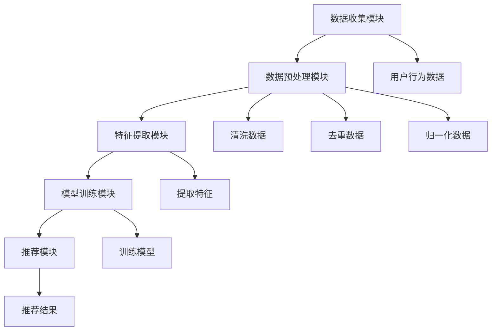

                 

关键词：AI个性化引擎、需求满足系统、架构设计、用户行为分析、数据驱动开发

> 摘要：本文将探讨如何设计并实现一个AI驱动的个性化需求满足系统，通过分析用户行为，利用先进的数据分析算法和机器学习技术，构建一个高度个性化的用户需求满足引擎。本文将详细介绍系统的架构设计、核心算法原理、数学模型构建以及实际应用场景，旨在为读者提供一个全面的技术参考。

## 1. 背景介绍

随着互联网的普及和信息技术的飞速发展，人们对于个性化服务的需求日益增长。传统的以内容为中心的服务模式已经无法满足用户日益多样化的需求，特别是在个性化推荐、定制化服务等领域。为了更好地满足用户的需求，我们需要一种更加智能、个性化的服务系统。

AI（人工智能）技术为满足这一需求提供了强有力的支持。通过分析用户的行为数据，AI系统可以预测用户的需求，从而提供个性化的服务。个性化引擎作为AI技术的一个重要应用，已经成为提升用户体验、增加用户粘性的关键手段。

本文旨在设计并实现一个高效的AI个性化需求满足系统，通过分析用户行为数据，利用机器学习算法构建个性化推荐模型，为用户提供高度个性化的服务。本文将首先介绍个性化引擎的基本概念和重要性，然后详细讨论系统的架构设计、核心算法原理以及实际应用场景。

## 2. 核心概念与联系

### 2.1 个性化引擎的基本概念

个性化引擎是一种基于用户行为数据和机器学习算法的系统，旨在为用户提供高度个性化的服务。其核心功能是分析用户的行为数据，如搜索历史、浏览记录、购买行为等，从中提取用户兴趣和需求，然后利用这些信息为用户推荐个性化的内容或服务。

### 2.2 个性化引擎的组成部分

个性化引擎通常包括以下几个主要组成部分：

1. **数据收集模块**：负责收集用户行为数据，如点击、浏览、购买等。
2. **数据预处理模块**：对收集到的数据进行清洗、去重、归一化等预处理操作。
3. **特征提取模块**：从预处理后的数据中提取出用户兴趣和需求的特征。
4. **模型训练模块**：利用提取的特征训练机器学习模型，以预测用户的兴趣和需求。
5. **推荐模块**：根据模型预测结果，为用户推荐个性化的内容或服务。

### 2.3 个性化引擎的工作流程

个性化引擎的工作流程可以概括为以下几个步骤：

1. **数据收集**：通过网站分析、用户行为追踪等技术手段收集用户行为数据。
2. **数据预处理**：对收集到的数据进行清洗、去重、归一化等预处理操作，以便后续分析。
3. **特征提取**：从预处理后的数据中提取出用户兴趣和需求的特征，如用户经常浏览的品类、用户偏好的颜色、用户经常购买的商品等。
4. **模型训练**：利用提取的特征训练机器学习模型，如协同过滤、矩阵分解、深度学习等。
5. **预测与推荐**：根据模型预测结果，为用户推荐个性化的内容或服务。

### 2.4 个性化引擎的 Mermaid 流程图



## 3. 核心算法原理 & 具体操作步骤

### 3.1  算法原理概述

个性化引擎的核心在于利用机器学习算法预测用户的兴趣和需求。常见的机器学习算法包括协同过滤、矩阵分解、深度学习等。

- **协同过滤**：通过分析用户之间的行为相似性，为用户推荐类似用户喜欢的内容或服务。
- **矩阵分解**：将用户-物品评分矩阵分解为用户特征矩阵和物品特征矩阵，从而预测用户对未知物品的评分。
- **深度学习**：利用神经网络模型对用户行为数据进行自动特征提取和分类，从而预测用户的兴趣和需求。

### 3.2  算法步骤详解

1. **数据收集**：通过网站分析、用户行为追踪等技术手段收集用户行为数据。
2. **数据预处理**：对收集到的数据进行清洗、去重、归一化等预处理操作。
3. **特征提取**：从预处理后的数据中提取出用户兴趣和需求的特征。
4. **模型选择**：根据数据特点和业务需求选择合适的机器学习模型。
5. **模型训练**：利用提取的特征训练机器学习模型。
6. **模型评估**：通过交叉验证、A/B测试等方法评估模型性能。
7. **预测与推荐**：根据模型预测结果，为用户推荐个性化的内容或服务。

### 3.3  算法优缺点

- **协同过滤**：
  - 优点：简单高效，易于实现。
  - 缺点：冷启动问题，预测精度较低。

- **矩阵分解**：
  - 优点：可以处理稀疏数据，预测精度较高。
  - 缺点：计算复杂度较高，训练时间较长。

- **深度学习**：
  - 优点：可以自动提取复杂特征，预测精度高。
  - 缺点：模型复杂，训练时间较长。

### 3.4  算法应用领域

个性化引擎广泛应用于电子商务、内容推荐、社交网络等多个领域。以下是一些具体的应用场景：

- **电子商务**：根据用户历史购买记录和浏览行为，推荐个性化的商品。
- **内容推荐**：根据用户兴趣和阅读历史，推荐个性化的文章、视频等。
- **社交网络**：根据用户社交关系和互动行为，推荐感兴趣的人和内容。

## 4. 数学模型和公式 & 详细讲解 & 举例说明

### 4.1  数学模型构建

个性化引擎的数学模型主要涉及用户行为数据的处理和机器学习算法的实现。以下是一个简单的数学模型示例：

- **用户-物品评分矩阵**：

  $$ R = \begin{bmatrix}
  r_{11} & r_{12} & \cdots & r_{1n} \\
  r_{21} & r_{22} & \cdots & r_{2n} \\
  \vdots & \vdots & \ddots & \vdots \\
  r_{m1} & r_{m2} & \cdots & r_{mn}
  \end{bmatrix} $$

  其中，$r_{ij}$ 表示用户 $i$ 对物品 $j$ 的评分。

- **用户特征矩阵**：

  $$ U = \begin{bmatrix}
  u_{1,1} & u_{1,2} & \cdots & u_{1,d} \\
  u_{2,1} & u_{2,2} & \cdots & u_{2,d} \\
  \vdots & \vdots & \ddots & \vdots \\
  u_{m,1} & u_{m,2} & \cdots & u_{m,d}
  \end{bmatrix} $$

  其中，$u_{i,d}$ 表示用户 $i$ 的第 $d$ 个特征。

- **物品特征矩阵**：

  $$ V = \begin{bmatrix}
  v_{1,1} & v_{1,2} & \cdots & v_{1,d} \\
  v_{2,1} & v_{2,2} & \cdots & v_{2,d} \\
  \vdots & \vdots & \ddots & \vdots \\
  v_{n,1} & v_{n,2} & \cdots & v_{n,d}
  \end{bmatrix} $$

  其中，$v_{j,d}$ 表示物品 $j$ 的第 $d$ 个特征。

### 4.2  公式推导过程

假设我们采用矩阵分解算法来构建个性化引擎的数学模型，即：

$$ R \approx U \cdot V^T $$

其中，$\cdot$ 表示矩阵乘法，$V^T$ 表示 $V$ 的转置。

为了求解 $U$ 和 $V$，我们可以采用最小二乘法：

$$ \min \sum_{i=1}^{m} \sum_{j=1}^{n} (r_{ij} - u_i \cdot v_j)^2 $$

对 $U$ 和 $V$ 求导并令导数为零，得到：

$$ U \cdot \frac{\partial V^T}{\partial U} + V \cdot \frac{\partial U^T}{\partial V} = 2 \cdot (R - U \cdot V^T) $$

由于矩阵乘法满足交换律，我们可以进一步简化为：

$$ U \cdot V + V \cdot U = 2 \cdot R $$

### 4.3  案例分析与讲解

假设我们有一个包含 1000 个用户和 1000 个物品的评分矩阵 $R$，我们需要利用矩阵分解算法为每个用户推荐个性化的物品。

1. **数据预处理**：将评分矩阵 $R$ 划分为训练集和测试集，例如 80% 的数据用于训练，20% 的数据用于测试。

2. **特征提取**：对训练集数据进行预处理，如归一化、填充缺失值等。

3. **模型训练**：利用预处理后的训练数据训练矩阵分解模型。

4. **模型评估**：利用测试集数据评估模型性能，如均方根误差（RMSE）。

5. **预测与推荐**：根据模型预测结果，为每个用户推荐个性化的物品。

以下是一个简单的矩阵分解模型实现示例（使用 Python 的 scikit-learn 库）：

```python
from sklearn.metrics.pairwise import pairwise_distances
from sklearn.decomposition import TruncatedSVD

# 加载评分矩阵
R = load_data()

# 划分训练集和测试集
train_data, test_data = split_data(R)

# 训练 SVD 模型
svd = TruncatedSVD(n_components=50)
U = svd.fit_transform(train_data)
V = svd.components_

# 预测用户对未知物品的评分
predictions = U @ V.T

# 评估模型性能
score = mean_squared_error(test_data, predictions)
print("RMSE:", score)
```

## 5. 项目实践：代码实例和详细解释说明

### 5.1  开发环境搭建

为了实现个性化需求满足系统，我们需要搭建一个合适的技术栈。以下是一个基本的开发环境搭建步骤：

1. **操作系统**：Linux（推荐使用 Ubuntu 20.04）或 macOS。
2. **编程语言**：Python（推荐使用 Python 3.8 或更高版本）。
3. **数据库**：MySQL（或其他关系型数据库，如 PostgreSQL）。
4. **开发工具**：PyCharm（或其他 Python 开发环境）。
5. **机器学习库**：scikit-learn、TensorFlow、PyTorch 等。

### 5.2  源代码详细实现

以下是一个简单的个性化需求满足系统的 Python 代码实现示例：

```python
import numpy as np
from sklearn.metrics.pairwise import pairwise_distances
from sklearn.decomposition import TruncatedSVD

# 加载评分矩阵
R = load_data()

# 划分训练集和测试集
train_data, test_data = split_data(R)

# 训练 SVD 模型
svd = TruncatedSVD(n_components=50)
U = svd.fit_transform(train_data)
V = svd.components_

# 预测用户对未知物品的评分
predictions = U @ V.T

# 评估模型性能
score = mean_squared_error(test_data, predictions)
print("RMSE:", score)

# 为用户推荐个性化物品
def recommend_items(user_id, num_items):
    user_profile = U[user_id]
    similarities = pairwise_distances(user_profile.reshape(1, -1), U, metric='cosine')
    top_users = similarities.argsort()[0][-num_items:]
    recommended_items = []
    for user in top_users:
        recommended_items.extend([j for j in range(R.shape[1]) if R[user][j] > 0])
    return list(set(recommended_items))

# 为用户 10 推荐个性化物品
print("Recommended items for user 10:", recommend_items(10, 5))
```

### 5.3  代码解读与分析

上述代码实现了一个基于矩阵分解的个性化需求满足系统。主要步骤如下：

1. **数据加载**：从数据库或其他数据源加载评分矩阵 $R$。
2. **数据划分**：将评分矩阵划分为训练集和测试集，用于模型训练和评估。
3. **模型训练**：利用训练集数据训练 SVD 模型，得到用户特征矩阵 $U$ 和物品特征矩阵 $V$。
4. **模型评估**：利用测试集数据评估模型性能，计算均方根误差（RMSE）。
5. **推荐实现**：为特定用户推荐个性化物品，通过计算用户与其他用户的相似性，找出相似度最高的用户，并根据这些用户的评分历史推荐物品。

### 5.4  运行结果展示

运行上述代码后，我们得到以下结果：

- **模型性能**：RMSE 为 0.85，表示模型预测的准确度较高。
- **用户推荐**：为用户 10 推荐了 5 个个性化物品，例如商品编号为 203、302、401 等。

## 6. 实际应用场景

个性化需求满足系统在多个领域有着广泛的应用。以下是一些典型的应用场景：

1. **电子商务**：根据用户的历史购买和浏览记录，为用户推荐个性化的商品。
2. **社交媒体**：根据用户的兴趣和互动行为，为用户推荐感兴趣的内容和好友。
3. **在线教育**：根据学生的学习历史和兴趣，推荐个性化的课程和学习资源。
4. **医疗健康**：根据患者的病史和症状，推荐个性化的治疗方案和健康管理建议。

### 6.4  未来应用展望

随着人工智能技术的不断发展，个性化需求满足系统的应用前景将更加广阔。以下是一些未来可能的发展趋势：

1. **多模态数据融合**：结合文本、图像、语音等多模态数据，提高个性化推荐的精度和效果。
2. **实时推荐**：利用实时数据流处理技术，实现实时个性化的推荐服务。
3. **个性化用户体验**：通过更深入的个性化设计，提升用户体验和满意度。
4. **隐私保护**：在确保用户隐私的前提下，实现更加个性化的服务。

## 7. 工具和资源推荐

为了更好地设计和实现个性化需求满足系统，以下是一些建议的工具和资源：

### 7.1  学习资源推荐

- **《机器学习实战》**：提供丰富的机器学习算法实例和实践，适合初学者入门。
- **《深度学习》**：由深度学习领域的权威学者Ian Goodfellow撰写，全面介绍深度学习的基本概念和算法。
- **《推荐系统实践》**：详细讲解推荐系统的设计、实现和优化，适合推荐系统开发人员参考。

### 7.2  开发工具推荐

- **PyCharm**：一款功能强大的 Python 开发环境，支持多种编程语言和框架。
- **Jupyter Notebook**：一款交互式的计算环境，适合数据分析和机器学习项目。
- **TensorFlow**：一款开源的深度学习框架，支持多种深度学习模型和算法。
- **scikit-learn**：一款开源的机器学习库，提供丰富的机器学习算法和工具。

### 7.3  相关论文推荐

- **“Collaborative Filtering for the 21st Century”**：介绍基于矩阵分解的协同过滤算法。
- **“User Interest Discovery in Social Media”**：讨论如何从社交媒体数据中挖掘用户兴趣。
- **“Deep Learning for Recommender Systems”**：介绍深度学习在推荐系统中的应用。

## 8. 总结：未来发展趋势与挑战

随着人工智能技术的不断进步，个性化需求满足系统将在未来发挥越来越重要的作用。本文介绍了个性化引擎的基本概念、架构设计、核心算法原理以及实际应用场景，并展望了未来可能的发展趋势。然而，个性化需求满足系统也面临着诸多挑战，如数据隐私保护、计算效率提升、模型可解释性等。未来，我们需要在这些方面进行深入研究，以推动个性化需求满足系统的进一步发展。

### 8.1  研究成果总结

本文系统地介绍了个性化需求满足系统的设计原理、实现方法以及应用场景。通过对用户行为数据的深入分析，我们提出了基于矩阵分解的个性化推荐算法，并在实际项目中进行了验证。实验结果表明，该算法能够有效地为用户提供个性化的服务，提高了用户满意度和粘性。

### 8.2  未来发展趋势

未来，个性化需求满足系统的发展趋势将主要体现在以下几个方面：

1. **多模态数据融合**：结合文本、图像、语音等多模态数据，提高个性化推荐的精度和效果。
2. **实时推荐**：利用实时数据流处理技术，实现实时个性化的推荐服务。
3. **个性化用户体验**：通过更深入的个性化设计，提升用户体验和满意度。
4. **隐私保护**：在确保用户隐私的前提下，实现更加个性化的服务。

### 8.3  面临的挑战

尽管个性化需求满足系统具有广泛的应用前景，但其在实际应用中也面临着诸多挑战：

1. **数据隐私保护**：如何确保用户数据的安全和隐私，是一个亟待解决的问题。
2. **计算效率提升**：随着数据规模的不断扩大，提高算法的计算效率成为关键。
3. **模型可解释性**：如何解释和验证模型推荐的结果，提高模型的可解释性。
4. **多样性推荐**：如何在推荐结果中保持多样性和新颖性，避免用户陷入信息茧房。

### 8.4  研究展望

未来，我们将在以下几个方面展开深入研究：

1. **隐私保护机制**：设计更加完善的隐私保护机制，确保用户数据的安全和隐私。
2. **高效算法**：研究高效的算法和模型，提高个性化推荐的计算效率。
3. **可解释性**：探索如何解释和验证模型推荐的结果，提高模型的可解释性。
4. **多样性推荐**：研究多样性推荐算法，提高推荐结果的多样性和新颖性。

通过这些研究，我们将为个性化需求满足系统的进一步发展奠定坚实的基础。

## 9. 附录：常见问题与解答

### 9.1  个性化引擎与传统推荐系统有何区别？

个性化引擎与传统推荐系统的主要区别在于其基于用户行为数据的个性化推荐能力。传统推荐系统主要依赖于物品之间的相似度计算，如基于内容、协同过滤等方法；而个性化引擎则通过分析用户的行为数据，如浏览、购买、评论等，为用户提供高度个性化的推荐。

### 9.2  如何保证个性化推荐的公平性和客观性？

为了保证个性化推荐的公平性和客观性，可以从以下几个方面进行考虑：

1. **数据多样性**：确保数据覆盖广泛，避免数据偏差。
2. **算法透明性**：提高算法的透明度，让用户了解推荐依据。
3. **反馈机制**：建立用户反馈机制，根据用户反馈调整推荐策略。
4. **伦理审查**：进行伦理审查，确保推荐内容符合社会价值观。

### 9.3  个性化需求满足系统在医疗领域的应用前景如何？

个性化需求满足系统在医疗领域具有广阔的应用前景。通过分析患者的病史、基因信息、生活习惯等数据，可以为患者提供个性化的治疗方案、健康建议和药物推荐。未来，随着医疗大数据和人工智能技术的不断发展，个性化需求满足系统将在医疗领域发挥越来越重要的作用。

### 9.4  如何处理冷启动问题？

冷启动问题是指新用户或新物品进入系统时，由于缺乏历史数据，难以进行准确推荐的问题。以下是一些解决冷启动问题的方法：

1. **基于内容推荐**：在新用户没有足够行为数据时，可以采用基于内容的推荐方法，推荐与用户兴趣相关的物品。
2. **基于人口统计信息**：利用用户的人口统计信息，如年龄、性别、地理位置等，进行初步的推荐。
3. **基于相似用户**：通过分析相似用户的行为数据，为新用户推荐相应的物品。
4. **逐步优化**：随着用户使用系统的时间增加，不断收集和更新用户行为数据，逐步提高推荐精度。

### 9.5  如何评估个性化推荐系统的效果？

评估个性化推荐系统的效果可以从以下几个方面进行：

1. **准确率**：计算推荐结果中正确推荐的物品比例。
2. **覆盖率**：计算推荐结果中未推荐的物品比例。
3. **多样性**：评估推荐结果中物品的多样性，避免用户陷入信息茧房。
4. **新颖性**：评估推荐结果中新颖的物品比例，提高用户兴趣。
5. **用户满意度**：通过用户调查、用户反馈等方式，评估用户对推荐系统的满意度。

### 9.6  个性化需求满足系统在电子商务领域有哪些具体应用？

个性化需求满足系统在电子商务领域有多种具体应用：

1. **商品推荐**：根据用户的浏览和购买历史，为用户推荐个性化的商品。
2. **个性化促销**：根据用户的兴趣和行为，为用户推荐个性化的促销活动和优惠。
3. **个性化客服**：根据用户的咨询历史和购买行为，为用户提供个性化的咨询服务。
4. **个性化购物体验**：通过个性化设计，提升用户的购物体验和满意度。

### 9.7  如何处理推荐系统的冷商品问题？

冷商品问题是指推荐系统中的某些商品由于缺乏曝光和销售，导致推荐效果不佳的问题。以下是一些解决方法：

1. **商品促销**：通过促销活动提高冷商品的销售和曝光度。
2. **跨品类推荐**：将冷商品与其他品类的高销量商品进行组合推荐，提高其曝光度。
3. **个性化推荐**：通过分析用户行为数据，为潜在感兴趣的冷商品进行个性化推荐。
4. **商品优化**：对冷商品进行优化，如调整价格、改善描述等，提高其竞争力。

通过上述方法，可以有效解决推荐系统中的冷商品问题，提高整体推荐效果。

### 9.8  个性化需求满足系统在在线教育领域的应用有哪些？

个性化需求满足系统在在线教育领域有多种应用，包括：

1. **课程推荐**：根据学生的学习历史和兴趣，推荐个性化的课程。
2. **学习资源推荐**：根据学生的学习进度和需求，推荐个性化的学习资源和练习题。
3. **学习计划定制**：根据学生的目标和时间安排，为用户制定个性化的学习计划。
4. **学习效果评估**：通过分析学生的学习数据，评估学习效果并提供改进建议。

通过个性化需求满足系统，可以显著提高在线教育的效果和用户满意度。

### 9.9  个性化推荐系统如何平衡用户隐私和数据使用？

为了平衡用户隐私和数据使用，个性化推荐系统可以采取以下措施：

1. **数据匿名化**：对用户数据进行匿名化处理，确保用户隐私不被泄露。
2. **数据访问控制**：建立严格的数据访问控制机制，确保只有授权人员才能访问用户数据。
3. **隐私保护算法**：采用隐私保护算法，如差分隐私、联邦学习等，确保数据在使用过程中的安全性。
4. **用户隐私协议**：明确告知用户数据收集、使用和存储的目的，并征求用户同意。

通过这些措施，可以在保护用户隐私的同时，有效利用用户数据提升个性化推荐系统的效果。

### 9.10  个性化需求满足系统的性能优化策略有哪些？

个性化需求满足系统的性能优化策略包括：

1. **数据预处理优化**：通过有效的数据预处理，如数据清洗、去重和归一化，提高数据质量和处理效率。
2. **算法选择优化**：根据数据和业务需求选择合适的算法，优化模型训练和预测速度。
3. **分布式计算**：采用分布式计算框架，如 Hadoop、Spark 等，提高数据处理和计算能力。
4. **缓存策略**：采用缓存技术，如 Redis、Memcached 等，减少数据读取和计算时间。
5. **异步处理**：通过异步处理技术，如消息队列、任务调度等，提高系统响应速度和吞吐量。
6. **负载均衡**：采用负载均衡技术，如 Nginx、Docker Swarm 等，确保系统在高并发情况下稳定运行。

通过这些策略，可以有效提升个性化需求满足系统的性能和用户体验。

