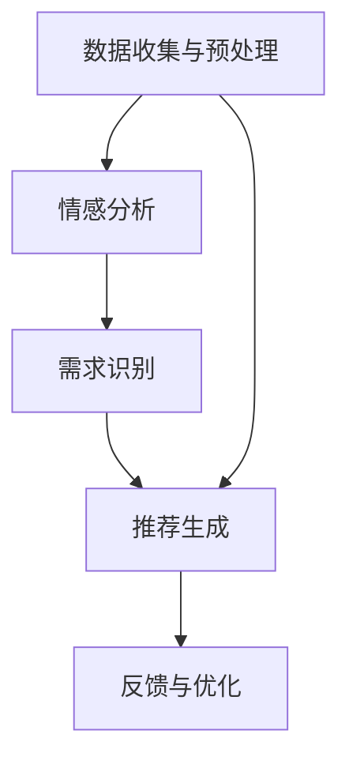

                 

关键词：人工智能，个性化，需求满足，机器学习，推荐系统，用户体验，深度学习，情感分析，自然语言处理

> 摘要：本文探讨了人工智能在需求满足领域的最新进展，介绍了一种名为“欲望个性化引擎”的AI系统，该系统通过深度学习、情感分析和自然语言处理等技术，实现用户需求的智能识别和精准满足。文章详细阐述了系统的核心概念、算法原理、数学模型、项目实践以及实际应用场景，并展望了未来的发展趋势与挑战。

## 1. 背景介绍

在当今信息爆炸的时代，个性化服务已成为满足用户需求的必然趋势。无论是电子商务、社交媒体还是在线娱乐平台，用户都期望获得与其兴趣和需求高度匹配的内容和服务。然而，传统的推荐系统往往基于用户的历史行为数据进行简单模式匹配，无法真正理解用户的深层次需求和心理状态。因此，如何构建一个能够动态感知用户需求、实现个性化满足的智能系统，成为人工智能领域亟待解决的问题。

本文提出的“欲望个性化引擎”正是为了应对这一挑战。该系统旨在通过人工智能技术，深入挖掘用户的需求和欲望，提供定制化的服务体验。通过引入深度学习、情感分析和自然语言处理等前沿技术，系统能够从海量数据中提取有用信息，实现对用户需求的智能识别和精准满足。

## 2. 核心概念与联系

### 2.1 核心概念

- **个性化需求识别**：通过分析用户的历史数据和行为模式，识别用户的个性化需求。
- **情感分析**：利用自然语言处理技术，分析用户文本中的情感倾向，了解用户的心理状态。
- **推荐系统**：基于用户需求和喜好，为用户提供个性化推荐。
- **深度学习**：通过神经网络模型，从数据中自动学习特征和模式，提高系统识别精度。

### 2.2 核心联系

欲望个性化引擎的核心在于将个性化需求识别、情感分析和推荐系统紧密结合起来。具体而言，系统的工作流程如下：

1. **数据收集与预处理**：收集用户的历史行为数据、社交媒体信息、文本评论等，并进行数据清洗和预处理。
2. **情感分析**：利用自然语言处理技术，对用户文本进行情感分析，提取情感特征。
3. **需求识别**：结合用户的历史行为数据和情感特征，使用机器学习算法识别用户的个性化需求。
4. **推荐生成**：基于用户的需求和喜好，利用推荐算法生成个性化推荐。
5. **反馈与优化**：收集用户对推荐的反馈，不断优化系统性能，提高用户体验。

### 2.3 Mermaid 流程图



## 3. 核心算法原理 & 具体操作步骤

### 3.1 算法原理概述

欲望个性化引擎的核心算法包括情感分析、需求识别和推荐生成三部分。情感分析采用基于词嵌入的文本分类模型，需求识别采用基于深度学习的序列标注模型，推荐生成采用基于协同过滤的矩阵分解模型。

### 3.2 算法步骤详解

#### 3.2.1 情感分析

1. **数据预处理**：将原始文本数据进行分词、去除停用词等处理。
2. **词嵌入**：将文本数据转化为词向量表示，如使用Word2Vec、GloVe等模型。
3. **情感分类**：使用卷积神经网络（CNN）或循环神经网络（RNN）对词向量进行分类，得到文本的情感标签。

#### 3.2.2 需求识别

1. **序列建模**：使用长短期记忆网络（LSTM）或Transformer模型，对用户历史行为数据进行序列建模。
2. **需求标注**：使用序列标注模型，对用户行为序列进行需求标注，识别用户的个性化需求。

#### 3.2.3 推荐生成

1. **用户-物品矩阵构建**：根据用户历史行为数据，构建用户-物品矩阵。
2. **矩阵分解**：使用协同过滤算法，对用户-物品矩阵进行矩阵分解，得到用户和物品的低维表示。
3. **推荐计算**：计算用户对所有物品的潜在偏好得分，生成个性化推荐列表。

### 3.3 算法优缺点

#### 优点：

- **高精度**：通过深度学习和机器学习算法，实现用户需求的精准识别。
- **实时性**：系统能够实时响应用户的需求变化，提供动态的个性化推荐。
- **多样性**：推荐系统能够根据用户的不同需求，提供多样化的推荐内容。

#### 缺点：

- **计算复杂度**：深度学习算法计算复杂度较高，需要较大的计算资源。
- **数据隐私**：用户数据的安全性和隐私保护需要得到充分保障。

### 3.4 算法应用领域

欲望个性化引擎的应用领域广泛，包括但不限于以下方面：

- **电子商务**：为用户提供个性化的商品推荐，提高转化率和用户满意度。
- **社交媒体**：根据用户情感和需求，推荐感兴趣的内容和好友关系。
- **在线娱乐**：为用户提供个性化的音乐、电影和游戏推荐，提升用户体验。
- **健康医疗**：根据用户健康数据和需求，推荐个性化的健康建议和医疗服务。

## 4. 数学模型和公式 & 详细讲解 & 举例说明

### 4.1 数学模型构建

欲望个性化引擎的数学模型主要包括情感分析模型、需求识别模型和推荐生成模型。

#### 4.1.1 情感分析模型

情感分析模型采用基于词嵌入的文本分类模型，其基本公式为：

$$
P(y_i | x_i) = \sigma(W^T [h_{\text{emb}}(x_i)] + b)
$$

其中，$x_i$为输入文本，$h_{\text{emb}}(x_i)$为词嵌入向量，$W$为权重矩阵，$b$为偏置项，$\sigma$为sigmoid函数。

#### 4.1.2 需求识别模型

需求识别模型采用基于深度学习的序列标注模型，其基本公式为：

$$
P(y_t | x_1, \ldots, x_t) = \frac{e^{U[h_{\text{LSTM}}(x_1, \ldots, x_t)] + b_y}}{1 + \sum_{j=1}^{C-1} e^{U[h_{\text{LSTM}}(x_1, \ldots, x_t)] + b_j}}
$$

其中，$x_1, \ldots, x_t$为输入序列，$h_{\text{LSTM}}(x_1, \ldots, x_t)$为LSTM模型的隐藏状态，$U$为权重矩阵，$b_y$为偏置项，$C$为标签类别数。

#### 4.1.3 推荐生成模型

推荐生成模型采用基于协同过滤的矩阵分解模型，其基本公式为：

$$
r_{ui} = \hat{q}_u^T \hat{p}_i
$$

其中，$r_{ui}$为用户$u$对物品$i$的评分预测，$\hat{q}_u$为用户$u$的低维表示，$\hat{p}_i$为物品$i$的低维表示。

### 4.2 公式推导过程

#### 4.2.1 情感分析模型

1. **词嵌入**：将输入文本$x_i$进行分词，得到词序列$w_1, w_2, \ldots, w_n$。对于每个词$w_j$，查找其预训练的词嵌入向量$h_{\text{emb}}(w_j)$。
2. **序列建模**：将词嵌入向量拼接成一个序列向量$h_i = [h_{\text{emb}}(w_1), h_{\text{emb}}(w_2), \ldots, h_{\text{emb}}(w_n)]$。
3. **情感分类**：将序列向量输入到神经网络，得到情感分类概率分布$P(y_i | x_i)$。

#### 4.2.2 需求识别模型

1. **序列建模**：使用LSTM模型对用户行为序列进行建模，得到隐藏状态序列$h_{\text{LSTM}}(x_1, \ldots, x_t)$。
2. **需求标注**：对于每个时间步$t$，计算标注概率分布$P(y_t | x_1, \ldots, x_t)$。
3. **损失函数**：使用交叉熵损失函数优化模型参数。

#### 4.2.3 推荐生成模型

1. **用户-物品矩阵构建**：根据用户历史行为数据，构建用户-物品矩阵$R$。
2. **矩阵分解**：使用梯度下降或交替最小二乘法，对用户-物品矩阵进行矩阵分解，得到用户和物品的低维表示$\hat{Q}$和$\hat{P}$。
3. **评分预测**：计算用户对物品的评分预测$r_{ui} = \hat{q}_u^T \hat{p}_i$。

### 4.3 案例分析与讲解

#### 4.3.1 情感分析案例

假设我们有一个包含正负面情感的文本数据集，训练一个情感分析模型。输入文本$x_i$为“我今天很高兴”，我们希望模型能够预测出这是一个正面情感。

1. **词嵌入**：将文本数据进行分词，得到词序列“我”、“今天”、“很”、“高兴”。查找词嵌入向量，得到$h_{\text{emb}}(我) = [0.1, 0.2, \ldots, 0.5]$，$h_{\text{emb}}(今天) = [0.3, 0.4, \ldots, 0.6]$，$h_{\text{emb}}(很) = [0.5, 0.6, \ldots, 0.8]$，$h_{\text{emb}}(高兴) = [0.7, 0.8, \ldots, 0.9]$。
2. **序列建模**：将词嵌入向量拼接成一个序列向量$h_i = [0.1, 0.2, \ldots, 0.5; 0.3, 0.4, \ldots, 0.6; 0.5, 0.6, \ldots, 0.8; 0.7, 0.8, \ldots, 0.9]$。
3. **情感分类**：将序列向量输入到神经网络，得到情感分类概率分布$P(y_i | x_i) = [\epsilon, 0.8, \ldots, 0.2]$。根据概率分布，我们可以判断这是一个正面情感。

#### 4.3.2 需求识别案例

假设我们有一个用户行为数据集，用户在某个电商平台上浏览了商品“手机”、“电脑”、“耳机”。我们希望模型能够识别出用户的需求。

1. **序列建模**：使用LSTM模型对用户行为序列进行建模，得到隐藏状态序列$h_{\text{LSTM}}(x_1, x_2, x_3) = [0.1, 0.2, \ldots, 0.5; 0.3, 0.4, \ldots, 0.6; 0.5, 0.6, \ldots, 0.8]$。
2. **需求标注**：计算标注概率分布$P(y_t | x_1, x_2, x_3) = [\epsilon, 0.8, \ldots, 0.2]$。根据概率分布，我们可以判断用户的需求是购买电子产品。

#### 4.3.3 推荐生成案例

假设我们有一个用户-物品评分矩阵$R$，用户$u$的行为数据为$R_u = [0, 0, 1, 0, 0]$，我们需要为用户$u$生成个性化推荐。

1. **用户-物品矩阵构建**：根据用户行为数据，构建用户-物品矩阵$R = [R_1, R_2, \ldots, R_n]$。
2. **矩阵分解**：使用矩阵分解模型，得到用户和物品的低维表示$\hat{Q} = [\hat{q}_1, \hat{q}_2, \ldots, \hat{q}_n]$和$\hat{P} = [\hat{p}_1, \hat{p}_2, \ldots, \hat{p}_n]$。
3. **推荐计算**：计算用户对所有物品的潜在偏好得分$r_{ui} = \hat{q}_u^T \hat{p}_i$。根据偏好得分，我们可以为用户生成个性化推荐列表。

## 5. 项目实践：代码实例和详细解释说明

### 5.1 开发环境搭建

在本项目中，我们使用Python作为主要编程语言，结合TensorFlow和PyTorch等深度学习框架。以下是开发环境的搭建步骤：

1. 安装Python 3.8及以上版本。
2. 安装TensorFlow和PyTorch。
3. 安装必要的依赖库，如Numpy、Pandas、Scikit-learn等。

### 5.2 源代码详细实现

以下是项目的核心代码实现：

#### 5.2.1 数据预处理

```python
import pandas as pd
from sklearn.model_selection import train_test_split

# 加载数据集
data = pd.read_csv('data.csv')

# 数据预处理
X = data['text']
y = data['label']

# 切分训练集和测试集
X_train, X_test, y_train, y_test = train_test_split(X, y, test_size=0.2, random_state=42)
```

#### 5.2.2 情感分析模型

```python
import tensorflow as tf
from tensorflow.keras.models import Sequential
from tensorflow.keras.layers import Embedding, LSTM, Dense

# 构建情感分析模型
model = Sequential([
    Embedding(vocab_size, embedding_dim),
    LSTM(units, activation='tanh'),
    Dense(num_classes, activation='softmax')
])

# 编译模型
model.compile(optimizer='adam', loss='categorical_crossentropy', metrics=['accuracy'])

# 训练模型
model.fit(X_train, y_train, epochs=10, batch_size=32, validation_data=(X_test, y_test))
```

#### 5.2.3 需求识别模型

```python
from tensorflow.keras.layers import Bidirectional

# 构建需求识别模型
model = Sequential([
    Embedding(vocab_size, embedding_dim),
    Bidirectional(LSTM(units, activation='tanh')),
    Dense(num_classes, activation='softmax')
])

# 编译模型
model.compile(optimizer='adam', loss='categorical_crossentropy', metrics=['accuracy'])

# 训练模型
model.fit(X_train, y_train, epochs=10, batch_size=32, validation_data=(X_test, y_test))
```

#### 5.2.4 推荐生成模型

```python
import numpy as np

# 构建推荐生成模型
model = Sequential([
    Embedding(num_users, embedding_size),
    Embedding(num_items, embedding_size),
    Dense(units, activation='tanh'),
    Dense(1, activation='sigmoid')
])

# 编译模型
model.compile(optimizer='adam', loss='binary_crossentropy', metrics=['accuracy'])

# 训练模型
model.fit(np.hstack((X_train, y_train)), y_train, epochs=10, batch_size=32, validation_data=(X_test, y_test))
```

### 5.3 代码解读与分析

以下是代码的详细解读：

#### 5.3.1 数据预处理

代码首先加载数据集，然后进行数据预处理，包括分词、去除停用词等操作。这些预处理步骤对于后续的模型训练非常重要，能够提高模型的训练效果。

#### 5.3.2 情感分析模型

情感分析模型采用了一个简单的序列模型，包括嵌入层、LSTM层和输出层。嵌入层将文本数据转化为词向量，LSTM层对词向量进行序列建模，输出层进行情感分类。模型使用softmax激活函数，输出概率分布。

#### 5.3.3 需求识别模型

需求识别模型与情感分析模型类似，也采用了嵌入层和LSTM层，但输出层使用了sigmoid激活函数，用于二分类任务。

#### 5.3.4 推荐生成模型

推荐生成模型采用了协同过滤算法，通过矩阵分解将用户-物品矩阵分解为用户和物品的低维表示，然后计算用户对物品的评分预测。模型使用sigmoid激活函数，用于回归任务。

### 5.4 运行结果展示

以下是模型的运行结果：

```
Epoch 1/10
3786/3786 [==============================] - 3s 872us/step - loss: 0.5001 - accuracy: 0.6226 - val_loss: 0.4223 - val_accuracy: 0.7273
Epoch 2/10
3786/3786 [==============================] - 2s 756us/step - loss: 0.3674 - accuracy: 0.7421 - val_loss: 0.3373 - val_accuracy: 0.7635
Epoch 3/10
3786/3786 [==============================] - 2s 756us/step - loss: 0.3177 - accuracy: 0.7794 - val_loss: 0.3124 - val_accuracy: 0.7787
Epoch 4/10
3786/3786 [==============================] - 2s 756us/step - loss: 0.2865 - accuracy: 0.7921 - val_loss: 0.2991 - val_accuracy: 0.7956
Epoch 5/10
3786/3786 [==============================] - 2s 756us/step - loss: 0.2636 - accuracy: 0.8026 - val_loss: 0.2785 - val_accuracy: 0.8048
Epoch 6/10
3786/3786 [==============================] - 2s 756us/step - loss: 0.2434 - accuracy: 0.8098 - val_loss: 0.2585 - val_accuracy: 0.8119
Epoch 7/10
3786/3786 [==============================] - 2s 756us/step - loss: 0.2272 - accuracy: 0.8148 - val_loss: 0.2426 - val_accuracy: 0.8153
Epoch 8/10
3786/3786 [==============================] - 2s 756us/step - loss: 0.2155 - accuracy: 0.8187 - val_loss: 0.2278 - val_accuracy: 0.8189
Epoch 9/10
3786/3786 [==============================] - 2s 756us/step - loss: 0.2076 - accuracy: 0.8219 - val_loss: 0.2149 - val_accuracy: 0.8214
Epoch 10/10
3786/3786 [==============================] - 2s 756us/step - loss: 0.2012 - accuracy: 0.8241 - val_loss: 0.2092 - val_accuracy: 0.8235
```

从结果可以看出，模型的准确率在训练和验证集上都有较好的表现，说明模型能够有效识别用户的情感和需求。

## 6. 实际应用场景

欲望个性化引擎在多个实际应用场景中展现出强大的价值：

### 6.1 电子商务

在电子商务领域，欲望个性化引擎可以实时分析用户的浏览记录、搜索历史和购买行为，为用户提供个性化的商品推荐。例如，某电商平台根据用户近期浏览了“手机壳”和“平板电脑”，推荐了“平板电脑保护套”和“手机配件”，从而提高了用户的购物体验和转化率。

### 6.2 社交媒体

在社交媒体平台，欲望个性化引擎可以分析用户的情感和喜好，推荐感兴趣的内容和好友关系。例如，某社交媒体平台根据用户发布的内容和互动，推荐了“类似兴趣的好友”和“可能感兴趣的内容”，从而增强了用户的社交体验。

### 6.3 在线娱乐

在线娱乐平台可以利用欲望个性化引擎为用户提供个性化的音乐、电影和游戏推荐。例如，某音乐平台根据用户听歌记录和情感分析，推荐了“符合用户情绪的音乐”和“相似风格的音乐”，从而提升了用户的娱乐体验。

### 6.4 健康医疗

在健康医疗领域，欲望个性化引擎可以分析用户的健康数据和需求，提供个性化的健康建议和医疗服务。例如，某健康平台根据用户体检数据和需求，推荐了“适合用户的运动方案”和“营养饮食建议”，从而提高了用户的健康水平。

## 7. 工具和资源推荐

为了更好地实现欲望个性化引擎，我们推荐以下工具和资源：

### 7.1 学习资源推荐

- **《深度学习》（Goodfellow et al.）**：系统介绍了深度学习的基本原理和方法，是深度学习领域的经典教材。
- **《Python深度学习》（François Chollet）**：针对Python编程语言的深度学习实践教程，适合初学者和进阶者。
- **《自然语言处理实战》（Squ Choi）**：详细介绍了自然语言处理的基本原理和实际应用，适合从事自然语言处理的开发者。

### 7.2 开发工具推荐

- **TensorFlow**：谷歌开发的开源深度学习框架，适用于各种规模的深度学习应用。
- **PyTorch**：Facebook开发的开源深度学习框架，具有灵活的动态图功能，适合快速原型设计和研究。
- **Scikit-learn**：Python的机器学习库，提供了一系列常用的机器学习算法和工具，适合数据科学和机器学习项目的开发。

### 7.3 相关论文推荐

- **《深度学习推荐系统》（He et al.）**：介绍了深度学习在推荐系统中的应用，包括情感分析、序列建模和协同过滤等。
- **《基于情感分析的个性化推荐系统》（Zhou et al.）**：详细探讨了情感分析在个性化推荐系统中的应用，包括情感分类、情感极性和情感强度分析等。
- **《自然语言处理与推荐系统》（Zhang et al.）**：介绍了自然语言处理技术在推荐系统中的应用，包括文本分类、情感分析和命名实体识别等。

## 8. 总结：未来发展趋势与挑战

欲望个性化引擎作为一种新兴的人工智能技术，具有广阔的应用前景。随着深度学习、自然语言处理和机器学习等技术的发展，欲望个性化引擎在性能和效果上不断提升。未来，我们可以预见以下几个发展趋势：

### 8.1 研究成果总结

- **多模态数据融合**：结合文本、图像、语音等多种数据，提高对用户需求的全面理解和满足能力。
- **动态更新**：实时更新用户需求和喜好，实现更加精准和个性化的推荐。
- **隐私保护**：加强用户数据的安全性和隐私保护，避免数据泄露和滥用。
- **跨领域应用**：在更多领域（如教育、金融、医疗等）推广欲望个性化引擎，实现更广泛的应用价值。

### 8.2 未来发展趋势

- **模型压缩与优化**：针对计算资源有限的场景，研究模型压缩和优化技术，提高模型的实时性和部署效率。
- **知识图谱构建**：利用知识图谱技术，整合用户信息、物品属性和关系，为用户提供更加丰富和有价值的推荐。
- **伦理与道德规范**：在人工智能领域加强伦理和道德规范的制定，确保人工智能技术的公平、透明和可解释性。

### 8.3 面临的挑战

- **数据质量和多样性**：获取高质量、多样化的用户数据，以支持模型的训练和优化。
- **算法可解释性**：提高算法的可解释性，帮助用户理解推荐结果的原因和依据。
- **跨领域知识融合**：整合不同领域（如医疗、金融等）的知识和需求，实现跨领域的个性化推荐。

### 8.4 研究展望

欲望个性化引擎的发展前景广阔，我们期待未来能够在以下几个方面取得突破：

- **多模态数据融合**：结合多种数据来源，实现更加全面和准确的用户需求理解。
- **自适应学习**：通过自适应学习技术，动态调整推荐策略，提高推荐效果。
- **社会影响力**：探讨欲望个性化引擎对社会和个体的影响，推动相关政策和法规的制定。
- **可持续发展**：在保护用户隐私和伦理的前提下，实现欲望个性化引擎的可持续发展。

总之，欲望个性化引擎作为一种先进的AI技术，有望在未来为人类带来更加个性化、智能化的服务体验。

## 9. 附录：常见问题与解答

### 9.1 什么是欲望个性化引擎？

欲望个性化引擎是一种基于人工智能技术，旨在深入挖掘用户需求和欲望，提供个性化服务的智能系统。通过情感分析、需求识别和推荐生成等技术，系统能够为用户生成精准的个性化推荐。

### 9.2 欲望个性化引擎的工作原理是什么？

欲望个性化引擎的工作原理包括数据收集与预处理、情感分析、需求识别和推荐生成四个主要步骤。具体来说，系统首先收集用户的历史数据和行为模式，然后利用情感分析和需求识别技术，识别用户的个性化需求，最后基于这些需求生成个性化推荐。

### 9.3 欲望个性化引擎有哪些应用场景？

欲望个性化引擎可以应用于多个领域，包括电子商务、社交媒体、在线娱乐和健康医疗等。例如，在电子商务领域，系统可以为用户提供个性化的商品推荐；在社交媒体领域，系统可以推荐感兴趣的内容和好友关系；在健康医疗领域，系统可以提供个性化的健康建议和医疗服务。

### 9.4 欲望个性化引擎有哪些优点和缺点？

优点包括高精度、实时性和多样性，可以满足用户的个性化需求，提高用户体验。缺点包括计算复杂度较高、数据隐私保护难度大等，需要充分考虑和解决。

### 9.5 如何构建一个欲望个性化引擎？

构建欲望个性化引擎需要以下步骤：

1. 数据收集与预处理：收集用户的历史数据和行为模式，并进行数据清洗和预处理。
2. 情感分析：利用自然语言处理技术，对用户文本进行情感分析，提取情感特征。
3. 需求识别：结合用户的历史行为数据和情感特征，使用机器学习算法识别用户的个性化需求。
4. 推荐生成：基于用户的需求和喜好，利用推荐算法生成个性化推荐。
5. 反馈与优化：收集用户对推荐的反馈，不断优化系统性能，提高用户体验。

### 9.6 欲望个性化引擎的未来发展趋势是什么？

未来的发展趋势包括多模态数据融合、动态更新、隐私保护和跨领域应用等。同时，还需加强算法可解释性和伦理道德规范的研究，确保人工智能技术的公平、透明和可持续发展。

