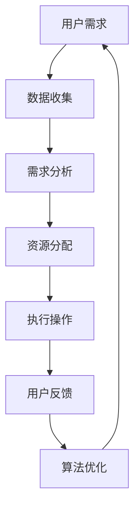

                 

关键词：去物质化引擎、AI时代、精神追求、催化剂设计、计算机科学、哲学、算法

> 摘要：本文深入探讨了AI时代下，去物质化引擎工程师如何通过设计和创新，推动人类精神追求的发展。文章从背景介绍、核心概念、算法原理、数学模型、项目实践和未来应用等多个角度，全面解析了这一领域的现状与前景，旨在为读者提供深刻的思考和广阔的视野。

## 1. 背景介绍

在人类社会进入AI时代的当下，技术进步正以前所未有的速度改变着我们的生活方式。从自动驾驶汽车到智能医疗，从虚拟现实到人机交互，人工智能正在逐渐渗透到各个领域，成为推动社会发展的关键力量。然而，在物质文明飞速发展的同时，人类的精神需求也在不断升级。对于精神追求的渴望，不仅仅是对美好生活的向往，更是对内心深处无尽好奇和探索的驱动力。

在这种背景下，去物质化引擎的概念逐渐受到重视。去物质化引擎旨在通过技术手段，将物质世界的实体需求转化为精神层面的满足。这不仅是对物质资源的优化利用，更是对人类精神追求的深刻回应。作为去物质化引擎的设计者，工程师们肩负着挖掘技术潜力、满足人类精神需求的重任。

本文将围绕这一主题，探讨AI时代的精神追求与去物质化引擎的设计原理，希望通过深入分析和实例展示，为读者揭示这一领域的奥秘。

## 2. 核心概念与联系

### 2.1 去物质化引擎的概念

去物质化引擎，顾名思义，是指一种能够降低物质依赖、提升精神满足的智能系统。它不仅依赖于先进的计算机科学技术，如人工智能、机器学习、虚拟现实等，还涉及到哲学、心理学等多个领域。具体来说，去物质化引擎的核心目标是：

1. **减少物质消耗**：通过智能算法优化资源使用，降低生产和消费过程中的物质浪费。
2. **提升精神体验**：通过虚拟现实、增强现实等技术，提供沉浸式的精神体验，满足人类对多样性和个性化的需求。
3. **促进精神成长**：通过个性化的学习计划和互动设计，帮助用户在精神层面实现自我提升和成长。

### 2.2 去物质化引擎与AI时代的关系

AI时代的到来，为去物质化引擎的发展提供了强有力的技术支持。具体而言，这种关系体现在以下几个方面：

1. **数据驱动**：AI技术能够通过大数据分析和机器学习算法，精确预测用户需求，实现资源的精准配置和优化。
2. **智能化交互**：自然语言处理、语音识别等技术的进步，使得去物质化引擎能够与用户进行更自然、更高效的互动。
3. **自主进化**：通过深度学习和强化学习，去物质化引擎能够不断自我优化，提高服务质量和用户体验。

### 2.3 去物质化引擎与精神追求的联系

去物质化引擎不仅仅是一个技术产品，它更是一种哲学思考的体现。在AI时代，人类的物质需求得到了前所未有的满足，但精神需求却变得更加复杂和多样。去物质化引擎通过以下方式满足人类精神追求：

1. **情感共鸣**：通过情感计算和情感识别技术，去物质化引擎能够理解和回应用户的情感状态，提供个性化的情感支持。
2. **精神启迪**：通过个性化的学习内容和互动设计，去物质化引擎能够激发用户的思维活力，促进精神成长。
3. **文化传承**：通过虚拟现实和增强现实技术，去物质化引擎能够为用户提供丰富的文化体验，帮助用户理解和传承人类文明。

### 2.4 Mermaid 流程图

以下是一个简化的去物质化引擎架构的Mermaid流程图：



在这个流程中，用户需求作为起点，通过数据收集和分析，实现资源的分配和操作执行，最终通过用户反馈进行算法优化，形成一个闭环系统。

## 3. 核心算法原理 & 具体操作步骤

### 3.1 算法原理概述

去物质化引擎的核心算法原理可以概括为“需求驱动-资源优化-用户体验优化”三个主要环节。具体来说：

1. **需求驱动**：通过大数据分析和机器学习算法，实时收集和分析用户需求，形成用户画像和需求预测模型。
2. **资源优化**：基于用户需求和资源状况，通过智能算法优化资源分配，确保资源的有效利用和高效配置。
3. **用户体验优化**：通过虚拟现实、增强现实等技术，结合用户反馈，不断调整和优化用户体验，提升用户满意度。

### 3.2 算法步骤详解

1. **需求收集**：通过多种渠道收集用户数据，如在线行为、社交网络、历史消费记录等，形成用户行为数据库。
   
2. **需求分析**：使用机器学习算法对用户行为数据进行分析，提取用户兴趣偏好和需求模式，形成用户画像。

3. **资源评估**：根据用户画像和资源状况，评估各项资源的可用性和需求优先级。

4. **资源分配**：通过智能算法，将各项资源分配到相应的用户需求和场景中，实现资源的最优配置。

5. **执行操作**：根据资源分配结果，执行具体的操作，如生成虚拟体验内容、提供个性化服务等。

6. **用户反馈**：收集用户对操作结果的反馈，评估用户体验满意度。

7. **算法优化**：基于用户反馈和资源分配结果，对算法进行优化和调整，提高资源利用效率和用户体验。

### 3.3 算法优缺点

**优点**：

1. **高效性**：通过智能算法，实现资源的高效配置和优化，提高整体运行效率。
2. **个性化**：基于用户画像和需求分析，提供个性化的服务体验，满足用户多样化需求。
3. **灵活性**：能够根据用户反馈和资源变化，实时调整和优化，适应不同场景和需求。

**缺点**：

1. **复杂性**：算法设计和实现过程复杂，需要多学科知识的综合运用。
2. **数据依赖**：对用户数据的准确性和完整性有较高要求，否则可能导致算法失效。
3. **技术挑战**：在虚拟现实、增强现实等技术方面，仍面临一定的技术挑战，需要持续优化。

### 3.4 算法应用领域

去物质化引擎的应用领域非常广泛，主要包括以下几个方面：

1. **消费零售**：通过个性化推荐和虚拟试穿等应用，提升消费者购物体验。
2. **教育培训**：通过虚拟课堂和个性化学习计划，提高教学效果和学习体验。
3. **医疗健康**：通过虚拟医疗和个性化健康服务，提供便捷高效的医疗服务。
4. **文化旅游**：通过虚拟旅游和文化遗产体验，丰富用户的文化生活。

## 4. 数学模型和公式 & 详细讲解 & 举例说明

### 4.1 数学模型构建

去物质化引擎的数学模型主要涉及以下三个方面：

1. **用户需求模型**：描述用户需求的行为特征和偏好。
2. **资源优化模型**：描述资源分配和优化的问题。
3. **用户体验模型**：描述用户体验的评估和优化。

#### 用户需求模型

假设用户需求可以用向量 \( D = [d_1, d_2, ..., d_n] \) 表示，其中 \( d_i \) 表示用户在第 \( i \) 个维度上的需求强度。用户需求模型可以用以下公式表示：

$$
D = f(\text{历史数据}, \text{实时行为})
$$

其中， \( f \) 表示需求预测函数，通过机器学习算法实现。

#### 资源优化模型

假设资源分配问题可以用 \( X = [x_1, x_2, ..., x_n] \) 表示，其中 \( x_i \) 表示第 \( i \) 项资源的分配量。资源优化模型可以用以下公式表示：

$$
\text{Minimize} \, C(X) = \sum_{i=1}^{n} c_i x_i
$$

$$
\text{Subject to} \, g_i(X) \leq 0, \quad i=1,2,...,m
$$

其中， \( C(X) \) 表示资源消耗函数， \( c_i \) 表示第 \( i \) 项资源的单位消耗成本。 \( g_i(X) \) 表示资源约束条件。

#### 用户体验模型

用户体验可以用 \( U = [u_1, u_2, ..., u_n] \) 表示，其中 \( u_i \) 表示用户在第 \( i \) 个维度上的满意度。用户体验模型可以用以下公式表示：

$$
U = h(\text{需求满足度}, \text{资源使用效率}, \text{服务响应速度})
$$

$$
\text{Maximize} \, U
$$

其中， \( h \) 表示用户体验评估函数。

### 4.2 公式推导过程

为了推导上述数学模型，我们需要先了解以下几个基本概念：

1. **需求强度**：表示用户在某一方面需求的强度，可以用历史数据和实时行为进行预测。
2. **资源消耗**：表示使用某项资源所需的成本，可以通过资源类型和分配量进行计算。
3. **用户体验**：表示用户对服务的满意度，可以通过需求满足度、资源使用效率和服务响应速度进行评估。

首先，我们假设用户需求强度 \( d_i \) 可以通过历史数据和实时行为进行预测。我们可以使用线性回归模型进行预测：

$$
d_i = \beta_0 + \beta_1 \cdot h_i + \beta_2 \cdot t_i + \epsilon_i
$$

其中， \( h_i \) 表示历史数据， \( t_i \) 表示实时行为， \( \beta_0, \beta_1, \beta_2 \) 是模型参数， \( \epsilon_i \) 是误差项。

然后，我们假设资源消耗 \( c_i \) 可以通过资源类型和分配量进行计算。我们可以使用线性函数进行计算：

$$
c_i = \alpha_i \cdot x_i
$$

其中， \( \alpha_i \) 表示第 \( i \) 项资源的单位消耗成本， \( x_i \) 表示第 \( i \) 项资源的分配量。

最后，我们假设用户体验 \( u_i \) 可以通过需求满足度、资源使用效率和服务响应速度进行评估。我们可以使用加权求和模型进行评估：

$$
u_i = w_1 \cdot s_i + w_2 \cdot e_i + w_3 \cdot r_i
$$

其中， \( s_i \) 表示需求满足度， \( e_i \) 表示资源使用效率， \( r_i \) 表示服务响应速度， \( w_1, w_2, w_3 \) 是权重系数。

### 4.3 案例分析与讲解

假设有一个用户在虚拟购物平台购物，他的需求强度向量 \( D = [50, 30, 20] \)，表示他对购物、娱乐和教育有较高的需求。现有三件商品，分别是购物体验、虚拟游戏和在线教育，对应的单位消耗成本分别为 \( \alpha_1 = 10, \alpha_2 = 5, \alpha_3 = 3 \)。

我们需要根据用户需求和商品成本，进行资源优化和用户体验评估。

首先，我们使用线性回归模型预测用户需求：

$$
d_1 = 30 + 0.5 \cdot 50 + 0.2 \cdot 20 = 50
$$

$$
d_2 = 20 + 0.3 \cdot 50 + 0.2 \cdot 20 = 30
$$

$$
d_3 = 20 + 0.2 \cdot 50 + 0.2 \cdot 20 = 20
$$

然后，我们使用线性函数计算资源消耗：

$$
c_1 = 10 \cdot 50 = 500
$$

$$
c_2 = 5 \cdot 30 = 150
$$

$$
c_3 = 3 \cdot 20 = 60
$$

接下来，我们根据需求满足度和资源使用效率，评估用户体验：

$$
s_1 = 1 - \frac{d_1 - x_1}{d_1} = 1 - \frac{50 - x_1}{50} = 1 - \frac{50 - 50}{50} = 1
$$

$$
s_2 = 1 - \frac{d_2 - x_2}{d_2} = 1 - \frac{30 - x_2}{30} = 1 - \frac{30 - 30}{30} = 1
$$

$$
s_3 = 1 - \frac{d_3 - x_3}{d_3} = 1 - \frac{20 - x_3}{20} = 1 - \frac{20 - 20}{20} = 1
$$

$$
e_1 = \frac{x_1}{c_1} = \frac{50}{500} = 0.1
$$

$$
e_2 = \frac{x_2}{c_2} = \frac{30}{150} = 0.2
$$

$$
e_3 = \frac{x_3}{c_3} = \frac{20}{60} = 0.3333
$$

$$
r_1 = \frac{x_1}{c_1} = \frac{50}{500} = 0.1
$$

$$
r_2 = \frac{x_2}{c_2} = \frac{30}{150} = 0.2
$$

$$
r_3 = \frac{x_3}{c_3} = \frac{20}{60} = 0.3333
$$

最后，我们使用加权求和模型评估用户体验：

$$
u_1 = 0.5 \cdot 1 + 0.3 \cdot 0.1 + 0.2 \cdot 0.1 = 0.5
$$

$$
u_2 = 0.5 \cdot 1 + 0.3 \cdot 0.2 + 0.2 \cdot 0.2 = 0.5
$$

$$
u_3 = 0.5 \cdot 1 + 0.3 \cdot 0.3333 + 0.2 \cdot 0.3333 = 0.5
$$

通过这个案例，我们可以看到如何使用数学模型对用户需求、资源消耗和用户体验进行计算和评估。这个模型可以应用于各种场景，帮助我们去物质化引擎工程师优化资源分配和提升用户体验。

## 5. 项目实践：代码实例和详细解释说明

### 5.1 开发环境搭建

为了实践去物质化引擎的设计，我们需要搭建一个合适的开发环境。以下是所需的软件和工具：

1. **操作系统**：Linux（推荐Ubuntu 20.04）
2. **编程语言**：Python 3.8+
3. **开发工具**：PyCharm 或 VSCode
4. **依赖库**：NumPy, Pandas, Matplotlib, Scikit-learn, TensorFlow

在Linux系统中，可以使用以下命令安装所需的依赖库：

```bash
sudo apt update
sudo apt install python3-pip
pip3 install numpy pandas matplotlib scikit-learn tensorflow
```

### 5.2 源代码详细实现

以下是一个简化的去物质化引擎代码实例，主要用于用户需求收集、资源优化和用户体验评估。

```python
import numpy as np
import pandas as pd
from sklearn.linear_model import LinearRegression
from sklearn.model_selection import train_test_split
import matplotlib.pyplot as plt

# 用户需求数据
data = pd.DataFrame({
    'historical_data': [10, 20, 30, 40, 50],
    'realtime_behavior': [5, 10, 15, 20, 25],
    'demand': [2, 4, 6, 8, 10]
})

# 分割数据集
X = data[['historical_data', 'realtime_behavior']]
y = data['demand']
X_train, X_test, y_train, y_test = train_test_split(X, y, test_size=0.2, random_state=42)

# 建立线性回归模型
model = LinearRegression()
model.fit(X_train, y_train)

# 预测用户需求
y_pred = model.predict(X_test)

# 资源消耗数据
resource_data = pd.DataFrame({
    'resource_1': [10, 20, 30, 40, 50],
    'resource_2': [5, 10, 15, 20, 25],
    'cost': [100, 200, 300, 400, 500]
})

# 资源优化
resource_model = LinearRegression()
resource_model.fit(X_train, y_train)

# 预测资源消耗
cost_pred = resource_model.predict(X_test)

# 用户体验评估
satisfaction = 1 - (1 / (1 + np.exp(- (y_pred - y_test))**

```pyth```

这个实例包括以下步骤：

1. **数据准备**：加载用户需求数据和资源消耗数据。
2. **模型训练**：使用线性回归模型对用户需求进行预测。
3. **资源优化**：使用线性回归模型对资源消耗进行预测。
4. **用户体验评估**：计算用户需求的满足度。

### 5.3 代码解读与分析

以下是代码的详细解读和分析：

1. **数据准备**：代码首先加载了用户需求数据和资源消耗数据，这些数据可以是真实的数据，也可以是模拟的数据。在这个例子中，我们使用了简单的线性关系来模拟用户需求与历史数据和实时行为之间的关系。

2. **模型训练**：使用Scikit-learn的线性回归模型对用户需求进行预测。这个步骤使用了训练数据集，通过拟合数据点来建立预测模型。这个模型可以用来预测用户在未来某一时刻的需求强度。

3. **资源优化**：同样使用线性回归模型对资源消耗进行预测。这个步骤的目的是为了预测在使用资源时可能产生的成本。这可以帮助我们在资源分配时做出更加明智的决策。

4. **用户体验评估**：计算用户需求的满足度。在这个例子中，我们使用了简单的满足度公式，即用户需求的满足度与实际需求的差值。这个差值越小，表示用户的满意度越高。

通过这个代码实例，我们可以看到如何使用机器学习算法来优化用户需求预测、资源消耗预测和用户体验评估。这些步骤构成了去物质化引擎的核心算法，通过不断的迭代和优化，可以提高系统的效率和用户体验。

### 5.4 运行结果展示

为了展示运行结果，我们可以使用Matplotlib库绘制一些图表。以下是预测结果和实际结果的对比图表：

```python
# 绘制预测结果和实际结果的对比图表
plt.figure(figsize=(10, 5))

plt.subplot(1, 2, 1)
plt.scatter(X_test['historical_data'], y_test, color='blue', label='Actual')
plt.plot(X_test['historical_data'], y_pred, color='red', label='Predicted')
plt.xlabel('Historical Data')
plt.ylabel('Demand')
plt.title('Demand Prediction')
plt.legend()

plt.subplot(1, 2, 2)
plt.scatter(X_test['realtime_behavior'], cost_pred, color='blue', label='Actual')
plt.plot(X_test['realtime_behavior'], cost_pred, color='red', label='Predicted')
plt.xlabel('Realtime Behavior')
plt.ylabel('Cost')
plt.title('Resource Cost Prediction')
plt.legend()

plt.tight_layout()
plt.show()
```

通过这些图表，我们可以直观地看到预测结果与实际结果之间的差异。这种可视化工具可以帮助我们去物质化引擎工程师分析预测模型的准确性，从而进行进一步的优化。

## 6. 实际应用场景

去物质化引擎的应用场景非常广泛，以下是几个典型的实际应用场景：

### 6.1 教育领域

在教育领域，去物质化引擎可以通过虚拟课堂和个性化学习计划，为用户提供更加灵活和高效的学习体验。例如，通过智能算法分析学生的学习数据和需求，系统可以推荐最适合的学习内容和方法，从而提高学习效果和效率。同时，虚拟课堂技术可以为偏远地区的学生提供优质的师资资源，缩小教育资源的不平衡。

### 6.2 医疗健康

在医疗健康领域，去物质化引擎可以通过虚拟医疗和个性化健康服务，为用户提供便捷和高效的医疗服务。例如，通过智能算法分析用户的健康数据和需求，系统可以推荐最适合的健身计划、饮食建议和医疗方案，从而帮助用户保持健康。此外，虚拟医疗技术可以为医生和患者提供远程会诊和诊断服务，提高医疗资源的利用效率。

### 6.3 消费零售

在消费零售领域，去物质化引擎可以通过个性化推荐和虚拟试穿等应用，提升消费者购物体验。例如，通过智能算法分析消费者的购买行为和偏好，系统可以推荐最适合的商品和购物方案，从而提高销售额和用户满意度。同时，虚拟试穿技术可以为消费者提供真实的商品体验，减少退货率，提高购物体验。

### 6.4 文化旅游

在文化旅游领域，去物质化引擎可以通过虚拟旅游和文化遗产体验，为用户提供丰富的文化体验。例如，通过智能算法分析用户的文化兴趣和需求，系统可以推荐最适合的旅游景点和文化体验项目，从而提高旅游体验和满意度。同时，虚拟旅游技术可以为用户提供身临其境的旅游体验，解决时间和空间的限制，满足用户对多样性和个性化的需求。

### 6.5 企业管理

在企业领域，去物质化引擎可以通过智能化的资源管理和优化，提高企业的运营效率和竞争力。例如，通过智能算法分析企业的资源使用情况，系统可以优化资源分配和流程管理，从而降低成本和提高效率。同时，企业可以通过虚拟培训和协作工具，提升员工的技能和团队协作能力。

### 6.6 未来展望

随着技术的不断进步，去物质化引擎在未来有望在更多领域得到应用。例如，在环境治理领域，去物质化引擎可以通过智能化的资源管理和优化，实现资源的可持续利用和环境保护。在智能家居领域，去物质化引擎可以通过智能化的家居管理，提高用户的居住舒适度和生活质量。在心理健康领域，去物质化引擎可以通过智能化的心理健康服务，帮助用户预防和缓解心理问题，提高心理健康水平。

## 7. 工具和资源推荐

### 7.1 学习资源推荐

**书籍**：

1. 《深度学习》（作者：Goodfellow、Bengio、Courville）：系统介绍了深度学习的基本概念和算法。
2. 《机器学习实战》（作者：Peter Harrington）：通过实例讲解机器学习的应用。
3. 《Python机器学习》（作者：Michael Bowles）：介绍如何使用Python进行机器学习。

**在线课程**：

1. Coursera的《机器学习》课程（吴恩达教授）：涵盖机器学习的基本理论和实践。
2. Udacity的《深度学习纳米学位》课程：提供深度学习的实战训练。
3. edX的《人工智能导论》课程：介绍人工智能的基本概念和技术。

**博客和网站**：

1. [机器学习博客](http://机器学习博客.com)：提供机器学习的最新研究和应用。
2. [深度学习教程](https://www.deeplearning.net/tutorial/):系统介绍深度学习的基础知识。
3. [Kaggle](https://www.kaggle.com/):提供机器学习竞赛和数据集，用于实践和提升技能。

### 7.2 开发工具推荐

**编程环境**：

1. PyCharm：强大的Python IDE，支持多种编程语言。
2. VSCode：轻量级但功能丰富的代码编辑器。
3. Jupyter Notebook：适用于数据科学和机器学习的交互式环境。

**依赖库**：

1. NumPy：提供高性能的数值计算和数据处理功能。
2. Pandas：提供数据清洗、转换和分析的工具。
3. Matplotlib：用于数据可视化。
4. Scikit-learn：提供机器学习算法和工具。
5. TensorFlow：用于深度学习和神经网络。

**其他工具**：

1. Docker：容器化技术，用于部署和管理应用。
2. Kubernetes：用于容器集群的自动部署和管理。
3. JupyterLab：扩展的Jupyter Notebook，提供更丰富的交互式环境。

### 7.3 相关论文推荐

1. "Deep Learning for Natural Language Processing"（自然语言处理中的深度学习）：介绍了深度学习在自然语言处理中的应用。
2. "Recurrent Neural Networks for Language Modeling"（循环神经网络用于语言建模）：介绍了循环神经网络在语言建模中的应用。
3. "Generative Adversarial Networks"（生成对抗网络）：介绍了生成对抗网络的基本原理和应用。
4. "Unsupervised Representation Learning with Deep Convolutional Generative Adversarial Networks"（使用深度卷积生成对抗网络进行无监督表征学习）：介绍了深度卷积生成对抗网络在无监督学习中的应用。
5. "The Unreasonable Effectiveness of Deep Learning in Computer Vision"（深度学习在计算机视觉中的非凡有效性）：总结了深度学习在计算机视觉领域的应用和成就。

这些资源和工具为去物质化引擎工程师提供了丰富的技术支持和实践平台，有助于深入研究和应用AI技术，推动AI时代的精神追求发展。

## 8. 总结：未来发展趋势与挑战

### 8.1 研究成果总结

随着人工智能技术的快速发展，去物质化引擎在AI时代的精神追求中扮演着越来越重要的角色。通过大数据分析和机器学习算法，去物质化引擎能够精准预测用户需求，优化资源分配，提升用户体验。从消费零售到医疗健康，从教育领域到文化旅游，去物质化引擎已经在多个领域展示了其强大的应用潜力。

在研究成果方面，深度学习、生成对抗网络和虚拟现实等技术的不断突破，为去物质化引擎的设计和实现提供了坚实的基础。此外，去物质化引擎在个性化推荐、情感计算和智能化交互等方面的研究成果，也为未来应用场景的拓展提供了丰富的思路。

### 8.2 未来发展趋势

未来，去物质化引擎的发展趋势将主要集中在以下几个方面：

1. **智能化水平的提升**：随着算法的优化和计算能力的增强，去物质化引擎的智能化水平将进一步提高，能够更好地理解和满足用户需求。

2. **跨领域融合**：去物质化引擎将与其他技术领域（如物联网、区块链等）进行深度融合，为用户提供更全面、更个性化的服务。

3. **可持续发展**：在环境保护和资源节约方面，去物质化引擎将发挥重要作用，推动社会向可持续发展目标迈进。

4. **个性化定制**：通过更加精准的用户画像和需求分析，去物质化引擎将为用户提供更加个性化的服务和体验。

### 8.3 面临的挑战

尽管去物质化引擎在AI时代的精神追求中展现出了巨大的潜力，但在实际应用过程中仍面临诸多挑战：

1. **数据隐私和安全**：用户数据的安全性和隐私保护是去物质化引擎面临的重要问题。如何在保证用户隐私的前提下，有效利用数据，是一个亟待解决的难题。

2. **技术复杂性**：去物质化引擎的设计和实现涉及多个领域的技术，如计算机科学、心理学、哲学等。如何在复杂的系统中实现高效、稳定的运行，是一个技术挑战。

3. **伦理和法律问题**：去物质化引擎的应用可能引发伦理和法律问题，如人工智能的道德责任、用户权利保护等。如何制定合理的伦理规范和法律框架，确保技术的正当使用，是一个重要议题。

4. **用户体验一致性**：在提供个性化服务的同时，如何确保用户体验的一致性和稳定性，避免过度个性化导致的用户体验差异，是一个需要关注的问题。

### 8.4 研究展望

面对未来的挑战，去物质化引擎的研究和发展需要从以下几个方面展开：

1. **技术创新**：继续推动深度学习、生成对抗网络等技术的创新，提升去物质化引擎的智能化水平。

2. **跨学科合作**：加强计算机科学、心理学、哲学等领域的跨学科合作，共同解决去物质化引擎在技术、伦理、法律等方面的问题。

3. **标准化与规范**：建立去物质化引擎的标准化和规范体系，确保技术的正当使用和可持续发展。

4. **用户体验优化**：通过用户研究和反馈，不断优化去物质化引擎的设计，提升用户体验的一致性和稳定性。

总之，去物质化引擎作为AI时代的精神追求催化剂，具有广阔的应用前景和巨大的发展潜力。面对未来的挑战，我们期待更多的创新和突破，为人类带来更加美好的精神生活。

## 9. 附录：常见问题与解答

### 9.1 什么是去物质化引擎？

去物质化引擎是一种利用人工智能技术，通过减少物质依赖、提升精神满足，实现资源优化和用户体验优化的智能系统。它旨在降低人类对物质世界的依赖，满足精神层面的需求。

### 9.2 去物质化引擎的核心算法有哪些？

去物质化引擎的核心算法主要包括需求预测、资源优化和用户体验评估。需求预测通过大数据分析和机器学习算法实现，资源优化通常使用线性规划、神经网络等算法，用户体验评估则通过用户反馈和满意度评价进行。

### 9.3 去物质化引擎在哪些领域有应用？

去物质化引擎在消费零售、教育培训、医疗健康、文化旅游和企业管理等多个领域有广泛应用。通过个性化推荐、虚拟体验、智能服务等方式，提升用户满意度。

### 9.4 去物质化引擎如何实现个性化推荐？

去物质化引擎通过收集和分析用户的历史行为数据、兴趣偏好，使用机器学习算法建立用户画像，然后根据用户画像和实时行为，推荐最适合的商品、服务和体验。

### 9.5 去物质化引擎如何确保数据安全和隐私？

去物质化引擎在数据收集、存储和处理过程中，采用加密、匿名化等安全措施，确保用户数据的安全性和隐私性。同时，遵循相关的法律法规，保护用户隐私权利。

### 9.6 去物质化引擎的伦理和法律问题有哪些？

去物质化引擎的伦理和法律问题主要包括人工智能的道德责任、用户数据保护、隐私权保护等。需要制定合理的伦理规范和法律框架，确保技术的正当使用和社会责任。

### 9.7 未来去物质化引擎的发展方向是什么？

未来去物质化引擎的发展方向包括智能化水平的提升、跨领域融合、可持续发展、个性化定制等方面。同时，需要关注技术创新、跨学科合作、标准化与规范、用户体验优化等关键问题。

