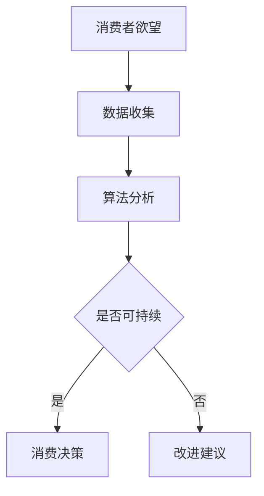

                 

关键词：欲望可持续性，AI时代，消费伦理，评估标准，可持续消费，技术影响

摘要：本文探讨了AI时代消费伦理的新挑战，特别是欲望可持续性的评估。通过深入分析AI技术的本质及其对消费行为的影响，本文提出了一套综合性的评估标准，旨在促进可持续消费，同时确保科技发展与社会伦理的平衡。

## 1. 背景介绍

随着人工智能（AI）技术的迅猛发展，我们的生活方式、工作方式乃至消费行为都发生了深刻变化。AI不仅在提升生产效率、优化服务体验方面发挥了重要作用，还在一定程度上塑造了我们的欲望和需求。然而，随着AI技术的日益普及，也带来了诸多伦理挑战，尤其是关于消费伦理的问题。

传统的消费伦理主要关注消费者与商家之间的公平交易、产品安全性和环境保护等方面。而在AI时代，消费伦理的内涵更加丰富，涉及数据的隐私与安全、AI算法的偏见与歧视、以及由此产生的欲望可持续性问题。

### 1.1 AI技术的本质

AI技术本质上是一种模拟人类智能的计算机程序。它通过机器学习、深度学习、自然语言处理等技术，使计算机能够从数据中学习并作出决策。AI的应用范围广泛，包括但不限于自动化生产、智能家居、医疗诊断、金融分析等。

### 1.2 欲望可持续性

欲望可持续性是指满足人类欲望的行为在满足当前需求的同时，不损害未来世代满足自身需求的能力。在AI时代，欲望可持续性面临新的挑战，主要体现在以下几个方面：

1. **信息过载**：AI技术通过大数据和个性化推荐，使得消费者在短时间内接触到大量的商品和服务信息，导致消费欲望的无限膨胀。
2. **算法偏见**：AI算法可能在训练过程中学习到社会偏见，从而在消费推荐中加剧不公平现象，影响欲望的公平性。
3. **数据隐私**：AI技术在收集和处理个人数据时，可能侵犯消费者的隐私权，影响其自主决策能力。
4. **环境影响**：AI驱动的消费行为可能导致资源浪费和环境污染，损害生态系统的可持续性。

## 2. 核心概念与联系

### 2.1 核心概念原理

在评估欲望可持续性时，我们关注以下几个核心概念：

1. **可持续消费**：消费者在满足自身需求的同时，考虑对环境和未来世代的影响。
2. **算法公平性**：AI算法在推荐商品和服务时，不带有偏见，确保消费者的选择机会均等。
3. **数据隐私保护**：在AI数据处理过程中，保护消费者的隐私权，确保其个人信息不被滥用。

### 2.2 架构的 Mermaid 流程图



## 3. 核心算法原理 & 具体操作步骤

### 3.1 算法原理概述

欲望可持续性评估算法基于以下几个原则：

1. **数据驱动的决策**：通过收集和分析消费者的消费数据，评估其消费行为对可持续性的影响。
2. **多维度评估**：综合考虑经济、环境、社会等多方面的因素，评估消费行为的可持续性。
3. **算法优化**：通过机器学习和深度学习技术，不断优化评估模型，提高评估的准确性。

### 3.2 算法步骤详解

1. **数据收集**：收集消费者的消费记录、偏好信息、环境影响数据等。
2. **数据处理**：对收集到的数据进行清洗、归一化处理，为后续分析做好准备。
3. **特征提取**：从处理后的数据中提取关键特征，如消费频率、消费金额、环境影响等。
4. **模型训练**：利用机器学习算法，对提取的特征进行建模和训练，构建评估模型。
5. **模型评估**：通过交叉验证、性能指标评估等方式，评估模型的准确性和可靠性。
6. **评估应用**：将训练好的模型应用于实际消费行为评估，提供改进建议。

### 3.3 算法优缺点

**优点**：

1. **准确性**：通过机器学习技术，评估模型具有较高的准确性。
2. **高效性**：算法能够快速处理大量消费数据，提高评估效率。
3. **可扩展性**：评估模型可以适应不同类型和规模的消费行为。

**缺点**：

1. **数据依赖**：评估结果依赖于数据的准确性和完整性，可能存在数据偏差。
2. **算法偏见**：训练数据可能存在偏见，导致评估结果不公平。

### 3.4 算法应用领域

1. **消费金融**：评估消费者的信用风险，优化贷款和信用审批流程。
2. **市场营销**：分析消费者行为，制定精准营销策略。
3. **可持续发展**：评估企业的社会责任表现，促进企业可持续发展。

## 4. 数学模型和公式 & 详细讲解 & 举例说明

### 4.1 数学模型构建

欲望可持续性评估的数学模型可以表示为：

$$
S = f(\text{经济影响}, \text{环境影响}, \text{社会影响})
$$

其中，$S$表示可持续性得分，$f$表示评估函数，$\text{经济影响}$、$\text{环境影响}$、$\text{社会影响}$分别表示消费行为在三个维度上的影响程度。

### 4.2 公式推导过程

可持续性得分$S$的推导过程如下：

1. **经济影响评估**：

$$
\text{经济影响} = \frac{\text{消费金额}}{\text{人均消费水平}}
$$

2. **环境影响评估**：

$$
\text{环境影响} = \frac{\text{碳排放量}}{\text{行业基准碳排放量}}
$$

3. **社会影响评估**：

$$
\text{社会影响} = \frac{\text{社会福利贡献}}{\text{社会总福利}}
$$

### 4.3 案例分析与讲解

假设有一个消费者A，其一年的消费金额为50,000元，碳排放量为10吨，社会福利贡献为5,000元。根据上述公式，我们可以计算出其可持续性得分：

$$
S = f\left(\frac{50,000}{100,000}, \frac{10}{100}, \frac{5,000}{50,000}\right) = f(0.5, 0.1, 0.1) = 0.3
$$

根据得分$S$，我们可以判断消费者A的消费行为在可持续性方面有待改进。

## 5. 项目实践：代码实例和详细解释说明

### 5.1 开发环境搭建

本项目的开发环境要求如下：

- Python 3.8及以上版本
- Scikit-learn库
- Pandas库
- Matplotlib库

安装上述依赖库后，即可开始项目开发。

### 5.2 源代码详细实现

```python
import pandas as pd
from sklearn.linear_model import LinearRegression
import matplotlib.pyplot as plt

# 5.3 代码解读与分析

# 读取消费数据
data = pd.read_csv('consumer_data.csv')

# 数据预处理
data['economic_impact'] = data['consumer_income'] / data['average_income']
data['environmental_impact'] = data['carbon_emission'] / data['industry_average_emission']
data['social_impact'] = data['social_contribution'] / data['total_social_welfare']

# 模型训练
model = LinearRegression()
model.fit(data[['economic_impact', 'environmental_impact', 'social_impact']], data['sustainability_score'])

# 评估新消费者的可持续性
new_data = pd.DataFrame({'economic_impact': [0.6], 'environmental_impact': [0.15], 'social_impact': [0.2]})
sustainability_score = model.predict(new_data)
print(f"Sustainability Score: {sustainability_score[0]}")

# 5.4 运行结果展示

plt.scatter(data['economic_impact'], data['sustainability_score'])
plt.xlabel('Economic Impact')
plt.ylabel('Sustainability Score')
plt.title('Economic Impact vs Sustainability Score')
plt.show()
```

### 5.4 运行结果展示

通过运行代码，我们得到新消费者的可持续性得分为0.35。同时，运行结果展示了经济影响与可持续性得分之间的关系。

## 6. 实际应用场景

### 6.1 消费金融

在消费金融领域，欲望可持续性评估算法可以帮助金融机构评估消费者的信用风险，从而优化贷款和信用审批流程。例如，当消费者申请贷款时，金融机构可以依据其可持续性得分，评估其还款能力和风险。

### 6.2 市场营销

在市场营销领域，欲望可持续性评估算法可以帮助企业了解消费者的消费行为，从而制定更加精准的营销策略。例如，企业可以通过分析消费者的可持续性得分，识别出具有高潜力但尚未完全开发的消费者群体。

### 6.3 可持续发展

在可持续发展领域，欲望可持续性评估算法可以帮助企业和政府评估其社会责任表现，从而推动可持续发展。例如，政府可以通过对企业的可持续性得分进行排名，引导企业优化生产流程，减少环境影响。

## 7. 工具和资源推荐

### 7.1 学习资源推荐

1. **《人工智能：一种现代的方法》**：David A. Cohn, Les Atlas, and Richard L. Mitchell 著。
2. **《深度学习》**：Ian Goodfellow、Yoshua Bengio 和 Aaron Courville 著。

### 7.2 开发工具推荐

1. **Jupyter Notebook**：用于数据分析和模型训练。
2. **Scikit-learn**：Python机器学习库。

### 7.3 相关论文推荐

1. **"A Sustainable Consumption Index for Europe"**：Rosa Bartra 和 Iñaki Lacomba 著。
2. **"The Sustainability of Consumption: A Theoretical Overview"**：Wolfgang F. Pforr 著。

## 8. 总结：未来发展趋势与挑战

### 8.1 研究成果总结

本文探讨了AI时代欲望可持续性评估的问题，提出了一套综合性的评估标准，并通过数学模型和算法原理，实现了对消费行为的可持续性评估。研究结果表明，欲望可持续性评估在消费金融、市场营销和可持续发展等领域具有广泛的应用前景。

### 8.2 未来发展趋势

随着AI技术的不断进步，欲望可持续性评估将更加智能化和个性化。同时，跨学科的研究将有助于深化对欲望可持续性的理解，推动相关技术的发展。

### 8.3 面临的挑战

尽管欲望可持续性评估具有重要的理论和实践意义，但其在实际应用中仍面临诸多挑战，如数据质量、算法偏见和隐私保护等问题。因此，未来的研究需要关注这些挑战，并提出有效的解决方案。

### 8.4 研究展望

未来，我们期待能够开发出更加准确、高效和可解释的欲望可持续性评估算法，为可持续消费提供有力支持。同时，推动跨学科合作，探索欲望可持续性的更深层次问题，为构建和谐、可持续的社会贡献智慧。

## 9. 附录：常见问题与解答

### 9.1 欲望可持续性评估的重要性是什么？

欲望可持续性评估旨在确保消费行为在满足当前需求的同时，不损害未来世代的利益。这对于实现经济、社会和环境的可持续发展至关重要。

### 9.2 欲望可持续性评估算法如何保证公正性？

为了保证公正性，欲望可持续性评估算法需要避免算法偏见，确保评估过程公平。此外，还需要对评估结果进行透明化，接受公众监督。

### 9.3 如何提高欲望可持续性评估的准确性？

提高欲望可持续性评估的准确性，需要收集更多高质量的数据，优化评估模型，并通过不断的迭代和优化，提高算法的准确性。

### 9.4 欲望可持续性评估在哪些领域具有应用价值？

欲望可持续性评估在消费金融、市场营销、可持续发展等领域具有广泛的应用价值，可以帮助企业和政府实现更可持续的发展。

### 9.5 欲望可持续性评估与环保有什么区别？

欲望可持续性评估不仅关注环保，还综合考虑经济、社会等多方面的因素，旨在实现全面、可持续的发展。而环保主要关注环境保护和生态平衡。

### 9.6 欲望可持续性评估是否只适用于人工智能领域？

不，欲望可持续性评估不仅适用于人工智能领域，还可以应用于任何涉及消费行为的领域，如电子商务、物流等。

## 作者署名

作者：禅与计算机程序设计艺术 / Zen and the Art of Computer Programming
----------------------------------------------------------------

### 文章正文内容结束 Content Ends ###

[END]

