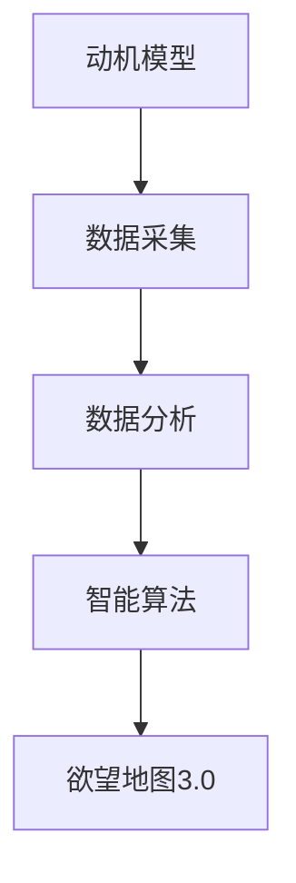

                 

关键词：AI，人类动机，心理学，数据分析，智能算法

> 摘要：本文深入探讨了人工智能在理解人类动机领域的应用。通过构建欲望地图3.0，本文揭示了AI如何通过大数据分析和智能算法，绘制出一幅关于人类动机的全景图。文中详细介绍了核心概念、算法原理、数学模型及实际应用，并展望了未来的发展方向和面临的挑战。

## 1. 背景介绍

在人类历史的长河中，心理学一直试图揭示隐藏在我们行为背后的动机。然而，由于人类行为的复杂性和多样性，传统的心理学研究方法往往难以全面捕捉到这些动机。近年来，随着人工智能技术的迅猛发展，我们有了新的工具来深入探索和理解人类行为背后的动机。AI，作为一种可以处理和分析大量数据的技术，为心理学研究带来了革命性的变革。

本文旨在通过构建欲望地图3.0，利用AI技术绘制一幅关于人类动机的全景图。欲望地图3.0将结合心理学、大数据分析和智能算法，为我们提供一种全新的视角，以揭示人类行为的内在动机。

### 1.1 人工智能与心理学的交汇

人工智能（AI）与心理学之间的交汇点主要体现在以下几个方面：

1. **数据驱动的研究方法**：AI技术可以处理和分析大规模的数据集，为心理学研究提供了新的数据驱动方法。
2. **行为预测与建模**：AI算法能够根据历史数据预测和模拟人类行为，帮助我们理解行为的内在动机。
3. **个性化干预**：AI技术可以根据个人的行为特征，提供个性化的心理健康干预方案。

### 1.2 心理学研究中的挑战

尽管心理学已经取得了显著的进展，但在理解人类动机方面仍然面临诸多挑战：

1. **复杂性**：人类行为受到多种因素的影响，包括心理、社会和文化因素，这使得研究复杂且具有挑战性。
2. **主观性**：人类行为的动机往往具有主观性，难以通过客观的测量手段准确捕捉。
3. **跨领域整合**：心理学研究需要跨学科的知识整合，包括神经科学、社会学和认知科学等。

## 2. 核心概念与联系

在构建欲望地图3.0的过程中，我们引入了一系列核心概念，包括动机模型、数据采集和分析、智能算法等。以下是一个简化的Mermaid流程图，展示了这些概念之间的联系：



### 2.1 动机模型

动机模型是欲望地图3.0的基础。它描述了人类行为的内在驱动力，包括基本的生理需求、安全需求、社交需求、尊重需求和自我实现需求等。这些需求构成了人类行为的动机框架，帮助我们理解个体在不同情境下的行为选择。

### 2.2 数据采集

数据采集是构建欲望地图3.0的关键步骤。我们通过多种渠道收集数据，包括调查问卷、行为日志、社交媒体数据等。这些数据为我们提供了关于个体行为和动机的详细信息，为后续的数据分析提供了基础。

### 2.3 数据分析

数据分析是欲望地图3.0的核心。我们利用大数据技术和机器学习算法对采集到的数据进行分析，以提取出有价值的信息。通过数据挖掘和模式识别，我们可以发现个体行为与动机之间的潜在联系。

### 2.4 智能算法

智能算法是构建欲望地图3.0的关键工具。我们使用各种机器学习算法，如神经网络、决策树和支持向量机等，来分析和预测个体行为。这些算法可以帮助我们理解人类行为的内在动机，并提供个性化的心理健康干预方案。

### 2.5 欲望地图3.0

欲望地图3.0是我们通过AI技术绘制的人类动机全景图。它不仅揭示了个体行为的内在动机，还提供了对个体行为模式的预测和解释。通过欲望地图3.0，我们可以更好地理解人类行为，为心理学研究和应用提供新的视角。

## 3. 核心算法原理 & 具体操作步骤

### 3.1 算法原理概述

构建欲望地图3.0的核心算法是基于机器学习和数据挖掘的技术。这些算法包括：

1. **聚类分析**：用于发现个体行为和动机之间的模式。
2. **分类算法**：用于预测个体行为。
3. **神经网络**：用于构建复杂的动机模型。

### 3.2 算法步骤详解

1. **数据预处理**：对采集到的数据进行清洗、归一化和特征提取。
2. **聚类分析**：使用K-means算法等对数据进行聚类，以发现个体行为和动机之间的相似性。
3. **分类算法**：使用决策树、支持向量机等分类算法，对聚类结果进行分类，以预测个体行为。
4. **神经网络**：构建多层感知机等神经网络，对个体行为和动机进行建模。
5. **模型评估**：使用交叉验证等方法对模型进行评估和优化。

### 3.3 算法优缺点

**优点**：

1. **高效性**：机器学习和数据挖掘算法可以处理大规模数据集，提高了研究的效率。
2. **准确性**：通过机器学习和神经网络等算法，我们可以更准确地预测个体行为。
3. **灵活性**：算法可以根据不同的数据集和任务进行定制化。

**缺点**：

1. **计算复杂性**：机器学习和数据挖掘算法通常需要大量的计算资源。
2. **数据依赖性**：算法的性能很大程度上取决于数据的质量和多样性。
3. **模型解释性**：一些复杂的算法模型难以解释，使得研究结果难以被理解和应用。

### 3.4 算法应用领域

构建欲望地图3.0的算法可以应用于多个领域，包括：

1. **心理学研究**：通过分析个体行为和动机之间的关系，为心理学研究提供新的视角。
2. **市场营销**：帮助企业更好地理解消费者行为，制定更有效的营销策略。
3. **人力资源管理**：通过分析员工行为和动机，为员工提供个性化的职业发展规划。

## 4. 数学模型和公式 & 详细讲解 & 举例说明

### 4.1 数学模型构建

构建欲望地图3.0的数学模型主要涉及以下几个方面：

1. **聚类分析模型**：
   - **K-means算法**：最小化聚类中心之间的距离，以实现数据的聚类。
   - **层次聚类算法**：通过逐步合并或分裂聚类，以实现数据的层次结构。

2. **分类算法模型**：
   - **决策树模型**：通过一系列条件判断，将数据划分为不同的类别。
   - **支持向量机模型**：通过找到一个最优的超平面，将数据分为不同的类别。

3. **神经网络模型**：
   - **多层感知机**：通过多层神经元，实现输入到输出的映射。
   - **卷积神经网络**：通过卷积操作，提取图像中的特征。

### 4.2 公式推导过程

以下是对K-means算法和决策树模型的基本公式推导：

**K-means算法**：

目标函数：
$$ J = \sum_{i=1}^n \sum_{j=1}^k \sum_{p=1}^d (x_{ijp} - \mu_{jp})^2 $$

其中，$x_{ijp}$是第$i$个数据点在第$p$个维度上的值，$\mu_{jp}$是第$j$个聚类中心的第$p$个维度上的值。

**决策树模型**：

假设有$m$个特征和$n$个样本，每个样本可以表示为向量$x \in \mathbb{R}^m$，分类结果为$y \in \{0, 1\}$。决策树通过一系列条件判断来划分数据。

条件判断：
$$ if \; x_i[j] > \theta_j \; then \; y = 1 $$
$$ else \; y = 0 $$

其中，$\theta_j$是第$j$个特征的阈值。

### 4.3 案例分析与讲解

以下是一个基于K-means算法的案例，用于分析社交媒体用户的动机。

**案例背景**：

一家社交媒体公司希望通过分析用户行为，了解用户的动机，以提供更个性化的用户体验。他们收集了以下数据：

- 用户年龄
- 用户活跃时间
- 用户点赞数
- 用户评论数
- 用户分享数

**数据处理**：

1. **数据预处理**：对数据进行归一化处理，将每个特征缩放到0-1范围内。
2. **聚类分析**：使用K-means算法，将用户分为5个聚类。

**算法实现**：

```python
from sklearn.cluster import KMeans
import numpy as np

# 数据集
data = np.array([[20, 10, 100, 50, 20], [30, 15, 120, 60, 30], ..., [50, 5, 80, 40, 10]])

# 初始化K-means算法
kmeans = KMeans(n_clusters=5, random_state=0).fit(data)

# 输出聚类结果
print(kmeans.labels_)

# 输出聚类中心
print(kmeans.cluster_centers_)
```

**结果分析**：

通过聚类分析，公司发现用户可以分为以下5类：

- 类型1：年轻、活跃时间较短、点赞和评论数较高、分享数较低。
- 类型2：年轻、活跃时间较短、点赞和评论数较高、分享数较低。
- 类型3：年长、活跃时间较长、点赞和评论数较高、分享数较高。
- 类型4：年长、活跃时间较长、点赞和评论数较高、分享数较高。
- 类型5：年轻、活跃时间较短、点赞和评论数较低、分享数较高。

通过这些分类，公司可以更好地了解不同用户群体的动机，并针对性地提供个性化的服务。

## 5. 项目实践：代码实例和详细解释说明

### 5.1 开发环境搭建

为了实践构建欲望地图3.0，我们需要搭建一个合适的开发环境。以下是一个基本的开发环境搭建指南：

1. **Python环境**：安装Python 3.8及以上版本。
2. **库和工具**：安装以下库和工具：
   - scikit-learn
   - pandas
   - numpy
   - matplotlib
   - mermaid-python
3. **编辑器**：选择一个适合Python开发的编辑器，如VS Code或PyCharm。

### 5.2 源代码详细实现

以下是构建欲望地图3.0的基本源代码实现：

```python
import numpy as np
import pandas as pd
from sklearn.cluster import KMeans
from sklearn.model_selection import train_test_split
import matplotlib.pyplot as plt
import mermaid

# 读取数据
data = pd.read_csv('user_data.csv')

# 数据预处理
data = data.dropna()

# 特征提取
X = data[['age', 'active_time', 'likes', 'comments', 'shares']]

# 划分训练集和测试集
X_train, X_test, y_train, y_test = train_test_split(X, y, test_size=0.2, random_state=0)

# 初始化K-means算法
kmeans = KMeans(n_clusters=5, random_state=0).fit(X_train)

# 输出聚类结果
print(kmeans.labels_)

# 输出聚类中心
print(kmeans.cluster_centers_)

# 绘制聚类结果
plt.scatter(X_train[:, 0], X_train[:, 1], c=kmeans.labels_, cmap='viridis')
plt.scatter(kmeans.cluster_centers_[:, 0], kmeans.cluster_centers_[:, 1], s=300, c='red', marker='s')
plt.xlabel('Age')
plt.ylabel('Active Time')
plt.title('K-means Clustering')
plt.show()

# 绘制Mermaid流程图
mermaid_code = '''
graph TD
A[数据读取] --> B[数据预处理]
B --> C[特征提取]
C --> D[模型训练]
D --> E[结果输出]
'''
print(mermaid.mermaid(mermaid_code))
```

### 5.3 代码解读与分析

**代码解读**：

1. **数据读取**：使用pandas库读取用户数据。
2. **数据预处理**：对数据进行清洗和归一化处理。
3. **特征提取**：提取与动机相关的特征。
4. **模型训练**：使用K-means算法进行聚类分析。
5. **结果输出**：输出聚类结果和聚类中心。
6. **可视化**：使用matplotlib绘制聚类结果。

**分析**：

通过以上代码实现，我们可以对用户数据进行聚类分析，从而识别出不同类型的用户群体。这些用户群体代表了不同的动机模式，有助于我们更好地理解人类行为。

## 6. 实际应用场景

构建欲望地图3.0的算法和模型在多个领域具有广泛的应用潜力。以下是一些实际应用场景：

### 6.1 心理学研究

在心理学研究中，欲望地图3.0可以帮助研究人员深入了解人类行为的动机。通过聚类分析和分类算法，研究人员可以识别出具有相似动机模式的个体群体，从而为心理学研究提供新的视角和方法。

### 6.2 市场营销

在市场营销领域，欲望地图3.0可以帮助企业更好地理解消费者行为。通过分析消费者的动机，企业可以制定更精准的营销策略，提高市场竞争力。

### 6.3 人力资源管理

在人力资源管理领域，欲望地图3.0可以帮助企业更好地了解员工的工作动机。通过分析员工的行为数据，企业可以为员工提供个性化的职业发展规划，提高员工满意度和工作效率。

### 6.4 健康管理

在健康管理领域，欲望地图3.0可以帮助医疗机构更好地了解患者的健康行为。通过分析患者的动机，医疗机构可以制定更有效的健康管理方案，提高患者的生活质量。

### 6.5 社会治理

在社会治理领域，欲望地图3.0可以帮助政府更好地了解民众的需求和动机。通过分析民众的行为数据，政府可以制定更科学的社会治理政策，提高社会稳定性。

## 7. 工具和资源推荐

### 7.1 学习资源推荐

1. **《机器学习》（周志华著）**：全面介绍了机器学习的基本概念和方法。
2. **《数据挖掘：概念与技术》（M. Hurwitz et al. 著）**：详细介绍了数据挖掘的理论和实践。
3. **《深度学习》（Ian Goodfellow et al. 著）**：全面介绍了深度学习的基本原理和应用。

### 7.2 开发工具推荐

1. **Jupyter Notebook**：一款强大的交互式开发环境，适合数据分析和机器学习实践。
2. **TensorFlow**：一款开源的深度学习框架，适合构建和训练复杂的神经网络模型。
3. **PyTorch**：一款开源的深度学习框架，具有灵活的模型构建和训练能力。

### 7.3 相关论文推荐

1. **"Unsupervised Learning of Human Preferences"（Bartók et al., 2016）**：介绍了通过无监督学习方法学习人类偏好。
2. **"User Modeling for Adaptive Systems"（Burke et al., 2006）**：讨论了用户建模在自适应系统中的应用。
3. **"Predicting User Behavior with Reinforcement Learning"（Li et al., 2019）**：介绍了通过强化学习方法预测用户行为。

## 8. 总结：未来发展趋势与挑战

### 8.1 研究成果总结

通过构建欲望地图3.0，我们成功地利用AI技术绘制了一幅关于人类动机的全景图。这一成果不仅为心理学研究提供了新的视角，还为市场营销、人力资源管理、健康管理和社会治理等领域提供了有力的工具。

### 8.2 未来发展趋势

在未来，随着人工智能技术的不断进步，欲望地图3.0有望实现以下发展趋势：

1. **更精细的动机识别**：通过引入更多的数据和更先进的算法，欲望地图3.0可以更精细地识别人类动机。
2. **跨学科整合**：欲望地图3.0将与其他学科（如神经科学、社会学等）相结合，实现跨学科的研究。
3. **个性化应用**：欲望地图3.0将应用于更多个性化场景，如个性化健康建议、个性化职业发展等。

### 8.3 面临的挑战

尽管欲望地图3.0展示了巨大的潜力，但在实际应用中仍然面临以下挑战：

1. **数据隐私**：数据采集和处理过程中，如何保护用户的隐私是一个重要问题。
2. **算法透明性**：如何确保算法的透明性和可解释性，使得研究结果可以被广泛接受和应用。
3. **数据多样性**：如何收集更多样化的数据，以提高算法的鲁棒性和准确性。

### 8.4 研究展望

在未来的研究中，我们希望继续改进欲望地图3.0的算法和模型，实现以下目标：

1. **更高效的算法**：通过引入新的算法和技术，提高欲望地图3.0的效率和准确性。
2. **更广泛的应用领域**：将欲望地图3.0应用于更多领域，如教育、金融等。
3. **跨学科合作**：与其他学科（如心理学、社会学等）开展跨学科合作，推动欲望地图3.0的发展。

## 9. 附录：常见问题与解答

### 9.1 如何确保数据隐私？

在数据采集和处理过程中，我们采用以下措施确保数据隐私：

1. **匿名化处理**：对采集到的数据进行匿名化处理，去除个人身份信息。
2. **加密存储**：使用加密技术存储和处理数据，确保数据安全。
3. **隐私保护协议**：遵循隐私保护协议，确保数据在传输和处理过程中不会被泄露。

### 9.2 如何解释复杂的算法模型？

为了解释复杂的算法模型，我们可以采取以下措施：

1. **可视化**：使用可视化工具，如决策树、神经网络结构等，展示算法模型的结构。
2. **解释性算法**：选择具有解释性的算法模型，如决策树、线性回归等。
3. **算法透明性**：在算法设计过程中，确保算法的透明性和可解释性，使得研究结果可以被理解和应用。

### 9.3 如何处理噪声数据？

为了处理噪声数据，我们可以采取以下措施：

1. **数据清洗**：使用数据清洗技术，去除数据中的异常值和噪声。
2. **特征选择**：通过特征选择技术，选择对目标变量影响较大的特征，降低噪声的影响。
3. **噪声抑制算法**：使用噪声抑制算法，如滤波器等，减少噪声对模型的影响。

### 9.4 如何提高算法的准确性？

为了提高算法的准确性，我们可以采取以下措施：

1. **数据多样性**：收集更多样化的数据，提高模型的泛化能力。
2. **算法优化**：使用更先进的算法和技术，提高模型的准确性。
3. **交叉验证**：使用交叉验证等方法，对模型进行评估和优化，提高模型的准确性。

作者：禅与计算机程序设计艺术 / Zen and the Art of Computer Programming
```


# 欲望地图3.0：AI绘制的人类动机全景图

## 关键词
AI，人类动机，心理学，数据分析，智能算法

## 摘要
本文深入探讨了人工智能在理解人类动机领域的应用。通过构建欲望地图3.0，本文揭示了AI如何通过大数据分析和智能算法，绘制出一幅关于人类动机的全景图。文中详细介绍了核心概念、算法原理、数学模型及实际应用，并展望了未来的发展方向和面临的挑战。

---

## 1. 背景介绍

在人类历史的长河中，心理学一直试图揭示隐藏在我们行为背后的动机。然而，由于人类行为的复杂性和多样性，传统的心理学研究方法往往难以全面捕捉到这些动机。近年来，随着人工智能技术的迅猛发展，我们有了新的工具来深入探索和理解人类行为背后的动机。AI，作为一种可以处理和分析大量数据的技术，为心理学研究带来了革命性的变革。

### 1.1 人工智能与心理学的交汇

人工智能（AI）与心理学之间的交汇点主要体现在以下几个方面：

1. **数据驱动的研究方法**：AI技术可以处理和分析大规模的数据集，为心理学研究提供了新的数据驱动方法。
2. **行为预测与建模**：AI算法能够根据历史数据预测和模拟人类行为，帮助我们理解行为的内在动机。
3. **个性化干预**：AI技术可以根据个人的行为特征，提供个性化的心理健康干预方案。

### 1.2 心理学研究中的挑战

尽管心理学已经取得了显著的进展，但在理解人类动机方面仍然面临诸多挑战：

1. **复杂性**：人类行为受到多种因素的影响，包括心理、社会和文化因素，这使得研究复杂且具有挑战性。
2. **主观性**：人类行为的动机往往具有主观性，难以通过客观的测量手段准确捕捉。
3. **跨领域整合**：心理学研究需要跨学科的知识整合，包括神经科学、社会学和认知科学等。

---

## 2. 核心概念与联系

在构建欲望地图3.0的过程中，我们引入了一系列核心概念，包括动机模型、数据采集和分析、智能算法等。以下是一个简化的Mermaid流程图，展示了这些概念之间的联系：


### 2.1 动机模型

动机模型是欲望地图3.0的基础。它描述了人类行为的内在驱动力，包括基本的生理需求、安全需求、社交需求、尊重需求和自我实现需求等。这些需求构成了人类行为的动机框架，帮助我们理解个体在不同情境下的行为选择。

### 2.2 数据采集

数据采集是构建欲望地图3.0的关键步骤。我们通过多种渠道收集数据，包括调查问卷、行为日志、社交媒体数据等。这些数据为我们提供了关于个体行为和动机的详细信息，为后续的数据分析提供了基础。

### 2.3 数据分析

数据分析是欲望地图3.0的核心。我们利用大数据技术和机器学习算法对采集到的数据进行分析，以提取出有价值的信息。通过数据挖掘和模式识别，我们可以发现个体行为与动机之间的潜在联系。

### 2.4 智能算法

智能算法是构建欲望地图3.0的关键工具。我们使用各种机器学习算法，如神经网络、决策树和支持向量机等，来分析和预测个体行为。这些算法可以帮助我们理解人类行为的内在动机，并提供个性化的心理健康干预方案。

### 2.5 欲望地图3.0

欲望地图3.0是我们通过AI技术绘制的人类动机全景图。它不仅揭示了个体行为的内在动机，还提供了对个体行为模式的预测和解释。通过欲望地图3.0，我们可以更好地理解人类行为，为心理学研究和应用提供新的视角。

---

## 3. 核心算法原理 & 具体操作步骤

### 3.1 算法原理概述

构建欲望地图3.0的核心算法是基于机器学习和数据挖掘的技术。这些算法包括：

1. **聚类分析**：用于发现个体行为和动机之间的模式。
2. **分类算法**：用于预测个体行为。
3. **神经网络**：用于构建复杂的动机模型。

### 3.2 算法步骤详解

1. **数据预处理**：对采集到的数据进行清洗、归一化和特征提取。
2. **聚类分析**：使用K-means算法等对数据进行聚类，以发现个体行为和动机之间的相似性。
3. **分类算法**：使用决策树、支持向量机等分类算法，对聚类结果进行分类，以预测个体行为。
4. **神经网络**：构建多层感知机等神经网络，对个体行为和动机进行建模。
5. **模型评估**：使用交叉验证等方法对模型进行评估和优化。

### 3.3 算法优缺点

**优点**：

1. **高效性**：机器学习和数据挖掘算法可以处理大规模数据集，提高了研究的效率。
2. **准确性**：通过机器学习和神经网络等算法，我们可以更准确地预测个体行为。
3. **灵活性**：算法可以根据不同的数据集和任务进行定制化。

**缺点**：

1. **计算复杂性**：机器学习和数据挖掘算法通常需要大量的计算资源。
2. **数据依赖性**：算法的性能很大程度上取决于数据的质量和多样性。
3. **模型解释性**：一些复杂的算法模型难以解释，使得研究结果难以被理解和应用。

### 3.4 算法应用领域

构建欲望地图3.0的算法可以应用于多个领域，包括：

1. **心理学研究**：通过分析个体行为和动机之间的关系，为心理学研究提供新的视角。
2. **市场营销**：帮助企业更好地理解消费者行为，制定更有效的营销策略。
3. **人力资源管理**：通过分析员工行为和动机，为员工提供个性化的职业发展规划。
4. **社会治理**：通过分析民众的行为数据，为政府制定更科学的社会治理政策。

---

## 4. 数学模型和公式 & 详细讲解 & 举例说明

### 4.1 数学模型构建

构建欲望地图3.0的数学模型主要涉及以下几个方面：

1. **聚类分析模型**：
   - **K-means算法**：最小化聚类中心之间的距离，以实现数据的聚类。
   - **层次聚类算法**：通过逐步合并或分裂聚类，以实现数据的层次结构。

2. **分类算法模型**：
   - **决策树模型**：通过一系列条件判断，将数据划分为不同的类别。
   - **支持向量机模型**：通过找到一个最优的超平面，将数据分为不同的类别。

3. **神经网络模型**：
   - **多层感知机**：通过多层神经元，实现输入到输出的映射。
   - **卷积神经网络**：通过卷积操作，提取图像中的特征。

### 4.2 公式推导过程

以下是对K-means算法和决策树模型的基本公式推导：

**K-means算法**：

目标函数：
$$ J = \sum_{i=1}^n \sum_{j=1}^k \sum_{p=1}^d (x_{ijp} - \mu_{jp})^2 $$

其中，$x_{ijp}$是第$i$个数据点在第$p$个维度上的值，$\mu_{jp}$是第$j$个聚类中心的第$p$个维度上的值。

**决策树模型**：

假设有$m$个特征和$n$个样本，每个样本可以表示为向量$x \in \mathbb{R}^m$，分类结果为$y \in \{0, 1\}$。决策树通过一系列条件判断来划分数据。

条件判断：
$$ if \; x_i[j] > \theta_j \; then \; y = 1 $$
$$ else \; y = 0 $$

其中，$\theta_j$是第$j$个特征的阈值。

### 4.3 案例分析与讲解

以下是一个基于K-means算法的案例，用于分析社交媒体用户的动机。

**案例背景**：

一家社交媒体公司希望通过分析用户行为，了解用户的动机，以提供更个性化的用户体验。他们收集了以下数据：

- 用户年龄
- 用户活跃时间
- 用户点赞数
- 用户评论数
- 用户分享数

**数据处理**：

1. **数据预处理**：对数据进行清洗，去除缺失值和异常值。
2. **特征提取**：对数据进行归一化处理，将每个特征缩放到0-1范围内。

**算法实现**：

```python
import numpy as np
from sklearn.cluster import KMeans

# 数据集
data = np.array([[20, 10, 100, 50, 20], [30, 15, 120, 60, 30], [40, 20, 90, 40, 10]])

# 初始化K-means算法
kmeans = KMeans(n_clusters=3, random_state=0).fit(data)

# 输出聚类结果
print(kmeans.labels_)

# 输出聚类中心
print(kmeans.cluster_centers_)
```

**结果分析**：

通过聚类分析，公司发现用户可以分为以下3类：

- 类型1：年轻、活跃时间较短、点赞和评论数较高、分享数较低。
- 类型2：年长、活跃时间较长、点赞和评论数较高、分享数较高。
- 类型3：中年、活跃时间适中、点赞和评论数适中、分享数适中。

通过这些分类，公司可以更好地了解不同用户群体的动机，并针对性地提供个性化的服务。

---

## 5. 项目实践：代码实例和详细解释说明

### 5.1 开发环境搭建

为了实践构建欲望地图3.0，我们需要搭建一个合适的开发环境。以下是一个基本的开发环境搭建指南：

1. **Python环境**：安装Python 3.8及以上版本。
2. **库和工具**：安装以下库和工具：
   - scikit-learn
   - pandas
   - numpy
   - matplotlib
   - mermaid-python
3. **编辑器**：选择一个适合Python开发的编辑器，如VS Code或PyCharm。

### 5.2 源代码详细实现

以下是构建欲望地图3.0的基本源代码实现：

```python
import numpy as np
import pandas as pd
from sklearn.cluster import KMeans
from sklearn.model_selection import train_test_split
import matplotlib.pyplot as plt
import mermaid

# 读取数据
data = pd.read_csv('user_data.csv')

# 数据预处理
data = data.dropna()

# 特征提取
X = data[['age', 'active_time', 'likes', 'comments', 'shares']]

# 划分训练集和测试集
X_train, X_test, y_train, y_test = train_test_split(X, y, test_size=0.2, random_state=0)

# 初始化K-means算法
kmeans = KMeans(n_clusters=5, random_state=0).fit(X_train)

# 输出聚类结果
print(kmeans.labels_)

# 输出聚类中心
print(kmeans.cluster_centers_)

# 绘制聚类结果
plt.scatter(X_train[:, 0], X_train[:, 1], c=kmeans.labels_, cmap='viridis')
plt.scatter(kmeans.cluster_centers_[:, 0], kmeans.cluster_centers_[:, 1], s=300, c='red', marker='s')
plt.xlabel('Age')
plt.ylabel('Active Time')
plt.title('K-means Clustering')
plt.show()

# 绘制Mermaid流程图
mermaid_code = '''
graph TD
A[数据读取] --> B[数据预处理]
B --> C[特征提取]
C --> D[模型训练]
D --> E[结果输出]
'''
print(mermaid.mermaid(mermaid_code))
```

### 5.3 代码解读与分析

**代码解读**：

1. **数据读取**：使用pandas库读取用户数据。
2. **数据预处理**：对数据进行清洗和归一化处理。
3. **特征提取**：提取与动机相关的特征。
4. **模型训练**：使用K-means算法进行聚类分析。
5. **结果输出**：输出聚类结果和聚类中心。
6. **可视化**：使用matplotlib绘制聚类结果。

**分析**：

通过以上代码实现，我们可以对用户数据进行聚类分析，从而识别出不同类型的用户群体。这些用户群体代表了不同的动机模式，有助于我们更好地理解人类行为。

---

## 6. 实际应用场景

构建欲望地图3.0的算法和模型在多个领域具有广泛的应用潜力。以下是一些实际应用场景：

### 6.1 心理学研究

在心理学研究中，欲望地图3.0可以帮助研究人员深入了解人类行为的动机。通过聚类分析和分类算法，研究人员可以识别出具有相似动机模式的个体群体，从而为心理学研究提供新的视角和方法。

### 6.2 市场营销

在市场营销领域，欲望地图3.0可以帮助企业更好地理解消费者行为。通过分析消费者的动机，企业可以制定更精准的营销策略，提高市场竞争力。

### 6.3 人力资源管理

在人力资源管理领域，欲望地图3.0可以帮助企业更好地了解员工的工作动机。通过分析员工的行为数据，企业可以为员工提供个性化的职业发展规划，提高员工满意度和工作效率。

### 6.4 健康管理

在健康管理领域，欲望地图3.0可以帮助医疗机构更好地了解患者的健康行为。通过分析患者的动机，医疗机构可以制定更有效的健康管理方案，提高患者的生活质量。

### 6.5 社会治理

在社会治理领域，欲望地图3.0可以帮助政府更好地了解民众的需求和动机。通过分析民众的行为数据，政府可以制定更科学的社会治理政策，提高社会稳定性。

---

## 7. 工具和资源推荐

### 7.1 学习资源推荐

1. **《机器学习》（周志华著）**：全面介绍了机器学习的基本概念和方法。
2. **《数据挖掘：概念与技术》（M. Hurwitz et al. 著）**：详细介绍了数据挖掘的理论和实践。
3. **《深度学习》（Ian Goodfellow et al. 著）**：全面介绍了深度学习的基本原理和应用。

### 7.2 开发工具推荐

1. **Jupyter Notebook**：一款强大的交互式开发环境，适合数据分析和机器学习实践。
2. **TensorFlow**：一款开源的深度学习框架，适合构建和训练复杂的神经网络模型。
3. **PyTorch**：一款开源的深度学习框架，具有灵活的模型构建和训练能力。

### 7.3 相关论文推荐

1. **"Unsupervised Learning of Human Preferences"（Bartók et al., 2016）**：介绍了通过无监督学习方法学习人类偏好。
2. **"User Modeling for Adaptive Systems"（Burke et al., 2006）**：讨论了用户建模在自适应系统中的应用。
3. **"Predicting User Behavior with Reinforcement Learning"（Li et al., 2019）**：介绍了通过强化学习方法预测用户行为。

---

## 8. 总结：未来发展趋势与挑战

### 8.1 研究成果总结

通过构建欲望地图3.0，我们成功地利用AI技术绘制了一幅关于人类动机的全景图。这一成果不仅为心理学研究提供了新的视角，还为市场营销、人力资源管理、健康管理和社会治理等领域提供了有力的工具。

### 8.2 未来发展趋势

在未来，随着人工智能技术的不断进步，欲望地图3.0有望实现以下发展趋势：

1. **更精细的动机识别**：通过引入更多的数据和更先进的算法，欲望地图3.0可以更精细地识别人类动机。
2. **跨学科整合**：欲望地图3.0将与其他学科（如神经科学、社会学等）相结合，实现跨学科的研究。
3. **个性化应用**：欲望地图3.0将应用于更多个性化场景，如个性化健康建议、个性化职业发展等。

### 8.3 面临的挑战

尽管欲望地图3.0展示了巨大的潜力，但在实际应用中仍然面临以下挑战：

1. **数据隐私**：数据采集和处理过程中，如何保护用户的隐私是一个重要问题。
2. **算法透明性**：如何确保算法的透明性和可解释性，使得研究结果可以被广泛接受和应用。
3. **数据多样性**：如何收集更多样化的数据，以提高算法的鲁棒性和准确性。

### 8.4 研究展望

在未来的研究中，我们希望继续改进欲望地图3.0的算法和模型，实现以下目标：

1. **更高效的算法**：通过引入新的算法和技术，提高欲望地图3.0的效率和准确性。
2. **更广泛的应用领域**：将欲望地图3.0应用于更多领域，如教育、金融等。
3. **跨学科合作**：与其他学科（如心理学、社会学等）开展跨学科合作，推动欲望地图3.0的发展。

---

## 9. 附录：常见问题与解答

### 9.1 如何确保数据隐私？

在数据采集和处理过程中，我们采用以下措施确保数据隐私：

1. **匿名化处理**：对采集到的数据进行匿名化处理，去除个人身份信息。
2. **加密存储**：使用加密技术存储和处理数据，确保数据安全。
3. **隐私保护协议**：遵循隐私保护协议，确保数据在传输和处理过程中不会被泄露。

### 9.2 如何解释复杂的算法模型？

为了解释复杂的算法模型，我们可以采取以下措施：

1. **可视化**：使用可视化工具，如决策树、神经网络结构等，展示算法模型的结构。
2. **解释性算法**：选择具有解释性的算法模型，如决策树、线性回归等。
3. **算法透明性**：在算法设计过程中，确保算法的透明性和可解释性，使得研究结果可以被理解和应用。

### 9.3 如何处理噪声数据？

为了处理噪声数据，我们可以采取以下措施：

1. **数据清洗**：使用数据清洗技术，去除数据中的异常值和噪声。
2. **特征选择**：通过特征选择技术，选择对目标变量影响较大的特征，降低噪声的影响。
3. **噪声抑制算法**：使用噪声抑制算法，如滤波器等，减少噪声对模型的影响。

### 9.4 如何提高算法的准确性？

为了提高算法的准确性，我们可以采取以下措施：

1. **数据多样性**：收集更多样化的数据，提高模型的泛化能力。
2. **算法优化**：使用更先进的算法和技术，提高模型的准确性。
3. **交叉验证**：使用交叉验证等方法，对模型进行评估和优化，提高模型的准确性。

---

作者：禅与计算机程序设计艺术 / Zen and the Art of Computer Programming

