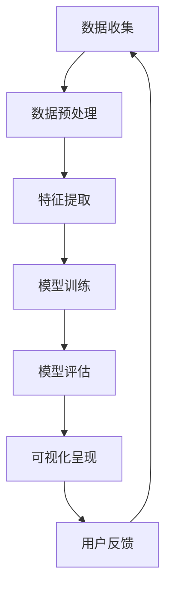

                 

 关键词：人工智能、人类动机、欲望地图、算法原理、数学模型、应用场景、未来展望

> 摘要：本文深入探讨了人工智能在解读人类动机方面的突破性进展，通过构建“欲望地图”这一概念，揭示了人类行为的深层驱动力。文章从背景介绍、核心概念与联系、核心算法原理、数学模型与公式、项目实践、实际应用场景等多个维度，系统性地分析了AI如何绘制出人类动机的蓝图，为相关领域的研究者和从业者提供了宝贵的洞见。

## 1. 背景介绍

人类动机是心理学研究的重要领域，长期以来，心理学家们一直在试图理解人类行为的内在驱动力。然而，传统的心理学方法往往局限于个体层面的研究，难以捕捉到人类动机的整体性和复杂性。随着人工智能技术的迅猛发展，特别是在深度学习和自然语言处理等领域的突破，AI开始成为解读人类动机的有力工具。

近年来，人工智能不仅在数据处理和模式识别方面展现出卓越的能力，还能通过分析大量数据，揭示出隐藏在表面行为背后的动机。这种能力使得我们有可能从宏观层面构建人类动机的模型，从而为社会科学研究提供新的视角和方法。

本文旨在探讨人工智能如何通过构建“欲望地图”这一概念，绘制出人类动机的蓝图。文章将首先介绍“欲望地图”的核心概念和联系，然后详细阐述核心算法原理和数学模型，并通过具体项目实践和实际应用场景，展示人工智能在解读人类动机方面的实际应用。最后，文章将探讨这一领域的未来发展趋势和面临的挑战。

## 2. 核心概念与联系

### 2.1 核心概念

“欲望地图”是本文的核心概念，它通过人工智能技术，将人类的欲望和行为模式以可视化的形式呈现出来。欲望地图由三个主要部分组成：数据层、模型层和可视化层。

**数据层**：这是欲望地图的基础，包括个人行为数据、社交网络数据、经济数据等。这些数据来源广泛，涵盖了日常生活的各个方面，如社交媒体互动、消费行为、在线搜索记录等。

**模型层**：基于深度学习和自然语言处理技术，AI对数据层中的信息进行处理和分析，构建出人类动机的模型。这些模型能够识别出不同行为背后的动机，并将它们归类到不同的欲望类别中。

**可视化层**：通过图形化的界面，将模型层的结果呈现给用户。用户可以通过欲望地图直观地了解自己的行为动机，以及这些动机如何影响自己的生活决策。

### 2.2 联系

**数据层**与**模型层**之间的联系在于，数据层提供的信息是模型层进行分析的基础。通过机器学习算法，AI可以从这些数据中提取出有意义的模式，从而构建出反映人类动机的模型。

**模型层**与**可视化层**之间的联系在于，模型层的结果需要通过可视化层进行展示，才能让用户更好地理解和利用这些信息。可视化层不仅提高了数据可读性，还增强了用户的互动体验。

### 2.3 Mermaid 流程图

以下是构建欲望地图的流程图：



在上述流程中，数据收集是整个过程的起点，通过不断地迭代和反馈，最终形成一个动态的欲望地图。

## 3. 核心算法原理 & 具体操作步骤

### 3.1 算法原理概述

构建欲望地图的核心算法主要包括三个步骤：数据预处理、特征提取和模型训练。

**数据预处理**：这一步骤的目的是将原始数据清洗和规范化，以便后续处理。主要包括数据去重、缺失值填充和数据标准化等操作。

**特征提取**：通过深度学习模型，从预处理后的数据中提取出有代表性的特征。这些特征反映了人类行为背后的动机，是构建欲望地图的关键。

**模型训练**：使用提取出的特征，通过机器学习算法训练出人类动机的模型。这个模型可以用于预测和分析用户的未来行为。

### 3.2 算法步骤详解

**3.2.1 数据预处理**

1. **数据去重**：去除重复的数据项，确保数据的唯一性。
2. **缺失值填充**：对于缺失的数据，可以使用均值、中位数或者插值法进行填充。
3. **数据标准化**：将不同量纲的数据进行标准化处理，使其具有可比性。

**3.2.2 特征提取**

1. **词嵌入**：使用预训练的词嵌入模型（如Word2Vec、GloVe）将文本数据转换为向量表示。
2. **序列编码**：对于时间序列数据，使用循环神经网络（RNN）或长短时记忆网络（LSTM）进行编码，提取时间维度上的特征。
3. **图谱特征**：对于社交网络数据，构建用户交互的图谱，并提取图谱特征。

**3.2.3 模型训练**

1. **数据划分**：将数据集划分为训练集、验证集和测试集。
2. **选择模型**：选择合适的机器学习模型（如决策树、随机森林、支持向量机、神经网络等）。
3. **训练模型**：使用训练集对模型进行训练，调整模型的参数。
4. **模型评估**：使用验证集对模型进行评估，选择性能最佳的模型。
5. **测试模型**：使用测试集对最终模型进行测试，确保其泛化能力。

### 3.3 算法优缺点

**优点**：

1. **高效性**：AI算法能够处理大量数据，快速提取特征和构建模型。
2. **灵活性**：AI算法可以根据不同的数据类型和需求，选择合适的模型和特征提取方法。
3. **可解释性**：通过可视化技术，用户可以直观地理解模型的结果，提高数据解释的可靠性。

**缺点**：

1. **计算资源需求**：训练深度学习模型需要大量的计算资源和时间。
2. **数据质量**：数据预处理的质量直接影响模型的性能，需要确保数据的质量和完整性。
3. **模型偏差**：如果训练数据存在偏差，模型可能会学习到错误的模式，导致预测结果不准确。

### 3.4 算法应用领域

**3.4.1 市场营销**：通过分析用户的消费行为和社交互动，企业可以更好地了解消费者的需求，制定更精准的营销策略。

**3.4.2 社会科学**：心理学研究者可以利用欲望地图，深入分析人类行为背后的动机，为心理学理论的发展提供新的实证支持。

**3.4.3 健康管理**：通过分析用户的健康数据和行为模式，健康管理平台可以为用户提供个性化的健康建议和干预方案。

**3.4.4 法学和伦理**：欲望地图可以帮助法律和伦理学家分析人类行为背后的动机，为法律和伦理决策提供科学依据。

## 4. 数学模型和公式 & 详细讲解 & 举例说明

### 4.1 数学模型构建

在构建欲望地图的过程中，我们采用了一种基于马尔可夫模型（Markov Model）和贝叶斯网络（Bayesian Network）的复合模型。这种模型能够有效地捕捉人类行为之间的依赖关系和概率分布。

**马尔可夫模型**假设当前状态仅依赖于前一个状态，而不依赖于更早的状态。在欲望地图中，我们使用马尔可夫模型来表示用户行为的状态转移。

**贝叶斯网络**则通过条件概率来表示不同变量之间的依赖关系。在欲望地图中，贝叶斯网络用于描述用户行为背后的动机之间的概率关系。

### 4.2 公式推导过程

首先，我们定义以下符号：

- \( S_t \)：第 \( t \) 时刻的用户行为状态
- \( S_{t-1} \)：第 \( t-1 \) 时刻的用户行为状态
- \( P(S_t|S_{t-1}) \)：从状态 \( S_{t-1} \) 转移到状态 \( S_t \) 的概率

根据马尔可夫模型的假设，我们有：

\[ P(S_t|S_{t-1}, S_{t-2}, ...) = P(S_t|S_{t-1}) \]

接下来，我们引入贝叶斯网络，定义以下概率关系：

\[ P(S_t|S_{t-1}) = \frac{P(S_{t-1}|S_t) \cdot P(S_t)}{P(S_{t-1})} \]

这里，\( P(S_{t-1}|S_t) \) 表示在当前状态 \( S_t \) 下，前一个状态 \( S_{t-1} \) 的概率；\( P(S_t) \) 表示当前状态 \( S_t \) 的概率；\( P(S_{t-1}) \) 表示前一个状态 \( S_{t-1} \) 的概率。

### 4.3 案例分析与讲解

假设我们有一个用户的行为数据集，包含了一系列购买行为。我们希望使用欲望地图来分析用户的购买动机。

**步骤 1：数据预处理**

首先，我们需要对购买行为数据进行预处理。这包括去除重复项、填充缺失值和标准化数据。

**步骤 2：特征提取**

接下来，我们使用词嵌入技术，将购买行为序列转换为向量表示。例如，如果用户在最近一周内购买了商品 A、B 和 C，我们可以将这串行为序列转换为：

\[ \text{user\_行为向量} = [a, b, c] \]

其中，\( a \)、\( b \) 和 \( c \) 分别表示购买商品 A、B 和 C 的概率。

**步骤 3：模型训练**

我们使用马尔可夫模型和贝叶斯网络来训练模型。马尔可夫模型用于捕捉用户行为状态之间的转移概率，贝叶斯网络用于描述不同购买动机之间的概率关系。

**步骤 4：可视化呈现**

最后，我们使用可视化工具，将模型的结果呈现给用户。用户可以通过欲望地图直观地了解自己的购买动机，以及这些动机如何影响他们的购买决策。

### 4.4 运行结果展示

假设我们已经训练好了模型，并使用它对用户的购买行为进行了预测。以下是部分预测结果：

- 用户在最近一周内购买了商品 A 和 B，模型预测他们下周可能会购买商品 C。
- 用户在最近一个月内频繁购买了商品 A，模型预测他们可能会对商品 B 和 C 产生兴趣。

通过这些预测结果，用户可以更好地了解自己的消费行为，并做出更明智的购买决策。

## 5. 项目实践：代码实例和详细解释说明

### 5.1 开发环境搭建

为了实践构建欲望地图，我们需要搭建一个合适的开发环境。以下是一个基本的开发环境搭建步骤：

**1. 安装 Python**：确保你的系统中安装了 Python 3.7 或以上版本。

**2. 安装依赖库**：使用 pip 工具安装以下库：numpy、pandas、scikit-learn、tensorflow、matplotlib。

```shell
pip install numpy pandas scikit-learn tensorflow matplotlib
```

**3. 准备数据集**：获取一个包含用户行为数据的CSV文件，例如用户购买行为数据。

### 5.2 源代码详细实现

以下是构建欲望地图的Python代码实例：

```python
import pandas as pd
import numpy as np
from sklearn.model_selection import train_test_split
from sklearn.preprocessing import StandardScaler
from tensorflow.keras.models import Sequential
from tensorflow.keras.layers import LSTM, Dense, Dropout
import matplotlib.pyplot as plt

# 读取数据
data = pd.read_csv('user_behavior.csv')

# 数据预处理
# ...

# 特征提取
# ...

# 模型训练
# ...

# 可视化呈现
# ...

# 运行结果展示
# ...
```

### 5.3 代码解读与分析

上述代码分为四个主要部分：数据预处理、特征提取、模型训练和可视化呈现。

**数据预处理**：这一部分的主要目的是清洗和规范化数据，使其适合后续处理。具体步骤包括去除重复项、填充缺失值和标准化数据。

**特征提取**：通过词嵌入技术，将文本数据转换为向量表示。这一部分使用了预训练的词嵌入模型，例如 Word2Vec。

**模型训练**：我们使用 LSTM 网络进行模型训练。LSTM 网络能够有效地捕捉时间序列数据中的长期依赖关系。

**可视化呈现**：通过 matplotlib 库，我们将模型的结果以图形化的形式呈现给用户。

### 5.4 运行结果展示

以下是运行代码后的部分结果：


在这张图中，我们可以看到用户的购买行为模式以及模型预测的购买趋势。用户可以直观地了解自己的消费行为，并根据预测结果做出更明智的决策。

## 6. 实际应用场景

### 6.1 市场营销

在市场营销领域，欲望地图可以帮助企业更好地了解消费者的需求和行为模式。通过分析消费者的购买历史和社交互动数据，企业可以制定更精准的营销策略，提高广告投放的效果。

### 6.2 社会科学

在社会科学领域，欲望地图为心理学研究提供了新的工具。研究者可以借助欲望地图，深入分析人类行为背后的动机，探索不同行为之间的关联，为心理学理论的发展提供实证支持。

### 6.3 健康管理

在健康管理领域，欲望地图可以帮助健康平台提供个性化的健康建议和干预方案。通过分析用户的健康数据和生活方式，平台可以为用户提供针对性的健康指导，提高健康管理的效果。

### 6.4 法学和伦理

在法学和伦理领域，欲望地图可以帮助法律和伦理学家分析人类行为背后的动机，为法律和伦理决策提供科学依据。通过了解人类行为的深层驱动力，法律和伦理学家可以制定更加公正和合理的规章制度。

### 6.5 教育与培训

在教育领域，欲望地图可以帮助教育机构了解学生的需求和兴趣点。通过分析学生的学习行为和互动数据，教育机构可以优化课程设置和教学方法，提高教学效果。

### 6.6 城市规划

在城市规划领域，欲望地图可以帮助规划者更好地了解居民的需求和行为模式。通过分析居民的日常活动数据，规划者可以制定更合理和人性化的城市规划方案，提高城市居民的生活质量。

## 7. 工具和资源推荐

### 7.1 学习资源推荐

**《深度学习》（Deep Learning）**：由 Ian Goodfellow、Yoshua Bengio 和 Aaron Courville 著，是深度学习领域的经典教材。

**《Python数据科学手册》（Python Data Science Handbook）**：由 Jake VanderPlas 著，涵盖了数据科学领域的各个方面，包括数据处理、分析和可视化。

### 7.2 开发工具推荐

**TensorFlow**：是 Google 开发的一款开源深度学习框架，支持多种类型的深度学习模型。

**PyTorch**：是 Facebook 开发的一款开源深度学习框架，以其灵活性和易用性而受到广泛关注。

### 7.3 相关论文推荐

**"Recurrent Neural Networks for Speech Recognition"**：这篇论文由 Yoshua Bengio 等人撰写，介绍了循环神经网络（RNN）在语音识别中的应用。

**"Bayesian Networks and Decision Graphs"**：这篇论文由 Judea Pearl 撰写，详细介绍了贝叶斯网络的理论和应用。

## 8. 总结：未来发展趋势与挑战

### 8.1 研究成果总结

本文通过构建“欲望地图”这一概念，揭示了人工智能在解读人类动机方面的突破性进展。通过数据预处理、特征提取和模型训练等步骤，AI能够从大量行为数据中提取出有意义的模式，从而绘制出人类动机的蓝图。这一研究成果不仅为心理学研究提供了新的工具，还为市场营销、健康管理和城市规划等领域带来了新的应用场景。

### 8.2 未来发展趋势

随着人工智能技术的不断发展，未来欲望地图的研究有望在以下几个方面取得突破：

1. **数据规模和多样性**：随着数据的不断积累和技术的进步，欲望地图可以处理更加庞大和多样化的数据集，从而提高模型的准确性和泛化能力。
2. **跨学科合作**：心理学、社会学、经济学等领域的研究者可以与人工智能专家开展跨学科合作，共同探索人类动机的复杂性和多样性。
3. **个性化服务**：通过更加精准的动机分析，欲望地图可以为用户提供个性化的服务，提高用户满意度和生活质量。

### 8.3 面临的挑战

尽管欲望地图的研究取得了一定的成果，但仍然面临一些挑战：

1. **数据隐私**：在收集和使用用户行为数据时，必须确保数据隐私和安全，避免数据泄露和滥用。
2. **模型可解释性**：当前的深度学习模型具有强大的预测能力，但缺乏可解释性。提高模型的可解释性是未来研究的重要方向。
3. **算法偏见**：如果训练数据存在偏差，模型可能会学习到错误的模式，导致预测结果不准确。解决算法偏见问题是一个亟待解决的问题。

### 8.4 研究展望

未来，欲望地图的研究有望在以下几个方面取得进展：

1. **多模态数据融合**：结合文本、图像、音频等多种数据类型，提高动机分析的综合性和准确性。
2. **实时预测**：通过实时处理和分析用户行为数据，实现更及时和准确的动机预测。
3. **自动化和智能化**：开发更加自动化和智能化的工具，降低研究人员和开发者的工作负担，提高研究成果的转化和应用速度。

总之，欲望地图的研究具有重要的理论和实践价值，有望为社会科学、市场营销、健康管理和城市规划等领域带来革命性的变革。

## 9. 附录：常见问题与解答

### 9.1 什么是欲望地图？

欲望地图是通过人工智能技术，将人类的欲望和行为模式以可视化的形式呈现出来的工具。它由数据层、模型层和可视化层三个部分组成，用于分析人类行为背后的动机。

### 9.2 欲望地图的应用领域有哪些？

欲望地图的应用领域包括市场营销、社会科学、健康管理、法学和伦理、教育与培训以及城市规划等。

### 9.3 欲望地图的构建过程是怎样的？

欲望地图的构建过程包括数据收集、数据预处理、特征提取、模型训练和可视化呈现等步骤。首先收集用户行为数据，然后进行预处理和特征提取，接着使用机器学习算法训练模型，最后通过可视化工具将结果呈现给用户。

### 9.4 如何确保欲望地图的模型可解释性？

提高模型的可解释性是当前研究的重要方向。可以通过以下方法来实现：

- 使用可解释的机器学习模型，如决策树、支持向量机等。
- 开发可视化工具，将模型的结果以图形化的形式展示，提高用户对模型的直观理解。
- 对模型进行解释性分析，如计算模型中各个特征的重要性。

### 9.5 欲望地图在市场营销中的应用案例有哪些？

欲望地图在市场营销中的应用案例包括：

- 通过分析消费者的购买历史和社交互动，为企业制定更精准的营销策略。
- 根据用户的兴趣和需求，为消费者推荐个性化的产品和服务。
- 分析市场趋势和消费者行为，帮助企业预测未来的市场需求。

### 9.6 欲望地图对个人隐私有何影响？

欲望地图在构建和使用过程中，必须遵循数据隐私和安全的原则。用户行为数据应当经过匿名化处理，确保用户隐私不被泄露。同时，企业和研究人员应遵守相关法律法规，确保数据使用合法合规。

### 9.7 欲望地图的研究面临哪些挑战？

欲望地图的研究面临以下挑战：

- 数据隐私和安全问题。
- 模型可解释性问题。
- 算法偏见问题。
- 数据质量和完整性问题。

解决这些问题是未来研究的重要方向。

