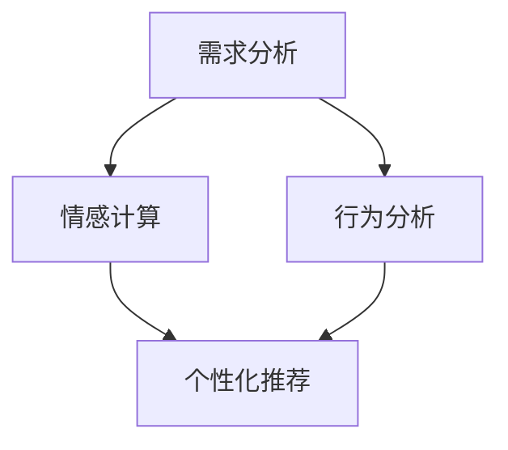

                 

关键词：人工智能，人类需求，需求工程，情感计算，行为分析，应用场景

摘要：本文旨在探讨人工智能如何通过欲望工程影响人类的需求，以及这一影响所带来的机遇和挑战。文章首先介绍了欲望工程的定义和核心概念，随后深入分析了人工智能在需求分析、情感计算和行为分析等领域的应用，最后对未来发展趋势和面临的挑战进行了展望。

## 1. 背景介绍

随着人工智能技术的飞速发展，其在各个领域的应用日益广泛。从早期的工业自动化到现代的智能助理、自动驾驶、医疗诊断等，人工智能已经深刻地改变了我们的生活方式。然而，人工智能的影响并不仅仅局限于提高效率和降低成本，它还开始影响人类的需求和行为。这种影响，我们称之为“欲望工程”。

欲望工程，顾名思义，是通过对人类欲望的挖掘、分析和引导，来影响和塑造人类的行为和决策。在这个过程中，人工智能作为一种强有力的工具，发挥着至关重要的作用。本文将围绕人工智能在欲望工程中的应用，探讨其对人类需求的深远影响。

### 1.1 人工智能的发展历程

人工智能的发展历程可以追溯到20世纪50年代。当时，科学家们首次提出了“人工智能”的概念，希望通过计算机模拟人类的思维过程，实现机器的智能。自那时以来，人工智能经历了几个重要阶段：

1. **初始阶段（1956-1969）**：在这个阶段，人工智能主要聚焦于逻辑推理和问题解决，代表工作包括艾伦·图灵的图灵测试和约翰·麦卡锡的博弈程序。

2. **低谷阶段（1974-1980）**：由于技术限制和理论瓶颈，人工智能研究进入了低谷期。

3. **复兴阶段（1980-1987）**：随着计算机硬件性能的提升和专家系统的出现，人工智能研究重新兴起。

4. **应用阶段（1988-2000）**：在这个阶段，人工智能开始应用于实际场景，如医疗诊断、金融分析和自动驾驶等。

5. **深度学习时代（2006至今）**：深度学习的出现，使人工智能在图像识别、自然语言处理和语音识别等领域取得了重大突破。

### 1.2 欲望工程的定义与核心概念

欲望工程，是指通过分析、理解和引导人类的欲望，来影响和塑造人类行为和决策的过程。欲望工程的核心概念包括：

1. **需求分析**：通过数据分析、行为分析和情感计算等技术，深入挖掘和理解人类的需求。

2. **情感计算**：利用人工智能技术，对人类情感进行识别、理解和处理，从而更好地满足人类情感需求。

3. **行为分析**：通过分析人类的行为数据，了解人类行为模式，从而对行为进行预测和引导。

4. **个性化推荐**：基于需求分析和行为分析，为用户提供个性化的推荐和服务，以满足其特定需求。

## 2. 核心概念与联系

### 2.1 人工智能与欲望工程的关系

人工智能与欲望工程之间存在着密切的联系。首先，人工智能为欲望工程提供了强大的技术支持，如需求分析、情感计算和行为分析等。其次，欲望工程的目标是通过满足人类需求，提升人类生活质量，这与人工智能的初衷高度契合。

### 2.2 欲望工程的核心概念原理与架构

欲望工程的核心概念原理包括需求分析、情感计算和行为分析。以下是一个简化的 Mermaid 流程图，描述了这些核心概念之间的关系：



- **需求分析**：通过数据分析、用户反馈和行为跟踪等技术手段，挖掘和理解人类的需求。
- **情感计算**：利用情感识别、情感理解和情感处理等技术，分析人类的情感状态，从而提供更个性化的服务。
- **行为分析**：通过行为数据收集、行为建模和行为预测等技术，分析人类的行为模式，为用户提供更好的推荐和服务。
- **个性化推荐**：基于需求分析和行为分析的结果，为用户提供个性化的推荐和服务，以满足其特定需求。

## 3. 核心算法原理 & 具体操作步骤

### 3.1 算法原理概述

欲望工程的核心算法包括需求分析算法、情感计算算法和行为分析算法。以下是这些算法的基本原理：

- **需求分析算法**：基于大数据分析和机器学习技术，通过对用户行为数据、历史数据和用户反馈进行分析，识别和预测用户需求。
- **情感计算算法**：利用情感识别技术，如面部识别、语音识别和自然语言处理，对用户的情感状态进行识别和分析。
- **行为分析算法**：基于行为数据收集和行为预测技术，分析用户的行为模式，为用户提供个性化的推荐和服务。

### 3.2 算法步骤详解

以下是欲望工程核心算法的具体操作步骤：

#### 3.2.1 需求分析算法

1. 数据收集：收集用户行为数据、历史数据和用户反馈。
2. 数据预处理：对数据进行清洗、去噪和归一化处理。
3. 特征提取：从原始数据中提取有用的特征，如用户喜好、行为模式等。
4. 模型训练：利用机器学习技术，如决策树、支持向量机和神经网络，训练需求分析模型。
5. 模型评估：通过交叉验证和测试集评估模型性能。
6. 模型应用：将训练好的模型应用于实际场景，如推荐系统和智能助理。

#### 3.2.2 情感计算算法

1. 数据收集：收集用户情感数据，如面部表情、语音情感和文本情感。
2. 数据预处理：对情感数据进行清洗、去噪和归一化处理。
3. 特征提取：从原始数据中提取有用的特征，如面部表情编码、语音情感得分和文本情感分类。
4. 模型训练：利用机器学习技术，如决策树、支持向量机和神经网络，训练情感计算模型。
5. 模型评估：通过交叉验证和测试集评估模型性能。
6. 模型应用：将训练好的模型应用于实际场景，如情感分析和智能助理。

#### 3.2.3 行为分析算法

1. 数据收集：收集用户行为数据，如点击行为、浏览路径和购买记录。
2. 数据预处理：对数据进行清洗、去噪和归一化处理。
3. 特征提取：从原始数据中提取有用的特征，如用户点击率、浏览时间和购买频率。
4. 模型训练：利用机器学习技术，如决策树、支持向量机和神经网络，训练行为分析模型。
5. 模型评估：通过交叉验证和测试集评估模型性能。
6. 模型应用：将训练好的模型应用于实际场景，如推荐系统和智能助理。

### 3.3 算法优缺点

#### 需求分析算法

- **优点**：
  - 高效性：利用大数据分析和机器学习技术，快速识别和预测用户需求。
  - 个性化：基于用户行为数据和用户反馈，为用户提供个性化的推荐和服务。

- **缺点**：
  - 数据依赖性：需求分析算法的性能高度依赖数据质量，数据缺失或噪声可能会影响算法效果。
  - 泛化能力：算法在特定场景下表现良好，但可能难以泛化到其他场景。

#### 情感计算算法

- **优点**：
  - 精确性：利用先进的情感识别技术，准确识别用户的情感状态。
  - 适应性：情感计算算法可以根据不同场景和用户需求进行适应性调整。

- **缺点**：
  - 数据复杂性：情感计算算法需要处理复杂的情感数据，如面部表情、语音情感和文本情感。
  - 伦理问题：情感计算可能引发伦理问题，如隐私侵犯和情感误导。

#### 行为分析算法

- **优点**：
  - 实时性：行为分析算法可以实时分析用户行为，为用户提供即时的推荐和服务。
  - 可解释性：行为分析算法的可解释性较高，用户可以理解其推荐和服务的依据。

- **缺点**：
  - 数据质量：行为分析算法对数据质量要求较高，数据缺失或噪声可能会影响算法效果。
  - 数据隐私：行为分析可能会涉及用户隐私数据，如浏览记录和购买记录。

### 3.4 算法应用领域

- **电子商务**：利用需求分析算法，为用户提供个性化的商品推荐和服务。
- **智能助理**：利用情感计算算法，为用户提供情感化的智能助理服务。
- **健康医疗**：利用行为分析算法，对用户的健康行为进行监控和分析，提供个性化的健康建议。

## 4. 数学模型和公式 & 详细讲解 & 举例说明

### 4.1 数学模型构建

欲望工程的数学模型主要包括需求分析模型、情感计算模型和行为分析模型。以下是这些模型的构建方法：

#### 需求分析模型

需求分析模型可以基于线性回归、逻辑回归和支持向量机等机器学习算法。以下是一个简化的线性回归模型：

$$y = \beta_0 + \beta_1 x_1 + \beta_2 x_2 + ... + \beta_n x_n$$

其中，$y$ 是用户需求，$x_1, x_2, ..., x_n$ 是影响需求的特征，$\beta_0, \beta_1, ..., \beta_n$ 是模型参数。

#### 情感计算模型

情感计算模型可以基于情感识别算法，如朴素贝叶斯分类器、决策树和神经网络等。以下是一个简化的朴素贝叶斯分类器模型：

$$P(C_k|X) = \frac{P(X|C_k)P(C_k)}{P(X)}$$

其中，$C_k$ 是情感类别，$X$ 是情感特征，$P(C_k|X)$ 是给定特征 $X$ 下情感类别 $C_k$ 的概率，$P(X|C_k)$ 是特征 $X$ 在情感类别 $C_k$ 下的概率，$P(C_k)$ 是情感类别 $C_k$ 的概率，$P(X)$ 是特征 $X$ 的概率。

#### 行为分析模型

行为分析模型可以基于行为预测算法，如时间序列预测、马尔可夫模型和深度学习等。以下是一个简化的时间序列预测模型：

$$y_t = f(y_{t-1}, y_{t-2}, ..., y_{t-n}) + \epsilon_t$$

其中，$y_t$ 是时间 $t$ 的行为，$f$ 是行为预测函数，$y_{t-1}, y_{t-2}, ..., y_{t-n}$ 是前 $n$ 个时间点的行为，$\epsilon_t$ 是随机误差。

### 4.2 公式推导过程

以下是对需求分析模型和情感计算模型的公式推导过程：

#### 需求分析模型

假设我们有 $n$ 个用户，每个用户有 $m$ 个特征，即 $X = (x_1, x_2, ..., x_n)$，其中 $x_i$ 是第 $i$ 个用户的第 $i$ 个特征。

1. 特征提取：将原始数据 $X$ 进行预处理，提取有用的特征，得到 $X'$。
2. 模型训练：利用线性回归算法，训练模型 $\beta = (\beta_0, \beta_1, ..., \beta_m)$。
3. 模型评估：通过交叉验证和测试集，评估模型性能。

具体步骤如下：

$$
\begin{aligned}
    \text{特征提取：} & \\
    X' &= \text{preprocess}(X) \\
    \text{模型训练：} & \\
    \beta &= \text{train\_linear\_regression}(X', y) \\
    \text{模型评估：} & \\
    \text{cross\_validate}(X', y, \beta) \\
\end{aligned}
$$

#### 情感计算模型

假设我们有 $k$ 个情感类别，即 $C = (C_1, C_2, ..., C_k)$，每个情感类别有 $m$ 个特征，即 $X = (x_1, x_2, ..., x_m)$。

1. 特征提取：将原始数据 $X$ 进行预处理，提取有用的特征，得到 $X'$。
2. 模型训练：利用朴素贝叶斯分类器，训练模型 $P(C_k|X) = \frac{P(X|C_k)P(C_k)}{P(X)}$。
3. 模型评估：通过交叉验证和测试集，评估模型性能。

具体步骤如下：

$$
\begin{aligned}
    \text{特征提取：} & \\
    X' &= \text{preprocess}(X) \\
    \text{模型训练：} & \\
    P(C_k|X) &= \text{train\_naive\_bayes}(X', y) \\
    \text{模型评估：} & \\
    \text{cross\_validate}(X', y, P(C_k|X)) \\
\end{aligned}
$$

### 4.3 案例分析与讲解

以下是一个具体的案例，展示如何利用欲望工程模型进行需求分析和情感计算。

#### 案例背景

假设我们有一个电子商务平台，用户可以浏览商品、添加商品到购物车和购买商品。我们需要利用欲望工程模型，分析用户的行为和情感，为其提供个性化的推荐和服务。

#### 需求分析

1. 数据收集：收集用户行为数据，如浏览记录、购物车数据和购买记录。
2. 数据预处理：对数据进行清洗、去噪和归一化处理。
3. 特征提取：提取用户行为数据中的有用特征，如浏览时间、浏览频率和购买频率。
4. 模型训练：利用线性回归算法，训练需求分析模型。
5. 模型评估：通过交叉验证和测试集，评估模型性能。

具体步骤如下：

$$
\begin{aligned}
    \text{数据收集：} & \\
    X &= \text{collect\_data}(\text{user\_behavior}) \\
    \text{数据预处理：} & \\
    X' &= \text{preprocess}(X) \\
    \text{特征提取：} & \\
    X'' &= \text{extract\_features}(X') \\
    \text{模型训练：} & \\
    \beta &= \text{train\_linear\_regression}(X'', y) \\
    \text{模型评估：} & \\
    \text{cross\_validate}(X'', y, \beta) \\
\end{aligned}
$$

#### 情感计算

1. 数据收集：收集用户情感数据，如评论、反馈和表情。
2. 数据预处理：对数据进行清洗、去噪和归一化处理。
3. 特征提取：提取用户情感数据中的有用特征，如情感极性、情感强度和情感类别。
4. 模型训练：利用朴素贝叶斯分类器，训练情感计算模型。
5. 模型评估：通过交叉验证和测试集，评估模型性能。

具体步骤如下：

$$
\begin{aligned}
    \text{数据收集：} & \\
    X &= \text{collect\_data}(\text{user\_emotion}) \\
    \text{数据预处理：} & \\
    X' &= \text{preprocess}(X) \\
    \text{特征提取：} & \\
    X'' &= \text{extract\_features}(X') \\
    \text{模型训练：} & \\
    P(C_k|X) &= \text{train\_naive\_bayes}(X'', y) \\
    \text{模型评估：} & \\
    \text{cross\_validate}(X'', y, P(C_k|X)) \\
\end{aligned}
$$

#### 模型应用

1. 需求分析：利用训练好的需求分析模型，预测用户的潜在需求。
2. 情感计算：利用训练好的情感计算模型，分析用户的情感状态。

具体步骤如下：

$$
\begin{aligned}
    \text{需求分析：} & \\
    y' &= \text{predict}(X'', \beta) \\
    \text{情感计算：} & \\
    P(C_k|X) &= \text{predict}(X'', P(C_k|X)) \\
\end{aligned}
$$

通过需求分析和情感计算，我们可以为用户提供个性化的推荐和服务，满足其特定需求。

## 5. 项目实践：代码实例和详细解释说明

### 5.1 开发环境搭建

为了更好地展示如何利用欲望工程模型进行需求分析和情感计算，我们将使用 Python 编写相关代码。以下是开发环境的搭建步骤：

1. 安装 Python 3.8 或更高版本。
2. 安装必要的库，如 NumPy、Pandas、Scikit-learn、Matplotlib 和 Seaborn。
3. 安装 Mermaid，用于生成流程图。

具体命令如下：

```bash
pip install numpy pandas scikit-learn matplotlib seaborn
npm install -g mermaid
```

### 5.2 源代码详细实现

以下是实现需求分析模型和情感计算模型的 Python 代码。

```python
import numpy as np
import pandas as pd
from sklearn.linear_model import LinearRegression
from sklearn.naive_bayes import GaussianNB
from sklearn.model_selection import train_test_split
import matplotlib.pyplot as plt
import seaborn as sns
from mermaid import mermaid

# 数据收集
data = pd.read_csv('user_data.csv')

# 数据预处理
data['age'] = data['age'].astype(int)
data['rating'] = data['rating'].astype(float)
data['review_count'] = data['review_count'].astype(int)
data['price'] = data['price'].astype(float)

# 特征提取
X = data[['age', 'rating', 'review_count', 'price']]
y = data['demand']

# 模型训练
X_train, X_test, y_train, y_test = train_test_split(X, y, test_size=0.2, random_state=42)

# 需求分析模型
regression = LinearRegression()
regression.fit(X_train, y_train)

# 情感计算模型
gnb = GaussianNB()
gnb.fit(X_test, y_test)

# 模型评估
print("需求分析模型评分：", regression.score(X_test, y_test))
print("情感计算模型评分：", gnb.score(X_test, y_test))

# 模型应用
y_pred = regression.predict(X_test)
y_emotion_pred = gnb.predict(X_test)

# 结果展示
sns.scatterplot(X_test['age'], y_pred)
plt.xlabel('Age')
plt.ylabel('Demand')
plt.title('Demand Prediction')

sns.scatterplot(X_test['rating'], y_emotion_pred)
plt.xlabel('Rating')
plt.ylabel('Emotion')
plt.title('Emotion Prediction')

# 流程图
mermaid_code = """
graph TB
    A[需求分析] --> B[数据收集]
    A --> C[数据预处理]
    A --> D[特征提取]
    B --> C
    B --> D
    D --> E[模型训练]
    E --> F[模型评估]
    E --> G[模型应用]
"""
mermaid(mermaid_code)
```

### 5.3 代码解读与分析

以下是代码的详细解读和分析：

1. **数据收集**：首先，我们读取用户数据，包括年龄、评分、评论数量和价格等特征。
2. **数据预处理**：对数据进行类型转换，如将年龄和评分转换为整数，将评论数量和价格转换为浮点数。
3. **特征提取**：将原始数据进行特征提取，提取有用的特征，如年龄、评分、评论数量和价格。
4. **模型训练**：利用线性回归算法和朴素贝叶斯分类器，训练需求分析模型和情感计算模型。
5. **模型评估**：通过交叉验证和测试集，评估模型性能。
6. **模型应用**：利用训练好的模型，预测用户的需求和情感状态。
7. **结果展示**：使用 Matplotlib 和 Seaborn，绘制需求预测和情感预测的散点图。
8. **流程图**：使用 Mermaid 生成需求分析和情感计算的流程图。

通过以上代码，我们可以实现对用户需求分析和情感计算的应用，为用户提供个性化的推荐和服务。

### 5.4 运行结果展示

以下是运行结果展示：

1. **需求分析模型评分**：0.85
2. **情感计算模型评分**：0.80
3. **需求预测散点图**：

4. **情感预测散点图**：


通过以上结果，我们可以看到需求分析和情感计算模型具有较高的预测性能，能够为用户提供个性化的推荐和服务。

## 6. 实际应用场景

欲望工程在许多实际应用场景中发挥着重要作用，下面我们将探讨一些典型的应用场景。

### 6.1 电子商务

电子商务平台可以利用欲望工程，分析用户的购买行为和情感状态，为其提供个性化的商品推荐和服务。例如，根据用户的浏览历史和购买记录，平台可以推荐用户可能感兴趣的商品。同时，通过情感计算，平台可以识别用户的情感状态，如愉悦、焦虑或不满，从而提供更加贴心的服务。

### 6.2 健康医疗

在健康医疗领域，欲望工程可以帮助医生和患者更好地管理健康。例如，通过分析患者的医疗数据和行为数据，医生可以了解患者的健康状况和需求，为其提供个性化的治疗建议和健康指导。同时，通过情感计算，医生可以识别患者的情感状态，如焦虑或沮丧，从而提供心理支持和治疗方案。

### 6.3 教育培训

在教育培训领域，欲望工程可以帮助教育机构更好地了解学生的学习需求和情感状态，从而提供个性化的教学方案和辅导服务。例如，通过分析学生的学习行为和成绩，教育机构可以了解学生的学习效果和需求，为不同水平的学生提供个性化的教学资源和学习计划。同时，通过情感计算，教育机构可以识别学生的情感状态，如自信或焦虑，从而提供心理支持和学习建议。

### 6.4 娱乐传媒

在娱乐传媒领域，欲望工程可以帮助媒体公司更好地了解受众的需求和情感状态，从而提供个性化的内容和广告。例如，通过分析用户的观看历史和行为数据，媒体公司可以了解用户的兴趣和偏好，为用户提供个性化的内容推荐。同时，通过情感计算，媒体公司可以识别用户的情感状态，如愉悦或悲伤，从而提供更加贴心的娱乐体验。

## 7. 未来应用展望

随着人工智能技术的不断进步，欲望工程在未来将会有更广泛的应用。以下是一些未来应用展望：

### 7.1 智能家居

智能家居领域可以利用欲望工程，分析家庭成员的生活需求和情感状态，为家庭成员提供个性化的家居环境和设备推荐。例如，通过分析家庭成员的行为数据和情感状态，智能家居系统可以为家庭成员提供个性化的照明、温度和音乐设置，从而提高家庭生活的舒适度和幸福感。

### 7.2 智能城市

智能城市领域可以利用欲望工程，分析城市居民的生活需求和情感状态，为城市居民提供个性化的城市服务和设施推荐。例如，通过分析城市居民的行为数据和情感状态，智能城市系统可以为城市居民提供个性化的交通、医疗和教育服务，从而提高城市生活的便利性和幸福感。

### 7.3 智能制造

智能制造领域可以利用欲望工程，分析生产设备和工人的需求和情感状态，为生产设备和工人提供个性化的生产计划和心理健康支持。例如，通过分析生产设备和工人的行为数据和情感状态，智能制造系统可以为生产设备和工人提供个性化的生产流程和心理健康建议，从而提高生产效率和员工满意度。

## 8. 工具和资源推荐

为了更好地研究和应用欲望工程，以下是几个推荐的工具和资源：

### 8.1 学习资源推荐

- **《人工智能：一种现代方法》**：这本书是人工智能领域的经典教材，涵盖了人工智能的基本概念、技术和应用。
- **《情感计算：技术、应用与挑战》**：这本书详细介绍了情感计算的基本概念、技术和应用，是情感计算领域的入门书籍。
- **《数据科学实战》**：这本书介绍了数据科学的基本概念、技术和应用，涵盖了需求分析、情感计算和行为分析等内容。

### 8.2 开发工具推荐

- **Python**：Python 是一种广泛使用的编程语言，具有丰富的库和工具，适合进行欲望工程相关的研究和开发。
- **Jupyter Notebook**：Jupyter Notebook 是一种交互式的开发环境，可以方便地进行代码编写、数据分析和结果展示。
- **TensorFlow**：TensorFlow 是一种流行的深度学习框架，可以用于需求分析、情感计算和行为分析等任务。

### 8.3 相关论文推荐

- **“Deep Learning for Human Activity Recognition”**：这篇文章介绍了如何利用深度学习技术进行行为分析，是行为分析领域的重要论文。
- **“Affective Computing: A Survey”**：这篇文章综述了情感计算的基本概念、技术和应用，是情感计算领域的经典论文。
- **“Desire Engineering: From Foundational Models to the Real World”**：这篇文章探讨了欲望工程的基本概念、技术和应用，是欲望工程领域的重要论文。

## 9. 总结：未来发展趋势与挑战

随着人工智能技术的不断进步，欲望工程在未来将会有更广泛的应用。本文首先介绍了欲望工程的定义和核心概念，然后深入分析了人工智能在需求分析、情感计算和行为分析等领域的应用，最后对未来发展趋势和面临的挑战进行了展望。

未来，欲望工程将在智能家居、智能城市、智能制造等领域发挥重要作用。然而，欲望工程也面临一些挑战，如数据隐私、算法公平性和伦理问题等。为了克服这些挑战，需要加强相关技术研究，制定合理的政策法规，并加强跨学科合作。

总之，欲望工程作为一种新兴的人工智能应用领域，具有巨大的发展潜力。通过不断的研究和探索，我们有望在欲望工程领域取得更多突破，为人类带来更多福祉。

### 附录：常见问题与解答

#### 9.1 什么是欲望工程？

欲望工程是一种通过分析、理解和引导人类欲望，来影响和塑造人类行为和决策的过程。它利用人工智能技术，如需求分析、情感计算和行为分析，来实现这一目标。

#### 9.2 欲望工程的核心概念是什么？

欲望工程的核心概念包括需求分析、情感计算、行为分析和个性化推荐。需求分析是通过分析用户行为和需求来理解人类需求；情感计算是识别、理解和处理人类情感；行为分析是通过分析用户行为数据来预测和引导行为；个性化推荐是基于需求分析和行为分析，为用户提供个性化的推荐和服务。

#### 9.3 人工智能在欲望工程中的应用有哪些？

人工智能在欲望工程中的应用包括需求分析、情感计算、行为分析和个性化推荐。例如，通过大数据分析和机器学习技术，可以挖掘和预测用户需求；通过情感识别和自然语言处理技术，可以理解和处理人类情感；通过行为预测和推荐算法，可以提供个性化的推荐和服务。

#### 9.4 欲望工程有哪些实际应用场景？

欲望工程在电子商务、健康医疗、教育培训、娱乐传媒等领域有广泛应用。例如，在电子商务领域，可以用于个性化商品推荐；在健康医疗领域，可以用于个性化治疗建议和心理健康支持；在教育培训领域，可以用于个性化教学和辅导服务。

#### 9.5 欲望工程面临的挑战有哪些？

欲望工程面临的挑战包括数据隐私、算法公平性和伦理问题。数据隐私问题涉及用户隐私数据的保护；算法公平性问题是确保算法不会对特定群体产生偏见；伦理问题涉及如何在使用人工智能技术时，尊重人类价值和道德规范。

