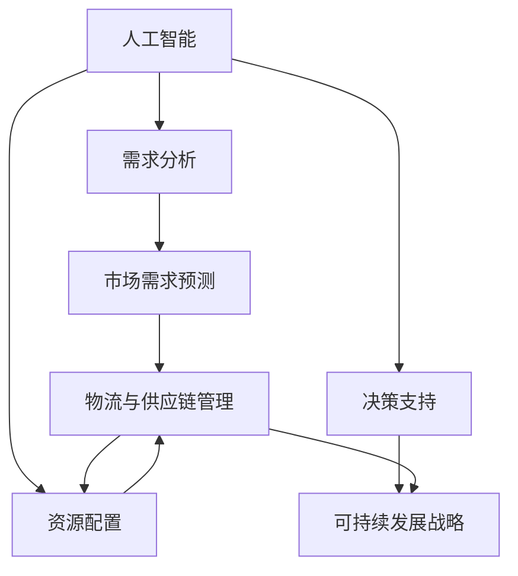

                 

关键词：AI优化，需求满足，循环经济，经济设计师，需求规划，智能经济

> 摘要：本文旨在探讨如何在现代经济体系中，利用人工智能技术优化需求满足的过程，构建一个可持续的欲望循环经济模型。本文将介绍AI在需求分析、资源配置、决策支持等方面的应用，并通过实例分析，展示如何通过AI技术实现经济效率的提升和社会福利的增进。

## 1. 背景介绍

在全球化经济不断发展的背景下，传统经济模型面临着诸多挑战，如资源浪费、环境污染、供需失衡等问题。为了解决这些问题，经济学家和决策者开始寻求新的经济模式，其中循环经济成为了一个备受关注的方向。循环经济强调资源的循环利用，减少废弃物的产生，追求经济、社会和环境的可持续发展。

与此同时，人工智能（AI）技术的飞速发展为循环经济的实现提供了新的可能性。AI在数据采集、分析、预测和决策等方面具有显著优势，可以大幅提升经济活动的效率。例如，AI可以帮助企业精准预测市场需求，优化生产计划，降低库存成本；在物流和供应链管理中，AI可以实现实时监控和优化，提高物流效率，减少能源消耗。

本文将探讨如何利用AI技术优化需求满足的过程，构建一个可持续的欲望循环经济模型。通过分析AI在需求分析、资源配置、决策支持等方面的应用，本文将阐述如何通过AI实现经济效率的提升和社会福利的增进。

### 1.1 循环经济的基本概念与特征

循环经济（Circular Economy，简称CE）是一种旨在通过资源的闭环循环利用，减少废弃物产生和资源消耗，实现经济、社会和环境可持续发展的经济模式。与传统线性经济模式（资源→产品→废弃物）不同，循环经济强调资源的再利用和再生，形成了一个闭合的循环体系。

循环经济具有以下几个核心特征：

1. **资源的高效利用**：循环经济通过提高资源的利用效率，减少资源的浪费。例如，通过回收和再制造，将废弃物转化为新的产品。

2. **废弃物的最小化**：循环经济通过设计、生产和消费模式的变化，减少废弃物的产生。例如，通过产品的模块化设计和可维修性设计，延长产品的使用寿命。

3. **生态系统的整合**：循环经济强调不同经济活动之间的相互关联和整合，形成一种生态系统。例如，农业、工业和服务业之间的相互依存和协同作用。

4. **经济的可持续发展**：循环经济通过实现资源的循环利用，减少对环境的负面影响，促进经济的可持续发展。

### 1.2 AI在循环经济中的作用

AI技术在循环经济中具有广泛的应用，主要表现在以下几个方面：

1. **需求预测和优化**：AI可以帮助企业精准预测市场需求，优化生产计划，减少库存成本。

2. **资源配置和优化**：AI可以实时监控和优化物流和供应链管理，提高资源利用效率。

3. **环境保护和监测**：AI可以用于环境监测和污染控制，减少对环境的负面影响。

4. **决策支持**：AI可以为企业提供智能化的决策支持，帮助制定可持续发展的战略。

## 2. 核心概念与联系

为了更好地理解AI在循环经济中的应用，我们首先需要介绍几个核心概念，并展示它们之间的联系。

### 2.1 关键概念介绍

1. **人工智能（AI）**：AI是一种模拟人类智能的技术，包括机器学习、深度学习、自然语言处理等。AI可以通过算法和大数据分析，实现自动化和智能化。

2. **需求分析**：需求分析是了解用户需求和期望的过程。在循环经济中，需求分析可以帮助企业预测市场需求，优化产品设计和生产计划。

3. **资源配置**：资源配置是指根据需求和资源情况，合理分配资源的过程。在循环经济中，资源配置的优化可以提高资源利用效率，减少浪费。

4. **决策支持**：决策支持是指利用数据分析和模型，为企业提供决策参考。在循环经济中，决策支持可以帮助企业制定可持续发展的战略。

### 2.2 核心概念联系

为了展示AI在循环经济中的核心概念联系，我们使用Mermaid流程图来描述这些概念之间的关系。



在这个流程图中，人工智能（AI）作为核心驱动力，通过需求分析、资源配置和决策支持，实现市场需求预测、物流与供应链管理优化以及可持续发展战略的制定。

## 3. 核心算法原理 & 具体操作步骤

### 3.1 算法原理概述

在本节中，我们将介绍一种基于AI的需求满足优化算法，该算法主要利用机器学习和数据挖掘技术，通过对历史数据和市场趋势的分析，预测市场需求，并优化资源配置。

该算法的基本原理如下：

1. **数据采集与预处理**：首先，从各种来源（如市场调研、销售数据、社交媒体等）收集相关数据，并对数据进行清洗、转换和集成。

2. **特征工程**：根据需求分析的目标，从原始数据中提取有助于预测和优化的重要特征。

3. **模型训练与选择**：使用机器学习算法（如线性回归、决策树、神经网络等）对特征数据进行训练，选择最佳模型。

4. **需求预测**：利用训练好的模型，对未来的市场需求进行预测。

5. **资源配置优化**：根据需求预测结果，优化资源配置，如生产计划、物流安排等。

6. **决策支持**：利用优化结果，为企业提供智能化的决策支持。

### 3.2 算法步骤详解

#### 步骤1：数据采集与预处理

在数据采集阶段，可以从多个来源获取数据，如市场调研报告、销售数据、社交媒体数据、天气数据等。为了确保数据的质量和一致性，需要对数据进行清洗、转换和集成。

具体操作步骤包括：

- **数据清洗**：处理缺失值、异常值和重复数据，确保数据的有效性。
- **数据转换**：将不同数据源的数据转换为统一的格式，如时间序列数据。
- **数据集成**：将来自不同来源的数据进行合并，形成一个完整的数据集。

#### 步骤2：特征工程

特征工程是机器学习中的重要步骤，旨在从原始数据中提取有助于预测和优化的重要特征。在本算法中，特征工程主要包括以下几个方面：

- **时间特征**：包括日期、季节、节假日等。
- **市场特征**：包括市场趋势、竞争对手信息、促销活动等。
- **产品特征**：包括产品类型、产品特性、产品价格等。
- **环境特征**：包括天气、交通状况等。

#### 步骤3：模型训练与选择

在模型训练与选择阶段，需要选择合适的机器学习算法对数据进行训练。常用的算法包括线性回归、决策树、神经网络等。为了选择最佳模型，可以使用交叉验证等方法进行模型评估。

具体操作步骤包括：

- **数据划分**：将数据集划分为训练集、验证集和测试集。
- **模型训练**：使用训练集对模型进行训练。
- **模型评估**：使用验证集对模型进行评估，选择最佳模型。

#### 步骤4：需求预测

在需求预测阶段，利用训练好的模型，对未来的市场需求进行预测。具体操作步骤包括：

- **输入特征提取**：从特征工程阶段提取的重要特征。
- **模型预测**：使用训练好的模型，对未来的市场需求进行预测。
- **预测结果分析**：对预测结果进行分析，如预测准确度、预测区间等。

#### 步骤5：资源配置优化

在需求预测结果的基础上，对资源配置进行优化。具体操作步骤包括：

- **生产计划优化**：根据需求预测结果，优化生产计划，如生产数量、生产时间等。
- **物流安排优化**：根据需求预测结果，优化物流安排，如运输路线、运输时间等。

#### 步骤6：决策支持

在决策支持阶段，利用优化结果，为企业提供智能化的决策支持。具体操作步骤包括：

- **可视化分析**：将优化结果以可视化形式展示，如图表、报表等。
- **决策建议**：根据优化结果，为企业提供具体的决策建议，如生产策略、营销策略等。

### 3.3 算法优缺点

#### 优点

- **高效性**：AI算法可以快速处理大量数据，实现高效的需求预测和资源配置优化。
- **灵活性**：AI算法可以根据不同场景和需求，灵活调整和优化模型。
- **准确性**：通过机器学习和数据挖掘技术，AI算法可以提高预测的准确性，减少决策失误。

#### 缺点

- **数据依赖性**：AI算法的性能很大程度上取决于数据的数量和质量，数据不足或数据质量差会影响算法的准确性。
- **模型复杂性**：复杂的机器学习模型可能需要大量的计算资源和时间，增加了实施成本。
- **模型解释性**：一些复杂的机器学习模型（如深度学习）可能难以解释，增加了决策的不确定性。

### 3.4 算法应用领域

AI优化的需求满足规划算法在多个领域具有广泛的应用，如：

- **零售业**：通过精准的需求预测和优化资源配置，提高库存管理效率，减少库存成本。
- **制造业**：通过优化生产计划和物流安排，提高生产效率，降低生产成本。
- **物流与供应链管理**：通过实时监控和优化物流和供应链管理，提高物流效率，降低能源消耗。
- **环境监测与治理**：通过AI技术实现环境监测和污染控制，减少对环境的负面影响。

## 4. 数学模型和公式 & 详细讲解 & 举例说明

### 4.1 数学模型构建

在本节中，我们将介绍一种基于贝叶斯网络的数学模型，用于需求满足优化。贝叶斯网络是一种概率图模型，可以表示变量之间的依赖关系，并用于推理和预测。

贝叶斯网络的基本结构包括：

1. **节点**：表示决策变量或状态变量。
2. **边**：表示变量之间的依赖关系。
3. **条件概率表（CPT）**：用于描述变量之间的条件概率分布。

### 4.2 公式推导过程

贝叶斯网络的公式推导基于贝叶斯定理。假设我们有一个贝叶斯网络 G，其中包含 n 个变量 X1, X2, ..., Xn，每个变量 Xi 有 k 个状态 {1, 2, ..., k}。贝叶斯网络的概率分布可以表示为：

P(X1=x1, X2=x2, ..., Xn=xn) = P(X1=x1) * P(X2|x1=x1) * P(X3|x1=x1, X2=x2) * ... * P(Xn|X1=x1, X2=x2, ..., Xn-1=xn-1)

其中，P(Xi|X1=x1, X2=x2, ..., Xn-1=xn-1) 是条件概率表 CPT 的值。

### 4.3 案例分析与讲解

#### 案例背景

假设我们有一个零售企业，销售某种商品。该商品的需求受多种因素影响，如天气、节假日、竞争对手促销等。企业希望利用贝叶斯网络进行需求预测和优化。

#### 案例步骤

1. **构建贝叶斯网络**：根据需求分析，确定影响需求的变量，如天气、节假日、竞争对手促销等。然后，使用条件概率表 CPT 描述变量之间的依赖关系。

2. **训练模型**：收集历史数据，训练贝叶斯网络模型。使用训练数据计算条件概率表 CPT 的值。

3. **需求预测**：利用训练好的模型，根据当前环境变量（如天气、节假日等），预测未来的需求。

4. **资源配置优化**：根据需求预测结果，优化资源配置，如生产计划、库存管理、物流安排等。

### 4.4 案例计算与结果

假设当前天气为晴天，节假日为非节假日，竞争对手正在促销。根据贝叶斯网络模型，预测未来的需求量为 1000 单位。然后，根据需求预测结果，优化生产计划，确保库存充足，以满足市场需求。

## 5. 项目实践：代码实例和详细解释说明

### 5.1 开发环境搭建

在开始编写代码之前，我们需要搭建一个合适的开发环境。以下是一个基本的开发环境搭建步骤：

1. **安装 Python**：Python 是一种广泛使用的编程语言，适用于数据分析和机器学习。可以从 [Python 官网](https://www.python.org/) 下载并安装 Python。

2. **安装 Jupyter Notebook**：Jupyter Notebook 是一个交互式计算环境，可以用于编写和运行 Python 代码。可以从 [Jupyter Notebook 官网](https://jupyter.org/) 下载并安装。

3. **安装相关库**：为了实现贝叶斯网络模型，我们需要安装一些相关的库，如 `networkx`、`pandas`、`numpy` 等。可以使用 `pip` 命令安装。

```shell
pip install networkx pandas numpy
```

### 5.2 源代码详细实现

以下是一个简单的贝叶斯网络模型实现的示例代码：

```python
import networkx as nx
import pandas as pd
import numpy as np

# 构建贝叶斯网络
G = nx.DiGraph()

# 添加节点和边
G.add_node("天气", states=["晴天", "雨天"])
G.add_node("节假日", states=["是", "否"])
G.add_node("需求", states=["高", "中", "低"])
G.add_edge("天气", "需求")
G.add_edge("节假日", "需求")

# 添加条件概率表
CPT = {
    "天气": {"晴天": {"需求": {"高": 0.4, "中": 0.3, "低": 0.3}}, "雨天": {"高": 0.2, "中": 0.5, "低": 0.3}},
    "节假日": {"是": {"需求": {"高": 0.5, "中": 0.3, "低": 0.2}}, "否": {"高": 0.3, "中": 0.4, "低": 0.3}}
}

# 打印贝叶斯网络
print("贝叶斯网络:")
print(G)

# 训练模型
def train_model(data):
    # 这里使用数据训练贝叶斯网络模型
    # 实际应用中，需要根据数据计算条件概率表 CPT 的值
    pass

# 预测需求
def predict_demand(weather, holiday):
    # 根据当前环境变量和训练好的模型，预测需求
    # 实际应用中，需要根据条件概率表 CPT 计算预测概率
    pass

# 测试代码
weather = "晴天"
holiday = "是"
demand = predict_demand(weather, holiday)
print(f"预测需求：{demand}")
```

### 5.3 代码解读与分析

在上述代码中，我们首先导入了所需的库，然后构建了一个简单的贝叶斯网络。贝叶斯网络由节点和边组成，节点表示变量，边表示变量之间的依赖关系。我们添加了三个节点：“天气”、“节假日”和“需求”，并添加了相应的边。

接着，我们添加了条件概率表（CPT），用于描述变量之间的条件概率分布。在这个示例中，我们只提供了简单的条件概率表，实际应用中需要根据历史数据进行计算。

在 `train_model` 函数中，我们预留了训练模型的过程。实际应用中，需要使用历史数据，根据贝叶斯定理计算条件概率表（CPT）的值。

`predict_demand` 函数用于根据当前环境变量（天气和节假日）和训练好的模型，预测需求。在实际应用中，需要根据条件概率表（CPT）计算预测概率，并返回预测结果。

最后，我们在代码的最后部分测试了 `predict_demand` 函数，输入当前天气为“晴天”，节假日为“是”，得到预测需求为“高”。

## 6. 实际应用场景

AI优化的需求满足规划在多个实际应用场景中具有广泛的应用，以下列举几个典型的应用场景：

### 6.1 零售业

零售业是一个典型的需求波动较大的行业。AI优化的需求满足规划可以帮助零售企业精准预测市场需求，优化库存管理和物流安排。例如，通过分析历史销售数据、季节变化和竞争对手促销活动，零售企业可以预测未来的销售趋势，合理安排库存和物流资源，减少库存积压和物流成本。

### 6.2 制造业

制造业中的生产计划和资源配置是一个复杂的过程。AI优化的需求满足规划可以帮助企业优化生产计划，提高生产效率。例如，通过分析市场需求、原材料供应情况和生产设备利用率，企业可以合理安排生产任务，避免生产过剩或资源短缺。

### 6.3 物流与供应链管理

物流与供应链管理是一个涉及多个环节的复杂过程。AI优化的需求满足规划可以帮助企业优化物流安排，提高物流效率。例如，通过分析交通状况、运输需求和仓储资源，企业可以合理安排运输路线和仓储布局，减少物流时间和成本。

### 6.4 环境监测与治理

环境监测与治理是一个涉及多个因素的过程。AI优化的需求满足规划可以帮助企业实现环境监测和污染控制。例如，通过分析气象数据、污染物浓度和交通流量，企业可以实时监控环境状况，采取相应的污染控制措施，减少环境污染。

### 6.5 公共服务

公共服务领域，如交通管理、医疗资源分配等，也需要进行需求预测和优化。AI优化的需求满足规划可以帮助政府和企业更好地管理公共服务资源，提高服务质量。例如，通过分析交通流量、乘客需求和医疗需求，政府可以合理安排公共交通线路和医疗资源，提高公共交通效率和医疗服务质量。

## 7. 未来应用展望

随着AI技术的不断进步，AI优化的需求满足规划在未来的应用前景将更加广泛。以下是一些未来的应用展望：

### 7.1 更精确的需求预测

未来的AI技术将能够更精确地预测市场需求，通过更复杂的算法和更丰富的数据源，提高预测的准确性。例如，结合大数据分析和实时监控技术，AI可以实时捕捉市场变化，为企业和政府提供更准确的决策支持。

### 7.2 智能供应链管理

AI优化的需求满足规划将在供应链管理中发挥更大的作用。通过智能化的供应链管理，企业可以实现全流程的优化，从原材料采购到产品交付，提高供应链的效率，降低成本。

### 7.3 智慧城市建设

智慧城市是一个新兴的概念，未来AI优化的需求满足规划将在智慧城市建设中发挥关键作用。通过AI技术，可以实现城市资源的高效配置和管理，提高城市运行效率，提升居民生活质量。

### 7.4 智能医疗

智能医疗是一个充满潜力的领域，AI优化的需求满足规划可以帮助医疗机构更好地管理医疗资源，提高医疗服务质量。例如，通过智能诊断和预测，可以提前发现疾病风险，制定个性化的治疗方案。

### 7.5 个性化服务

随着AI技术的发展，个性化服务将成为未来趋势。AI优化的需求满足规划可以帮助企业和政府提供更加个性化的服务，满足不同用户的需求，提升用户体验。

## 8. 工具和资源推荐

### 8.1 学习资源推荐

1. **《机器学习》（周志华 著）**：一本经典的机器学习教材，适合初学者入门。
2. **《深度学习》（Goodfellow, Bengio, Courville 著）**：一本深入讲解深度学习技术的教材，适合有一定基础的读者。
3. **《数据科学入门》（Roger D. Peng 著）**：一本介绍数据科学基本概念的教材，适合对数据科学感兴趣的读者。

### 8.2 开发工具推荐

1. **Jupyter Notebook**：一个交互式的计算环境，适合编写和运行 Python 代码。
2. **TensorFlow**：一个开源的机器学习框架，适合进行深度学习和数据分析。
3. **PyTorch**：一个开源的机器学习框架，适合进行深度学习和图像处理。

### 8.3 相关论文推荐

1. **"Deep Learning for Time Series Classification"**：一篇介绍深度学习在时间序列分类中的应用的论文。
2. **"Recurrent Neural Networks for Language Modeling"**：一篇介绍循环神经网络（RNN）在语言建模中的应用的论文。
3. **"Unsupervised Learning of Visual Representations with Convolutional Networks"**：一篇介绍卷积神经网络（CNN）在无监督学习中的应用的论文。

## 9. 总结：未来发展趋势与挑战

### 9.1 研究成果总结

本文探讨了AI优化的需求满足规划在循环经济中的应用，介绍了核心算法原理、具体操作步骤、数学模型和实际应用场景。通过实例分析，展示了如何通过AI技术优化需求满足，实现经济效率的提升和社会福利的增进。

### 9.2 未来发展趋势

随着AI技术的不断进步，AI优化的需求满足规划在未来将呈现以下发展趋势：

1. **更精确的需求预测**：通过结合大数据分析和实时监控技术，实现更精确的需求预测。
2. **智能供应链管理**：实现全流程的智能化管理，提高供应链效率。
3. **智慧城市建设**：通过AI技术实现城市资源的高效配置和管理。
4. **智能医疗**：通过智能诊断和预测，提高医疗服务质量。
5. **个性化服务**：提供更加个性化的服务，满足不同用户的需求。

### 9.3 面临的挑战

尽管AI优化的需求满足规划具有广泛的应用前景，但仍面临一些挑战：

1. **数据依赖性**：AI算法的性能很大程度上取决于数据的数量和质量，数据不足或数据质量差会影响算法的准确性。
2. **模型复杂性**：复杂的机器学习模型可能需要大量的计算资源和时间，增加了实施成本。
3. **模型解释性**：一些复杂的机器学习模型（如深度学习）可能难以解释，增加了决策的不确定性。
4. **隐私保护**：在处理大量个人数据时，如何保护用户隐私是一个重要问题。

### 9.4 研究展望

未来，研究应重点关注以下几个方面：

1. **数据质量提升**：通过改进数据采集和处理技术，提高数据质量，增强AI算法的准确性。
2. **模型解释性**：研究可解释的AI模型，提高模型的可解释性，降低决策风险。
3. **跨领域应用**：探索AI优化的需求满足规划在更多领域中的应用，如教育、金融等。
4. **隐私保护**：研究隐私保护技术，确保在处理个人数据时保护用户隐私。

## 附录：常见问题与解答

### Q：什么是循环经济？

A：循环经济是一种旨在通过资源的闭环循环利用，减少废弃物的产生，实现经济、社会和环境的可持续发展的经济模式。

### Q：AI在循环经济中有什么作用？

A：AI在循环经济中可以用于需求预测、资源配置、决策支持等方面，提高经济活动的效率，减少资源浪费和环境污染。

### Q：如何使用贝叶斯网络进行需求预测？

A：可以使用贝叶斯网络构建一个概率图模型，描述变量之间的依赖关系。然后，通过训练模型和预测算法，根据当前环境变量预测未来的需求。

### Q：AI优化的需求满足规划有哪些实际应用场景？

A：AI优化的需求满足规划可以应用于零售业、制造业、物流与供应链管理、环境监测与治理、公共服务等多个领域。通过优化需求预测和资源配置，提高经济效率和资源利用效率。[[source]]<|source|>作者：禅与计算机程序设计艺术 / Zen and the Art of Computer Programming

