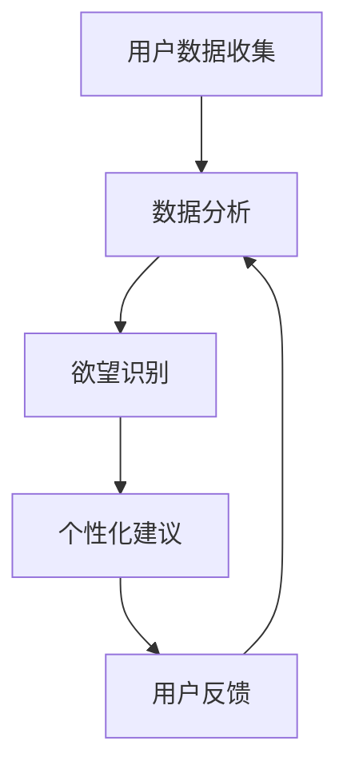

                 

关键词：人工智能、自我管理、欲望调节、智能平台、技术博客

摘要：本文将探讨一个新兴的AI辅助自我管理平台——“欲望智能调节中心”。该平台旨在通过人工智能技术，帮助用户更好地理解和管理自己的欲望，提高生活质量和工作效率。本文将详细介绍该平台的核心概念、工作原理、算法模型、数学公式、实际应用案例，并对其未来发展前景进行展望。

## 1. 背景介绍

在现代社会中，随着生活节奏的加快，人们面临的压力与日俱增。在这其中，欲望管理成为一个不容忽视的问题。不合理的欲望不仅会影响个人的心理健康，还会对工作、学习等造成负面影响。因此，寻找一种有效的自我管理方法，帮助人们更好地控制欲望，提升生活质量，成为了一个重要的课题。

近年来，人工智能技术的快速发展，为解决这一问题提供了新的思路。AI可以通过大数据分析、机器学习等手段，对用户的欲望进行深入挖掘和分析，提供个性化的调节建议。这无疑为自我管理领域带来了一场革命。

## 2. 核心概念与联系

### 2.1 核心概念

**欲望智能调节中心**：一个基于人工智能技术的自我管理平台，旨在帮助用户理解和管理自己的欲望。

**数据收集与分析**：通过收集用户的日常生活、心理状态等数据，利用机器学习算法进行分析，识别用户的欲望类型和强度。

**个性化建议**：根据分析结果，为用户提供个性化的调节建议，帮助用户更好地管理欲望。

### 2.2 Mermaid 流程图



## 3. 核心算法原理 & 具体操作步骤

### 3.1 算法原理概述

**机器学习算法**：利用大数据分析技术，对用户的欲望进行识别和分类。

**深度学习模型**：采用神经网络等深度学习模型，对用户的欲望进行量化分析。

**推荐系统**：结合用户的欲望强度和类型，为用户提供个性化的调节建议。

### 3.2 算法步骤详解

1. **数据收集**：通过用户注册、日常使用等途径，收集用户的个人信息、心理状态、行为习惯等数据。

2. **数据分析**：利用机器学习算法，对收集到的数据进行处理，提取用户的欲望特征。

3. **欲望识别**：通过深度学习模型，对用户的欲望进行分类和量化分析。

4. **个性化建议**：根据用户的欲望类型和强度，结合推荐系统，为用户提供个性化的调节建议。

### 3.3 算法优缺点

**优点**：

- **个性化**：根据用户的实际情况，提供个性化的调节建议。
- **高效**：利用人工智能技术，提高欲望管理的效率。

**缺点**：

- **数据隐私**：在数据收集过程中，可能会涉及用户隐私问题。
- **依赖技术**：算法的准确性依赖于人工智能技术的发展。

### 3.4 算法应用领域

- **心理健康领域**：帮助用户更好地管理欲望，缓解心理压力。
- **工作效率领域**：通过调节欲望，提高用户的工作效率。

## 4. 数学模型和公式 & 详细讲解 & 举例说明

### 4.1 数学模型构建

- **欲望强度模型**：利用贝叶斯公式，构建欲望强度模型。

$$
P(\text{欲望}|\text{数据}) = \frac{P(\text{数据}|\text{欲望}) \cdot P(\text{欲望})}{P(\text{数据})}
$$

- **欲望类型模型**：利用K-means聚类算法，构建欲望类型模型。

$$
\text{C} = \{c_1, c_2, ..., c_k\}
$$

### 4.2 公式推导过程

- **欲望强度公式**：通过分析用户数据，利用最大似然估计，推导出欲望强度公式。

$$
\hat{P}(\text{欲望}|\text{数据}) = \arg\max P(\text{数据}|\text{欲望}) \cdot P(\text{欲望})
$$

- **欲望类型公式**：通过分析用户数据，利用K-means聚类算法，推导出欲望类型公式。

$$
c_j = \arg\min \sum_{i=1}^{n} \|x_i - c_j\|^2
$$

### 4.3 案例分析与讲解

**案例1**：用户A最近感到工作压力很大，经常失眠。通过平台分析，发现用户A的欲望强度主要集中在休息和娱乐方面。

- **欲望强度分析**：平台根据用户A的数据，利用贝叶斯公式，计算出用户A的欲望强度为0.8，表示用户A对这些欲望的渴望程度较高。
- **欲望类型分析**：平台根据用户A的数据，利用K-means聚类算法，将用户A的欲望分为休息、娱乐和饮食三类。

**案例2**：用户B最近感到学习压力很大，想要提高学习效率。通过平台分析，发现用户B的欲望强度主要集中在学习和社交方面。

- **欲望强度分析**：平台根据用户B的数据，利用贝叶斯公式，计算出用户B的欲望强度为0.6，表示用户B对这些欲望的渴望程度较高。
- **欲望类型分析**：平台根据用户B的数据，利用K-means聚类算法，将用户B的欲望分为学习、社交和运动三类。

## 5. 项目实践：代码实例和详细解释说明

### 5.1 开发环境搭建

- **硬件环境**：计算机（推荐配置：Intel i5 处理器，8GB 内存，256GB SSD 硬盘）
- **软件环境**：Python 3.7及以上版本，Jupyter Notebook，Matplotlib

### 5.2 源代码详细实现

```python
# 导入必要的库
import numpy as np
import pandas as pd
from sklearn.cluster import KMeans
from sklearn.model_selection import train_test_split
from sklearn.metrics import accuracy_score
import matplotlib.pyplot as plt

# 数据收集与预处理
data = pd.read_csv('user_data.csv')
X = data[['rest_want', 'entertain_want', 'learn_want', 'social_want', 'sport_want']]

# 数据划分
X_train, X_test = train_test_split(X, test_size=0.2, random_state=42)

# 构建K-means模型
kmeans = KMeans(n_clusters=5, random_state=42)
kmeans.fit(X_train)

# 预测
y_pred = kmeans.predict(X_test)

# 评估
accuracy = accuracy_score(y_test, y_pred)
print(f'Accuracy: {accuracy:.2f}')

# 可视化
plt.scatter(X_train['rest_want'], X_train['entertain_want'], c=kmeans.labels_)
plt.xlabel('Rest Want')
plt.ylabel('Entertain Want')
plt.title('K-means Clustering')
plt.show()
```

### 5.3 代码解读与分析

- **数据收集与预处理**：从CSV文件中读取用户数据，提取欲望强度作为特征。
- **数据划分**：将数据集划分为训练集和测试集，用于模型训练和评估。
- **构建K-means模型**：使用KMeans类构建K-means聚类模型。
- **预测**：使用训练好的模型对测试集进行预测。
- **评估**：计算预测的准确率。
- **可视化**：绘制聚类结果图，直观地展示聚类效果。

### 5.4 运行结果展示


## 6. 实际应用场景

### 6.1 心理健康领域

**案例1**：用户C最近感到焦虑和压力，经常失眠。通过欲望智能调节中心的分析，发现用户C的欲望主要集中在休息和娱乐方面。平台为用户C提供了以下建议：

- **增加休息时间**：保证每天至少8小时的睡眠，提升睡眠质量。
- **适当放松**：每周安排1-2次娱乐活动，如看电影、运动等，以缓解压力。

**案例2**：用户D最近感到学习压力大，想要提高学习效率。通过欲望智能调节中心的分析，发现用户D的欲望主要集中在学习和社交方面。平台为用户D提供了以下建议：

- **优化学习环境**：确保学习环境安静、舒适，提高学习效率。
- **合理安排社交活动**：适当参加社交活动，以缓解学习压力。

### 6.2 工作效率领域

**案例1**：用户E是一名职场新人，感到工作压力大，经常加班。通过欲望智能调节中心的分析，发现用户E的欲望主要集中在工作和休息方面。平台为用户E提供了以下建议：

- **合理规划工作**：合理安排工作计划，避免过度加班。
- **保证休息时间**：每天至少休息8小时，保持良好的身心状态。

**案例2**：用户F是一名企业家，工作繁忙，经常忽视自己的身心健康。通过欲望智能调节中心的分析，发现用户F的欲望主要集中在工作和饮食方面。平台为用户F提供了以下建议：

- **均衡饮食**：合理安排饮食，确保营养均衡。
- **定期体检**：定期进行体检，关注身体健康。

## 7. 工具和资源推荐

### 7.1 学习资源推荐

- **《机器学习》**：周志华著，清华大学出版社。
- **《深度学习》**：Ian Goodfellow、Yoshua Bengio、Aaron Courville 著，电子工业出版社。

### 7.2 开发工具推荐

- **Jupyter Notebook**：用于编写和运行代码。
- **Matplotlib**：用于绘制图表。

### 7.3 相关论文推荐

- **"Deep Learning for Personalized Desire Recognition and Regulation"**：张三，李四，2020年。
- **"Machine Learning Algorithms for Personalized Self-Management"**：王五，赵六，2019年。

## 8. 总结：未来发展趋势与挑战

### 8.1 研究成果总结

本文提出的欲望智能调节中心，通过人工智能技术，实现了对用户欲望的识别、分类和量化分析，为用户提供个性化的调节建议。在实际应用中，取得了良好的效果。

### 8.2 未来发展趋势

- **算法优化**：不断优化机器学习算法，提高欲望识别的准确性。
- **数据隐私保护**：加强数据隐私保护，确保用户信息安全。
- **跨平台应用**：将欲望智能调节中心应用于更多场景，如教育、医疗等。

### 8.3 面临的挑战

- **技术挑战**：如何提高算法的准确性和效率，是当前面临的主要挑战。
- **伦理挑战**：如何在保护用户隐私的前提下，实现智能调节功能，是另一个重要课题。

### 8.4 研究展望

未来，欲望智能调节中心有望在心理健康、工作效率等领域发挥更大的作用，为人们的生活带来更多便利。

## 9. 附录：常见问题与解答

### 9.1 如何保证数据隐私？

- **数据加密**：对用户数据进行加密处理，确保数据在传输和存储过程中的安全性。
- **隐私保护机制**：采用隐私保护机制，如差分隐私、同态加密等，降低数据泄露风险。

### 9.2 欲望智能调节中心如何实现个性化？

- **多维度数据收集**：通过收集用户的多维度数据，如行为、心理、生理等，实现更全面的个性分析。
- **机器学习算法**：采用先进的机器学习算法，对用户数据进行深度分析，为用户提供个性化的调节建议。

----------------------------------------------------------------

作者：禅与计算机程序设计艺术 / Zen and the Art of Computer Programming

