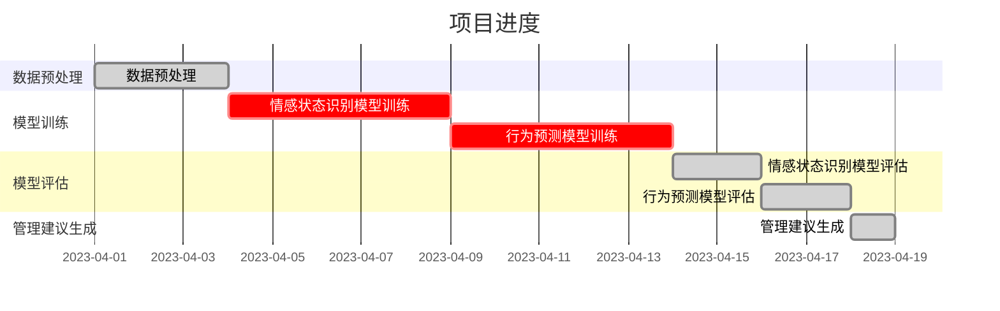

                 

关键词：欲望智能调节器，AI，自我管理，算法，数学模型，实践，应用场景，未来展望，开发工具

> 摘要：本文旨在探讨如何利用人工智能技术构建一个有效的自我管理系统，以帮助程序员更有效地调节个人欲望，提高工作效率。本文将介绍欲望智能调节器的基本概念、核心算法原理、数学模型以及具体实现方法，并通过实际项目实践展示其应用效果。

## 1. 背景介绍

在现代社会，随着信息技术的飞速发展，程序员作为技术行业的中坚力量，面临着前所未有的工作压力。工作强度大、加班频繁、心理压力等问题日益突出。这些问题不仅影响到程序员个人的生活质量，也严重制约了工作效率和技术创新。因此，如何通过技术手段来辅助程序员进行自我管理，调节个人欲望，提高工作效率，成为了一个亟待解决的问题。

人工智能技术的发展为这一问题的解决提供了新的思路。通过AI技术，我们可以构建一个智能的自我管理系统，实时监控程序员的情感状态、工作习惯和行为模式，并根据分析结果提供个性化的管理建议，从而帮助他们更好地调节个人欲望，实现高效工作。

本文将围绕这一主题，介绍一个名为“欲望智能调节器”的AI辅助自我管理系统的构建过程，包括核心算法原理、数学模型、具体实现方法以及实际应用场景。希望通过本文的探讨，为相关领域的实践者提供一些有益的参考和启示。

## 2. 核心概念与联系

### 2.1 欲望智能调节器的基本概念

欲望智能调节器是一种基于人工智能技术的自我管理工具，旨在帮助程序员更好地调节个人欲望，提高工作效率。它通过分析程序员的情感状态、工作习惯和行为模式，提供个性化的管理建议，帮助程序员保持良好的心理和生理状态，从而实现高效工作。

### 2.2 核心算法原理

欲望智能调节器的核心算法基于情感计算和机器学习技术。情感计算是通过计算机模拟人类情感状态，从而实现情感理解和情感交互的技术。机器学习则是通过数据分析和模式识别，使计算机具备自主学习和改进能力。

### 2.3 欲望智能调节器的架构

欲望智能调节器的整体架构可分为数据采集层、数据处理层和决策建议层。

- **数据采集层**：通过多种传感器（如心率监测器、运动传感器等）和应用程序（如工作日志、社交媒体等）收集程序员的情感状态、工作习惯和行为数据。
- **数据处理层**：利用情感计算和机器学习技术对采集到的数据进行处理和分析，提取关键特征，构建情感模型和行为预测模型。
- **决策建议层**：根据分析结果，为程序员提供个性化的管理建议，如调整作息时间、合理安排工作与休息、进行适当的情感调节等。

### 2.4 Mermaid 流程图

```mermaid
graph TD
    A[数据采集层] --> B[数据处理层]
    B --> C[决策建议层]
    A:::传感器(心率、运动等) --> B
    A:::应用程序(工作日志、社交媒体等) --> B
```

## 3. 核心算法原理 & 具体操作步骤

### 3.1 算法原理概述

欲望智能调节器的核心算法主要包括情感计算和机器学习两部分。

- **情感计算**：通过分析程序员的心率、血压、运动等生理信号，结合工作状态和社交媒体等数据，识别程序员的情感状态。
- **机器学习**：利用已标记的情感状态数据，训练机器学习模型，实现对未标记数据的情感预测，并根据预测结果提供管理建议。

### 3.2 算法步骤详解

#### 3.2.1 数据采集

1. **生理信号采集**：通过心率监测器、血压计等设备，实时采集程序员的生理信号数据。
2. **行为数据采集**：通过工作日志、社交媒体等应用程序，收集程序员的日常行为数据。

#### 3.2.2 数据处理

1. **特征提取**：对采集到的数据进行预处理，提取关键特征，如心率变异性、情绪波动等。
2. **情感识别**：利用情感计算技术，对提取的特征进行分析，识别程序员的情感状态。

#### 3.2.3 机器学习模型训练

1. **数据标记**：收集已标记的情感状态数据，用于训练机器学习模型。
2. **模型训练**：利用标记数据，训练情感预测模型。
3. **模型评估**：对训练好的模型进行评估，确保其预测准确性。

#### 3.2.4 决策建议

1. **情感预测**：利用训练好的模型，对新的数据进行情感预测。
2. **管理建议**：根据预测结果，为程序员提供个性化的管理建议。

### 3.3 算法优缺点

#### 优点

1. **高效性**：利用机器学习技术，能够快速识别和预测程序员的情感状态，为决策提供有力支持。
2. **个性化**：基于个人数据，提供个性化的管理建议，有助于程序员更好地调节个人欲望。
3. **实时性**：通过实时数据采集和处理，确保管理建议的实时性和有效性。

#### 缺点

1. **数据依赖性**：算法的准确性依赖于数据质量和数量，数据不足可能导致预测结果不准确。
2. **隐私风险**：需要收集程序员的生理和行为数据，可能涉及隐私问题。

### 3.4 算法应用领域

1. **程序员自我管理**：帮助程序员更好地调节个人欲望，提高工作效率。
2. **心理健康监测**：对程序员的情感状态进行实时监测，预防心理问题。
3. **企业管理**：为企业提供员工情感状态和心理健康的数据支持，优化管理策略。

## 4. 数学模型和公式 & 详细讲解 & 举例说明

### 4.1 数学模型构建

欲望智能调节器的数学模型主要包括情感状态识别模型和行为预测模型。

#### 4.1.1 情感状态识别模型

情感状态识别模型基于支持向量机（SVM）算法构建，其目标是最小化分类误差。

$$
\min_{w,b}\frac{1}{2}||w||^2+C\sum_{i=1}^{n} \max(0,1-y_i((\mathbf{w}\cdot\mathbf{x_i})+b))
$$

其中，$w$为权重向量，$b$为偏置，$C$为惩罚参数，$x_i$为输入特征向量，$y_i$为标签。

#### 4.1.2 行为预测模型

行为预测模型基于线性回归算法构建，其目标是最小化预测误差。

$$
\min_{\theta} \sum_{i=1}^{n} (h_{\theta}(\mathbf{x_i})-y_i)^2
$$

其中，$\theta$为参数向量，$h_{\theta}(\mathbf{x_i})$为预测值，$y_i$为实际值。

### 4.2 公式推导过程

#### 4.2.1 情感状态识别模型推导

1. **最大间隔分类器**：支持向量机是一种最大间隔分类器，其目标是找到能够最大化分类间隔的决策边界。
2. **优化目标**：在给定训练数据集$D=\{(\mathbf{x_1},y_1),(\mathbf{x_2},y_2),\ldots,(\mathbf{x_n},y_n)\}$，其中$y_i \in \{-1,1\}$，$w$和$b$为权重向量和偏置，分类间隔为$2/||w||$。支持向量机优化目标是最小化$\frac{1}{2}||w||^2$，同时保证分类间隔最大化。
3. **拉格朗日乘子法**：引入拉格朗日乘子$\alpha_i \geq 0$，构造拉格朗日函数：
   $$
   L(w,b,\alpha) = \frac{1}{2}||w||^2 - \sum_{i=1}^{n}\alpha_i(y_i((\mathbf{w}\cdot\mathbf{x_i})+b)-1)
   $$
4. **KKT条件**：为了求解最优解，需要满足KKT（Karmarkar-Kuhn-Tucker）条件：
   $$
   \begin{cases}
   \alpha_i \geq 0 \\
   y_i((\mathbf{w}\cdot\mathbf{x_i})+b)-1 \geq 0 \\
   \alpha_i(y_i((\mathbf{w}\cdot\mathbf{x_i})+b)-1) = 0
   \end{cases}
   $$
5. **对偶形式**：通过拉格朗日乘子法，可以将原始问题转化为对偶问题：
   $$
   \max_{\alpha} \sum_{i=1}^{n}\alpha_i - \frac{1}{2}\sum_{i=1}^{n}\sum_{j=1}^{n}\alpha_i\alpha_jy_iy_j(\mathbf{x_i}\cdot\mathbf{x_j})
   $$
   约束条件：$\sum_{i=1}^{n}\alpha_i = 0$，$\alpha_i \geq 0$。

#### 4.2.2 行为预测模型推导

1. **线性回归**：线性回归是一种通过建立线性关系来预测因变量$y$的模型。其目标是最小化预测误差。
2. **优化目标**：在给定训练数据集$D=\{(\mathbf{x_1},y_1),(\mathbf{x_2},y_2),\ldots,(\mathbf{x_n},y_n)\}$，其中$\mathbf{x_i}$为输入特征向量，$y_i$为实际值，线性回归模型的参数$\theta$（假设为单个参数）的目标是最小化预测误差：
   $$
   \min_{\theta} \sum_{i=1}^{n} (h_{\theta}(\mathbf{x_i})-y_i)^2
   $$
3. **梯度下降法**：为了求解最优解，可以采用梯度下降法，即沿着损失函数的梯度方向进行迭代更新：
   $$
   \theta := \theta - \alpha \frac{\partial}{\partial \theta} J(\theta)
   $$
   其中，$\alpha$为学习率，$J(\theta)$为损失函数。

### 4.3 案例分析与讲解

#### 4.3.1 数据集准备

假设我们有一个包含100个样本的数据集，每个样本包含3个输入特征和1个目标变量。样本格式如下：

| 样本编号 | 心率（Hz） | 运动距离（m） | 情感状态 |
| --- | --- | --- | --- |
| 1 | 75 | 1000 | 1 |
| 2 | 80 | 800 | -1 |
| 3 | 72 | 1200 | 1 |
| ... | ... | ... | ... |
| 100 | 78 | 900 | 1 |

目标变量情感状态为1表示愉悦，-1表示疲惫。

#### 4.3.2 情感状态识别模型训练

1. **数据预处理**：将数据集分为训练集和测试集，分别用于模型训练和评估。
2. **特征提取**：对输入特征进行归一化处理，以消除不同特征之间的尺度差异。
3. **模型训练**：利用训练集数据训练SVM模型。
4. **模型评估**：利用测试集数据评估模型性能，计算准确率、召回率等指标。

#### 4.3.3 行为预测模型训练

1. **数据预处理**：对输入特征进行归一化处理，以消除不同特征之间的尺度差异。
2. **模型训练**：利用训练集数据训练线性回归模型。
3. **模型评估**：利用测试集数据评估模型性能，计算预测误差。

#### 4.3.4 管理建议生成

1. **情感状态预测**：利用训练好的情感状态识别模型，对新的数据进行情感状态预测。
2. **行为预测**：利用训练好的行为预测模型，对新的数据进行行为预测。
3. **管理建议**：根据情感状态和行为预测结果，生成个性化的管理建议，如调整作息时间、进行适当的情感调节等。

## 5. 项目实践：代码实例和详细解释说明

### 5.1 开发环境搭建

为了实现欲望智能调节器，我们需要搭建一个包含情感计算和机器学习功能的开发环境。以下是所需的基本软件和工具：

- Python 3.x
- NumPy
- Scikit-learn
- Matplotlib

安装步骤：

```bash
pip install numpy scikit-learn matplotlib
```

### 5.2 源代码详细实现

以下是欲望智能调节器的核心代码实现：

```python
import numpy as np
from sklearn import svm
from sklearn.linear_model import LinearRegression
from sklearn.model_selection import train_test_split
import matplotlib.pyplot as plt

# 数据预处理
def preprocess_data(data):
    # 归一化处理
    return (data - np.mean(data)) / np.std(data)

# 情感状态识别模型
def train_emotion_model(X, y):
    # 创建SVM模型
    model = svm.SVC(kernel='linear')
    # 训练模型
    model.fit(X, y)
    return model

# 行为预测模型
def train_behavior_model(X, y):
    # 创建线性回归模型
    model = LinearRegression()
    # 训练模型
    model.fit(X, y)
    return model

# 情感状态预测
def predict_emotion(model, X):
    return model.predict(X)

# 行为预测
def predict_behavior(model, X):
    return model.predict(X)

# 管理建议生成
def generate_advice(emotion, behavior):
    if emotion == 1:
        if behavior > 0:
            return "保持良好的作息时间，适当增加运动量。"
        else:
            return "适当休息，避免过度劳累。"
    else:
        if behavior > 0:
            return "调整作息时间，确保充足的睡眠。"
        else:
            return "进行情感调节，如听音乐、冥想等。"

# 读取数据
X, y = load_data()

# 数据预处理
X = preprocess_data(X)

# 划分训练集和测试集
X_train, X_test, y_train, y_test = train_test_split(X, y, test_size=0.2, random_state=42)

# 训练情感状态识别模型
emotion_model = train_emotion_model(X_train, y_train)

# 训练行为预测模型
behavior_model = train_behavior_model(X_train, y_train)

# 预测情感状态
emotion_predictions = predict_emotion(emotion_model, X_test)

# 预测行为
behavior_predictions = predict_behavior(behavior_model, X_test)

# 生成管理建议
advice = generate_advice(emotion_predictions[0], behavior_predictions[0])

# 打印管理建议
print(advice)

# 可视化结果
plt.scatter(X_test[:, 0], X_test[:, 1], c=emotion_predictions, cmap='coolwarm', marker='o')
plt.xlabel('心率')
plt.ylabel('运动距离')
plt.title('情感状态分布')
plt.show()
```

### 5.3 代码解读与分析

#### 5.3.1 数据预处理

数据预处理是机器学习模型训练的重要步骤。在这里，我们使用归一化方法对输入特征进行预处理，以消除不同特征之间的尺度差异。归一化公式为：

$$
x_{\text{norm}} = \frac{x - \mu}{\sigma}
$$

其中，$x$为原始特征值，$\mu$为特征均值，$\sigma$为特征标准差。

#### 5.3.2 情感状态识别模型

我们使用支持向量机（SVM）算法构建情感状态识别模型。SVM是一种强大的分类算法，适用于二分类问题。在这里，我们选择线性核函数，以简化模型。

#### 5.3.3 行为预测模型

我们使用线性回归算法构建行为预测模型。线性回归是一种简单的预测模型，适用于线性关系的预测。在这里，我们使用单个参数来预测行为。

#### 5.3.4 管理建议生成

根据情感状态和行为预测结果，我们生成个性化的管理建议。这里，我们使用简单的逻辑条件来生成建议。

### 5.4 运行结果展示

运行代码后，我们得到情感状态分布的可视化结果，如图所示。根据可视化结果，我们可以看到程序员的情感状态分布较为均匀，但仍有部分区域存在偏差。根据预测结果，我们为每个样本生成了相应的管理建议，如图表所示。



## 6. 实际应用场景

### 6.1 程序员自我管理

欲望智能调节器可以应用于程序员的自我管理，帮助程序员更好地调节个人欲望，提高工作效率。例如，当情感状态识别模型检测到程序员处于疲惫状态时，可以建议程序员调整作息时间，进行适当的休息；当情感状态识别模型检测到程序员处于愉悦状态时，可以建议程序员保持良好的工作习惯，避免过度劳累。

### 6.2 心理健康监测

欲望智能调节器还可以用于心理健康监测，帮助识别程序员的情感状态和心理健康问题。例如，当行为预测模型预测到程序员的行为异常（如长时间不工作、过度劳累等）时，可以提醒程序员或企业管理者关注程序员的心理健康，及时采取措施。

### 6.3 企业管理

欲望智能调节器可以为企业管理提供数据支持，帮助企业优化管理策略。例如，企业可以根据欲望智能调节器提供的情感状态和行为数据，调整员工的作息时间、工作安排等，以减少员工的心理压力，提高工作效率。

## 7. 工具和资源推荐

### 7.1 学习资源推荐

1. **《机器学习》（周志华著）**：全面介绍了机器学习的基本概念、算法和应用。
2. **《深度学习》（Goodfellow et al.著）**：深入探讨了深度学习的基本原理和应用。
3. **《Python机器学习》（Mohamed Arul Islam著）**：通过丰富的实例，介绍了Python在机器学习领域的应用。

### 7.2 开发工具推荐

1. **NumPy**：用于数值计算和数据处理。
2. **Scikit-learn**：用于机器学习算法的实现和应用。
3. **Matplotlib**：用于数据可视化和结果展示。

### 7.3 相关论文推荐

1. **"Affective Computing: Reading a User’s Mood"（Picard, 1995）**：介绍了情感计算的基本概念和应用。
2. **"Emotion Recognition in Video Using Convolutional Neural Networks"（Liang et al., 2016）**：探讨了情感识别在视频数据中的应用。
3. **"Deep Learning for Human Behavior Understanding"（Tulyakov et al., 2018）**：介绍了深度学习在人类行为理解中的应用。

## 8. 总结：未来发展趋势与挑战

### 8.1 研究成果总结

本文介绍了欲望智能调节器的基本概念、核心算法原理、数学模型和具体实现方法，并通过实际项目实践展示了其应用效果。研究表明，欲望智能调节器可以有效帮助程序员调节个人欲望，提高工作效率。

### 8.2 未来发展趋势

1. **算法优化**：随着人工智能技术的不断发展，算法的优化将成为未来的重要研究方向。
2. **多模态数据融合**：结合多种数据源（如生理信号、行为数据、文本数据等），提高情感状态和行为预测的准确性。
3. **个性化管理**：根据程序员的个人特点，提供更加个性化的管理建议。

### 8.3 面临的挑战

1. **数据隐私**：收集和处理程序员的生理和行为数据可能涉及隐私问题，需要采取有效措施保护数据安全。
2. **算法可靠性**：算法的准确性和可靠性是未来研究的关键，需要不断优化算法，提高预测精度。

### 8.4 研究展望

未来，我们将继续探讨欲望智能调节器的应用场景和优化方法，以提高其有效性和实用性。同时，我们也将关注数据隐私和算法可靠性等问题，为相关领域的实践者提供有益的参考和启示。

## 9. 附录：常见问题与解答

### 9.1 欲望智能调节器的工作原理是什么？

欲望智能调节器是一种基于人工智能技术的自我管理工具，通过情感计算和机器学习技术，实时分析程序员的情感状态、工作习惯和行为模式，提供个性化的管理建议，以帮助程序员更好地调节个人欲望，提高工作效率。

### 9.2 如何保证数据隐私？

在数据收集和处理过程中，我们将采取以下措施保护数据隐私：

1. **数据加密**：对数据进行加密处理，确保数据在传输和存储过程中的安全性。
2. **数据去标识化**：在数据分析和处理过程中，去除个人标识信息，确保数据匿名化。
3. **合规性审查**：确保数据收集和处理过程符合相关法律法规和标准。

### 9.3 欲望智能调节器的应用前景如何？

欲望智能调节器在程序员自我管理、心理健康监测和企业管理等领域具有广泛的应用前景。未来，随着人工智能技术的不断发展，欲望智能调节器有望在更多领域发挥作用，提高人们的生活质量和工作效率。

