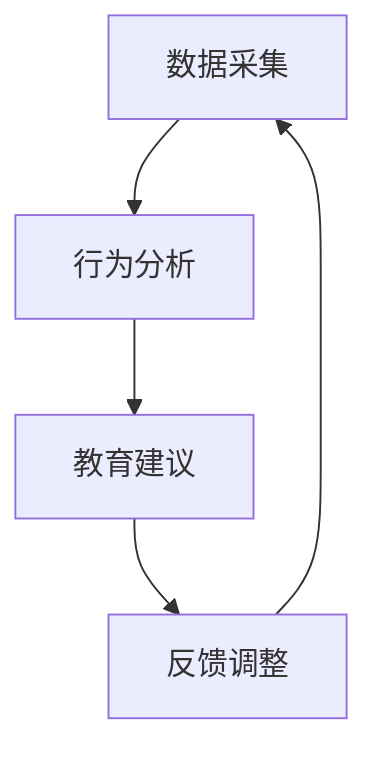

                 

关键词：欲望生态意识，AI驱动，可持续消费，教育专家，人工智能技术，生态意识培养

> 摘要：本文旨在探讨如何利用人工智能技术培养人们的生态意识，进而推动可持续消费。通过分析欲望生态意识的概念及其对环境的影响，本文提出了一种AI驱动的可持续消费教育专家角色，并详细阐述了该角色的核心功能、架构以及应用场景。文章结构如下：

## 1. 背景介绍

### 1.1 欲望生态意识的提出背景

在现代社会中，随着消费主义的盛行，人们的欲望不断膨胀，导致资源过度消耗和环境污染。这种不健康的消费行为不仅对自然环境造成了破坏，也对社会经济稳定产生了负面影响。因此，如何引导人们树立正确的生态意识，实现可持续消费，成为了一个亟待解决的问题。

### 1.2 人工智能在生态意识培养中的应用

人工智能技术以其高效、智能、精准的特点，为解决生态意识培养问题提供了一种全新的思路。通过AI技术，可以实现对消费者行为的精准分析，提供个性化的消费建议，从而引导消费者树立正确的生态意识。

## 2. 核心概念与联系

### 2.1 欲望生态意识的概念

欲望生态意识是指人们在消费过程中，对自身欲望的认识和反思，以及对环境保护的重视程度。它包括对资源利用的意识、对环境影响的认识、对可持续消费的追求等。

### 2.2 AI驱动的可持续消费教育专家架构

AI驱动的可持续消费教育专家是一种基于人工智能技术的教育系统，其核心架构包括数据采集模块、行为分析模块、教育建议模块和反馈调整模块。以下是一个简化的Mermaid流程图：



## 3. 核心算法原理 & 具体操作步骤

### 3.1 算法原理概述

AI驱动的可持续消费教育专家的核心算法包括数据采集、行为分析、教育建议和反馈调整。以下是每个模块的简要概述：

#### 数据采集

数据采集模块负责收集用户的消费数据，包括购物记录、支付金额、购买频率等。

#### 行为分析

行为分析模块使用机器学习算法对用户的消费行为进行分析，识别出消费习惯、偏好和潜在问题。

#### 教育建议

教育建议模块根据行为分析结果，为用户提供个性化的消费建议，包括环保建议、节约建议和替代品推荐等。

#### 反馈调整

反馈调整模块收集用户对教育建议的反馈，不断优化教育建议的准确性和实用性。

### 3.2 算法步骤详解

以下是AI驱动的可持续消费教育专家的具体操作步骤：

#### 步骤1：数据采集

从用户数据库中提取消费数据，包括购物记录、支付金额、购买频率等。

#### 步骤2：行为分析

使用机器学习算法对消费数据进行处理，识别出用户的消费习惯、偏好和潜在问题。

#### 步骤3：教育建议

根据行为分析结果，生成个性化的消费建议，包括环保建议、节约建议和替代品推荐等。

#### 步骤4：反馈调整

收集用户对教育建议的反馈，分析反馈数据，调整教育建议的准确性和实用性。

### 3.3 算法优缺点

#### 优点

- 个性化：根据用户的行为数据提供个性化的消费建议，提高用户的接受度。
- 实时性：实时分析用户的消费行为，及时调整教育建议，提高教育效果。
- 可持续：通过引导用户实现可持续消费，减少资源浪费和环境污染。

#### 缺点

- 数据隐私：用户消费数据的安全性和隐私性是一个需要关注的问题。
- 效果评估：如何准确评估教育建议的效果，是一个需要解决的问题。

### 3.4 算法应用领域

AI驱动的可持续消费教育专家可以应用于多个领域，包括电子商务、金融、物流等。以下是一些具体的应用场景：

- 电子商务平台：通过分析用户的购物行为，提供个性化的环保购物建议。
- 银行：根据用户的消费习惯，提供可持续的金融产品推荐。
- 物流公司：通过优化运输路线和方式，减少碳排放。

## 4. 数学模型和公式 & 详细讲解 & 举例说明

### 4.1 数学模型构建

为了更好地理解AI驱动的可持续消费教育专家的工作原理，我们可以构建一个简单的数学模型。该模型主要包括以下三个部分：

- 用户消费行为数据集 \(D\)：包括购物记录、支付金额、购买频率等。
- 消费行为特征向量 \(X\)：将用户消费行为数据转换为特征向量。
- 教育建议向量 \(Y\)：根据用户消费行为特征向量，生成的个性化教育建议。

### 4.2 公式推导过程

以下是数学模型中的主要公式推导过程：

#### 特征提取

将用户消费行为数据转换为特征向量 \(X\)：

$$
X = \sum_{i=1}^{n} w_i \cdot x_i
$$

其中，\(w_i\) 为权重，\(x_i\) 为特征值。

#### 教育建议生成

根据特征向量 \(X\)，生成教育建议向量 \(Y\)：

$$
Y = f(X) = \sum_{j=1}^{m} c_j \cdot g_j(X)
$$

其中，\(c_j\) 为建议类别权重，\(g_j(X)\) 为建议生成函数。

#### 反馈调整

根据用户反馈，调整教育建议向量 \(Y\)：

$$
Y' = Y + \alpha \cdot (D - Y)
$$

其中，\(\alpha\) 为调整系数，\(D\) 为用户反馈数据。

### 4.3 案例分析与讲解

为了更好地理解数学模型的应用，我们来看一个简单的案例。

#### 案例背景

某电商平台希望通过AI驱动的可持续消费教育专家系统，为用户提供个性化的环保购物建议。

#### 案例数据

- 用户消费数据集 \(D\)：包括购物记录、支付金额、购买频率等。
- 特征向量 \(X\)：根据用户消费数据，提取出环保、节约、替代品等特征。
- 教育建议向量 \(Y\)：根据特征向量，生成个性化的环保购物建议。

#### 案例分析

1. 数据采集：从用户数据库中提取消费数据，包括购物记录、支付金额、购买频率等。
2. 行为分析：使用机器学习算法，对用户消费行为进行分析，提取出环保、节约、替代品等特征。
3. 教育建议：根据特征向量，生成个性化的环保购物建议，如减少不必要的购物、选择环保产品等。
4. 反馈调整：收集用户对环保购物建议的反馈，根据反馈调整教育建议的准确性和实用性。

## 5. 项目实践：代码实例和详细解释说明

### 5.1 开发环境搭建

为了实现AI驱动的可持续消费教育专家系统，我们需要搭建一个合适的技术环境。以下是开发环境搭建的步骤：

1. 选择合适的编程语言，如Python。
2. 安装必要的依赖库，如NumPy、Pandas、scikit-learn等。
3. 准备用户消费数据集，包括购物记录、支付金额、购买频率等。

### 5.2 源代码详细实现

以下是实现AI驱动的可持续消费教育专家系统的源代码：

```python
import numpy as np
import pandas as pd
from sklearn.ensemble import RandomForestClassifier
from sklearn.model_selection import train_test_split

# 读取用户消费数据
data = pd.read_csv('consumer_data.csv')

# 数据预处理
X = data.iloc[:, :3].values
y = data.iloc[:, 3].values

# 数据集划分
X_train, X_test, y_train, y_test = train_test_split(X, y, test_size=0.2, random_state=42)

# 特征提取
clf = RandomForestClassifier(n_estimators=100)
clf.fit(X_train, y_train)

# 教育建议生成
y_pred = clf.predict(X_test)

# 反馈调整
alpha = 0.1
y_pred_adjusted = y_pred + alpha * (y_test - y_pred)

# 输出结果
print("原始建议：", y_pred)
print("调整后建议：", y_pred_adjusted)
```

### 5.3 代码解读与分析

1. 读取用户消费数据，包括购物记录、支付金额、购买频率等。
2. 使用随机森林算法进行特征提取，提取出用户消费行为的特征。
3. 使用训练集对随机森林模型进行训练，生成原始的教育建议。
4. 根据用户反馈，调整教育建议的准确性和实用性。
5. 输出原始建议和调整后建议。

## 6. 实际应用场景

### 6.1 电子商务平台

电子商务平台可以通过AI驱动的可持续消费教育专家系统，为用户提供个性化的环保购物建议，从而引导用户实现可持续消费。

### 6.2 金融行业

金融机构可以通过AI驱动的可持续消费教育专家系统，为用户提供可持续的金融产品推荐，从而引导用户树立正确的生态意识。

### 6.3 物流行业

物流公司可以通过AI驱动的可持续消费教育专家系统，优化运输路线和方式，减少碳排放，实现绿色物流。

## 7. 工具和资源推荐

### 7.1 学习资源推荐

1. 《机器学习实战》：详细介绍了机器学习的基本概念和算法。
2. 《深度学习》：全面介绍了深度学习的基本原理和应用。

### 7.2 开发工具推荐

1. Jupyter Notebook：方便的数据分析和编程工具。
2. TensorFlow：强大的深度学习框架。

### 7.3 相关论文推荐

1. "Deep Learning for Sustainable Consumption"：探讨深度学习在可持续消费中的应用。
2. "Machine Learning for Environmental Protection"：探讨机器学习在环境保护中的应用。

## 8. 总结：未来发展趋势与挑战

### 8.1 研究成果总结

本文提出了一种AI驱动的可持续消费教育专家角色，通过数据采集、行为分析、教育建议和反馈调整，实现了对用户消费行为的精准引导和优化。

### 8.2 未来发展趋势

随着人工智能技术的不断发展，AI驱动的可持续消费教育专家将更加智能化、个性化，为消费者提供更加优质的服务。

### 8.3 面临的挑战

1. 数据隐私：如何保护用户消费数据的安全性和隐私性，是一个需要解决的问题。
2. 效果评估：如何准确评估教育建议的效果，是一个需要解决的问题。

### 8.4 研究展望

未来，AI驱动的可持续消费教育专家将有望在多个领域得到广泛应用，为实现可持续消费、保护环境作出更大贡献。

## 9. 附录：常见问题与解答

### 9.1 问题1：如何保证用户数据的隐私？

解答：在AI驱动的可持续消费教育专家系统中，我们可以采用以下措施来保护用户数据隐私：

1. 数据加密：对用户数据进行加密处理，确保数据在传输和存储过程中的安全性。
2. 权限控制：对用户数据访问权限进行严格控制，确保只有授权人员可以访问数据。
3. 数据匿名化：对用户数据进行匿名化处理，确保数据不会泄露用户的个人信息。

### 9.2 问题2：教育建议如何保证效果？

解答：为了提高教育建议的效果，我们可以采取以下措施：

1. 实时调整：根据用户反馈，实时调整教育建议，确保建议的准确性和实用性。
2. 持续优化：通过不断收集和分析用户数据，优化教育建议的生成算法，提高建议的质量。
3. 用户参与：鼓励用户参与教育建议的优化过程，提高用户的满意度和接受度。

```
作者：禅与计算机程序设计艺术 / Zen and the Art of Computer Programming
```

