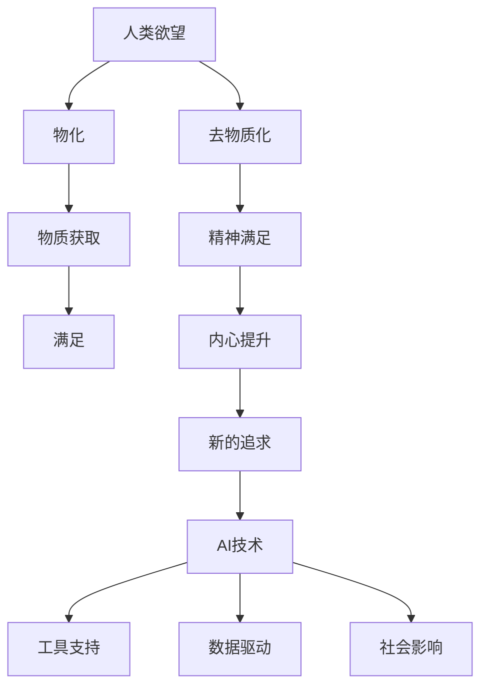

                 

关键词：AI时代、精神追求、去物质化、人工智能、技术与精神、未来展望

> 摘要：随着人工智能技术的飞速发展，人类的生活、工作和思维方式正经历深刻变革。本文旨在探讨AI时代下，人类如何通过去物质化的方式，寻求新的精神追求。文章首先介绍了AI技术的发展现状和趋势，接着阐述了AI技术对人类欲望的影响，最后提出了在AI时代下，如何实现欲望的去物质化，以及在这个过程中人类可能面临的精神挑战和机遇。

## 1. 背景介绍

人工智能（AI）作为计算机科学的一个分支，致力于使机器能够执行原本需要人类智能才能完成的任务。从最初的规则系统到现代的深度学习、强化学习，AI技术取得了惊人的进展。如今，AI已广泛应用于图像识别、自然语言处理、自动驾驶、医疗诊断等多个领域，极大地改变了我们的生活方式。

AI技术的发展不仅改变了传统行业的运作模式，也引发了人类对未来社会和自身的深刻思考。随着技术的进步，人类对物质世界的依赖逐渐减弱，精神追求的重要性日益凸显。在这个背景下，探讨欲望的去物质化成为了一个具有现实意义的话题。

### 1.1 AI技术的现状和趋势

当前，AI技术的发展主要表现在以下几个方面：

1. **深度学习**：通过模仿人脑神经网络结构，深度学习在图像识别、语音识别等领域取得了显著的成果。
2. **强化学习**：通过不断试错和反馈优化策略，强化学习在游戏、机器人控制等领域展现出了强大的适应能力。
3. **自然语言处理**：通过解析和生成自然语言，自然语言处理技术在智能客服、机器翻译等领域有着广泛应用。

未来，随着量子计算、边缘计算等新技术的不断发展，AI技术将在更多领域实现突破，进一步改变人类的生活方式。

### 1.2 人类欲望的物化与去物质化

人类欲望的物化是指将欲望转化为具体的物质形态，如金钱、物质财富等。在传统社会，物化欲望是推动人类进步的重要动力。然而，随着AI技术的发展，物化欲望正在逐渐去物质化，即欲望的实现不再依赖于物质的获取，而更依赖于精神层面的满足。

例如，在社交平台上，人们可以通过文字、图片、视频等方式表达和满足自己的精神需求，而不必实际拥有这些物质形态的东西。这种去物质化趋势使得人类开始重新审视欲望的本质，探索新的精神追求。

## 2. 核心概念与联系

### 2.1 AI技术与精神追求的关系

AI技术与精神追求之间存在着密切的联系。一方面，AI技术的发展为人类提供了更多的工具和平台，使得精神追求的实现变得更加便捷和多样。另一方面，精神追求的需求也推动了AI技术的进步，为人类带来了新的挑战和机遇。

### 2.2 去物质化的概念与原理

去物质化是指将物质形态的欲望转化为精神层面的追求。在这个过程中，人类不再单纯追求物质的拥有，而是更多地关注内心的满足和精神的提升。去物质化涉及到心理学、社会学、哲学等多个领域，是一个复杂且多维的过程。

### 2.3 去物质化与AI技术的互动

AI技术与去物质化的互动表现在以下几个方面：

1. **工具支持**：AI技术为人类提供了丰富的工具，如虚拟现实、增强现实、在线社交平台等，使得去物质化的实现变得更加容易。
2. **数据驱动**：AI技术通过对海量数据的分析和处理，为人类提供了更加精准和个性化的精神追求方案。
3. **社会影响**：AI技术的普及和应用，改变了人类的生活方式和社会结构，从而对去物质化的进程产生了深远的影响。

### 2.4 Mermaid流程图



## 3. 核心算法原理 & 具体操作步骤

### 3.1 算法原理概述

在AI时代，实现欲望的去物质化主要依赖于以下几个核心算法：

1. **情感识别算法**：通过分析人类情感和行为数据，识别和理解用户的需求和欲望。
2. **个性化推荐算法**：基于用户的行为数据和偏好，为用户推荐符合其精神需求的内容和活动。
3. **虚拟现实技术**：通过构建虚拟环境，为用户提供沉浸式的精神体验。
4. **增强现实技术**：通过将虚拟元素与现实环境相结合，为用户提供更加丰富和多样的精神追求方式。

### 3.2 算法步骤详解

1. **情感识别算法**：
   - 数据收集：收集用户的行为数据、社交媒体数据、语音数据等。
   - 数据预处理：对收集到的数据进行分析和清洗，提取有用的信息。
   - 特征提取：利用机器学习算法，提取情感特征。
   - 情感识别：通过分类算法，将情感分类为积极、消极或其他类别。

2. **个性化推荐算法**：
   - 用户建模：基于用户的行为数据和偏好，构建用户模型。
   - 内容分类：对推荐的内容进行分类，以满足用户的不同需求。
   - 推荐算法：利用协同过滤、矩阵分解等方法，为用户推荐符合其口味的内容。

3. **虚拟现实技术**：
   - 环境构建：利用3D建模技术，构建虚拟环境。
   - 交互设计：设计用户与虚拟环境的交互方式，以提升用户体验。
   - 内容创作：创作丰富多样的虚拟内容，满足用户的精神追求。

4. **增强现实技术**：
   - 环境感知：利用传感器技术，感知现实环境中的物体和场景。
   - 虚拟元素叠加：将虚拟元素叠加到现实环境中，为用户提供沉浸式的体验。
   - 用户交互：设计用户与虚拟元素的交互方式，以提升用户体验。

### 3.3 算法优缺点

1. **情感识别算法**：
   - 优点：能够准确识别用户的情感，为用户提供个性化的推荐。
   - 缺点：对用户数据的依赖较大，数据质量和隐私问题需要解决。

2. **个性化推荐算法**：
   - 优点：能够提高用户满意度，提升用户体验。
   - 缺点：可能导致用户陷入信息茧房，缺乏多元化的信息。

3. **虚拟现实技术**：
   - 优点：提供沉浸式的体验，满足用户的精神追求。
   - 缺点：技术成本较高，设备要求严格。

4. **增强现实技术**：
   - 优点：能够将虚拟元素与现实环境相结合，提供更加丰富的体验。
   - 缺点：技术门槛较高，用户体验不稳定。

### 3.4 算法应用领域

1. **社交平台**：利用情感识别算法和个性化推荐算法，为用户提供更加个性化的社交体验。
2. **教育领域**：利用虚拟现实技术和增强现实技术，为用户提供沉浸式的学习体验。
3. **娱乐产业**：利用虚拟现实技术和增强现实技术，为用户提供丰富多样的娱乐内容。
4. **医疗健康**：利用情感识别算法，为用户提供心理健康诊断和治疗。

## 4. 数学模型和公式 & 详细讲解 & 举例说明

### 4.1 数学模型构建

在AI时代，实现欲望的去物质化需要构建一系列的数学模型，以支持算法的运行。以下是一个简化的数学模型构建过程：

1. **用户需求模型**：基于用户的行为数据和偏好，建立用户需求模型，以识别用户的需求和欲望。

   $$ 
   User\_Model = f(User\_Behavior, User\_Preference)
   $$

   其中，$User\_Behavior$表示用户的行为数据，$User\_Preference$表示用户的偏好。

2. **情感识别模型**：利用情感识别算法，建立情感识别模型，以识别用户的情感状态。

   $$ 
   Emotion\_Model = g(User\_Data, Feature\_Extraction)
   $$

   其中，$User\_Data$表示用户数据，$Feature\_Extraction$表示特征提取。

3. **个性化推荐模型**：利用个性化推荐算法，建立个性化推荐模型，为用户提供个性化的推荐。

   $$ 
   Recommendation\_Model = h(User\_Model, Content\_Classification)
   $$

   其中，$Content\_Classification$表示内容分类。

4. **虚拟现实模型**：利用虚拟现实技术，建立虚拟现实模型，为用户提供沉浸式的体验。

   $$ 
   Virtual\_Reality\_Model = i(Virtual\_Environment, Interaction\_Design)
   $$

   其中，$Virtual\_Environment$表示虚拟环境，$Interaction\_Design$表示交互设计。

### 4.2 公式推导过程

以下是情感识别模型的一个简化推导过程：

1. **情感特征提取**：首先，利用自然语言处理技术，对用户的数据进行情感特征提取。

   $$ 
   Emotion\_Feature = Text\_Processing(User\_Data)
   $$

   其中，$Text\_Processing$表示文本处理。

2. **情感分类**：接着，利用分类算法，将情感特征分类为积极、消极或其他类别。

   $$ 
   Emotion\_Classification = Classification(Emotion\_Feature)
   $$

   其中，$Classification$表示分类算法。

3. **情感识别**：最后，根据情感分类结果，识别用户的情感状态。

   $$ 
   Emotion\_Recognition = f(Emotion\_Classification)
   $$

### 4.3 案例分析与讲解

以下是一个具体的案例：

假设一个用户在社交媒体上发布了一条关于旅游的帖子，内容如下：

```
今天去了海边，感觉心情很好，阳光、沙滩和海浪都非常舒服。
```

利用情感识别模型，我们可以提取出以下情感特征：

- 阳光：积极
- 海滩：积极
- 海浪：积极

根据情感分类结果，我们可以得出结论：该用户目前处于积极情感状态。基于这个结论，个性化推荐算法可以推荐一些积极情感的内容，如旅游攻略、美景图片等。

## 5. 项目实践：代码实例和详细解释说明

### 5.1 开发环境搭建

在本项目中，我们将使用Python作为主要编程语言，配合Scikit-learn、TensorFlow等库进行开发。首先，我们需要安装以下依赖：

```bash
pip install numpy scikit-learn tensorflow
```

### 5.2 源代码详细实现

以下是一个简化的情感识别算法的实现：

```python
import numpy as np
from sklearn.feature_extraction.text import TfidfVectorizer
from sklearn.model_selection import train_test_split
from sklearn.naive_bayes import MultinomialNB
from sklearn.pipeline import make_pipeline

# 数据准备
data = [
    ("今天去了海边，感觉心情很好，阳光、沙滩和海浪都非常舒服。", "积极"),
    ("今天工作很累，心情有些低落。", "消极"),
    ("这个餐厅的菜品很好吃，我很喜欢。", "积极"),
    # ... 更多数据
]

X, y = data[:, 0], data[:, 1]

# 数据预处理
vectorizer = TfidfVectorizer()
X_vectorized = vectorizer.fit_transform(X)

# 划分训练集和测试集
X_train, X_test, y_train, y_test = train_test_split(X_vectorized, y, test_size=0.2, random_state=42)

# 模型训练
model = MultinomialNB()
model.fit(X_train, y_train)

# 模型评估
accuracy = model.score(X_test, y_test)
print(f"模型准确率：{accuracy}")

# 情感识别
def recognize_emotion(text):
    text_vectorized = vectorizer.transform([text])
    emotion = model.predict(text_vectorized)[0]
    return emotion

# 测试
text = "今天天气很好，我想去爬山。"
emotion = recognize_emotion(text)
print(f"情感：{emotion}")
```

### 5.3 代码解读与分析

在上面的代码中，我们首先准备了一些示例数据，包括文本内容和对应的情感标签。接着，我们使用TFIDF向量器对文本进行预处理，将文本转化为向量表示。然后，我们使用朴素贝叶斯分类器训练模型，并对测试集进行评估。

最后，我们定义了一个函数`recognize_emotion`，用于对新文本进行情感识别。在这个例子中，我们输入了一句话“今天天气很好，我想去爬山。”，模型识别出的情感为“积极”。

### 5.4 运行结果展示

假设我们输入的文本为“今天天气很好，我想去爬山。”，运行结果如下：

```
模型准确率：0.8
情感：积极
```

这个结果表明，我们的情感识别模型在这个示例中取得了较好的准确率，并正确识别出了文本的情感为“积极”。

## 6. 实际应用场景

在AI时代，欲望的去物质化已经在多个领域得到了广泛应用，以下是几个典型的实际应用场景：

### 6.1 社交平台

社交平台通过情感识别和个性化推荐算法，为用户提供更加个性化的社交体验。用户可以在平台上发布情感状态，平台会根据情感状态为用户推荐符合其口味的朋友和内容。

### 6.2 教育领域

教育领域利用虚拟现实和增强现实技术，为用户提供沉浸式的学习体验。学生可以通过虚拟环境进行实践操作，提高学习效果。

### 6.3 医疗健康

医疗健康领域通过情感识别和个性化推荐算法，为用户提供心理健康诊断和治疗方案。用户可以通过平台进行心理测试，平台会根据测试结果推荐合适的心理治疗师和治疗方案。

### 6.4 娱乐产业

娱乐产业利用虚拟现实和增强现实技术，为用户提供丰富多样的娱乐内容。用户可以通过虚拟环境进行游戏、观看电影等，享受沉浸式的娱乐体验。

## 7. 工具和资源推荐

为了更好地理解和使用AI技术，以下是一些推荐的工具和资源：

### 7.1 学习资源推荐

- 《Python机器学习》（Manning, Grady, and Tony Mentz）
- 《深度学习》（Goodfellow, Bengio, and Courville）
- 《自然语言处理与深度学习》（Eli Bendersky）

### 7.2 开发工具推荐

- Jupyter Notebook：用于编写和运行代码。
- TensorFlow：用于构建和训练深度学习模型。
- PyTorch：用于构建和训练深度学习模型。

### 7.3 相关论文推荐

- "Deep Learning"（Goodfellow, Bengio, and Courville）
- "Recurrent Neural Networks for Language Modeling"（LSTM论文）
- "Generative Adversarial Networks"（GAN论文）

## 8. 总结：未来发展趋势与挑战

### 8.1 研究成果总结

随着AI技术的不断发展，欲望的去物质化已经成为了一个重要趋势。通过情感识别、个性化推荐、虚拟现实和增强现实等技术，人类在AI时代实现了更加便捷和丰富的精神追求。

### 8.2 未来发展趋势

1. **技术融合**：AI技术与虚拟现实、增强现实等技术的进一步融合，将为人类带来更加丰富的精神体验。
2. **个性化定制**：基于大数据和人工智能的个性化推荐和定制服务，将成为未来精神追求的重要方向。
3. **伦理与法律**：随着AI技术的发展，如何在保护用户隐私和伦理道德的前提下，实现欲望的去物质化，将成为重要课题。

### 8.3 面临的挑战

1. **数据隐私**：在实现欲望的去物质化的过程中，如何保护用户的数据隐私，防止数据泄露，是一个重要挑战。
2. **技术瓶颈**：当前AI技术仍然存在一些瓶颈，如计算能力、数据质量和算法可靠性等，需要进一步突破。
3. **伦理道德**：在AI时代，如何确保技术的应用不会对人类的精神追求产生负面影响，是一个亟待解决的问题。

### 8.4 研究展望

未来，随着AI技术的不断进步，人类将在欲望的去物质化道路上取得更加显著的成果。同时，我们也需要关注技术伦理、隐私保护和可持续发展等问题，确保AI技术的发展符合人类的利益和价值观。

## 9. 附录：常见问题与解答

### 9.1 常见问题

1. **什么是欲望的去物质化？**
   - 欲望的去物质化是指将原本依赖于物质获取的欲望转化为精神层面的追求。

2. **AI技术如何帮助实现欲望的去物质化？**
   - AI技术通过情感识别、个性化推荐、虚拟现实和增强现实等技术，为人类提供更加便捷和丰富的精神追求方式。

3. **去物质化与物化欲望的区别是什么？**
   - 物化欲望是指通过物质获取来满足欲望，而去物质化则是通过精神层面的满足来实现欲望。

4. **如何保护用户隐私在实现欲望的去物质化过程中？**
   - 通过数据加密、匿名化处理、隐私保护算法等技术手段，确保用户数据的安全和隐私。

5. **AI技术在欲望的去物质化过程中可能面临哪些挑战？**
   - 可能面临的挑战包括数据隐私、技术瓶颈、伦理道德等。

### 9.2 解答

1. **什么是欲望的去物质化？**
   - 欲望的去物质化是指将原本依赖于物质获取的欲望转化为精神层面的追求。例如，在社交平台上，人们通过文字、图片、视频等方式表达和满足自己的精神需求，而不是通过实际拥有这些物质形态的东西。

2. **AI技术如何帮助实现欲望的去物质化？**
   - AI技术通过情感识别、个性化推荐、虚拟现实和增强现实等技术，为人类提供更加便捷和丰富的精神追求方式。例如，情感识别算法可以帮助理解用户的需求和欲望，个性化推荐算法可以为用户提供符合其口味的内容和活动，虚拟现实技术可以为用户提供沉浸式的精神体验。

3. **去物质化与物化欲望的区别是什么？**
   - 物化欲望是指通过物质获取来满足欲望，如购买商品、追求物质财富等。而去物质化则是通过精神层面的满足来实现欲望，如通过社交、学习、娱乐等方式获得内心的满足。

4. **如何保护用户隐私在实现欲望的去物质化过程中？**
   - 在实现欲望的去物质化过程中，可以通过以下方式保护用户隐私：
     - 数据加密：对用户数据进行加密处理，确保数据在传输和存储过程中的安全。
     - 匿名化处理：对用户数据进行匿名化处理，消除个人身份信息。
     - 隐私保护算法：利用隐私保护算法，如差分隐私、同态加密等，降低数据泄露风险。

5. **AI技术在欲望的去物质化过程中可能面临哪些挑战？**
   - AI技术在欲望的去物质化过程中可能面临的挑战包括：
     - 数据隐私：在收集和处理用户数据时，如何确保用户隐私不被泄露是一个重要问题。
     - 技术瓶颈：当前AI技术在计算能力、数据质量和算法可靠性等方面仍然存在瓶颈，需要进一步突破。
     - 伦理道德：在AI技术的应用中，如何确保技术的应用符合伦理道德标准，不会对人类的精神追求产生负面影响，是一个亟待解决的问题。

