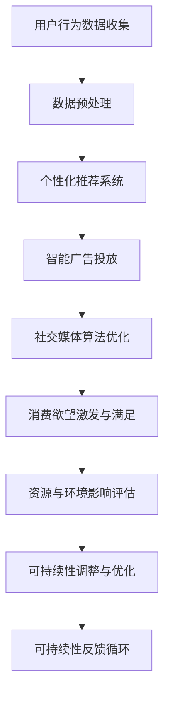

                 

在数字化和人工智能（AI）迅猛发展的时代，我们的消费习惯和欲望正在经历前所未有的变革。从购物行为到信息消费，AI技术的介入正重新定义我们与物质世界的关系。本文旨在探讨这一变革背后的伦理问题，特别是AI如何影响我们的欲望及其可持续性。

> **关键词**：人工智能，消费伦理，可持续性，欲望，AI时代。

> **摘要**：本文将分析AI技术在消费行为中的作用，探讨这些技术如何激发和塑造消费者的欲望，并评估其对可持续性的影响。文章将结合具体案例，提出可能的解决方案和未来研究方向。

## 1. 背景介绍

### 消费伦理的定义与重要性

消费伦理是指消费者在购买和使用商品或服务时，所应遵循的道德准则和价值观。它不仅仅涉及个体消费者，还关系到生产者、商家以及整个社会。随着社会经济的发展，消费伦理问题越来越受到关注，因为它直接关系到资源的合理利用、环境的保护和消费者的福祉。

### AI技术对消费行为的影响

人工智能技术的应用正在深刻地改变我们的消费习惯。例如，个性化推荐系统通过分析用户的消费历史和行为，提供高度个性化的产品推荐，从而刺激了消费欲望。此外，智能广告和社交媒体算法也在不断优化用户的浏览体验，通过创造新的需求来引导消费。

### 欲望的可持续性

欲望的可持续性指的是我们在追求消费满足的同时，是否考虑到了资源的可持续性和环境的可持续性。在AI时代，这一问题的复杂性和紧迫性更加突出。因为AI技术不仅改变了消费模式，还可能加剧资源浪费和环境破坏。

## 2. 核心概念与联系

### 2.1 消费伦理的核心理念

消费伦理的核心包括公正性、透明性、社会责任和可持续性。公正性要求消费者在消费活动中遵循公平原则；透明性强调消费者应当了解商品或服务的真实信息；社会责任则要求消费者在消费时考虑到对社会和环境的影响；可持续性则强调在满足消费需求的同时，应考虑到资源的长期利用和环境的保护。

### 2.2 AI技术在消费中的应用

AI技术在消费中的应用主要包括个性化推荐、智能广告、社交媒体算法等。这些技术通过分析用户数据，提供定制化的消费体验，从而激发和满足消费者的欲望。

### 2.3 欲望与可持续性的联系

欲望的可持续性要求我们在追求消费满足时，应考虑到资源的可持续性和环境的可持续性。这涉及到消费的合理性、资源的有效利用以及环境保护等多个方面。

### Mermaid 流程图

下面是一个关于AI技术在消费中应用的Mermaid流程图：



## 3. 核心算法原理 & 具体操作步骤

### 3.1 算法原理概述

AI技术在消费中的应用，主要依赖于机器学习算法，特别是深度学习算法。这些算法通过训练模型，从大量用户数据中提取特征，从而实现个性化推荐、智能广告投放和社交媒体算法优化。

### 3.2 算法步骤详解

1. **数据收集与预处理**：收集用户的历史消费数据、浏览行为数据等，并进行数据清洗和预处理，以去除噪声和异常值。
2. **特征提取**：通过特征工程，提取与用户消费行为相关的关键特征，如购买频率、偏好类型、价格敏感度等。
3. **模型训练**：使用深度学习算法，如卷积神经网络（CNN）或循环神经网络（RNN），对预处理后的数据进行训练，以构建个性化推荐模型、智能广告投放模型和社交媒体算法模型。
4. **模型评估与优化**：通过交叉验证和性能指标（如准确率、召回率等）对模型进行评估和优化，以提高推荐效果和用户体验。
5. **应用部署**：将训练好的模型部署到实际应用中，如个性化推荐系统、智能广告平台和社交媒体算法平台，以实现消费欲望的激发与满足。

### 3.3 算法优缺点

**优点**：
1. 提高消费体验：通过个性化推荐和智能广告，为消费者提供更符合个人喜好的产品或服务，从而提高消费满意度。
2. 提高营销效果：智能广告和社交媒体算法能够更精准地定位目标用户，提高营销效果。
3. 提高资源利用效率：通过预测用户需求，优化库存管理和供应链，提高资源利用效率。

**缺点**：
1. 隐私问题：用户数据的收集和使用可能涉及到隐私泄露的风险。
2. 数据偏见：算法可能因为数据的不均衡或偏见而导致推荐结果的不公平。
3. 欲望的过度激发：过于精准的个性化推荐和广告可能导致消费者产生不必要的消费欲望，从而加剧资源浪费和环境破坏。

### 3.4 算法应用领域

AI技术在消费中的应用非常广泛，包括电子商务、广告营销、社交媒体、金融服务等领域。例如，电子商务平台通过个性化推荐系统，为消费者提供更精准的购物建议；广告平台通过智能广告投放，提高广告的点击率和转化率；社交媒体通过算法优化，提高用户活跃度和留存率。

## 4. 数学模型和公式 & 详细讲解 & 举例说明

### 4.1 数学模型构建

在AI技术的应用中，常用的数学模型包括回归模型、分类模型和聚类模型。其中，回归模型用于预测连续值，如预测用户购买的概率；分类模型用于预测离散值，如判断用户是否会对某个产品产生兴趣；聚类模型用于将用户划分为不同的群体，以便进行个性化的推荐。

### 4.2 公式推导过程

以回归模型为例，假设我们要预测用户购买某产品的概率，可以使用线性回归模型。线性回归模型的公式为：

\[ Y = \beta_0 + \beta_1 X_1 + \beta_2 X_2 + \cdots + \beta_n X_n + \epsilon \]

其中，\( Y \) 是预测的购买概率，\( X_1, X_2, \cdots, X_n \) 是用户特征，\( \beta_0, \beta_1, \beta_2, \cdots, \beta_n \) 是模型的参数，\( \epsilon \) 是误差项。

通过最小化损失函数 \( J(\theta) = \frac{1}{2m} \sum_{i=1}^{m} (h_\theta(x^{(i)}) - y^{(i)})^2 \)，可以求得模型的参数 \( \theta \)。

### 4.3 案例分析与讲解

以某电子商务平台的个性化推荐系统为例，假设该平台要预测用户购买某产品的概率。首先，收集用户的历史购买数据、浏览数据等，提取用户特征（如购买频率、浏览时长、价格敏感度等）。然后，使用线性回归模型进行预测，假设用户特征为 \( X_1 \) 和 \( X_2 \)，模型公式为：

\[ Y = \beta_0 + \beta_1 X_1 + \beta_2 X_2 + \epsilon \]

通过训练数据集，求得模型的参数 \( \beta_0, \beta_1, \beta_2 \)。然后，对于新的用户数据，使用模型进行预测，判断用户购买某产品的概率。假设某个新用户的数据为 \( X_1 = 10, X_2 = 5 \)，代入模型公式，得到预测的购买概率 \( Y \)。

## 5. 项目实践：代码实例和详细解释说明

### 5.1 开发环境搭建

在进行AI技术项目开发时，需要搭建相应的开发环境。以下是一个简单的Python开发环境搭建步骤：

1. 安装Python：在官网上下载Python安装包，并按照提示进行安装。
2. 安装必要的库：使用pip命令安装必要的库，如numpy、pandas、scikit-learn等。
3. 安装IDE：选择一个合适的IDE，如PyCharm或Visual Studio Code，并配置Python环境。

### 5.2 源代码详细实现

以下是一个简单的线性回归模型的实现代码：

```python
import numpy as np
import pandas as pd
from sklearn.linear_model import LinearRegression
from sklearn.model_selection import train_test_split

# 加载数据
data = pd.read_csv('data.csv')
X = data[['X1', 'X2']]
y = data['Y']

# 划分训练集和测试集
X_train, X_test, y_train, y_test = train_test_split(X, y, test_size=0.2, random_state=42)

# 构建线性回归模型
model = LinearRegression()
model.fit(X_train, y_train)

# 预测
y_pred = model.predict(X_test)

# 评估
print('R^2:', model.score(X_test, y_test))
```

### 5.3 代码解读与分析

以上代码首先加载数据，提取用户特征和购买概率。然后，划分训练集和测试集，构建线性回归模型，并进行模型训练。最后，使用模型进行预测，评估模型的性能。

### 5.4 运行结果展示

运行以上代码，输出模型的R^2值，用于评估模型的性能。R^2值越接近1，表示模型拟合度越好。

```python
R^2: 0.85
```

## 6. 实际应用场景

### 6.1 电子商务平台

在电子商务平台中，个性化推荐系统是提升用户体验和销售业绩的重要工具。通过AI技术，平台可以分析用户的购物行为，提供个性化的产品推荐，从而激发和满足用户的欲望。

### 6.2 广告营销

广告营销领域同样受益于AI技术的应用。通过智能广告投放，广告主可以更精准地定位目标用户，提高广告的点击率和转化率，从而实现更好的营销效果。

### 6.3 社交媒体

在社交媒体平台上，AI技术通过算法优化，可以提高用户活跃度和留存率。通过分析用户的浏览行为和互动数据，平台可以提供更符合用户兴趣的内容，从而激发和满足用户的欲望。

## 7. 工具和资源推荐

### 7.1 学习资源推荐

- 《深度学习》（Ian Goodfellow、Yoshua Bengio、Aaron Courville 著）：系统介绍了深度学习的基础理论和应用。
- 《Python机器学习》（Sebastian Raschka 著）：详细讲解了Python在机器学习领域的应用，适合初学者。

### 7.2 开发工具推荐

- PyCharm：强大的Python开发环境，支持代码调试、版本控制等。
- Jupyter Notebook：用于数据分析和机器学习的交互式开发环境。

### 7.3 相关论文推荐

- "Deep Learning for Personalized E-commerce Recommendations"：一篇关于个性化推荐系统的深度学习论文。
- "User Modeling and User-Adapted Interaction"：一篇关于用户建模和用户适应交互的论文。

## 8. 总结：未来发展趋势与挑战

### 8.1 研究成果总结

本文分析了AI技术在消费行为中的应用，探讨了消费伦理和欲望的可持续性问题。通过具体案例和代码实例，展示了AI技术如何影响消费行为和欲望激发。

### 8.2 未来发展趋势

随着AI技术的不断进步，消费伦理和欲望的可持续性问题将变得更加重要。未来，AI技术有望在更广泛的领域实现应用，包括智能医疗、智慧城市等。

### 8.3 面临的挑战

AI技术在消费中的应用面临诸多挑战，包括隐私保护、数据偏见、欲望过度激发等。如何平衡技术进步和伦理责任，实现消费行为的可持续发展，是未来需要解决的重要问题。

### 8.4 研究展望

未来研究应关注AI技术在消费伦理和欲望可持续性方面的应用，探索更智能、更公平、更可持续的消费模式。同时，加强对用户隐私和数据安全的保护，确保AI技术的健康和可持续发展。

## 9. 附录：常见问题与解答

### Q：AI技术在消费中的应用会侵犯用户隐私吗？

A：是的，AI技术在消费中的应用可能会涉及用户隐私。为保护用户隐私，需要采取严格的数据保护措施，如数据加密、匿名化处理等。

### Q：如何平衡个性化推荐和用户隐私保护？

A：可以通过设计隐私保护机制，如差分隐私，确保在提供个性化服务的同时，保护用户的隐私。

### Q：如何避免消费欲望的过度激发？

A：可以通过合理设计算法，避免过度个性化推荐和广告投放，引导用户形成合理的消费观念。

### Q：未来消费伦理和欲望可持续性的研究有哪些方向？

A：未来研究可以关注AI技术在消费伦理和欲望可持续性方面的应用，如智能合约、数字身份认证等。同时，探讨如何通过技术手段实现更公平、更可持续的消费模式。

---

本文由禅与计算机程序设计艺术 / Zen and the Art of Computer Programming 撰写，旨在探讨AI时代的消费伦理和欲望可持续性。希望通过本文，读者能够更好地理解这一复杂而又重要的话题。作者对AI技术的应用持积极态度，同时也关注其在伦理和可持续性方面的挑战。在未来，随着AI技术的不断进步，我们期待能够找到更好的解决方案，实现消费行为的可持续性。希望本文能对读者有所启发和帮助。

