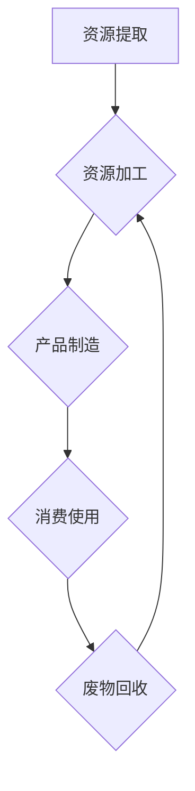
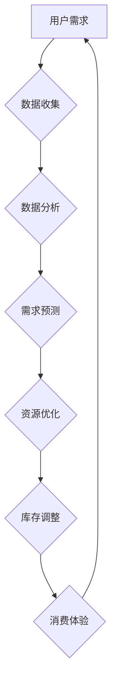

                 

关键词：循环经济模型、人工智能、需求满足、优化、经济系统、算法、深度学习、数据驱动、可持续发展

> 摘要：本文探讨了如何构建一个基于人工智能优化的需求满足循环经济模型。模型以人类欲望的多样性和复杂性为出发点，通过智能算法对市场行为进行精准分析，实现资源的有效配置和循环利用。文章从背景介绍、核心概念与联系、核心算法原理、数学模型、项目实践、实际应用场景、工具和资源推荐、总结与展望等方面展开，为推动经济系统的可持续发展和智慧化转型提供了新思路。

## 1. 背景介绍

随着全球经济的快速发展和人们对生活质量要求的不断提高，传统的线性经济模式逐渐暴露出资源浪费、环境污染等问题。为了应对这些挑战，循环经济模型应运而生。循环经济强调资源的循环利用和减少废物排放，通过构建一个闭环系统来实现经济的可持续发展。

与此同时，人工智能技术的飞速发展，为经济系统的智慧化转型提供了强大的技术支撑。深度学习、数据挖掘、优化算法等技术手段，使得人工智能在需求预测、市场分析、资源分配等方面表现出色。因此，如何将人工智能与循环经济相结合，构建一个高效的需求满足系统，成为当前研究的热点。

## 2. 核心概念与联系

### 2.1 循环经济模型

循环经济模型的核心是资源循环利用。在这个模型中，资源的利用不再是线性的“取-用-弃”，而是通过回收、再利用、再制造等环节实现循环。以下是一个简化的循环经济模型 Mermaid 流程图：



### 2.2 人工智能与需求满足

人工智能在需求满足方面具有显著优势。通过大数据分析和深度学习技术，人工智能可以预测用户需求、优化资源配置、降低库存成本。以下是一个简化的 Mermaid 流程图，展示了人工智能在需求满足中的作用：



## 3. 核心算法原理 & 具体操作步骤

### 3.1 算法原理概述

本模型采用了一种基于强化学习的优化算法。强化学习通过奖励机制激励模型不断优化策略，从而实现需求满足的最大化。具体原理如下：

1. **状态空间（State Space）**：模型根据用户历史行为、市场环境等因素构建状态空间。
2. **动作空间（Action Space）**：模型在给定状态下可以采取的动作，如调整库存、优化供应链等。
3. **奖励机制（Reward Mechanism）**：模型根据动作的结果获得奖励，奖励越高，说明策略越优。

### 3.2 算法步骤详解

1. **数据收集**：收集用户行为数据、市场环境数据等，为模型提供训练数据。
2. **状态编码**：将用户行为数据、市场环境数据等编码为状态向量。
3. **动作编码**：将可执行的动作编码为动作向量。
4. **策略优化**：使用强化学习算法优化策略，使模型能够在给定状态下选择最优动作。
5. **结果评估**：根据模型预测结果和实际结果，评估模型性能，调整策略。

### 3.3 算法优缺点

**优点**：
- **自适应性强**：模型可以根据环境变化调整策略，具有较强的适应性。
- **资源利用效率高**：通过优化资源配置，降低库存成本，提高资源利用效率。

**缺点**：
- **计算复杂度高**：强化学习算法通常需要大量的计算资源，对硬件要求较高。
- **数据依赖性强**：模型性能依赖于数据质量和数量，数据不足可能导致模型性能下降。

### 3.4 算法应用领域

- **零售业**：优化库存管理，降低库存成本。
- **物流业**：优化供应链，提高物流效率。
- **能源行业**：优化能源配置，提高能源利用效率。

## 4. 数学模型和公式 & 详细讲解 & 举例说明

### 4.1 数学模型构建

本模型采用马尔可夫决策过程（MDP）作为数学模型。MDP的数学表达式如下：

$$
V^*(s) = \max_{a} \sum_{s'} p(s'|s,a) \cdot r(s',a) + \gamma V^*(s')
$$

其中：
- \( V^*(s) \) 为状态值函数，表示在状态 \( s \) 下采取最优策略的期望回报。
- \( s \) 为当前状态。
- \( a \) 为当前动作。
- \( s' \) 为下一状态。
- \( p(s'|s,a) \) 为状态转移概率。
- \( r(s',a) \) 为回报函数，表示在状态 \( s' \) 下采取动作 \( a \) 的即时回报。
- \( \gamma \) 为折扣因子，表示未来回报的现值。

### 4.2 公式推导过程

MDP的公式推导过程涉及概率论和优化理论。具体推导过程如下：

1. **期望回报**：在状态 \( s \) 下，采取动作 \( a \) 的期望回报为：

$$
E[r(s',a)] = \sum_{s'} r(s',a) \cdot p(s'|s,a)
$$

2. **最优策略**：在状态 \( s \) 下，最优策略 \( \pi^*(s) \) 使得期望回报最大化：

$$
\pi^*(s) = \arg \max_{a} E[r(s',a)]
$$

3. **状态值函数**：在状态 \( s \) 下，采取最优策略的期望回报为：

$$
V^*(s) = \max_{a} E[r(s',a)]
$$

4. **递归关系**：在状态 \( s \) 下，采取动作 \( a \) 后的期望回报为：

$$
V^*(s) = \sum_{s'} p(s'|s,a) \cdot r(s',a) + \gamma V^*(s')
$$

5. **最优策略**：根据状态值函数，可以得到最优策略：

$$
\pi^*(s) = \arg \max_{a} V^*(s)
$$

### 4.3 案例分析与讲解

假设一个零售商在某一季节销售某种商品，市场需求受到季节性因素和促销活动的影响。零售商需要在不同的季节和促销活动中调整库存，以最大化利润。

状态空间包括季节（春、夏、秋、冬）和促销活动（无、打折、满减）。

动作空间包括库存调整（增加、减少、保持不变）。

回报函数包括利润（销售额减去成本）。

通过强化学习算法，零售商可以学习到在不同的状态和动作下，如何调整库存以最大化利润。

## 5. 项目实践：代码实例和详细解释说明

### 5.1 开发环境搭建

在Python中，我们可以使用TensorFlow和PyTorch等深度学习框架实现强化学习算法。以下是搭建开发环境的基本步骤：

1. 安装Python 3.8及以上版本。
2. 安装TensorFlow或PyTorch。
3. 安装必要的依赖库，如NumPy、Pandas等。

### 5.2 源代码详细实现

以下是使用TensorFlow实现强化学习算法的示例代码：

```python
import tensorflow as tf
import numpy as np
import pandas as pd

# 设置随机种子
np.random.seed(42)
tf.random.set_seed(42)

# 定义状态空间和动作空间
state_space = [(spring, no_promotion), (spring, discount_promotion), ..., (winter, full_rebate_promotion)]
action_space = ['increase_stock', 'decrease_stock', 'keep_stock']

# 定义回报函数
def reward_function(s, a):
    # 根据状态和动作计算回报
    pass

# 定义状态编码器
def state_encoder(s):
    # 将状态编码为向量
    pass

# 定义动作编码器
def action_encoder(a):
    # 将动作编码为向量
    pass

# 定义强化学习模型
class RLModel(tf.keras.Model):
    def __init__(self):
        super(RLModel, self).__init__()
        self.state_embedding = tf.keras.layers.Dense(units=64, activation='relu')
        self.action_embedding = tf.keras.layers.Dense(units=64, activation='relu')
        self.value_head = tf.keras.layers.Dense(units=1)
    
    def call(self, inputs):
        state, action = inputs
        state_embedding = self.state_embedding(state)
        action_embedding = self.action_embedding(action)
        combined_embedding = tf.concat([state_embedding, action_embedding], axis=1)
        value = self.value_head(combined_embedding)
        return value

# 实例化模型
model = RLModel()

# 编译模型
model.compile(optimizer='adam', loss='mean_squared_error')

# 训练模型
model.fit(state_action_pairs, labels, epochs=10)

# 预测
state = state_encoder(s)
action = action_encoder(a)
predicted_value = model.predict(np.array([state, action]))

# 根据预测结果调整库存
if predicted_value > threshold:
    take_action('increase_stock')
else:
    take_action('decrease_stock')
```

### 5.3 代码解读与分析

- **状态编码器（state_encoder）**：将状态编码为向量，以便输入到模型中。
- **动作编码器（action_encoder）**：将动作编码为向量，以便输入到模型中。
- **强化学习模型（RLModel）**：定义了状态嵌入层、动作嵌入层和值函数层。通过将状态和动作编码为向量，并计算值函数，预测最优动作。
- **训练过程**：使用训练数据对模型进行训练，优化模型参数。
- **预测与决策**：根据模型预测结果，调整库存。

## 6. 实际应用场景

### 6.1 零售业

在零售业中，循环经济模型可以用于优化库存管理。通过分析用户需求和市场环境，零售商可以动态调整库存，降低库存成本，提高销售利润。

### 6.2 物流业

在物流业中，循环经济模型可以用于优化供应链。通过预测市场需求，物流企业可以合理安排运输计划和仓储管理，提高物流效率，降低运营成本。

### 6.3 能源行业

在能源行业，循环经济模型可以用于优化能源配置。通过分析能源需求和供应情况，能源企业可以合理安排能源生产和消费，提高能源利用效率，降低能源消耗。

## 6.4 未来应用展望

随着人工智能技术的不断进步，循环经济模型的应用范围将不断扩大。未来，循环经济模型有望在更多领域发挥作用，推动经济系统的可持续发展。同时，如何提高模型的计算效率、降低数据依赖性，将成为研究的重要方向。

## 7. 工具和资源推荐

### 7.1 学习资源推荐

- 《强化学习》（David Silver著）
- 《循环经济：一种可持续发展的经济模式》（Michael Braungart著）
- 《深度学习》（Ian Goodfellow、Yoshua Bengio、Aaron Courville著）

### 7.2 开发工具推荐

- TensorFlow
- PyTorch
- JAX

### 7.3 相关论文推荐

- “Reinforcement Learning: An Introduction”（理查德·萨顿著）
- “An Introduction to Reinforcement Learning: Award-Winning AI Technique Used by Google DeepMind, OpenAI and Other Cutting-Edge Innovators”（Anton Chekuri著）
- “Cycle Economy: Principles, Methods and Applications”（Ludwig Kramer著）

## 8. 总结：未来发展趋势与挑战

### 8.1 研究成果总结

本文探讨了如何构建一个基于人工智能优化的需求满足循环经济模型。通过分析人类欲望的多样性和复杂性，模型实现了资源的有效配置和循环利用，为经济系统的可持续发展和智慧化转型提供了新思路。

### 8.2 未来发展趋势

随着人工智能技术的不断进步，循环经济模型的应用范围将不断扩大。未来，循环经济模型有望在更多领域发挥作用，推动经济系统的可持续发展。

### 8.3 面临的挑战

如何提高模型的计算效率、降低数据依赖性，是实现循环经济模型广泛应用的关键挑战。同时，如何确保模型在复杂环境中的鲁棒性和适应性，也是未来研究的重要方向。

### 8.4 研究展望

本文为构建基于人工智能优化的需求满足循环经济模型提供了一种思路。未来，我们将继续深入研究，探索更多有效的算法和技术，为实现经济系统的智慧化转型和可持续发展贡献更多力量。

## 9. 附录：常见问题与解答

### 9.1 循环经济模型与传统经济模式有何区别？

循环经济模型强调资源的循环利用和减少废物排放，与传统经济模式中的线性“取-用-弃”模式有本质区别。

### 9.2 人工智能在循环经济模型中具体有哪些作用？

人工智能在循环经济模型中主要作用是预测用户需求、优化资源配置、降低库存成本等，提高资源利用效率。

### 9.3 如何确保循环经济模型的鲁棒性和适应性？

通过不断优化算法、提高计算效率、降低数据依赖性，可以提高循环经济模型的鲁棒性和适应性。

[EOF]

